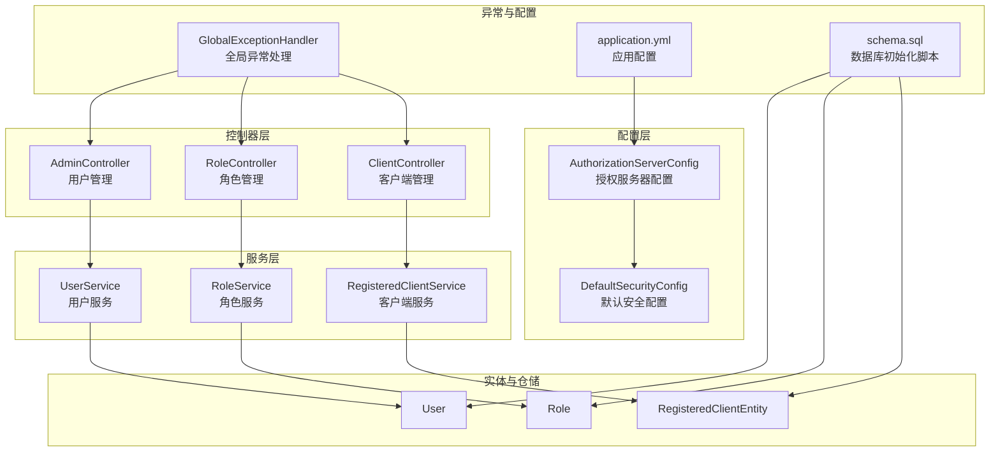
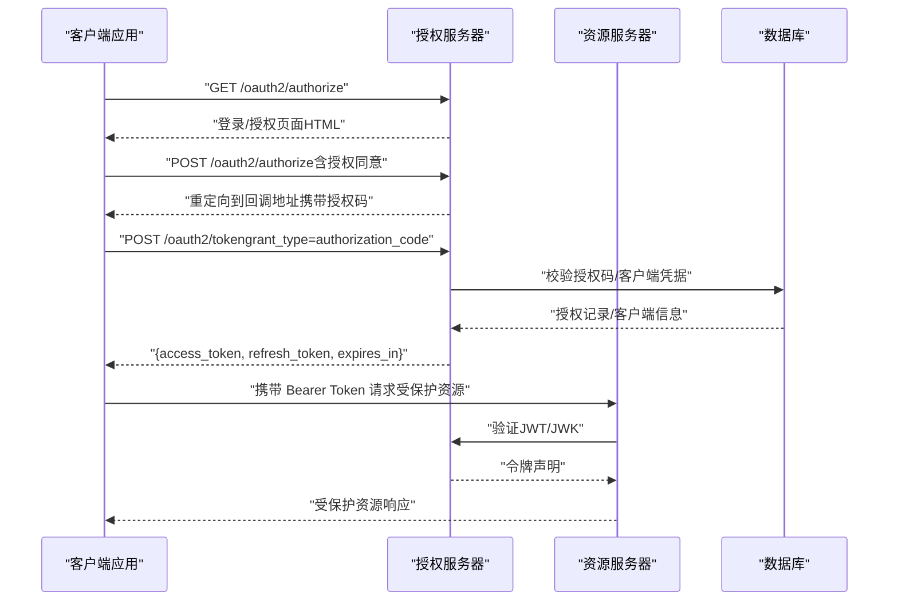
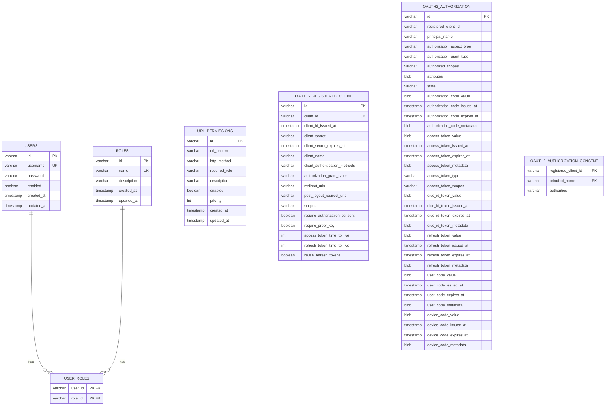
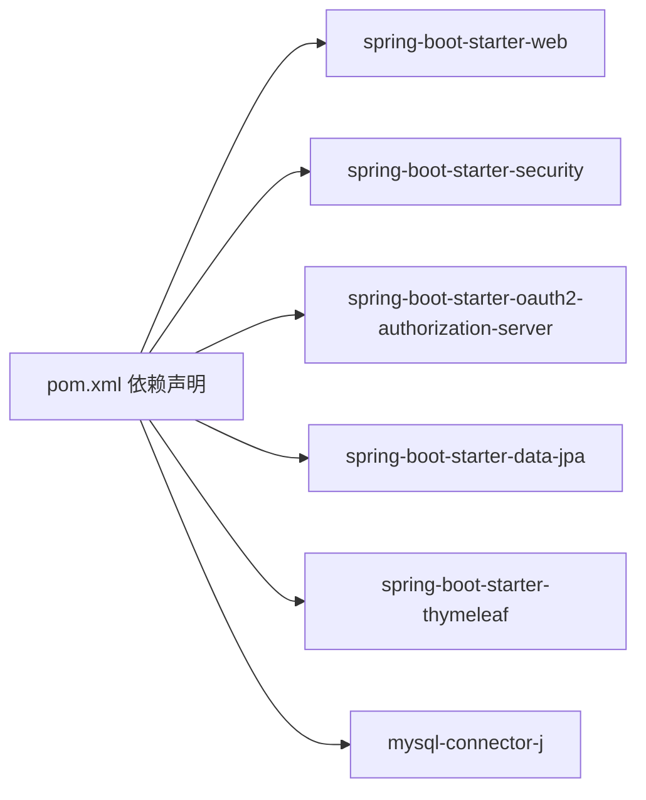

# API参考

<cite>
**本文引用的文件**
- [AuthServerApplication.java](file://src/main/java/com/example/authserver/AuthServerApplication.java)
- [AuthorizationServerConfig.java](file://src/main/java/com/example/authserver/config/AuthorizationServerConfig.java)
- [DefaultSecurityConfig.java](file://src/main/java/com/example/authserver/config/DefaultSecurityConfig.java)
- [application.yml](file://src/main/resources/application.yml)
- [AdminController.java](file://src/main/java/com/example/authserver/controller/AdminController.java)
- [ClientController.java](file://src/main/java/com/example/authserver/controller/ClientController.java)
- [RoleController.java](file://src/main/java/com/example/authserver/controller/RoleController.java)
- [UserService.java](file://src/main/java/com/example/authserver/service/UserService.java)
- [RoleService.java](file://src/main/java/com/example/authserver/service/RoleService.java)
- [RegisteredClientService.java](file://src/main/java/com/example/authserver/service/RegisteredClientService.java)
- [User.java](file://src/main/java/com/example/authserver/entity/User.java)
- [Role.java](file://src/main/java/com/example/authserver/entity/Role.java)
- [RegisteredClientEntity.java](file://src/main/java/com/example/authserver/entity/RegisteredClientEntity.java)
- [GlobalExceptionHandler.java](file://src/main/java/com/example/authserver/exception/GlobalExceptionHandler.java)
- [schema.sql](file://src/main/resources/schema.sql)
- [pom.xml](file://pom.xml)
</cite>

## 目录
1. [简介](#简介)
2. [项目结构](#项目结构)
3. [核心组件](#核心组件)
4. [架构总览](#架构总览)
5. [详细组件分析](#详细组件分析)
6. [依赖分析](#依赖分析)
7. [性能考虑](#性能考虑)
8. [故障排查指南](#故障排查指南)
9. [结论](#结论)
10. [附录](#附录)

## 简介
本文件为该Spring Security OAuth2认证服务器的完整API参考文档，覆盖以下内容：
- OAuth2授权端点与令牌端点的协议说明与使用示例
- 管理API的接口规范（用户管理、角色管理、客户端管理的CRUD）
- API认证方式（Bearer Token）与错误处理机制
- API版本控制策略与向后兼容性说明
- API测试工具与调试技巧

## 项目结构
该应用采用Spring Boot + Spring Security OAuth2 Authorization Server构建，核心模块划分如下：
- 配置层：授权服务器与默认安全配置
- 控制器层：管理端页面与管理API
- 服务层：用户、角色、客户端业务逻辑
- 实体与仓储：用户、角色、客户端、URL权限规则等
- 异常处理：全局异常映射与统一错误响应
- 数据库：初始化脚本与表结构

图表来源
- [AuthorizationServerConfig.java:56-77](file://src/main/java/com/example/authserver/config/AuthorizationServerConfig.java#L56-L77)
- [DefaultSecurityConfig.java:55-73](file://src/main/java/com/example/authserver/config/DefaultSecurityConfig.java#L55-L73)
- [AdminController.java:24-26](file://src/main/java/com/example/authserver/controller/AdminController.java#L24-L26)
- [RoleController.java:24-26](file://src/main/java/com/example/authserver/controller/RoleController.java#L24-L26)
- [ClientController.java:24-26](file://src/main/java/com/example/authserver/controller/ClientController.java#L24-L26)
- [UserService.java:24-28](file://src/main/java/com/example/authserver/service/UserService.java#L24-L28)
- [RoleService.java:25-29](file://src/main/java/com/example/authserver/service/RoleService.java#L25-L29)
- [RegisteredClientService.java:23-26](file://src/main/java/com/example/authserver/service/RegisteredClientService.java#L23-L26)
- [GlobalExceptionHandler.java:23-23](file://src/main/java/com/example/authserver/exception/GlobalExceptionHandler.java#L23-L23)
- [application.yml:1-29](file://src/main/resources/application.yml#L1-L29)
- [schema.sql:8-169](file://src/main/resources/schema.sql#L8-L169)

章节来源
- [AuthServerApplication.java:1-14](file://src/main/java/com/example/authserver/AuthServerApplication.java#L1-L14)
- [AuthorizationServerConfig.java:56-77](file://src/main/java/com/example/authserver/config/AuthorizationServerConfig.java#L56-L77)
- [DefaultSecurityConfig.java:55-73](file://src/main/java/com/example/authserver/config/DefaultSecurityConfig.java#L55-L73)
- [application.yml:1-29](file://src/main/resources/application.yml#L1-L29)
- [schema.sql:8-169](file://src/main/resources/schema.sql#L8-L169)

## 核心组件
- 授权服务器配置：启用OAuth2 Authorization Server默认安全、OIDC支持、JWT资源服务器、登录入口与异常处理。
- 默认安全配置：表单登录、静态资源放行、/oauth2/**端点放行、其余请求需认证。
- 管理API：用户管理、角色管理、客户端管理的CRUD接口，均通过表单提交与重定向返回消息。
- 异常处理：统一错误响应格式，覆盖常见业务异常与安全异常。

章节来源
- [AuthorizationServerConfig.java:56-77](file://src/main/java/com/example/authserver/config/AuthorizationServerConfig.java#L56-L77)
- [DefaultSecurityConfig.java:55-73](file://src/main/java/com/example/authserver/config/DefaultSecurityConfig.java#L55-L73)
- [GlobalExceptionHandler.java:28-117](file://src/main/java/com/example/authserver/exception/GlobalExceptionHandler.java#L28-L117)

## 架构总览
下图展示OAuth2授权流程与管理API交互的关键节点：

图表来源
- [AuthorizationServerConfig.java:62-74](file://src/main/java/com/example/authserver/config/AuthorizationServerConfig.java#L62-L74)
- [DefaultSecurityConfig.java:57-70](file://src/main/java/com/example/authserver/config/DefaultSecurityConfig.java#L57-L70)
- [schema.sql:84-141](file://src/main/resources/schema.sql#L84-L141)

## 详细组件分析

### OAuth2授权端点与令牌端点
- 授权端点
  - 方法与路径：GET /oauth2/authorize
  - 功能：发起授权流程，引导用户登录并同意授权范围；若未认证，重定向至登录页。
  - 认证要求：未认证访问会被重定向至登录页。
  - 返回：HTML授权页面或重定向到客户端回调地址。
- 令牌端点
  - 方法与路径：POST /oauth2/token
  - 功能：根据授权码/客户端凭证等发放访问令牌与刷新令牌；支持客户端凭证模式。
  - 认证方式：支持Basic认证（客户端密钥）与表单提交。
  - 返回：标准OAuth2令牌响应（access_token、expires_in、token_type等）。
- OIDC支持
  - 启用OpenID Connect 1.0，支持ID Token与标准scope（openid、profile、email）。
- 资源服务器
  - 使用JWT解码器验证访问令牌，支持用户信息端点与客户端注册端点的令牌访问。

章节来源
- [AuthorizationServerConfig.java:62-74](file://src/main/java/com/example/authserver/config/AuthorizationServerConfig.java#L62-L74)
- [DefaultSecurityConfig.java:62-62](file://src/main/java/com/example/authserver/config/DefaultSecurityConfig.java#L62-L62)

### 管理API（用户管理）
- 管理端点
  - GET /admin/dashboard：管理员仪表盘首页
  - GET /admin/users：用户列表（支持分页与关键词搜索）
  - GET /admin/users/check-username：AJAX用户名存在性检查
  - POST /admin/users/add：新增用户（表单参数：username、password、roles、enabled）
  - POST /admin/users/update：更新用户（表单参数：username、password可选、enabled）
  - POST /admin/users/delete：删除用户（表单参数：username）
  - POST /admin/users/authorities：修改用户权限（表单参数：username、authorities[]）
- 请求与响应
  - 请求：表单提交（Content-Type: application/x-www-form-urlencoded）
  - 响应：重定向至列表页，携带Flash消息（successMessage/errorMessage）。
- 错误处理
  - 参数校验失败、业务冲突、资源不存在等通过全局异常映射返回统一错误格式。
- 示例
  - 新增用户：POST /admin/users/add，表单字段包含username、password、roles（数组）、enabled。
  - 更新用户权限：POST /admin/users/authorities，username与authorities[]。

章节来源
- [AdminController.java:33-117](file://src/main/java/com/example/authserver/controller/AdminController.java#L33-L117)
- [AdminController.java:122-129](file://src/main/java/com/example/authserver/controller/AdminController.java#L122-L129)
- [AdminController.java:134-167](file://src/main/java/com/example/authserver/controller/AdminController.java#L134-L167)
- [AdminController.java:172-197](file://src/main/java/com/example/authserver/controller/AdminController.java#L172-L197)
- [AdminController.java:202-225](file://src/main/java/com/example/authserver/controller/AdminController.java#L202-L225)
- [AdminController.java:230-269](file://src/main/java/com/example/authserver/controller/AdminController.java#L230-L269)
- [UserService.java:58-104](file://src/main/java/com/example/authserver/service/UserService.java#L58-L104)
- [UserService.java:109-129](file://src/main/java/com/example/authserver/service/UserService.java#L109-L129)
- [UserService.java:134-144](file://src/main/java/com/example/authserver/service/UserService.java#L134-L144)
- [UserService.java:149-176](file://src/main/java/com/example/authserver/service/UserService.java#L149-L176)
- [GlobalExceptionHandler.java:28-45](file://src/main/java/com/example/authserver/exception/GlobalExceptionHandler.java#L28-L45)

### 管理API（角色管理）
- 管理端点
  - GET /admin/roles：角色列表（支持成功消息提示）
  - GET /admin/roles/check-exists：AJAX角色存在性检查
  - POST /admin/roles/add：新增角色（表单参数：roleName、description）
  - POST /admin/roles/delete：删除角色（表单参数：roleName）
  - POST /admin/roles/update：更新角色描述（表单参数：roleName、description）
  - GET /admin/roles/{roleName}：查看角色详情（含用户列表与URL权限规则）
  - POST /admin/roles/{roleName}/permissions：为角色分配URL权限规则（表单参数：urlPatterns[]）
  - POST /admin/roles/{roleName}/permissions/remove：删除角色的URL权限规则（表单参数：urlPatterns[]）
- 请求与响应
  - 请求：表单提交（Content-Type: application/x-www-form-urlencoded）
  - 响应：重定向至列表页或详情页，携带Flash消息。
- 错误处理
  - 内置角色保护、角色已存在、角色不存在、URL权限规则分配/删除异常等。
- 示例
  - 新增角色：POST /admin/roles/add，roleName必须以ROLE_开头或自动补全。
  - 分配URL权限：POST /admin/roles/{roleName}/permissions，urlPatterns[]为URL模式数组。

章节来源
- [RoleController.java:34-62](file://src/main/java/com/example/authserver/controller/RoleController.java#L34-L62)
- [RoleController.java:67-77](file://src/main/java/com/example/authserver/controller/RoleController.java#L67-L77)
- [RoleController.java:82-118](file://src/main/java/com/example/authserver/controller/RoleController.java#L82-L118)
- [RoleController.java:123-150](file://src/main/java/com/example/authserver/controller/RoleController.java#L123-L150)
- [RoleController.java:155-178](file://src/main/java/com/example/authserver/controller/RoleController.java#L155-L178)
- [RoleController.java:183-225](file://src/main/java/com/example/authserver/controller/RoleController.java#L183-L225)
- [RoleController.java:230-254](file://src/main/java/com/example/authserver/controller/RoleController.java#L230-L254)
- [RoleController.java:259-283](file://src/main/java/com/example/authserver/controller/RoleController.java#L259-L283)
- [RoleService.java:57-76](file://src/main/java/com/example/authserver/service/RoleService.java#L57-L76)
- [RoleService.java:94-107](file://src/main/java/com/example/authserver/service/RoleService.java#L94-L107)
- [RoleService.java:113-149](file://src/main/java/com/example/authserver/service/RoleService.java#L113-L149)
- [RoleService.java:196-218](file://src/main/java/com/example/authserver/service/RoleService.java#L196-L218)
- [RoleService.java:223-233](file://src/main/java/com/example/authserver/service/RoleService.java#L223-L233)
- [GlobalExceptionHandler.java:108-117](file://src/main/java/com/example/authserver/exception/GlobalExceptionHandler.java#L108-L117)

### 管理API（客户端管理）
- 管理端点
  - GET /admin/clients：客户端列表（预处理逗号分隔字段）
  - POST /admin/clients/create 与 POST /admin/clients/add：创建客户端（表单参数丰富）
  - POST /admin/clients/delete：删除客户端（表单参数：id）
  - GET /admin/clients/detail/{clientId}：获取客户端详情（JSON）
  - POST /admin/clients/update：更新客户端（表单参数丰富）
- 请求与响应
  - 请求：表单提交（Content-Type: application/x-www-form-urlencoded）
  - 响应：重定向至列表页，携带Flash消息；详情接口返回JSON。
- 错误处理
  - 客户端ID重复、URI格式校验、授权模式/范围必填等。
- 示例
  - 创建客户端：POST /admin/clients/create，clientId可自动生成；clientSecret为空时按认证方式生成；scopes为空时默认openid,profile。
  - 获取详情：GET /admin/clients/detail/{clientId}，返回clientId、clientName、clientSecret、grantTypes、scopes、TTL等。

章节来源
- [ClientController.java:33-67](file://src/main/java/com/example/authserver/controller/ClientController.java#L33-L67)
- [ClientController.java:93-186](file://src/main/java/com/example/authserver/controller/ClientController.java#L93-L186)
- [ClientController.java:191-212](file://src/main/java/com/example/authserver/controller/ClientController.java#L191-L212)
- [ClientController.java:217-250](file://src/main/java/com/example/authserver/controller/ClientController.java#L217-L250)
- [ClientController.java:255-358](file://src/main/java/com/example/authserver/controller/ClientController.java#L255-L358)
- [RegisteredClientService.java:38-49](file://src/main/java/com/example/authserver/service/RegisteredClientService.java#L38-L49)
- [RegisteredClientService.java:77-82](file://src/main/java/com/example/authserver/service/RegisteredClientService.java#L77-L82)
- [RegisteredClientService.java:87-102](file://src/main/java/com/example/authserver/service/RegisteredClientService.java#L87-L102)
- [RegisteredClientService.java:114-129](file://src/main/java/com/example/authserver/service/RegisteredClientService.java#L114-L129)
- [GlobalExceptionHandler.java:108-117](file://src/main/java/com/example/authserver/exception/GlobalExceptionHandler.java#L108-L117)

### 数据模型

图表来源
- [schema.sql:8-169](file://src/main/resources/schema.sql#L8-L169)

章节来源
- [User.java:20-66](file://src/main/java/com/example/authserver/entity/User.java#L20-L66)
- [Role.java:20-62](file://src/main/java/com/example/authserver/entity/Role.java#L20-L62)
- [RegisteredClientEntity.java:11-111](file://src/main/java/com/example/authserver/entity/RegisteredClientEntity.java#L11-L111)
- [schema.sql:8-169](file://src/main/resources/schema.sql#L8-L169)

### API认证方式与使用示例
- Bearer Token
  - 资源服务器通过JWT解码器验证访问令牌，支持用户信息端点与客户端注册端点的令牌访问。
  - 使用方式：在HTTP请求头中携带Authorization: Bearer <access_token>。
- OAuth2授权流程
  - 授权端点：GET /oauth2/authorize，引导用户登录与授权。
  - 令牌端点：POST /oauth2/token，换取访问令牌与刷新令牌。
- 示例
  - 资源访问：携带Bearer Token访问受保护资源。
  - 客户端凭证：POST /oauth2/token，grant_type=client_credentials，适用于服务间调用。

章节来源
- [AuthorizationServerConfig.java:73-74](file://src/main/java/com/example/authserver/config/AuthorizationServerConfig.java#L73-L74)
- [AuthorizationServerConfig.java:242-245](file://src/main/java/com/example/authserver/config/AuthorizationServerConfig.java#L242-L245)

### 错误码定义与错误处理机制
- 统一错误响应字段
  - timestamp：错误发生时间
  - status：HTTP状态码
  - message：错误消息
  - fieldErrors（可选）：参数校验失败字段映射
- 常见错误
  - 400 参数验证失败、非法参数
  - 401 凭证错误（用户名或密码错误）
  - 403 访问被拒绝（权限不足）
  - 404 资源不存在（用户、角色、客户端等）
  - 409 资源冲突（用户名、客户端ID已存在等）
  - 500 系统内部错误
- 示例
  - 参数校验失败：返回400，包含fieldErrors字段。
  - 用户名未找到：返回404。

章节来源
- [GlobalExceptionHandler.java:28-117](file://src/main/java/com/example/authserver/exception/GlobalExceptionHandler.java#L28-L117)

### API版本控制策略与向后兼容性
- 版本策略
  - 项目版本：0.0.1-SNAPSHOT（快照版本，开发阶段）
  - OAuth2/OIDC协议遵循Spring Authorization Server默认实现，建议在升级Spring Security版本时关注变更日志。
- 向后兼容性
  - 授权服务器默认配置与JDBC存储保持与Spring Authorization Server兼容。
  - 数据库表结构遵循标准字段命名，便于迁移与扩展。

章节来源
- [pom.xml:18-21](file://pom.xml#L18-L21)
- [AuthorizationServerConfig.java:193-206](file://src/main/java/com/example/authserver/config/AuthorizationServerConfig.java#L193-L206)

### API测试工具与调试技巧
- 推荐工具
  - curl：命令行测试授权端点与令牌端点
  - Postman：图形化管理请求集合，便于维护Bearer Token与授权流程
  - Insomnia：支持OAuth2授权码流程与客户端凭证模式
- 调试技巧
  - 启用DEBUG日志：application.yml中设置日志级别为DEBUG，观察授权与令牌发放过程
  - 数据库验证：检查oauth2_authorization与oauth2_registered_client表记录
  - 端点放行：/oauth2/**与登录页已放行，便于手动验证流程

章节来源
- [application.yml:26-28](file://src/main/resources/application.yml#L26-L28)
- [DefaultSecurityConfig.java:62-62](file://src/main/java/com/example/authserver/config/DefaultSecurityConfig.java#L62-L62)
- [schema.sql:84-141](file://src/main/resources/schema.sql#L84-L141)

## 依赖分析
- 外部依赖
  - Spring Boot Starter Web、Security、OAuth2 Authorization Server、Data JPA、Thymeleaf
  - MySQL Connector
- 内部依赖
  - 控制器依赖对应服务类
  - 服务类依赖仓储与实体
  - 异常处理统一映射各控制器与服务层抛出的异常

图表来源
- [pom.xml:29-114](file://pom.xml#L29-L114)

章节来源
- [pom.xml:29-114](file://pom.xml#L29-L114)

## 性能考虑
- 数据库索引：用户与角色唯一索引、URL权限索引、OAuth2客户端唯一索引，有助于提升查询性能。
- Token TTL：不同客户端类型设置不同TTL，平衡安全性与性能。
- 日志级别：开发阶段开启DEBUG，生产环境建议调整为INFO或WARN。

## 故障排查指南
- 授权端点返回登录页
  - 检查是否已登录；确认/oa2/**端点已放行。
- 令牌端点返回401
  - 核对客户端认证方式与凭据；确认客户端ID与密钥正确。
- 用户/角色/客户端操作返回409或404
  - 检查是否存在重复或资源不存在；查看全局异常映射返回的具体消息。
- 资源访问返回403
  - 检查角色与URL权限规则配置；确认Bearer Token有效。

章节来源
- [DefaultSecurityConfig.java:62-62](file://src/main/java/com/example/authserver/config/DefaultSecurityConfig.java#L62-L62)
- [GlobalExceptionHandler.java:28-117](file://src/main/java/com/example/authserver/exception/GlobalExceptionHandler.java#L28-L117)

## 结论
本API参考文档覆盖了OAuth2授权与令牌端点、管理API的完整接口规范、认证方式、错误处理与测试调试建议。建议在生产部署前完善数据库索引、优化Token TTL、调整日志级别，并通过Postman/Insomnia等工具进行端到端验证。

## 附录
- 端点一览
  - 授权端点：GET /oauth2/authorize
  - 令牌端点：POST /oauth2/token
  - 管理API（用户）：GET /admin/users、POST /admin/users/add、POST /admin/users/update、POST /admin/users/delete、POST /admin/users/authorities
  - 管理API（角色）：GET /admin/roles、POST /admin/roles/add、POST /admin/roles/delete、POST /admin/roles/update、GET /admin/roles/{roleName}、POST /admin/roles/{roleName}/permissions、POST /admin/roles/{roleName}/permissions/remove
  - 管理API（客户端）：GET /admin/clients、POST /admin/clients/create、POST /admin/clients/delete、GET /admin/clients/detail/{clientId}、POST /admin/clients/update