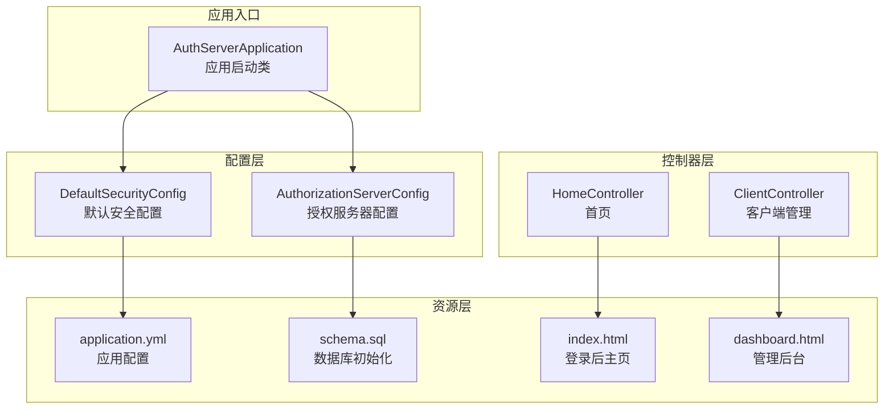
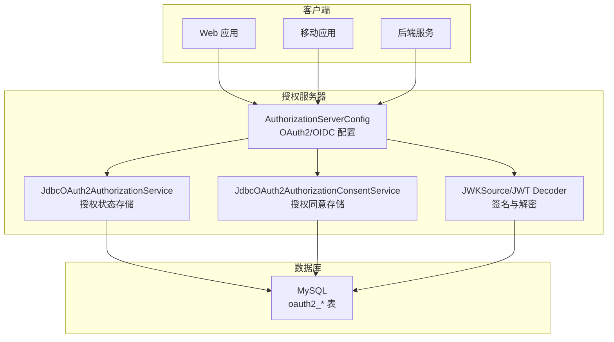
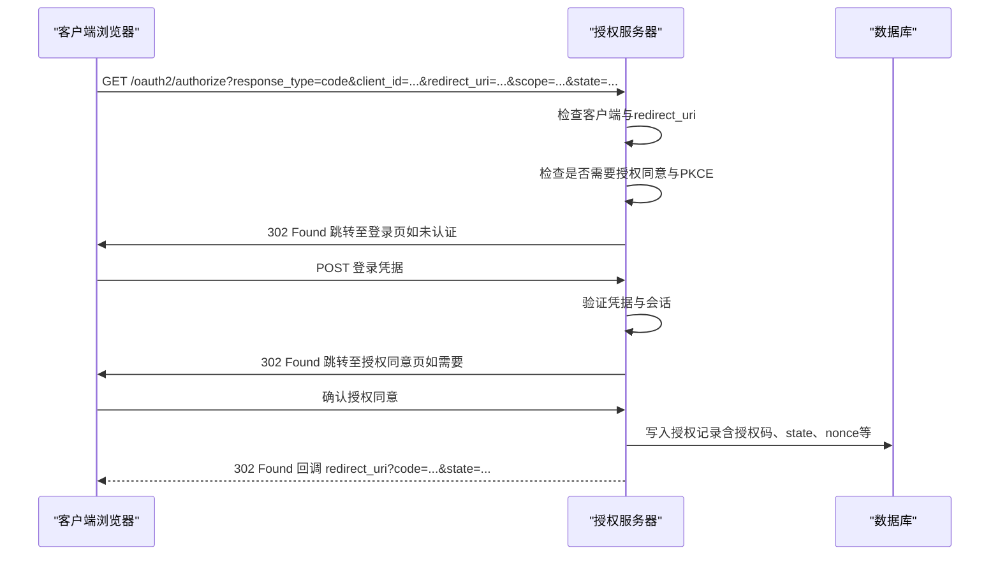
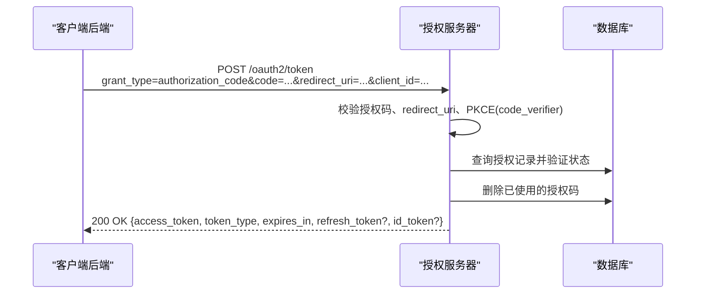
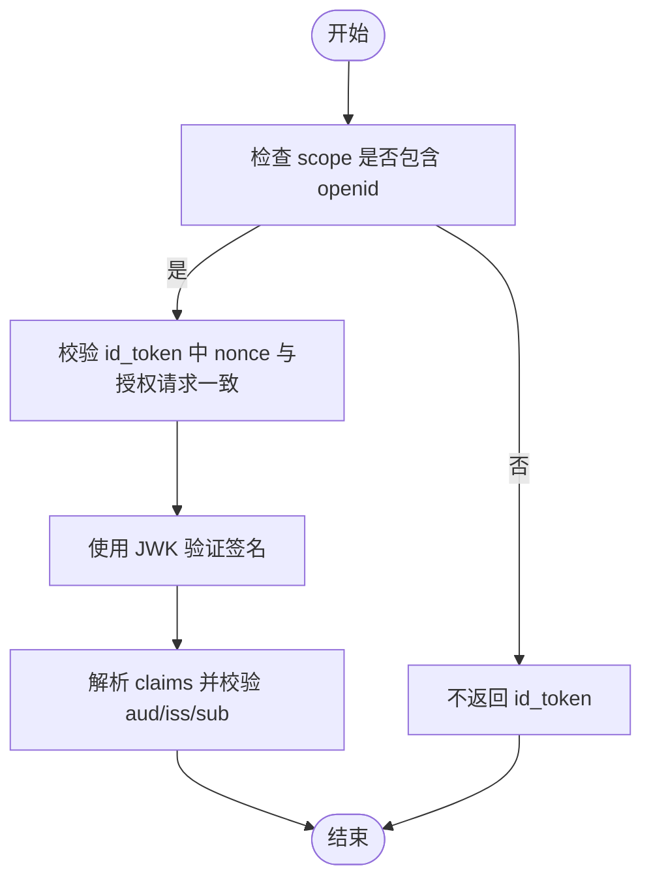
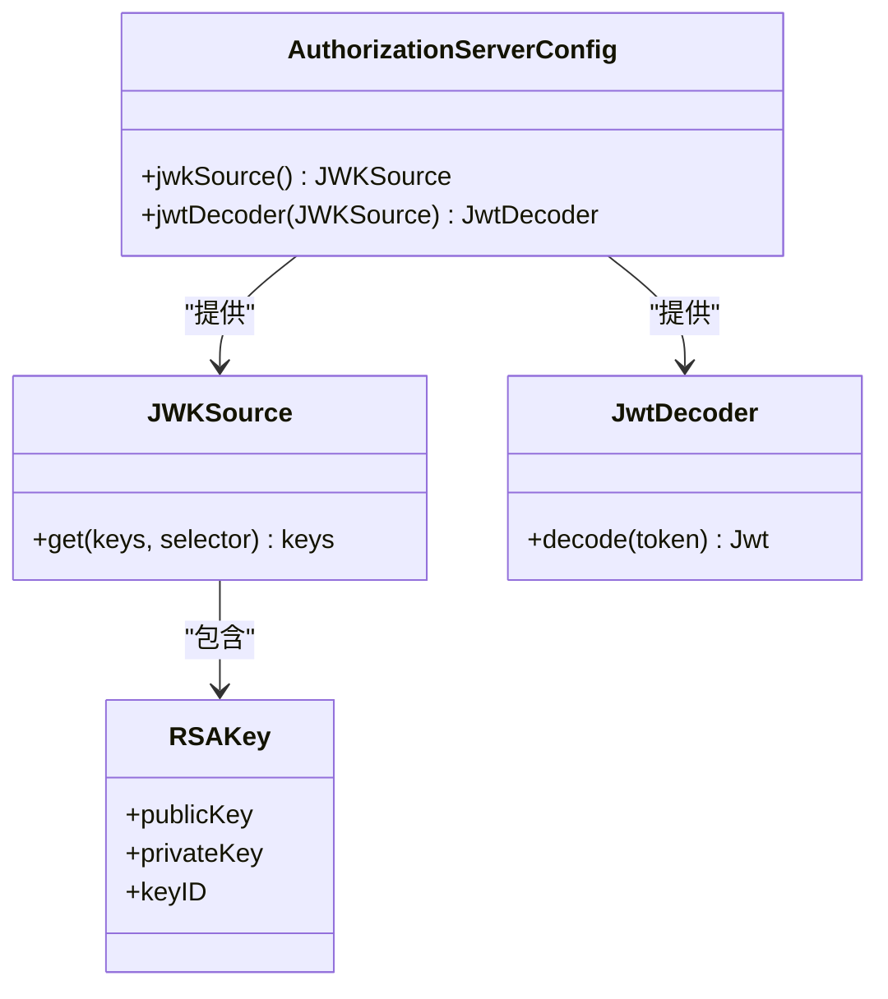
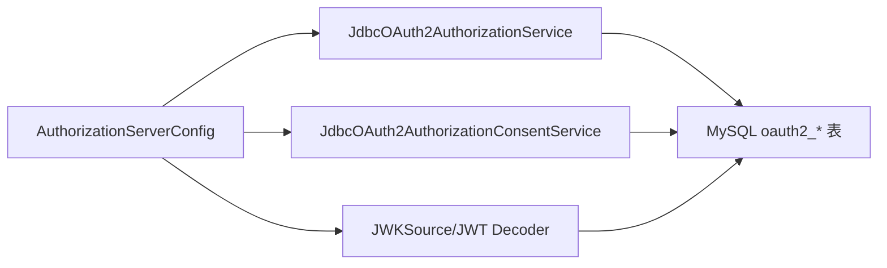

# OAuth2授权端点

<cite>
**本文档引用的文件**
- [AuthServerApplication.java](file://src/main/java/com/example/authserver/AuthServerApplication.java)
- [AuthorizationServerConfig.java](file://src/main/java/com/example/authserver/config/AuthorizationServerConfig.java)
- [DefaultSecurityConfig.java](file://src/main/java/com/example/authserver/config/DefaultSecurityConfig.java)
- [application.yml](file://src/main/resources/application.yml)
- [schema.sql](file://src/main/resources/schema.sql)
- [GlobalExceptionHandler.java](file://src/main/java/com/example/authserver/exception/GlobalExceptionHandler.java)
- [HomeController.java](file://src/main/java/com/example/authserver/controller/HomeController.java)
- [ClientController.java](file://src/main/java/com/example/authserver/controller/ClientController.java)
- [index.html](file://src/main/resources/templates/index.html)
- [dashboard.html](file://src/main/resources/templates/admin/dashboard.html)
</cite>

## 目录
1. [简介](#简介)
2. [项目结构](#项目结构)
3. [核心组件](#核心组件)
4. [架构总览](#架构总览)
5. [详细组件分析](#详细组件分析)
6. [依赖关系分析](#依赖关系分析)
7. [性能考虑](#性能考虑)
8. [故障排除指南](#故障排除指南)
9. [结论](#结论)

## 简介
本文件面向OAuth2授权服务器的授权端点（/oauth2/authorize）与令牌端点（/oauth2/token）的API文档，结合代码库中Spring Authorization Server的配置与数据库结构，系统性说明以下内容：
- 授权码模式的完整流程与参数要求
- 令牌交换的参数格式与返回结构
- OpenID Connect 1.0集成（id_token获取与验证要点）
- JWT令牌的生成、签名与验证机制
- 安全考量（CSRF防护、PKCE支持等）

## 项目结构
该代码库采用Spring Boot + Spring Security OAuth2 Authorization Server的标准分层结构：
- 配置层：授权服务器与安全配置
- 控制器层：基础页面与管理界面
- 数据层：数据库初始化脚本与JDBC存储
- 资源层：Thymeleaf模板与静态资源

**图表来源**
- [AuthServerApplication.java:1-14](file://src/main/java/com/example/authserver/AuthServerApplication.java#L1-L14)
- [AuthorizationServerConfig.java:1-256](file://src/main/java/com/example/authserver/config/AuthorizationServerConfig.java#L1-L256)
- [DefaultSecurityConfig.java:1-75](file://src/main/java/com/example/authserver/config/DefaultSecurityConfig.java#L1-L75)
- [application.yml:1-30](file://src/main/resources/application.yml#L1-L30)
- [schema.sql:1-169](file://src/main/resources/schema.sql#L1-L169)
- [HomeController.java:1-24](file://src/main/java/com/example/authserver/controller/HomeController.java#L1-L24)
- [ClientController.java:1-43](file://src/main/java/com/example/authserver/controller/ClientController.java#L1-L43)
- [index.html:1-200](file://src/main/resources/templates/index.html#L1-L200)
- [dashboard.html:1-200](file://src/main/resources/templates/admin/dashboard.html#L1-L200)

**章节来源**
- [AuthServerApplication.java:1-14](file://src/main/java/com/example/authserver/AuthServerApplication.java#L1-L14)
- [AuthorizationServerConfig.java:1-256](file://src/main/java/com/example/authserver/config/AuthorizationServerConfig.java#L1-L256)
- [DefaultSecurityConfig.java:1-75](file://src/main/java/com/example/authserver/config/DefaultSecurityConfig.java#L1-L75)
- [application.yml:1-30](file://src/main/resources/application.yml#L1-L30)
- [schema.sql:1-169](file://src/main/resources/schema.sql#L1-L169)

## 核心组件
- 授权服务器配置：启用OAuth2 Authorization Server默认安全、OIDC支持、JWT资源服务器、JDBC授权存储与JWK签名。
- 默认安全配置：表单登录、URL权限控制、密码编码器。
- 数据库初始化：oauth2_registered_client、oauth2_authorization、oauth2_authorization_consent等表结构。
- 异常处理：全局异常映射，便于定位授权/令牌端点的错误。

**章节来源**
- [AuthorizationServerConfig.java:56-77](file://src/main/java/com/example/authserver/config/AuthorizationServerConfig.java#L56-L77)
- [AuthorizationServerConfig.java:193-206](file://src/main/java/com/example/authserver/config/AuthorizationServerConfig.java#L193-L206)
- [AuthorizationServerConfig.java:211-245](file://src/main/java/com/example/authserver/config/AuthorizationServerConfig.java#L211-L245)
- [DefaultSecurityConfig.java:55-73](file://src/main/java/com/example/authserver/config/DefaultSecurityConfig.java#L55-L73)
- [schema.sql:60-141](file://src/main/resources/schema.sql#L60-L141)
- [GlobalExceptionHandler.java:21-130](file://src/main/java/com/example/authserver/exception/GlobalExceptionHandler.java#L21-L130)

## 架构总览
下图展示了授权端点与令牌端点在系统中的位置与交互关系：

**图表来源**
- [AuthorizationServerConfig.java:56-77](file://src/main/java/com/example/authserver/config/AuthorizationServerConfig.java#L56-L77)
- [AuthorizationServerConfig.java:193-206](file://src/main/java/com/example/authserver/config/AuthorizationServerConfig.java#L193-L206)
- [AuthorizationServerConfig.java:211-245](file://src/main/java/com/example/authserver/config/AuthorizationServerConfig.java#L211-L245)
- [schema.sql:84-141](file://src/main/resources/schema.sql#L84-L141)

## 详细组件分析

### 授权端点 /oauth2/authorize（授权码模式）
- 功能概述
  - 用于引导用户进行身份认证与授权同意，随后返回授权码给客户端。
  - 支持OIDC授权，可同时返回id_token、access_token与refresh_token（视配置而定）。
- 关键参数
  - response_type：授权码模式必须为“code”
  - client_id：客户端标识，需在oauth2_registered_client中注册
  - redirect_uri：必须与注册时的redirect_uris之一完全一致
  - scope：授权范围，如openid、profile、email、api.read等
  - state：用于防止CSRF攻击的状态参数，授权服务器会原样回传
  - nonce：OIDC必要参数，用于绑定id_token与一次性随机值
  - code_challenge与code_challenge_method：PKCE相关，移动端客户端强制要求
- 流程说明
  1) 未认证用户访问授权端点时，自动跳转至登录页
  2) 登录成功后进入授权同意页（若客户端要求授权同意）
  3) 用户同意后，授权服务器签发授权码并回调redirect_uri
  4) 客户端随后使用授权码换取令牌
- 安全要点
  - state参数必须校验一致性
  - redirect_uri必须严格匹配注册值
  - 移动端客户端强制PKCE（code_challenge）
  - 授权码具备时效性与一次性使用限制

**图表来源**
- [AuthorizationServerConfig.java:66-76](file://src/main/java/com/example/authserver/config/AuthorizationServerConfig.java#L66-L76)
- [AuthorizationServerConfig.java:117-136](file://src/main/java/com/example/authserver/config/AuthorizationServerConfig.java#L117-L136)
- [schema.sql:84-133](file://src/main/resources/schema.sql#L84-L133)

**章节来源**
- [AuthorizationServerConfig.java:66-76](file://src/main/java/com/example/authserver/config/AuthorizationServerConfig.java#L66-L76)
- [AuthorizationServerConfig.java:117-136](file://src/main/java/com/example/authserver/config/AuthorizationServerConfig.java#L117-L136)
- [schema.sql:84-133](file://src/main/resources/schema.sql#L84-L133)

### 令牌端点 /oauth2/token（授权码交换）
- 功能概述
  - 客户端使用授权码向授权服务器换取访问令牌、刷新令牌与id_token（如适用）
- 请求方式与头部
  - POST /oauth2/token
  - Content-Type: application/x-www-form-urlencoded
  - 客户端认证：依据客户端类型选择basic或客户端密钥
- 必填参数
  - grant_type：必须为“authorization_code”
  - code：授权码（来自授权端点回调）
  - redirect_uri：必须与授权时一致
  - client_id：客户端标识
  - client_secret：当客户端类型需要密钥时提供
  - code_verifier：PKCE相关，移动端客户端必填
- 返回参数
  - access_token：访问令牌
  - token_type：通常为“Bearer”
  - expires_in：过期秒数
  - refresh_token：刷新令牌（如配置允许）
  - id_token：OIDC id_token（当scope包含openid且客户端支持时）
- 错误处理
  - 参数缺失、授权码无效、redirect_uri不匹配、PKCE校验失败、客户端认证失败等均会产生标准错误响应

**图表来源**
- [AuthorizationServerConfig.java:193-206](file://src/main/java/com/example/authserver/config/AuthorizationServerConfig.java#L193-L206)
- [schema.sql:84-133](file://src/main/resources/schema.sql#L84-L133)

**章节来源**
- [AuthorizationServerConfig.java:193-206](file://src/main/java/com/example/authserver/config/AuthorizationServerConfig.java#L193-L206)
- [schema.sql:84-133](file://src/main/resources/schema.sql#L84-L133)

### OpenID Connect 1.0 集成
- 配置启用
  - 在授权服务器配置中启用OIDC支持，允许返回id_token
- id_token 获取
  - 当scope包含“openid”且客户端具备相应权限时，授权服务器会在授权码交换时返回id_token
- id_token 验证
  - 使用JWK（JSON Web Key）集合进行签名验证
  - 使用JWT解码器对id_token进行解析与校验
- 关键字段
  - sub：用户唯一标识
  - aud：客户端ID
  - iss：发行者（授权服务器）
  - exp/iat：过期与签发时间
  - nonce：与授权请求中的nonce一致

**图表来源**
- [AuthorizationServerConfig.java:62-64](file://src/main/java/com/example/authserver/config/AuthorizationServerConfig.java#L62-L64)
- [AuthorizationServerConfig.java:211-245](file://src/main/java/com/example/authserver/config/AuthorizationServerConfig.java#L211-L245)

**章节来源**
- [AuthorizationServerConfig.java:62-64](file://src/main/java/com/example/authserver/config/AuthorizationServerConfig.java#L62-L64)
- [AuthorizationServerConfig.java:211-245](file://src/main/java/com/example/authserver/config/AuthorizationServerConfig.java#L211-L245)

### JWT 令牌的生成、签名与验证
- 生成与签名
  - 使用RSA密钥对生成JWK，用于JWT签名
  - 授权服务器配置中提供JWK源与JWT解码器
- 验证
  - 资源服务器通过JWT解码器与JWK源进行签名验证
  - Spring Authorization Server内置支持OIDC ID Token的验证

**图表来源**
- [AuthorizationServerConfig.java:211-245](file://src/main/java/com/example/authserver/config/AuthorizationServerConfig.java#L211-L245)

**章节来源**
- [AuthorizationServerConfig.java:211-245](file://src/main/java/com/example/authserver/config/AuthorizationServerConfig.java#L211-L245)

### 安全考虑
- CSRF防护
  - 使用state参数并在授权回调中严格比对，防止跨站请求伪造
- PKCE支持
  - 移动端客户端强制要求PKCE（requireProofKey=true），增强公共客户端的安全性
- 客户端认证
  - 根据客户端类型选择合适的认证方法（如CLIENT_SECRET_BASIC）
- 令牌生命周期
  - 配置访问令牌与刷新令牌的有效期，避免长期有效令牌带来的风险
- 授权同意
  - 对于需要用户授权同意的客户端，确保用户明确授权

**章节来源**
- [AuthorizationServerConfig.java:107-114](file://src/main/java/com/example/authserver/config/AuthorizationServerConfig.java#L107-L114)
- [AuthorizationServerConfig.java:127-130](file://src/main/java/com/example/authserver/config/AuthorizationServerConfig.java#L127-L130)
- [AuthorizationServerConfig.java:146-153](file://src/main/java/com/example/authserver/config/AuthorizationServerConfig.java#L146-L153)

## 依赖关系分析
- 授权服务器配置依赖JDBC存储与JWK源，确保授权状态持久化与JWT签名可用
- 默认安全配置提供登录与URL权限控制，保证授权端点的访问安全
- 数据库脚本定义了授权服务器所需的核心表结构

**图表来源**
- [AuthorizationServerConfig.java:193-206](file://src/main/java/com/example/authserver/config/AuthorizationServerConfig.java#L193-L206)
- [AuthorizationServerConfig.java:211-245](file://src/main/java/com/example/authserver/config/AuthorizationServerConfig.java#L211-L245)
- [schema.sql:60-141](file://src/main/resources/schema.sql#L60-L141)

**章节来源**
- [AuthorizationServerConfig.java:193-206](file://src/main/java/com/example/authserver/config/AuthorizationServerConfig.java#L193-L206)
- [AuthorizationServerConfig.java:211-245](file://src/main/java/com/example/authserver/config/AuthorizationServerConfig.java#L211-L245)
- [schema.sql:60-141](file://src/main/resources/schema.sql#L60-L141)

## 性能考虑
- 使用JDBC存储授权状态与授权同意，适合中小规模部署；高并发场景建议评估数据库性能与索引优化
- 合理设置令牌有效期，平衡安全性与客户端体验
- 开启资源服务器JWT验证，减少重复计算

## 故障排除指南
- 授权端点返回登录页
  - 说明未认证或会话失效，需先完成登录
- 回调地址不匹配
  - 检查redirect_uri是否与注册值完全一致
- PKCE校验失败
  - 确保移动端客户端正确生成code_challenge并提供code_verifier
- 授权码无效或已使用
  - 授权码仅一次有效，且具有时效性
- 客户端认证失败
  - 核对client_id与client_secret（或认证方式）是否正确
- OIDC id_token验证失败
  - 检查JWK源配置与签名算法是否匹配

**章节来源**
- [AuthorizationServerConfig.java:66-76](file://src/main/java/com/example/authserver/config/AuthorizationServerConfig.java#L66-L76)
- [AuthorizationServerConfig.java:127-130](file://src/main/java/com/example/authserver/config/AuthorizationServerConfig.java#L127-L130)
- [GlobalExceptionHandler.java:21-130](file://src/main/java/com/example/authserver/exception/GlobalExceptionHandler.java#L21-L130)

## 结论
本代码库基于Spring Authorization Server实现了标准的OAuth2授权码模式与OpenID Connect 1.0集成，配合JDBC存储与JWK签名，提供了完整的授权与令牌发放能力。通过state参数、PKCE与严格的redirect_uri校验，系统在保障安全性的同时，也兼顾了易用性。建议在生产环境中进一步完善监控、审计与密钥轮换策略。