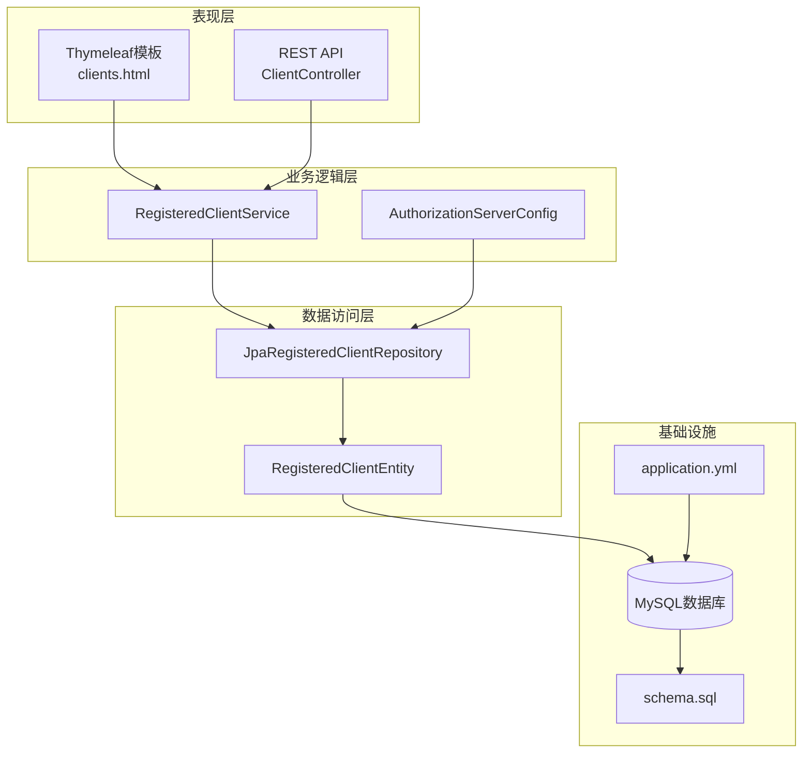
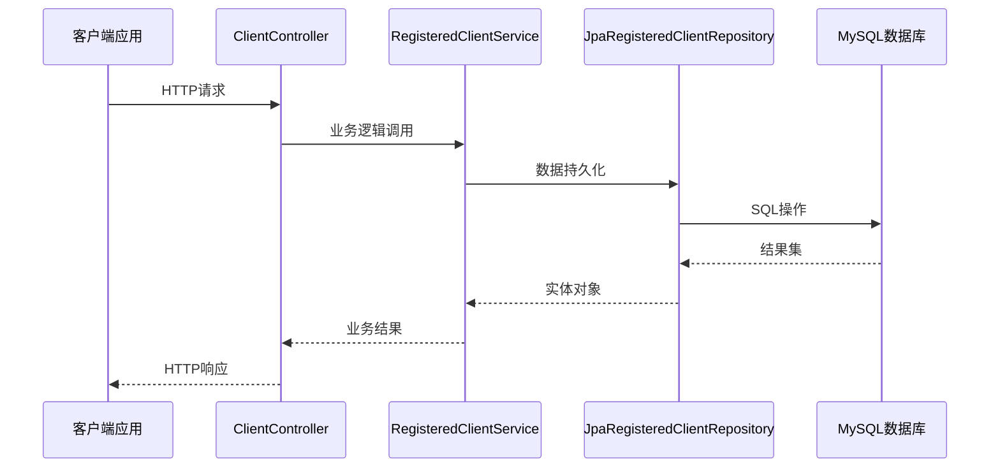
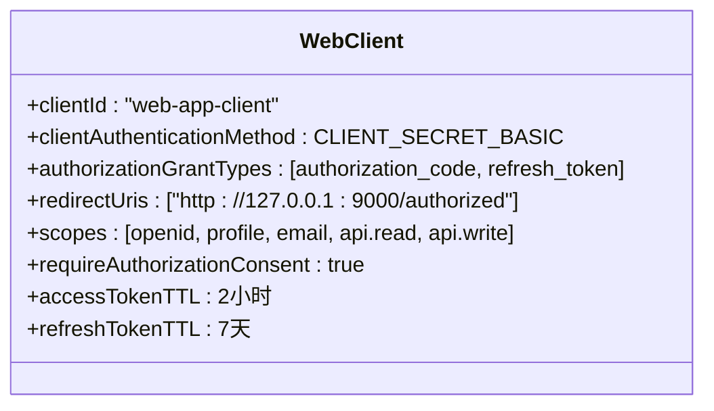
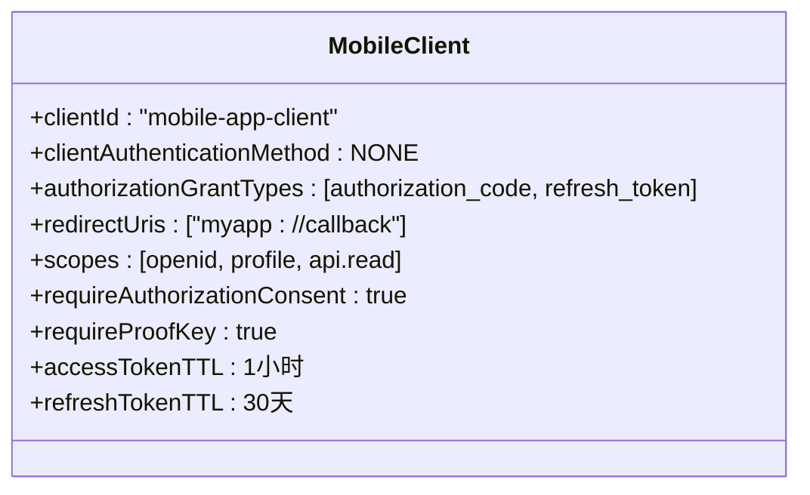
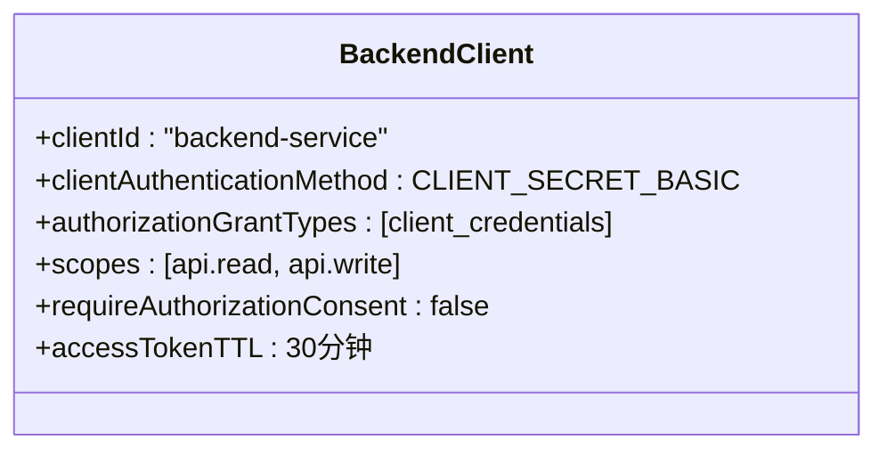
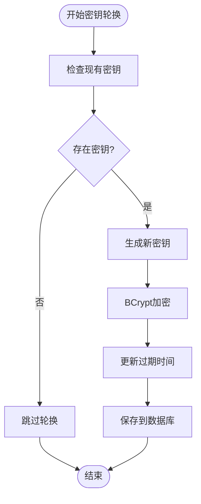
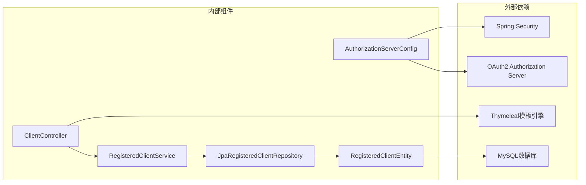
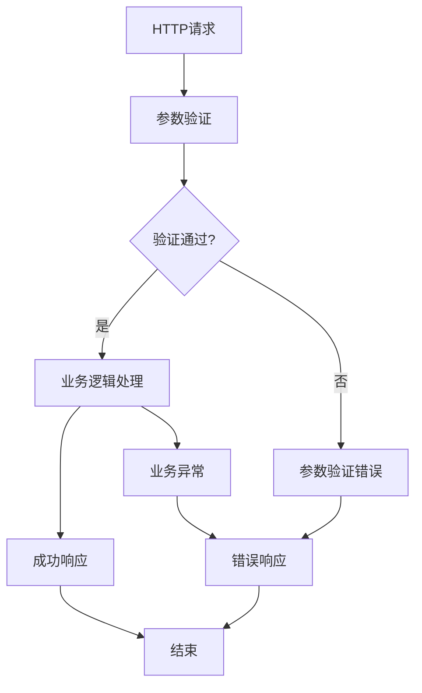

# 客户端管理API

<cite>
**本文档引用的文件**
- [ClientController.java](file://src/main/java/com/example/authserver/controller/ClientController.java)
- [RegisteredClientService.java](file://src/main/java/com/example/authserver/service/RegisteredClientService.java)
- [RegisteredClientEntity.java](file://src/main/java/com/example/authserver/entity/RegisteredClientEntity.java)
- [JpaRegisteredClientRepository.java](file://src/main/java/com/example/authserver/repository/JpaRegisteredClientRepository.java)
- [AuthorizationServerConfig.java](file://src/main/java/com/example/authserver/config/AuthorizationServerConfig.java)
- [clients.html](file://src/main/resources/templates/admin/clients.html)
- [application.yml](file://src/main/resources/application.yml)
- [schema.sql](file://src/main/resources/schema.sql)
- [GlobalExceptionHandler.java](file://src/main/java/com/example/authserver/exception/GlobalExceptionHandler.java)
- [ResourceNotFoundException.java](file://src/main/java/com/example/authserver/exception/ResourceNotFoundException.java)
</cite>

## 目录
1. [简介](#简介)
2. [项目结构](#项目结构)
3. [核心组件](#核心组件)
4. [架构概览](#架构概览)
5. [详细组件分析](#详细组件分析)
6. [依赖关系分析](#依赖关系分析)
7. [性能考虑](#性能考虑)
8. [故障排除指南](#故障排除指南)
9. [结论](#结论)

## 简介

本文档详细记录了OAuth2客户端管理API的完整实现，包括客户端CRUD操作的所有REST接口。该系统基于Spring Security OAuth2 Authorization Server构建，提供了完整的客户端生命周期管理功能，包括创建、查询、更新和删除OAuth2客户端配置。

系统支持三种主要的客户端类型：
- **Web应用客户端**：使用HTTP Basic认证，支持授权码模式和刷新令牌
- **移动应用客户端**：公开客户端，强制使用PKCE保护
- **后端服务客户端**：使用客户端凭证模式，适用于服务间通信

## 项目结构

项目采用标准的Spring Boot分层架构，主要包含以下模块：

**图表来源**
- [ClientController.java:1-360](file://src/main/java/com/example/authserver/controller/ClientController.java#L1-L360)
- [RegisteredClientService.java:1-131](file://src/main/java/com/example/authserver/service/RegisteredClientService.java#L1-L131)
- [JpaRegisteredClientRepository.java:1-289](file://src/main/java/com/example/authserver/repository/JpaRegisteredClientRepository.java#L1-L289)

**章节来源**
- [ClientController.java:1-360](file://src/main/java/com/example/authserver/controller/ClientController.java#L1-L360)
- [application.yml:1-30](file://src/main/resources/application.yml#L1-L30)

## 核心组件

### 客户端控制器 (ClientController)

客户端控制器负责处理所有客户端管理相关的HTTP请求，提供完整的CRUD操作接口：

- **客户端列表查询**：`GET /admin/clients`
- **客户端创建**：`POST /admin/clients/create` 和 `POST /admin/clients/add`
- **客户端更新**：`POST /admin/clients/update`
- **客户端删除**：`POST /admin/clients/delete`
- **客户端详情查询**：`GET /admin/clients/detail/{clientId}`

### 客户端服务 (RegisteredClientService)

客户端服务层提供业务逻辑处理，包括：
- 客户端数据验证和转换
- 密钥生成和加密
- 数据持久化操作
- 客户端配置管理

### 数据模型 (RegisteredClientEntity)

客户端实体类映射到数据库表`oauth2_registered_client`，包含所有OAuth2客户端配置参数。

**章节来源**
- [ClientController.java:26-360](file://src/main/java/com/example/authserver/controller/ClientController.java#L26-L360)
- [RegisteredClientService.java:23-131](file://src/main/java/com/example/authserver/service/RegisteredClientService.java#L23-L131)
- [RegisteredClientEntity.java:14-111](file://src/main/java/com/example/authserver/entity/RegisteredClientEntity.java#L14-L111)

## 架构概览

系统采用分层架构设计，确保关注点分离和代码可维护性：

**图表来源**
- [ClientController.java:93-186](file://src/main/java/com/example/authserver/controller/ClientController.java#L93-L186)
- [RegisteredClientService.java:61-64](file://src/main/java/com/example/authserver/service/RegisteredClientService.java#L61-L64)
- [JpaRegisteredClientRepository.java:31-51](file://src/main/java/com/example/authserver/repository/JpaRegisteredClientRepository.java#L31-L51)

## 详细组件分析

### 客户端配置参数详解

系统支持以下OAuth2客户端配置参数：

| 参数名称 | 类型 | 必填 | 描述 | 默认值 |
|---------|------|------|------|--------|
| clientId | String | 是 | 客户端唯一标识符 | 自动生成 |
| clientName | String | 是 | 客户端显示名称 | clientId |
| clientSecret | String | 否 | 客户端密钥（可选） | 自动生成 |
| clientAuthenticationMethod | String | 是 | 认证方式 | CLIENT_SECRET_BASIC |
| authorizationGrantTypes | List<String> | 是 | 授权模式列表 | [] |
| redirectUris | String | 否 | 重定向URI | null |
| scopes | List<String> | 是 | 权限范围列表 | openid,profile |
| accessTokenTTL | Integer | 否 | Access Token有效期(小时) | 2 |
| refreshTokenTTL | Integer | 否 | Refresh Token有效期(天) | 7 |
| requireAuthorizationConsent | Boolean | 否 | 是否需要用户授权 | false |
| requireProofKey | Boolean | 否 | 是否强制PKCE | false |

### 客户端类型配置

#### Web应用客户端配置

**图表来源**
- [AuthorizationServerConfig.java:94-115](file://src/main/java/com/example/authserver/config/AuthorizationServerConfig.java#L94-L115)

#### 移动应用客户端配置

**图表来源**
- [AuthorizationServerConfig.java:117-136](file://src/main/java/com/example/authserver/config/AuthorizationServerConfig.java#L117-L136)

#### 后端服务客户端配置

**图表来源**
- [AuthorizationServerConfig.java:138-154](file://src/main/java/com/example/authserver/config/AuthorizationServerConfig.java#L138-L154)

### 客户端生命周期管理

#### 密钥轮换机制
系统支持客户端密钥的动态管理和轮换：

**图表来源**
- [ClientController.java:329-339](file://src/main/java/com/example/authserver/controller/ClientController.java#L329-L339)
- [RegisteredClientService.java:107-109](file://src/main/java/com/example/authserver/service/RegisteredClientService.java#L107-L109)

#### 过期处理机制
系统自动管理客户端密钥的过期时间：

- **密钥过期时间**：默认1年有效期
- **过期检查**：每次请求时自动验证
- **自动清理**：过期密钥无法用于认证

**章节来源**
- [ClientController.java:152-157](file://src/main/java/com/example/authserver/controller/ClientController.java#L152-L157)
- [RegisteredClientEntity.java:40-43](file://src/main/java/com/example/authserver/entity/RegisteredClientEntity.java#L40-L43)

## 依赖关系分析

系统各组件之间的依赖关系如下：

**图表来源**
- [ClientController.java:28](file://src/main/java/com/example/authserver/controller/ClientController.java#L28)
- [RegisteredClientService.java:25-26](file://src/main/java/com/example/authserver/service/RegisteredClientService.java#L25-L26)
- [JpaRegisteredClientRepository.java:21](file://src/main/java/com/example/authserver/repository/JpaRegisteredClientRepository.java#L21)

**章节来源**
- [AuthorizationServerConfig.java:3-47](file://src/main/java/com/example/authserver/config/AuthorizationServerConfig.java#L3-L47)

## 性能考虑

### 数据库优化
- **索引策略**：`oauth2_registered_client`表对`client_id`建立唯一索引
- **查询优化**：使用JPQL查询替代原生SQL，提高可移植性
- **连接池**：配置合理的数据库连接池参数

### 缓存策略
- **实体缓存**：对于频繁访问的客户端配置，可考虑添加缓存层
- **查询优化**：批量查询客户端列表，减少数据库往返次数

### 安全考虑
- **密钥加密**：使用BCrypt算法对客户端密钥进行加密存储
- **参数验证**：严格的输入验证和参数校验
- **访问控制**：基于角色的访问控制机制

## 故障排除指南

### 常见问题及解决方案

#### 客户端ID冲突
**问题**：创建客户端时提示客户端ID已存在
**解决方案**：使用自动生成的客户端ID或选择唯一的ID

#### 密钥验证失败
**问题**：更新客户端时密钥验证失败
**解决方案**：检查密钥格式和长度要求

#### 数据库连接问题
**问题**：客户端操作时出现数据库连接异常
**解决方案**：检查数据库连接配置和网络连通性

### 错误处理机制

系统提供统一的错误处理机制：

**图表来源**
- [GlobalExceptionHandler.java:28-73](file://src/main/java/com/example/authserver/exception/GlobalExceptionHandler.java#L28-L73)

**章节来源**
- [GlobalExceptionHandler.java:1-130](file://src/main/java/com/example/authserver/exception/GlobalExceptionHandler.java#L1-L130)
- [ResourceNotFoundException.java:1-16](file://src/main/java/com/example/authserver/exception/ResourceNotFoundException.java#L1-L16)

## 结论

本OAuth2客户端管理API提供了完整的客户端生命周期管理功能，支持多种客户端类型和配置选项。系统采用分层架构设计，具有良好的可扩展性和安全性。通过标准化的REST接口和统一的错误处理机制，开发者可以轻松集成和管理OAuth2客户端配置。

主要优势包括：
- **完整的CRUD操作**：支持客户端的创建、查询、更新和删除
- **灵活的配置选项**：支持多种授权模式和认证方式
- **安全的密钥管理**：自动化的密钥生成和加密存储
- **标准化的接口**：符合OAuth2标准的REST API设计
- **完善的错误处理**：统一的错误响应格式和处理机制