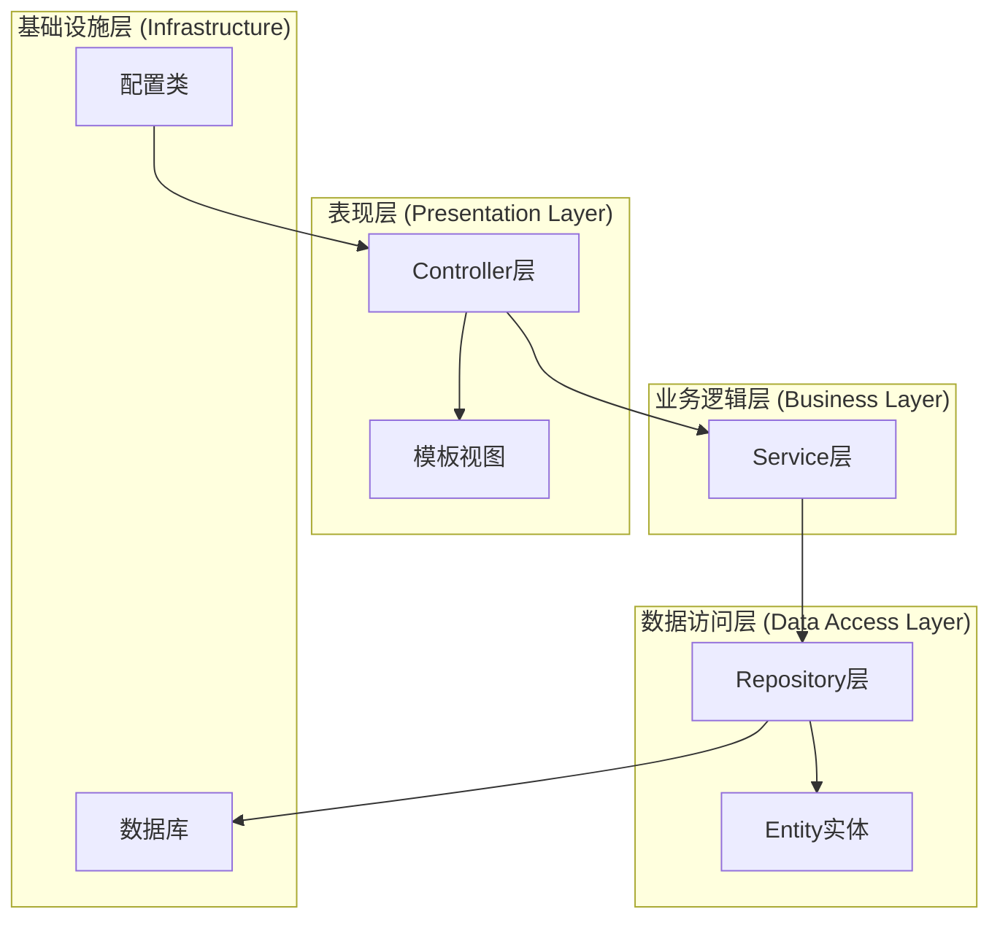
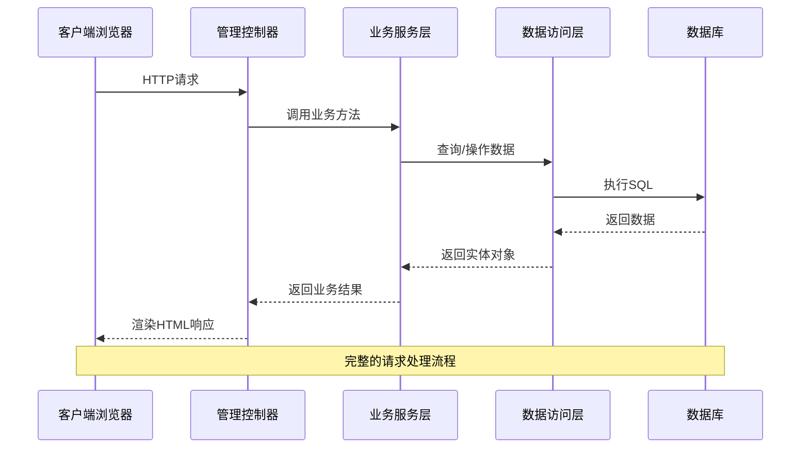
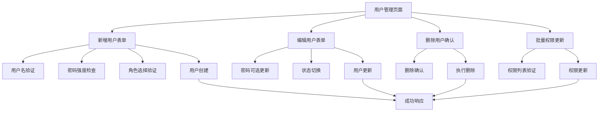
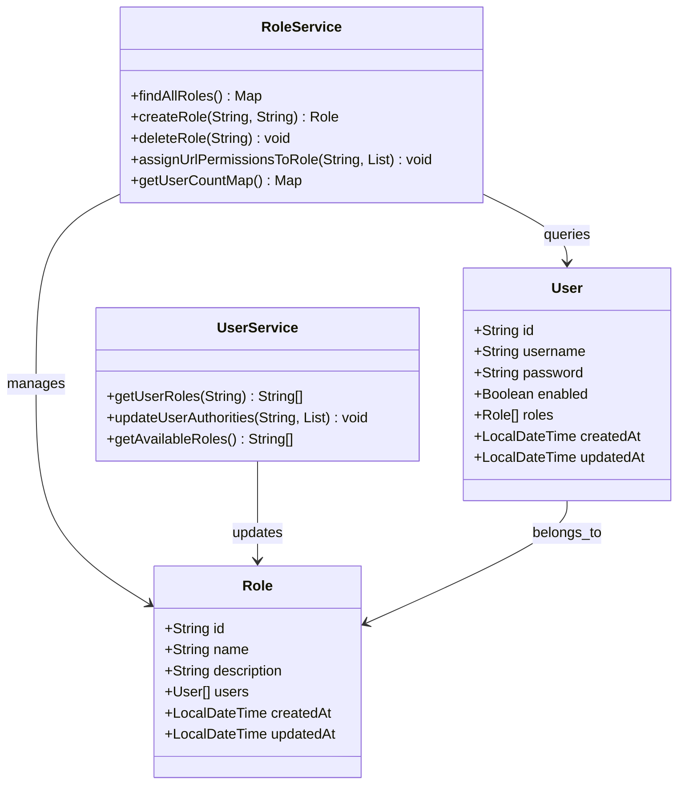
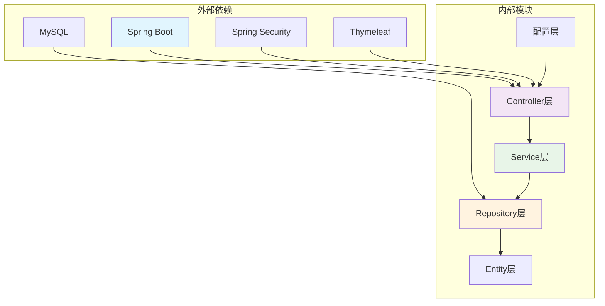
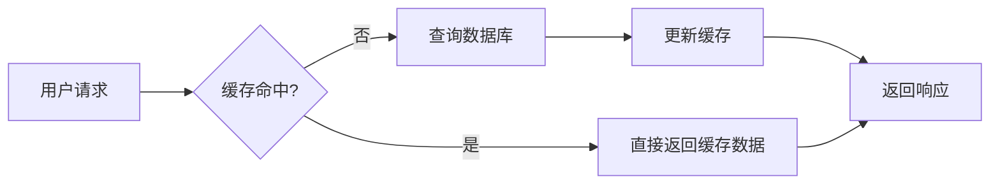

# 管理员管理API

<cite>
**本文档引用的文件**
- [AdminController.java](file://src/main/java/com/example/authserver/controller/AdminController.java)
- [UserService.java](file://src/main/java/com/example/authserver/service/UserService.java)
- [RoleService.java](file://src/main/java/com/example/authserver/service/RoleService.java)
- [DefaultSecurityConfig.java](file://src/main/java/com/example/authserver/config/DefaultSecurityConfig.java)
- [User.java](file://src/main/java/com/example/authserver/entity/User.java)
- [Role.java](file://src/main/java/com/example/authserver/entity/Role.java)
- [UserRepository.java](file://src/main/java/com/example/authserver/repository/UserRepository.java)
- [RoleRepository.java](file://src/main/java/com/example/authserver/repository/RoleRepository.java)
- [dashboard.html](file://src/main/resources/templates/admin/dashboard.html)
- [users.html](file://src/main/resources/templates/admin/users.html)
- [roles.html](file://src/main/resources/templates/admin/roles.html)
- [role-detail.html](file://src/main/resources/templates/admin/role-detail.html)
- [clients.html](file://src/main/resources/templates/admin/clients.html)
- [application.yml](file://src/main/resources/application.yml)
</cite>

## 目录
1. [简介](#简介)
2. [项目结构](#项目结构)
3. [核心组件](#核心组件)
4. [架构概览](#架构概览)
5. [详细组件分析](#详细组件分析)
6. [依赖关系分析](#依赖关系分析)
7. [性能考虑](#性能考虑)
8. [故障排除指南](#故障排除指南)
9. [结论](#结论)

## 简介

本项目是一个基于Spring Security的SSO认证中心管理后台，提供了完整的管理员管理功能。系统采用传统的服务端渲染（Server-Side Rendering）模式，使用Thymeleaf模板引擎构建管理界面，提供用户管理、角色管理、客户端管理等功能模块。

管理后台的核心功能包括：
- 仪表盘数据展示和系统状态监控
- 用户生命周期管理（创建、更新、删除、权限分配）
- 角色权限体系管理
- OAuth2客户端管理
- 系统审计和日志记录

## 项目结构

项目采用标准的Spring Boot目录结构，主要分为以下几个层次：

**图表来源**
- [AdminController.java:1-282](file://src/main/java/com/example/authserver/controller/AdminController.java#L1-L282)
- [UserService.java:1-265](file://src/main/java/com/example/authserver/service/UserService.java#L1-L265)
- [RoleService.java:1-235](file://src/main/java/com/example/authserver/service/RoleService.java#L1-L235)

**章节来源**
- [application.yml:1-30](file://src/main/resources/application.yml#L1-L30)

## 核心组件

### 管理控制器 (AdminController)

管理控制器是整个管理后台的核心入口，负责处理所有管理员相关的HTTP请求。控制器采用@RequestMapping("/admin")统一前缀，提供以下主要功能：

- **仪表盘管理**：`/admin/dashboard` - 展示系统概览和统计数据
- **用户管理**：`/admin/users` - 用户列表、搜索、分页、CRUD操作
- **角色管理**：`/admin/roles` - 角色列表、创建、删除、权限分配
- **客户端管理**：`/admin/clients` - OAuth2客户端配置管理
- **AJAX接口**：用户名存在性检查等异步操作

### 用户服务 (UserService)

用户服务层实现了完整的用户生命周期管理，包括：
- 用户信息查询和管理
- 密码加密和验证
- 角色权限分配和更新
- 用户状态控制（启用/禁用）

### 角色服务 (RoleService)

角色服务层提供细粒度的角色管理能力：
- 角色创建、删除、更新
- 用户角色统计和查询
- URL权限规则管理
- 角色权限继承关系

### 安全配置 (DefaultSecurityConfig)

系统采用Spring Security进行统一的安全控制：
- 基于表单的认证机制
- 动态URL权限控制
- CSRF保护
- 密码编码器配置

**章节来源**
- [AdminController.java:22-282](file://src/main/java/com/example/authserver/controller/AdminController.java#L22-L282)
- [UserService.java:24-265](file://src/main/java/com/example/authserver/service/UserService.java#L24-L265)
- [RoleService.java:25-235](file://src/main/java/com/example/authserver/service/RoleService.java#L25-L235)
- [DefaultSecurityConfig.java:27-75](file://src/main/java/com/example/authserver/config/DefaultSecurityConfig.java#L27-L75)

## 架构概览

系统采用经典的MVC架构模式，结合Spring Security实现统一的安全控制：

**图表来源**
- [AdminController.java:33-39](file://src/main/java/com/example/authserver/controller/AdminController.java#L33-L39)
- [UserService.java:33-35](file://src/main/java/com/example/authserver/service/UserService.java#L33-L35)
- [UserRepository.java:16-43](file://src/main/java/com/example/authserver/repository/UserRepository.java#L16-L43)

## 详细组件分析

### 用户管理模块

用户管理模块提供了完整的用户生命周期管理功能：

#### 用户CRUD操作

**图表来源**
- [AdminController.java:134-167](file://src/main/java/com/example/authserver/controller/AdminController.java#L134-L167)
- [AdminController.java:172-197](file://src/main/java/com/example/authserver/controller/AdminController.java#L172-L197)
- [AdminController.java:202-225](file://src/main/java/com/example/authserver/controller/AdminController.java#L202-L225)
- [AdminController.java:230-269](file://src/main/java/com/example/authserver/controller/AdminController.java#L230-L269)

#### 用户搜索和分页

系统实现了高效的用户搜索和分页功能：

| 参数 | 类型 | 默认值 | 描述 |
|------|------|--------|------|
| page | int | 1 | 当前页码 |
| size | int | 10 | 每页条数 |
| keyword | string | "" | 搜索关键词 |

搜索功能支持用户名模糊匹配，分页算法确保大数据量下的性能表现。

**章节来源**
- [AdminController.java:44-117](file://src/main/java/com/example/authserver/controller/AdminController.java#L44-L117)
- [UserRepository.java:39-42](file://src/main/java/com/example/authserver/repository/UserRepository.java#L39-L42)

### 角色管理模块

角色管理模块提供了细粒度的权限控制能力：

#### 角色权限体系

**图表来源**
- [Role.java:23-61](file://src/main/java/com/example/authserver/entity/Role.java#L23-L61)
- [User.java:23-65](file://src/main/java/com/example/authserver/entity/User.java#L23-L65)
- [RoleService.java:34-44](file://src/main/java/com/example/authserver/service/RoleService.java#L34-L44)
- [UserService.java:47-53](file://src/main/java/com/example/authserver/service/UserService.java#L47-L53)

#### URL权限规则管理

系统支持基于URL模式的细粒度权限控制：

| 权限类型 | 描述 | 示例 |
|----------|------|------|
| 角色权限 | 基于用户角色的访问控制 | ROLE_ADMIN, ROLE_USER |
| URL权限 | 基于URL模式的访问控制 | /admin/**, /api/v1/** |
| HTTP方法 | 基于HTTP方法的访问控制 | GET, POST, PUT, DELETE |

**章节来源**
- [RoleService.java:113-149](file://src/main/java/com/example/authserver/service/RoleService.java#L113-L149)
- [RoleService.java:223-233](file://src/main/java/com/example/authserver/service/RoleService.java#L223-L233)

### 客户端管理模块

客户端管理模块专门用于OAuth2客户端的配置和管理：

#### OAuth2客户端配置

| 配置项 | 类型 | 必填 | 描述 |
|--------|------|------|------|
| clientName | string | 是 | 客户端显示名称 |
| clientAuthenticationMethod | enum | 是 | 客户端认证方式 |
| authorizationGrantTypes | array | 是 | 授权模式列表 |
| redirectUris | array | 是 | 重定向URI列表 |
| scopes | array | 是 | 权限范围列表 |
| accessTokenTTL | number | 否 | Access Token有效期 |
| refreshTokenTTL | number | 否 | Refresh Token有效期 |

**章节来源**
- [clients.html:337-563](file://src/main/resources/templates/admin/clients.html#L337-L563)

### 仪表盘模块

仪表盘模块提供系统运行状态的实时监控：

#### 统计指标

| 指标类型 | 字段名 | 描述 |
|----------|--------|------|
| 用户统计 | userCount | 注册用户总数 |
| 应用统计 | connectedApps | 已连接的应用数量 |
| 认证统计 | dailyAuthCount | 今日认证次数 |
| 异常统计 | alertCount | 异常认证告警数量 |

**章节来源**
- [dashboard.html:211-248](file://src/main/resources/templates/admin/dashboard.html#L211-L248)

## 依赖关系分析

系统采用清晰的分层架构，各层之间依赖关系明确：

**图表来源**
- [DefaultSecurityConfig.java:27-75](file://src/main/java/com/example/authserver/config/DefaultSecurityConfig.java#L27-L75)
- [UserRepository.java:15-43](file://src/main/java/com/example/authserver/repository/UserRepository.java#L15-L43)
- [RoleRepository.java:15-44](file://src/main/java/com/example/authserver/repository/RoleRepository.java#L15-L44)

### 核心依赖关系

1. **Controller → Service**：控制器依赖服务层提供业务逻辑
2. **Service → Repository**：服务层依赖数据访问层进行数据操作
3. **Repository → Entity**：数据访问层操作实体对象
4. **Controller → View**：控制器渲染Thymeleaf模板

**章节来源**
- [AdminController.java:28-28](file://src/main/java/com/example/authserver/controller/AdminController.java#L28-L28)
- [UserService.java:26-28](file://src/main/java/com/example/authserver/service/UserService.java#L26-L28)
- [RoleService.java:27-29](file://src/main/java/com/example/authserver/service/RoleService.java#L27-L29)

## 性能考虑

### 数据库优化

系统采用了多种数据库优化策略：

1. **索引优化**：对常用查询字段建立索引
2. **查询优化**：使用原生SQL查询提高性能
3. **连接池配置**：合理配置数据库连接池参数

### 缓存策略

### 并发控制

系统通过以下机制保证并发安全性：
- 数据库事务管理
- 用户状态同步
- 并发更新冲突检测

## 故障排除指南

### 常见问题及解决方案

#### 用户名重复错误

**问题描述**：创建用户时提示用户名已存在
**解决方法**：检查用户名唯一性，使用AJAX接口进行实时验证

#### 密码验证失败

**问题描述**：密码长度或格式不符合要求
**解决方法**：确保密码长度至少6位，符合复杂度要求

#### 权限不足错误

**问题描述**：访问受保护资源时被拒绝
**解决方法**：检查用户角色和URL权限配置

#### 数据库连接问题

**问题描述**：启动时数据库连接失败
**解决方法**：检查数据库配置和网络连接

**章节来源**
- [UserService.java:69-71](file://src/main/java/com/example/authserver/service/UserService.java#L69-L71)
- [UserService.java:117-119](file://src/main/java/com/example/authserver/service/UserService.java#L117-L119)

## 结论

本管理员管理API提供了完整的SSO认证中心后台管理功能，具有以下特点：

1. **功能完整性**：覆盖用户管理、角色管理、客户端管理等核心功能
2. **安全性强**：采用Spring Security提供统一的安全控制
3. **用户体验好**：基于Thymeleaf的响应式界面设计
4. **扩展性强**：清晰的分层架构便于功能扩展

系统通过合理的架构设计和完善的错误处理机制，为用户提供了一个稳定可靠的管理平台。建议在生产环境中进一步完善日志记录和监控功能，以提升系统的可观测性和维护性。