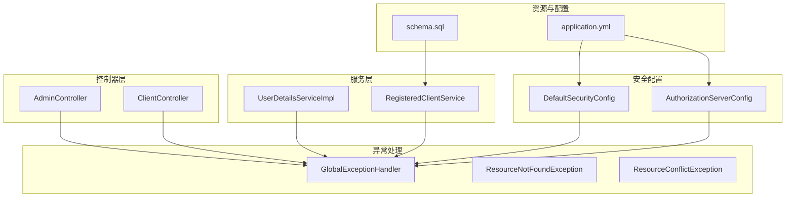
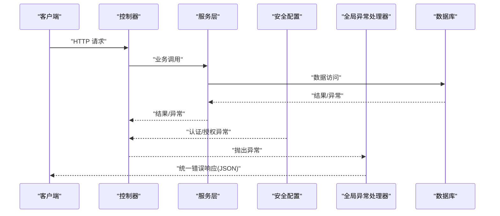
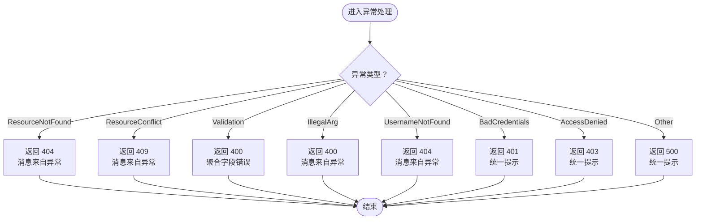
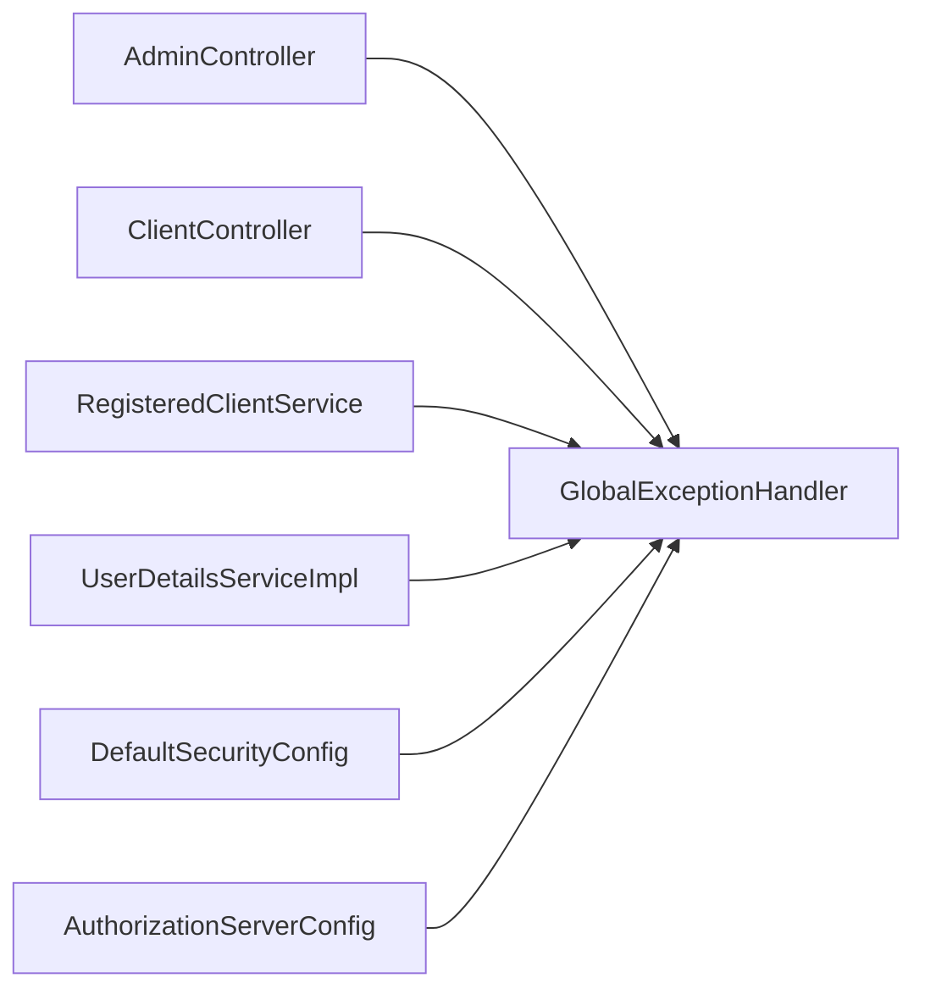

# 错误处理和状态码

<cite>
**本文引用的文件**
- [GlobalExceptionHandler.java](file://src/main/java/com/example/authserver/exception/GlobalExceptionHandler.java)
- [ResourceConflictException.java](file://src/main/java/com/example/authserver/exception/ResourceConflictException.java)
- [ResourceNotFoundException.java](file://src/main/java/com/example/authserver/exception/ResourceNotFoundException.java)
- [AdminController.java](file://src/main/java/com/example/authserver/controller/AdminController.java)
- [ClientController.java](file://src/main/java/com/example/authserver/controller/ClientController.java)
- [UserDetailsServiceImpl.java](file://src/main/java/com/example/authserver/service/UserDetailsServiceImpl.java)
- [RegisteredClientService.java](file://src/main/java/com/example/authserver/service/RegisteredClientService.java)
- [AuthorizationServerConfig.java](file://src/main/java/com/example/authserver/config/AuthorizationServerConfig.java)
- [DefaultSecurityConfig.java](file://src/main/java/com/example/authserver/config/DefaultSecurityConfig.java)
- [application.yml](file://src/main/resources/application.yml)
- [schema.sql](file://src/main/resources/schema.sql)
</cite>

## 目录
1. [简介](#简介)
2. [项目结构](#项目结构)
3. [核心组件](#核心组件)
4. [架构概览](#架构概览)
5. [详细组件分析](#详细组件分析)
6. [依赖分析](#依赖分析)
7. [性能考虑](#性能考虑)
8. [故障排查指南](#故障排查指南)
9. [结论](#结论)
10. [附录](#附录)

## 简介
本文件系统性梳理认证服务器的错误处理与状态码使用规范，覆盖以下要点：
- HTTP 状态码使用场景与最佳实践（200、201、400、401、403、404、409、500 等）
- OAuth2 标准错误响应格式（invalid_request、unauthorized_client、access_denied、unsupported_response_type、invalid_scope、server_error、temporarily_unavailable 等）
- 业务逻辑错误的自定义错误码与错误消息格式
- 全局异常处理器工作机制与自定义异常处理
- 错误日志记录与监控建议
- 常见错误场景的排查与解决方案

## 项目结构
本项目采用 Spring Boot + Spring Security + Spring Authorization Server 架构，错误处理主要集中在全局异常处理器与控制器层的业务校验。关键目录与文件如下：
- 异常处理：exception 包下的全局异常处理器与自定义异常类
- 控制器：controller 包下的管理端控制器（用户、客户端）
- 安全配置：config 包下的默认安全与授权服务器配置
- 数据模型与持久化：repository 与 service 层
- 资源与配置：resources 下的模板、YAML 配置与数据库初始化脚本

图表来源
- [GlobalExceptionHandler.java:1-130](file://src/main/java/com/example/authserver/exception/GlobalExceptionHandler.java#L1-L130)
- [ResourceConflictException.java:1-16](file://src/main/java/com/example/authserver/exception/ResourceConflictException.java#L1-L16)
- [ResourceNotFoundException.java:1-16](file://src/main/java/com/example/authserver/exception/ResourceNotFoundException.java#L1-L16)
- [AdminController.java:1-288](file://src/main/java/com/example/authserver/controller/AdminController.java#L1-L288)
- [ClientController.java:1-366](file://src/main/java/com/example/authserver/controller/ClientController.java#L1-L366)
- [UserDetailsServiceImpl.java:1-59](file://src/main/java/com/example/authserver/service/UserDetailsServiceImpl.java#L1-L59)
- [RegisteredClientService.java:1-131](file://src/main/java/com/example/authserver/service/RegisteredClientService.java#L1-L131)
- [DefaultSecurityConfig.java:1-78](file://src/main/java/com/example/authserver/config/DefaultSecurityConfig.java#L1-L78)
- [AuthorizationServerConfig.java:1-256](file://src/main/java/com/example/authserver/config/AuthorizationServerConfig.java#L1-L256)
- [application.yml:1-30](file://src/main/resources/application.yml#L1-L30)
- [schema.sql:1-194](file://src/main/resources/schema.sql#L1-L194)

章节来源
- [GlobalExceptionHandler.java:1-130](file://src/main/java/com/example/authserver/exception/GlobalExceptionHandler.java#L1-L130)
- [application.yml:1-30](file://src/main/resources/application.yml#L1-L30)

## 核心组件
- 全局异常处理器：集中捕获各类异常并输出统一的 JSON 错误响应，包含时间戳、状态码与消息；同时对参数校验失败进行字段级错误聚合。
- 自定义异常：资源不存在与资源冲突两类业务异常，分别映射到 404 与 409。
- 控制器层业务校验：在用户与客户端管理接口中进行参数与业务规则校验，并通过重定向携带 Flash 属性展示错误/成功消息。
- 安全层异常：Spring Security 认证与授权异常映射到 401 与 403。
- OAuth2 授权服务器：通过配置启用授权服务器默认安全策略与 OIDC 支持，未显式覆盖 OAuth2 错误响应格式，遵循 Spring Authorization Server 默认行为。

章节来源
- [GlobalExceptionHandler.java:1-130](file://src/main/java/com/example/authserver/exception/GlobalExceptionHandler.java#L1-L130)
- [ResourceConflictException.java:1-16](file://src/main/java/com/example/authserver/exception/ResourceConflictException.java#L1-L16)
- [ResourceNotFoundException.java:1-16](file://src/main/java/com/example/authserver/exception/ResourceNotFoundException.java#L1-L16)
- [AdminController.java:1-288](file://src/main/java/com/example/authserver/controller/AdminController.java#L1-L288)
- [ClientController.java:1-366](file://src/main/java/com/example/authserver/controller/ClientController.java#L1-L366)
- [DefaultSecurityConfig.java:1-78](file://src/main/java/com/example/authserver/config/DefaultSecurityConfig.java#L1-L78)
- [AuthorizationServerConfig.java:1-256](file://src/main/java/com/example/authserver/config/AuthorizationServerConfig.java#L1-L256)

## 架构概览
下图展示了错误处理在系统中的流转路径：控制器接收请求，执行业务逻辑；若发生异常，由全局异常处理器统一拦截并返回标准化错误响应；对于 Spring Security 相关异常，由安全配置与异常处理器共同处理。

图表来源
- [GlobalExceptionHandler.java:1-130](file://src/main/java/com/example/authserver/exception/GlobalExceptionHandler.java#L1-L130)
- [DefaultSecurityConfig.java:1-78](file://src/main/java/com/example/authserver/config/DefaultSecurityConfig.java#L1-L78)
- [AuthorizationServerConfig.java:1-256](file://src/main/java/com/example/authserver/config/AuthorizationServerConfig.java#L1-L256)

## 详细组件分析

### 全局异常处理器（GlobalExceptionHandler）
- 统一错误响应结构：包含时间戳、状态码、消息；参数校验失败时额外返回字段级错误集合。
- 异常映射：
  - 资源不存在：404（ResourceNotFoundException）
  - 资源冲突：409（ResourceConflictException）
  - 参数校验失败：400（MethodArgumentNotValidException），并聚合字段错误
  - 非法参数：400（IllegalArgumentException）
  - 用户名未找到：404（UsernameNotFoundException）
  - 凭证错误：401（BadCredentialsException）
  - 访问被拒绝：403（AccessDeniedException）
  - 其他未捕获异常：500（Exception）

图表来源
- [GlobalExceptionHandler.java:28-117](file://src/main/java/com/example/authserver/exception/GlobalExceptionHandler.java#L28-L117)

章节来源
- [GlobalExceptionHandler.java:1-130](file://src/main/java/com/example/authserver/exception/GlobalExceptionHandler.java#L1-L130)

### 自定义异常类
- ResourceNotFoundException：封装“资源不存在”的业务语义，便于统一映射到 404。
- ResourceConflictException：封装“资源冲突”的业务语义，便于统一映射到 409。

章节来源
- [ResourceNotFoundException.java:1-16](file://src/main/java/com/example/authserver/exception/ResourceNotFoundException.java#L1-L16)
- [ResourceConflictException.java:1-16](file://src/main/java/com/example/authserver/exception/ResourceConflictException.java#L1-L16)

### 控制器层业务校验与错误传播
- 管理端控制器（Admin/Client）在新增、更新、删除等操作中进行参数与业务规则校验，若校验失败抛出运行时异常，由全局异常处理器统一处理。
- 对于表单型接口，控制器通过重定向携带 Flash 属性（成功/错误消息），前端模板渲染相应提示；对于 AJAX 接口，控制器返回 JSON，由异常处理器统一包装。

章节来源
- [AdminController.java:137-170](file://src/main/java/com/example/authserver/controller/AdminController.java#L137-L170)
- [ClientController.java:114-190](file://src/main/java/com/example/authserver/controller/ClientController.java#L114-L190)
- [ClientController.java:220-254](file://src/main/java/com/example/authserver/controller/ClientController.java#L220-L254)
- [ClientController.java:258-363](file://src/main/java/com/example/authserver/controller/ClientController.java#L258-L363)

### 安全层异常映射
- 默认安全配置允许 /oauth2/** 等端点公开访问，未认证访问这些端点将触发登录重定向；认证失败与权限不足分别映射到 401 与 403。
- 授权服务器配置启用 OAuth2 Authorization Server 默认安全策略与 OIDC 支持，未显式覆盖 OAuth2 错误响应格式，遵循 Spring Authorization Server 默认行为。

章节来源
- [DefaultSecurityConfig.java:64-73](file://src/main/java/com/example/authserver/config/DefaultSecurityConfig.java#L64-L73)
- [AuthorizationServerConfig.java:58-76](file://src/main/java/com/example/authserver/config/AuthorizationServerConfig.java#L58-L76)

### OAuth2 标准错误响应格式
- 本项目未在控制器层直接构造 OAuth2 错误响应，而是依赖 Spring Authorization Server 的默认实现。根据 OAuth2 RFC 6749，标准错误类型包括：
  - invalid_request：请求缺少必要参数或参数无效
  - unauthorized_client：客户端无权使用指定授权类型
  - access_denied：用户或授权服务器拒绝授权
  - unsupported_response_type：不支持的响应类型
  - invalid_scope：请求的作用域无效或超出授权范围
  - server_error：授权服务器内部错误
  - temporarily_unavailable：授权服务器暂时不可用
- 建议：若需自定义 OAuth2 错误响应格式，可在授权服务器配置中扩展异常处理或自定义错误端点。

章节来源
- [AuthorizationServerConfig.java:58-76](file://src/main/java/com/example/authserver/config/AuthorizationServerConfig.java#L58-L76)

## 依赖分析
- 控制器依赖全局异常处理器进行统一错误处理，确保对外暴露一致的错误格式。
- 服务层通过抛出自定义异常表达业务错误，避免在控制器中分散处理。
- 安全配置与异常处理器共同作用，保证认证与授权阶段的异常得到正确映射。

图表来源
- [GlobalExceptionHandler.java:1-130](file://src/main/java/com/example/authserver/exception/GlobalExceptionHandler.java#L1-L130)
- [DefaultSecurityConfig.java:1-78](file://src/main/java/com/example/authserver/config/DefaultSecurityConfig.java#L1-L78)
- [AuthorizationServerConfig.java:1-256](file://src/main/java/com/example/authserver/config/AuthorizationServerConfig.java#L1-L256)

章节来源
- [GlobalExceptionHandler.java:1-130](file://src/main/java/com/example/authserver/exception/GlobalExceptionHandler.java#L1-L130)
- [DefaultSecurityConfig.java:1-78](file://src/main/java/com/example/authserver/config/DefaultSecurityConfig.java#L1-L78)
- [AuthorizationServerConfig.java:1-256](file://src/main/java/com/example/authserver/config/AuthorizationServerConfig.java#L1-L256)

## 性能考虑
- 全局异常处理器仅做轻量级封装与日志记录，避免在异常路径引入复杂计算。
- 参数校验失败时聚合字段错误，减少多次往返与重复校验。
- 建议：对高频错误场景增加缓存与限流，避免雪崩效应。

## 故障排查指南
- 400 参数校验失败
  - 现象：返回统一错误响应，包含字段级错误集合
  - 排查：检查请求参数是否符合控制器与 Bean Validation 规则
  - 参考：[GlobalExceptionHandler.java:50-62](file://src/main/java/com/example/authserver/exception/GlobalExceptionHandler.java#L50-L62)
- 401 凭证错误
  - 现象：用户名或密码错误
  - 排查：确认凭据是否正确、账户是否启用、密码编码器是否匹配
  - 参考：[UserDetailsServiceImpl.java:31-56](file://src/main/java/com/example/authserver/service/UserDetailsServiceImpl.java#L31-L56)
- 403 访问被拒绝
  - 现象：无权限执行操作
  - 排查：确认用户角色与 URL 权限规则
  - 参考：[DefaultSecurityConfig.java:61-66](file://src/main/java/com/example/authserver/config/DefaultSecurityConfig.java#L61-L66)
- 404 资源不存在
  - 现象：请求的资源未找到
  - 排查：确认资源 ID 是否正确、是否存在软删除或权限限制
  - 参考：[RegisteredClientService.java:69-72](file://src/main/java/com/example/authserver/service/RegisteredClientService.java#L69-L72)
- 409 资源冲突
  - 现象：重复的用户名、客户端 ID 等
  - 排查：检查唯一性约束与业务规则
  - 参考：[ResourceConflictException.java:1-16](file://src/main/java/com/example/authserver/exception/ResourceConflictException.java#L1-L16)
- 500 系统内部错误
  - 现象：未捕获异常导致
  - 排查：查看日志堆栈，定位具体异常位置
  - 参考：[GlobalExceptionHandler.java:111-117](file://src/main/java/com/example/authserver/exception/GlobalExceptionHandler.java#L111-L117)

章节来源
- [GlobalExceptionHandler.java:28-117](file://src/main/java/com/example/authserver/exception/GlobalExceptionHandler.java#L28-L117)
- [UserDetailsServiceImpl.java:31-56](file://src/main/java/com/example/authserver/service/UserDetailsServiceImpl.java#L31-L56)
- [DefaultSecurityConfig.java:61-66](file://src/main/java/com/example/authserver/config/DefaultSecurityConfig.java#L61-L66)
- [RegisteredClientService.java:69-72](file://src/main/java/com/example/authserver/service/RegisteredClientService.java#L69-L72)
- [ResourceConflictException.java:1-16](file://src/main/java/com/example/authserver/exception/ResourceConflictException.java#L1-L16)

## 结论
本项目通过全局异常处理器实现了统一的错误响应格式与状态码映射，结合控制器层的业务校验与安全配置，形成了清晰、可维护的错误处理体系。对于 OAuth2 错误响应，遵循 Spring Authorization Server 默认行为；如需定制，可在授权服务器配置中进一步扩展。

## 附录

### HTTP 状态码使用场景清单
- 200 OK：成功返回数据（非错误场景）
- 201 Created：成功创建资源（如新增用户/客户端）
- 400 Bad Request：参数校验失败、非法参数
- 401 Unauthorized：认证失败（凭证错误）
- 403 Forbidden：权限不足（访问被拒绝）
- 404 Not Found：资源不存在
- 409 Conflict：资源冲突（如重复 ID）
- 500 Internal Server Error：未捕获异常

章节来源
- [GlobalExceptionHandler.java:28-117](file://src/main/java/com/example/authserver/exception/GlobalExceptionHandler.java#L28-L117)
- [AdminController.java:137-170](file://src/main/java/com/example/authserver/controller/AdminController.java#L137-L170)
- [ClientController.java:114-190](file://src/main/java/com/example/authserver/controller/ClientController.java#L114-L190)

### OAuth2 标准错误类型
- invalid_request、unauthorized_client、access_denied、unsupported_response_type、invalid_scope、server_error、temporarily_unavailable
- 说明：本项目未在控制器层直接构造 OAuth2 错误响应，遵循 Spring Authorization Server 默认实现

章节来源
- [AuthorizationServerConfig.java:58-76](file://src/main/java/com/example/authserver/config/AuthorizationServerConfig.java#L58-L76)

### 错误响应示例（JSON）
- 通用错误响应结构
  - 字段：timestamp、status、message
  - 示例参考：[GlobalExceptionHandler.java:122-128](file://src/main/java/com/example/authserver/exception/GlobalExceptionHandler.java#L122-L128)
- 参数校验失败（含字段级错误）
  - 字段：timestamp、status、message、fieldErrors
  - 示例参考：[GlobalExceptionHandler.java:50-62](file://src/main/java/com/example/authserver/exception/GlobalExceptionHandler.java#L50-L62)

章节来源
- [GlobalExceptionHandler.java:50-62](file://src/main/java/com/example/authserver/exception/GlobalExceptionHandler.java#L50-L62)
- [GlobalExceptionHandler.java:122-128](file://src/main/java/com/example/authserver/exception/GlobalExceptionHandler.java#L122-L128)

### 全局异常处理器工作机制
- 通过 @ControllerAdvice 全局捕获异常，按异常类型映射到对应 HTTP 状态码
- 统一构建错误响应 JSON，记录日志并返回给客户端
- 参考：[GlobalExceptionHandler.java:21-129](file://src/main/java/com/example/authserver/exception/GlobalExceptionHandler.java#L21-L129)

章节来源
- [GlobalExceptionHandler.java:21-129](file://src/main/java/com/example/authserver/exception/GlobalExceptionHandler.java#L21-L129)

### 自定义异常处理方式
- 抛出自定义异常（如 ResourceNotFoundException、ResourceConflictException）
- 在全局异常处理器中声明 @ExceptionHandler 对应异常类型
- 参考：
  - [ResourceNotFoundException.java:1-16](file://src/main/java/com/example/authserver/exception/ResourceNotFoundException.java#L1-L16)
  - [ResourceConflictException.java:1-16](file://src/main/java/com/example/authserver/exception/ResourceConflictException.java#L1-L16)
  - [GlobalExceptionHandler.java:28-45](file://src/main/java/com/example/authserver/exception/GlobalExceptionHandler.java#L28-L45)

章节来源
- [ResourceNotFoundException.java:1-16](file://src/main/java/com/example/authserver/exception/ResourceNotFoundException.java#L1-L16)
- [ResourceConflictException.java:1-16](file://src/main/java/com/example/authserver/exception/ResourceConflictException.java#L1-L16)
- [GlobalExceptionHandler.java:28-45](file://src/main/java/com/example/authserver/exception/GlobalExceptionHandler.java#L28-L45)

### 错误日志记录与监控要求
- 日志级别：warn/error 用于记录业务异常与系统异常
- 建议：接入统一日志平台与告警系统，对 5xx 错误进行实时告警
- 参考：[GlobalExceptionHandler.java:32-33](file://src/main/java/com/example/authserver/exception/GlobalExceptionHandler.java#L32-L33)、[GlobalExceptionHandler.java:115-116](file://src/main/java/com/example/authserver/exception/GlobalExceptionHandler.java#L115-L116)

章节来源
- [GlobalExceptionHandler.java:32-33](file://src/main/java/com/example/authserver/exception/GlobalExceptionHandler.java#L32-L33)
- [GlobalExceptionHandler.java:115-116](file://src/main/java/com/example/authserver/exception/GlobalExceptionHandler.java#L115-L116)