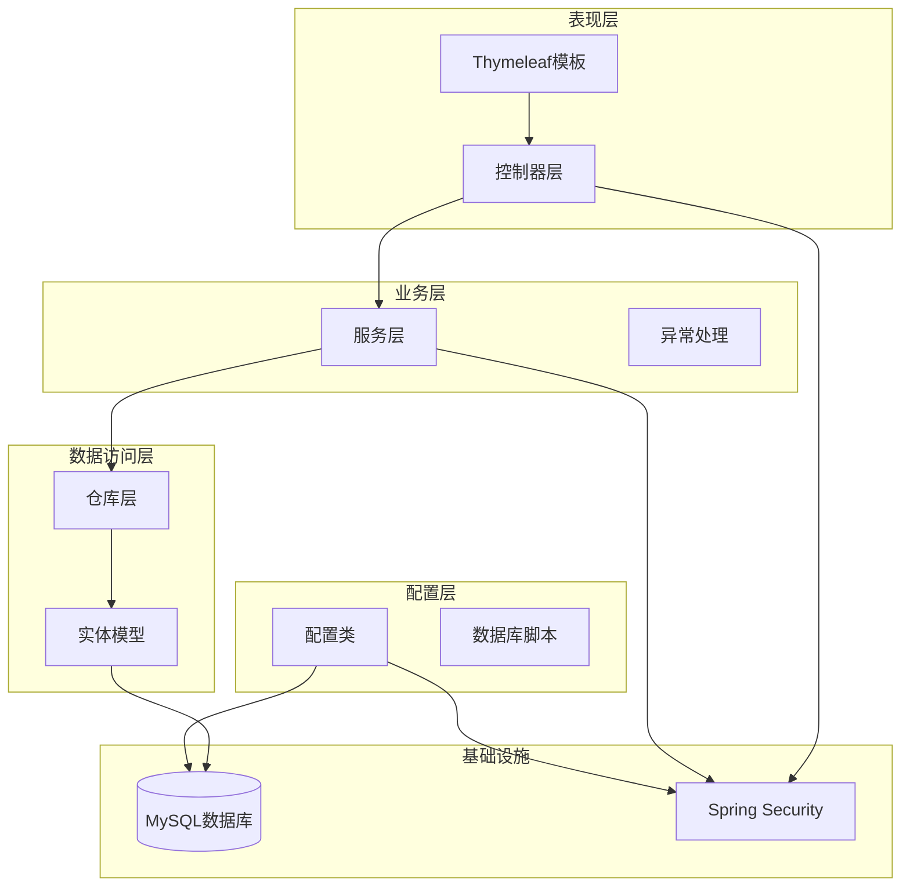
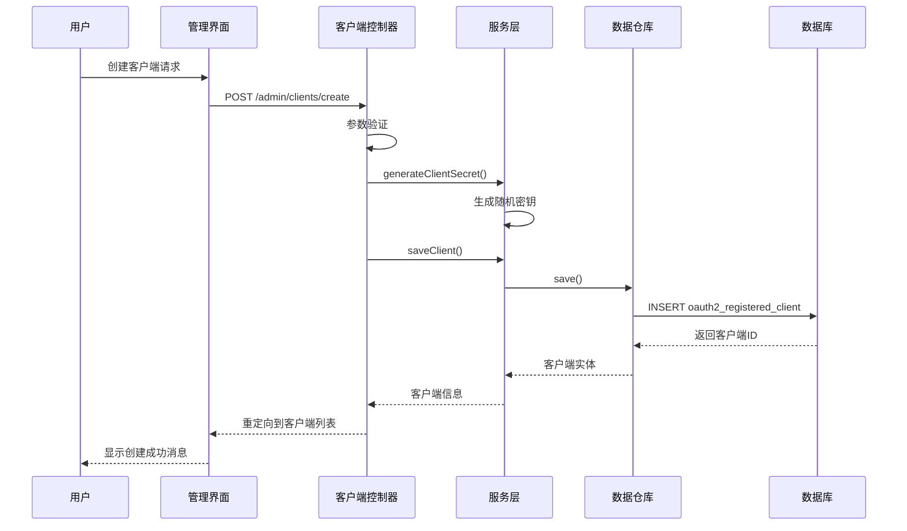
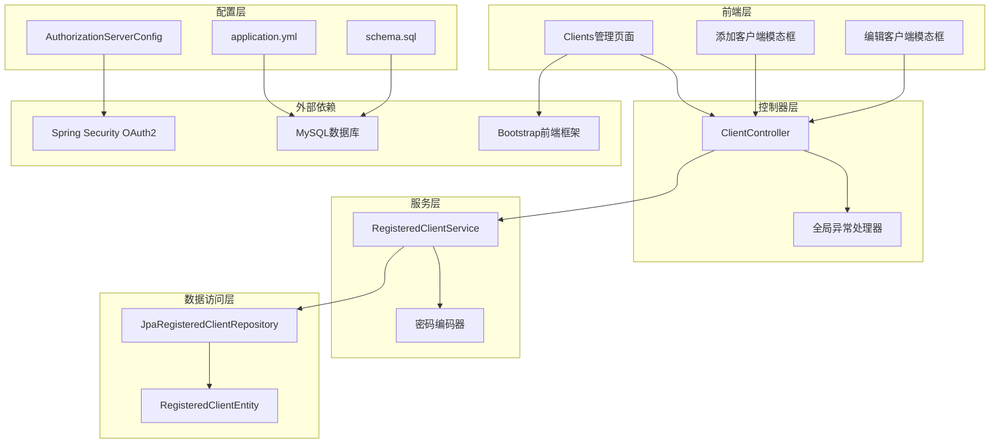
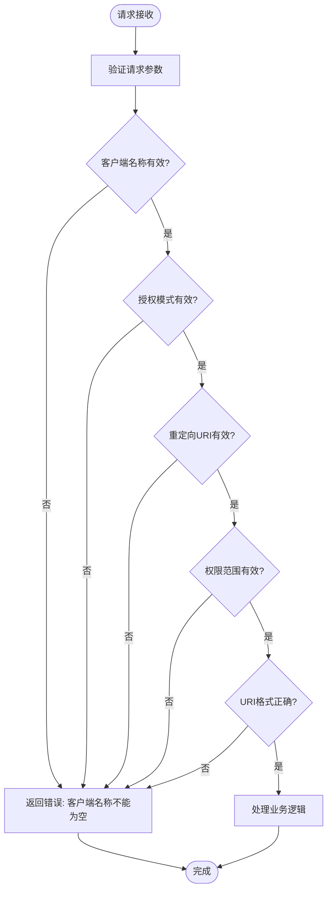
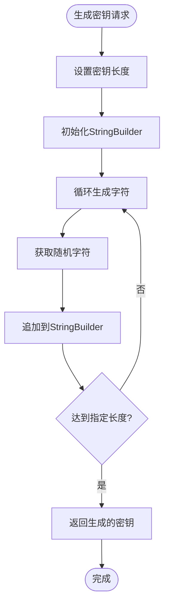
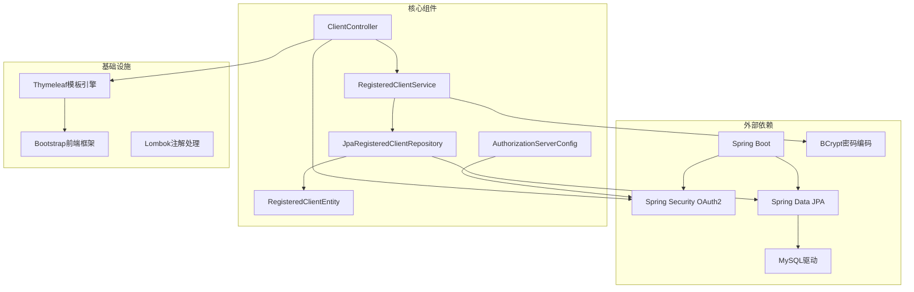
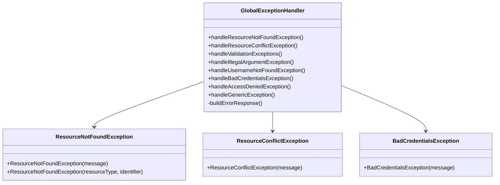

# OAuth2客户端管理

<cite>
**本文档引用的文件**
- [ClientController.java](file://src/main/java/com/example/authserver/controller/ClientController.java)
- [RegisteredClientService.java](file://src/main/java/com/example/authserver/service/RegisteredClientService.java)
- [RegisteredClientEntity.java](file://src/main/java/com/example/authserver/entity/RegisteredClientEntity.java)
- [JpaRegisteredClientRepository.java](file://src/main/java/com/example/authserver/repository/JpaRegisteredClientRepository.java)
- [AuthorizationServerConfig.java](file://src/main/java/com/example/authserver/config/AuthorizationServerConfig.java)
- [application.yml](file://src/main/resources/application.yml)
- [schema.sql](file://src/main/resources/schema.sql)
- [clients.html](file://src/main/resources/templates/admin/clients.html)
- [GlobalExceptionHandler.java](file://src/main/java/com/example/authserver/exception/GlobalExceptionHandler.java)
- [ResourceNotFoundException.java](file://src/main/java/com/example/authserver/exception/ResourceNotFoundException.java)
- [AuthServerApplication.java](file://src/main/java/com/example/authserver/AuthServerApplication.java)
</cite>

## 目录
1. [简介](#简介)
2. [项目结构](#项目结构)
3. [核心组件](#核心组件)
4. [架构概览](#架构概览)
5. [详细组件分析](#详细组件分析)
6. [依赖关系分析](#依赖关系分析)
7. [性能考虑](#性能考虑)
8. [故障排除指南](#故障排除指南)
9. [结论](#结论)
10. [附录](#附录)

## 简介

这是一个基于Spring Security OAuth2 Authorization Server构建的OAuth2客户端管理系统。系统提供了完整的OAuth2客户端生命周期管理功能，包括客户端注册、配置验证、密钥管理、安全机制实施等核心功能。系统支持多种OAuth2客户端类型，包括Web应用、移动应用和后端服务，并实现了完善的前端管理界面和REST API接口。

## 项目结构

该项目采用标准的Spring Boot项目结构，主要分为以下层次：



**图表来源**
- [AuthServerApplication.java:1-14](file://src/main/java/com/example/authserver/AuthServerApplication.java#L1-L14)
- [AuthorizationServerConfig.java:1-256](file://src/main/java/com/example/authserver/config/AuthorizationServerConfig.java#L1-L256)

**章节来源**
- [AuthServerApplication.java:1-14](file://src/main/java/com/example/authserver/AuthServerApplication.java#L1-L14)
- [application.yml:1-29](file://src/main/resources/application.yml#L1-L29)

## 核心组件

### OAuth2客户端类型分类

系统支持三种主要的OAuth2客户端类型，每种类型都有其特定的安全配置和使用场景：

#### Web应用客户端（机密客户端）
- **认证方式**: CLIENT_SECRET_BASIC
- **适用场景**: 服务器端Web应用，需要安全的客户端凭据交换
- **安全特性**: 
  - 必须使用客户端密钥进行认证
  - 支持PKCE增强安全性
  - 需要用户授权同意
- **典型配置**: 授权码模式 + 刷新令牌 + PKCE

#### 移动应用客户端（公开客户端）
- **认证方式**: NONE（公开客户端）
- **适用场景**: 原生移动应用，无法安全存储客户端密钥
- **安全特性**:
  - 不使用客户端密钥进行认证
  - 强制使用PKCE防止授权码拦截攻击
  - 支持自定义URI Scheme回调
- **典型配置**: 授权码模式 + 刷新令牌 + PKCE

#### 后端服务客户端（机密客户端）
- **认证方式**: CLIENT_SECRET_BASIC
- **适用场景**: 服务间通信，无需用户交互
- **安全特性**:
  - 使用客户端密钥进行认证
  - 不需要用户授权同意
  - 短令牌有效期
- **典型配置**: 客户端凭证模式

### 客户端CRUD操作实现

系统提供了完整的客户端生命周期管理功能：



**图表来源**
- [ClientController.java:93-186](file://src/main/java/com/example/authserver/controller/ClientController.java#L93-L186)
- [RegisteredClientService.java:61-64](file://src/main/java/com/example/authserver/service/RegisteredClientService.java#L61-L64)

**章节来源**
- [ClientController.java:93-186](file://src/main/java/com/example/authserver/controller/ClientController.java#L93-L186)
- [RegisteredClientService.java:61-82](file://src/main/java/com/example/authserver/service/RegisteredClientService.java#L61-L82)

## 架构概览

系统采用分层架构设计，确保关注点分离和代码的可维护性：



**图表来源**
- [ClientController.java:1-360](file://src/main/java/com/example/authserver/controller/ClientController.java#L1-L360)
- [RegisteredClientService.java:1-131](file://src/main/java/com/example/authserver/service/RegisteredClientService.java#L1-L131)
- [AuthorizationServerConfig.java:1-256](file://src/main/java/com/example/authserver/config/AuthorizationServerConfig.java#L1-L256)

## 详细组件分析

### 客户端控制器（ClientController）

客户端控制器是系统的核心入口点，负责处理所有客户端管理相关的HTTP请求：

#### 主要功能模块

1. **客户端列表展示**
   - 查询所有客户端配置
   - 格式化显示客户端信息
   - 支持客户端搜索和过滤

2. **客户端创建流程**
   - 自动生成客户端ID
   - 密钥管理（机密客户端自动生成，公开客户端可为空）
   - 配置验证和持久化

3. **客户端更新流程**
   - 客户端配置修改
   - 密钥更新和加密
   - 配置验证和持久化

4. **客户端删除流程**
   - 客户端实体删除
   - 数据库记录清理

#### 安全验证机制



**图表来源**
- [ClientController.java:273-296](file://src/main/java/com/example/authserver/controller/ClientController.java#L273-L296)

**章节来源**
- [ClientController.java:33-67](file://src/main/java/com/example/authserver/controller/ClientController.java#L33-L67)
- [ClientController.java:93-186](file://src/main/java/com/example/authserver/controller/ClientController.java#L93-L186)
- [ClientController.java:255-358](file://src/main/java/com/example/authserver/controller/ClientController.java#L255-L358)

### 客户端服务层（RegisteredClientService）

服务层封装了所有业务逻辑，提供线程安全和事务管理：

#### 核心功能

1. **客户端管理**
   - 客户端查询和检索
   - 客户端保存和删除
   - 客户端ID和密钥生成

2. **密钥管理**
   - 客户端密钥加密
   - 密钥长度验证
   - 密钥过期时间管理

3. **数据转换**
   - 列表到字符串转换
   - 字符串到列表转换
   - URI格式处理

#### 密钥生成算法



**图表来源**
- [RegisteredClientService.java:94-102](file://src/main/java/com/example/authserver/service/RegisteredClientService.java#L94-L102)

**章节来源**
- [RegisteredClientService.java:28-82](file://src/main/java/com/example/authserver/service/RegisteredClientService.java#L28-L82)
- [RegisteredClientService.java:94-109](file://src/main/java/com/example/authserver/service/RegisteredClientService.java#L94-L109)

### 数据模型（RegisteredClientEntity）

实体模型映射到数据库表结构，支持复杂的OAuth2配置：

#### 关键字段说明

| 字段名 | 类型 | 描述 | 约束 |
|--------|------|------|------|
| id | varchar(100) | 客户端唯一标识 | 主键, UUID |
| client_id | varchar(100) | OAuth2客户端ID | 唯一索引 |
| client_secret | varchar(500) | BCrypt加密的客户端密钥 | 可为空 |
| client_name | varchar(200) | 客户端显示名称 | 非空 |
| client_authentication_methods | varchar(1000) | 认证方式列表 | 非空 |
| authorization_grant_types | varchar(1000) | 授权类型列表 | 非空 |
| redirect_uris | varchar(1000) | 重定向URI列表 | 可为空 |
| scopes | varchar(1000) | 权限范围列表 | 非空 |
| require_authorization_consent | boolean | 是否需要用户授权 | 非空 |
| require_proof_key | boolean | 是否需要PKCE | 非空 |
| access_token_time_to_live | int | 访问令牌有效期(秒) | 非空 |
| refresh_token_time_to_live | int | 刷新令牌有效期(秒) | 非空 |

**章节来源**
- [RegisteredClientEntity.java:14-111](file://src/main/java/com/example/authserver/entity/RegisteredClientEntity.java#L14-L111)

### 数据访问层（JpaRegisteredClientRepository）

数据访问层实现了Spring Security OAuth2的RegisteredClientRepository接口：

#### 核心功能

1. **客户端存储**
   - 客户端配置的保存和更新
   - 客户端配置的查询和检索
   - 客户端配置的删除

2. **数据转换**
   - Spring Security OAuth2实体与数据库实体的双向转换
   - 时间类型的转换（Instant ↔ LocalDateTime）
   - 集合类型的转换（逗号分隔字符串 ↔ List）

3. **事务管理**
   - 所有数据库操作都在事务中执行
   - 确保数据一致性和完整性

**章节来源**
- [JpaRegisteredClientRepository.java:29-51](file://src/main/java/com/example/authserver/repository/JpaRegisteredClientRepository.java#L29-L51)
- [JpaRegisteredClientRepository.java:141-180](file://src/main/java/com/example/authserver/repository/JpaRegisteredClientRepository.java#L141-L180)

### 配置管理（AuthorizationServerConfig）

系统配置类负责OAuth2授权服务器的整体配置：

#### 默认客户端配置

系统在启动时自动初始化三个默认客户端：

1. **Web应用客户端**
   - 客户端ID: web-app-client
   - 认证方式: CLIENT_SECRET_BASIC
   - 授权模式: 授权码 + 刷新令牌
   - 权限范围: openid, profile, api.read, api.write
   - 令牌有效期: Access Token 2小时, Refresh Token 7天

2. **移动应用客户端**
   - 客户端ID: mobile-app-client
   - 认证方式: NONE（公开客户端）
   - 授权模式: 授权码 + 刷新令牌
   - 回调URI: myapp://callback
   - PKCE: 强制启用
   - 令牌有效期: Access Token 1小时, Refresh Token 30天

3. **后端服务客户端**
   - 客户端ID: backend-service
   - 认证方式: CLIENT_SECRET_BASIC
   - 授权模式: 客户端凭证
   - 权限范围: api.read, api.write
   - 用户授权: 不需要
   - 令牌有效期: Access Token 30分钟

**章节来源**
- [AuthorizationServerConfig.java:94-155](file://src/main/java/com/example/authserver/config/AuthorizationServerConfig.java#L94-L155)

## 依赖关系分析

系统各组件之间的依赖关系清晰明确：



**图表来源**
- [ClientController.java:1-360](file://src/main/java/com/example/authserver/controller/ClientController.java#L1-L360)
- [RegisteredClientService.java:1-131](file://src/main/java/com/example/authserver/service/RegisteredClientService.java#L1-L131)
- [AuthorizationServerConfig.java:1-256](file://src/main/java/com/example/authserver/config/AuthorizationServerConfig.java#L1-L256)

**章节来源**
- [ClientController.java:1-360](file://src/main/java/com/example/authserver/controller/ClientController.java#L1-L360)
- [RegisteredClientService.java:1-131](file://src/main/java/com/example/authserver/service/RegisteredClientService.java#L1-L131)

## 性能考虑

### 数据库优化

1. **索引设计**
   - oauth2_registered_client表的client_id字段建立了唯一索引
   - 提高客户端查询效率，避免全表扫描

2. **连接池配置**
   - 使用Spring Boot的自动配置
   - 支持连接池大小和超时时间的灵活配置

3. **查询优化**
   - 使用JPQL查询替代原生SQL
   - 支持懒加载和批量抓取优化

### 缓存策略

1. **会话缓存**
   - Spring Security自动管理用户会话
   - 支持分布式会话存储

2. **配置缓存**
   - OAuth2客户端配置缓存
   - 减少数据库查询次数

### 并发控制

1. **事务管理**
   - 所有数据库操作都在事务中执行
   - 支持乐观锁和悲观锁

2. **线程安全**
   - 使用不可变对象
   - 避免共享可变状态

## 故障排除指南

### 常见问题及解决方案

#### 客户端ID冲突
**症状**: 创建客户端时报错"客户端ID已存在"
**原因**: 客户端ID重复
**解决方案**: 
1. 使用自动生成的客户端ID
2. 检查数据库中是否存在重复的client_id
3. 修改客户端ID后重试

#### 密钥格式错误
**症状**: 更新客户端时报错"密钥格式不正确"
**原因**: 密钥不符合BCrypt格式要求
**解决方案**:
1. 确保使用系统生成的密钥
2. 避免手动修改加密后的密钥
3. 如需重置密钥，删除后重新创建客户端

#### URI格式验证失败
**症状**: 重定向URI验证失败
**原因**: URI格式不符合要求
**解决方案**:
1. 确保URI以http://或https://开头
2. 避免包含特殊字符
3. 检查URI的域名和端口

#### 权限范围无效
**症状**: 权限范围验证失败
**原因**: 权限范围为空或格式不正确
**解决方案**:
1. 至少选择一个权限范围
2. 使用标准的OpenID Connect范围
3. 添加自定义范围时遵循命名规范

### 错误处理机制

系统实现了完善的异常处理机制：



**图表来源**
- [GlobalExceptionHandler.java:28-117](file://src/main/java/com/example/authserver/exception/GlobalExceptionHandler.java#L28-L117)
- [ResourceNotFoundException.java:6-15](file://src/main/java/com/example/authserver/exception/ResourceNotFoundException.java#L6-L15)

**章节来源**
- [GlobalExceptionHandler.java:1-130](file://src/main/java/com/example/authserver/exception/GlobalExceptionHandler.java#L1-L130)
- [ResourceNotFoundException.java:1-16](file://src/main/java/com/example/authserver/exception/ResourceNotFoundException.java#L1-L16)

## 结论

这个OAuth2客户端管理系统提供了完整的客户端生命周期管理功能，具有以下特点：

1. **安全性**: 支持多种认证方式和安全机制，包括PKCE、用户授权同意等
2. **易用性**: 提供直观的Web管理界面和REST API接口
3. **可扩展性**: 基于Spring Security OAuth2构建，易于扩展和定制
4. **可靠性**: 实现了完善的错误处理和异常管理机制

系统适用于各种规模的应用场景，从简单的Web应用到复杂的企业级系统都能提供可靠的OAuth2客户端管理能力。

## 附录

### REST API接口文档

#### 客户端管理API

| 方法 | 端点 | 描述 | 请求参数 | 响应 |
|------|------|------|----------|------|
| GET | `/admin/clients` | 获取客户端列表 | 无 | 客户端列表JSON |
| POST | `/admin/clients/create` | 创建客户端 | 客户端配置表单 | 重定向到客户端列表 |
| POST | `/admin/clients/update` | 更新客户端 | 客户端配置表单 | 重定向到客户端列表 |
| POST | `/admin/clients/delete` | 删除客户端 | id | 重定向到客户端列表 |
| GET | `/admin/clients/detail/{clientId}` | 获取客户端详情 | clientId | 客户端配置JSON |

#### 客户端配置示例

**Web应用客户端配置示例**:
```json
{
  "clientId": "web-app-client",
  "clientName": "Web应用",
  "clientAuthenticationMethods": ["CLIENT_SECRET_BASIC"],
  "authorizationGrantTypes": ["authorization_code", "refresh_token"],
  "redirectUris": ["http://127.0.0.1:9000/authorized"],
  "scopes": ["openid", "profile", "api.read", "api.write"],
  "requireConsent": true,
  "requireProofKey": false,
  "accessTokenTTL": 2,
  "refreshTokenTTL": 7
}
```

**移动应用客户端配置示例**:
```json
{
  "clientId": "mobile-app-client",
  "clientName": "移动应用",
  "clientAuthenticationMethods": ["NONE"],
  "authorizationGrantTypes": ["authorization_code", "refresh_token"],
  "redirectUris": ["myapp://callback"],
  "scopes": ["openid", "profile", "api.read"],
  "requireConsent": true,
  "requireProofKey": true,
  "accessTokenTTL": 1,
  "refreshTokenTTL": 30
}
```

**后端服务客户端配置示例**:
```json
{
  "clientId": "backend-service",
  "clientName": "后端服务",
  "clientAuthenticationMethods": ["CLIENT_SECRET_BASIC"],
  "authorizationGrantTypes": ["client_credentials"],
  "redirectUris": null,
  "scopes": ["api.read", "api.write"],
  "requireConsent": false,
  "requireProofKey": false,
  "accessTokenTTL": 0.5,
  "refreshTokenTTL": 0
}
```

### 安全最佳实践

1. **密钥管理**
   - 使用系统自动生成的客户端密钥
   - 定期轮换客户端密钥
   - 限制密钥的有效期

2. **URI验证**
   - 严格验证重定向URI
   - 避免使用通配符URI
   - 使用HTTPS协议

3. **权限范围控制**
   - 最小权限原则
   - 定期审查权限范围
   - 使用标准的OpenID Connect范围

4. **PKCE配置**
   - 公开客户端必须启用PKCE
   - 机密客户端可选择启用PKCE
   - 定期更新PKCE配置

5. **令牌管理**
   - 合理设置令牌有效期
   - 启用刷新令牌轮换
   - 监控令牌使用情况