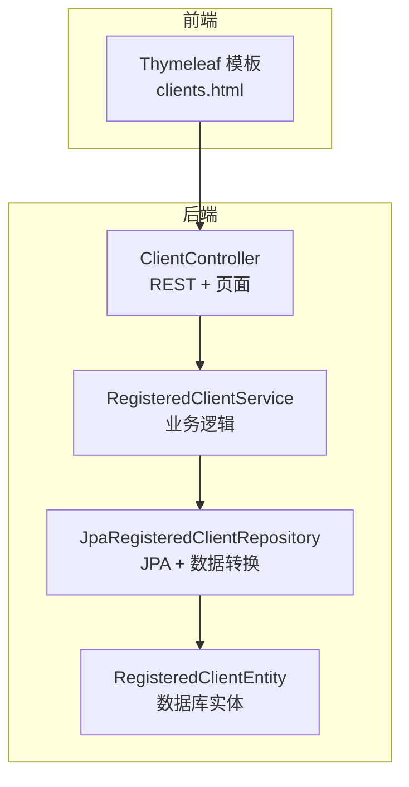
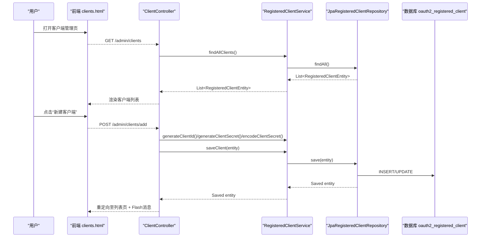
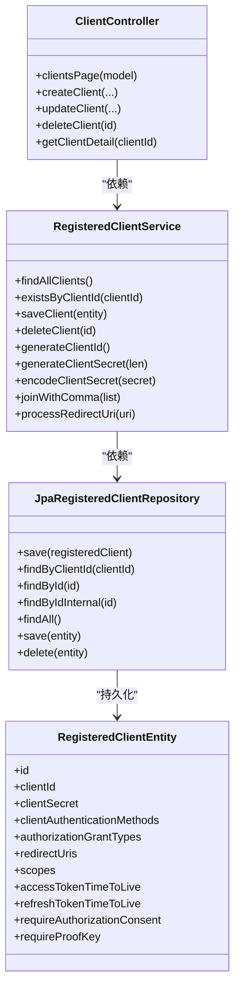
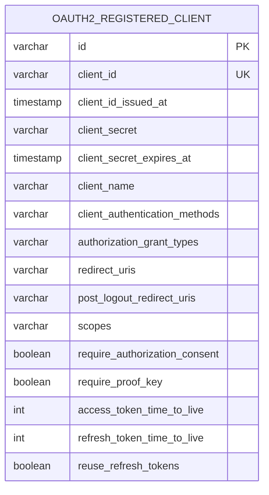
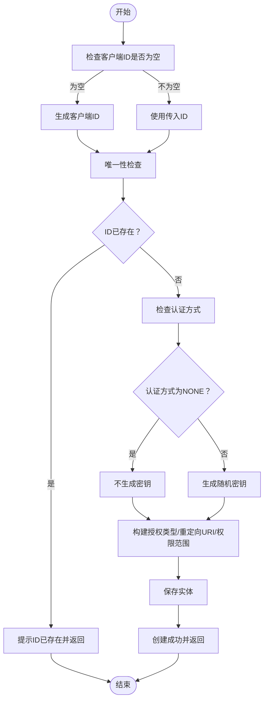
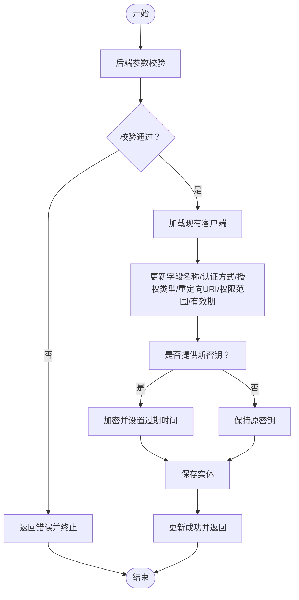
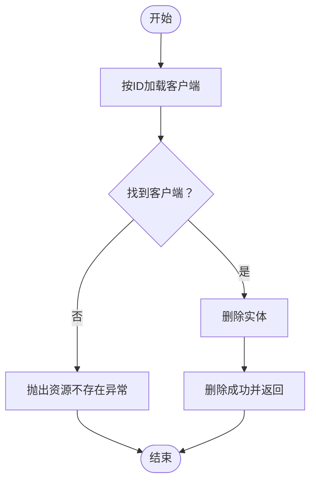

# 客户端CRUD操作

<cite>
**本文引用的文件**
- [ClientController.java](file://src/main/java/com/example/authserver/controller/ClientController.java)
- [RegisteredClientService.java](file://src/main/java/com/example/authserver/service/RegisteredClientService.java)
- [JpaRegisteredClientRepository.java](file://src/main/java/com/example/authserver/repository/JpaRegisteredClientRepository.java)
- [RegisteredClientEntity.java](file://src/main/java/com/example/authserver/entity/RegisteredClientEntity.java)
- [clients.html](file://src/main/resources/templates/admin/clients.html)
- [GlobalExceptionHandler.java](file://src/main/java/com/example/authserver/exception/GlobalExceptionHandler.java)
- [ResourceConflictException.java](file://src/main/java/com/example/authserver/exception/ResourceConflictException.java)
- [ResourceNotFoundException.java](file://src/main/java/com/example/authserver/exception/ResourceNotFoundException.java)
- [application.yml](file://src/main/resources/application.yml)
- [schema.sql](file://src/main/resources/schema.sql)
</cite>

## 目录
1. [简介](#简介)
2. [项目结构](#项目结构)
3. [核心组件](#核心组件)
4. [架构总览](#架构总览)
5. [详细组件分析](#详细组件分析)
6. [依赖分析](#依赖分析)
7. [性能考虑](#性能考虑)
8. [故障排查指南](#故障排查指南)
9. [结论](#结论)
10. [附录](#附录)

## 简介
本文件面向OAuth2客户端的完整生命周期管理，围绕“创建、读取、更新、删除”四个核心CRUD操作展开，覆盖：
- 客户端创建流程中的参数校验、唯一性检查、密钥生成与存储策略
- 客户端更新流程中的字段变更、密钥轮换、配置修改机制
- 客户端删除的安全检查与清理流程
- 完整的REST API接口文档（含HTTP方法、URL模式、请求参数、响应格式）
- 前端管理界面的交互逻辑与数据绑定机制
- 错误处理与异常场景的处理方案

## 项目结构
系统采用经典的三层架构：控制器层负责HTTP请求与视图渲染；服务层封装业务逻辑；仓库层负责持久化与数据转换。前端模板通过Thymeleaf渲染，同时提供AJAX调用以支持“编辑详情”等交互。

图表来源
- [ClientController.java:1-360](file://src/main/java/com/example/authserver/controller/ClientController.java#L1-L360)
- [RegisteredClientService.java:1-131](file://src/main/java/com/example/authserver/service/RegisteredClientService.java#L1-L131)
- [JpaRegisteredClientRepository.java:1-289](file://src/main/java/com/example/authserver/repository/JpaRegisteredClientRepository.java#L1-L289)
- [RegisteredClientEntity.java:1-111](file://src/main/java/com/example/authserver/entity/RegisteredClientEntity.java#L1-L111)

章节来源
- [ClientController.java:1-360](file://src/main/java/com/example/authserver/controller/ClientController.java#L1-L360)
- [RegisteredClientService.java:1-131](file://src/main/java/com/example/authserver/service/RegisteredClientService.java#L1-L131)
- [JpaRegisteredClientRepository.java:1-289](file://src/main/java/com/example/authserver/repository/JpaRegisteredClientRepository.java#L1-L289)
- [RegisteredClientEntity.java:1-111](file://src/main/java/com/example/authserver/entity/RegisteredClientEntity.java#L1-L111)

## 核心组件
- 控制器层：提供REST端点与管理页面，负责参数接收、校验、调用服务层、返回结果与视图渲染。
- 服务层：封装业务规则，如客户端ID生成、密钥编码、唯一性检查、实体保存与删除。
- 仓库层：实现Spring Authorization Server的RegisteredClientRepository接口，完成实体与RegisteredClient之间的双向转换，以及JPA持久化。
- 实体层：映射oauth2_registered_client表，包含客户端ID、密钥、认证方式、授权类型、重定向URI、权限范围、Token有效期等字段。
- 前端模板：提供客户端列表、创建与编辑弹窗，内置表单校验与动态UI联动。

章节来源
- [ClientController.java:1-360](file://src/main/java/com/example/authserver/controller/ClientController.java#L1-L360)
- [RegisteredClientService.java:1-131](file://src/main/java/com/example/authserver/service/RegisteredClientService.java#L1-L131)
- [JpaRegisteredClientRepository.java:1-289](file://src/main/java/com/example/authserver/repository/JpaRegisteredClientRepository.java#L1-L289)
- [RegisteredClientEntity.java:1-111](file://src/main/java/com/example/authserver/entity/RegisteredClientEntity.java#L1-L111)
- [clients.html:1-2120](file://src/main/resources/templates/admin/clients.html#L1-L2120)

## 架构总览
系统通过控制器暴露REST端点，服务层协调业务规则，仓库层负责与Spring Authorization Server的RegisteredClient模型对接与JPA持久化。前端通过AJAX拉取客户端详情，填充编辑表单；表单提交通过POST端点完成创建与更新。

图表来源
- [ClientController.java:33-186](file://src/main/java/com/example/authserver/controller/ClientController.java#L33-L186)
- [RegisteredClientService.java:31-131](file://src/main/java/com/example/authserver/service/RegisteredClientService.java#L31-L131)
- [JpaRegisteredClientRepository.java:103-136](file://src/main/java/com/example/authserver/repository/JpaRegisteredClientRepository.java#L103-L136)
- [schema.sql:60-81](file://src/main/resources/schema.sql#L60-L81)

## 详细组件分析

### 控制器：ClientController
- 管理页面：GET /admin/clients 返回客户端列表，预处理逗号分隔字段，注入页面模型。
- 创建客户端：POST /admin/clients/create 与 /admin/clients/add
  - 自动生成客户端ID（若为空）
  - 唯一性检查（基于服务层）
  - 密钥生成策略：公开客户端（NONE）不生成密钥；否则生成固定长度随机密钥
  - 参数校验：客户端名称、授权模式、重定向URI格式、权限范围
  - 保存实体并返回重定向与Flash消息
- 更新客户端：POST /admin/clients/update
  - 后端严格校验：客户端名称必填、至少一个授权模式、重定向URI必填且格式正确、至少一个权限范围
  - 仅在提供新密钥时进行加密与过期时间更新
  - 保存实体并返回重定向与Flash消息
- 删除客户端：POST /admin/clients/delete
  - 通过服务层按ID查找并删除
  - 返回重定向与Flash消息
- 客户端详情（JSON）：GET /admin/clients/detail/{clientId}
  - 从服务层获取全部客户端，筛选匹配clientId，构建返回对象（含逗号分隔字段拆分）

章节来源
- [ClientController.java:33-358](file://src/main/java/com/example/authserver/controller/ClientController.java#L33-L358)

### 服务层：RegisteredClientService
- 查询与唯一性：findAllClients()、existsByClientId()、findByClientId()
- 保存与删除：saveClient()（事务）、deleteClient()（事务）
- 工具方法：generateClientId()、generateClientSecret()、encodeClientSecret()、joinWithComma()、processRedirectUri()
- 异常：ResourceNotFoundException用于删除/查询不存在时抛出

章节来源
- [RegisteredClientService.java:31-82](file://src/main/java/com/example/authserver/service/RegisteredClientService.java#L31-L82)

### 仓库层：JpaRegisteredClientRepository
- 实现RegisteredClientRepository接口，完成RegisteredClient与RegisteredClientEntity的双向转换
- save()：若存在则合并更新，不存在则新增
- findByClientId()：按client_id查询RegisteredClient
- findByIdInternal()：按UUID查询实体（内部管理使用）
- findAll()：查询所有实体
- save(entity)：统一使用merge，确保ID为UUID
- delete(entity)：删除实体

章节来源
- [JpaRegisteredClientRepository.java:29-287](file://src/main/java/com/example/authserver/repository/JpaRegisteredClientRepository.java#L29-L287)

### 实体层：RegisteredClientEntity
- 映射oauth2_registered_client表，字段覆盖认证方式、授权类型、重定向URI、权限范围、Token有效期、PKCE与授权同意等
- ID为主键，client_id唯一索引

章节来源
- [RegisteredClientEntity.java:14-110](file://src/main/java/com/example/authserver/entity/RegisteredClientEntity.java#L14-L110)
- [schema.sql:60-81](file://src/main/resources/schema.sql#L60-L81)

### 前端：clients.html
- 列表展示：客户端名称、认证方式、授权模式、重定向URI、权限范围、操作菜单
- 创建弹窗：基本信息、授权配置、高级设置（Token有效期、安全选项、客户端密钥）
- 编辑弹窗：通过AJAX GET /admin/clients/detail/{clientId}获取JSON并填充表单
- 表单校验：前端对重定向URI格式进行简单校验；编辑表单对必填项进行校验
- 动态UI：根据认证方式与授权模式切换重定向URI、PKCE、Token有效期等控件显示与禁用状态

章节来源
- [clients.html:240-808](file://src/main/resources/templates/admin/clients.html#L240-L808)
- [clients.html:811-2120](file://src/main/resources/templates/admin/clients.html#L811-L2120)

### 异常处理：GlobalExceptionHandler
- 统一处理ResourceNotFoundException、ResourceConflictException、MethodArgumentNotValidException、IllegalArgumentException、BadCredentialsException、AccessDeniedException等
- 返回包含时间戳、状态码、消息的标准化错误响应

章节来源
- [GlobalExceptionHandler.java:28-117](file://src/main/java/com/example/authserver/exception/GlobalExceptionHandler.java#L28-L117)
- [ResourceConflictException.java:1-16](file://src/main/java/com/example/authserver/exception/ResourceConflictException.java#L1-L16)
- [ResourceNotFoundException.java:1-16](file://src/main/java/com/example/authserver/exception/ResourceNotFoundException.java#L1-L16)

## 依赖分析
- 控制器依赖服务层；服务层依赖仓库层；仓库层依赖实体与Spring Authorization Server模型
- 前端依赖Bootstrap与jQuery（通过CDN引入），并与控制器端点交互
- 数据库初始化脚本定义了oauth2_registered_client表结构及索引

图表来源
- [ClientController.java:28-28](file://src/main/java/com/example/authserver/controller/ClientController.java#L28-L28)
- [RegisteredClientService.java:25-26](file://src/main/java/com/example/authserver/service/RegisteredClientService.java#L25-L26)
- [JpaRegisteredClientRepository.java:21-21](file://src/main/java/com/example/authserver/repository/JpaRegisteredClientRepository.java#L21-L21)
- [RegisteredClientEntity.java:14-110](file://src/main/java/com/example/authserver/entity/RegisteredClientEntity.java#L14-L110)

## 性能考虑
- 查询优化：列表页一次性加载全部客户端，前端进行筛选与展示；若客户端数量较大，建议改为分页查询与服务端筛选。
- 保存策略：仓库层统一使用merge，确保UUID主键一致性；批量导入时可考虑批处理以减少事务开销。
- 密钥存储：当前采用明文密钥（仅在创建时使用），建议在生产环境对密钥进行加密存储与定期轮换。
- 前端交互：AJAX获取详情时建议增加缓存与防抖，避免频繁请求。

[本节为通用指导，无需具体文件引用]

## 故障排查指南
- 创建失败（客户端ID已存在）
  - 现象：创建时提示“客户端ID已存在”
  - 原因：控制器在创建前进行唯一性检查
  - 处理：更换客户端ID或留空由系统自动生成
- 更新失败（参数校验失败）
  - 现象：编辑时提示“客户端名称不能为空/至少选择一个授权模式/重定向URI格式不正确/至少选择一个权限范围”
  - 原因：控制器对必填项与格式进行严格校验
  - 处理：补齐必填项并修正格式
- 删除失败（客户端不存在）
  - 现象：删除后提示“客户端不存在”
  - 原因：服务层按ID查找实体，不存在时抛出ResourceNotFoundException
  - 处理：确认客户端ID正确或刷新页面重新获取
- 全局异常
  - 现象：统一返回包含时间戳、状态码、消息的错误响应
  - 处理：查看日志定位具体异常类型并修复

章节来源
- [ClientController.java:116-121](file://src/main/java/com/example/authserver/controller/ClientController.java#L116-L121)
- [ClientController.java:273-296](file://src/main/java/com/example/authserver/controller/ClientController.java#L273-L296)
- [RegisteredClientService.java:69-72](file://src/main/java/com/example/authserver/service/RegisteredClientService.java#L69-L72)
- [GlobalExceptionHandler.java:28-117](file://src/main/java/com/example/authserver/exception/GlobalExceptionHandler.java#L28-L117)

## 结论
本系统提供了完整的OAuth2客户端CRUD能力，从前端交互到后端业务与持久化形成闭环。创建流程强调唯一性与密钥策略，更新流程强调参数校验与密钥轮换，删除流程强调安全检查。建议在生产环境中进一步强化密钥加密、权限控制与审计日志。

[本节为总结性内容，无需具体文件引用]

## 附录

### REST API接口文档

- 获取客户端列表
  - 方法：GET
  - URL：/admin/clients
  - 响应：渲染客户端列表页面（HTML）

- 创建客户端
  - 方法：POST
  - URL：/admin/clients/create 或 /admin/clients/add
  - 请求参数：
    - clientId：客户端ID（可空，为空时自动生成）
    - clientName：客户端名称（必填）
    - clientSecret：客户端密钥（可空；NONE认证方式时不生成密钥）
    - clientAuthenticationMethod：认证方式（默认CLIENT_SECRET_BASIC）
    - authorizationGrantTypes：授权模式列表（必填，至少一个）
    - redirectUri：重定向URI（必填，授权码模式时）
    - scopes：权限范围列表（必填，至少一个）
    - accessTokenTTL：Access Token有效期（小时，默认2）
    - refreshTokenTTL：Refresh Token有效期（天，默认7）
    - requireConsent：是否需要用户授权确认（布尔，默认false）
    - requireProofKey：是否需要PKCE（布尔，默认false）
  - 响应：重定向至客户端管理页 + Flash消息

- 更新客户端
  - 方法：POST
  - URL：/admin/clients/update
  - 请求参数：同上（clientId为必填，用于定位目标）
  - 响应：重定向至客户端管理页 + Flash消息

- 删除客户端
  - 方法：POST
  - URL：/admin/clients/delete
  - 请求参数：id（客户端UUID）
  - 响应：重定向至客户端管理页 + Flash消息

- 获取客户端详情（JSON）
  - 方法：GET
  - URL：/admin/clients/detail/{clientId}
  - 响应：JSON对象，包含clientId、clientName、clientSecret、clientAuthenticationMethods、authorizationGrantTypes、scopes、redirectUris、accessTokenTTL（小时）、refreshTokenTTL（天）、requireConsent、requireProofKey

章节来源
- [ClientController.java:93-186](file://src/main/java/com/example/authserver/controller/ClientController.java#L93-L186)
- [ClientController.java:255-358](file://src/main/java/com/example/authserver/controller/ClientController.java#L255-L358)
- [ClientController.java:191-212](file://src/main/java/com/example/authserver/controller/ClientController.java#L191-L212)
- [ClientController.java:217-250](file://src/main/java/com/example/authserver/controller/ClientController.java#L217-L250)

### 数据模型与字段说明

图表来源
- [schema.sql:60-81](file://src/main/resources/schema.sql#L60-L81)

### 前端交互与数据绑定机制
- 列表页：Thymeleaf遍历客户端集合，渲染基础信息与操作按钮
- 创建弹窗：表单字段与认证方式联动，动态控制重定向URI、PKCE、Token有效期等控件显示与禁用
- 编辑弹窗：通过AJAX拉取JSON详情，填充表单并根据认证方式与授权模式调整UI状态
- 表单校验：前端对重定向URI进行格式校验；编辑表单对必填项进行校验；提交前统一触发校验

章节来源
- [clients.html:240-808](file://src/main/resources/templates/admin/clients.html#L240-L808)
- [clients.html:811-2120](file://src/main/resources/templates/admin/clients.html#L811-L2120)

### 客户端创建流程（算法流程图）

图表来源
- [ClientController.java:112-171](file://src/main/java/com/example/authserver/controller/ClientController.java#L112-L171)
- [RegisteredClientService.java:87-102](file://src/main/java/com/example/authserver/service/RegisteredClientService.java#L87-L102)

### 客户端更新流程（算法流程图）

图表来源
- [ClientController.java:273-342](file://src/main/java/com/example/authserver/controller/ClientController.java#L273-L342)
- [RegisteredClientService.java:107-109](file://src/main/java/com/example/authserver/service/RegisteredClientService.java#L107-L109)

### 客户端删除流程（算法流程图）

图表来源
- [ClientController.java:198-209](file://src/main/java/com/example/authserver/controller/ClientController.java#L198-L209)
- [RegisteredClientService.java:79-81](file://src/main/java/com/example/authserver/service/RegisteredClientService.java#L79-L81)