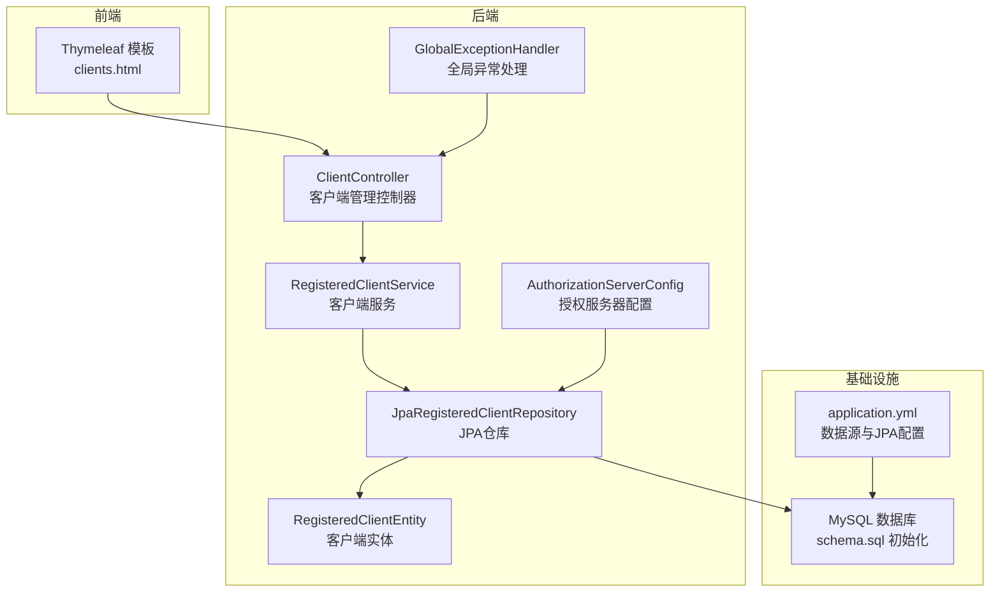
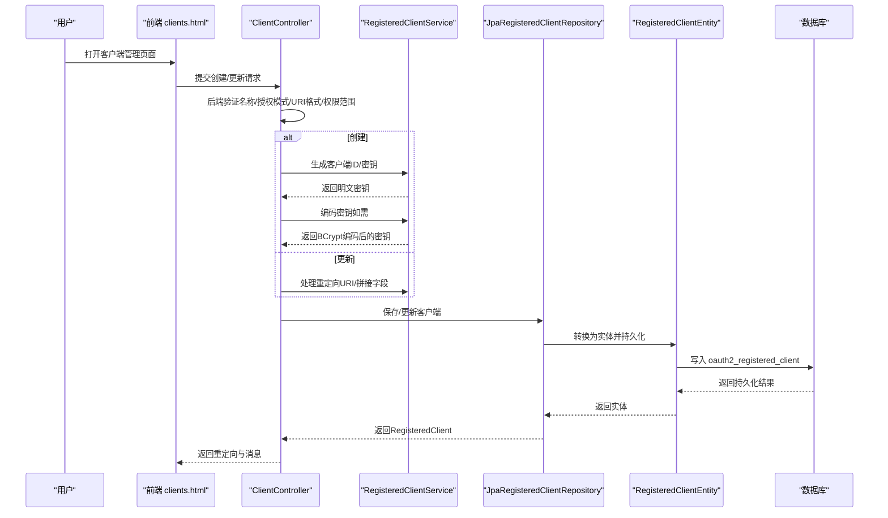
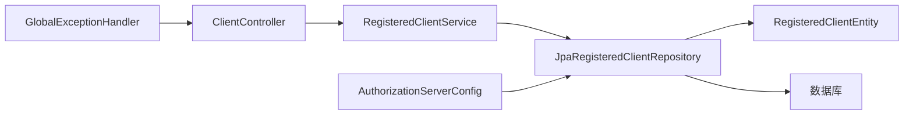

# 客户端安全验证

<cite>
**本文引用的文件**
- [RegisteredClientEntity.java](file://src/main/java/com/example/authserver/entity/RegisteredClientEntity.java)
- [RegisteredClientService.java](file://src/main/java/com/example/authserver/service/RegisteredClientService.java)
- [ClientController.java](file://src/main/java/com/example/authserver/controller/ClientController.java)
- [AuthorizationServerConfig.java](file://src/main/java/com/example/authserver/config/AuthorizationServerConfig.java)
- [JpaRegisteredClientRepository.java](file://src/main/java/com/example/authserver/repository/JpaRegisteredClientRepository.java)
- [GlobalExceptionHandler.java](file://src/main/java/com/example/authserver/exception/GlobalExceptionHandler.java)
- [application.yml](file://src/main/resources/application.yml)
- [schema.sql](file://src/main/resources/schema.sql)
- [clients.html](file://src/main/resources/templates/admin/clients.html)
</cite>

## 目录
1. [简介](#简介)
2. [项目结构](#项目结构)
3. [核心组件](#核心组件)
4. [架构总览](#架构总览)
5. [详细组件分析](#详细组件分析)
6. [依赖分析](#依赖分析)
7. [性能考虑](#性能考虑)
8. [故障排查指南](#故障排查指南)
9. [结论](#结论)
10. [附录](#附录)

## 简介
本文件聚焦于OAuth2客户端安全验证机制，系统性阐述客户端配置的安全验证规则与实现细节，包括：
- 客户端名称验证
- 授权模式验证
- 重定向URI格式验证
- 权限范围验证
- URI格式验证的正则表达式规则与验证逻辑
- 客户端密钥的安全存储与编码机制
- 客户端配置验证的错误处理与用户友好提示
- 客户端安全配置最佳实践与常见安全问题的预防措施

## 项目结构
该系统采用Spring Boot + Spring Security OAuth2 Authorization Server构建，核心模块围绕“客户端实体、服务层、控制器、JPA仓库、配置与模板”展开，形成前后端协同的客户端管理界面与后端安全验证流程。

图表来源
- [ClientController.java:1-360](file://src/main/java/com/example/authserver/controller/ClientController.java#L1-L360)
- [RegisteredClientService.java:1-131](file://src/main/java/com/example/authserver/service/RegisteredClientService.java#L1-L131)
- [JpaRegisteredClientRepository.java:1-289](file://src/main/java/com/example/authserver/repository/JpaRegisteredClientRepository.java#L1-L289)
- [RegisteredClientEntity.java:1-111](file://src/main/java/com/example/authserver/entity/RegisteredClientEntity.java#L1-L111)
- [AuthorizationServerConfig.java:1-256](file://src/main/java/com/example/authserver/config/AuthorizationServerConfig.java#L1-L256)
- [GlobalExceptionHandler.java:1-130](file://src/main/java/com/example/authserver/exception/GlobalExceptionHandler.java#L1-L130)
- [application.yml:1-30](file://src/main/resources/application.yml#L1-L30)
- [schema.sql:60-81](file://src/main/resources/schema.sql#L60-L81)

章节来源
- [ClientController.java:1-360](file://src/main/java/com/example/authserver/controller/ClientController.java#L1-L360)
- [RegisteredClientService.java:1-131](file://src/main/java/com/example/authserver/service/RegisteredClientService.java#L1-L131)
- [JpaRegisteredClientRepository.java:1-289](file://src/main/java/com/example/authserver/repository/JpaRegisteredClientRepository.java#L1-L289)
- [RegisteredClientEntity.java:1-111](file://src/main/java/com/example/authserver/entity/RegisteredClientEntity.java#L1-L111)
- [AuthorizationServerConfig.java:1-256](file://src/main/java/com/example/authserver/config/AuthorizationServerConfig.java#L1-L256)
- [GlobalExceptionHandler.java:1-130](file://src/main/java/com/example/authserver/exception/GlobalExceptionHandler.java#L1-L130)
- [application.yml:1-30](file://src/main/resources/application.yml#L1-L30)
- [schema.sql:60-81](file://src/main/resources/schema.sql#L60-L81)

## 核心组件
- 客户端实体：持久化存储OAuth2客户端配置，包含客户端ID、密钥、认证方式、授权类型、重定向URI、权限范围、Token有效期等字段。
- 客户端服务：负责生成客户端ID/密钥、拼接逗号分隔字段、处理重定向URI、调用密码编码器对密钥进行编码。
- 客户端控制器：提供客户端创建、更新、删除、详情查询接口；执行后端验证规则（名称、授权模式、URI格式、权限范围）。
- JPA仓库：实现RegisteredClientRepository接口，负责实体与RegisteredClient之间的双向转换、持久化与查询。
- 授权服务器配置：初始化默认客户端、启用OIDC、配置JWT解码器、JDBC授权服务等。
- 全局异常处理：统一封装错误响应，便于前端展示用户友好的提示。
- 数据库初始化：创建oauth2_registered_client表及索引，定义字段长度与约束。

章节来源
- [RegisteredClientEntity.java:1-111](file://src/main/java/com/example/authserver/entity/RegisteredClientEntity.java#L1-L111)
- [RegisteredClientService.java:1-131](file://src/main/java/com/example/authserver/service/RegisteredClientService.java#L1-L131)
- [ClientController.java:1-360](file://src/main/java/com/example/authserver/controller/ClientController.java#L1-L360)
- [JpaRegisteredClientRepository.java:1-289](file://src/main/java/com/example/authserver/repository/JpaRegisteredClientRepository.java#L1-L289)
- [AuthorizationServerConfig.java:1-256](file://src/main/java/com/example/authserver/config/AuthorizationServerConfig.java#L1-L256)
- [GlobalExceptionHandler.java:1-130](file://src/main/java/com/example/authserver/exception/GlobalExceptionHandler.java#L1-L130)
- [schema.sql:60-81](file://src/main/resources/schema.sql#L60-L81)

## 架构总览
下图展示了从用户操作到数据库持久化的完整流程，以及安全验证的关键节点。

图表来源
- [ClientController.java:93-186](file://src/main/java/com/example/authserver/controller/ClientController.java#L93-L186)
- [ClientController.java:255-358](file://src/main/java/com/example/authserver/controller/ClientController.java#L255-L358)
- [RegisteredClientService.java:84-130](file://src/main/java/com/example/authserver/service/RegisteredClientService.java#L84-L130)
- [JpaRegisteredClientRepository.java:29-51](file://src/main/java/com/example/authserver/repository/JpaRegisteredClientRepository.java#L29-L51)
- [schema.sql:60-81](file://src/main/resources/schema.sql#L60-L81)

## 详细组件分析

### 客户端实体与字段安全
- 字段设计遵循Spring Authorization Server标准，包含客户端ID、密钥（可为空，公开客户端）、认证方式、授权类型、重定向URI、权限范围、Token有效期等。
- 客户端密钥字段长度为500，允许BCrypt编码后的密文存储；密钥过期时间可为空表示永不过期。
- 客户端名称、授权类型、权限范围等均以逗号分隔字符串形式存储，便于后续解析与校验。

章节来源
- [RegisteredClientEntity.java:14-110](file://src/main/java/com/example/authserver/entity/RegisteredClientEntity.java#L14-L110)
- [schema.sql:60-81](file://src/main/resources/schema.sql#L60-L81)

### 客户端服务：密钥生成与编码
- 生成随机客户端ID与随机客户端密钥（默认12位字母数字组合）。
- 对密钥进行BCrypt编码后再存入数据库，避免明文存储。
- 提供处理重定向URI的方法，支持null与trim处理。

章节来源
- [RegisteredClientService.java:84-130](file://src/main/java/com/example/authserver/service/RegisteredClientService.java#L84-L130)

### 控制器：后端验证与错误处理
- 创建客户端时：
  - 若未指定客户端ID则自动生成；若已存在则返回冲突提示。
  - 认证方式为NONE时视为公开客户端，不生成密钥；否则若未提供密钥则自动生成。
  - 将授权类型、重定向URI、权限范围拼接为逗号分隔字符串。
  - 设置默认权限范围（如为空），并按小时/天转换为秒存储。
- 更新客户端时：
  - 必填校验：客户端名称、授权模式、重定向URI、权限范围。
  - URI格式校验：使用正则表达式校验URL格式。
  - 若提供新密钥，则进行BCrypt编码并更新过期时间。
- 错误处理：通过重定向属性携带错误/成功消息，前端模板展示友好提示。

章节来源
- [ClientController.java:93-186](file://src/main/java/com/example/authserver/controller/ClientController.java#L93-L186)
- [ClientController.java:255-358](file://src/main/java/com/example/authserver/controller/ClientController.java#L255-L358)

### URI格式验证：正则表达式与逻辑
- 正则表达式规则：支持http/https协议，主机名（含数字、点、横线），可选端口，可选路径与查询片段。
- 验证逻辑：
  - 前端JavaScript：在表单提交前进行即时校验，提示格式错误。
  - 后端Java：在创建/更新时再次校验，确保URI格式正确。
- 建议：生产环境可进一步限制域名白名单，结合授权码模式的回调地址白名单策略。

章节来源
- [clients.html:833-842](file://src/main/resources/templates/admin/clients.html#L833-L842)
- [ClientController.java:283-291](file://src/main/java/com/example/authserver/controller/ClientController.java#L283-L291)

### 客户端密钥的安全存储与编码机制
- 存储策略：数据库字段client_secret存储BCrypt编码后的密文；公开客户端可为NULL。
- 编码流程：服务层对明文密钥进行BCrypt编码，控制器在更新时仅在提供新密钥时进行编码。
- 最佳实践：避免在任何日志或响应中暴露原始密钥；仅在创建时向用户展示一次。

章节来源
- [RegisteredClientService.java:107-109](file://src/main/java/com/example/authserver/service/RegisteredClientService.java#L107-L109)
- [ClientController.java:330-339](file://src/main/java/com/example/authserver/controller/ClientController.java#L330-L339)
- [schema.sql:66](file://src/main/resources/schema.sql#L66)

### 客户端配置验证的错误处理与用户提示
- 前端：即时校验URI格式、必填项缺失，展示错误消息；支持切换密钥可见性。
- 后端：通过重定向属性传递错误/成功消息；全局异常处理器统一返回结构化错误响应。
- 日志：记录操作日志与异常信息，便于审计与排障。

章节来源
- [clients.html:880-938](file://src/main/resources/templates/admin/clients.html#L880-L938)
- [ClientController.java:180-185](file://src/main/java/com/example/authserver/controller/ClientController.java#L180-L185)
- [ClientController.java:349-357](file://src/main/java/com/example/authserver/controller/ClientController.java#L349-L357)
- [GlobalExceptionHandler.java:25-117](file://src/main/java/com/example/authserver/exception/GlobalExceptionHandler.java#L25-L117)

### 授权服务器配置与默认客户端
- 初始化默认客户端：Web应用（授权码+刷新令牌，需要授权同意）、移动端（公开客户端，强制PKCE）、后端服务（客户端凭证模式，无需用户授权）。
- 启用OIDC与JWT解码器，配置JDBC授权与授权同意服务，确保授权流程符合标准。

章节来源
- [AuthorizationServerConfig.java:91-161](file://src/main/java/com/example/authserver/config/AuthorizationServerConfig.java#L91-L161)
- [AuthorizationServerConfig.java:193-245](file://src/main/java/com/example/authserver/config/AuthorizationServerConfig.java#L193-L245)

### 数据库初始化与表结构
- oauth2_registered_client表：定义客户端ID唯一索引、密钥过期时间、Token有效期等字段，满足OAuth2与OIDC要求。
- schema.sql：初始化用户、角色、URL权限规则与OAuth2相关表，确保系统启动即具备基础数据。

章节来源
- [schema.sql:60-81](file://src/main/resources/schema.sql#L60-L81)
- [schema.sql:148-167](file://src/main/resources/schema.sql#L148-L167)

## 依赖分析
- 控制器依赖服务层进行业务处理，服务层依赖JPA仓库与密码编码器。
- JPA仓库负责实体与RegisteredClient的双向转换，同时与数据库交互。
- 授权服务器配置注入密码编码器，初始化默认客户端并启用OIDC。
- 全局异常处理器为控制器提供统一错误响应。

图表来源
- [ClientController.java:28](file://src/main/java/com/example/authserver/controller/ClientController.java#L28)
- [RegisteredClientService.java:25-26](file://src/main/java/com/example/authserver/service/RegisteredClientService.java#L25-L26)
- [JpaRegisteredClientRepository.java:21](file://src/main/java/com/example/authserver/repository/JpaRegisteredClientRepository.java#L21)
- [AuthorizationServerConfig.java:49](file://src/main/java/com/example/authserver/config/AuthorizationServerConfig.java#L49)
- [GlobalExceptionHandler.java:23](file://src/main/java/com/example/authserver/exception/GlobalExceptionHandler.java#L23)

章节来源
- [ClientController.java:1-360](file://src/main/java/com/example/authserver/controller/ClientController.java#L1-L360)
- [RegisteredClientService.java:1-131](file://src/main/java/com/example/authserver/service/RegisteredClientService.java#L1-L131)
- [JpaRegisteredClientRepository.java:1-289](file://src/main/java/com/example/authserver/repository/JpaRegisteredClientRepository.java#L1-L289)
- [AuthorizationServerConfig.java:1-256](file://src/main/java/com/example/authserver/config/AuthorizationServerConfig.java#L1-L256)
- [GlobalExceptionHandler.java:1-130](file://src/main/java/com/example/authserver/exception/GlobalExceptionHandler.java#L1-L130)

## 性能考虑
- URI格式验证：前端即时校验减少无效请求；后端二次校验保证安全性。
- 密钥编码：仅在创建/更新时进行，避免频繁计算。
- 数据库索引：客户端ID唯一索引提升查询效率。
- Token有效期：合理设置Access/Refresh Token有效期，平衡用户体验与安全。

## 故障排查指南
- 客户端ID冲突：创建时若ID已存在，控制器返回冲突提示；建议检查ID生成策略或手动指定唯一ID。
- 重定向URI格式错误：前后端均会校验，确保使用http/https协议与合法主机名。
- 权限范围为空：控制器要求至少选择一个权限范围，建议默认包含openid、profile等常用范围。
- 密钥未加密：确保服务层对密钥进行BCrypt编码后再入库；避免明文存储。
- 异常响应：全局异常处理器统一返回结构化错误，便于定位问题。

章节来源
- [ClientController.java:117-121](file://src/main/java/com/example/authserver/controller/ClientController.java#L117-L121)
- [ClientController.java:283-291](file://src/main/java/com/example/authserver/controller/ClientController.java#L283-L291)
- [ClientController.java:294-296](file://src/main/java/com/example/authserver/controller/ClientController.java#L294-L296)
- [GlobalExceptionHandler.java:25-117](file://src/main/java/com/example/authserver/exception/GlobalExceptionHandler.java#L25-L117)

## 结论
本系统通过前后端协同的验证机制与标准化的OAuth2配置，实现了客户端安全配置的闭环管理。建议在生产环境中进一步强化URI白名单、最小权限原则与密钥生命周期管理，持续提升系统的安全性与合规性。

## 附录

### 客户端安全配置最佳实践
- 最小权限原则：仅授予必要的权限范围，避免过度授权。
- URI白名单机制：严格限制重定向URI，结合授权码模式的回调地址白名单策略。
- 授权范围限制：默认范围应最小化，自定义范围需明确用途与访问边界。
- 密钥管理：定期轮换密钥，设置合理的密钥过期时间；避免在日志与响应中泄露密钥。
- PKCE强制：移动应用与公共客户端建议强制启用PKCE，增强安全性。
- Token有效期：根据应用场景调整Access/Refresh Token有效期，降低长期有效令牌的风险。

### 常见安全问题与防护策略
- 重定向URI劫持：严格校验与白名单控制，避免开放的通配符。
- 密钥泄露：仅在创建时向用户展示一次，避免明文存储与传输。
- 过度授权：默认最小范围，用户授权确认页面明确授权内容。
- 令牌滥用：缩短Token有效期，启用刷新令牌回收策略。