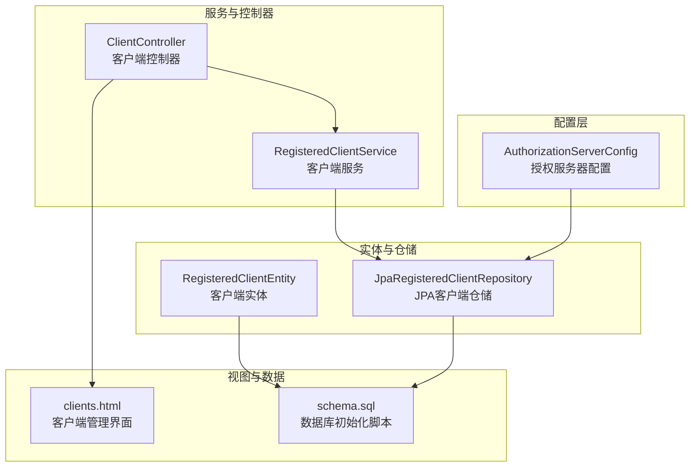
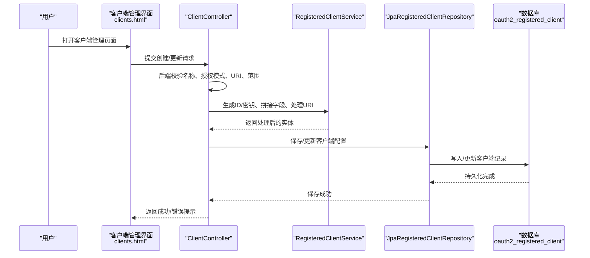
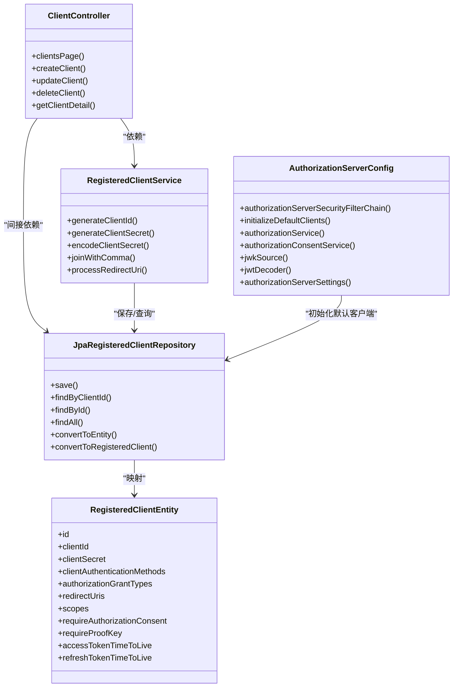

# 客户端类型与配置

<cite>
**本文引用的文件**
- [AuthorizationServerConfig.java](file://src/main/java/com/example/authserver/config/AuthorizationServerConfig.java)
- [RegisteredClientEntity.java](file://src/main/java/com/example/authserver/entity/RegisteredClientEntity.java)
- [RegisteredClientService.java](file://src/main/java/com/example/authserver/service/RegisteredClientService.java)
- [ClientController.java](file://src/main/java/com/example/authserver/controller/ClientController.java)
- [JpaRegisteredClientRepository.java](file://src/main/java/com/example/authserver/repository/JpaRegisteredClientRepository.java)
- [clients.html](file://src/main/resources/templates/admin/clients.html)
- [application.yml](file://src/main/resources/application.yml)
- [schema.sql](file://src/main/resources/schema.sql)
- [DataInitializerConfig.java](file://src/main/java/com/example/authserver/config/DataInitializerConfig.java)
</cite>

## 目录
1. [简介](#简介)
2. [项目结构](#项目结构)
3. [核心组件](#核心组件)
4. [架构总览](#架构总览)
5. [详细组件分析](#详细组件分析)
6. [依赖分析](#依赖分析)
7. [性能考量](#性能考量)
8. [故障排查指南](#故障排查指南)
9. [结论](#结论)
10. [附录](#附录)

## 简介
本文件面向OAuth2认证服务器的客户端类型与配置，系统性阐述三种客户端类型（Web应用、移动应用、后端服务）的差异、适用场景、认证方式、授权模式支持与安全配置要点；并结合本仓库中的实现，给出客户端ID生成机制、密钥管理策略、重定向URI配置规范、配置示例与最佳实践，以及常见配置错误的排查方法。

## 项目结构
本项目采用Spring Boot + Spring Authorization Server构建，核心围绕“客户端注册与管理”展开：
- 配置层：授权服务器配置、JWK生成、默认客户端初始化
- 实体层：OAuth2客户端实体及持久化映射
- 仓储层：JPA实现的RegisteredClientRepository，负责客户端配置的存取与转换
- 服务层：客户端管理服务，提供ID/密钥生成、字段拼接与处理
- 控制器层：客户端管理页面与REST接口，支持创建、更新、删除、详情查询
- 视图层：Thymeleaf模板，提供可视化客户端配置界面
- 数据层：MySQL初始化脚本，包含oauth2_registered_client等表结构

图表来源
- [AuthorizationServerConfig.java:1-256](file://src/main/java/com/example/authserver/config/AuthorizationServerConfig.java#L1-L256)
- [JpaRegisteredClientRepository.java:1-289](file://src/main/java/com/example/authserver/repository/JpaRegisteredClientRepository.java#L1-L289)
- [RegisteredClientEntity.java:1-111](file://src/main/java/com/example/authserver/entity/RegisteredClientEntity.java#L1-L111)
- [RegisteredClientService.java:1-131](file://src/main/java/com/example/authserver/service/RegisteredClientService.java#L1-L131)
- [ClientController.java:1-360](file://src/main/java/com/example/authserver/controller/ClientController.java#L1-L360)
- [clients.html:1-800](file://src/main/resources/templates/admin/clients.html#L1-L800)
- [schema.sql:1-169](file://src/main/resources/schema.sql#L1-L169)

章节来源
- [AuthorizationServerConfig.java:1-256](file://src/main/java/com/example/authserver/config/AuthorizationServerConfig.java#L1-L256)
- [ClientController.java:1-360](file://src/main/java/com/example/authserver/controller/ClientController.java#L1-L360)
- [RegisteredClientEntity.java:1-111](file://src/main/java/com/example/authserver/entity/RegisteredClientEntity.java#L1-L111)
- [JpaRegisteredClientRepository.java:1-289](file://src/main/java/com/example/authserver/repository/JpaRegisteredClientRepository.java#L1-L289)
- [clients.html:1-800](file://src/main/resources/templates/admin/clients.html#L1-L800)
- [schema.sql:1-169](file://src/main/resources/schema.sql#L1-L169)

## 核心组件
- 客户端实体：封装客户端ID、密钥、认证方式、授权类型、重定向URI、权限范围、同意与PKCE要求、令牌有效期等字段，便于统一存储与传输。
- 客户端服务：提供客户端ID/密钥生成、字段拼接、URI处理、密钥编码等工具方法。
- 客户端控制器：提供客户端管理页面与REST接口，支持创建、更新、删除、详情查询，包含严格的后端校验与错误处理。
- JPA仓储：实现RegisteredClientRepository，负责将OAuth2标准模型与数据库实体双向转换，支持保存、查询、删除与批量转换。
- 授权服务器配置：初始化默认客户端（Web应用、移动应用、后端服务），配置授权服务器安全过滤链、JWK与JWT解码器、授权与授权同意服务。
- 数据库脚本：定义oauth2_registered_client表结构，包含客户端ID唯一索引、密钥加密字段、令牌有效期等。

章节来源
- [RegisteredClientEntity.java:1-111](file://src/main/java/com/example/authserver/entity/RegisteredClientEntity.java#L1-L111)
- [RegisteredClientService.java:1-131](file://src/main/java/com/example/authserver/service/RegisteredClientService.java#L1-L131)
- [ClientController.java:1-360](file://src/main/java/com/example/authserver/controller/ClientController.java#L1-L360)
- [JpaRegisteredClientRepository.java:1-289](file://src/main/java/com/example/authserver/repository/JpaRegisteredClientRepository.java#L1-L289)
- [AuthorizationServerConfig.java:1-256](file://src/main/java/com/example/authserver/config/AuthorizationServerConfig.java#L1-L256)
- [schema.sql:60-81](file://src/main/resources/schema.sql#L60-L81)

## 架构总览
下图展示客户端配置在系统中的流转：前端界面提交配置 → 控制器接收并校验 → 服务层生成ID/密钥与处理字段 → 仓储层转换并持久化 → 授权服务器读取配置参与授权流程。

图表来源
- [ClientController.java:93-186](file://src/main/java/com/example/authserver/controller/ClientController.java#L93-L186)
- [ClientController.java:255-358](file://src/main/java/com/example/authserver/controller/ClientController.java#L255-L358)
- [RegisteredClientService.java:84-130](file://src/main/java/com/example/authserver/service/RegisteredClientService.java#L84-L130)
- [JpaRegisteredClientRepository.java:29-51](file://src/main/java/com/example/authserver/repository/JpaRegisteredClientRepository.java#L29-L51)
- [schema.sql:60-81](file://src/main/resources/schema.sql#L60-L81)

## 详细组件分析

### 客户端类型与适用场景
- Web应用（机密客户端）
  - 特征：具备客户端密钥，适合在受控服务器环境运行的应用；支持授权码+刷新令牌模式，可配置PKCE。
  - 适用场景：传统Web站点、SPA后端、微服务网关等。
  - 安全要点：密钥严格保密，建议启用PKCE；令牌有效期适中，刷新令牌禁用复用。
- 移动应用（公开客户端）
  - 特征：不携带客户端密钥，适合原生移动应用或无法安全存储密钥的客户端；强烈建议启用PKCE。
  - 适用场景：iOS/Android原生应用、小程序等。
  - 安全要点：必须启用PKCE；重定向URI使用自定义协议（如myapp://callback）；令牌有效期较短。
- 后端服务（机密客户端）
  - 特征：具备客户端密钥，用于服务间调用；通常使用客户端凭证模式，无需用户授权。
  - 适用场景：定时任务、微服务内部调用、批处理服务。
  - 安全要点：禁用用户授权同意；令牌有效期短；严格控制权限范围。

章节来源
- [AuthorizationServerConfig.java:94-154](file://src/main/java/com/example/authserver/config/AuthorizationServerConfig.java#L94-L154)

### 客户端认证方式与授权模式支持
- 认证方式
  - 机密客户端：CLIENT_SECRET_BASIC、CLIENT_SECRET_POST（在界面中可选）
  - 公开客户端：NONE（不携带密钥）
- 授权模式
  - 授权码模式：authorization_code
  - 刷新令牌：refresh_token
  - 客户端凭证：client_credentials
- PKCE与同意页
  - 公开客户端建议启用requireProofKey
  - 服务间调用可关闭requireAuthorizationConsent

章节来源
- [AuthorizationServerConfig.java:98-154](file://src/main/java/com/example/authserver/config/AuthorizationServerConfig.java#L98-L154)
- [ClientController.java:363-367](file://src/main/java/com/example/authserver/controller/ClientController.java#L363-L367)

### 客户端ID生成机制与密钥管理策略
- 客户端ID生成
  - 服务层提供UUID前缀的ID生成逻辑，便于识别与审计。
- 客户端密钥管理
  - 创建时若未提供密钥，服务层生成固定长度的随机密钥；界面默认勾选“自动生成”。
  - 存储策略：数据库字段允许为空，公开客户端可不设置密钥；机密客户端密钥以BCrypt加密存储。
  - 密钥过期：若存在密钥，默认一年后过期；公开客户端无过期时间。
- 密钥可见性
  - 界面中编辑模式下显示“••••••••••••”，提示密钥不可直接修改。

章节来源
- [RegisteredClientService.java:84-102](file://src/main/java/com/example/authserver/service/RegisteredClientService.java#L84-L102)
- [ClientController.java:123-130](file://src/main/java/com/example/authserver/controller/ClientController.java#L123-L130)
- [JpaRegisteredClientRepository.java:141-180](file://src/main/java/com/example/authserver/repository/JpaRegisteredClientRepository.java#L141-L180)
- [schema.sql:66-67](file://src/main/resources/schema.sql#L66-L67)
- [clients.html:594-603](file://src/main/resources/templates/admin/clients.html#L594-L603)

### 重定向URI配置规范
- 支持多URI，以逗号分隔存储；界面支持单值输入与校验。
- 后端校验：非空且符合URL格式；授权码模式必须提供。
- 公开客户端建议使用自定义协议（如myapp://callback）或HTTPS回调地址。

章节来源
- [ClientController.java:283-291](file://src/main/java/com/example/authserver/controller/ClientController.java#L283-L291)
- [RegisteredClientEntity.java:66-73](file://src/main/java/com/example/authserver/entity/RegisteredClientEntity.java#L66-L73)
- [JpaRegisteredClientRepository.java:170-171](file://src/main/java/com/example/authserver/repository/JpaRegisteredClientRepository.java#L170-L171)

### 权限范围与令牌有效期
- 权限范围
  - 默认包含openid、profile；可扩展自定义scope。
- 令牌有效期
  - Access Token：小时单位（界面输入，服务端转换为秒）
  - Refresh Token：天单位（界面输入，服务端转换为秒）
  - 默认客户端配置展示了不同类型的合理有效期参考

章节来源
- [ClientController.java:142-144](file://src/main/java/com/example/authserver/controller/ClientController.java#L142-L144)
- [ClientController.java:166-168](file://src/main/java/com/example/authserver/controller/ClientController.java#L166-L168)
- [AuthorizationServerConfig.java:110-114](file://src/main/java/com/example/authserver/config/AuthorizationServerConfig.java#L110-L114)

### 客户端配置示例与最佳实践
- Web应用（机密客户端）
  - 授权模式：authorization_code、refresh_token
  - 认证方式：CLIENT_SECRET_BASIC
  - PKCE：可选（按需启用）
  - 令牌有效期：Access Token 2小时，Refresh Token 7天
  - 重定向URI：http://127.0.0.1:9000/authorized
- 移动应用（公开客户端）
  - 授权模式：authorization_code、refresh_token
  - 认证方式：NONE
  - 必须启用：PKCE
  - 令牌有效期：Access Token 1小时，Refresh Token 30天
  - 重定向URI：自定义协议（如myapp://callback）
- 后端服务（机密客户端）
  - 授权模式：client_credentials
  - 认证方式：CLIENT_SECRET_BASIC
  - 必须关闭：requireAuthorizationConsent
  - 令牌有效期：Access Token 30分钟
  - 权限范围：最小化原则（如api.read、api.write）

章节来源
- [AuthorizationServerConfig.java:94-154](file://src/main/java/com/example/authserver/config/AuthorizationServerConfig.java#L94-L154)

### 安全配置要求
- 机密客户端
  - 必须设置客户端密钥并启用BCrypt加密存储
  - 建议启用PKCE（即便机密客户端）
  - 令牌有效期适中，刷新令牌禁用复用
- 公开客户端
  - 必须启用PKCE
  - 重定向URI使用HTTPS或自定义协议
  - 令牌有效期短，权限范围最小化
- 通用要求
  - 权限范围最小化
  - 严格校验重定向URI格式
  - 定期轮换密钥与检查过期时间

章节来源
- [AuthorizationServerConfig.java:127-135](file://src/main/java/com/example/authserver/config/AuthorizationServerConfig.java#L127-L135)
- [ClientController.java:283-291](file://src/main/java/com/example/authserver/controller/ClientController.java#L283-L291)

## 依赖分析
- 控制器依赖服务层与仓储层，服务层依赖密码编码器与仓储层，仓储层依赖实体与JPA。
- 授权服务器配置依赖密码编码器、JDBC模板与Spring Authorization Server组件。
- 数据库脚本定义了oauth2_registered_client表结构，仓储层负责字段映射与转换。

图表来源
- [ClientController.java:1-360](file://src/main/java/com/example/authserver/controller/ClientController.java#L1-L360)
- [RegisteredClientService.java:1-131](file://src/main/java/com/example/authserver/service/RegisteredClientService.java#L1-L131)
- [JpaRegisteredClientRepository.java:1-289](file://src/main/java/com/example/authserver/repository/JpaRegisteredClientRepository.java#L1-L289)
- [RegisteredClientEntity.java:1-111](file://src/main/java/com/example/authserver/entity/RegisteredClientEntity.java#L1-L111)
- [AuthorizationServerConfig.java:1-256](file://src/main/java/com/example/authserver/config/AuthorizationServerConfig.java#L1-L256)

章节来源
- [ClientController.java:1-360](file://src/main/java/com/example/authserver/controller/ClientController.java#L1-L360)
- [RegisteredClientService.java:1-131](file://src/main/java/com/example/authserver/service/RegisteredClientService.java#L1-L131)
- [JpaRegisteredClientRepository.java:1-289](file://src/main/java/com/example/authserver/repository/JpaRegisteredClientRepository.java#L1-L289)
- [AuthorizationServerConfig.java:1-256](file://src/main/java/com/example/authserver/config/AuthorizationServerConfig.java#L1-L256)

## 性能考量
- 数据库存取
  - 使用merge统一保存，避免重复持久化开销；实体与RegisteredClient双向转换时注意时间类型转换（Instant与LocalDateTime）。
- 授权服务器
  - JWK生成与JWT解码器按需加载；默认客户端初始化仅在首次启动时执行。
- 界面交互
  - Thymeleaf模板渲染客户端列表与配置项，建议在生产环境开启缓存与压缩。

章节来源
- [JpaRegisteredClientRepository.java:42-50](file://src/main/java/com/example/authserver/repository/JpaRegisteredClientRepository.java#L42-L50)
- [AuthorizationServerConfig.java:211-245](file://src/main/java/com/example/authserver/config/AuthorizationServerConfig.java#L211-L245)
- [application.yml:10-24](file://src/main/resources/application.yml#L10-L24)

## 故障排查指南
- 客户端创建失败
  - 检查客户端名称、授权模式、重定向URI与权限范围是否满足后端校验。
  - 若提示“客户端ID已存在”，请更换ID或删除旧记录。
- 密钥相关问题
  - 机密客户端必须提供密钥或启用自动生成；公开客户端可不设置密钥。
  - 密钥过期时间按一年计算，到期后需重新生成或更新。
- 重定向URI错误
  - 确保URI非空且符合URL格式；授权码模式必须提供。
- 权限范围无效
  - 至少选择一个权限范围；默认包含openid、profile。
- 刷新令牌行为
  - 默认禁用刷新令牌复用；如需调整，请在客户端配置中启用。

章节来源
- [ClientController.java:116-130](file://src/main/java/com/example/authserver/controller/ClientController.java#L116-L130)
- [ClientController.java:273-296](file://src/main/java/com/example/authserver/controller/ClientController.java#L273-L296)
- [RegisteredClientService.java:124-129](file://src/main/java/com/example/authserver/service/RegisteredClientService.java#L124-L129)
- [schema.sql:76-78](file://src/main/resources/schema.sql#L76-L78)

## 结论
本项目提供了完整的OAuth2客户端类型与配置实现：通过默认客户端初始化明确了三类客户端的典型配置；通过控制器与服务层实现了严格的参数校验与密钥管理；通过JPA仓储与数据库脚本保证了配置的持久化与一致性。结合本文的最佳实践与安全建议，可在实际部署中快速、安全地完成各类客户端的配置与运维。

## 附录
- 默认客户端初始化位置：AuthorizationServerConfig.initializeDefaultClients
- 客户端实体字段定义：RegisteredClientEntity
- 客户端管理界面：clients.html
- 数据库初始化脚本：schema.sql
- 应用配置：application.yml

章节来源
- [AuthorizationServerConfig.java:92-161](file://src/main/java/com/example/authserver/config/AuthorizationServerConfig.java#L92-L161)
- [RegisteredClientEntity.java:14-110](file://src/main/java/com/example/authserver/entity/RegisteredClientEntity.java#L14-L110)
- [clients.html:1-800](file://src/main/resources/templates/admin/clients.html#L1-L800)
- [schema.sql:60-81](file://src/main/resources/schema.sql#L60-L81)
- [application.yml:1-30](file://src/main/resources/application.yml#L1-L30)