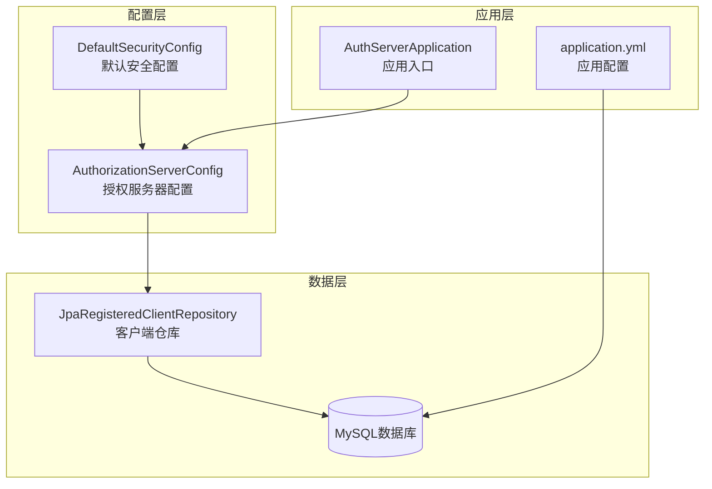
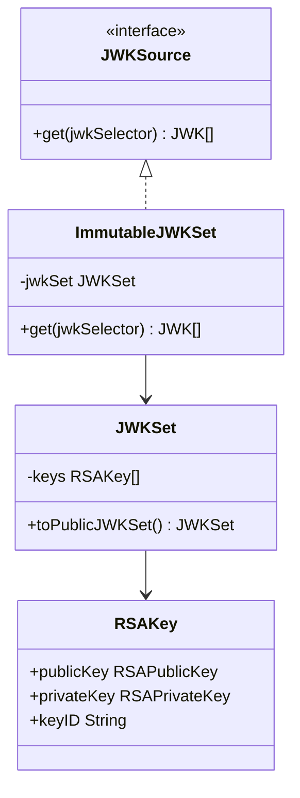
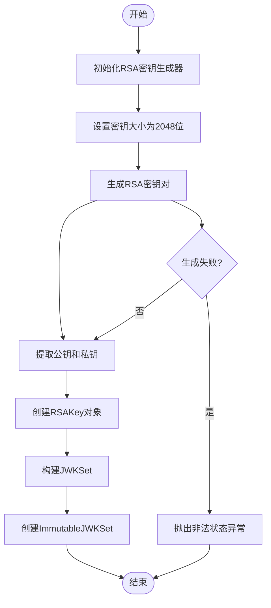
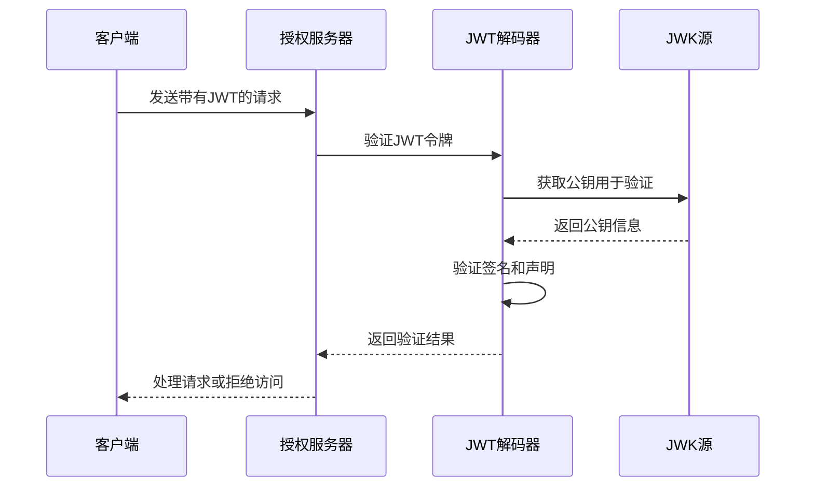
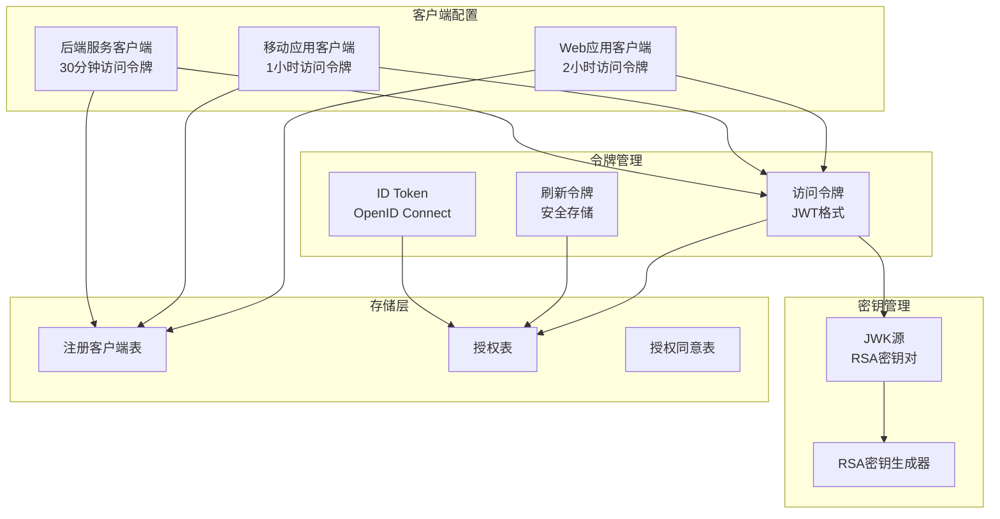
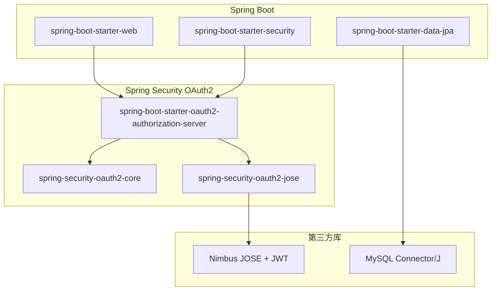

# JWT令牌配置

<cite>
**本文档引用的文件**
- [AuthorizationServerConfig.java](file://src/main/java/com/example/authserver/config/AuthorizationServerConfig.java)
- [DefaultSecurityConfig.java](file://src/main/java/com/example/authserver/config/DefaultSecurityConfig.java)
- [application.yml](file://src/main/resources/application.yml)
- [schema.sql](file://src/main/resources/schema.sql)
- [JpaRegisteredClientRepository.java](file://src/main/java/com/example/authserver/repository/JpaRegisteredClientRepository.java)
- [pom.xml](file://pom.xml)
</cite>

## 目录
1. [简介](#简介)
2. [项目结构](#项目结构)
3. [核心组件](#核心组件)
4. [架构概览](#架构概览)
5. [详细组件分析](#详细组件分析)
6. [依赖分析](#依赖分析)
7. [性能考虑](#性能考虑)
8. [故障排除指南](#故障排除指南)
9. [结论](#结论)

## 简介

本项目是一个基于Spring Security OAuth2的认证服务器，专门用于演示和实现JWT令牌配置。本文档深入解析了JWK（JSON Web Key）配置原理、RSA密钥对生成过程、JWT解码器设置以及令牌生命周期管理等关键配置。

该认证服务器实现了完整的OAuth2授权流程，包括授权码模式、刷新令牌机制、PKCE安全增强等功能，并提供了灵活的令牌配置选项。

## 项目结构

项目采用标准的Spring Boot项目结构，重点关注认证服务器的核心配置：

**图表来源**
- [AuthorizationServerConfig.java:1-256](file://src/main/java/com/example/authserver/config/AuthorizationServerConfig.java#L1-L256)
- [DefaultSecurityConfig.java:1-78](file://src/main/java/com/example/authserver/config/DefaultSecurityConfig.java#L1-L78)

**章节来源**
- [AuthorizationServerConfig.java:1-256](file://src/main/java/com/example/authserver/config/AuthorizationServerConfig.java#L1-L256)
- [DefaultSecurityConfig.java:1-78](file://src/main/java/com/example/authserver/config/DefaultSecurityConfig.java#L1-L78)
- [application.yml:1-30](file://src/main/resources/application.yml#L1-L30)

## 核心组件

### JWK（JSON Web Key）配置

JWK是用于表示加密密钥的JSON数据结构，支持多种算法和密钥类型。在本项目中，JWK主要用于JWT令牌的签名和验证。

#### JWK源配置

**图表来源**
- [AuthorizationServerConfig.java:208-222](file://src/main/java/com/example/authserver/config/AuthorizationServerConfig.java#L208-L222)

### RSA密钥对生成

系统使用2048位RSA密钥对进行JWT签名，确保足够的安全性。

#### 密钥生成流程

**图表来源**
- [AuthorizationServerConfig.java:224-237](file://src/main/java/com/example/authserver/config/AuthorizationServerConfig.java#L224-L237)

**章节来源**
- [AuthorizationServerConfig.java:208-237](file://src/main/java/com/example/authserver/config/AuthorizationServerConfig.java#L208-L237)

### JWT解码器配置

JWT解码器负责验证和解析JWT令牌，确保令牌的完整性和有效性。

#### 解码器工作流程

**图表来源**
- [AuthorizationServerConfig.java:240-245](file://src/main/java/com/example/authserver/config/AuthorizationServerConfig.java#L240-L245)

**章节来源**
- [AuthorizationServerConfig.java:240-245](file://src/main/java/com/example/authserver/config/AuthorizationServerConfig.java#L240-L245)

## 架构概览

本系统的JWT配置架构基于Spring Security OAuth2 Authorization Server，实现了完整的令牌生命周期管理：

**图表来源**
- [AuthorizationServerConfig.java:88-161](file://src/main/java/com/example/authserver/config/AuthorizationServerConfig.java#L88-L161)
- [schema.sql:60-81](file://src/main/resources/schema.sql#L60-L81)

## 详细组件分析

### 客户端令牌配置

系统为不同类型的客户端配置了不同的令牌生命周期策略：

#### Web应用客户端配置

Web应用客户端配置了较长的访问令牌有效期（2小时）和7天的刷新令牌有效期，适用于传统的Web应用场景。

#### 移动应用客户端配置

移动应用客户端使用更严格的安全策略，访问令牌有效期为1小时，刷新令牌有效期为30天，并强制启用PKCE（Proof Key for Code Exchange）以增强安全性。

#### 后端服务客户端配置

后端服务客户端配置了较短的访问令牌有效期（30分钟），适用于服务间调用场景，减少令牌泄露的风险。

**章节来源**
- [AuthorizationServerConfig.java:94-154](file://src/main/java/com/example/authserver/config/AuthorizationServerConfig.java#L94-L154)

### 令牌生命周期管理

#### 访问令牌配置

访问令牌的生命周期通过`TokenSettings`进行配置，支持以下参数：
- `accessTokenTimeToLive`: 访问令牌的有效期
- `refreshTokenTimeToLive`: 刷新令牌的有效期  
- `reuseRefreshTokens`: 是否允许重复使用刷新令牌

#### 刷新令牌机制

系统实现了完整的刷新令牌机制，包括令牌的生成、存储、验证和过期处理。

**章节来源**
- [AuthorizationServerConfig.java:110-114](file://src/main/java/com/example/authserver/config/AuthorizationServerConfig.java#L110-L114)
- [schema.sql:76-78](file://src/main/resources/schema.sql#L76-L78)

### 数据持久化配置

#### 客户端信息存储

客户端配置信息存储在`oauth2_registered_client`表中，包含所有必要的OAuth2配置参数。

#### 授权状态管理

授权状态信息存储在`oauth2_authorization`表中，跟踪令牌的签发、使用和过期状态。

**章节来源**
- [JpaRegisteredClientRepository.java:141-180](file://src/main/java/com/example/authserver/repository/JpaRegisteredClientRepository.java#L141-L180)
- [schema.sql:83-133](file://src/main/resources/schema.sql#L83-L133)

## 依赖分析

### 核心依赖关系

**图表来源**
- [pom.xml:29-114](file://pom.xml#L29-L114)

### 外部依赖影响

系统的JWT配置依赖于以下关键组件：
- **Nimbus JOSE + JWT**: 提供JWK管理和JWT操作功能
- **Spring Security OAuth2**: 实现OAuth2协议和令牌管理
- **MySQL数据库**: 存储客户端配置和授权状态

**章节来源**
- [pom.xml:29-114](file://pom.xml#L29-L114)

## 性能考虑

### 密钥生成性能

RSA密钥生成是计算密集型操作，建议在生产环境中：
- 预生成密钥对并存储在安全的位置
- 避免在高并发场景下频繁生成新密钥
- 考虑使用硬件安全模块(HSM)进行密钥管理

### 令牌验证性能

- 使用内存缓存存储JWK集合，减少数据库查询
- 合理配置令牌有效期，平衡安全性和性能
- 对频繁访问的接口实施适当的缓存策略

### 数据库性能优化

- 为OAuth2相关表建立合适的索引
- 定期清理过期的授权记录
- 使用连接池优化数据库连接管理

## 故障排除指南

### 常见问题及解决方案

#### JWT验证失败

**症状**: 客户端收到401未授权错误

**可能原因**:
- JWK源配置错误
- 令牌签名算法不匹配
- 令牌过期

**解决步骤**:
1. 检查JWK源是否正确配置
2. 验证JWT解码器设置
3. 确认令牌有效期设置

#### 密钥生成异常

**症状**: 应用启动时抛出密钥生成异常

**可能原因**:
- JVM安全策略限制
- 密钥长度不支持
- 系统资源不足

**解决步骤**:
1. 检查JVM版本和安全策略
2. 验证RSA密钥长度支持
3. 确认系统有足够的随机数资源

#### 令牌过期问题

**症状**: 访问令牌频繁过期

**可能原因**:
- 访问令牌有效期设置过短
- 系统时间不同步
- 刷新令牌机制配置错误

**解决步骤**:
1. 检查客户端的令牌配置
2. 验证系统时间同步
3. 确认刷新令牌设置

**章节来源**
- [AuthorizationServerConfig.java:224-237](file://src/main/java/com/example/authserver/config/AuthorizationServerConfig.java#L224-L237)
- [DefaultSecurityConfig.java:47-50](file://src/main/java/com/example/authserver/config/DefaultSecurityConfig.java#L47-L50)

## 结论

本JWT令牌配置方案提供了完整的OAuth2认证服务器实现，具有以下特点：

### 安全性优势
- 使用2048位RSA密钥对确保足够的加密强度
- 支持多种客户端类型和相应的安全策略
- 实现了完整的令牌生命周期管理
- 集成了PKCE安全增强机制

### 可扩展性特点
- 基于Spring Security框架，易于扩展和定制
- 支持多种存储后端（当前使用JDBC）
- 灵活的客户端配置管理
- 完整的审计和监控支持

### 最佳实践建议
1. 在生产环境中使用预生成的密钥对
2. 根据业务需求调整令牌有效期
3. 实施适当的监控和告警机制
4. 定期审查和更新安全配置

该配置方案为构建企业级认证服务器提供了坚实的基础，可以根据具体需求进行进一步的定制和优化。