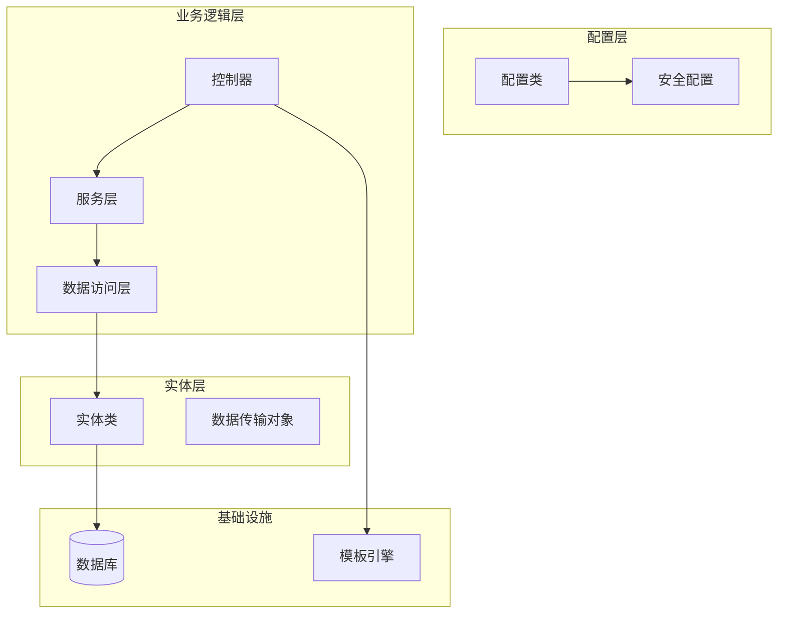
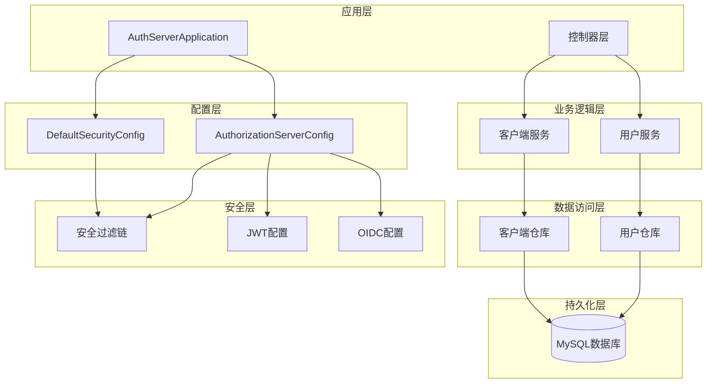
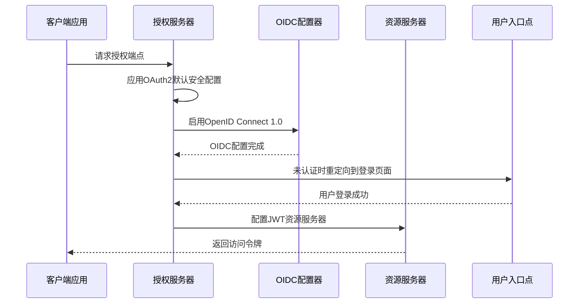
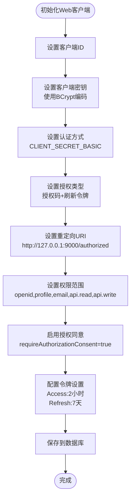
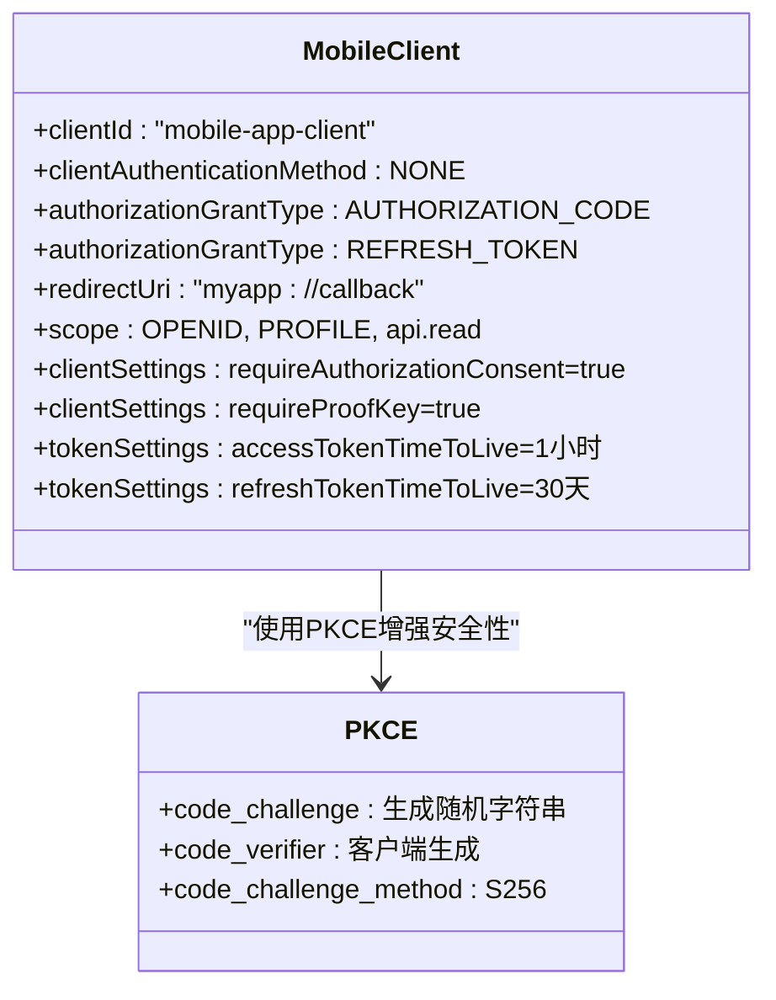
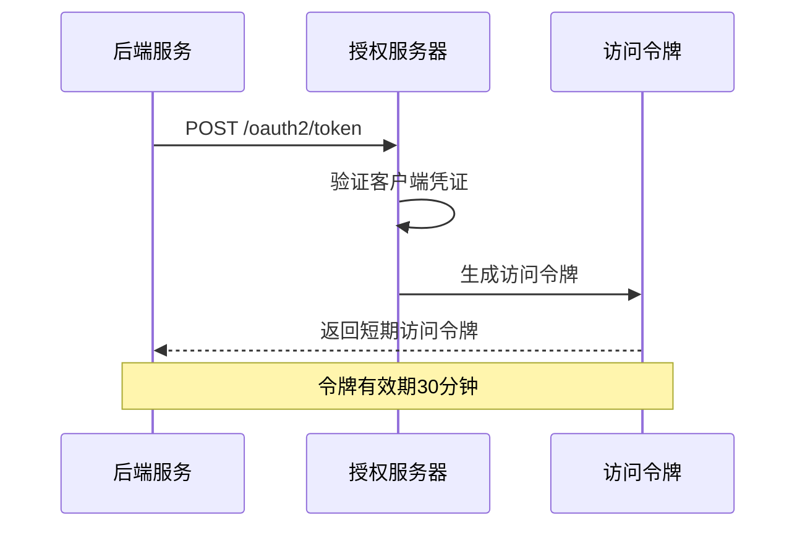
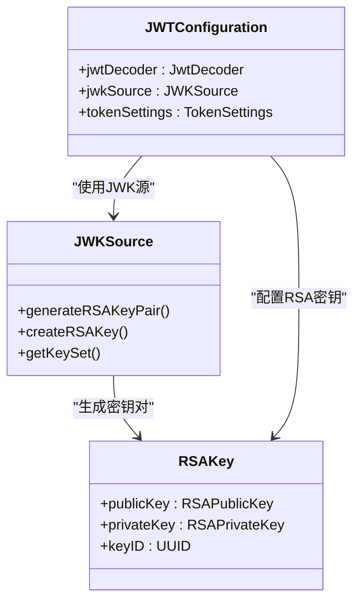
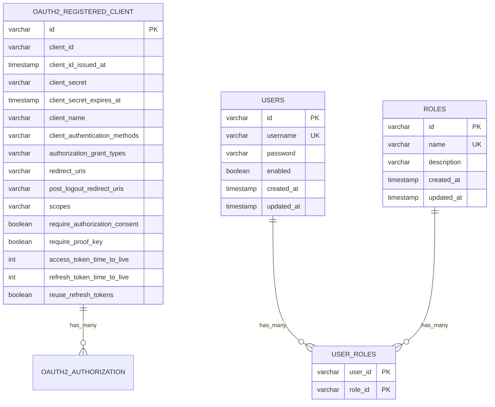
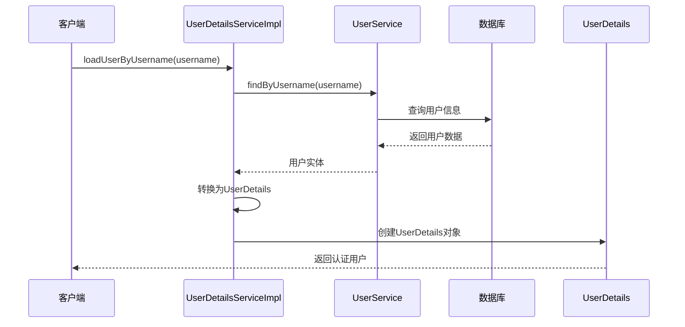
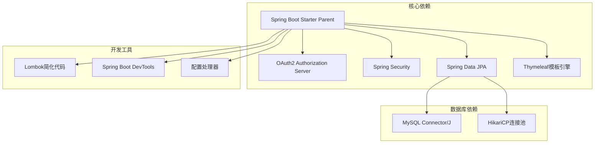

# OAuth2授权服务器配置

<cite>
**本文档引用的文件**
- [AuthorizationServerConfig.java](file://src/main/java/com/example/authserver/config/AuthorizationServerConfig.java)
- [DefaultSecurityConfig.java](file://src/main/java/com/example/authserver/config/DefaultSecurityConfig.java)
- [application.yml](file://src/main/resources/application.yml)
- [pom.xml](file://pom.xml)
- [JpaRegisteredClientRepository.java](file://src/main/java/com/example/authserver/repository/JpaRegisteredClientRepository.java)
- [RegisteredClientEntity.java](file://src/main/java/com/example/authserver/entity/RegisteredClientEntity.java)
- [UserDetailsServiceImpl.java](file://src/main/java/com/example/authserver/service/UserDetailsServiceImpl.java)
- [schema.sql](file://src/main/resources/schema.sql)
- [HomeController.java](file://src/main/java/com/example/authserver/controller/HomeController.java)
- [index.html](file://src/main/resources/templates/index.html)
- [AuthServerApplication.java](file://src/main/java/com/example/authserver/AuthServerApplication.java)
</cite>

## 目录
1. [简介](#简介)
2. [项目结构](#项目结构)
3. [核心组件](#核心组件)
4. [架构概览](#架构概览)
5. [详细组件分析](#详细组件分析)
6. [依赖关系分析](#依赖关系分析)
7. [性能考虑](#性能考虑)
8. [故障排除指南](#故障排除指南)
9. [结论](#结论)

## 简介

这是一个基于Spring Security OAuth2授权服务器的完整配置实现，提供了企业级的身份认证和授权解决方案。该系统集成了OpenID Connect 1.0标准，支持多种OAuth2授权模式，包括授权码模式、客户端凭证模式和刷新令牌模式。

系统采用现代化的Spring Boot 3.2.3框架，使用MySQL作为持久化存储，实现了完整的OAuth2授权服务器功能，包括客户端管理、令牌颁发、用户认证和授权确认等功能。

## 项目结构

该项目采用标准的Spring Boot项目结构，主要分为以下几个核心模块：



**图表来源**
- [AuthorizationServerConfig.java:1-256](file://src/main/java/com/example/authserver/config/AuthorizationServerConfig.java#L1-L256)
- [DefaultSecurityConfig.java:1-75](file://src/main/java/com/example/authserver/config/DefaultSecurityConfig.java#L1-L75)

**章节来源**
- [AuthServerApplication.java:1-14](file://src/main/java/com/example/authserver/AuthServerApplication.java#L1-L14)
- [pom.xml:1-147](file://pom.xml#L1-L147)

## 核心组件

### 授权服务器配置类

AuthorizationServerConfig类是整个OAuth2授权服务器的核心配置类，负责配置授权端点、令牌端点、客户端管理和JWT令牌生成等功能。

#### 主要功能特性

1. **授权服务器安全过滤链配置**
   - 集成OAuth2授权服务器默认安全配置
   - 启用OpenID Connect 1.0支持
   - 配置登录重定向机制
   - 设置资源服务器JWT配置

2. **客户端管理配置**
   - 支持三种不同类型的客户端配置
   - 动态客户端初始化机制
   - 客户端配置持久化到数据库

3. **JWT令牌配置**
   - RSA密钥对生成和管理
   - JWK（JSON Web Key）配置
   - JWT解码器配置

**章节来源**
- [AuthorizationServerConfig.java:44-77](file://src/main/java/com/example/authserver/config/AuthorizationServerConfig.java#L44-L77)
- [AuthorizationServerConfig.java:88-161](file://src/main/java/com/example/authserver/config/AuthorizationServerConfig.java#L88-L161)

### 安全配置类

DefaultSecurityConfig类提供基础的安全配置，包括用户认证、密码编码器和默认的安全过滤链。

#### 关键配置

1. **认证提供者配置**
   - 使用DaoAuthenticationProvider进行数据库认证
   - 集成自定义UserDetailsServiceImpl
   - 支持BCrypt密码编码

2. **密码编码器配置**
   - DelegatingPasswordEncoder支持多种编码算法
   - 自动检测和升级密码编码格式

3. **默认安全过滤链**
   - 静态资源访问权限配置
   - OAuth2端点访问权限
   - 表单登录和注销配置

**章节来源**
- [DefaultSecurityConfig.java:27-75](file://src/main/java/com/example/authserver/config/DefaultSecurityConfig.java#L27-L75)

## 架构概览

该OAuth2授权服务器采用分层架构设计，确保了良好的关注点分离和可维护性。



**图表来源**
- [AuthServerApplication.java:6-13](file://src/main/java/com/example/authserver/AuthServerApplication.java#L6-L13)
- [AuthorizationServerConfig.java:44-256](file://src/main/java/com/example/authserver/config/AuthorizationServerConfig.java#L44-L256)
- [DefaultSecurityConfig.java:27-75](file://src/main/java/com/example/authserver/config/DefaultSecurityConfig.java#L27-L75)

## 详细组件分析

### 授权服务器配置详解

#### 授权服务器安全过滤链

授权服务器安全过滤链是OAuth2授权服务器的核心组件，负责处理所有OAuth2相关的HTTP请求。



**图表来源**
- [AuthorizationServerConfig.java:56-77](file://src/main/java/com/example/authserver/config/AuthorizationServerConfig.java#L56-L77)

#### 客户端管理配置

系统支持三种不同类型的OAuth2客户端配置，每种都有特定的安全特性和用途。

##### Web应用客户端配置

Web应用客户端使用传统的授权码模式，支持刷新令牌和用户授权同意。



**图表来源**
- [AuthorizationServerConfig.java:94-115](file://src/main/java/com/example/authserver/config/AuthorizationServerConfig.java#L94-L115)

##### 移动端客户端配置

移动端客户端使用PKCE（Proof Key for Code Exchange）增强安全性，适用于无法安全存储密钥的公开客户端。



**图表来源**
- [AuthorizationServerConfig.java:117-136](file://src/main/java/com/example/authserver/config/AuthorizationServerConfig.java#L117-L136)

##### 后端服务客户端配置

后端服务客户端使用客户端凭证模式，适用于服务间的无用户交互调用。



**图表来源**
- [AuthorizationServerConfig.java:138-154](file://src/main/java/com/example/authserver/config/AuthorizationServerConfig.java#L138-L154)

#### JWT令牌生成和签名配置

JWT令牌配置是授权服务器的核心安全组件，负责令牌的生成、签名和验证。



**图表来源**
- [AuthorizationServerConfig.java:208-245](file://src/main/java/com/example/authserver/config/AuthorizationServerConfig.java#L208-L245)

**章节来源**
- [AuthorizationServerConfig.java:190-256](file://src/main/java/com/example/authserver/config/AuthorizationServerConfig.java#L190-L256)

### 数据存储和持久化

#### 客户端实体模型

客户端实体模型采用扁平化设计，便于数据库存储和查询。



**图表来源**
- [RegisteredClientEntity.java:14-111](file://src/main/java/com/example/authserver/entity/RegisteredClientEntity.java#L14-L111)
- [schema.sql:60-81](file://src/main/resources/schema.sql#L60-L81)

#### JPA客户端仓库实现

JpaRegisteredClientRepository提供了完整的客户端数据访问功能，包括保存、查询和转换操作。

**章节来源**
- [JpaRegisteredClientRepository.java:14-289](file://src/main/java/com/example/authserver/repository/JpaRegisteredClientRepository.java#L14-L289)

### 用户认证和授权

#### 用户详情服务实现

UserDetailsServiceImpl实现了Spring Security的UserDetailsService接口，提供基于数据库的用户认证功能。



**图表来源**
- [UserDetailsServiceImpl.java:29-57](file://src/main/java/com/example/authserver/service/UserDetailsServiceImpl.java#L29-L57)

**章节来源**
- [UserDetailsServiceImpl.java:15-59](file://src/main/java/com/example/authserver/service/UserDetailsServiceImpl.java#L15-L59)

## 依赖关系分析

### Maven依赖配置

项目使用Maven管理依赖，核心依赖包括Spring Security OAuth2 Authorization Server、Spring Data JPA和MySQL驱动。



**图表来源**
- [pom.xml:29-114](file://pom.xml#L29-L114)

### 配置文件分析

application.yml文件配置了数据库连接、JPA设置和日志级别等关键参数。

**章节来源**
- [application.yml:1-29](file://src/main/resources/application.yml#L1-L29)

## 性能考虑

### 数据库优化建议

1. **索引优化**
   - 为oauth2_registered_client表的client_id建立唯一索引
   - 为users表的username建立唯一索引
   - 为roles表的name建立唯一索引

2. **连接池配置**
   - 使用HikariCP作为连接池实现
   - 合理配置最大连接数和超时时间

3. **查询优化**
   - 使用JPQL查询替代原生SQL
   - 实现懒加载策略减少不必要的数据加载

### 缓存策略

1. **客户端配置缓存**
   - 在内存中缓存常用的客户端配置
   - 实现缓存失效机制确保配置更新

2. **用户权限缓存**
   - 缓存用户的角色和权限信息
   - 实现基于时间戳的缓存更新

## 故障排除指南

### 常见配置错误

#### 客户端配置问题

1. **客户端ID重复**
   - 症状：客户端初始化失败
   - 解决方案：确保每个客户端使用唯一的client_id

2. **重定向URI不匹配**
   - 症状：授权码回调失败
   - 解决方案：确保重定向URI与实际请求完全一致

3. **权限范围配置错误**
   - 症状：令牌颁发失败
   - 解决方案：检查scope配置是否正确

#### JWT配置问题

1. **密钥生成失败**
   - 症状：JWT解码器初始化异常
   - 解决方案：检查RSA密钥生成算法和位数

2. **令牌签名验证失败**
   - 症状：访问令牌验证失败
   - 解决方案：确认JWK源配置正确

#### 数据库连接问题

1. **MySQL连接失败**
   - 症状：应用启动时数据库连接异常
   - 解决方案：检查数据库URL、用户名和密码配置

2. **表结构不匹配**
   - 症状：JPA映射异常
   - 解决方案：运行schema.sql初始化脚本

**章节来源**
- [AuthorizationServerConfig.java:166-188](file://src/main/java/com/example/authserver/config/AuthorizationServerConfig.java#L166-L188)
- [schema.sql:1-169](file://src/main/resources/schema.sql#L1-169)

### 调试技巧

1. **启用DEBUG日志**
   ```yaml
   logging:
     level:
       org.springframework.security: DEBUG
   ```

2. **检查授权服务器端点**
   - 发现端点：`/.well-known/openid-configuration`
   - 授权端点：`/oauth2/authorize`
   - 令牌端点：`/oauth2/token`

3. **验证客户端配置**
   - 检查oauth2_registered_client表中的客户端记录
   - 确认客户端密钥的BCrypt编码格式

## 结论

这个Spring Security OAuth2授权服务器配置实现了一个功能完整、安全可靠的认证授权系统。通过合理的架构设计和配置，系统支持多种OAuth2授权模式，集成了OpenID Connect 1.0标准，并提供了完善的客户端管理和令牌管理功能。

### 主要优势

1. **安全性**
   - 支持多种认证方式和授权模式
   - 集成PKCE增强移动应用安全性
   - 使用JWT令牌和RSA签名保证令牌完整性

2. **可扩展性**
   - 模块化设计便于功能扩展
   - 支持动态客户端配置
   - 灵活的权限管理机制

3. **易用性**
   - 完善的配置文档和注释
   - 标准化的API接口
   - 友好的管理界面

### 最佳实践建议

1. **生产环境部署**
   - 使用HTTPS协议
   - 配置适当的会话超时时间
   - 实施监控和日志记录

2. **安全加固**
   - 定期轮换RSA密钥
   - 实施客户端IP白名单
   - 配置速率限制和防护措施

3. **性能优化**
   - 实施数据库连接池优化
   - 使用缓存减少数据库查询
   - 监控系统性能指标

这个配置为构建企业级OAuth2授权服务器提供了坚实的基础，可以根据具体需求进行进一步的定制和扩展。