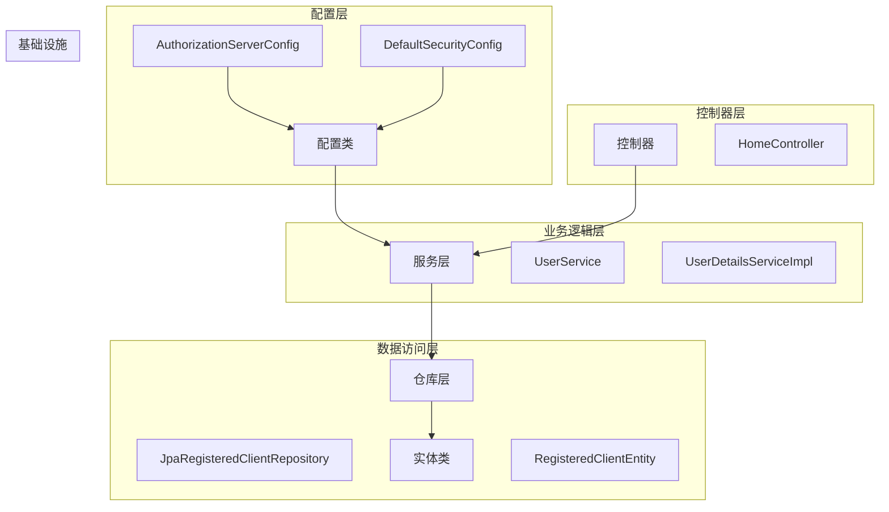
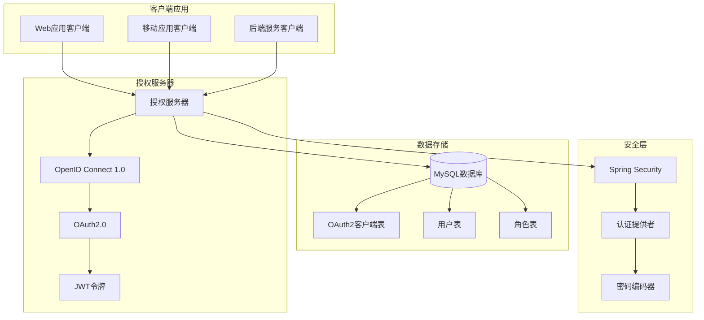
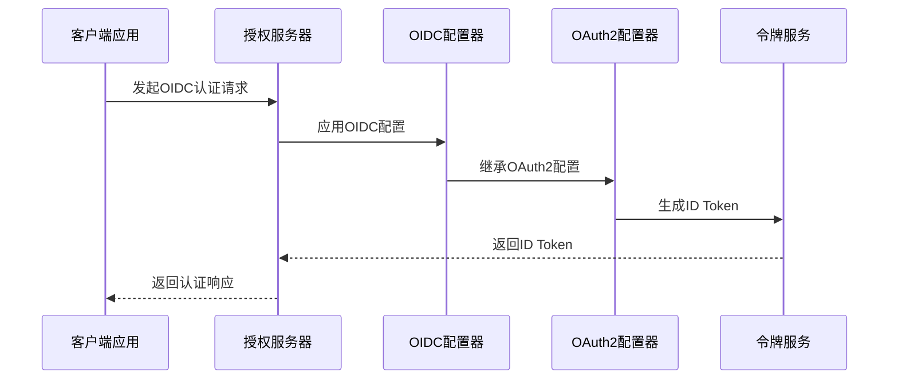
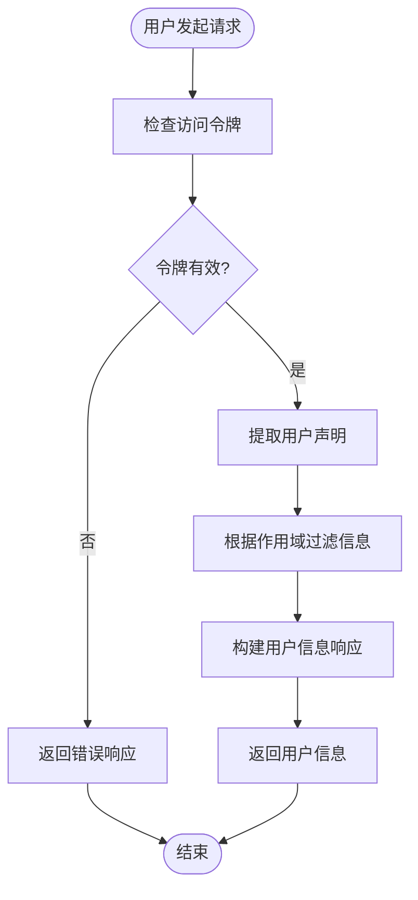
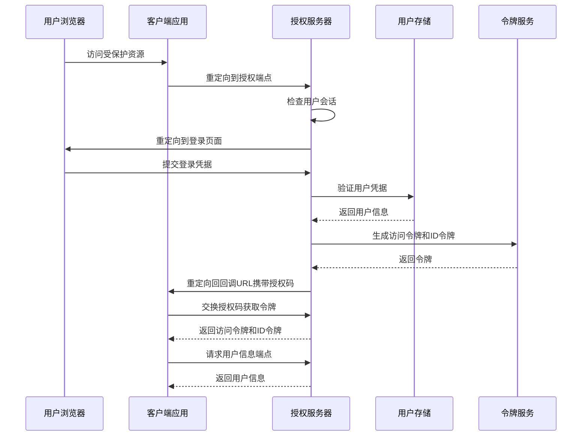
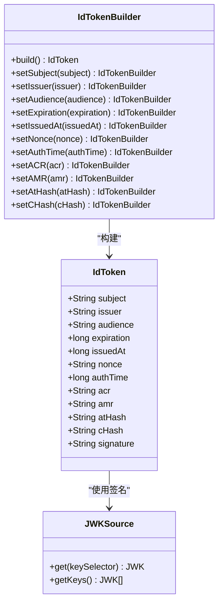
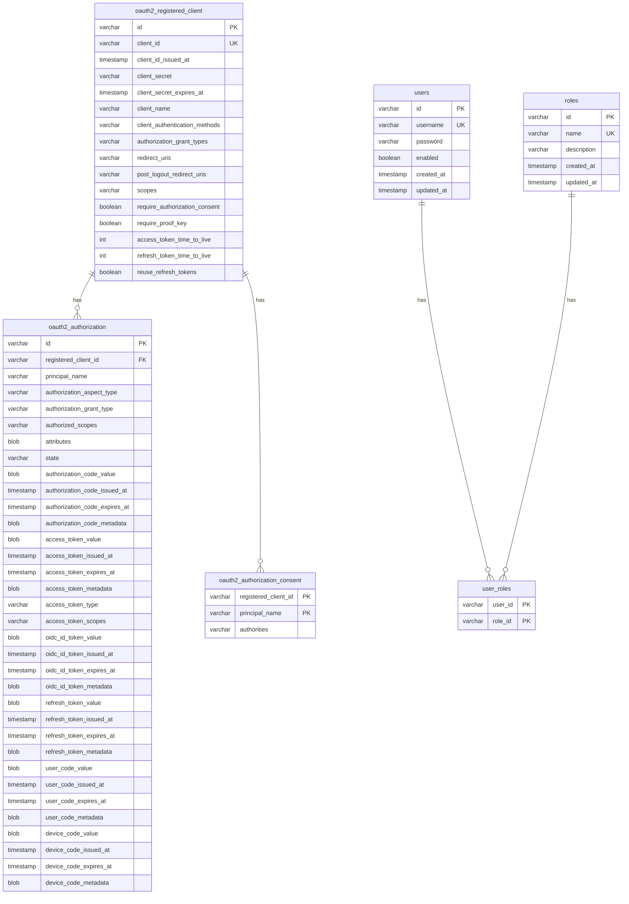
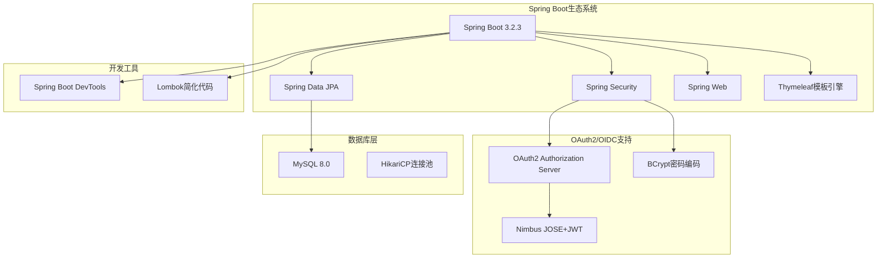

# OpenID Connect 1.0集成

<cite>
**本文档引用的文件**
- [AuthorizationServerConfig.java](file://src/main/java/com/example/authserver/config/AuthorizationServerConfig.java)
- [DefaultSecurityConfig.java](file://src/main/java/com/example/authserver/config/DefaultSecurityConfig.java)
- [application.yml](file://src/main/resources/application.yml)
- [pom.xml](file://pom.xml)
- [schema.sql](file://src/main/resources/schema.sql)
- [JpaRegisteredClientRepository.java](file://src/main/java/com/example/authserver/repository/JpaRegisteredClientRepository.java)
- [RegisteredClientEntity.java](file://src/main/java/com/example/authserver/entity/RegisteredClientEntity.java)
- [UserDetailsServiceImpl.java](file://src/main/java/com/example/authserver/service/UserDetailsServiceImpl.java)
- [HomeController.java](file://src/main/java/com/example/authserver/controller/HomeController.java)
- [AuthServerApplication.java](file://src/main/java/com/example/authserver/AuthServerApplication.java)
</cite>

## 目录
1. [简介](#简介)
2. [项目结构](#项目结构)
3. [核心组件](#核心组件)
4. [架构概览](#架构概览)
5. [详细组件分析](#详细组件分析)
6. [依赖关系分析](#依赖关系分析)
7. [性能考虑](#性能考虑)
8. [故障排除指南](#故障排除指南)
9. [结论](#结论)

## 简介

本项目是一个基于Spring Security OAuth2 Authorization Server的OpenID Connect 1.0授权服务器实现。该项目展示了如何在Spring Boot应用中集成OpenID Connect协议，提供完整的身份验证和授权服务，包括用户信息端点、ID Token生成机制以及与OAuth2的深度集成。

OpenID Connect 1.0作为OAuth2.0的上层协议，不仅提供了令牌管理功能，还增加了身份层，允许客户端验证用户身份并获取基本的用户信息。本项目通过@EnableWebSecurity注解启用Spring Security，并配置了专门的授权服务器安全过滤链来处理OIDC相关的认证流程。

## 项目结构

项目采用标准的Spring Boot目录结构，主要包含以下模块：

**图表来源**
- [AuthorizationServerConfig.java:1-256](file://src/main/java/com/example/authserver/config/AuthorizationServerConfig.java#L1-L256)
- [DefaultSecurityConfig.java:1-75](file://src/main/java/com/example/authserver/config/DefaultSecurityConfig.java#L1-L75)

**章节来源**
- [AuthServerApplication.java:1-14](file://src/main/java/com/example/authserver/AuthServerApplication.java#L1-L14)
- [pom.xml:1-147](file://pom.xml#L1-L147)

## 核心组件

### 授权服务器配置

授权服务器的核心配置位于AuthorizationServerConfig类中，该类负责：

1. **OIDC配置启用**：通过`http.getConfigurer(OAuth2AuthorizationServerConfigurer.class).oidc(Customizer.withDefaults())`启用OpenID Connect 1.0支持
2. **安全过滤链配置**：设置最高优先级的安全过滤链处理OAuth2/OIDC请求
3. **客户端管理**：配置多种类型的OAuth2客户端（Web应用、移动应用、后端服务）
4. **令牌管理**：配置JWT解码器和JWK源用于令牌签名验证

### 安全配置

DefaultSecurityConfig类提供基础的安全配置，包括：
- 认证提供者配置，使用数据库用户信息进行身份验证
- 密码编码器设置，采用DelegatingPasswordEncoder
- 默认安全过滤链，处理登录、注销等常规请求

### 数据存储

项目使用JPA实现OAuth2客户端的持久化存储，通过JpaRegisteredClientRepository类与数据库交互，支持：
- 客户端配置的CRUD操作
- 自动化的实体转换和映射
- 支持UUID主键的客户端标识

**章节来源**
- [AuthorizationServerConfig.java:56-77](file://src/main/java/com/example/authserver/config/AuthorizationServerConfig.java#L56-L77)
- [DefaultSecurityConfig.java:55-73](file://src/main/java/com/example/authserver/config/DefaultSecurityConfig.java#L55-L73)

## 架构概览

本系统的整体架构采用分层设计，确保了关注点分离和模块化：

**图表来源**
- [AuthorizationServerConfig.java:91-161](file://src/main/java/com/example/authserver/config/AuthorizationServerConfig.java#L91-L161)
- [JpaRegisteredClientRepository.java:21-51](file://src/main/java/com/example/authserver/repository/JpaRegisteredClientRepository.java#L21-L51)

## 详细组件分析

### OIDC配置实现原理

#### http.getConfigurer(OAuth2AuthorizationServerConfigurer.class).oidc(Customizer.withDefaults())的作用

这一行配置代码是启用OpenID Connect 1.0支持的关键：

**图表来源**
- [AuthorizationServerConfig.java:60-64](file://src/main/java/com/example/authserver/config/AuthorizationServerConfig.java#L60-L64)

该配置的作用包括：
1. **启用OIDC端点**：自动配置发现端点、用户信息端点等OIDC特定端点
2. **继承OAuth2功能**：复用OAuth2的令牌管理机制
3. **提供身份信息**：通过ID Token传递用户身份信息
4. **标准化流程**：遵循OpenID Connect 1.0规范的认证流程

#### 用户信息端点配置

用户信息端点是OIDC协议的重要组成部分，负责向客户端提供经过认证的用户信息。在本项目中，用户信息端点通过以下方式配置：

**图表来源**
- [AuthorizationServerConfig.java:72-74](file://src/main/java/com/example/authserver/config/AuthorizationServerConfig.java#L72-L74)

#### 身份验证流程

完整的OIDC身份验证流程如下：

**图表来源**
- [AuthorizationServerConfig.java:66-71](file://src/main/java/com/example/authserver/config/AuthorizationServerConfig.java#L66-L71)

#### ID Token生成机制

ID Token是OpenID Connect协议的核心产物，包含用户的身份信息和认证上下文：

**图表来源**
- [AuthorizationServerConfig.java:211-245](file://src/main/java/com/example/authserver/config/AuthorizationServerConfig.java#L211-L245)

### 客户端配置管理

项目支持三种不同类型的OAuth2/OIDC客户端：

#### Web应用客户端

Web应用客户端配置了标准的授权码流程，支持PKCE增强安全性：

| 属性 | 值 | 说明 |
|------|-----|------|
| 客户端ID | web-app-client | 标识Web应用 |
| 授权类型 | 授权码、刷新令牌 | 支持标准OAuth2流程 |
| 作用域 | openid, profile, email, api.read, api.write | 包含OIDC和自定义作用域 |
| 重定向URI | http://127.0.0.1:9000/authorized | Web应用回调地址 |
| 认证方法 | client_secret_basic | 使用客户端密钥认证 |

#### 移动应用客户端

移动应用客户端采用更安全的配置，强制使用PKCE：

| 属性 | 值 | 说明 |
|------|-----|------|
| 客户端ID | mobile-app-client | 标识移动应用 |
| 授权类型 | 授权码、刷新令牌 | 支持标准OAuth2流程 |
| 作用域 | openid, profile, api.read | 包含OIDC和读取权限 |
| 重定向URI | myapp://callback | 移动应用自定义协议 |
| 认证方法 | none | 公开客户端，无需密钥 |
| PKCE要求 | true | 强制使用PKCE增强安全性 |

#### 后端服务客户端

后端服务客户端使用客户端凭证模式，适用于服务间通信：

| 属性 | 值 | 说明 |
|------|-----|------|
| 客户端ID | backend-service | 标识后端服务 |
| 授权类型 | 客户端凭证 | 服务间认证模式 |
| 作用域 | api.read, api.write | API访问权限 |
| 认证方法 | client_secret_basic | 使用客户端密钥 |
| 授权同意 | false | 无需用户授权 |

**章节来源**
- [AuthorizationServerConfig.java:91-161](file://src/main/java/com/example/authserver/config/AuthorizationServerConfig.java#L91-L161)
- [JpaRegisteredClientRepository.java:141-288](file://src/main/java/com/example/authserver/repository/JpaRegisteredClientRepository.java#L141-L288)

### 数据存储架构

项目使用关系型数据库存储OAuth2/OIDC相关的数据：

**图表来源**
- [schema.sql:60-141](file://src/main/resources/schema.sql#L60-L141)

**章节来源**
- [schema.sql:1-169](file://src/main/resources/schema.sql#L1-L169)
- [RegisteredClientEntity.java:1-111](file://src/main/java/com/example/authserver/entity/RegisteredClientEntity.java#L1-L111)

## 依赖关系分析

项目的技术栈和依赖关系如下：

**图表来源**
- [pom.xml:29-114](file://pom.xml#L29-L114)

**章节来源**
- [pom.xml:1-147](file://pom.xml#L1-L147)

## 性能考虑

### 令牌管理优化

1. **令牌生命周期管理**：不同类型的客户端具有不同的令牌有效期配置
   - Web应用：访问令牌2小时，刷新令牌7天
   - 移动应用：访问令牌1小时，刷新令牌30天
   - 后端服务：访问令牌30分钟

2. **JWK源缓存**：RSA密钥对生成后缓存使用，避免重复计算

3. **数据库连接优化**：使用HikariCP连接池提高数据库访问性能

### 安全最佳实践

1. **PKCE强制使用**：移动应用客户端强制要求PKCE，增强安全性
2. **密码加密存储**：使用BCrypt算法加密存储用户密码
3. **令牌签名验证**：通过JWK源验证JWT令牌签名完整性
4. **授权同意机制**：根据客户端类型决定是否需要用户授权同意

## 故障排除指南

### 常见问题及解决方案

#### OIDC配置问题

**问题**：OIDC端点无法访问
**原因**：授权服务器安全过滤链配置错误
**解决方案**：检查`authorizationServerSecurityFilterChain`方法中的OIDC配置

#### 客户端认证失败

**问题**：客户端无法通过认证
**原因**：客户端密钥配置错误或数据库同步问题
**解决方案**：验证`JpaRegisteredClientRepository`中的客户端配置

#### 用户信息获取失败

**问题**：用户信息端点返回空数据
**原因**：用户详情服务配置错误
**解决方案**：检查`UserDetailsServiceImpl`的用户加载逻辑

**章节来源**
- [AuthorizationServerConfig.java:56-77](file://src/main/java/com/example/authserver/config/AuthorizationServerConfig.java#L56-L77)
- [UserDetailsServiceImpl.java:29-57](file://src/main/java/com/example/authserver/service/UserDetailsServiceImpl.java#L29-L57)

## 结论

本项目成功实现了基于Spring Security OAuth2 Authorization Server的OpenID Connect 1.0授权服务器，具备以下特点：

1. **完整的OIDC支持**：通过`http.getConfigurer(OAuth2AuthorizationServerConfigurer.class).oidc(Customizer.withDefaults())`启用完整的OpenID Connect 1.0功能
2. **灵活的客户端管理**：支持Web应用、移动应用、后端服务三种不同类型的客户端
3. **安全的令牌机制**：采用JWT令牌，支持PKCE增强安全性
4. **标准化的数据存储**：遵循OAuth2/OIDC标准的数据库表结构
5. **模块化的架构设计**：清晰的分层架构便于维护和扩展

该实现为构建企业级的身份认证和授权服务提供了坚实的基础，可以作为生产环境部署的参考实现。通过合理的配置和安全措施，能够满足大多数应用场景下的身份认证需求。