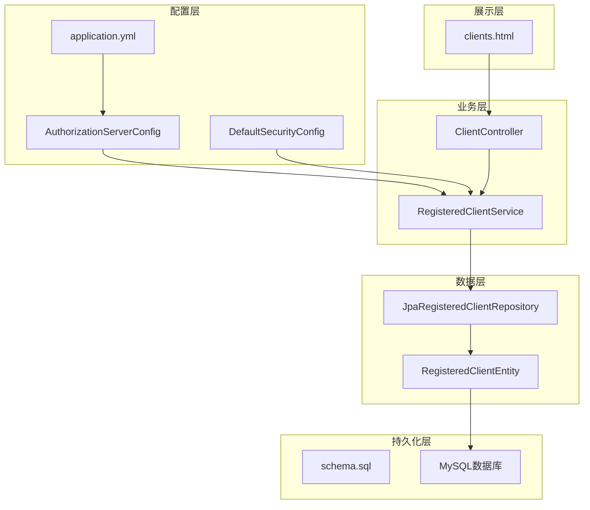
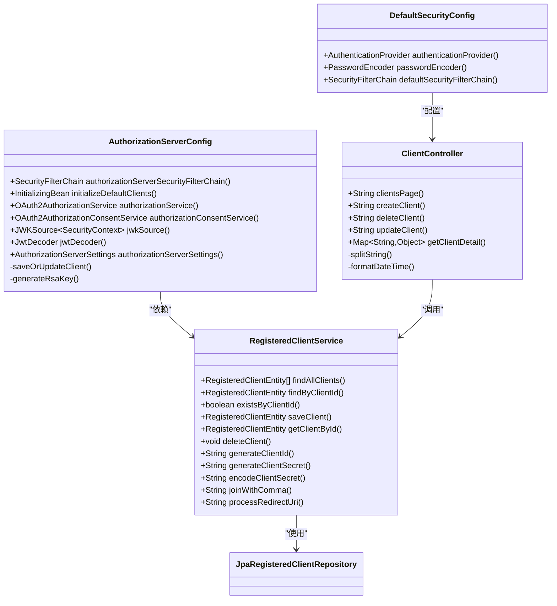
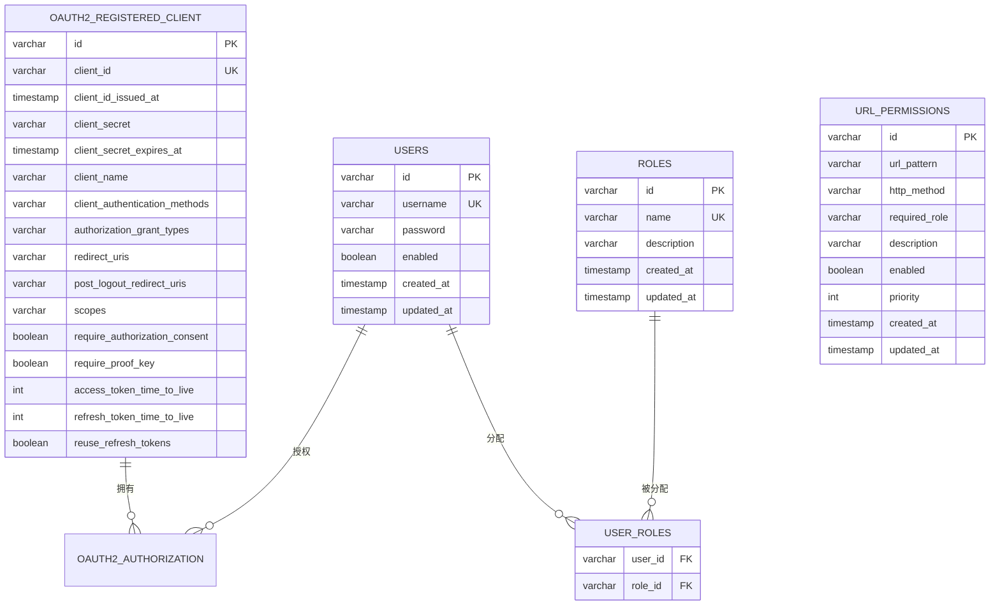
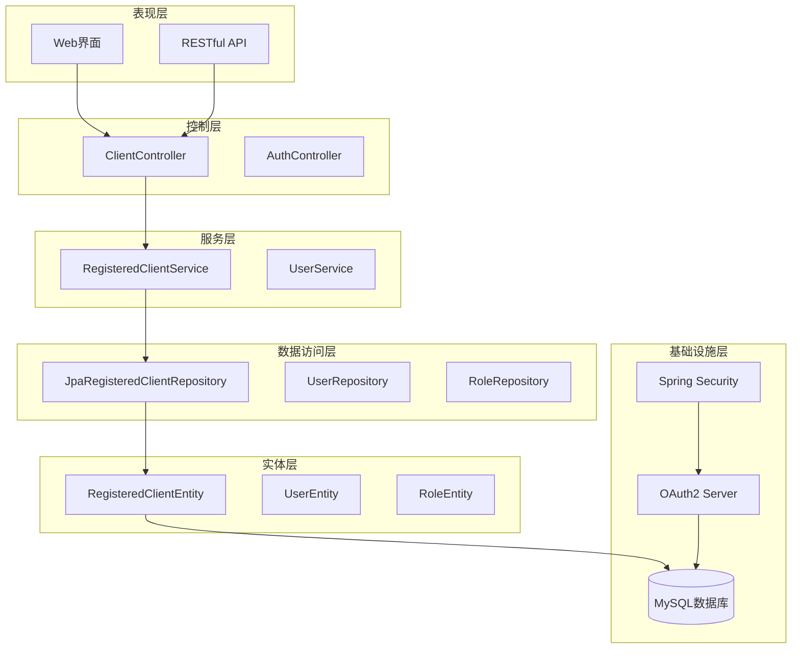
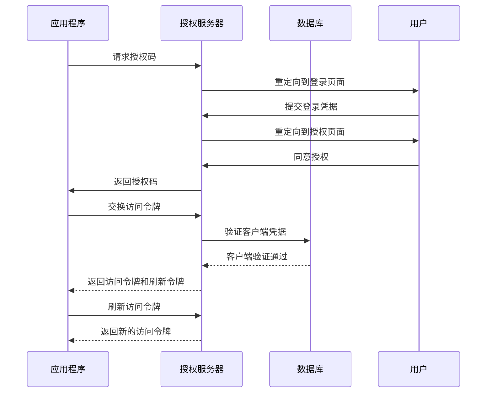
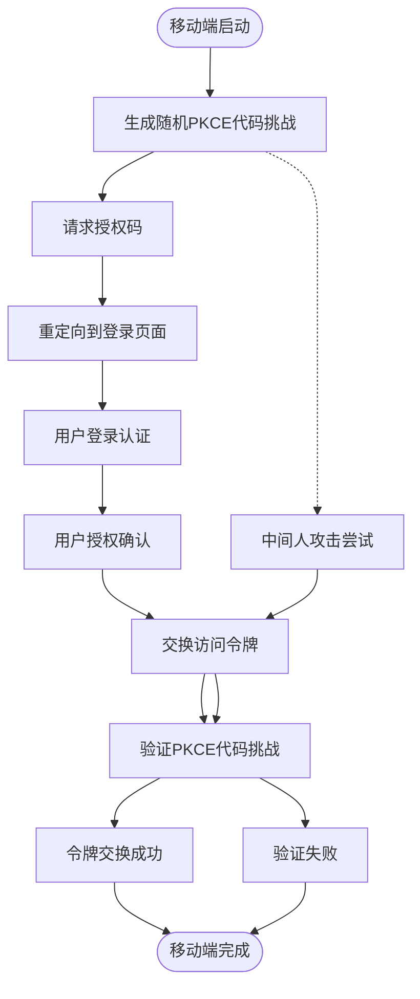
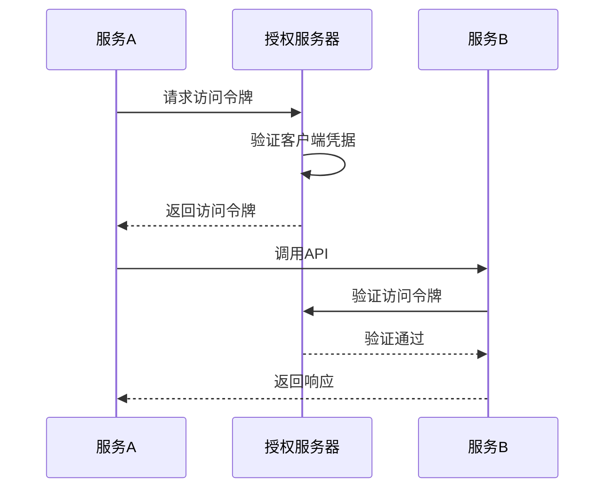
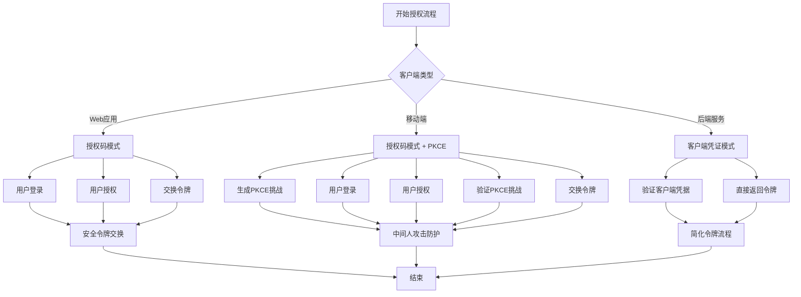
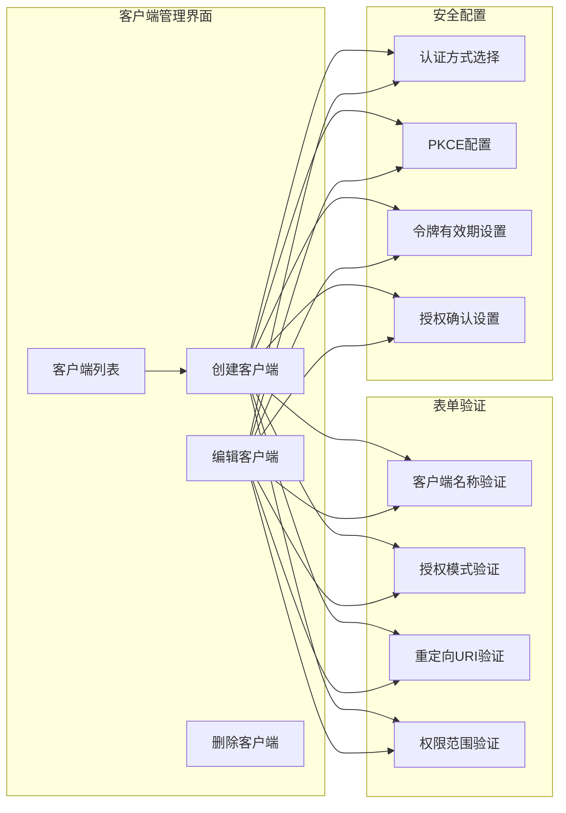
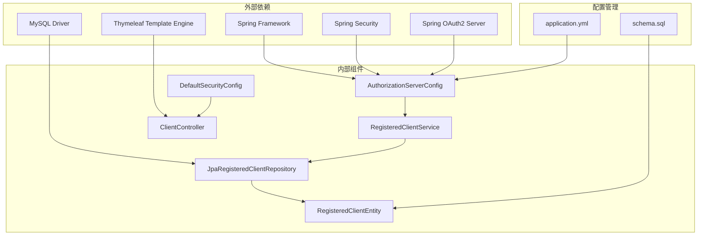

# 客户端配置管理

<cite>
**本文档引用的文件**
- [AuthorizationServerConfig.java](file://src/main/java/com/example/authserver/config/AuthorizationServerConfig.java)
- [DefaultSecurityConfig.java](file://src/main/java/com/example/authserver/config/DefaultSecurityConfig.java)
- [RegisteredClientService.java](file://src/main/java/com/example/authserver/service/RegisteredClientService.java)
- [ClientController.java](file://src/main/java/com/example/authserver/controller/ClientController.java)
- [RegisteredClientEntity.java](file://src/main/java/com/example/authserver/entity/RegisteredClientEntity.java)
- [JpaRegisteredClientRepository.java](file://src/main/java/com/example/authserver/repository/JpaRegisteredClientRepository.java)
- [application.yml](file://src/main/resources/application.yml)
- [schema.sql](file://src/main/resources/schema.sql)
- [clients.html](file://src/main/resources/templates/admin/clients.html)
</cite>

## 目录
1. [简介](#简介)
2. [项目结构](#项目结构)
3. [核心组件](#核心组件)
4. [架构概览](#架构概览)
5. [详细组件分析](#详细组件分析)
6. [依赖关系分析](#依赖关系分析)
7. [性能考虑](#性能考虑)
8. [故障排除指南](#故障排除指南)
9. [结论](#结论)
10. [附录](#附录)

## 简介

本文档深入解析了OAuth2授权服务器中的客户端配置管理系统，重点阐述`initializeDefaultClients()`方法中三种核心客户端类型的配置策略。该系统提供了完整的客户端生命周期管理，包括Web应用客户端、移动端客户端和后端服务客户端的差异化配置，涵盖了授权模式选择、安全配置、令牌设置等关键要素。

系统采用Spring Security OAuth2 Authorization Server框架，结合Spring Boot的自动配置机制，实现了企业级的OAuth2客户端管理功能。通过数据库持久化存储、Web界面管理以及RESTful API接口，为不同应用场景提供了灵活的客户端配置方案。

## 项目结构

项目采用标准的Spring Boot多模块结构，主要包含以下核心目录：

**图表来源**
- [AuthorizationServerConfig.java:44-256](file://src/main/java/com/example/authserver/config/AuthorizationServerConfig.java#L44-L256)
- [DefaultSecurityConfig.java:27-75](file://src/main/java/com/example/authserver/config/DefaultSecurityConfig.java#L27-L75)

**章节来源**
- [AuthorizationServerConfig.java:1-256](file://src/main/java/com/example/authserver/config/AuthorizationServerConfig.java#L1-L256)
- [DefaultSecurityConfig.java:1-75](file://src/main/java/com/example/authserver/config/DefaultSecurityConfig.java#L1-L75)
- [application.yml:1-30](file://src/main/resources/application.yml#L1-L30)

## 核心组件

### 授权服务器配置组件

授权服务器配置组件是整个OAuth2系统的中枢，负责初始化默认客户端配置、配置安全过滤链以及JWT令牌处理。

**图表来源**
- [AuthorizationServerConfig.java:44-256](file://src/main/java/com/example/authserver/config/AuthorizationServerConfig.java#L44-L256)
- [DefaultSecurityConfig.java:27-75](file://src/main/java/com/example/authserver/config/DefaultSecurityConfig.java#L27-L75)
- [RegisteredClientService.java:20-131](file://src/main/java/com/example/authserver/service/RegisteredClientService.java#L20-L131)
- [ClientController.java:22-360](file://src/main/java/com/example/authserver/controller/ClientController.java#L22-L360)

### 数据模型组件

系统采用扁平化的OAuth2客户端实体设计，确保与Spring Authorization Server的兼容性：

**图表来源**
- [RegisteredClientEntity.java:14-111](file://src/main/java/com/example/authserver/entity/RegisteredClientEntity.java#L14-L111)
- [schema.sql:60-81](file://src/main/resources/schema.sql#L60-L81)

**章节来源**
- [RegisteredClientEntity.java:1-111](file://src/main/java/com/example/authserver/entity/RegisteredClientEntity.java#L1-L111)
- [JpaRegisteredClientRepository.java:1-289](file://src/main/java/com/example/authserver/repository/JpaRegisteredClientRepository.java#L1-L289)
- [schema.sql:1-169](file://src/main/resources/schema.sql#L1-L169)

## 架构概览

系统采用分层架构设计，实现了关注点分离和职责明确的组件划分：

**图表来源**
- [ClientController.java:22-360](file://src/main/java/com/example/authserver/controller/ClientController.java#L22-L360)
- [RegisteredClientService.java:20-131](file://src/main/java/com/example/authserver/service/RegisteredClientService.java#L20-L131)
- [JpaRegisteredClientRepository.java:21-289](file://src/main/java/com/example/authserver/repository/JpaRegisteredClientRepository.java#L21-L289)

## 详细组件分析

### initializeDefaultClients()方法详解

该方法是系统的核心配置入口，负责初始化三种不同类型的OAuth2客户端。每种客户端都针对特定的应用场景进行了优化配置。

#### Web应用客户端配置

Web应用客户端专为传统浏览器Web应用设计，采用授权码模式配合刷新令牌机制：

**图表来源**
- [AuthorizationServerConfig.java:94-115](file://src/main/java/com/example/authserver/config/AuthorizationServerConfig.java#L94-L115)

Web应用客户端的关键配置特点：
- **授权模式**：授权码模式 + 刷新令牌
- **认证方式**：客户端密钥基础认证
- **重定向URI**：本地开发环境回调地址
- **作用域**：OpenID Connect标准作用域 + 自定义API作用域
- **令牌配置**：访问令牌2小时有效期，刷新令牌7天有效期

#### 移动端客户端配置

移动端客户端针对移动应用的安全需求，强制启用PKCE（Proof Key for Code Exchange）增强安全性：

**图表来源**
- [AuthorizationServerConfig.java:117-136](file://src/main/java/com/example/authserver/config/AuthorizationServerConfig.java#L117-L136)

移动端客户端的特殊安全配置：
- **认证方式**：公开客户端（无需客户端密钥）
- **PKCE强制**：启用代码挑战机制
- **重定向URI**：自定义URI Scheme
- **令牌配置**：访问令牌1小时有效期，刷新令牌30天有效期

#### 后端服务客户端配置

后端服务客户端用于服务间通信，采用客户端凭证模式简化令牌流程：

**图表来源**
- [AuthorizationServerConfig.java:138-154](file://src/main/java/com/example/authserver/config/AuthorizationServerConfig.java#L138-L154)

后端服务客户端的配置特点：
- **授权模式**：客户端凭证模式
- **认证方式**：客户端密钥基础认证
- **授权确认**：无需用户授权
- **令牌配置**：访问令牌30分钟有效期

**章节来源**
- [AuthorizationServerConfig.java:88-161](file://src/main/java/com/example/authserver/config/AuthorizationServerConfig.java#L88-L161)

### 客户端凭证模式详解

客户端凭证模式适用于服务间通信场景，具有以下特点：

| 特性 | 描述 |
|------|------|
| **适用场景** | 微服务架构中的服务间调用 |
| **授权流程** | 直接使用客户端凭据换取访问令牌 |
| **安全性** | 无需用户交互，但需要严格的客户端管理 |
| **令牌有效期** | 短有效期，降低泄露风险 |

### 授权码模式与PKCE增强

授权码模式是OAuth2最安全的授权方式，结合PKCE进一步提升安全性：

**图表来源**
- [AuthorizationServerConfig.java:94-154](file://src/main/java/com/example/authserver/config/AuthorizationServerConfig.java#L94-L154)

**章节来源**
- [AuthorizationServerConfig.java:94-154](file://src/main/java/com/example/authserver/config/AuthorizationServerConfig.java#L94-L154)

### 客户端管理界面

系统提供了完整的Web管理界面，支持客户端的全生命周期管理：

**图表来源**
- [clients.html:336-800](file://src/main/resources/templates/admin/clients.html#L336-L800)

**章节来源**
- [clients.html:1-2120](file://src/main/resources/templates/admin/clients.html#L1-L2120)

## 依赖关系分析

系统采用松耦合的设计原则，各组件之间的依赖关系清晰明确：

**图表来源**
- [AuthorizationServerConfig.java:1-256](file://src/main/java/com/example/authserver/config/AuthorizationServerConfig.java#L1-L256)
- [application.yml:1-30](file://src/main/resources/application.yml#L1-L30)

**章节来源**
- [AuthorizationServerConfig.java:1-256](file://src/main/java/com/example/authserver/config/AuthorizationServerConfig.java#L1-L256)
- [application.yml:1-30](file://src/main/resources/application.yml#L1-L30)

## 性能考虑

系统在设计时充分考虑了性能优化和扩展性要求：

### 数据库性能优化

- **索引设计**：为`client_id`建立唯一索引，确保客户端查询性能
- **连接池配置**：合理配置数据库连接池参数
- **查询优化**：使用JPQL查询语言，避免N+1查询问题

### 缓存策略

- **令牌缓存**：JWT令牌解码器使用内存缓存机制
- **客户端缓存**：客户端配置按需加载，减少数据库访问
- **会话管理**：合理设置会话超时时间

### 并发处理

- **线程安全**：所有服务层方法都是线程安全的
- **事务管理**：使用声明式事务确保数据一致性
- **异步处理**：支持异步任务处理非关键操作

## 故障排除指南

### 常见配置问题

**问题1：客户端无法通过认证**
- 检查客户端密钥是否正确配置
- 验证客户端认证方式是否匹配
- 确认客户端ID是否存在于数据库中

**问题2：授权码交换失败**
- 验证重定向URI是否完全匹配
- 检查PKCE代码挑战是否正确生成
- 确认授权码是否在有效期内

**问题3：令牌验证失败**
- 检查JWK密钥对是否正确生成
- 验证JWT解码器配置
- 确认令牌签名算法是否匹配

### 调试技巧

1. **启用详细日志**：在`application.yml`中调整日志级别
2. **数据库监控**：使用MySQL Workbench监控查询性能
3. **网络调试**：使用curl命令测试OAuth2端点
4. **浏览器开发者工具**：检查JavaScript错误和网络请求

**章节来源**
- [AuthorizationServerConfig.java:211-245](file://src/main/java/com/example/authserver/config/AuthorizationServerConfig.java#L211-L245)
- [application.yml:26-30](file://src/main/resources/application.yml#L26-L30)

## 结论

本客户端配置管理系统提供了完整的企业级OAuth2客户端管理解决方案。通过三种差异化客户端配置，系统能够满足Web应用、移动端应用和后端服务的不同需求。

系统的主要优势包括：
- **安全性**：采用最新的OAuth2安全实践，包括PKCE增强保护
- **灵活性**：支持多种授权模式和配置选项
- **易用性**：提供直观的Web管理界面和RESTful API
- **可扩展性**：模块化设计便于功能扩展和维护

通过合理的配置策略和安全最佳实践，该系统能够为企业提供可靠的身份认证和授权服务。

## 附录

### 安全最佳实践

1. **客户端密钥管理**
   - 使用强随机密钥生成器
   - 定期轮换客户端密钥
   - 严格控制密钥访问权限

2. **令牌安全管理**
   - 设置合理的令牌有效期
   - 启用刷新令牌轮换机制
   - 实施令牌撤销策略

3. **授权流程保护**
   - 强制启用PKCE机制
   - 验证重定向URI的合法性
   - 实施CSRF防护措施

4. **监控和审计**
   - 记录所有授权事件
   - 监控异常访问模式
   - 定期安全评估

### 配置示例

根据不同场景提供参考配置：

**Web应用配置示例**：
- 授权模式：授权码 + 刷新令牌
- 认证方式：客户端密钥基础认证
- 令牌有效期：访问令牌2小时，刷新令牌7天

**移动端配置示例**：
- 授权模式：授权码 + PKCE
- 认证方式：公开客户端
- 令牌有效期：访问令牌1小时，刷新令牌30天

**后端服务配置示例**：
- 授权模式：客户端凭证
- 认证方式：客户端密钥基础认证
- 令牌有效期：访问令牌30分钟