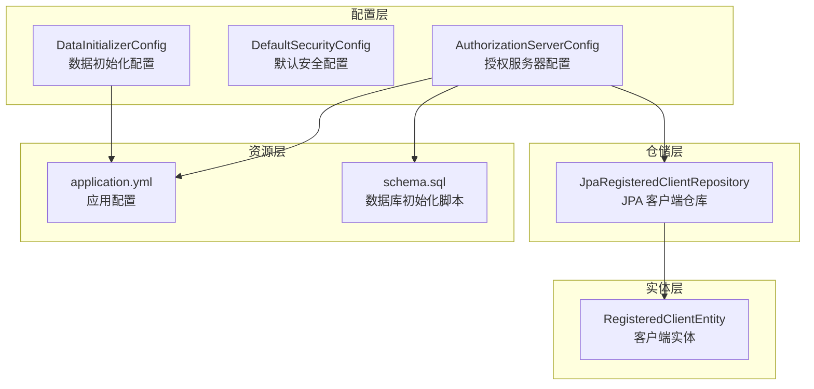
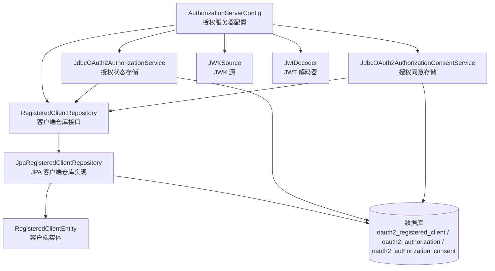
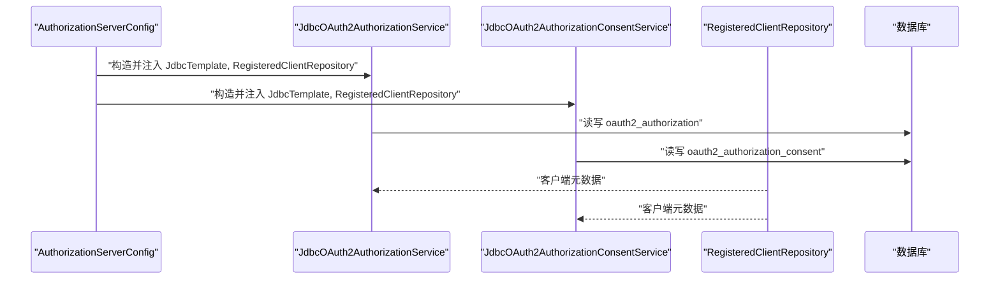
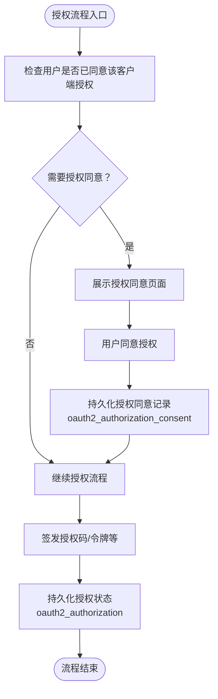
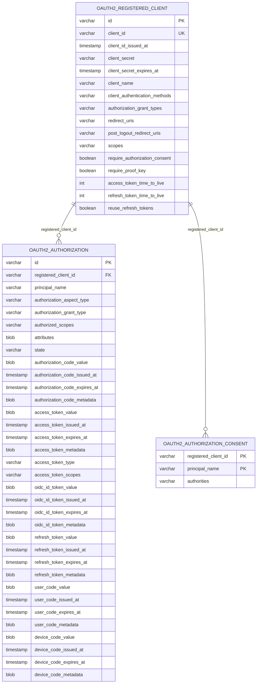
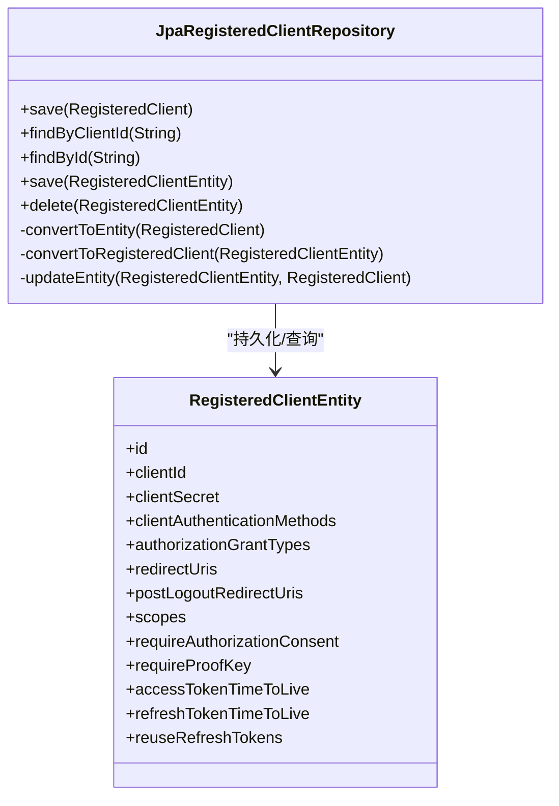
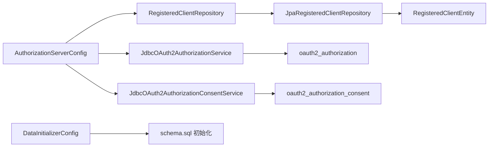

# 授权存储配置

<cite>
**本文引用的文件**
- [AuthorizationServerConfig.java](file://src/main/java/com/example/authserver/config/AuthorizationServerConfig.java)
- [JpaRegisteredClientRepository.java](file://src/main/java/com/example/authserver/repository/JpaRegisteredClientRepository.java)
- [RegisteredClientEntity.java](file://src/main/java/com/example/authserver/entity/RegisteredClientEntity.java)
- [application.yml](file://src/main/resources/application.yml)
- [schema.sql](file://src/main/resources/schema.sql)
- [DefaultSecurityConfig.java](file://src/main/java/com/example/authserver/config/DefaultSecurityConfig.java)
- [DataInitializerConfig.java](file://src/main/java/com/example/authserver/config/DataInitializerConfig.java)
- [HomeController.java](file://src/main/java/com/example/authserver/controller/HomeController.java)
</cite>

## 目录
1. [简介](#简介)
2. [项目结构](#项目结构)
3. [核心组件](#核心组件)
4. [架构总览](#架构总览)
5. [详细组件分析](#详细组件分析)
6. [依赖分析](#依赖分析)
7. [性能考虑](#性能考虑)
8. [故障排查指南](#故障排查指南)
9. [结论](#结论)
10. [附录](#附录)

## 简介
本文件聚焦于授权存储配置，深入解析基于 JDBC 的 OAuth2 授权服务配置，包括 authorizationService() 与 authorizationConsentService() 的实现原理，以及 OAuth2AuthorizationService 和 OAuth2AuthorizationConsentService 的作用与配置机制。同时，结合数据库设计（oauth2_authorization、oauth2_authorization_consent、oauth2_registered_client）说明授权状态存储与用户授权同意存储的数据模型与查询机制，并给出性能优化与扩展性建议。

## 项目结构
该项目采用典型的 Spring Boot 分层结构：
- config：安全与授权服务器配置（含授权服务、JWK、过滤链等）
- repository：JPA 实现的客户端仓库（持久化 RegisteredClient）
- entity：JPA 实体映射（RegisteredClientEntity 等）
- resources：应用配置与数据库初始化脚本
- controller：基础控制器（首页等）

图表来源
- [AuthorizationServerConfig.java:1-256](file://src/main/java/com/example/authserver/config/AuthorizationServerConfig.java#L1-L256)
- [JpaRegisteredClientRepository.java:1-289](file://src/main/java/com/example/authserver/repository/JpaRegisteredClientRepository.java#L1-L289)
- [RegisteredClientEntity.java:1-111](file://src/main/java/com/example/authserver/entity/RegisteredClientEntity.java#L1-L111)
- [application.yml:1-30](file://src/main/resources/application.yml#L1-L30)
- [schema.sql:1-194](file://src/main/resources/schema.sql#L1-L194)
- [DefaultSecurityConfig.java:1-78](file://src/main/java/com/example/authserver/config/DefaultSecurityConfig.java#L1-L78)
- [DataInitializerConfig.java:1-109](file://src/main/java/com/example/authserver/config/DataInitializerConfig.java#L1-L109)

章节来源
- [AuthorizationServerConfig.java:1-256](file://src/main/java/com/example/authserver/config/AuthorizationServerConfig.java#L1-L256)
- [application.yml:1-30](file://src/main/resources/application.yml#L1-L30)
- [schema.sql:1-194](file://src/main/resources/schema.sql#L1-L194)

## 核心组件
- 授权服务器配置类：负责装配授权服务器安全过滤链、JWK 源、JWT 解码器、授权服务器设置，以及 JDBC 授权服务与授权同意服务的 Bean 定义。
- JPA 客户端仓库：实现 RegisteredClientRepository 接口，负责将 OAuth2 客户端配置持久化到 oauth2_registered_client 表。
- 数据库初始化脚本：定义 oauth2_registered_client、oauth2_authorization、oauth2_authorization_consent 等表结构及初始化数据。
- 默认安全配置：提供常规 Web 安全过滤链与认证提供者，配合授权服务器过滤链共同工作。

章节来源
- [AuthorizationServerConfig.java:190-206](file://src/main/java/com/example/authserver/config/AuthorizationServerConfig.java#L190-L206)
- [JpaRegisteredClientRepository.java:14-122](file://src/main/java/com/example/authserver/repository/JpaRegisteredClientRepository.java#L14-L122)
- [schema.sql:60-141](file://src/main/resources/schema.sql#L60-L141)
- [DefaultSecurityConfig.java:35-76](file://src/main/java/com/example/authserver/config/DefaultSecurityConfig.java#L35-L76)

## 架构总览
下图展示了授权存储配置在系统中的位置与交互关系：

图表来源
- [AuthorizationServerConfig.java:190-206](file://src/main/java/com/example/authserver/config/AuthorizationServerConfig.java#L190-L206)
- [JpaRegisteredClientRepository.java:14-122](file://src/main/java/com/example/authserver/repository/JpaRegisteredClientRepository.java#L14-L122)
- [schema.sql:60-141](file://src/main/resources/schema.sql#L60-L141)

## 详细组件分析

### 授权服务 authorizationService() 与授权同意服务 authorizationConsentService() 的实现
- authorizationService()：通过构造 JdbcOAuth2AuthorizationService 并注入 JdbcTemplate 与 RegisteredClientRepository，实现授权状态（授权码、访问令牌、刷新令牌、OIDC ID Token、用户码、设备码等）的 JDBC 存储与检索。
- authorizationConsentService()：通过构造 JdbcOAuth2AuthorizationConsentService 并注入相同依赖，实现用户授权同意记录的 JDBC 存储与检索，键为“客户端ID+主体名称”。

图表来源
- [AuthorizationServerConfig.java:190-206](file://src/main/java/com/example/authserver/config/AuthorizationServerConfig.java#L190-L206)
- [schema.sql:84-141](file://src/main/resources/schema.sql#L84-L141)

章节来源
- [AuthorizationServerConfig.java:190-206](file://src/main/java/com/example/authserver/config/AuthorizationServerConfig.java#L190-L206)

### OAuth2AuthorizationService 与 OAuth2AuthorizationConsentService 的作用与配置原理
- OAuth2AuthorizationService：负责授权生命周期内各类令牌与状态的持久化与恢复，包括授权码、访问令牌、刷新令牌、OIDC ID Token、用户码、设备码等。其 JDBC 实现通过 JdbcTemplate 对 oauth2_authorization 表进行 CRUD。
- OAuth2AuthorizationConsentService：负责用户对特定客户端的授权同意记录持久化与查询，键为“registered_client_id + principal_name”，对应 oauth2_authorization_consent 表。

图表来源
- [AuthorizationServerConfig.java:190-206](file://src/main/java/com/example/authserver/config/AuthorizationServerConfig.java#L190-L206)
- [schema.sql:84-141](file://src/main/resources/schema.sql#L84-L141)

章节来源
- [AuthorizationServerConfig.java:190-206](file://src/main/java/com/example/authserver/config/AuthorizationServerConfig.java#L190-L206)
- [schema.sql:84-141](file://src/main/resources/schema.sql#L84-L141)

### 授权状态存储与用户授权同意存储的数据库设计与查询机制
- oauth2_registered_client：存储客户端元数据（认证方式、授权类型、重定向 URI、作用域、PKCE、令牌有效期等）。JpaRegisteredClientRepository 提供基于 JPQL 的查询与转换逻辑。
- oauth2_authorization：存储授权状态与各类令牌（授权码、访问令牌、刷新令牌、OIDC ID Token、用户码、设备码）及其元数据、过期时间、属性等。
- oauth2_authorization_consent：存储用户对客户端的授权同意记录（以“客户端ID+主体名称”为联合主键）。

图表来源
- [schema.sql:60-141](file://src/main/resources/schema.sql#L60-L141)

章节来源
- [schema.sql:60-141](file://src/main/resources/schema.sql#L60-L141)
- [JpaRegisteredClientRepository.java:56-73](file://src/main/java/com/example/authserver/repository/JpaRegisteredClientRepository.java#L56-L73)

### 授权服务配置与客户端元数据存储
- AuthorizationServerConfig 中通过 JpaRegisteredClientRepository 实现客户端元数据的持久化与查询，支持按 clientId 与 id 查询，并在保存时统一使用 merge（无论新增或更新）。
- application.yml 指定 MySQL 数据源与初始化脚本，schema.sql 定义了三张核心表的结构与索引。

图表来源
- [JpaRegisteredClientRepository.java:14-289](file://src/main/java/com/example/authserver/repository/JpaRegisteredClientRepository.java#L14-L289)
- [RegisteredClientEntity.java:11-111](file://src/main/java/com/example/authserver/entity/RegisteredClientEntity.java#L11-L111)

章节来源
- [AuthorizationServerConfig.java:82-188](file://src/main/java/com/example/authserver/config/AuthorizationServerConfig.java#L82-L188)
- [JpaRegisteredClientRepository.java:14-122](file://src/main/java/com/example/authserver/repository/JpaRegisteredClientRepository.java#L14-L122)
- [application.yml:4-24](file://src/main/resources/application.yml#L4-L24)
- [schema.sql:60-81](file://src/main/resources/schema.sql#L60-L81)

## 依赖分析
- 授权服务与授权同意服务均依赖 JdbcTemplate 与 RegisteredClientRepository，前者用于访问 oauth2_authorization，后者用于访问 oauth2_authorization_consent。
- JpaRegisteredClientRepository 依赖 EntityManager 与 RegisteredClientEntity，实现客户端元数据的双向转换与持久化。
- 数据初始化通过 schema.sql 与 DataInitializerConfig 配合，确保角色、URL 权限规则与默认用户数据的可用性。

图表来源
- [AuthorizationServerConfig.java:190-206](file://src/main/java/com/example/authserver/config/AuthorizationServerConfig.java#L190-L206)
- [JpaRegisteredClientRepository.java:14-122](file://src/main/java/com/example/authserver/repository/JpaRegisteredClientRepository.java#L14-L122)
- [schema.sql:60-141](file://src/main/resources/schema.sql#L60-L141)
- [DataInitializerConfig.java:30-95](file://src/main/java/com/example/authserver/config/DataInitializerConfig.java#L30-L95)

章节来源
- [AuthorizationServerConfig.java:190-206](file://src/main/java/com/example/authserver/config/AuthorizationServerConfig.java#L190-L206)
- [JpaRegisteredClientRepository.java:14-122](file://src/main/java/com/example/authserver/repository/JpaRegisteredClientRepository.java#L14-L122)
- [schema.sql:60-141](file://src/main/resources/schema.sql#L60-L141)
- [DataInitializerConfig.java:30-95](file://src/main/java/com/example/authserver/config/DataInitializerConfig.java#L30-L95)

## 性能考虑
- 数据库层面
  - 为 oauth2_registered_client 的 client_id 添加唯一索引，确保 findByClientId 查询高效。
  - 为 oauth2_authorization 的 registered_client_id、principal_name、authorization_grant_type 等常用过滤字段建立索引，减少授权状态查询成本。
  - 为 oauth2_authorization_consent 的 registered_client_id、principal_name 建立联合主键，保证查询与去重效率。
- 应用层面
  - 使用 JdbcOAuth2AuthorizationService 与 JdbcOAuth2AuthorizationConsentService 时，尽量复用同一 JdbcTemplate 与 DataSource，降低连接开销。
  - 对频繁访问的客户端元数据（RegisteredClientRepository）可考虑引入缓存（如 Redis 或本地缓存），减少数据库压力。
  - 合理设置令牌有效期（access_token_time_to_live、refresh_token_time_to_live），平衡安全性与性能。
- 连接与事务
  - 保持短事务，避免长时间持有数据库连接；JdbcOAuth2AuthorizationService 内部会根据操作类型选择合适的 SQL，注意避免不必要的大事务。
  - 对高并发场景，建议使用连接池（HikariCP）并合理配置最大连接数与超时时间。

[本节为通用性能建议，无需具体文件引用]

## 故障排查指南
- 授权同意未生效
  - 检查 oauth2_authorization_consent 表中是否存在“客户端ID+主体名称”的记录。
  - 确认客户端配置 require_authorization_consent 是否为 true。
- 授权状态异常
  - 检查 oauth2_authorization 表中对应记录是否存在、过期时间是否正确、attributes 是否完整。
  - 关注授权码、访问令牌、刷新令牌的 issued_at 与 expires_at 字段是否一致。
- 客户端元数据缺失
  - 确认 oauth2_registered_client 表中是否存在对应 client_id 的记录。
  - 检查 JpaRegisteredClientRepository 的 findByClientId 与 save 流程是否正常。
- 数据库初始化失败
  - 检查 application.yml 中的 datasource 配置与 schema.sql 路径。
  - 确保 schema.sql 中的表结构与字段与 Spring Authorization Server 版本兼容。

章节来源
- [schema.sql:60-141](file://src/main/resources/schema.sql#L60-L141)
- [JpaRegisteredClientRepository.java:56-73](file://src/main/java/com/example/authserver/repository/JpaRegisteredClientRepository.java#L56-L73)
- [application.yml:4-24](file://src/main/resources/application.yml#L4-L24)

## 结论
本项目通过 AuthorizationServerConfig 将 JDBC 授权服务与授权同意服务无缝集成，配合 JpaRegisteredClientRepository 与数据库初始化脚本，实现了完整的 OAuth2 授权生命周期管理。数据库层面采用标准表结构与索引策略，应用层面通过 Bean 注入与 JdbcTemplate 实现高效持久化。建议在生产环境中进一步引入缓存、连接池与监控，以提升性能与稳定性。

[本节为总结性内容，无需具体文件引用]

## 附录
- 授权服务器设置与 JWK 配置：用于签发与验证 JWT，确保令牌安全。
- 默认安全配置：提供常规 Web 安全过滤链与认证提供者，与授权服务器过滤链协同工作。
- 数据初始化：通过 DataInitializerConfig 与 schema.sql 初始化角色、URL 权限规则与默认用户数据。

章节来源
- [AuthorizationServerConfig.java:242-253](file://src/main/java/com/example/authserver/config/AuthorizationServerConfig.java#L242-L253)
- [DefaultSecurityConfig.java:35-76](file://src/main/java/com/example/authserver/config/DefaultSecurityConfig.java#L35-L76)
- [DataInitializerConfig.java:30-95](file://src/main/java/com/example/authserver/config/DataInitializerConfig.java#L30-L95)