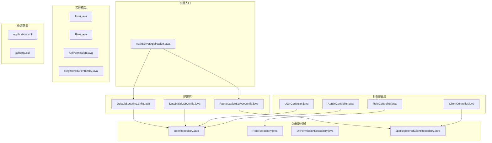
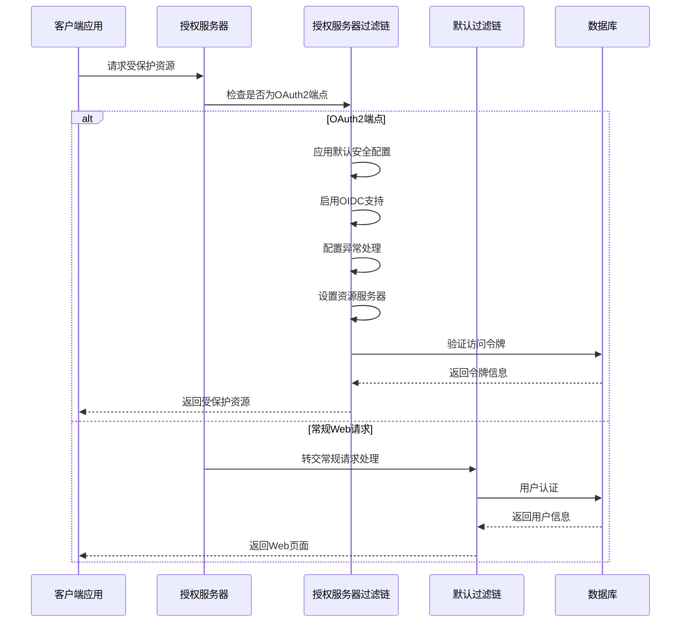
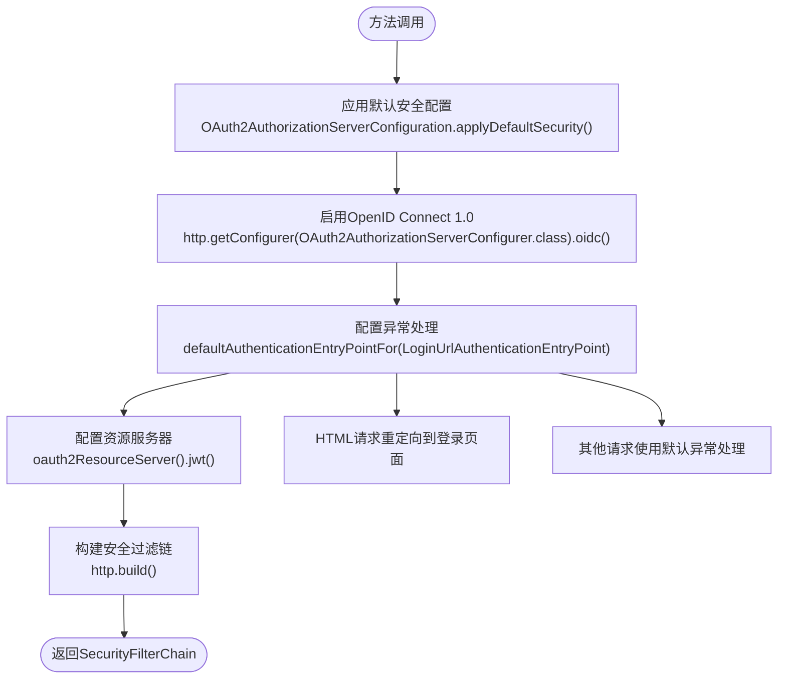
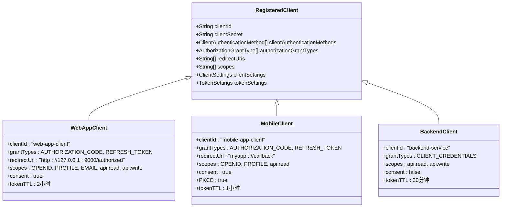
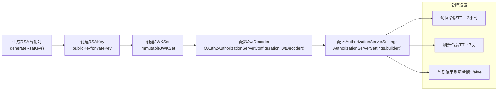
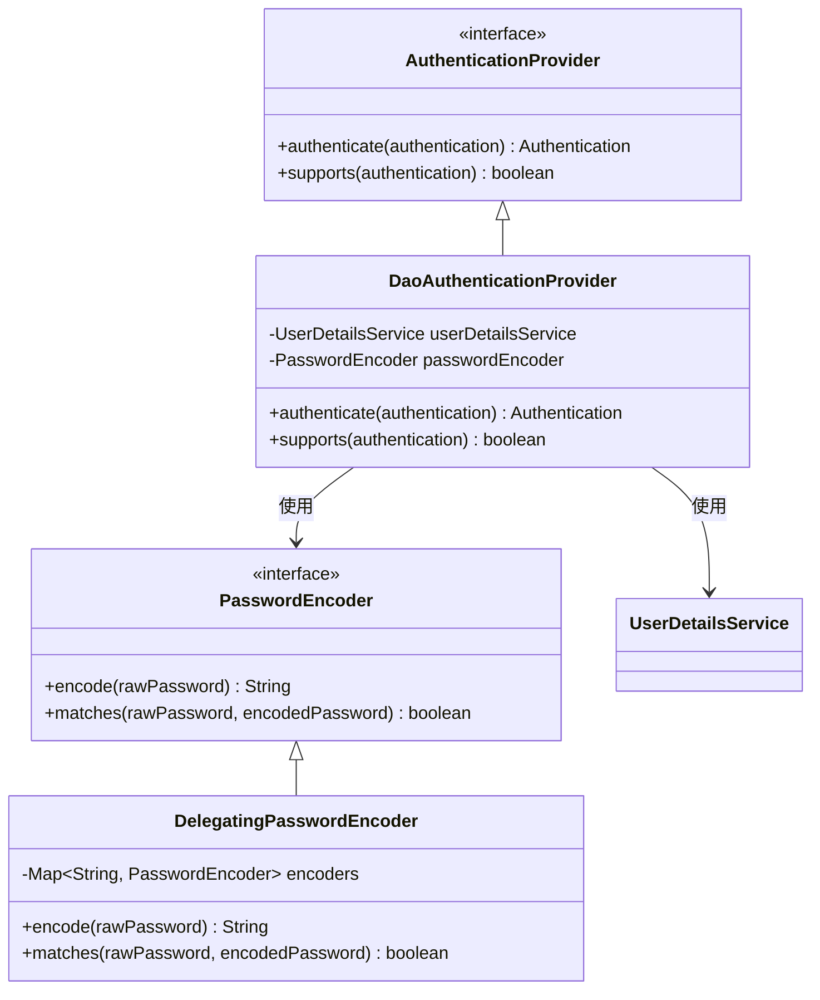
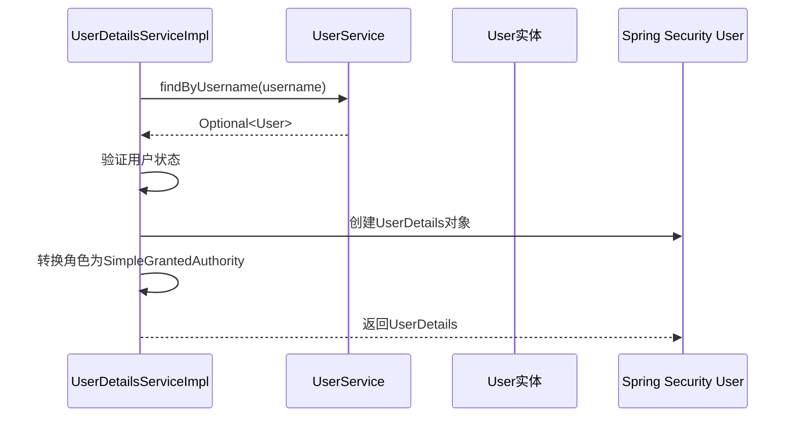
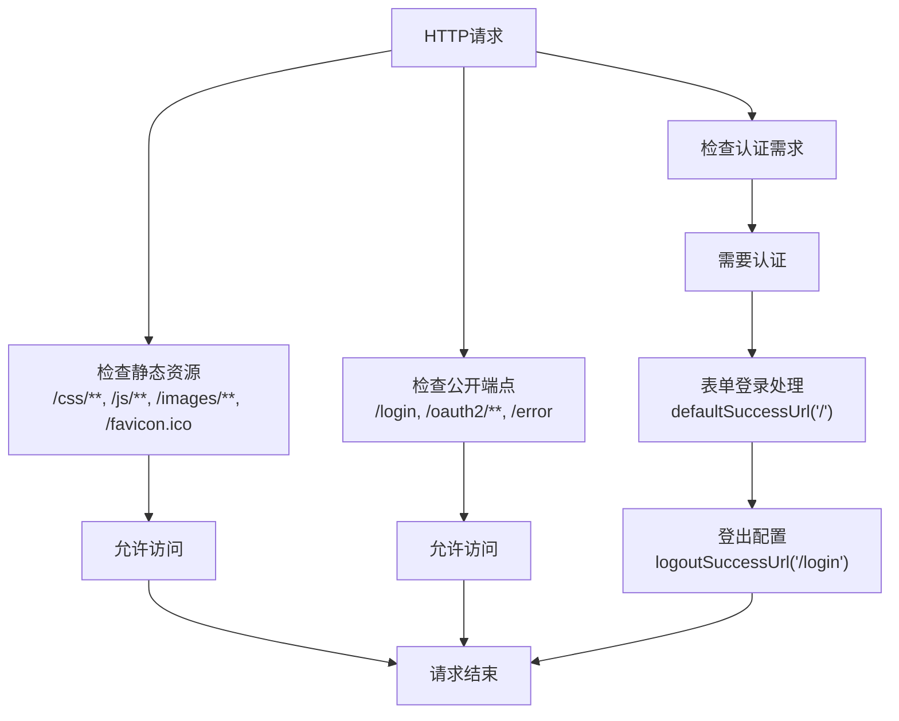
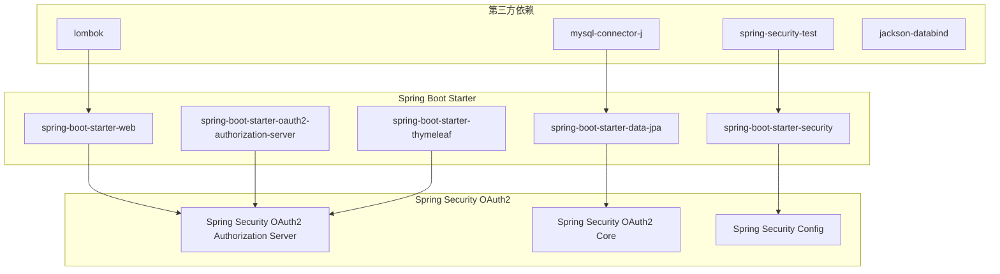
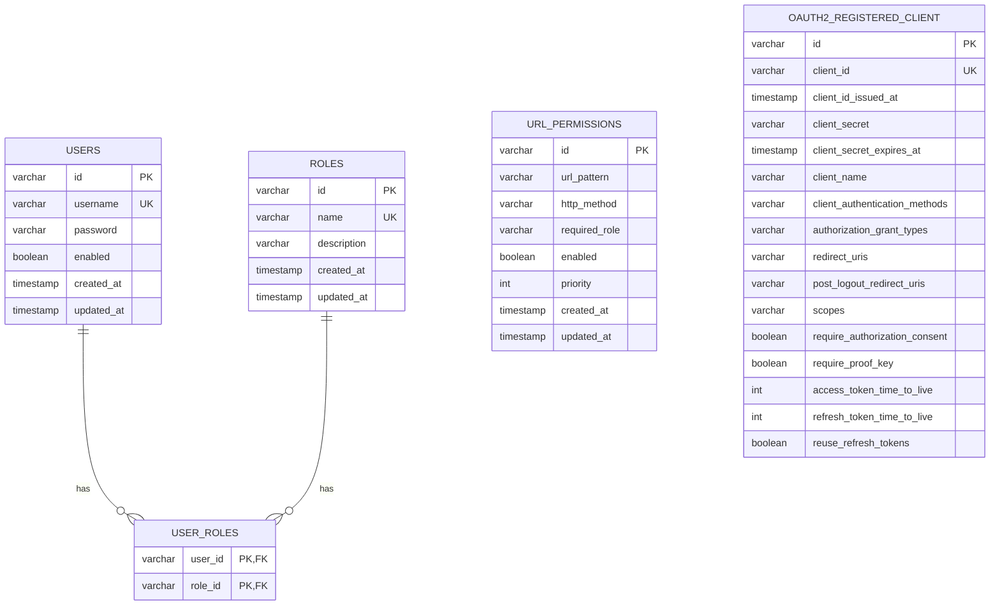

# 授权服务器基础配置

<cite>
**本文档引用的文件**
- [AuthorizationServerConfig.java](file://src/main/java/com/example/authserver/config/AuthorizationServerConfig.java)
- [DefaultSecurityConfig.java](file://src/main/java/com/example/authserver/config/DefaultSecurityConfig.java)
- [application.yml](file://src/main/resources/application.yml)
- [pom.xml](file://pom.xml)
- [schema.sql](file://src/main/resources/schema.sql)
- [AuthServerApplication.java](file://src/main/java/com/example/authserver/AuthServerApplication.java)
- [DataInitializerConfig.java](file://src/main/java/com/example/authserver/config/DataInitializerConfig.java)
- [HomeController.java](file://src/main/java/com/example/authserver/controller/HomeController.java)
- [User.java](file://src/main/java/com/example/authserver/entity/User.java)
- [UserDetailsServiceImpl.java](file://src/main/java/com/example/authserver/service/UserDetailsServiceImpl.java)
</cite>

## 目录
1. [简介](#简介)
2. [项目结构](#项目结构)
3. [核心组件](#核心组件)
4. [架构概览](#架构概览)
5. [详细组件分析](#详细组件分析)
6. [依赖分析](#依赖分析)
7. [性能考虑](#性能考虑)
8. [故障排除指南](#故障排除指南)
9. [结论](#结论)

## 简介

本项目是一个基于Spring Security OAuth2 Authorization Server的授权服务器实现。该系统提供了完整的OAuth2/OpenID Connect认证流程，包括授权码模式、客户端凭证模式、PKCE安全机制等。本文档专注于授权服务器的基础配置，特别是AuthorizationServerConfig类中的核心配置方法和安全过滤链的构建过程。

## 项目结构

项目采用标准的Spring Boot目录结构，主要包含以下模块：

**图表来源**
- [AuthServerApplication.java:1-14](file://src/main/java/com/example/authserver/AuthServerApplication.java#L1-L14)
- [AuthorizationServerConfig.java:1-256](file://src/main/java/com/example/authserver/config/AuthorizationServerConfig.java#L1-L256)
- [DefaultSecurityConfig.java:1-75](file://src/main/java/com/example/authserver/config/DefaultSecurityConfig.java#L1-L75)

**章节来源**
- [AuthServerApplication.java:1-14](file://src/main/java/com/example/authserver/AuthServerApplication.java#L1-L14)
- [pom.xml:1-147](file://pom.xml#L1-L147)

## 核心组件

### 授权服务器配置类

AuthorizationServerConfig类是整个授权服务器的核心配置类，负责：

1. **安全过滤链配置**：定义授权服务器的HTTP安全策略
2. **客户端管理**：配置不同类型的OAuth2客户端
3. **JWT密钥管理**：生成和配置用于令牌签名的RSA密钥对
4. **授权服务配置**：设置OAuth2授权状态的持久化存储

### 默认安全配置类

DefaultSecurityConfig类提供应用程序的通用安全配置：

1. **认证提供者配置**：使用数据库用户信息进行认证
2. **密码编码器配置**：支持多种密码编码算法
3. **常规请求过滤链**：处理登录、登出等常规Web请求

**章节来源**
- [AuthorizationServerConfig.java:44-256](file://src/main/java/com/example/authserver/config/AuthorizationServerConfig.java#L44-L256)
- [DefaultSecurityConfig.java:27-75](file://src/main/java/com/example/authserver/config/DefaultSecurityConfig.java#L27-L75)

## 架构概览

系统采用双过滤链架构，分别处理授权服务器特定的OAuth2请求和常规Web请求：

**图表来源**
- [AuthorizationServerConfig.java:56-77](file://src/main/java/com/example/authserver/config/AuthorizationServerConfig.java#L56-L77)
- [DefaultSecurityConfig.java:55-73](file://src/main/java/com/example/authserver/config/DefaultSecurityConfig.java#L55-L73)

## 详细组件分析

### AuthorizationServerConfig类深度分析

#### 授权服务器安全过滤链配置

authorizationServerSecurityFilterChain()方法是授权服务器的核心配置入口：

**图表来源**
- [AuthorizationServerConfig.java:56-77](file://src/main/java/com/example/authserver/config/AuthorizationServerConfig.java#L56-L77)

##### OAuth2AuthorizationServerConfiguration.applyDefaultSecurity()详解

该方法的作用是：
1. **启用基本的OAuth2安全功能**：包括授权端点、令牌端点、用户信息端点等
2. **配置默认的HTTP安全策略**：设置CSRF保护、会话管理等
3. **提供OAuth2协议所需的基础设施**：为后续的OIDC配置做准备

##### 异常处理配置原理

异常处理配置通过`defaultAuthenticationEntryPointFor()`方法实现：
- **目标**：当未认证用户访问需要认证的OAuth2端点时
- **行为**：重定向到指定的登录URL（"/login"）
- **触发条件**：针对HTML请求（`MediaType.TEXT_HTML`）
- **实现机制**：使用`LoginUrlAuthenticationEntryPoint`类

##### 资源服务器配置

资源服务器配置通过`oauth2ResourceServer().jwt()`实现：
- **目的**：允许访问令牌用于验证用户身份和客户端身份
- **机制**：使用JWT解码器验证令牌的有效性
- **应用场景**：用户信息端点、客户端注册端点等

**章节来源**
- [AuthorizationServerConfig.java:53-77](file://src/main/java/com/example/authserver/config/AuthorizationServerConfig.java#L53-L77)

#### 客户端配置管理

系统支持三种不同类型的OAuth2客户端配置：

**图表来源**
- [AuthorizationServerConfig.java:91-161](file://src/main/java/com/example/authserver/config/AuthorizationServerConfig.java#L91-L161)

##### Web应用客户端配置

适用于传统的Web应用，使用授权码模式：
- **认证方式**：`CLIENT_SECRET_BASIC`
- **授权类型**：授权码模式和刷新令牌
- **回调地址**：本地开发环境地址
- **权限范围**：OpenID Connect标准范围和自定义API范围
- **用户同意**：需要用户授权同意
- **令牌有效期**：访问令牌2小时，刷新令牌7天

##### 移动应用客户端配置

专为移动应用设计，使用PKCE增强安全性：
- **认证方式**：`NONE`（公开客户端）
- **授权类型**：授权码模式和刷新令牌
- **回调地址**：自定义URI Scheme
- **权限范围**：OpenID Connect标准范围和自定义API范围
- **PKCE要求**：强制使用PKCE（Proof Key for Code Exchange）
- **令牌有效期**：访问令牌1小时，刷新令牌30天

##### 后端服务客户端配置

用于服务间的无状态认证：
- **认证方式**：`CLIENT_SECRET_BASIC`
- **授权类型**：客户端凭证模式
- **权限范围**：仅API访问范围
- **用户同意**：不需要用户授权
- **令牌有效期**：访问令牌30分钟

**章节来源**
- [AuthorizationServerConfig.java:91-161](file://src/main/java/com/example/authserver/config/AuthorizationServerConfig.java#L91-L161)

#### JWT密钥管理和令牌配置

**图表来源**
- [AuthorizationServerConfig.java:211-253](file://src/main/java/com/example/authserver/config/AuthorizationServerConfig.java#L211-L253)

**章节来源**
- [AuthorizationServerConfig.java:211-253](file://src/main/java/com/example/authserver/config/AuthorizationServerConfig.java#L211-L253)

### DefaultSecurityConfig类分析

#### 认证提供者配置

DefaultSecurityConfig类提供应用程序的通用安全配置：

**图表来源**
- [DefaultSecurityConfig.java:34-49](file://src/main/java/com/example/authserver/config/DefaultSecurityConfig.java#L34-L49)

##### 用户详情服务实现

UserDetailsServiceImpl类实现了Spring Security的UserDetailsService接口：

**图表来源**
- [UserDetailsServiceImpl.java:29-57](file://src/main/java/com/example/authserver/service/UserDetailsServiceImpl.java#L29-L57)

**章节来源**
- [DefaultSecurityConfig.java:34-49](file://src/main/java/com/example/authserver/config/DefaultSecurityConfig.java#L34-L49)
- [UserDetailsServiceImpl.java:29-57](file://src/main/java/com/example/authserver/service/UserDetailsServiceImpl.java#L29-L57)

#### 常规请求过滤链配置

DefaultSecurityConfig类还配置了常规Web请求的安全过滤链：

**图表来源**
- [DefaultSecurityConfig.java:55-73](file://src/main/java/com/example/authserver/config/DefaultSecurityConfig.java#L55-L73)

**章节来源**
- [DefaultSecurityConfig.java:55-73](file://src/main/java/com/example/authserver/config/DefaultSecurityConfig.java#L55-L73)

## 依赖分析

### Maven依赖关系

项目使用Spring Boot 3.2.3和Spring Security 6.2.3版本，主要依赖包括：

**图表来源**
- [pom.xml:29-114](file://pom.xml#L29-L114)

### 数据库Schema设计

系统使用MySQL数据库存储用户、角色、URL权限规则和OAuth2客户端信息：

**图表来源**
- [schema.sql:8-169](file://src/main/resources/schema.sql#L8-L169)

**章节来源**
- [pom.xml:29-114](file://pom.xml#L29-L114)
- [schema.sql:8-169](file://src/main/resources/schema.sql#L8-L169)

## 性能考虑

### 安全过滤链优化

1. **过滤链顺序优化**：授权服务器过滤链具有最高优先级（Ordered.HIGHEST_PRECEDENCE），确保OAuth2端点优先处理
2. **缓存策略**：JWT解码器和JWK源应合理配置以避免频繁的密钥生成操作
3. **连接池配置**：数据库连接池应根据预期的并发用户数进行调整

### 数据库性能优化

1. **索引优化**：为常用的查询字段建立适当的索引
2. **查询优化**：避免N+1查询问题，使用批量加载策略
3. **连接池配置**：合理配置最大连接数和超时时间

### 客户端令牌管理

1. **令牌生命周期**：根据客户端类型合理设置令牌有效期
2. **刷新令牌策略**：禁用刷新令牌重复使用提高安全性
3. **内存使用**：监控令牌存储的内存使用情况

## 故障排除指南

### 常见配置问题

#### OAuth2端点无法访问

**症状**：访问`/oauth2/authorize`等端点返回404或403错误

**可能原因**：
1. 授权服务器过滤链未正确配置
2. 安全过滤链优先级设置不正确
3. OAuth2 Authorization Server依赖缺失

**解决方案**：
1. 确认AuthorizationServerConfig类正确配置
2. 检查过滤链优先级设置
3. 验证pom.xml中OAuth2依赖正确

#### 登录页面重定向问题

**症状**：登录后无法正确重定向到目标页面

**可能原因**：
1. 默认安全过滤链配置错误
2. 表单登录配置不正确
3. 用户详情服务实现问题

**解决方案**：
1. 检查DefaultSecurityConfig类的表单登录配置
2. 验证UserDetailsServiceImpl实现
3. 确认用户数据正确初始化

#### JWT令牌验证失败

**症状**：访问受保护资源时出现令牌验证错误

**可能原因**：
1. JWT密钥生成失败
2. 令牌解码器配置错误
3. 时间同步问题

**解决方案**：
1. 检查RSA密钥生成逻辑
2. 验证JWK源配置
3. 确认系统时间同步

**章节来源**
- [AuthorizationServerConfig.java:56-77](file://src/main/java/com/example/authserver/config/AuthorizationServerConfig.java#L56-L77)
- [DefaultSecurityConfig.java:55-73](file://src/main/java/com/example/authserver/config/DefaultSecurityConfig.java#L55-L73)

## 结论

本授权服务器基础配置文档详细分析了AuthorizationServerConfig类的核心配置方法，特别是authorizationServerSecurityFilterChain()方法的实现细节。通过OAuth2AuthorizationServerConfiguration.applyDefaultSecurity()方法，系统实现了完整的OAuth2/OpenID Connect认证框架。

关键配置要点包括：

1. **双过滤链架构**：授权服务器过滤链和默认过滤链的协同工作
2. **多客户端支持**：Web应用、移动应用和后端服务的不同配置策略
3. **安全机制**：PKCE、JWT签名、令牌生命周期管理等安全特性
4. **数据库集成**：完整的用户、角色、权限和OAuth2客户端数据模型

这些配置为构建企业级的OAuth2授权服务器奠定了坚实的基础，可以根据具体需求进一步扩展和定制。