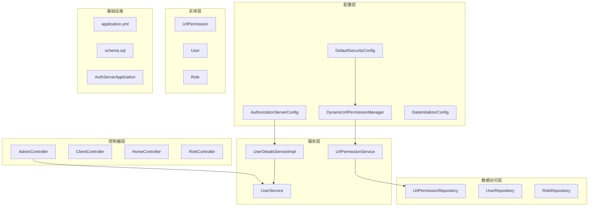
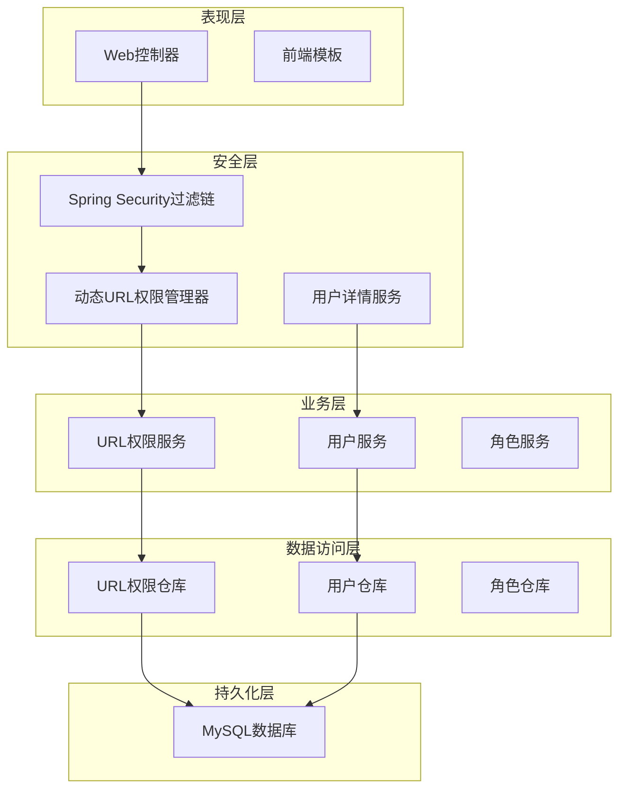
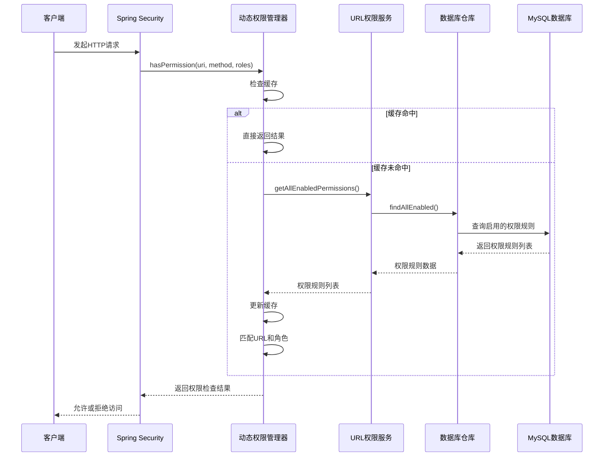
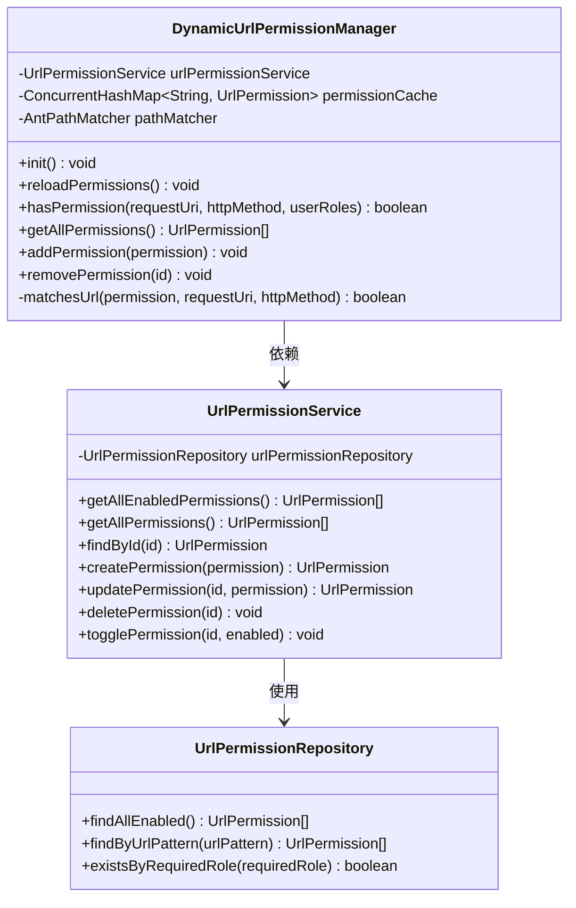
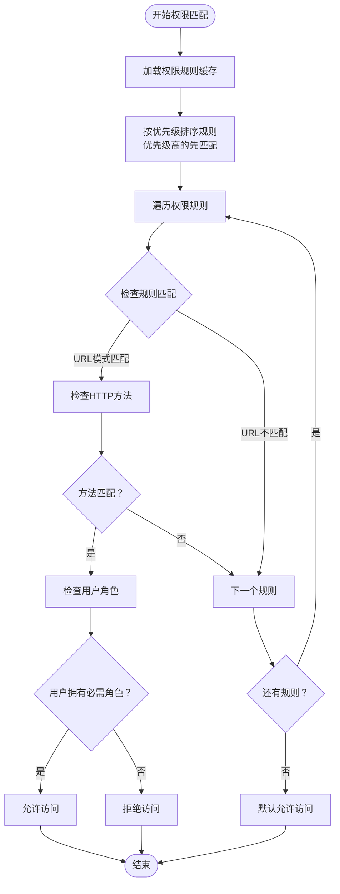
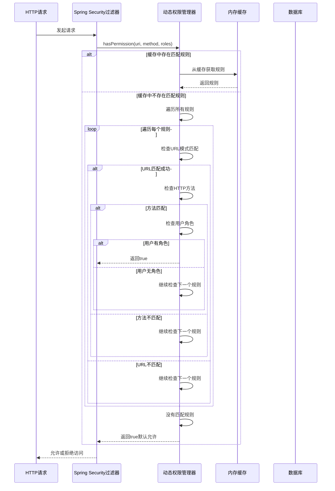
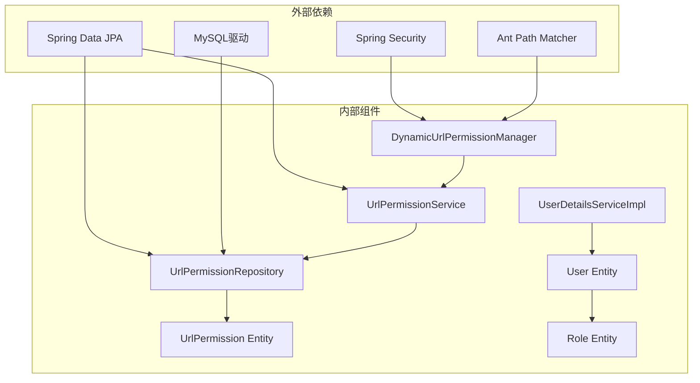

# 动态权限管理

<cite>
**本文档引用的文件**
- [DynamicUrlPermissionManager.java](file://src/main/java/com/example/authserver/config/DynamicUrlPermissionManager.java)
- [UrlPermission.java](file://src/main/java/com/example/authserver/entity/UrlPermission.java)
- [UrlPermissionRepository.java](file://src/main/java/com/example/authserver/repository/UrlPermissionRepository.java)
- [UrlPermissionService.java](file://src/main/java/com/example/authserver/service/UrlPermissionService.java)
- [application.yml](file://src/main/resources/application.yml)
- [schema.sql](file://src/main/resources/schema.sql)
- [DefaultSecurityConfig.java](file://src/main/java/com/example/authserver/config/DefaultSecurityConfig.java)
- [AuthorizationServerConfig.java](file://src/main/java/com/example/authserver/config/AuthorizationServerConfig.java)
- [DataInitializerConfig.java](file://src/main/java/com/example/authserver/config/DataInitializerConfig.java)
- [UserDetailsServiceImpl.java](file://src/main/java/com/example/authserver/service/UserDetailsServiceImpl.java)
- [AdminController.java](file://src/main/java/com/example/authserver/controller/AdminController.java)
- [AuthServerApplication.java](file://src/main/java/com/example/authserver/AuthServerApplication.java)
</cite>

## 目录
1. [简介](#简介)
2. [项目结构](#项目结构)
3. [核心组件](#核心组件)
4. [架构概览](#架构概览)
5. [详细组件分析](#详细组件分析)
6. [依赖关系分析](#依赖关系分析)
7. [性能考虑](#性能考虑)
8. [故障排除指南](#故障排除指南)
9. [结论](#结论)
10. [附录](#附录)

## 简介
本项目实现了基于数据库的动态URL权限管理系统，允许在不重启应用的情况下实时配置和更新URL访问权限规则。系统采用Spring Security框架，结合动态权限管理器、JPA数据访问层和MySQL数据库，提供了灵活的权限控制机制。

动态权限管理的核心特性包括：
- 基于Ant路径模式的URL匹配
- 支持HTTP方法级别的权限控制
- 可配置的角色权限映射
- 内存缓存机制保证高性能
- 热更新支持，无需重启服务
- 优先级机制处理规则冲突

## 项目结构
项目采用标准的Spring Boot目录结构，按照功能模块进行组织：



**图表来源**
- [DynamicUrlPermissionManager.java:1-120](file://src/main/java/com/example/authserver/config/DynamicUrlPermissionManager.java#L1-L120)
- [UrlPermission.java:1-73](file://src/main/java/com/example/authserver/entity/UrlPermission.java#L1-L73)
- [UrlPermissionRepository.java:1-32](file://src/main/java/com/example/authserver/repository/UrlPermissionRepository.java#L1-L32)
- [UrlPermissionService.java:1-94](file://src/main/java/com/example/authserver/service/UrlPermissionService.java#L1-L94)

**章节来源**
- [AuthServerApplication.java:1-14](file://src/main/java/com/example/authserver/AuthServerApplication.java#L1-L14)
- [application.yml:1-29](file://src/main/resources/application.yml#L1-L29)

## 核心组件
动态权限管理系统由以下核心组件构成：

### 动态URL权限管理器
动态URL权限管理器是整个系统的核心组件，负责：
- 从数据库加载所有启用的URL权限规则
- 维护内存中的权限规则缓存
- 提供URL权限匹配和验证功能
- 支持权限规则的热更新

### 权限规则实体
UrlPermission实体定义了权限规则的完整结构，包括：
- URL模式（支持Ant路径通配符）
- HTTP方法限制
- 必需角色
- 规则描述和启用状态
- 优先级配置
- 时间戳信息

### 数据访问层
UrlPermissionRepository提供了对权限规则的数据库操作：
- 查询所有启用的权限规则
- 按URL模式查询
- 检查角色权限存在性

### 服务层
UrlPermissionService封装了权限规则的业务逻辑：
- CRUD操作
- 权限规则的启用/禁用
- 事务管理

**章节来源**
- [DynamicUrlPermissionManager.java:16-120](file://src/main/java/com/example/authserver/config/DynamicUrlPermissionManager.java#L16-L120)
- [UrlPermission.java:7-73](file://src/main/java/com/example/authserver/entity/UrlPermission.java#L7-L73)
- [UrlPermissionRepository.java:10-32](file://src/main/java/com/example/authserver/repository/UrlPermissionRepository.java#L10-L32)
- [UrlPermissionService.java:12-94](file://src/main/java/com/example/authserver/service/UrlPermissionService.java#L12-L94)

## 架构概览
系统采用分层架构设计，各层职责明确：



**图表来源**
- [DefaultSecurityConfig.java:55-73](file://src/main/java/com/example/authserver/config/DefaultSecurityConfig.java#L55-L73)
- [DynamicUrlPermissionManager.java:25-54](file://src/main/java/com/example/authserver/config/DynamicUrlPermissionManager.java#L25-L54)
- [UrlPermissionService.java:25-27](file://src/main/java/com/example/authserver/service/UrlPermissionService.java#L25-L27)

系统的关键执行流程：



**图表来源**
- [DynamicUrlPermissionManager.java:64-81](file://src/main/java/com/example/authserver/config/DynamicUrlPermissionManager.java#L64-L81)
- [UrlPermissionService.java:25-27](file://src/main/java/com/example/authserver/service/UrlPermissionService.java#L25-L27)
- [UrlPermissionRepository.java:19-20](file://src/main/java/com/example/authserver/repository/UrlPermissionRepository.java#L19-L20)

## 详细组件分析

### 动态URL权限管理器详解

#### 缓存机制设计
动态权限管理器采用了高效的缓存策略：



**图表来源**
- [DynamicUrlPermissionManager.java:23-119](file://src/main/java/com/example/authserver/config/DynamicUrlPermissionManager.java#L23-L119)
- [UrlPermissionService.java:18-93](file://src/main/java/com/example/authserver/service/UrlPermissionService.java#L18-L93)
- [UrlPermissionRepository.java:14-31](file://src/main/java/com/example/authserver/repository/UrlPermissionRepository.java#L14-L31)

#### 权限匹配算法
权限匹配算法实现了多层次的匹配逻辑：



**图表来源**
- [DynamicUrlPermissionManager.java:64-95](file://src/main/java/com/example/authserver/config/DynamicUrlPermissionManager.java#L64-L95)

#### 热更新策略
系统支持完整的热更新机制：

1. **初始化加载**：应用启动时自动加载所有启用的权限规则
2. **手动刷新**：通过`reloadPermissions()`方法重新加载数据库中的最新规则
3. **增量更新**：支持添加、删除和修改单个权限规则
4. **并发安全**：使用ConcurrentHashMap确保线程安全

**章节来源**
- [DynamicUrlPermissionManager.java:36-54](file://src/main/java/com/example/authserver/config/DynamicUrlPermissionManager.java#L36-L54)
- [DynamicUrlPermissionManager.java:107-118](file://src/main/java/com/example/authserver/config/DynamicUrlPermissionManager.java#L107-L118)

### 权限规则存储结构

#### 数据库表设计
权限规则存储在`url_permissions`表中，具有以下关键字段：

| 字段名 | 类型 | 约束 | 描述 |
|--------|------|------|------|
| id | varchar(100) | PK, NOT NULL, UNIQUE | 权限规则唯一标识 |
| url_pattern | varchar(500) | NOT NULL | URL路径模式（支持通配符） |
| http_method | varchar(20) | NOT NULL, DEFAULT '*' | HTTP方法（GET/POST/PUT/DELETE/*） |
| required_role | varchar(100) | NOT NULL | 所需角色（如：ROLE_ADMIN） |
| description | varchar(255) | NULL | 规则描述 |
| enabled | boolean | NOT NULL, DEFAULT true | 是否启用 |
| priority | int | NOT NULL, DEFAULT 0 | 优先级（数字越大优先级越高） |
| created_at | timestamp | NOT NULL, DEFAULT CURRENT_TIMESTAMP | 创建时间 |
| updated_at | timestamp | NOT NULL, DEFAULT CURRENT_TIMESTAMP | 更新时间 |

#### 索引优化
数据库为提高查询性能建立了以下索引：
- `ix_url_pattern`：URL模式索引，加速URL匹配查询
- `ix_enabled`：启用状态索引，优化规则筛选

**章节来源**
- [schema.sql:42-56](file://src/main/resources/schema.sql#L42-L56)
- [UrlPermission.java:14-72](file://src/main/java/com/example/authserver/entity/UrlPermission.java#L14-L72)

### 权限验证执行流程

#### 完整的权限检查流程


**图表来源**
- [DynamicUrlPermissionManager.java:64-81](file://src/main/java/com/example/authserver/config/DynamicUrlPermissionManager.java#L64-L81)

#### URL模式匹配机制
系统支持多种URL模式匹配：

| 模式示例 | 匹配范围 | 说明 |
|----------|----------|------|
| `/admin/**` | 所有以/admin开头的路径 | 递归匹配子路径 |
| `/api/users/*` | 一级子路径 | 仅匹配一层子路径 |
| `/users/{id}` | 参数化路径 | Spring MVC风格参数 |
| `/api/**` | API前缀路径 | 所有API相关路径 |
| `/**/*.css` | 所有CSS文件 | 文件扩展名匹配 |

**章节来源**
- [DynamicUrlPermissionManager.java:86-95](file://src/main/java/com/example/authserver/config/DynamicUrlPermissionManager.java#L86-L95)

## 依赖关系分析

### 组件依赖图


**图表来源**
- [DynamicUrlPermissionManager.java:3-8](file://src/main/java/com/example/authserver/config/DynamicUrlPermissionManager.java#L3-L8)
- [UrlPermissionService.java:3-8](file://src/main/java/com/example/authserver/service/UrlPermissionService.java#L3-L8)
- [UrlPermissionRepository.java:3-7](file://src/main/java/com/example/authserver/repository/UrlPermissionRepository.java#L3-L7)

### 关键依赖关系
1. **动态权限管理器**依赖**URL权限服务**获取数据库中的权限规则
2. **URL权限服务**依赖**URL权限仓库**进行数据持久化操作
3. **URL权限仓库**依赖**JPA**框架与数据库交互
4. **用户详情服务**依赖**用户服务**获取用户角色信息
5. **Spring Security**集成**动态权限管理器**进行权限验证

**章节来源**
- [DefaultSecurityConfig.java:34-41](file://src/main/java/com/example/authserver/config/DefaultSecurityConfig.java#L34-L41)
- [UserDetailsServiceImpl.java:24-24](file://src/main/java/com/example/authserver/service/UserDetailsServiceImpl.java#L24-L24)

## 性能考虑

### 缓存策略优化
系统采用了多层缓存策略来保证性能：

1. **内存缓存**：使用ConcurrentHashMap存储所有启用的权限规则
2. **查询优化**：数据库查询按优先级排序，减少不必要的比较
3. **路径匹配优化**：使用AntPathMatcher进行高效的路径模式匹配

### 查询性能优化
- **索引优化**：为URL模式和启用状态建立索引
- **批量加载**：应用启动时一次性加载所有权限规则
- **优先级排序**：按优先级排序减少匹配次数

### 并发安全性
- **线程安全**：使用ConcurrentHashMap确保并发访问安全
- **原子操作**：缓存更新采用原子操作避免竞态条件
- **不可变对象**：权限规则对象设计为不可变以提高并发性能

### 内存使用优化
- **规则缓存**：只缓存启用的权限规则，减少内存占用
- **智能清理**：支持按需清理缓存，释放内存空间
- **延迟加载**：权限规则按需加载，避免不必要的初始化

## 故障排除指南

### 常见问题及解决方案

#### 权限规则不生效
**问题现象**：配置的权限规则没有按预期工作

**可能原因**：
1. 权限规则未启用（enabled字段为false）
2. URL模式不匹配
3. HTTP方法不匹配
4. 用户角色不正确

**解决步骤**：
1. 检查权限规则的enabled状态
2. 验证URL模式的正确性
3. 确认HTTP方法配置
4. 验证用户角色分配

#### 权限规则冲突
**问题现象**：多个权限规则同时匹配同一请求

**解决方案**：
1. 调整权限规则的优先级
2. 使用更精确的URL模式
3. 明确HTTP方法限制

#### 性能问题
**问题现象**：权限检查响应缓慢

**优化建议**：
1. 检查数据库索引是否正确
2. 优化URL模式的复杂度
3. 减少权限规则的数量
4. 调整缓存策略

### 日志调试
系统提供了详细的日志输出，便于问题诊断：

- **权限匹配日志**：记录每次权限检查的详细信息
- **缓存操作日志**：跟踪缓存的加载、更新和清理操作
- **数据库操作日志**：记录权限规则的数据库访问情况

**章节来源**
- [DynamicUrlPermissionManager.java:72-80](file://src/main/java/com/example/authserver/config/DynamicUrlPermissionManager.java#L72-L80)
- [application.yml:26-29](file://src/main/resources/application.yml#L26-L29)

## 结论
动态权限管理系统通过以下关键特性实现了灵活而高效的权限控制：

1. **动态配置**：支持实时配置和更新权限规则，无需重启服务
2. **高性能**：采用内存缓存和优化的匹配算法，保证快速响应
3. **灵活性**：支持复杂的URL模式匹配和角色权限映射
4. **可靠性**：提供完整的错误处理和日志记录机制
5. **可维护性**：清晰的架构设计和模块化组件

该系统特别适用于需要频繁调整权限策略的应用场景，如内容管理系统、企业管理系统等。通过合理的配置和优化，可以满足大多数动态权限管理的需求。

## 附录

### 实际应用场景

#### 基于URL的访问控制
- **公开资源**：静态文件、登录页面等公开访问
- **受保护资源**：用户个人资料、订单管理等需要认证
- **管理员资源**：后台管理界面、系统配置等需要特定角色

#### 动态路由权限
- **功能开关**：根据用户角色动态启用/禁用功能模块
- **区域权限**：不同地区用户访问不同内容
- **时间限制**：基于时间段的权限控制

### 配置示例

#### 基础权限配置
```sql
-- 公开访问路径
INSERT INTO url_permissions (id, url_pattern, http_method, required_role, enabled, priority)
VALUES 
    ('perm-001', '/', '*', 'ROLE_USER', true, 0),
    ('perm-002', '/css/**', '*', 'ROLE_USER', true, 0),
    ('perm-003', '/js/**', '*', 'ROLE_USER', true, 0);

-- 管理员专用路径
INSERT INTO url_permissions (id, url_pattern, http_method, required_role, enabled, priority)
VALUES 
    ('perm-004', '/admin/**', '*', 'ROLE_ADMIN', true, 10);
```

#### 复杂权限配置
```sql
-- API权限控制
INSERT INTO url_permissions (id, url_pattern, http_method, required_role, enabled, priority)
VALUES 
    ('perm-005', '/api/users', 'GET', 'ROLE_USER', true, 5),
    ('perm-006', '/api/users', 'POST', 'ROLE_ADMIN', true, 10),
    ('perm-007', '/api/users/{id}', '*', 'ROLE_USER', true, 5);
```

### 最佳实践

#### 权限设计原则
1. **最小权限原则**：用户只能访问必要的资源
2. **层次化设计**：使用优先级管理复杂的权限关系
3. **明确性**：权限规则应该清晰明确，避免歧义
4. **可维护性**：定期审查和清理不再使用的权限规则

#### 性能优化建议
1. **合理使用通配符**：避免过于宽泛的URL模式
2. **索引优化**：为常用的查询条件建立索引
3. **缓存策略**：根据实际使用情况调整缓存大小
4. **监控告警**：建立权限检查的性能监控机制

#### 安全考虑
1. **输入验证**：对所有用户输入进行严格验证
2. **审计日志**：记录重要的权限变更操作
3. **定期审查**：定期检查权限配置的合理性
4. **备份恢复**：定期备份权限配置数据