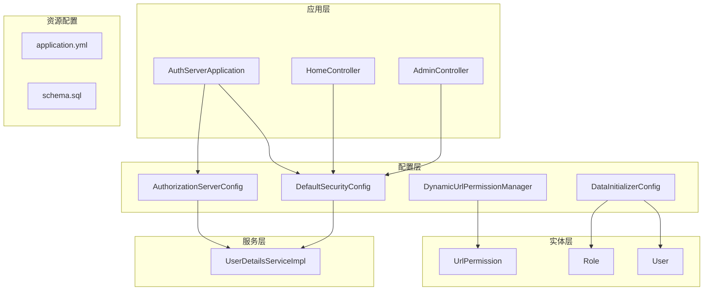
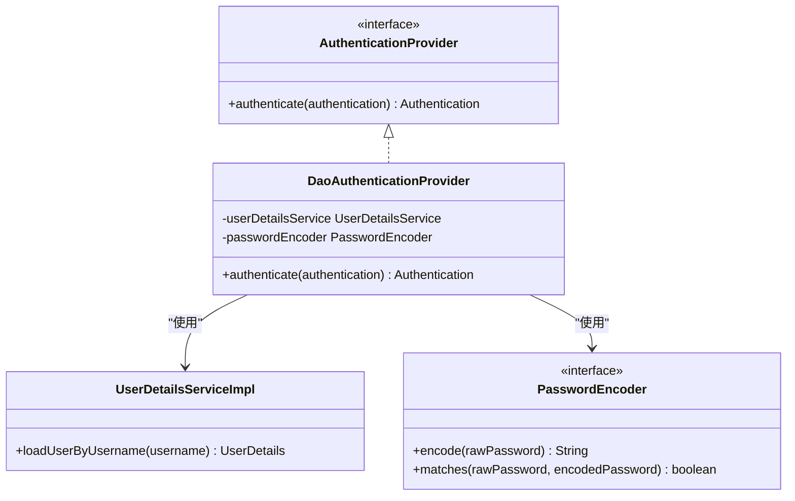
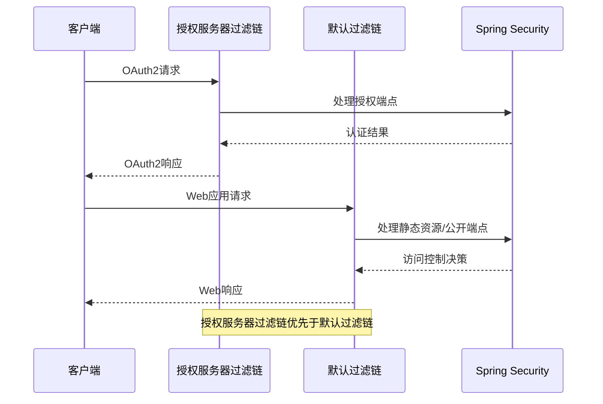
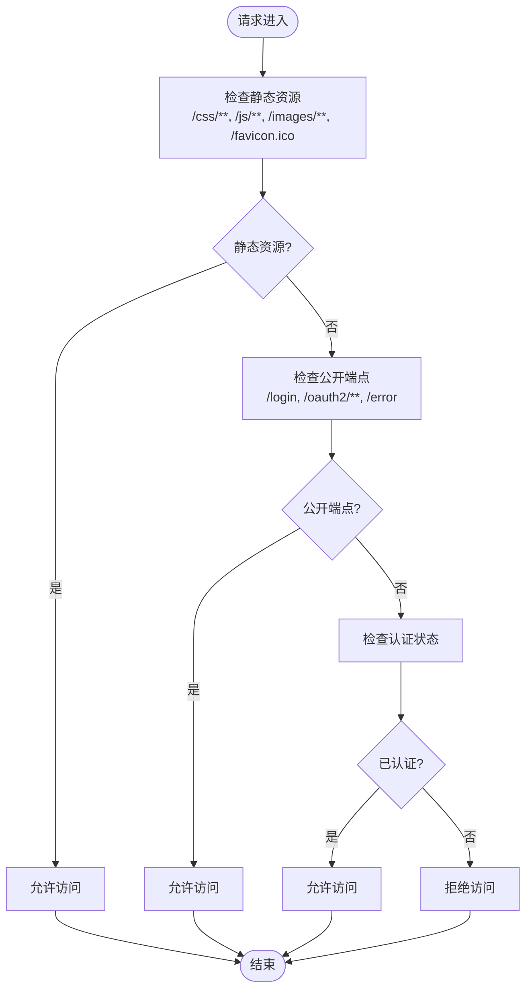
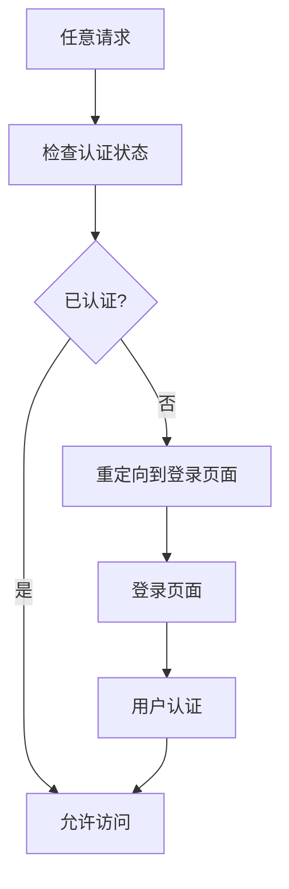
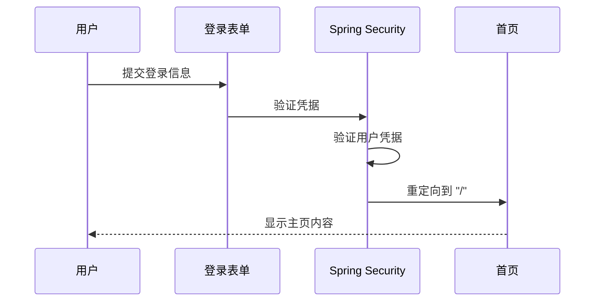
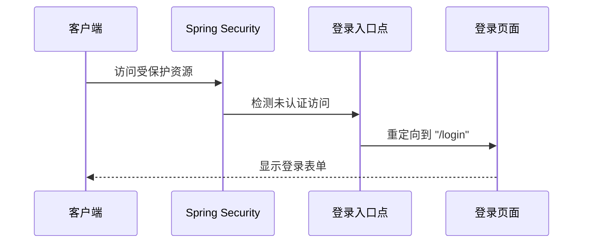
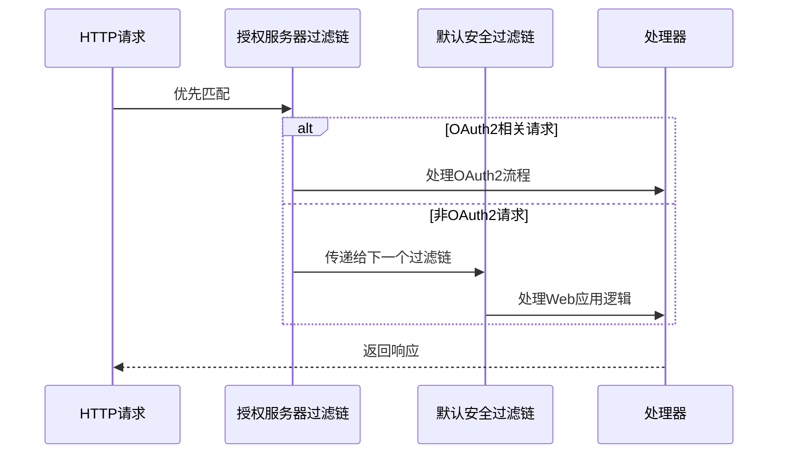
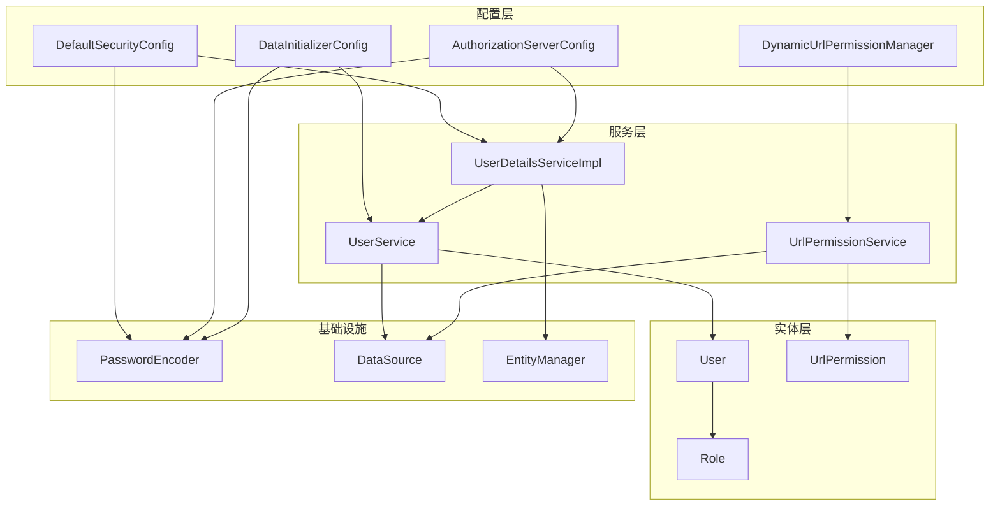

# HTTP安全配置

<cite>
**本文档引用的文件**
- [DefaultSecurityConfig.java](file://src/main/java/com/example/authserver/config/DefaultSecurityConfig.java)
- [AuthorizationServerConfig.java](file://src/main/java/com/example/authserver/config/AuthorizationServerConfig.java)
- [DynamicUrlPermissionManager.java](file://src/main/java/com/example/authserver/config/DynamicUrlPermissionManager.java)
- [UserDetailsServiceImpl.java](file://src/main/java/com/example/authserver/service/UserDetailsServiceImpl.java)
- [HomeController.java](file://src/main/java/com/example/authserver/controller/HomeController.java)
- [AdminController.java](file://src/main/java/com/example/authserver/controller/AdminController.java)
- [DataInitializerConfig.java](file://src/main/java/com/example/authserver/config/DataInitializerConfig.java)
- [UrlPermission.java](file://src/main/java/com/example/authserver/entity/UrlPermission.java)
- [application.yml](file://src/main/resources/application.yml)
- [schema.sql](file://src/main/resources/schema.sql)
</cite>

## 目录
1. [简介](#简介)
2. [项目结构](#项目结构)
3. [核心组件](#核心组件)
4. [架构概览](#架构概览)
5. [详细组件分析](#详细组件分析)
6. [依赖分析](#依赖分析)
7. [性能考虑](#性能考虑)
8. [故障排除指南](#故障排除指南)
9. [结论](#结论)

## 简介

本文档深入解析了Spring Security在OAuth2授权服务器中的HTTP安全配置实现。该系统采用双过滤链架构，结合静态资源访问控制、公开端点配置和动态URL权限管理，实现了灵活且可扩展的安全策略。

系统的核心特点包括：
- 双安全过滤链配置（授权服务器过滤链和默认过滤链）
- 动态URL权限管理器支持运行时权限规则变更
- 完整的OAuth2/OpenID Connect集成
- 灵活的静态资源和公开端点访问控制
- 统一的认证和授权处理机制

## 项目结构

项目采用标准的Spring Boot目录结构，安全配置集中在config包中，通过多个配置类协同工作：



**图表来源**
- [AuthServerApplication.java:1-14](file://src/main/java/com/example/authserver/AuthServerApplication.java#L1-L14)
- [DefaultSecurityConfig.java:1-75](file://src/main/java/com/example/authserver/config/DefaultSecurityConfig.java#L1-L75)
- [AuthorizationServerConfig.java:1-256](file://src/main/java/com/example/authserver/config/AuthorizationServerConfig.java#L1-L256)

**章节来源**
- [AuthServerApplication.java:1-14](file://src/main/java/com/example/authserver/AuthServerApplication.java#L1-L14)
- [application.yml:1-30](file://src/main/resources/application.yml#L1-L30)

## 核心组件

### 安全过滤链配置

系统配置了两个主要的安全过滤链，具有不同的优先级和职责：

#### 授权服务器过滤链
- **优先级**: 最高优先级（Ordered.HIGHEST_PRECEDENCE）
- **职责**: 处理OAuth2授权端点和OIDC认证流程
- **特性**: 自动应用默认安全配置，启用OpenID Connect支持

#### 默认安全过滤链
- **优先级**: 次高优先级（@Order(2)）
- **职责**: 处理常规Web应用的认证和授权
- **特性**: 集成表单登录、注销和静态资源访问控制

### 认证提供者配置

系统使用DaoAuthenticationProvider进行数据库用户认证：



**图表来源**
- [DefaultSecurityConfig.java:34-41](file://src/main/java/com/example/authserver/config/DefaultSecurityConfig.java#L34-L41)
- [UserDetailsServiceImpl.java:22-58](file://src/main/java/com/example/authserver/service/UserDetailsServiceImpl.java#L22-L58)

**章节来源**
- [DefaultSecurityConfig.java:34-49](file://src/main/java/com/example/authserver/config/DefaultSecurityConfig.java#L34-L49)

## 架构概览

系统采用双过滤链架构，确保OAuth2授权流程和常规Web应用安全需求得到恰当处理：



**图表来源**
- [AuthorizationServerConfig.java:57-77](file://src/main/java/com/example/authserver/config/AuthorizationServerConfig.java#L57-L77)
- [DefaultSecurityConfig.java:55-73](file://src/main/java/com/example/authserver/config/DefaultSecurityConfig.java#L55-L73)

## 详细组件分析

### DefaultSecurityConfig安全规则配置

#### authorizeHttpRequests安全规则

系统通过authorizeHttpRequests配置实现了分层的访问控制策略：



**图表来源**
- [DefaultSecurityConfig.java:59-64](file://src/main/java/com/example/authserver/config/DefaultSecurityConfig.java#L59-L64)

#### requestMatchers使用方式详解

系统使用多种路径匹配模式来精确控制不同类型的资源访问：

**静态资源匹配规则**:
- `/css/**`: 样式表文件访问
- `/js/**`: JavaScript文件访问  
- `/images/**`: 图片资源访问
- `/favicon.ico`: 网站图标访问

**公开端点配置**:
- `/login`: 登录页面访问
- `/oauth2/**`: OAuth2相关端点访问
- `/error`: 错误页面访问

这些规则通过`permitAll()`方法实现完全开放访问，无需用户认证。

#### anyRequest().authenticated()全局认证要求

系统通过`anyRequest().authenticated()`实现全局认证要求：



**图表来源**
- [DefaultSecurityConfig.java:63-64](file://src/main/java/com/example/authserver/config/DefaultSecurityConfig.java#L63-L64)

### 表单登录配置

#### defaultSuccessUrl重定向逻辑

表单登录成功后的重定向行为通过以下配置实现：



**图表来源**
- [DefaultSecurityConfig.java:66-67](file://src/main/java/com/example/authserver/config/DefaultSecurityConfig.java#L66-L67)
- [HomeController.java:15-21](file://src/main/java/com/example/authserver/controller/HomeController.java#L15-L21)

#### 登录入口点配置

当未认证用户访问受保护资源时，系统会自动重定向到登录页面：



**图表来源**
- [AuthorizationServerConfig.java:68-71](file://src/main/java/com/example/authserver/config/AuthorizationServerConfig.java#L68-L71)

### 注销配置实现

#### logoutSuccessUrl设置

系统配置了注销成功后的重定向目标：

```mermaid
flowchart TD
LogoutRequest[注销请求] --> ClearSession[清理会话]
ClearSession --> InvalidateSession[使会话失效]
InvalidateSession --> RedirectLogin[重定向到 "/login"]
RedirectLogin --> LoginSuccess[返回登录页面]
```

**图表来源**
- [DefaultSecurityConfig.java:68-70](file://src/main/java/com/example/authserver/config/DefaultSecurityConfig.java#L68-L70)

#### 权限控制机制

注销功能通过`.permitAll()`配置，允许所有用户访问注销端点，但实际的注销操作仍受到Spring Security的保护。

### 安全过滤链配置顺序和优先级

#### 优先级分配

系统通过`@Order`注解明确指定过滤链的执行顺序：

```mermaid
graph LR
A[Ordered.HIGHEST_PRECEDENCE<br/>授权服务器过滤链] --> B[@Order(2)<br/>默认安全过滤链]
B --> C[其他过滤链]
style A fill:#ffcccc
style B fill:#ccffcc
```

**图表来源**
- [AuthorizationServerConfig.java:57-57](file://src/main/java/com/example/authserver/config/AuthorizationServerConfig.java#L57-L57)
- [DefaultSecurityConfig.java:56-56](file://src/main/java/com/example/authserver/config/DefaultSecurityConfig.java#L56-L56)

#### 过滤链执行流程



**图表来源**
- [AuthorizationServerConfig.java:58-77](file://src/main/java/com/example/authserver/config/AuthorizationServerConfig.java#L58-L77)
- [DefaultSecurityConfig.java:57-73](file://src/main/java/com/example/authserver/config/DefaultSecurityConfig.java#L57-L73)

**章节来源**
- [DefaultSecurityConfig.java:55-73](file://src/main/java/com/example/authserver/config/DefaultSecurityConfig.java#L55-L73)
- [AuthorizationServerConfig.java:57-77](file://src/main/java/com/example/authserver/config/AuthorizationServerConfig.java#L57-L77)

## 依赖分析

### 组件耦合关系

系统各组件之间形成了清晰的层次化依赖关系：



**图表来源**
- [DefaultSecurityConfig.java:11-21](file://src/main/java/com/example/authserver/config/DefaultSecurityConfig.java#L11-L21)
- [UserDetailsServiceImpl.java:24-24](file://src/main/java/com/example/authserver/service/UserDetailsServiceImpl.java#L24-L24)

### 外部依赖和集成点

系统集成了多个外部组件和服务：

- **Spring Security**: 核心安全框架
- **Spring Authorization Server**: OAuth2授权服务器支持
- **MySQL数据库**: 持久化用户、角色和权限数据
- **Thymeleaf模板引擎**: Web界面渲染
- **BCrypt密码编码器**: 密码安全存储

**章节来源**
- [application.yml:5-24](file://src/main/resources/application.yml#L5-L24)
- [schema.sql:8-56](file://src/main/resources/schema.sql#L8-L56)

## 性能考虑

### 动态URL权限管理器优化

系统通过以下机制优化权限检查性能：

- **并发缓存**: 使用ConcurrentHashMap存储权限规则，支持高并发访问
- **优先级排序**: 按优先级对权限规则进行排序，提高匹配效率
- **AntPathMatcher**: 使用高效的路径匹配算法
- **延迟加载**: 权限规则按需加载和缓存

### 安全过滤链性能

- **优先级分离**: 将OAuth2处理和Web应用处理分离到不同过滤链
- **最小化配置**: 通过合理配置减少不必要的安全检查
- **静态资源优化**: 静态资源直接放行，避免安全过滤开销

## 故障排除指南

### 常见安全配置问题

#### 认证失败问题

**症状**: 用户无法登录，总是被重定向到登录页面

**可能原因**:
1. 用户名或密码不正确
2. 用户账户被禁用
3. 密码编码器配置不匹配

**解决方案**:
- 检查用户数据库中的密码是否使用BCrypt编码
- 验证用户状态是否为启用状态
- 确认密码编码器配置一致

#### 权限不足问题

**症状**: 登录后无法访问某些页面

**可能原因**:
1. 用户缺少必要的角色
2. URL权限规则配置错误
3. 权限规则优先级冲突

**解决方案**:
- 检查用户角色分配
- 验证URL权限规则配置
- 调整权限规则优先级

#### 静态资源访问问题

**症状**: CSS、JavaScript或图片无法加载

**可能原因**:
1. 静态资源路径配置错误
2. 文件权限问题
3. 缓存问题

**解决方案**:
- 检查静态资源路径映射
- 验证文件存在性和权限
- 清除浏览器缓存

### 调试建议

#### 启用详细日志

在application.yml中增加以下配置以获取更多调试信息：

```yaml
logging:
  level:
    org.springframework.security: DEBUG
    org.springframework.security.web: DEBUG
```

#### 验证配置

使用以下步骤验证安全配置：

1. 检查过滤链优先级配置
2. 验证静态资源访问规则
3. 测试公开端点访问
4. 验证受保护资源访问
5. 测试认证和注销流程

**章节来源**
- [application.yml:26-29](file://src/main/resources/application.yml#L26-L29)

## 结论

该HTTP安全配置实现了一个完整、灵活且高性能的OAuth2授权服务器安全框架。通过双过滤链架构、动态权限管理和完善的认证机制，系统能够有效平衡安全性与易用性。

### 主要优势

1. **模块化设计**: 清晰的组件分离和职责划分
2. **动态权限**: 支持运行时权限规则变更
3. **OAuth2集成**: 完整的OAuth2/OpenID Connect支持
4. **性能优化**: 合理的缓存和匹配策略
5. **易于维护**: 清晰的配置结构和文档

### 最佳实践建议

1. **定期审查权限规则**: 确保权限配置符合最小权限原则
2. **监控安全事件**: 启用详细日志以便及时发现安全问题
3. **定期更新依赖**: 保持Spring Security和其他依赖的最新版本
4. **安全审计**: 定期进行安全审计和渗透测试
5. **备份策略**: 确保权限配置和用户数据的安全备份

该配置为构建企业级OAuth2授权服务器提供了坚实的基础，可以根据具体业务需求进一步扩展和定制。