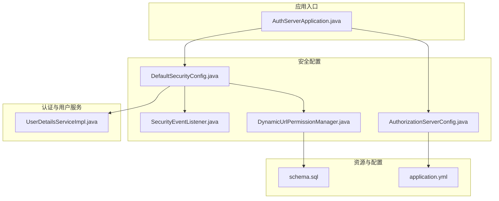
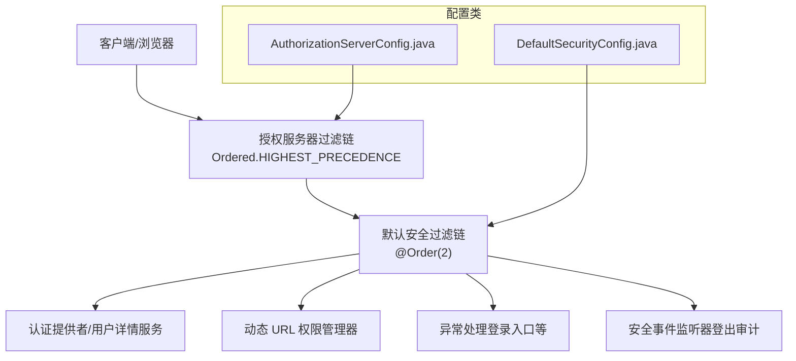
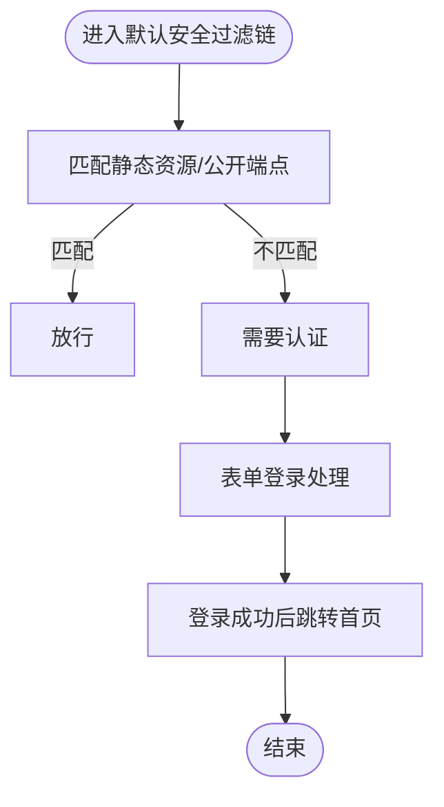
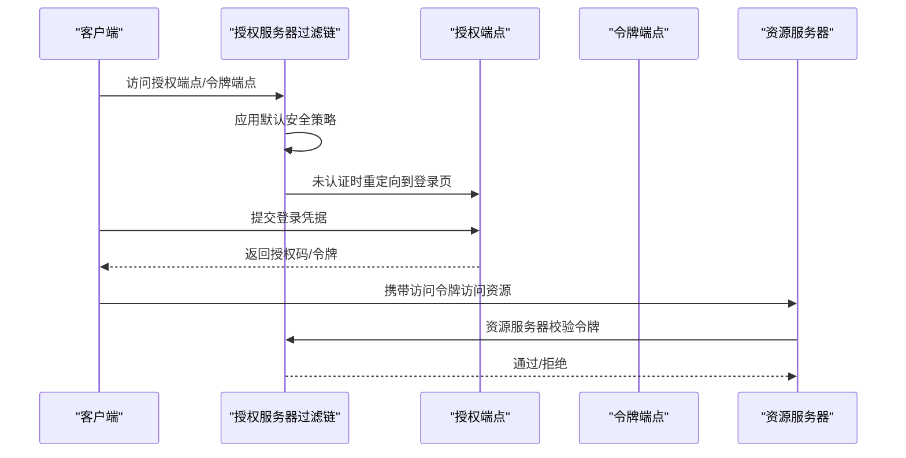
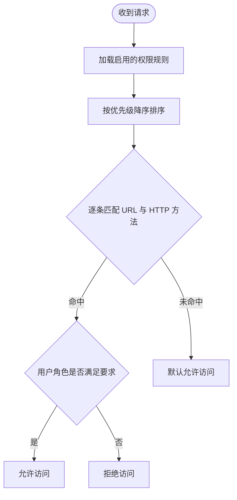
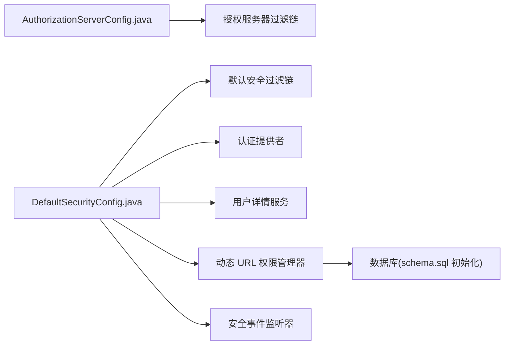

# 安全过滤链配置

<cite>
**本文引用的文件**
- [AuthServerApplication.java](file://src/main/java/com/example/authserver/AuthServerApplication.java)
- [DefaultSecurityConfig.java](file://src/main/java/com/example/authserver/config/DefaultSecurityConfig.java)
- [AuthorizationServerConfig.java](file://src/main/java/com/example/authserver/config/AuthorizationServerConfig.java)
- [DynamicUrlPermissionManager.java](file://src/main/java/com/example/authserver/config/DynamicUrlPermissionManager.java)
- [SecurityEventListener.java](file://src/main/java/com/example/authserver/listener/SecurityEventListener.java)
- [UserDetailsServiceImpl.java](file://src/main/java/com/example/authserver/service/UserDetailsServiceImpl.java)
- [application.yml](file://src/main/resources/application.yml)
- [schema.sql](file://src/main/resources/schema.sql)
</cite>

## 目录
1. [简介](#简介)
2. [项目结构](#项目结构)
3. [核心组件](#核心组件)
4. [架构总览](#架构总览)
5. [详细组件分析](#详细组件分析)
6. [依赖分析](#依赖分析)
7. [性能考虑](#性能考虑)
8. [故障排查指南](#故障排查指南)
9. [结论](#结论)
10. [附录](#附录)

## 简介
本文件围绕安全过滤链配置展开，重点阐述以下内容：
- SecurityFilterChain 的配置与作用机制
- 默认安全过滤链与 OAuth2 授权服务器过滤链的优先级与协作
- 过滤链中认证、授权、异常处理的执行顺序
- 扩展与自定义方式（添加自定义过滤器、修改行为）
- 最佳实践与常见问题排查

该工程是一个基于 Spring Security 与 Spring Authorization Server 的 OAuth2 授权服务器，同时提供默认 Web 安全过滤链以处理登录、登出与通用权限控制。

## 项目结构
项目采用按功能域划分的包结构，安全相关配置集中在 config 包内，业务层包含控制器、服务与仓储，资源目录包含应用配置与数据库初始化脚本。

图表来源
- [AuthServerApplication.java:1-14](file://src/main/java/com/example/authserver/AuthServerApplication.java#L1-L14)
- [DefaultSecurityConfig.java:1-78](file://src/main/java/com/example/authserver/config/DefaultSecurityConfig.java#L1-L78)
- [AuthorizationServerConfig.java:1-256](file://src/main/java/com/example/authserver/config/AuthorizationServerConfig.java#L1-L256)
- [DynamicUrlPermissionManager.java:1-120](file://src/main/java/com/example/authserver/config/DynamicUrlPermissionManager.java#L1-L120)
- [SecurityEventListener.java:1-135](file://src/main/java/com/example/authserver/listener/SecurityEventListener.java#L1-L135)
- [UserDetailsServiceImpl.java:1-59](file://src/main/java/com/example/authserver/service/UserDetailsServiceImpl.java#L1-L59)
- [application.yml:1-30](file://src/main/resources/application.yml#L1-L30)
- [schema.sql:1-194](file://src/main/resources/schema.sql#L1-L194)

章节来源
- [AuthServerApplication.java:1-14](file://src/main/java/com/example/authserver/AuthServerApplication.java#L1-L14)
- [application.yml:1-30](file://src/main/resources/application.yml#L1-L30)

## 核心组件
- 默认安全过滤链（Web 安全）：负责静态资源放行、登录/登出、以及通用的请求认证与授权。
- 授权服务器安全过滤链（OAuth2）：负责 OAuth2/OIDC 授权端点、令牌端点、用户信息端点等的保护与异常处理。
- 认证提供者与用户详情服务：基于数据库的用户认证与授权信息加载。
- 动态 URL 权限管理器：从数据库加载 URL 权限规则，支持优先级与通配符匹配。
- 安全事件监听器：记录登录/登出审计日志。

章节来源
- [DefaultSecurityConfig.java:35-76](file://src/main/java/com/example/authserver/config/DefaultSecurityConfig.java#L35-L76)
- [AuthorizationServerConfig.java:56-76](file://src/main/java/com/example/authserver/config/AuthorizationServerConfig.java#L56-L76)
- [UserDetailsServiceImpl.java:22-58](file://src/main/java/com/example/authserver/service/UserDetailsServiceImpl.java#L22-L58)
- [DynamicUrlPermissionManager.java:23-119](file://src/main/java/com/example/authserver/config/DynamicUrlPermissionManager.java#L23-L119)
- [SecurityEventListener.java:26-95](file://src/main/java/com/example/authserver/listener/SecurityEventListener.java#L26-L95)

## 架构总览
下图展示了两个安全过滤链的优先级与协作关系，以及它们与认证、授权、异常处理的交互。

图表来源
- [AuthorizationServerConfig.java:56-76](file://src/main/java/com/example/authserver/config/AuthorizationServerConfig.java#L56-L76)
- [DefaultSecurityConfig.java:56-76](file://src/main/java/com/example/authserver/config/DefaultSecurityConfig.java#L56-L76)
- [UserDetailsServiceImpl.java:22-58](file://src/main/java/com/example/authserver/service/UserDetailsServiceImpl.java#L22-L58)
- [DynamicUrlPermissionManager.java:23-119](file://src/main/java/com/example/authserver/config/DynamicUrlPermissionManager.java#L23-L119)
- [SecurityEventListener.java:26-95](file://src/main/java/com/example/authserver/listener/SecurityEventListener.java#L26-L95)

## 详细组件分析

### 默认安全过滤链（Web 安全）
- 作用范围：处理常规 Web 请求，如登录、登出、静态资源与公开端点。
- 关键配置要点：
  - 放行静态资源与公开端点（如登录页、OAuth2 相关端点、错误页）。
  - 其余请求均需认证。
  - 表单登录成功后跳转首页。
  - 登出成功后返回登录页，并通过安全事件监听器记录审计日志。
- 认证与授权：
  - 使用 DAO 认证提供者与用户详情服务加载用户与角色。
  - 动态 URL 权限管理器负责细粒度的 URL+HTTP 方法+角色匹配（由授权服务器过滤链触发的授权检查流程中生效）。

图表来源
- [DefaultSecurityConfig.java:60-75](file://src/main/java/com/example/authserver/config/DefaultSecurityConfig.java#L60-L75)

章节来源
- [DefaultSecurityConfig.java:35-76](file://src/main/java/com/example/authserver/config/DefaultSecurityConfig.java#L35-L76)
- [UserDetailsServiceImpl.java:22-58](file://src/main/java/com/example/authserver/service/UserDetailsServiceImpl.java#L22-L58)
- [SecurityEventListener.java:76-95](file://src/main/java/com/example/authserver/listener/SecurityEventListener.java#L76-L95)

### 授权服务器安全过滤链（OAuth2/OIDC）
- 作用范围：保护 OAuth2/OIDC 授权端点、令牌端点、用户信息端点等。
- 关键配置要点：
  - 应用授权服务器默认安全策略。
  - 启用 OIDC 支持。
  - 对 HTML 文档类型的未认证访问重定向至登录页。
  - 资源服务器使用 JWT 解码器校验访问令牌。
- 优先级：使用最高优先级，确保在默认 Web 安全过滤链之前生效。

图表来源
- [AuthorizationServerConfig.java:56-76](file://src/main/java/com/example/authserver/config/AuthorizationServerConfig.java#L56-L76)

章节来源
- [AuthorizationServerConfig.java:56-76](file://src/main/java/com/example/authserver/config/AuthorizationServerConfig.java#L56-L76)

### 动态 URL 权限管理器
- 作用：从数据库加载 URL 权限规则，按优先级匹配请求路径与 HTTP 方法，并校验用户角色。
- 特性：
  - 使用 Ant 路径匹配器支持通配符。
  - 规则按优先级降序匹配，优先级高的先命中。
  - 默认未匹配规则时允许访问。
  - 提供缓存与热更新能力。

图表来源
- [DynamicUrlPermissionManager.java:64-81](file://src/main/java/com/example/authserver/config/DynamicUrlPermissionManager.java#L64-L81)
- [schema.sql:154-167](file://src/main/resources/schema.sql#L154-L167)

章节来源
- [DynamicUrlPermissionManager.java:23-119](file://src/main/java/com/example/authserver/config/DynamicUrlPermissionManager.java#L23-L119)
- [schema.sql:42-56](file://src/main/resources/schema.sql#L42-L56)

### 安全事件监听器与审计
- 登录成功/失败事件监听，记录审计日志。
- 实现 LogoutHandler，在登出时记录审计日志。
- 与默认安全过滤链的登出处理器集成。

章节来源
- [SecurityEventListener.java:26-95](file://src/main/java/com/example/authserver/listener/SecurityEventListener.java#L26-L95)
- [DefaultSecurityConfig.java:70-73](file://src/main/java/com/example/authserver/config/DefaultSecurityConfig.java#L70-L73)

### 认证提供者与用户详情服务
- 认证提供者使用 DAO 方式，结合用户详情服务加载用户与角色。
- 用户详情服务从数据库查询用户并转换为 Spring Security 的 UserDetails。

章节来源
- [DefaultSecurityConfig.java:35-42](file://src/main/java/com/example/authserver/config/DefaultSecurityConfig.java#L35-L42)
- [UserDetailsServiceImpl.java:22-58](file://src/main/java/com/example/authserver/service/UserDetailsServiceImpl.java#L22-L58)

## 依赖分析
- 优先级关系：
  - 授权服务器过滤链：最高优先级
  - 默认 Web 安全过滤链：@Order(2)
- 组件耦合：
  - 默认安全过滤链依赖认证提供者、用户详情服务、动态 URL 权限管理器、安全事件监听器。
  - 授权服务器过滤链依赖应用默认安全策略与 OIDC 配置。
- 外部依赖：
  - 数据库初始化脚本提供用户、角色、URL 权限规则等基础数据。

图表来源
- [AuthorizationServerConfig.java:56-76](file://src/main/java/com/example/authserver/config/AuthorizationServerConfig.java#L56-L76)
- [DefaultSecurityConfig.java:35-76](file://src/main/java/com/example/authserver/config/DefaultSecurityConfig.java#L35-L76)
- [schema.sql:148-167](file://src/main/resources/schema.sql#L148-L167)

章节来源
- [AuthorizationServerConfig.java:56-76](file://src/main/java/com/example/authserver/config/AuthorizationServerConfig.java#L56-L76)
- [DefaultSecurityConfig.java:56-76](file://src/main/java/com/example/authserver/config/DefaultSecurityConfig.java#L56-L76)
- [schema.sql:148-167](file://src/main/resources/schema.sql#L148-L167)

## 性能考虑
- 动态 URL 权限规则缓存：使用并发映射缓存已加载规则，减少每次请求的数据库访问。
- 规则匹配优化：按优先级排序后逐条匹配，建议合理设置优先级与规则数量，避免过多通配符导致匹配成本上升。
- 登录/登出审计：事件监听器在内存中构造日志并调用审计服务，注意审计服务的持久化性能与异步化策略。
- 数据库连接池与 SQL 日志：应用配置中启用了 SQL 显示与格式化，便于开发调试但可能影响生产性能，建议在生产关闭或限制日志级别。

章节来源
- [DynamicUrlPermissionManager.java:27-54](file://src/main/java/com/example/authserver/config/DynamicUrlPermissionManager.java#L27-L54)
- [application.yml:26-30](file://src/main/resources/application.yml#L26-L30)

## 故障排查指南
- 登录失败/成功审计日志缺失
  - 检查安全事件监听器是否正确注册与装配。
  - 确认审计服务可用且未抛出异常。
- 登出后未记录审计日志
  - 确认默认安全过滤链的登出处理器已添加安全事件监听器作为 LogoutHandler。
- OAuth2 授权端点重定向循环
  - 检查授权服务器过滤链的 HTML 类型未认证重定向配置是否正确。
  - 确认登录页路径与默认安全过滤链的放行规则一致。
- URL 权限不生效或权限混乱
  - 检查数据库中 URL 权限规则是否启用、优先级是否正确。
  - 确认请求路径与 HTTP 方法与规则匹配。
- 用户无法登录
  - 检查用户是否存在、启用状态、角色是否正确。
  - 确认密码编码器与用户详情服务加载流程正常。

章节来源
- [SecurityEventListener.java:26-95](file://src/main/java/com/example/authserver/listener/SecurityEventListener.java#L26-L95)
- [DefaultSecurityConfig.java:60-75](file://src/main/java/com/example/authserver/config/DefaultSecurityConfig.java#L60-L75)
- [AuthorizationServerConfig.java:68-74](file://src/main/java/com/example/authserver/config/AuthorizationServerConfig.java#L68-L74)
- [DynamicUrlPermissionManager.java:64-81](file://src/main/java/com/example/authserver/config/DynamicUrlPermissionManager.java#L64-L81)
- [schema.sql:148-167](file://src/main/resources/schema.sql#L148-L167)

## 结论
- 授权服务器过滤链以最高优先级拦截 OAuth2/OIDC 相关端点，确保令牌签发与校验的安全性。
- 默认 Web 安全过滤链负责通用 Web 请求的认证与授权，配合动态 URL 权限管理器实现灵活的细粒度权限控制。
- 通过 @Order 控制优先级，确保授权服务器过滤链先于默认 Web 安全过滤链执行。
- 建议在生产环境优化审计日志与权限规则匹配性能，并完善异常处理与监控告警。

## 附录

### 过滤链优先级与执行顺序
- 授权服务器过滤链（最高优先级） → 默认 Web 安全过滤链（@Order(2)）
- 授权服务器过滤链内部：应用默认安全策略 → OIDC → 未认证重定向 → 资源服务器 JWT 校验
- 默认 Web 安全过滤链内部：静态资源/公开端点放行 → 其他请求认证 → 表单登录 → 登出审计

章节来源
- [AuthorizationServerConfig.java:56-76](file://src/main/java/com/example/authserver/config/AuthorizationServerConfig.java#L56-L76)
- [DefaultSecurityConfig.java:56-76](file://src/main/java/com/example/authserver/config/DefaultSecurityConfig.java#L56-L76)

### 扩展与自定义方式
- 添加自定义过滤器
  - 在授权服务器过滤链或默认 Web 过滤链中插入自定义过滤器，注意其在链中的位置与职责边界。
- 修改现有行为
  - 替换或增强认证提供者、用户详情服务、动态 URL 权限管理器的实现。
  - 调整放行规则与异常处理策略，确保与授权服务器过滤链的重定向机制兼容。

章节来源
- [DefaultSecurityConfig.java:56-76](file://src/main/java/com/example/authserver/config/DefaultSecurityConfig.java#L56-L76)
- [AuthorizationServerConfig.java:56-76](file://src/main/java/com/example/authserver/config/AuthorizationServerConfig.java#L56-L76)