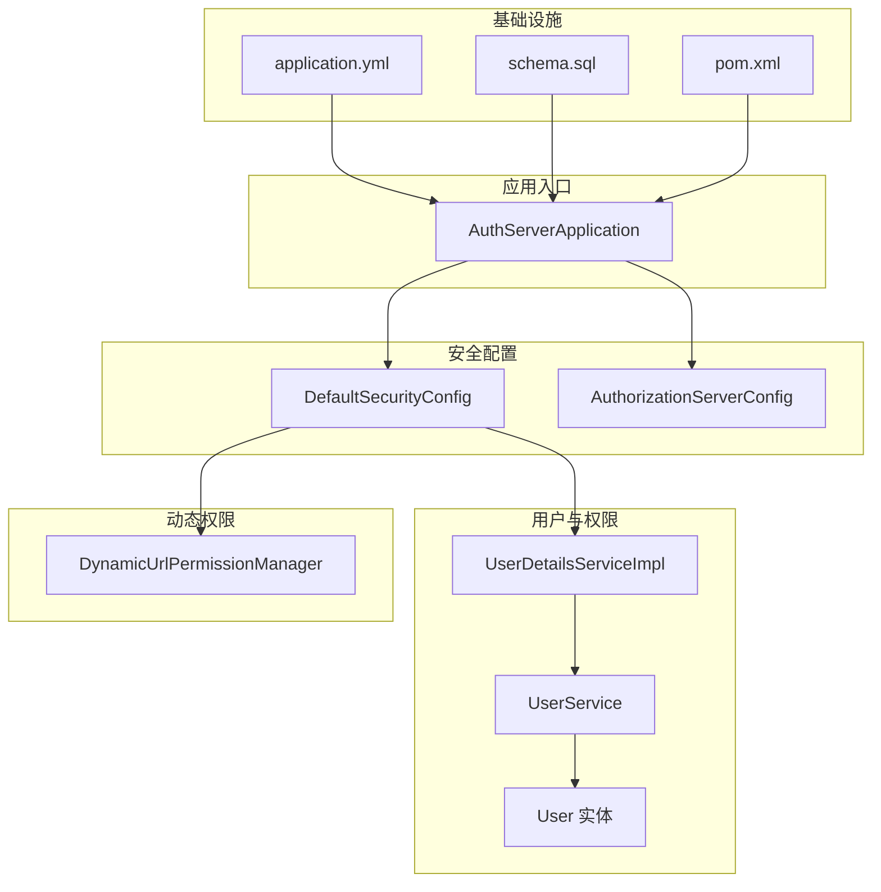
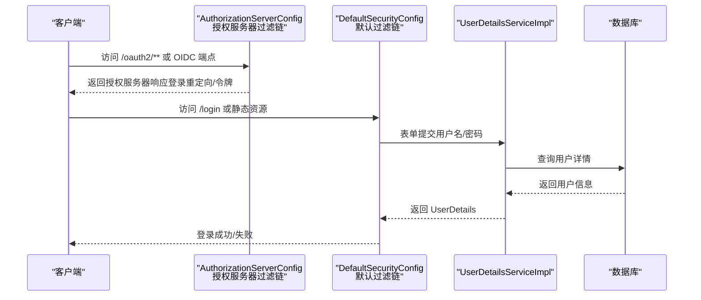
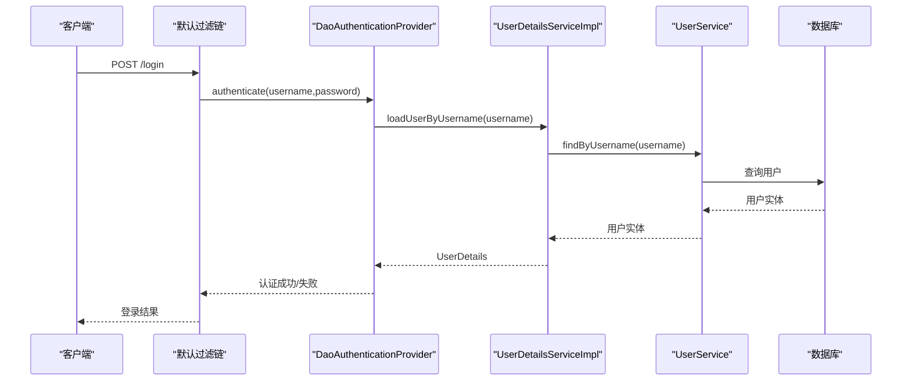
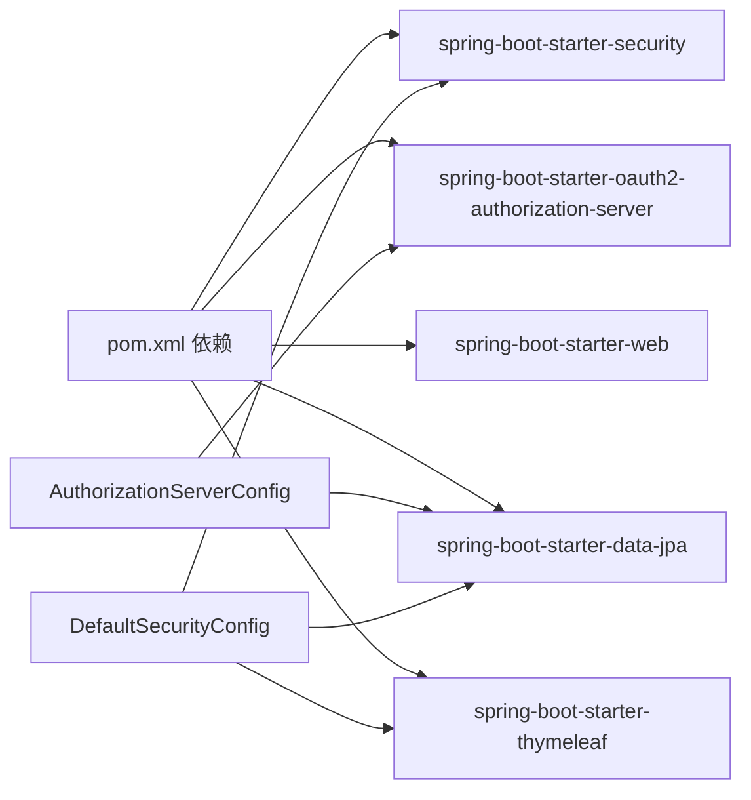

# 安全配置

<cite>
**本文引用的文件**
- [DefaultSecurityConfig.java](file://src/main/java/com/example/authserver/config/DefaultSecurityConfig.java)
- [AuthorizationServerConfig.java](file://src/main/java/com/example/authserver/config/AuthorizationServerConfig.java)
- [UserDetailsServiceImpl.java](file://src/main/java/com/example/authserver/service/UserDetailsServiceImpl.java)
- [DataInitializerConfig.java](file://src/main/java/com/example/authserver/config/DataInitializerConfig.java)
- [DynamicUrlPermissionManager.java](file://src/main/java/com/example/authserver/config/DynamicUrlPermissionManager.java)
- [UserService.java](file://src/main/java/com/example/authserver/service/UserService.java)
- [User.java](file://src/main/java/com/example/authserver/entity/User.java)
- [application.yml](file://src/main/resources/application.yml)
- [schema.sql](file://src/main/resources/schema.sql)
- [pom.xml](file://pom.xml)
- [AuthServerApplication.java](file://src/main/java/com/example/authserver/AuthServerApplication.java)
</cite>

## 目录
1. [简介](#简介)
2. [项目结构](#项目结构)
3. [核心组件](#核心组件)
4. [架构总览](#架构总览)
5. [详细组件分析](#详细组件分析)
6. [依赖分析](#依赖分析)
7. [性能考虑](#性能考虑)
8. [故障排查指南](#故障排查指南)
9. [结论](#结论)
10. [附录](#附录)

## 简介
本项目是一个基于 Spring Security 与 Spring Authorization Server 的 OAuth2 授权服务器，采用声明式安全配置与自定义用户细节服务实现认证与授权。本文档聚焦于 DefaultSecurityConfig 类的安全配置机制，涵盖：
- HTTP 安全配置与请求授权策略
- CSRF 与 CORS 的现状与建议
- 密码编码器选择与 BCrypt 使用
- 自定义 UserDetailsService 的集成与认证流程
- 安全过滤器链配置（含授权服务器优先级）
- 会话管理、并发控制与安全响应头
- 常见问题排查与安全最佳实践

## 项目结构
项目采用按功能域分层的组织方式，安全相关配置集中在 config 包，业务服务位于 service 包，数据库初始化脚本与配置位于 resources。

图表来源
- [AuthServerApplication.java:1-14](file://src/main/java/com/example/authserver/AuthServerApplication.java#L1-L14)
- [DefaultSecurityConfig.java:1-75](file://src/main/java/com/example/authserver/config/DefaultSecurityConfig.java#L1-L75)
- [AuthorizationServerConfig.java:1-256](file://src/main/java/com/example/authserver/config/AuthorizationServerConfig.java#L1-L256)
- [UserDetailsServiceImpl.java:1-59](file://src/main/java/com/example/authserver/service/UserDetailsServiceImpl.java#L1-L59)
- [UserService.java:1-265](file://src/main/java/com/example/authserver/service/UserService.java#L1-L265)
- [User.java:1-66](file://src/main/java/com/example/authserver/entity/User.java#L1-L66)
- [DynamicUrlPermissionManager.java:1-120](file://src/main/java/com/example/authserver/config/DynamicUrlPermissionManager.java#L1-L120)
- [application.yml:1-29](file://src/main/resources/application.yml#L1-L29)
- [schema.sql:1-169](file://src/main/resources/schema.sql#L1-L169)
- [pom.xml:1-147](file://pom.xml#L1-L147)

章节来源
- [AuthServerApplication.java:1-14](file://src/main/java/com/example/authserver/AuthServerApplication.java#L1-L14)
- [application.yml:1-29](file://src/main/resources/application.yml#L1-L29)
- [pom.xml:1-147](file://pom.xml#L1-L147)

## 核心组件
- DefaultSecurityConfig：定义常规 Web 安全过滤链、表单登录、登出、以及认证提供者与密码编码器。
- AuthorizationServerConfig：配置 OAuth2 授权服务器的安全过滤链、JWK、JWT 解码器、客户端初始化、授权服务与授权同意服务。
- UserDetailsServiceImpl：实现 UserDetailsService，从数据库加载用户详情并转换为 Spring Security 的 UserDetails。
- DataInitializerConfig：启动时初始化默认用户与角色，使用 PasswordEncoder 对密码进行编码。
- DynamicUrlPermissionManager：动态加载 URL 权限规则，支持 Ant 路径匹配与优先级排序，作为授权策略的一部分。
- UserService：封装用户与角色的业务操作，统一使用 PasswordEncoder 编码密码。
- User 实体：映射 users 表，包含用户名、密码（BCrypt）、启用状态与角色集合。

章节来源
- [DefaultSecurityConfig.java:1-75](file://src/main/java/com/example/authserver/config/DefaultSecurityConfig.java#L1-L75)
- [AuthorizationServerConfig.java:1-256](file://src/main/java/com/example/authserver/config/AuthorizationServerConfig.java#L1-L256)
- [UserDetailsServiceImpl.java:1-59](file://src/main/java/com/example/authserver/service/UserDetailsServiceImpl.java#L1-L59)
- [DataInitializerConfig.java:1-109](file://src/main/java/com/example/authserver/config/DataInitializerConfig.java#L1-L109)
- [DynamicUrlPermissionManager.java:1-120](file://src/main/java/com/example/authserver/config/DynamicUrlPermissionManager.java#L1-L120)
- [UserService.java:1-265](file://src/main/java/com/example/authserver/service/UserService.java#L1-L265)
- [User.java:1-66](file://src/main/java/com/example/authserver/entity/User.java#L1-L66)

## 架构总览
下图展示了两类安全过滤链的优先级与交互：授权服务器过滤链具有最高优先级，负责 OAuth2/OIDC 相关端点；默认过滤链处理常规 Web 请求与登录页。

图表来源
- [AuthorizationServerConfig.java:56-77](file://src/main/java/com/example/authserver/config/AuthorizationServerConfig.java#L56-L77)
- [DefaultSecurityConfig.java:55-73](file://src/main/java/com/example/authserver/config/DefaultSecurityConfig.java#L55-L73)
- [UserDetailsServiceImpl.java:29-57](file://src/main/java/com/example/authserver/service/UserDetailsServiceImpl.java#L29-L57)

## 详细组件分析

### DefaultSecurityConfig 安全配置机制
- 认证提供者
  - 使用 DaoAuthenticationProvider，注入自定义 UserDetailsService 与 PasswordEncoder。
  - 作用：将用户名/密码与数据库用户信息比对，完成认证。
- 密码编码器
  - 使用 DelegatingPasswordEncoder，内部包含多种编码器（含 BCrypt）。
  - 优点：兼容未来迁移与多编码器场景，推荐在生产中使用 BCrypt。
- 安全过滤链（默认）
  - 静态资源与公开端点放行（/css/**、/js/**、/images/**、/favicon.ico、/login、/oauth2/**、/error）。
  - 其余请求均需认证。
  - 表单登录：登录成功跳转至根路径。
  - 登出：登出成功返回登录页。
- CSRF 与 CORS
  - 未显式配置 CSRF 与 CORS。若为传统 Web 应用且存在表单提交，建议开启 CSRF 并按需配置 CORS。
- 会话管理、并发控制与安全头
  - 未显式配置会话策略、并发控制与安全响应头。建议结合业务场景启用相应策略以提升安全性。

章节来源
- [DefaultSecurityConfig.java:34-73](file://src/main/java/com/example/authserver/config/DefaultSecurityConfig.java#L34-L73)

### AuthorizationServerConfig 授权服务器安全拦截
- 过滤链优先级
  - 使用最高优先级，确保 OAuth2/OIDC 相关端点优先被授权服务器处理。
- 默认安全应用
  - 调用 OAuth2AuthorizationServerConfiguration.applyDefaultSecurity(http)，启用授权服务器默认安全策略。
- OIDC 支持
  - 启用 OIDC 1.0 支持。
- 异常处理
  - 对 HTML 文本请求，未认证访问授权端点时重定向到 /login。
- 资源服务器
  - 使用 JWT 作为资源访问令牌的解码器。
- 客户端初始化
  - 启动时初始化三类客户端（Web 应用、移动端、后端服务），使用 BCrypt 编码客户端密钥。
- 授权与授权同意服务
  - 使用 JDBC 实现授权状态与授权同意的持久化。
- JWK 与 JWT 解码器
  - 生成 RSA 密钥对并构建 JWK 源，配置 JWT 解码器。
- 授权服务器设置
  - 提供 AuthorizationServerSettings Bean。

章节来源
- [AuthorizationServerConfig.java:56-253](file://src/main/java/com/example/authserver/config/AuthorizationServerConfig.java#L56-L253)

### 自定义 UserDetailsService 集成与认证流程
- 加载用户详情
  - 根据用户名查询用户，不存在抛出 UsernameNotFoundException。
  - 将实体转换为 Spring Security 的 UserDetails，包含用户名、密码、启用状态、角色集合。
- 认证流程
  - 表单提交用户名/密码触发 DaoAuthenticationProvider。
  - Provider 调用 UserDetailsService.loadUserByUsername，校验密码。
  - 成功后生成认证主体并进入后续过滤链。

图表来源
- [DefaultSecurityConfig.java:34-41](file://src/main/java/com/example/authserver/config/DefaultSecurityConfig.java#L34-L41)
- [UserDetailsServiceImpl.java:29-57](file://src/main/java/com/example/authserver/service/UserDetailsServiceImpl.java#L29-L57)
- [UserService.java:40-42](file://src/main/java/com/example/authserver/service/UserService.java#L40-L42)

章节来源
- [UserDetailsServiceImpl.java:29-57](file://src/main/java/com/example/authserver/service/UserDetailsServiceImpl.java#L29-L57)
- [UserService.java:40-42](file://src/main/java/com/example/authserver/service/UserService.java#L40-L42)

### 密码编码器选择与 BCrypt 使用
- 密码编码器
  - DefaultSecurityConfig 中使用 DelegatingPasswordEncoder，内部包含 BCrypt。
  - DataInitializerConfig 与 UserService 在创建/更新用户时统一使用该编码器对明文密码进行编码。
- 客户端密钥编码
  - AuthorizationServerConfig 在初始化客户端密钥时，使用 "{bcrypt}" 前缀与编码后的密钥组合，确保密文存储。
- 盐值处理
  - DelegatingPasswordEncoder/BCrypt 内部自动生成并嵌入盐值，无需手动干预。

章节来源
- [DefaultSecurityConfig.java:46-49](file://src/main/java/com/example/authserver/config/DefaultSecurityConfig.java#L46-L49)
- [DataInitializerConfig.java:100-107](file://src/main/java/com/example/authserver/config/DataInitializerConfig.java#L100-L107)
- [UserService.java:79-103](file://src/main/java/com/example/authserver/service/UserService.java#L79-L103)
- [AuthorizationServerConfig.java:97-141](file://src/main/java/com/example/authserver/config/AuthorizationServerConfig.java#L97-L141)

### 动态 URL 权限管理
- 规则来源
  - 从数据库表 url_permissions 动态加载启用的权限规则。
- 匹配逻辑
  - 使用 AntPathMatcher 匹配 URL 模式与 HTTP 方法，按优先级排序后匹配。
- 缓存与热更新
  - 使用 ConcurrentHashMap 缓存规则，支持运行时 reload 与增删改。
- 与授权策略的关系
  - DefaultSecurityConfig 的 authorizeHttpRequests 将大部分请求交由动态权限管理器判定，形成“默认放行 + 动态判定”的授权策略。

章节来源
- [DynamicUrlPermissionManager.java:23-120](file://src/main/java/com/example/authserver/config/DynamicUrlPermissionManager.java#L23-L120)
- [schema.sql:42-56](file://src/main/resources/schema.sql#L42-L56)

### 数据初始化与数据库结构
- 初始化流程
  - DataInitializerConfig 在启动时修复角色描述并创建默认用户，使用 PasswordEncoder 编码密码。
- 数据库脚本
  - schema.sql 定义 users、roles、user_roles、url_permissions、oauth2_registered_client、oauth2_authorization、oauth2_authorization_consent 等表。
  - 默认角色与 URL 权限规则在首次执行时插入。
- 用户实体
  - User 实体映射 users 表，包含 id、username、password、enabled、createdAt、updatedAt 与角色集合。

章节来源
- [DataInitializerConfig.java:30-107](file://src/main/java/com/example/authserver/config/DataInitializerConfig.java#L30-L107)
- [schema.sql:8-169](file://src/main/resources/schema.sql#L8-L169)
- [User.java:20-66](file://src/main/java/com/example/authserver/entity/User.java#L20-L66)

## 依赖分析
- Spring Boot 与安全栈
  - spring-boot-starter-security、spring-boot-starter-oauth2-authorization-server、spring-boot-starter-web、spring-boot-starter-data-jpa、spring-boot-starter-thymeleaf。
- OAuth2 授权服务器
  - 使用 OAuth2AuthorizationServerConfiguration.applyDefaultSecurity 与内置 OIDC 支持。
- 数据持久化
  - JdbcOAuth2AuthorizationService 与 JdbcOAuth2AuthorizationConsentService 实现授权状态与授权同意的 JDBC 存储。
- 密码编码
  - DelegatingPasswordEncoder + BCrypt，客户端密钥与用户密码均采用 BCrypt 编码。

图表来源
- [pom.xml:29-114](file://pom.xml#L29-L114)
- [DefaultSecurityConfig.java:11-21](file://src/main/java/com/example/authserver/config/DefaultSecurityConfig.java#L11-L21)
- [AuthorizationServerConfig.java:3-36](file://src/main/java/com/example/authserver/config/AuthorizationServerConfig.java#L3-L36)

章节来源
- [pom.xml:1-147](file://pom.xml#L1-L147)

## 性能考虑
- 密码编码器
  - DelegatingPasswordEncoder + BCrypt 在认证时进行哈希计算，建议在高并发场景下：
    - 使用足够强的 BCrypt 轮数（可通过自定义 Bean 调整）。
    - 合理配置连接池与数据库性能。
- 动态权限缓存
  - DynamicUrlPermissionManager 使用并发 Map 缓存规则，避免频繁查询数据库；建议在规则变更时主动 reload。
- 过滤链优先级
  - 授权服务器过滤链优先级最高，减少不必要的匹配开销；常规过滤链仅处理非 OAuth2 路径。

[本节为通用指导，不直接分析具体文件]

## 故障排查指南
- 登录失败
  - 检查用户名是否存在与 enabled 状态。
  - 确认密码是否使用 BCrypt 编码存储。
  - 参考：[UserDetailsServiceImpl.java:31-57](file://src/main/java/com/example/authserver/service/UserDetailsServiceImpl.java#L31-L57)、[UserService.java:79-103](file://src/main/java/com/example/authserver/service/UserService.java#L79-L103)、[DataInitializerConfig.java:100-107](file://src/main/java/com/example/authserver/config/DataInitializerConfig.java#L100-L107)
- OAuth2 客户端无法获取令牌
  - 确认客户端密钥是否使用 "{bcrypt}" 前缀与正确编码。
  - 检查授权服务器过滤链是否生效与端点可达。
  - 参考：[AuthorizationServerConfig.java:97-141](file://src/main/java/com/example/authserver/config/AuthorizationServerConfig.java#L97-L141)、[AuthorizationServerConfig.java:56-77](file://src/main/java/com/example/authserver/config/AuthorizationServerConfig.java#L56-L77)
- URL 权限不生效
  - 检查 url_permissions 表中规则是否启用、优先级是否正确。
  - 确认 DynamicUrlPermissionManager 是否已加载并缓存。
  - 参考：[DynamicUrlPermissionManager.java:45-81](file://src/main/java/com/example/authserver/config/DynamicUrlPermissionManager.java#L45-L81)、[schema.sql:154-167](file://src/main/resources/schema.sql#L154-L167)
- 静态资源 403
  - 默认过滤链已放行静态资源与 /login、/oauth2/**、/error，检查请求路径与放行规则。
  - 参考：[DefaultSecurityConfig.java:58-70](file://src/main/java/com/example/authserver/config/DefaultSecurityConfig.java#L58-L70)
- 日志与调试
  - application.yml 中已开启 Spring Security 调试日志，便于定位问题。
  - 参考：[application.yml:26-29](file://src/main/resources/application.yml#L26-L29)

章节来源
- [UserDetailsServiceImpl.java:31-57](file://src/main/java/com/example/authserver/service/UserDetailsServiceImpl.java#L31-L57)
- [UserService.java:79-103](file://src/main/java/com/example/authserver/service/UserService.java#L79-L103)
- [DataInitializerConfig.java:100-107](file://src/main/java/com/example/authserver/config/DataInitializerConfig.java#L100-L107)
- [AuthorizationServerConfig.java:97-141](file://src/main/java/com/example/authserver/config/AuthorizationServerConfig.java#L97-L141)
- [AuthorizationServerConfig.java:56-77](file://src/main/java/com/example/authserver/config/AuthorizationServerConfig.java#L56-L77)
- [DynamicUrlPermissionManager.java:45-81](file://src/main/java/com/example/authserver/config/DynamicUrlPermissionManager.java#L45-L81)
- [schema.sql:154-167](file://src/main/resources/schema.sql#L154-L167)
- [application.yml:26-29](file://src/main/resources/application.yml#L26-L29)

## 结论
本项目通过声明式安全配置与自定义用户细节服务，实现了 OAuth2 授权服务器与常规 Web 应用的安全基线。DefaultSecurityConfig 提供了基础的请求授权与登录流程，AuthorizationServerConfig 则覆盖了授权服务器的核心安全能力。配合动态 URL 权限管理与 BCrypt 密码编码，系统具备良好的扩展性与安全性。建议在生产环境中补充 CSRF、CORS、会话与安全响应头配置，并持续优化动态权限的缓存与热更新策略。

[本节为总结性内容，不直接分析具体文件]

## 附录
- 安全最佳实践建议
  - CSRF：启用并配置 CSRF 令牌，防止跨站请求伪造。
  - CORS：按需配置允许的来源、方法与头，避免过度放行。
  - 会话管理：限制并发会话、设置会话超时与安全 Cookie 属性。
  - 安全响应头：启用 HSTS、X-Frame-Options、X-Content-Type-Options、Referrer-Policy 等。
  - 密码策略：强制最小长度、复杂度与定期轮换；使用强 BCrypt 轮数。
  - 授权策略：细化 URL 权限规则，启用优先级与审计日志。
  - 客户端密钥：严格保密，定期轮换，使用强随机密钥。

[本节为通用指导，不直接分析具体文件]