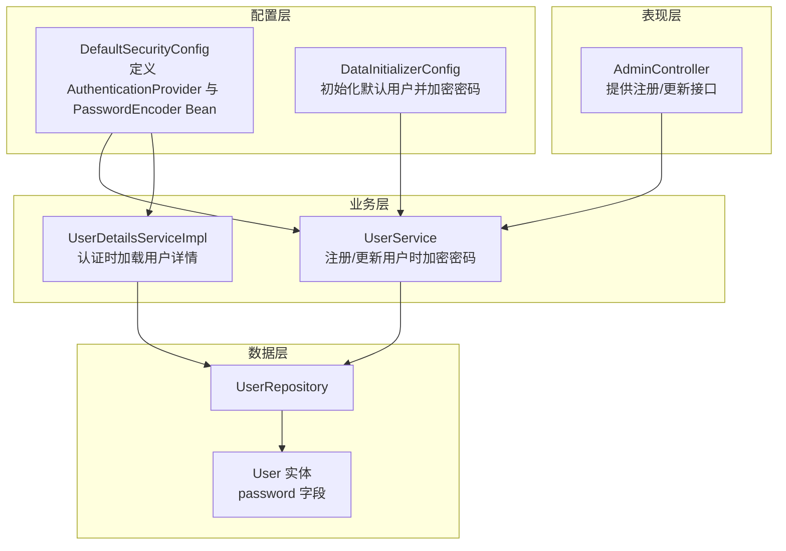
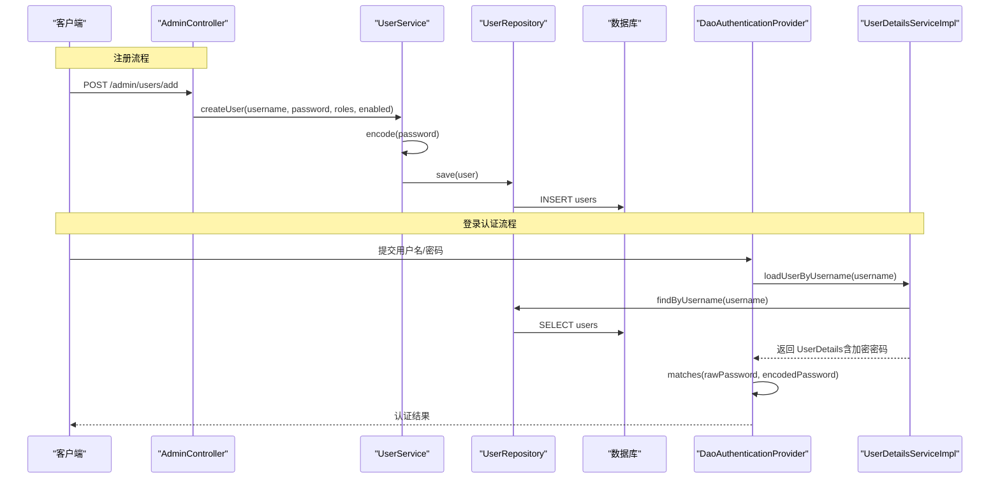
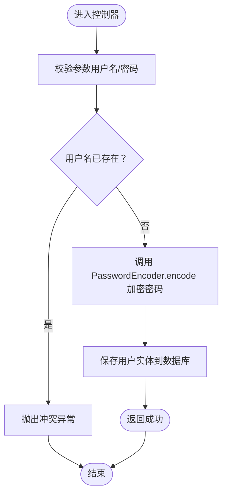
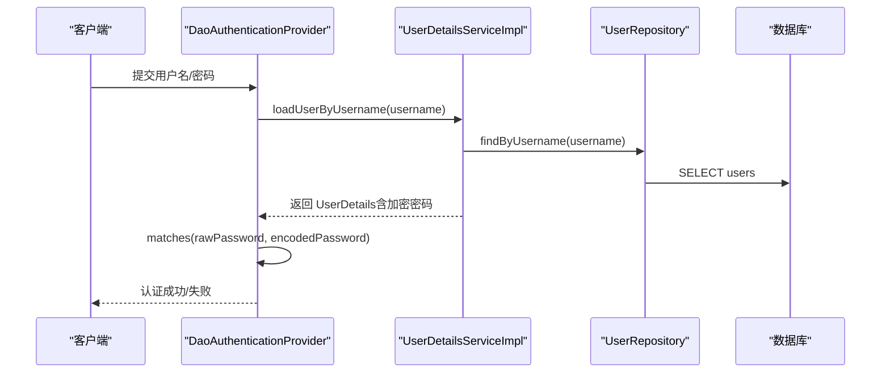
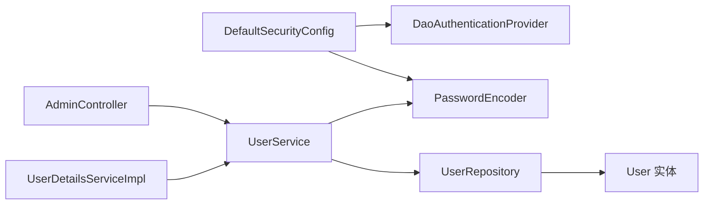

# 密码编码器配置

<cite>
**本文引用的文件**
- [DefaultSecurityConfig.java](file://src/main/java/com/example/authserver/config/DefaultSecurityConfig.java)
- [DataInitializerConfig.java](file://src/main/java/com/example/authserver/config/DataInitializerConfig.java)
- [UserDetailsServiceImpl.java](file://src/main/java/com/example/authserver/service/UserDetailsServiceImpl.java)
- [UserService.java](file://src/main/java/com/example/authserver/service/UserService.java)
- [UserRepository.java](file://src/main/java/com/example/authserver/repository/UserRepository.java)
- [User.java](file://src/main/java/com/example/authserver/entity/User.java)
- [AdminController.java](file://src/main/java/com/example/authserver/controller/AdminController.java)
- [application.yml](file://src/main/resources/application.yml)
- [schema.sql](file://src/main/resources/schema.sql)
</cite>

## 目录
1. [简介](#简介)
2. [项目结构](#项目结构)
3. [核心组件](#核心组件)
4. [架构总览](#架构总览)
5. [详细组件分析](#详细组件分析)
6. [依赖分析](#依赖分析)
7. [性能考虑](#性能考虑)
8. [故障排查指南](#故障排查指南)
9. [结论](#结论)
10. [附录](#附录)

## 简介
本文件围绕密码编码器的配置与实现展开，重点解释以下内容：
- 如何通过 PasswordEncoderFactories.createDelegatingPasswordEncoder() 创建委托型密码编码器；
- DelegatingPasswordEncoder 的工作机制、多种编码算法支持与自动选择策略；
- BCryptPasswordEncoder 的集成与配置要点（盐值生成与哈希过程）；
- 实际使用示例：用户注册时的密码加密与登录时的密码验证流程；
- 密码编码器在 DaoAuthenticationProvider 中的应用方式；
- 密码安全最佳实践与常见配置问题的解决方案。

## 项目结构
本项目采用基于注解的 Spring Boot 结构，安全配置集中在 config 包中，业务逻辑位于 service、repository、controller 层，数据库初始化脚本位于 resources 下。与密码编码器直接相关的关键位置如下：
- 安全配置：DefaultSecurityConfig.java（定义 AuthenticationProvider 与 PasswordEncoder Bean）
- 数据初始化：DataInitializerConfig.java（使用 PasswordEncoder 对初始用户进行加密）
- 用户服务：UserDetailsServiceImpl.java（认证时读取用户密码）
- 用户业务：UserService.java（注册/更新用户时调用 PasswordEncoder.encode）
- 用户实体：User.java（持久化字段包含 password）
- 控制器：AdminController.java（对外暴露注册/更新接口）

图表来源
- [DefaultSecurityConfig.java:34-49](file://src/main/java/com/example/authserver/config/DefaultSecurityConfig.java#L34-L49)
- [DataInitializerConfig.java:25-107](file://src/main/java/com/example/authserver/config/DataInitializerConfig.java#L25-L107)
- [UserDetailsServiceImpl.java:29-51](file://src/main/java/com/example/authserver/service/UserDetailsServiceImpl.java#L29-L51)
- [UserService.java:58-104](file://src/main/java/com/example/authserver/service/UserService.java#L58-L104)
- [UserRepository.java:16-43](file://src/main/java/com/example/authserver/repository/UserRepository.java#L16-L43)
- [User.java:24-34](file://src/main/java/com/example/authserver/entity/User.java#L24-L34)
- [AdminController.java:134-167](file://src/main/java/com/example/authserver/controller/AdminController.java#L134-L167)

章节来源
- [DefaultSecurityConfig.java:27-75](file://src/main/java/com/example/authserver/config/DefaultSecurityConfig.java#L27-L75)
- [DataInitializerConfig.java:20-109](file://src/main/java/com/example/authserver/config/DataInitializerConfig.java#L20-L109)
- [UserDetailsServiceImpl.java:15-59](file://src/main/java/com/example/authserver/service/UserDetailsServiceImpl.java#L15-L59)
- [UserService.java:18-265](file://src/main/java/com/example/authserver/service/UserService.java#L18-L265)
- [UserRepository.java:12-44](file://src/main/java/com/example/authserver/repository/UserRepository.java#L12-L44)
- [User.java:17-66](file://src/main/java/com/example/authserver/entity/User.java#L17-L66)
- [AdminController.java:19-282](file://src/main/java/com/example/authserver/controller/AdminController.java#L19-L282)

## 核心组件
- 委托型密码编码器（DelegatingPasswordEncoder）
  - 通过工厂方法创建，内部维护多种编码器映射，支持自动识别与升级。
  - 默认映射通常包含 bcrypt、pbkdf2、scrypt、argon2 等算法。
- BCryptPasswordEncoder（集成）
  - 作为默认或首选算法，具备高安全性与自适应成本因子。
  - 内部使用随机盐值与迭代次数，保证相同明文每次生成不同密文。
- DaoAuthenticationProvider（应用）
  - 在认证过程中使用注入的 PasswordEncoder 对比用户提交的明文与数据库中存储的密文。
- 用户服务（加密与验证）
  - 注册/更新用户时调用 PasswordEncoder.encode 存储密文；
  - 认证流程中由 UserDetailsServiceImpl 提供用户详情，DaoAuthenticationProvider 使用 PasswordEncoder.matches 进行验证。

章节来源
- [DefaultSecurityConfig.java:34-49](file://src/main/java/com/example/authserver/config/DefaultSecurityConfig.java#L34-L49)
- [UserService.java:58-104](file://src/main/java/com/example/authserver/service/UserService.java#L58-L104)
- [UserDetailsServiceImpl.java:29-51](file://src/main/java/com/example/authserver/service/UserDetailsServiceImpl.java#L29-L51)

## 架构总览
下图展示了密码编码器在认证流程中的关键交互：

图表来源
- [DefaultSecurityConfig.java:34-41](file://src/main/java/com/example/authserver/config/DefaultSecurityConfig.java#L34-L41)
- [UserDetailsServiceImpl.java:29-51](file://src/main/java/com/example/authserver/service/UserDetailsServiceImpl.java#L29-L51)
- [UserService.java:58-104](file://src/main/java/com/example/authserver/service/UserService.java#L58-L104)
- [UserRepository.java:16-43](file://src/main/java/com/example/authserver/repository/UserRepository.java#L16-L43)

## 详细组件分析

### DelegatingPasswordEncoder 的实现与使用
- 创建方式
  - 在 DefaultSecurityConfig 中通过工厂方法创建委托型编码器，并注入到 AuthenticationProvider。
- 自动选择策略
  - 编码后的密码值通常带有算法前缀（例如 {bcrypt}...），验证时根据前缀自动选择对应算法进行匹配。
  - 若需要迁移旧密码，可通过重新编码并更新数据库，实现平滑升级。
- 多算法支持
  - 默认映射通常包含 bcrypt、pbkdf2、scrypt、argon2 等，便于兼容历史数据与未来演进。

章节来源
- [DefaultSecurityConfig.java:34-49](file://src/main/java/com/example/authserver/config/DefaultSecurityConfig.java#L34-L49)

### BCryptPasswordEncoder 的集成与配置
- 集成方式
  - 通过 DelegatingPasswordEncoder 默认包含 BCryptPasswordEncoder，无需额外显式配置。
- 盐值生成与哈希过程
  - 每次编码都会生成新的随机盐值，结合迭代成本因子计算哈希，确保相同明文产生不同密文。
- 性能与安全性
  - BCrypt 成本因子可调，建议在目标硬件上评估吞吐量与延迟，平衡安全与性能。

章节来源
- [DefaultSecurityConfig.java:34-49](file://src/main/java/com/example/authserver/config/DefaultSecurityConfig.java#L34-L49)

### 用户注册时的密码加密流程
- 控制器接收用户名与明文密码；
- 调用 UserService.createUser，内部通过 PasswordEncoder.encode 对明文进行加密；
- 将加密后的密码写入 User 实体并持久化到数据库。

图表来源
- [AdminController.java:134-167](file://src/main/java/com/example/authserver/controller/AdminController.java#L134-L167)
- [UserService.java:58-104](file://src/main/java/com/example/authserver/service/UserService.java#L58-L104)
- [UserRepository.java:16-43](file://src/main/java/com/example/authserver/repository/UserRepository.java#L16-L43)

章节来源
- [AdminController.java:134-167](file://src/main/java/com/example/authserver/controller/AdminController.java#L134-L167)
- [UserService.java:58-104](file://src/main/java/com/example/authserver/service/UserService.java#L58-L104)
- [UserRepository.java:16-43](file://src/main/java/com/example/authserver/repository/UserRepository.java#L16-L43)

### 登录时的密码验证流程
- 客户端提交用户名/密码；
- DaoAuthenticationProvider 调用 UserDetailsService.loadUserByUsername 获取用户详情；
- 从 UserDetails 中取出加密后的密码；
- 使用 PasswordEncoder.matches 对比提交的明文与存储的密文；
- 验证通过后继续后续流程（如生成会话/令牌）。

图表来源
- [DefaultSecurityConfig.java:34-41](file://src/main/java/com/example/authserver/config/DefaultSecurityConfig.java#L34-L41)
- [UserDetailsServiceImpl.java:29-51](file://src/main/java/com/example/authserver/service/UserDetailsServiceImpl.java#L29-L51)
- [UserRepository.java:16-43](file://src/main/java/com/example/authserver/repository/UserRepository.java#L16-L43)

章节来源
- [DefaultSecurityConfig.java:34-41](file://src/main/java/com/example/authserver/config/DefaultSecurityConfig.java#L34-L41)
- [UserDetailsServiceImpl.java:29-51](file://src/main/java/com/example/authserver/service/UserDetailsServiceImpl.java#L29-L51)
- [UserRepository.java:16-43](file://src/main/java/com/example/authserver/repository/UserRepository.java#L16-L43)

### 密码编码器在 DaoAuthenticationProvider 中的应用
- AuthenticationProvider Bean 在 DefaultSecurityConfig 中定义；
- 设置 userDetailsService 与 passwordEncoder；
- 认证时由 Spring Security 调用 provider.authenticate，内部委托给 DaoAuthenticationProvider 完成对比。

章节来源
- [DefaultSecurityConfig.java:34-41](file://src/main/java/com/example/authserver/config/DefaultSecurityConfig.java#L34-L41)

### 数据库与实体设计对密码编码的影响
- users 表的 password 字段长度足够容纳各类编码器输出（如 bcrypt）；
- 初始化脚本插入默认角色与 URL 权限规则，不涉及密码加密逻辑；
- DataInitializerConfig 在启动时创建默认用户并使用 PasswordEncoder 加密。

章节来源
- [schema.sql:8-18](file://src/main/resources/schema.sql#L8-L18)
- [DataInitializerConfig.java:73-107](file://src/main/java/com/example/authserver/config/DataInitializerConfig.java#L73-L107)

## 依赖分析
- DefaultSecurityConfig 依赖 PasswordEncoder（由工厂创建），并将其注入 DaoAuthenticationProvider；
- UserService 依赖 PasswordEncoder，在注册/更新用户时进行加密；
- UserDetailsServiceImpl 依赖 UserService，加载用户详情供认证使用；
- AdminController 依赖 UserService，对外提供注册/更新接口；
- UserRepository 与 User 实体承载用户数据，其中 password 字段存储加密后的值。

图表来源
- [DefaultSecurityConfig.java:34-49](file://src/main/java/com/example/authserver/config/DefaultSecurityConfig.java#L34-L49)
- [UserService.java:26-28](file://src/main/java/com/example/authserver/service/UserService.java#L26-L28)
- [UserDetailsServiceImpl.java:24](file://src/main/java/com/example/authserver/service/UserDetailsServiceImpl.java#L24)
- [UserRepository.java:16-43](file://src/main/java/com/example/authserver/repository/UserRepository.java#L16-L43)
- [User.java:24-34](file://src/main/java/com/example/authserver/entity/User.java#L24-L34)
- [AdminController.java:134-167](file://src/main/java/com/example/authserver/controller/AdminController.java#L134-L167)

章节来源
- [DefaultSecurityConfig.java:34-49](file://src/main/java/com/example/authserver/config/DefaultSecurityConfig.java#L34-L49)
- [UserService.java:26-28](file://src/main/java/com/example/authserver/service/UserService.java#L26-L28)
- [UserDetailsServiceImpl.java:24](file://src/main/java/com/example/authserver/service/UserDetailsServiceImpl.java#L24)
- [UserRepository.java:16-43](file://src/main/java/com/example/authserver/repository/UserRepository.java#L16-L43)
- [User.java:24-34](file://src/main/java/com/example/authserver/entity/User.java#L24-L34)
- [AdminController.java:134-167](file://src/main/java/com/example/authserver/controller/AdminController.java#L134-L167)

## 性能考虑
- BCrypt 成本因子（log rounds）影响 CPU 时间与内存消耗，应根据服务器性能进行评估与调整；
- DelegatingPasswordEncoder 在验证时需要解析前缀并选择算法，建议统一使用一种算法以减少分支判断；
- 大规模用户注册/登录时，注意数据库连接池与事务管理，避免阻塞；
- 日志级别建议在生产环境适度降低，避免大量密码相关日志带来的性能与安全风险。

## 故障排查指南
- 密码无法匹配
  - 确认数据库中存储的是经过 PasswordEncoder.encode 的密文；
  - 检查 DelegatingPasswordEncoder 是否正确识别算法前缀；
  - 避免手动修改 password 字段导致格式不一致。
- 初始化用户失败
  - DataInitializerConfig 会在启动时使用 PasswordEncoder 加密默认用户，若失败检查数据库连接与 schema.sql 是否正确执行；
  - 确认角色表已初始化，否则初始化默认用户会报错。
- 登录异常
  - 检查 UserDetailsServiceImpl 是否正确加载用户并返回包含加密密码的 UserDetails；
  - 确认 DaoAuthenticationProvider 已注入正确的 PasswordEncoder。
- 配置问题
  - application.yml 中的数据库连接与方言配置需与 schema.sql 一致；
  - 若使用其他数据库，请同步调整 schema.sql 与方言配置。

章节来源
- [DataInitializerConfig.java:73-107](file://src/main/java/com/example/authserver/config/DataInitializerConfig.java#L73-L107)
- [UserDetailsServiceImpl.java:29-51](file://src/main/java/com/example/authserver/service/UserDetailsServiceImpl.java#L29-L51)
- [DefaultSecurityConfig.java:34-49](file://src/main/java/com/example/authserver/config/DefaultSecurityConfig.java#L34-L49)
- [application.yml:4-30](file://src/main/resources/application.yml#L4-L30)
- [schema.sql:8-18](file://src/main/resources/schema.sql#L8-L18)

## 结论
本项目通过 DelegatingPasswordEncoder 统一管理多种密码编码算法，推荐使用 BCrypt 作为默认算法，结合 DaoAuthenticationProvider 实现安全高效的认证流程。在用户注册与登录场景中，密码均通过 PasswordEncoder 进行加密与验证，确保数据一致性与安全性。建议在生产环境中合理设置成本因子、优化日志与数据库配置，并建立完善的初始化与迁移策略以应对历史数据与未来演进。

## 附录
- 密码安全最佳实践
  - 使用强随机盐值与足够高的成本因子；
  - 统一使用一种算法并定期评估升级；
  - 避免在日志中打印明文或密文；
  - 对数据库连接与敏感字段进行最小权限控制；
  - 建立密码重置与审计机制。
- 常见配置问题
  - 数据库方言与字符集不一致导致初始化失败；
  - schema.sql 未执行导致角色缺失；
  - 密码字段长度不足导致 bcrypt 输出被截断；
  - 多种算法混用导致验证失败。