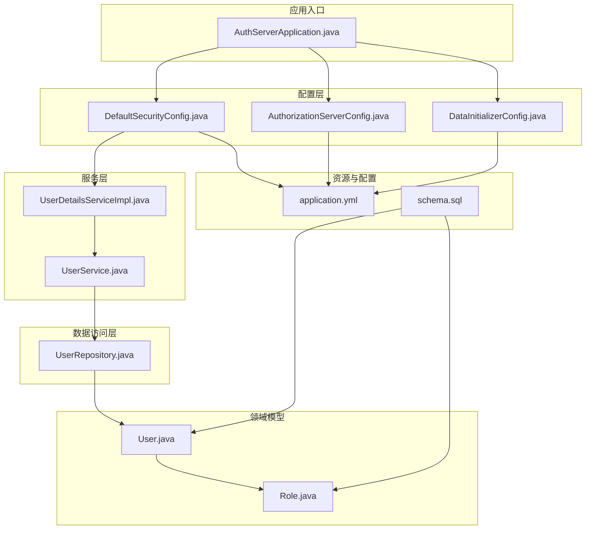
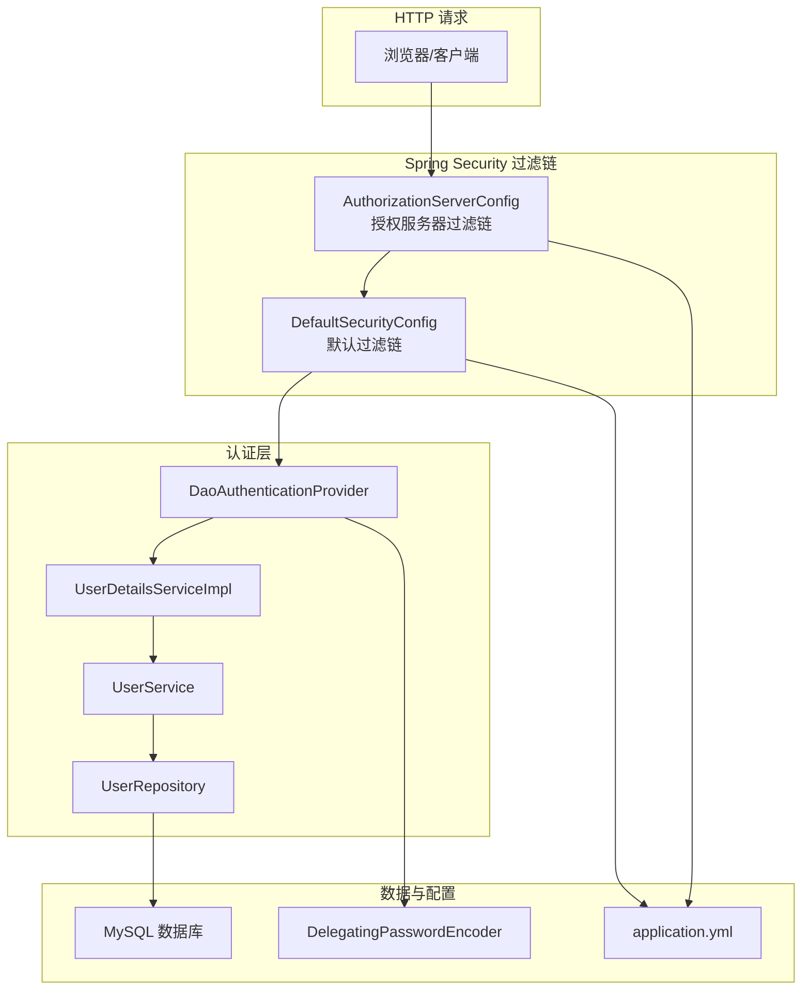
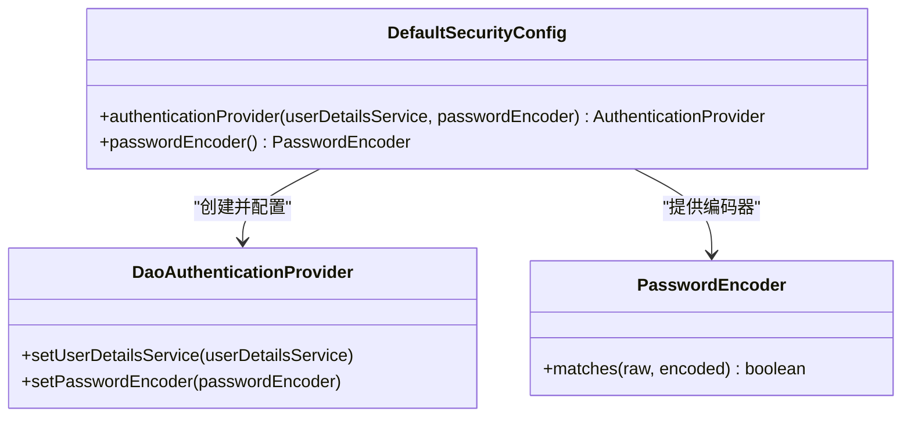
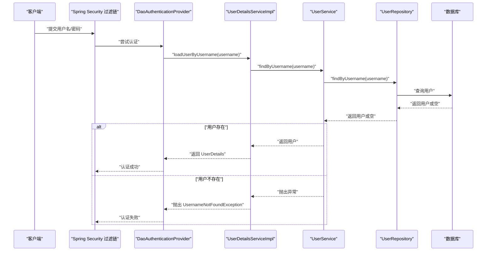
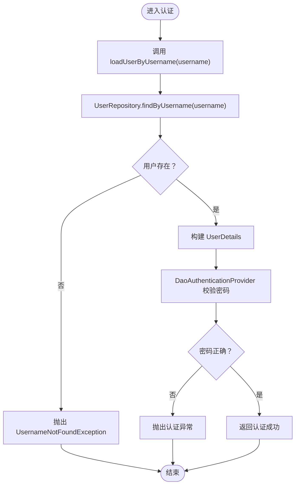
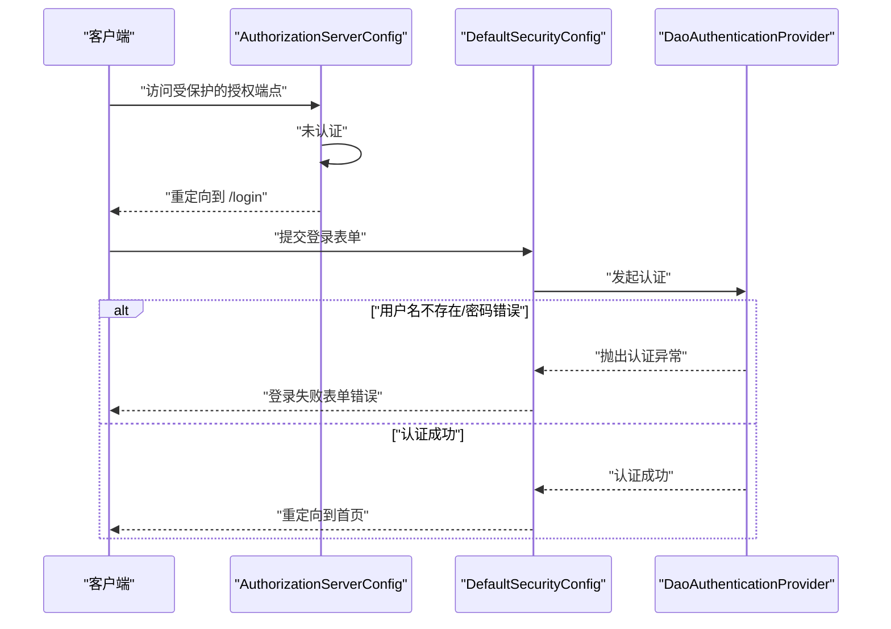
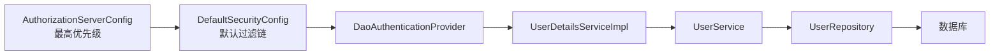
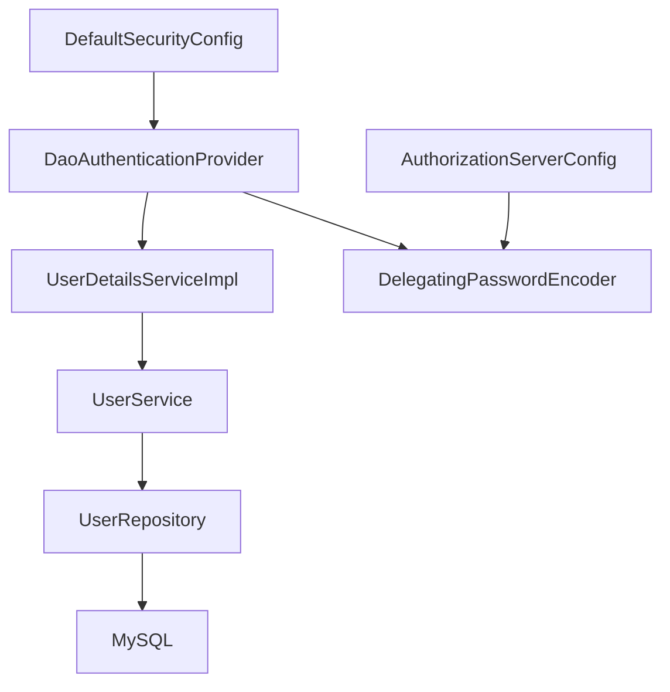
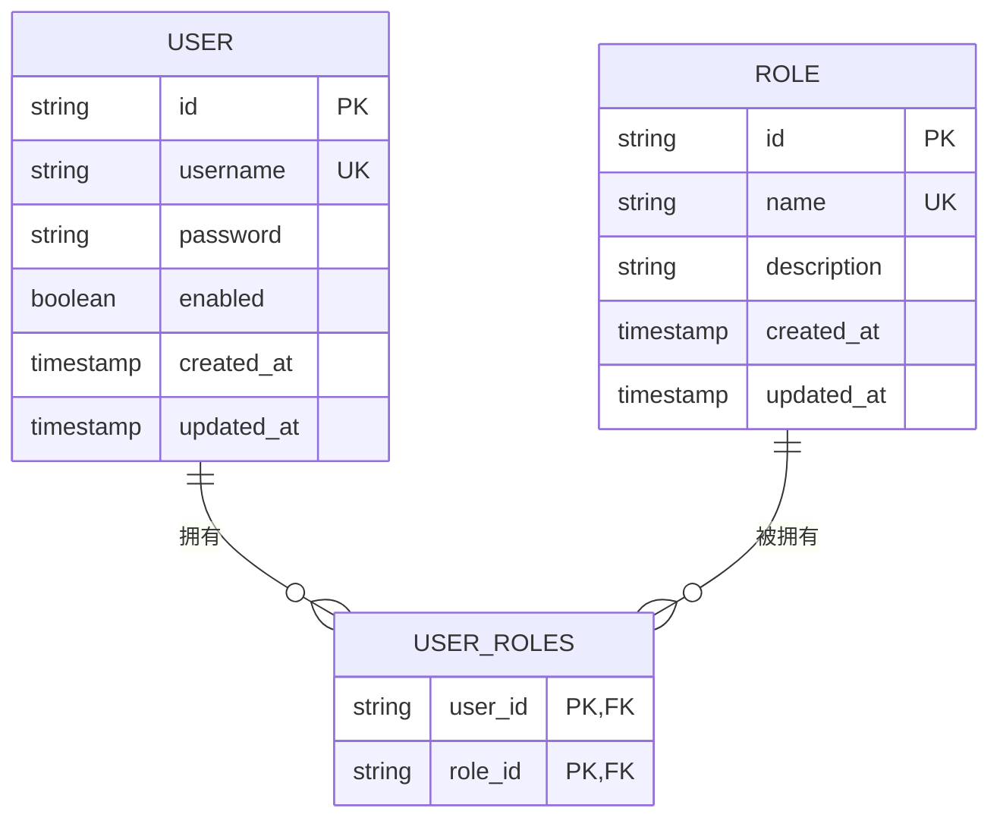

# 认证提供者配置

<cite>
**本文引用的文件**
- [AuthServerApplication.java](file://src/main/java/com/example/authserver/AuthServerApplication.java)
- [DefaultSecurityConfig.java](file://src/main/java/com/example/authserver/config/DefaultSecurityConfig.java)
- [AuthorizationServerConfig.java](file://src/main/java/com/example/authserver/config/AuthorizationServerConfig.java)
- [DataInitializerConfig.java](file://src/main/java/com/example/authserver/config/DataInitializerConfig.java)
- [UserDetailsServiceImpl.java](file://src/main/java/com/example/authserver/service/UserDetailsServiceImpl.java)
- [UserService.java](file://src/main/java/com/example/authserver/service/UserService.java)
- [UserRepository.java](file://src/main/java/com/example/authserver/repository/UserRepository.java)
- [User.java](file://src/main/java/com/example/authserver/entity/User.java)
- [Role.java](file://src/main/java/com/example/authserver/entity/Role.java)
- [application.yml](file://src/main/resources/application.yml)
- [schema.sql](file://src/main/resources/schema.sql)
- [pom.xml](file://pom.xml)
</cite>

## 目录
1. [简介](#简介)
2. [项目结构](#项目结构)
3. [核心组件](#核心组件)
4. [架构总览](#架构总览)
5. [详细组件分析](#详细组件分析)
6. [依赖关系分析](#依赖关系分析)
7. [性能考虑](#性能考虑)
8. [故障排查指南](#故障排查指南)
9. [结论](#结论)
10. [附录](#附录)

## 简介
本文件面向“认证提供者配置”的实现与使用，重点围绕以下目标展开：
- 深入解释 DaoAuthenticationProvider 的配置与初始化流程
- 说明 UserDetailsServiceImpl 与认证提供者的集成机制（注入与使用）
- 阐述认证流程：用户名查找、密码验证、认证结果返回
- 提供认证异常处理配置说明（用户不存在、密码错误等）
- 明确认证提供者在 Spring Security 过滤链中的作用与执行时机
- 给出认证性能优化建议与安全配置最佳实践

本项目采用 Spring Boot + Spring Security + Spring Security OAuth2 Authorization Server 架构，结合 JPA 数据持久化与 DelegatingPasswordEncoder 密码编码策略，构建了完整的认证与授权基础设施。

## 项目结构
项目采用按功能域划分的层次化组织方式：
- config：安全配置与初始化配置（默认安全、授权服务器、数据初始化）
- service：业务服务层（用户详情服务、用户服务、角色服务等）
- repository：数据访问层（JPA Repository）
- entity：领域模型（用户、角色、URL 权限等）
- resources：应用配置与数据库初始化脚本
- pom.xml：Maven 依赖与构建配置

图表来源
- [AuthServerApplication.java:1-14](file://src/main/java/com/example/authserver/AuthServerApplication.java#L1-L14)
- [DefaultSecurityConfig.java:1-75](file://src/main/java/com/example/authserver/config/DefaultSecurityConfig.java#L1-L75)
- [AuthorizationServerConfig.java:1-256](file://src/main/java/com/example/authserver/config/AuthorizationServerConfig.java#L1-L256)
- [DataInitializerConfig.java:1-109](file://src/main/java/com/example/authserver/config/DataInitializerConfig.java#L1-L109)
- [UserDetailsServiceImpl.java:1-59](file://src/main/java/com/example/authserver/service/UserDetailsServiceImpl.java#L1-L59)
- [UserService.java:1-265](file://src/main/java/com/example/authserver/service/UserService.java#L1-L265)
- [UserRepository.java:1-44](file://src/main/java/com/example/authserver/repository/UserRepository.java#L1-L44)
- [User.java:1-66](file://src/main/java/com/example/authserver/entity/User.java#L1-L66)
- [Role.java:1-62](file://src/main/java/com/example/authserver/entity/Role.java#L1-L62)
- [application.yml:1-30](file://src/main/resources/application.yml#L1-L30)
- [schema.sql:1-194](file://src/main/resources/schema.sql#L1-L194)

章节来源
- [AuthServerApplication.java:1-14](file://src/main/java/com/example/authserver/AuthServerApplication.java#L1-L14)
- [DefaultSecurityConfig.java:1-75](file://src/main/java/com/example/authserver/config/DefaultSecurityConfig.java#L1-L75)
- [AuthorizationServerConfig.java:1-256](file://src/main/java/com/example/authserver/config/AuthorizationServerConfig.java#L1-L256)
- [DataInitializerConfig.java:1-109](file://src/main/java/com/example/authserver/config/DataInitializerConfig.java#L1-L109)
- [application.yml:1-30](file://src/main/resources/application.yml#L1-L30)
- [schema.sql:1-194](file://src/main/resources/schema.sql#L1-L194)

## 核心组件
- DaoAuthenticationProvider：基于数据库的认证提供者，负责用户名查找与密码校验
- UserDetailsServiceImpl：实现 UserDetailsService，从数据库加载用户详情并转换为 Spring Security 的 UserDetails
- UserService：封装用户查询与角色映射逻辑，供用户详情服务调用
- UserRepository：JPA 数据访问接口，提供按用户名查询、存在性检查等能力
- DefaultSecurityConfig：定义认证提供者 Bean、密码编码器以及默认过滤链
- AuthorizationServerConfig：配置授权服务器过滤链、异常处理与 JWT 解码器
- DataInitializerConfig：应用启动后初始化默认用户与角色
- application.yml：数据源、JPA、日志等运行时配置
- schema.sql：数据库初始化脚本，包含用户、角色、URL 权限、OAuth2 客户端等表结构与默认数据

章节来源
- [DefaultSecurityConfig.java:34-49](file://src/main/java/com/example/authserver/config/DefaultSecurityConfig.java#L34-L49)
- [UserDetailsServiceImpl.java:22-57](file://src/main/java/com/example/authserver/service/UserDetailsServiceImpl.java#L22-L57)
- [UserService.java:40-42](file://src/main/java/com/example/authserver/service/UserService.java#L40-L42)
- [UserRepository.java:16-21](file://src/main/java/com/example/authserver/repository/UserRepository.java#L16-L21)
- [AuthorizationServerConfig.java:56-76](file://src/main/java/com/example/authserver/config/AuthorizationServerConfig.java#L56-L76)
- [DataInitializerConfig.java:30-95](file://src/main/java/com/example/authserver/config/DataInitializerConfig.java#L30-L95)
- [application.yml:1-30](file://src/main/resources/application.yml#L1-L30)
- [schema.sql:8-194](file://src/main/resources/schema.sql#L8-L194)

## 架构总览
下图展示了认证提供者在整体安全架构中的位置与交互关系，包括过滤链顺序、认证提供者与用户详情服务的协作，以及授权服务器过滤链的异常处理。

图表来源
- [AuthorizationServerConfig.java:56-76](file://src/main/java/com/example/authserver/config/AuthorizationServerConfig.java#L56-L76)
- [DefaultSecurityConfig.java:55-73](file://src/main/java/com/example/authserver/config/DefaultSecurityConfig.java#L55-L73)
- [DefaultSecurityConfig.java:34-49](file://src/main/java/com/example/authserver/config/DefaultSecurityConfig.java#L34-L49)
- [UserDetailsServiceImpl.java:22-57](file://src/main/java/com/example/authserver/service/UserDetailsServiceImpl.java#L22-L57)
- [UserService.java:40-42](file://src/main/java/com/example/authserver/service/UserService.java#L40-L42)
- [UserRepository.java:16-21](file://src/main/java/com/example/authserver/repository/UserRepository.java#L16-L21)
- [application.yml:1-30](file://src/main/resources/application.yml#L1-L30)

## 详细组件分析

### DaoAuthenticationProvider 配置与初始化
- Bean 定义：在默认安全配置中，通过工厂方法创建 DaoAuthenticationProvider，并注入用户详情服务与密码编码器。
- 关键点：
  - setUserDetailsService：绑定用户详情服务，用于加载用户详情
  - setPasswordEncoder：绑定密码编码器，用于密码校验
- 密码编码器：使用 DelegatingPasswordEncoder，支持多种算法并可升级迁移

图表来源
- [DefaultSecurityConfig.java:34-49](file://src/main/java/com/example/authserver/config/DefaultSecurityConfig.java#L34-L49)

章节来源
- [DefaultSecurityConfig.java:34-49](file://src/main/java/com/example/authserver/config/DefaultSecurityConfig.java#L34-L49)

### UserDetailsServiceImpl 与认证提供者的集成
- 实现 UserDetailsService 接口，覆盖 loadUserByUsername 方法
- 事务性读取：使用只读事务保证并发安全
- 用户查找：委托 UserService.findByUsername 完成用户名查询
- 异常处理：当用户不存在时抛出 UsernameNotFoundException
- 身份转换：将实体转换为 Spring Security 的 UserDetails，包含用户名、密码、启用状态与角色集合
- 错误兜底：捕获内部异常并包装为 UsernameNotFoundException 抛出

图表来源
- [UserDetailsServiceImpl.java:29-57](file://src/main/java/com/example/authserver/service/UserDetailsServiceImpl.java#L29-L57)
- [UserService.java:40-42](file://src/main/java/com/example/authserver/service/UserService.java#L40-L42)
- [UserRepository.java:16-21](file://src/main/java/com/example/authserver/repository/UserRepository.java#L16-L21)

章节来源
- [UserDetailsServiceImpl.java:22-57](file://src/main/java/com/example/authserver/service/UserDetailsServiceImpl.java#L22-L57)
- [UserService.java:40-42](file://src/main/java/com/example/authserver/service/UserService.java#L40-L42)
- [UserRepository.java:16-21](file://src/main/java/com/example/authserver/repository/UserRepository.java#L16-L21)

### 认证流程实现（用户名查找、密码验证、结果返回）
- 用户名查找：UserRepository.findByUsername(username) 返回 Optional<User>
- 用户存在性判断：若为空，抛出 UsernameNotFoundException
- 密码验证：DaoAuthenticationProvider 内部使用 PasswordEncoder.matches 对比输入密码与数据库存储的密码
- 结果返回：认证成功返回 UserDetails；失败抛出异常交由过滤链处理

图表来源
- [UserDetailsServiceImpl.java:31-51](file://src/main/java/com/example/authserver/service/UserDetailsServiceImpl.java#L31-L51)
- [DefaultSecurityConfig.java:37-40](file://src/main/java/com/example/authserver/config/DefaultSecurityConfig.java#L37-L40)

章节来源
- [UserDetailsServiceImpl.java:31-51](file://src/main/java/com/example/authserver/service/UserDetailsServiceImpl.java#L31-L51)
- [DefaultSecurityConfig.java:37-40](file://src/main/java/com/example/authserver/config/DefaultSecurityConfig.java#L37-L40)

### 认证异常处理配置
- 用户不存在：UserDetailsServiceImpl 抛出 UsernameNotFoundException
- 密码错误：DaoAuthenticationProvider 内部校验失败触发认证异常
- 授权服务器异常处理：AuthorizationServerConfig 配置未认证访问授权端点时重定向到登录页
- 默认过滤链异常处理：默认安全配置未显式配置异常处理，通常由全局异常处理或 Spring Security 默认行为接管

图表来源
- [AuthorizationServerConfig.java:66-71](file://src/main/java/com/example/authserver/config/AuthorizationServerConfig.java#L66-L71)
- [DefaultSecurityConfig.java:66-70](file://src/main/java/com/example/authserver/config/DefaultSecurityConfig.java#L66-L70)

章节来源
- [AuthorizationServerConfig.java:66-71](file://src/main/java/com/example/authserver/config/AuthorizationServerConfig.java#L66-L71)
- [DefaultSecurityConfig.java:66-70](file://src/main/java/com/example/authserver/config/DefaultSecurityConfig.java#L66-L70)

### 认证提供者在 Spring Security 过滤链中的作用与执行时机
- 过滤链顺序：
  - 授权服务器过滤链（最高优先级）：处理 OAuth2 授权端点与 OIDC 相关请求，未认证访问时重定向到登录页
  - 默认过滤链（较低优先级）：处理常规 Web 请求，允许静态资源与登录、OAuth2、错误端点访问，其余请求均需认证
- 执行时机：当请求进入默认过滤链且需要认证时，DaoAuthenticationProvider 介入进行用户名查找与密码校验

图表来源
- [AuthorizationServerConfig.java:56-76](file://src/main/java/com/example/authserver/config/AuthorizationServerConfig.java#L56-L76)
- [DefaultSecurityConfig.java:55-73](file://src/main/java/com/example/authserver/config/DefaultSecurityConfig.java#L55-L73)

章节来源
- [AuthorizationServerConfig.java:56-76](file://src/main/java/com/example/authserver/config/AuthorizationServerConfig.java#L56-L76)
- [DefaultSecurityConfig.java:55-73](file://src/main/java/com/example/authserver/config/DefaultSecurityConfig.java#L55-L73)

## 依赖关系分析
- 组件耦合与内聚：
  - UserDaoServiceImpl 与 UserService 高内聚，职责清晰
  - DaoAuthenticationProvider 与 UserDetailsServiceImpl 低耦合，通过接口解耦
  - DefaultSecurityConfig 作为装配中心，集中管理认证提供者与密码编码器
- 外部依赖：
  - Spring Security（认证与授权）、Spring Security OAuth2 Authorization Server（授权服务器）
  - Spring Data JPA（数据访问）、MySQL（持久化）
  - Thymeleaf（模板渲染）

图表来源
- [DefaultSecurityConfig.java:34-49](file://src/main/java/com/example/authserver/config/DefaultSecurityConfig.java#L34-L49)
- [UserDetailsServiceImpl.java:22-57](file://src/main/java/com/example/authserver/service/UserDetailsServiceImpl.java#L22-L57)
- [UserService.java:26-28](file://src/main/java/com/example/authserver/service/UserService.java#L26-L28)
- [UserRepository.java:16-21](file://src/main/java/com/example/authserver/repository/UserRepository.java#L16-L21)
- [AuthorizationServerConfig.java:47-51](file://src/main/java/com/example/authserver/config/AuthorizationServerConfig.java#L47-L51)

章节来源
- [DefaultSecurityConfig.java:34-49](file://src/main/java/com/example/authserver/config/DefaultSecurityConfig.java#L34-L49)
- [UserDetailsServiceImpl.java:22-57](file://src/main/java/com/example/authserver/service/UserDetailsServiceImpl.java#L22-L57)
- [UserService.java:26-28](file://src/main/java/com/example/authserver/service/UserService.java#L26-L28)
- [UserRepository.java:16-21](file://src/main/java/com/example/authserver/repository/UserRepository.java#L16-L21)
- [AuthorizationServerConfig.java:47-51](file://src/main/java/com/example/authserver/config/AuthorizationServerConfig.java#L47-L51)

## 性能考虑
- 用户详情加载：
  - 使用只读事务减少锁竞争
  - 角色加载采用 EAGER，避免 N+1 查询；如需优化可改为 LAZY 并配合 @Transactional(readOnly = true) 的批量抓取策略
- 密码编码器：
  - DelegatingPasswordEncoder 支持算法升级，建议在迁移期间保留兼容算法
- 数据库层面：
  - 用户名建立唯一索引，提升查询效率
  - 合理使用索引覆盖常见查询（如按用户名查询）
- 过滤链顺序：
  - 将授权服务器过滤链置于更高优先级，避免不必要的认证尝试
- 缓存建议（可选）：
  - 对热点用户详情进行缓存（注意失效策略与一致性）

## 故障排查指南
- 用户名不存在：
  - 现象：认证失败并抛出 UsernameNotFoundException
  - 排查：确认用户名大小写、特殊字符；检查数据库中是否存在该用户
- 密码错误：
  - 现象：认证失败
  - 排查：确认密码编码器一致；检查数据库中存储的密码是否为 BCrypt 编码
- 登录重定向问题：
  - 现象：访问受保护端点被重定向到登录页
  - 排查：检查 AuthorizationServerConfig 的异常处理配置；确认默认过滤链的 permitAll 配置
- 数据初始化失败：
  - 现象：默认用户未创建
  - 排查：确认 schema.sql 已执行；检查 DataInitializerConfig 的初始化逻辑与角色存在性

章节来源
- [UserDetailsServiceImpl.java:34-56](file://src/main/java/com/example/authserver/service/UserDetailsServiceImpl.java#L34-L56)
- [AuthorizationServerConfig.java:66-71](file://src/main/java/com/example/authserver/config/AuthorizationServerConfig.java#L66-L71)
- [DataInitializerConfig.java:73-95](file://src/main/java/com/example/authserver/config/DataInitializerConfig.java#L73-L95)

## 结论
本项目通过 DaoAuthenticationProvider 与 UserDetailsServiceImpl 的协同，实现了基于数据库的认证流程。DefaultSecurityConfig 负责装配认证提供者与密码编码器，AuthorizationServerConfig 负责授权服务器过滤链与异常处理。结合 schema.sql 的初始化脚本与 DataInitializerConfig 的默认数据填充，形成了完整的认证与授权基础设施。建议在生产环境中进一步强化缓存策略、监控与审计能力，并持续优化角色与权限模型以满足业务演进需求。

## 附录
- 数据模型概览（用户、角色、URL 权限、OAuth2 客户端）

图表来源
- [schema.sql:8-40](file://src/main/resources/schema.sql#L8-L40)
- [User.java:23-50](file://src/main/java/com/example/authserver/entity/User.java#L23-L50)
- [Role.java:23-46](file://src/main/java/com/example/authserver/entity/Role.java#L23-L46)