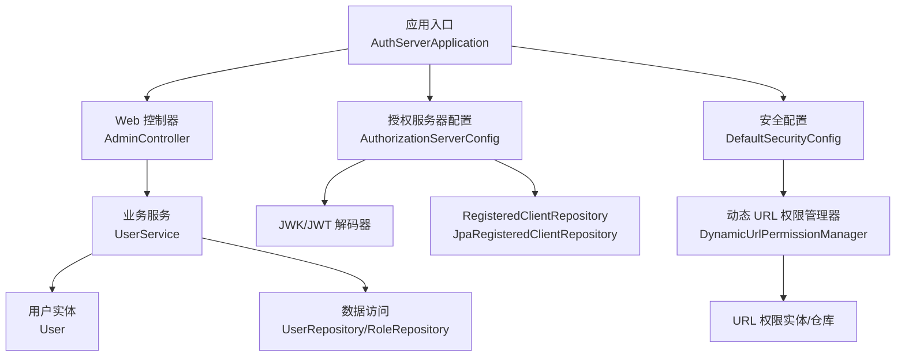
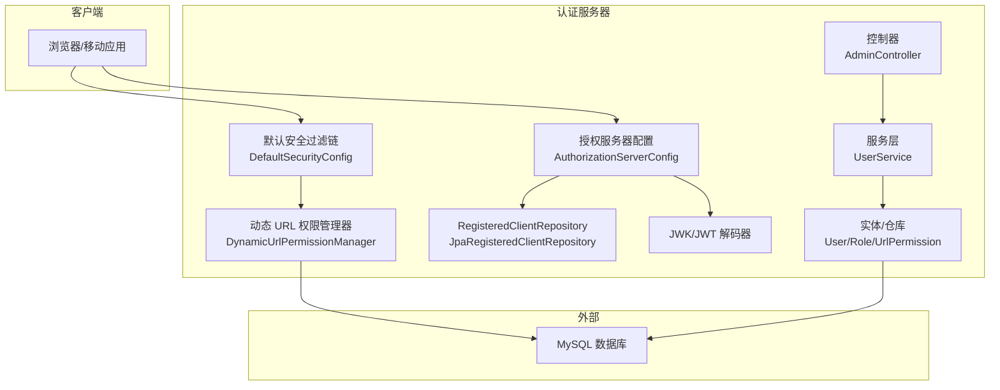
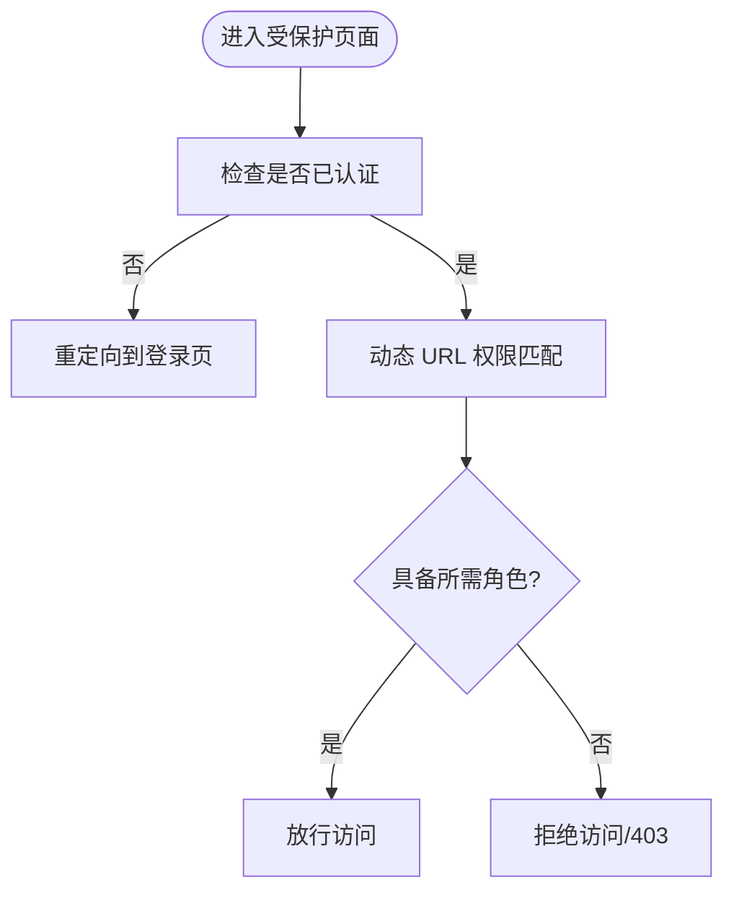
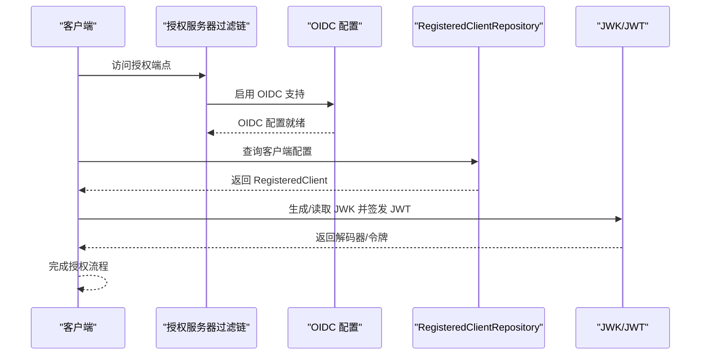
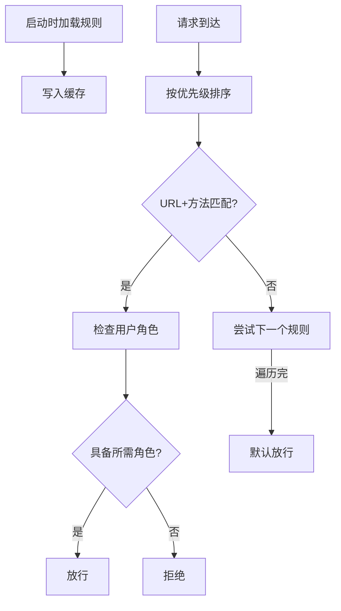
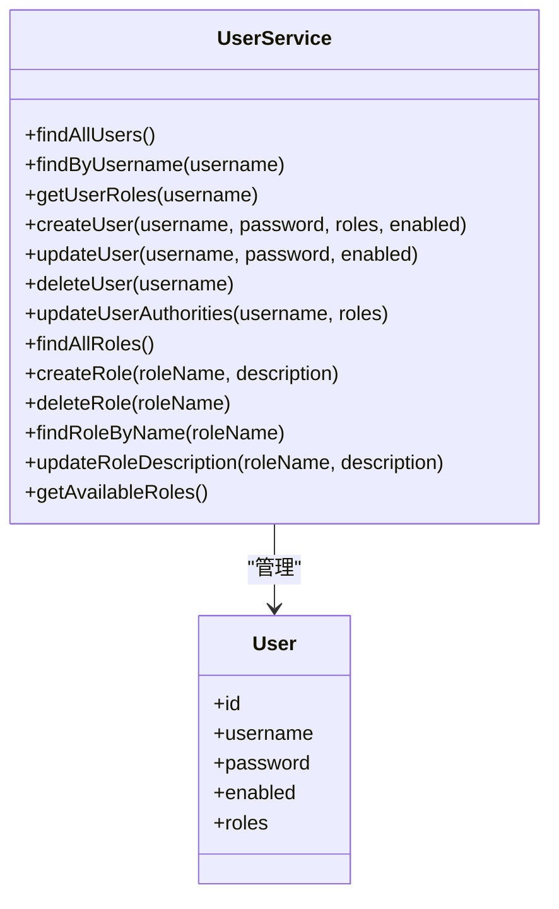
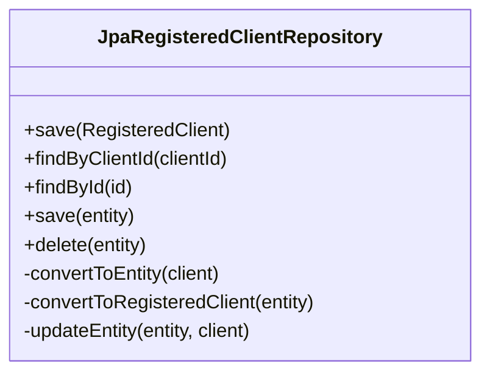
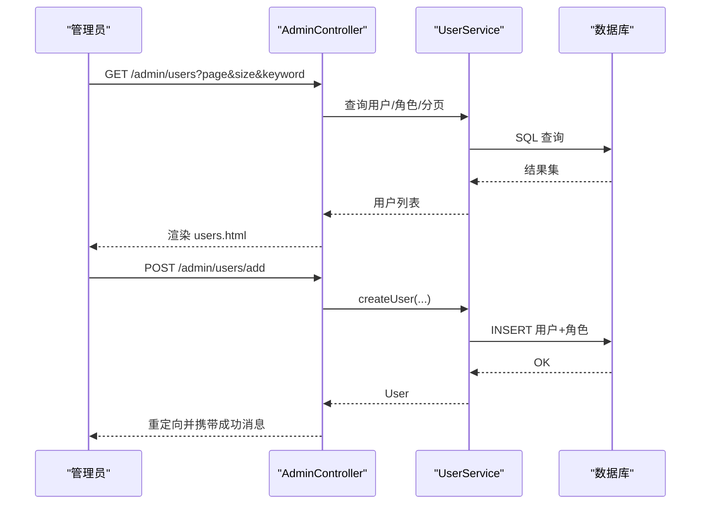
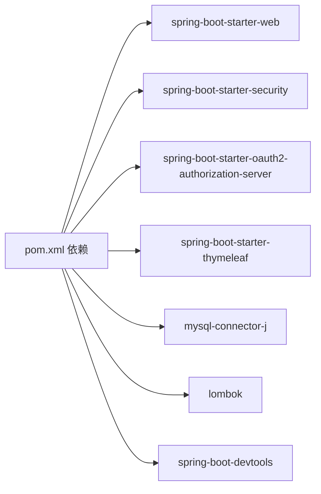

# 开发指南

<cite>
**本文引用的文件**
- [pom.xml](file://pom.xml)
- [application.yml](file://src/main/resources/application.yml)
- [AuthServerApplication.java](file://src/main/java/com/example/authserver/AuthServerApplication.java)
- [DefaultSecurityConfig.java](file://src/main/java/com/example/authserver/config/DefaultSecurityConfig.java)
- [AuthorizationServerConfig.java](file://src/main/java/com/example/authserver/config/AuthorizationServerConfig.java)
- [DynamicUrlPermissionManager.java](file://src/main/java/com/example/authserver/config/DynamicUrlPermissionManager.java)
- [UserDetailsServiceImpl.java](file://src/main/java/com/example/authserver/service/UserDetailsServiceImpl.java)
- [JpaRegisteredClientRepository.java](file://src/main/java/com/example/authserver/repository/JpaRegisteredClientRepository.java)
- [AdminController.java](file://src/main/java/com/example/authserver/controller/AdminController.java)
- [UserService.java](file://src/main/java/com/example/authserver/service/UserService.java)
- [User.java](file://src/main/java/com/example/authserver/entity/User.java)
- [DataInitializerConfig.java](file://src/main/java/com/example/authserver/config/DataInitializerConfig.java)
- [schema.sql](file://src/main/resources/schema.sql)
- [users.html](file://src/main/resources/templates/admin/users.html)
- [index.html](file://src/main/resources/templates/index.html)
</cite>

## 目录
1. [简介](#简介)
2. [项目结构](#项目结构)
3. [核心组件](#核心组件)
4. [架构总览](#架构总览)
5. [详细组件分析](#详细组件分析)
6. [依赖分析](#依赖分析)
7. [性能考虑](#性能考虑)
8. [故障排查指南](#故障排查指南)
9. [结论](#结论)
10. [附录](#附录)

## 简介
本开发指南面向希望参与认证服务器项目开发与扩展的工程师，覆盖开发环境搭建、IDE与调试配置、热部署、代码结构与规范、测试策略、贡献流程以及扩展实践（新增OAuth2客户端类型、自定义权限管理器等）。项目基于 Spring Boot 3 与 Spring Security OAuth2 Authorization Server，采用 MySQL 数据库存储、Thymeleaf 模板渲染与 Lombok 简化代码。

## 项目结构
项目采用按层次与职责划分的目录组织方式：
- config：安全与授权服务器配置
- controller：Web 控制器（Thymeleaf 页面与管理接口）
- service：业务服务层（用户、角色、URL 权限、客户端等）
- repository：数据访问层（JPA）
- entity：JPA 实体
- resources：配置文件、SQL 初始化脚本、模板页面
- pom.xml：Maven 构建与依赖管理

图表来源
- [AuthServerApplication.java:1-14](file://src/main/java/com/example/authserver/AuthServerApplication.java#L1-L14)
- [DefaultSecurityConfig.java:1-75](file://src/main/java/com/example/authserver/config/DefaultSecurityConfig.java#L1-L75)
- [AuthorizationServerConfig.java:1-256](file://src/main/java/com/example/authserver/config/AuthorizationServerConfig.java#L1-L256)
- [DynamicUrlPermissionManager.java:1-120](file://src/main/java/com/example/authserver/config/DynamicUrlPermissionManager.java#L1-L120)
- [JpaRegisteredClientRepository.java:1-289](file://src/main/java/com/example/authserver/repository/JpaRegisteredClientRepository.java#L1-L289)
- [AdminController.java:1-282](file://src/main/java/com/example/authserver/controller/AdminController.java#L1-L282)
- [UserService.java:1-265](file://src/main/java/com/example/authserver/service/UserService.java#L1-L265)
- [User.java:1-66](file://src/main/java/com/example/authserver/entity/User.java#L1-L66)

章节来源
- [AuthServerApplication.java:1-14](file://src/main/java/com/example/authserver/AuthServerApplication.java#L1-L14)
- [pom.xml:1-147](file://pom.xml#L1-L147)
- [application.yml:1-30](file://src/main/resources/application.yml#L1-L30)

## 核心组件
- 应用入口与启动：应用以 Spring Boot 启动类作为入口，自动装配各配置与组件。
- 安全与认证：DefaultSecurityConfig 配置表单登录、密码编码器与通用过滤链；UserDetailsServiceImpl 实现用户详情加载。
- 授权服务器：AuthorizationServerConfig 配置 OAuth2 Authorization Server、JWK/JWT、RegisteredClientRepository、授权与授权同意服务、默认客户端初始化。
- 动态权限：DynamicUrlPermissionManager 从数据库加载 URL 权限规则，支持 AntPathMatcher 匹配与优先级排序。
- 数据初始化：DataInitializerConfig 与 schema.sql 初始化角色、URL 权限与默认用户。
- 管理界面：AdminController 提供用户管理、角色管理、客户端管理等页面与接口；Thymeleaf 模板渲染。

章节来源
- [DefaultSecurityConfig.java:1-75](file://src/main/java/com/example/authserver/config/DefaultSecurityConfig.java#L1-L75)
- [AuthorizationServerConfig.java:1-256](file://src/main/java/com/example/authserver/config/AuthorizationServerConfig.java#L1-L256)
- [DynamicUrlPermissionManager.java:1-120](file://src/main/java/com/example/authserver/config/DynamicUrlPermissionManager.java#L1-L120)
- [DataInitializerConfig.java:1-109](file://src/main/java/com/example/authserver/config/DataInitializerConfig.java#L1-L109)
- [schema.sql:1-169](file://src/main/resources/schema.sql#L1-L169)
- [AdminController.java:1-282](file://src/main/java/com/example/authserver/controller/AdminController.java#L1-L282)

## 架构总览
下图展示认证服务器的关键交互：浏览器访问受控页面触发动态权限校验；登录流程由默认安全过滤链处理；授权服务器配置负责 OAuth2/OIDC 相关端点与令牌签发；JPA 与数据库负责持久化。

图表来源
- [DefaultSecurityConfig.java:55-73](file://src/main/java/com/example/authserver/config/DefaultSecurityConfig.java#L55-L73)
- [DynamicUrlPermissionManager.java:64-81](file://src/main/java/com/example/authserver/config/DynamicUrlPermissionManager.java#L64-L81)
- [AuthorizationServerConfig.java:56-77](file://src/main/java/com/example/authserver/config/AuthorizationServerConfig.java#L56-L77)
- [JpaRegisteredClientRepository.java:21-51](file://src/main/java/com/example/authserver/repository/JpaRegisteredClientRepository.java#L21-L51)
- [AdminController.java:24-26](file://src/main/java/com/example/authserver/controller/AdminController.java#L24-L26)
- [UserService.java:24-35](file://src/main/java/com/example/authserver/service/UserService.java#L24-L35)
- [User.java:20-50](file://src/main/java/com/example/authserver/entity/User.java#L20-L50)
- [schema.sql:8-81](file://src/main/resources/schema.sql#L8-L81)

## 详细组件分析

### 安全与认证配置
- 认证提供者：DaoAuthenticationProvider + PasswordEncoder，从数据库加载用户详情。
- 默认过滤链：开放静态资源与登录/OAuth2/错误端点，其余请求均需认证。
- 登录成功与登出：重定向至首页与登录页。

图表来源
- [DefaultSecurityConfig.java:55-73](file://src/main/java/com/example/authserver/config/DefaultSecurityConfig.java#L55-L73)
- [DynamicUrlPermissionManager.java:64-81](file://src/main/java/com/example/authserver/config/DynamicUrlPermissionManager.java#L64-L81)

章节来源
- [DefaultSecurityConfig.java:1-75](file://src/main/java/com/example/authserver/config/DefaultSecurityConfig.java#L1-L75)
- [UserDetailsServiceImpl.java:1-59](file://src/main/java/com/example/authserver/service/UserDetailsServiceImpl.java#L1-L59)

### 授权服务器配置
- OAuth2/OIDC 默认安全：应用默认配置并启用 OIDC。
- 异常处理：未认证访问授权端点重定向登录。
- 资源服务器：JWT 验证。
- 默认客户端初始化：Web 应用（授权码+PKCE）、移动端（PKCE）、后端服务（客户端凭证）三类。
- JWK/JWT：生成 RSA 密钥对并注入 JWK 源与解码器。
- 授权与授权同意：JDBC 实现授权状态与授权同意持久化。

图表来源
- [AuthorizationServerConfig.java:56-77](file://src/main/java/com/example/authserver/config/AuthorizationServerConfig.java#L56-L77)
- [AuthorizationServerConfig.java:91-161](file://src/main/java/com/example/authserver/config/AuthorizationServerConfig.java#L91-L161)
- [AuthorizationServerConfig.java:211-245](file://src/main/java/com/example/authserver/config/AuthorizationServerConfig.java#L211-L245)
- [JpaRegisteredClientRepository.java:21-51](file://src/main/java/com/example/authserver/repository/JpaRegisteredClientRepository.java#L21-L51)

章节来源
- [AuthorizationServerConfig.java:1-256](file://src/main/java/com/example/authserver/config/AuthorizationServerConfig.java#L1-L256)
- [JpaRegisteredClientRepository.java:1-289](file://src/main/java/com/example/authserver/repository/JpaRegisteredClientRepository.java#L1-L289)

### 动态 URL 权限管理器
- 初始化与缓存：启动时加载启用的 URL 权限规则，使用并发映射缓存。
- 匹配逻辑：AntPathMatcher 支持通配符，HTTP 方法支持“*”，按优先级排序匹配。
- 运行时维护：支持添加/移除/重载权限规则。

图表来源
- [DynamicUrlPermissionManager.java:36-54](file://src/main/java/com/example/authserver/config/DynamicUrlPermissionManager.java#L36-L54)
- [DynamicUrlPermissionManager.java:64-95](file://src/main/java/com/example/authserver/config/DynamicUrlPermissionManager.java#L64-L95)

章节来源
- [DynamicUrlPermissionManager.java:1-120](file://src/main/java/com/example/authserver/config/DynamicUrlPermissionManager.java#L1-L120)

### 用户与角色管理服务
- 用户 CRUD：创建、更新、删除、查询、角色分配与更新。
- 角色管理：创建、删除、更新描述、查询可用角色。
- 参数校验与异常：用户名/密码长度、角色存在性、资源冲突/不存在异常。
- 事务边界：所有变更操作在事务内执行。

图表来源
- [UserService.java:24-265](file://src/main/java/com/example/authserver/service/UserService.java#L24-L265)
- [User.java:20-66](file://src/main/java/com/example/authserver/entity/User.java#L20-L66)

章节来源
- [UserService.java:1-265](file://src/main/java/com/example/authserver/service/UserService.java#L1-L265)
- [User.java:1-66](file://src/main/java/com/example/authserver/entity/User.java#L1-L66)

### OAuth2 客户端仓库（JPA）
- RegisteredClient 与实体双向转换：时间类型转换、集合字段序列化/反序列化。
- 保存策略：统一使用 merge，ID 为 UUID。
- 查询与删除：按 ID/ClientId 查询，删除时确保实体托管。

图表来源
- [JpaRegisteredClientRepository.java:21-289](file://src/main/java/com/example/authserver/repository/JpaRegisteredClientRepository.java#L21-L289)

章节来源
- [JpaRegisteredClientRepository.java:1-289](file://src/main/java/com/example/authserver/repository/JpaRegisteredClientRepository.java#L1-L289)

### 管理后台控制器
- 用户管理：分页、搜索、新增/更新/删除、权限分配。
- AJAX 校验：用户名存在性检查。
- Flash 属性：使用 RedirectAttributes 传递成功/错误消息。

图表来源
- [AdminController.java:44-117](file://src/main/java/com/example/authserver/controller/AdminController.java#L44-L117)
- [AdminController.java:134-167](file://src/main/java/com/example/authserver/controller/AdminController.java#L134-L167)
- [UserService.java:58-104](file://src/main/java/com/example/authserver/service/UserService.java#L58-L104)

章节来源
- [AdminController.java:1-282](file://src/main/java/com/example/authserver/controller/AdminController.java#L1-L282)
- [UserService.java:1-265](file://src/main/java/com/example/authserver/service/UserService.java#L1-L265)

### 数据初始化与数据库脚本
- DataInitializerConfig：启动后修复角色描述并初始化默认用户。
- schema.sql：创建 users、roles、user_roles、url_permissions、oauth2_* 等表并插入默认数据。

章节来源
- [DataInitializerConfig.java:1-109](file://src/main/java/com/example/authserver/config/DataInitializerConfig.java#L1-L109)
- [schema.sql:1-169](file://src/main/resources/schema.sql#L1-L169)

## 依赖分析
- 运行时依赖：Spring Boot Starter Web、Security、OAuth2 Authorization Server、Thymeleaf、MySQL Connector、Lombok、DevTools。
- 构建插件：spring-boot-maven-plugin、maven-compiler-plugin（Java 17）。
- 配置项：数据库连接、SQL 初始化、JPA 方言、Thymeleaf 关闭缓存、日志级别。

图表来源
- [pom.xml:29-114](file://pom.xml#L29-L114)

章节来源
- [pom.xml:1-147](file://pom.xml#L1-L147)
- [application.yml:1-30](file://src/main/resources/application.yml#L1-L30)

## 性能考虑
- 动态权限缓存：使用并发映射缓存 URL 权限规则，减少数据库访问。
- AntPathMatcher：支持通配符匹配，建议合理设计规则以降低匹配成本。
- JPA 与 SQL：DDL 自动更新与 SQL 初始化便于开发，生产环境建议关闭自动更新并使用迁移工具。
- 日志级别：安全相关日志适度开启，避免过度输出影响性能。
- 前端模板：Thymeleaf 关闭缓存便于开发调试，生产环境建议开启缓存。

## 故障排查指南
- 登录失败/权限不足
  - 检查默认安全过滤链是否正确配置表单登录与重定向。
  - 确认用户角色是否包含所需角色，动态权限规则优先级是否正确。
- OAuth2 客户端异常
  - 核对 RegisteredClient 配置（授权类型、重定向 URI、PKCE 等）。
  - 检查 JWK/JWT 配置与密钥生成。
- 数据初始化问题
  - 确认 schema.sql 已执行且角色/URL 权限初始化成功。
  - 启动日志中查看 DataInitializerConfig 的初始化输出。
- 数据库连接
  - 检查 application.yml 中的数据库 URL、用户名、密码与驱动。
- 前端页面
  - Thymeleaf 模板路径与片段是否正确，静态资源路径是否匹配。

章节来源
- [DefaultSecurityConfig.java:55-73](file://src/main/java/com/example/authserver/config/DefaultSecurityConfig.java#L55-L73)
- [DynamicUrlPermissionManager.java:64-81](file://src/main/java/com/example/authserver/config/DynamicUrlPermissionManager.java#L64-L81)
- [AuthorizationServerConfig.java:211-245](file://src/main/java/com/example/authserver/config/AuthorizationServerConfig.java#L211-L245)
- [DataInitializerConfig.java:30-40](file://src/main/java/com/example/authserver/config/DataInitializerConfig.java#L30-L40)
- [application.yml:4-24](file://src/main/resources/application.yml#L4-L24)

## 结论
本指南从环境搭建、代码结构、核心组件、依赖关系、性能与故障排查等方面，系统阐述了认证服务器的开发与扩展要点。建议在开发过程中遵循现有包结构与命名约定，结合动态权限与 OAuth2 配置进行扩展，同时重视测试与日志，确保系统的安全性与稳定性。

## 附录

### 开发环境搭建与 IDE/调试/热部署
- JDK 与构建
  - 使用 Java 17，Maven 构建。
  - DevTools 已引入，支持开发时自动重启。
- 数据库
  - 使用 MySQL，配置在 application.yml 中；首次启动自动执行 schema.sql。
- IDE 建议
  - 使用支持 Lombok 的 IDE 并启用注解处理。
  - 启用 DevTools 的自动重启，便于快速迭代。
- 调试建议
  - 设置断点于控制器、服务层与配置类，观察请求流转与权限判定。
  - 关注日志输出，定位初始化与权限匹配问题。

章节来源
- [pom.xml:86-92](file://pom.xml#L86-L92)
- [application.yml:1-30](file://src/main/resources/application.yml#L1-L30)

### 代码结构与开发规范
- 包命名与职责
  - config：安全与授权服务器配置
  - controller：Web 控制器
  - service：业务服务
  - repository：数据访问
  - entity：JPA 实体
  - resources：配置、SQL、模板
- 注释与日志
  - 使用 SLF4J 日志，关键流程与异常处记录日志。
  - 类与方法保持清晰注释，说明用途与边界条件。
- Lombok 使用
  - 使用 @Slf4j、@RequiredArgsConstructor 简化日志与构造注入。

章节来源
- [DefaultSecurityConfig.java:1-75](file://src/main/java/com/example/authserver/config/DefaultSecurityConfig.java#L1-L75)
- [AuthorizationServerConfig.java:1-256](file://src/main/java/com/example/authserver/config/AuthorizationServerConfig.java#L1-L256)
- [DynamicUrlPermissionManager.java:1-120](file://src/main/java/com/example/authserver/config/DynamicUrlPermissionManager.java#L1-L120)
- [UserService.java:1-265](file://src/main/java/com/example/authserver/service/UserService.java#L1-L265)
- [User.java:1-66](file://src/main/java/com/example/authserver/entity/User.java#L1-L66)

### 单元测试与集成测试指南
- 测试框架
  - 使用 Spring Boot Starter Test 与 Spring Security Test。
- Mock 策略
  - 使用 @MockBean 替换 Repository/Service，隔离数据库依赖。
  - 使用 @TestConfiguration 定义最小化测试上下文。
- 测试覆盖
  - 重点覆盖：用户/角色 CRUD、权限校验、OAuth2 客户端初始化、异常场景。
- 集成测试
  - 使用 @SpringBootTest + @AutoConfigureTestDatabase，配合 schema.sql 初始化测试数据。
  - 使用 TestRestTemplate 或 WebTestClient 调用受保护端点，验证权限与登录流程。

章节来源
- [pom.xml:101-113](file://pom.xml#L101-L113)
- [schema.sql:144-169](file://src/main/resources/schema.sql#L144-L169)

### 代码贡献流程
- 分支管理
  - 主分支：release/稳定版本
  - 开发分支：develop
  - 功能分支：feature/xxx
  - 修复分支：fix/xxx
- 提交规范
  - 类型：feat/fix/docs/chore/refactor/test
  - 示例：feat(auth): 添加动态权限缓存优化
- 代码审查
  - 提交 Pull Request，至少一名 reviewer 通过。
  - 关注：安全性、性能、可维护性与测试覆盖。

### 扩展开发最佳实践
- 新增 OAuth2 客户端类型
  - 在 AuthorizationServerConfig 中扩展默认客户端初始化逻辑，或新增自定义 RegisteredClientRepository Bean。
  - 注意授权类型、重定向 URI、PKCE 与令牌有效期设置。
- 自定义权限管理器
  - 基于 DynamicUrlPermissionManager 模式，实现规则加载、匹配与缓存。
  - 通过 @PostConstruct 初始化，提供 reload/add/remove 接口。
- 前端页面与模板
  - 模板位于 templates 目录，注意静态资源路径与 CSRF 保护。
  - 使用 RedirectAttributes 传递 Flash 消息，提升用户体验。

章节来源
- [AuthorizationServerConfig.java:91-161](file://src/main/java/com/example/authserver/config/AuthorizationServerConfig.java#L91-L161)
- [DynamicUrlPermissionManager.java:36-54](file://src/main/java/com/example/authserver/config/DynamicUrlPermissionManager.java#L36-L54)
- [users.html:376-538](file://src/main/resources/templates/admin/users.html#L376-L538)
- [index.html:1-243](file://src/main/resources/templates/index.html#L1-L243)