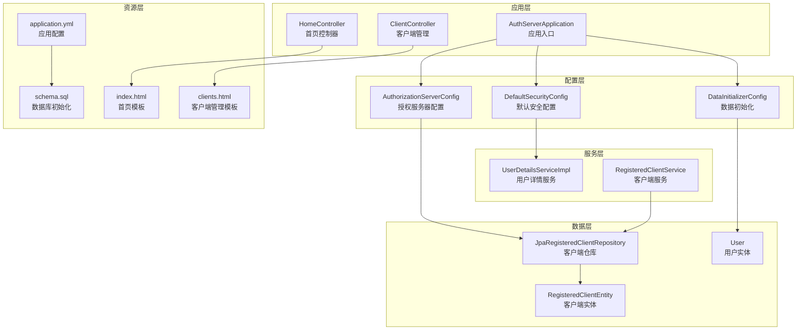
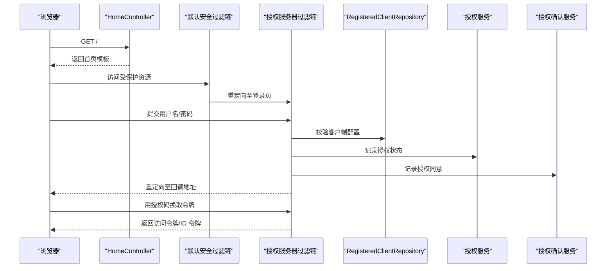
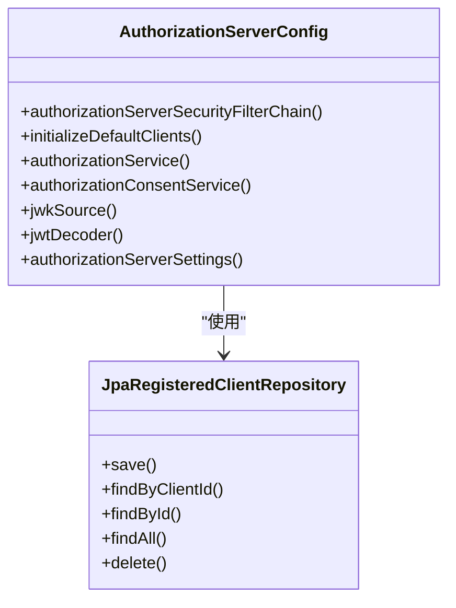
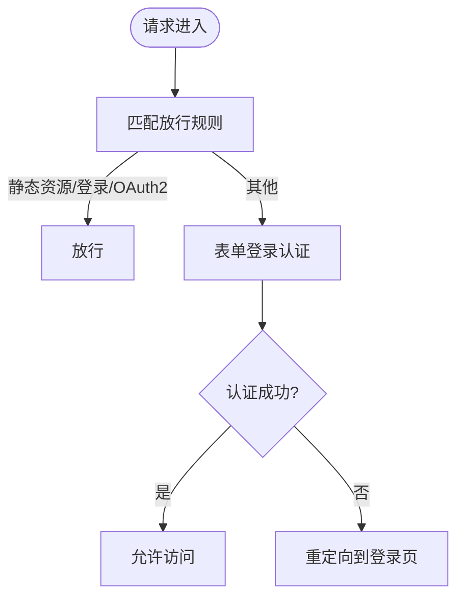
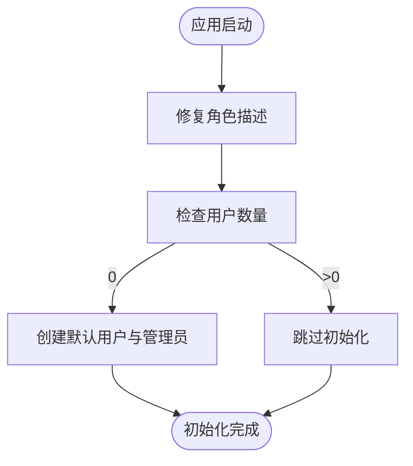
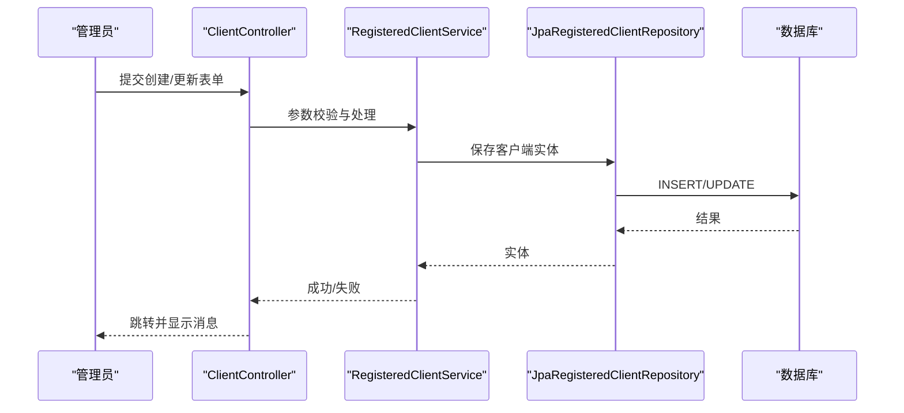
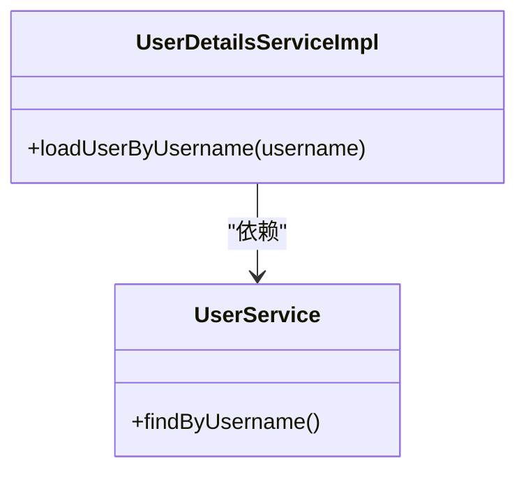
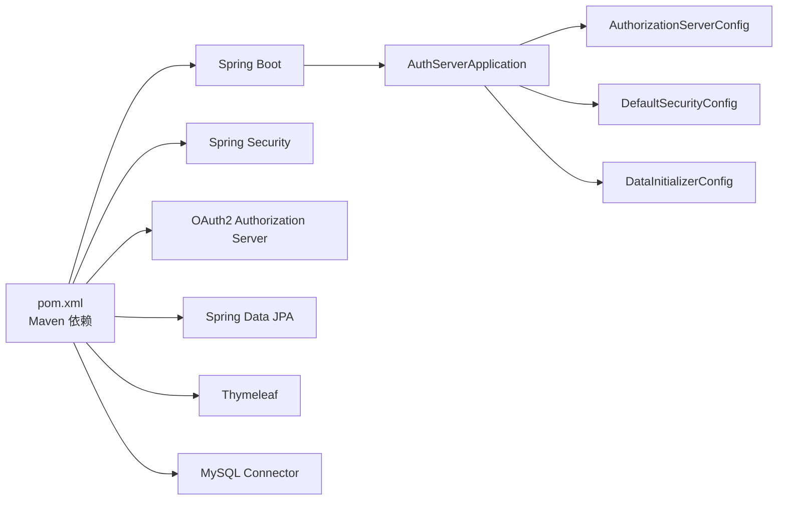

# 快速开始

<cite>
**本文引用的文件**
- [pom.xml](file://pom.xml)
- [application.yml](file://src/main/resources/application.yml)
- [schema.sql](file://src/main/resources/schema.sql)
- [AuthServerApplication.java](file://src/main/java/com/example/authserver/AuthServerApplication.java)
- [AuthorizationServerConfig.java](file://src/main/java/com/example/authserver/config/AuthorizationServerConfig.java)
- [DefaultSecurityConfig.java](file://src/main/java/com/example/authserver/config/DefaultSecurityConfig.java)
- [DataInitializerConfig.java](file://src/main/java/com/example/authserver/config/DataInitializerConfig.java)
- [JpaRegisteredClientRepository.java](file://src/main/java/com/example/authserver/repository/JpaRegisteredClientRepository.java)
- [RegisteredClientService.java](file://src/main/java/com/example/authserver/service/RegisteredClientService.java)
- [ClientController.java](file://src/main/java/com/example/authserver/controller/ClientController.java)
- [UserDetailsServiceImpl.java](file://src/main/java/com/example/authserver/service/UserDetailsServiceImpl.java)
- [HomeController.java](file://src/main/java/com/example/authserver/controller/HomeController.java)
- [index.html](file://src/main/resources/templates/index.html)
- [clients.html](file://src/main/resources/templates/admin/clients.html)
- [User.java](file://src/main/java/com/example/authserver/entity/User.java)
- [RegisteredClientEntity.java](file://src/main/java/com/example/authserver/entity/RegisteredClientEntity.java)
- [GlobalExceptionHandler.java](file://src/main/java/com/example/authserver/exception/GlobalExceptionHandler.java)
</cite>

## 目录
1. [简介](#简介)
2. [项目结构](#项目结构)
3. [核心组件](#核心组件)
4. [架构总览](#架构总览)
5. [详细组件分析](#详细组件分析)
6. [依赖关系分析](#依赖关系分析)
7. [性能考虑](#性能考虑)
8. [故障排查指南](#故障排查指南)
9. [结论](#结论)
10. [附录](#附录)

## 简介
本指南面向首次接触 Spring Security OAuth2 认证服务器的新用户，帮助你在约 30 分钟内完成环境准备、数据库初始化、应用配置与启动，并进行基础功能验证。你将学会：
- 准备 Java 17、MySQL、Maven 环境
- 初始化数据库与表结构
- 配置应用参数与启动项
- 注册并测试 OAuth2 客户端
- 处理常见初始化问题

## 项目结构
该项目采用 Spring Boot 3 + Spring Security OAuth2 Authorization Server 的标准工程结构，主要模块如下：
- 配置层：授权服务器配置、默认安全配置、数据初始化
- 控制层：首页、客户端管理、后台管理等
- 服务层：用户详情、客户端管理、角色与权限
- 数据层：JPA 实体与仓库
- 资源层：Thymeleaf 模板与数据库初始化脚本

图表来源
- [AuthServerApplication.java:1-14](file://src/main/java/com/example/authserver/AuthServerApplication.java#L1-L14)
- [AuthorizationServerConfig.java:1-256](file://src/main/java/com/example/authserver/config/AuthorizationServerConfig.java#L1-L256)
- [DefaultSecurityConfig.java:1-75](file://src/main/java/com/example/authserver/config/DefaultSecurityConfig.java#L1-L75)
- [DataInitializerConfig.java:1-109](file://src/main/java/com/example/authserver/config/DataInitializerConfig.java#L1-L109)
- [HomeController.java:1-24](file://src/main/java/com/example/authserver/controller/HomeController.java#L1-L24)
- [ClientController.java:1-360](file://src/main/java/com/example/authserver/controller/ClientController.java#L1-L360)
- [JpaRegisteredClientRepository.java:1-289](file://src/main/java/com/example/authserver/repository/JpaRegisteredClientRepository.java#L1-L289)
- [UserDetailsServiceImpl.java:1-59](file://src/main/java/com/example/authserver/service/UserDetailsServiceImpl.java#L1-L59)
- [User.java:1-66](file://src/main/java/com/example/authserver/entity/User.java#L1-L66)
- [RegisteredClientEntity.java:1-111](file://src/main/java/com/example/authserver/entity/RegisteredClientEntity.java#L1-L111)
- [application.yml:1-29](file://src/main/resources/application.yml#L1-L29)
- [schema.sql:1-169](file://src/main/resources/schema.sql#L1-L169)
- [index.html:1-243](file://src/main/resources/templates/index.html#L1-L243)
- [clients.html:1-800](file://src/main/resources/templates/admin/clients.html#L1-L800)

章节来源
- [AuthServerApplication.java:1-14](file://src/main/java/com/example/authserver/AuthServerApplication.java#L1-L14)
- [application.yml:1-29](file://src/main/resources/application.yml#L1-L29)

## 核心组件
- 授权服务器配置：启用 OIDC、配置授权服务与授权确认服务、JWK 源与 JWT 解码器、默认客户端初始化
- 默认安全配置：表单登录、URL 权限控制、密码编码器
- 数据初始化：角色与 URL 权限规则初始化；用户初始化（依赖 schema.sql）
- 客户端管理：客户端增删改查、密钥生成与加密、授权模式与重定向 URI 校验
- 用户详情服务：从数据库加载用户并映射为 Spring Security 用户模型
- 控制器与模板：首页与后台客户端管理界面

章节来源
- [AuthorizationServerConfig.java:1-256](file://src/main/java/com/example/authserver/config/AuthorizationServerConfig.java#L1-L256)
- [DefaultSecurityConfig.java:1-75](file://src/main/java/com/example/authserver/config/DefaultSecurityConfig.java#L1-L75)
- [DataInitializerConfig.java:1-109](file://src/main/java/com/example/authserver/config/DataInitializerConfig.java#L1-L109)
- [ClientController.java:1-360](file://src/main/java/com/example/authserver/controller/ClientController.java#L1-L360)
- [UserDetailsServiceImpl.java:1-59](file://src/main/java/com/example/authserver/service/UserDetailsServiceImpl.java#L1-L59)
- [index.html:1-243](file://src/main/resources/templates/index.html#L1-L243)
- [clients.html:1-800](file://src/main/resources/templates/admin/clients.html#L1-L800)

## 架构总览
下图展示了从浏览器访问到授权服务器的关键交互流程，包括登录、授权码发放、令牌交换与用户信息获取。

图表来源
- [HomeController.java:1-24](file://src/main/java/com/example/authserver/controller/HomeController.java#L1-L24)
- [DefaultSecurityConfig.java:55-73](file://src/main/java/com/example/authserver/config/DefaultSecurityConfig.java#L55-L73)
- [AuthorizationServerConfig.java:56-77](file://src/main/java/com/example/authserver/config/AuthorizationServerConfig.java#L56-L77)
- [JpaRegisteredClientRepository.java:56-88](file://src/main/java/com/example/authserver/repository/JpaRegisteredClientRepository.java#L56-L88)
- [AuthorizationServerConfig.java:193-206](file://src/main/java/com/example/authserver/config/AuthorizationServerConfig.java#L193-L206)

## 详细组件分析

### 授权服务器配置（AuthorizationServerConfig）
- 启用 OIDC 1.0 并应用默认安全配置
- 配置授权服务与授权确认服务（JDBC 存储）
- 生成 RSA 密钥对并配置 JWK 源与 JWT 解码器
- 初始化默认客户端（Web 应用、移动端、后端服务），并支持更新

图表来源
- [AuthorizationServerConfig.java:56-253](file://src/main/java/com/example/authserver/config/AuthorizationServerConfig.java#L56-L253)
- [JpaRegisteredClientRepository.java:21-136](file://src/main/java/com/example/authserver/repository/JpaRegisteredClientRepository.java#L21-L136)

章节来源
- [AuthorizationServerConfig.java:56-253](file://src/main/java/com/example/authserver/config/AuthorizationServerConfig.java#L56-L253)

### 默认安全配置（DefaultSecurityConfig）
- 使用数据库用户详情服务与委托密码编码器
- 配置表单登录与登出
- 对静态资源、登录页、OAuth2 端点放行，其余请求需认证

图表来源
- [DefaultSecurityConfig.java:55-73](file://src/main/java/com/example/authserver/config/DefaultSecurityConfig.java#L55-L73)

章节来源
- [DefaultSecurityConfig.java:55-73](file://src/main/java/com/example/authserver/config/DefaultSecurityConfig.java#L55-L73)

### 数据初始化（DataInitializerConfig）
- 修复角色描述（中文乱码问题）
- 初始化默认用户（ROLE_USER、ROLE_ADMIN），密码经编码器加密
- 依赖 schema.sql 初始化角色与 URL 权限规则

图表来源
- [DataInitializerConfig.java:30-95](file://src/main/java/com/example/authserver/config/DataInitializerConfig.java#L30-L95)

章节来源
- [DataInitializerConfig.java:30-95](file://src/main/java/com/example/authserver/config/DataInitializerConfig.java#L30-L95)

### 客户端管理（ClientController + RegisteredClientService + JpaRegisteredClientRepository）
- 支持创建、更新、删除客户端
- 校验授权模式、重定向 URI、权限范围等
- 使用 JPA 实体持久化到 oauth2_registered_client 表

图表来源
- [ClientController.java:93-186](file://src/main/java/com/example/authserver/controller/ClientController.java#L93-L186)
- [RegisteredClientService.java:61-82](file://src/main/java/com/example/authserver/service/RegisteredClientService.java#L61-L82)
- [JpaRegisteredClientRepository.java:29-51](file://src/main/java/com/example/authserver/repository/JpaRegisteredClientRepository.java#L29-L51)

章节来源
- [ClientController.java:93-186](file://src/main/java/com/example/authserver/controller/ClientController.java#L93-L186)
- [RegisteredClientService.java:61-82](file://src/main/java/com/example/authserver/service/RegisteredClientService.java#L61-L82)
- [JpaRegisteredClientRepository.java:29-51](file://src/main/java/com/example/authserver/repository/JpaRegisteredClientRepository.java#L29-L51)

### 用户详情服务（UserDetailsServiceImpl）
- 通过用户名查询用户并映射为 Spring Security 用户模型
- 将用户角色转换为 GrantedAuthority

图表来源
- [UserDetailsServiceImpl.java:29-57](file://src/main/java/com/example/authserver/service/UserDetailsServiceImpl.java#L29-L57)

章节来源
- [UserDetailsServiceImpl.java:29-57](file://src/main/java/com/example/authserver/service/UserDetailsServiceImpl.java#L29-L57)

### 控制器与模板
- HomeController 返回首页模板，展示登录用户信息
- clients.html 提供客户端管理界面，支持创建、编辑、删除

章节来源
- [HomeController.java:15-21](file://src/main/java/com/example/authserver/controller/HomeController.java#L15-L21)
- [index.html:194-231](file://src/main/resources/templates/index.html#L194-L231)
- [clients.html:240-333](file://src/main/resources/templates/admin/clients.html#L240-L333)

## 依赖关系分析
- Maven 依赖：Spring Boot Starter、Spring Security OAuth2 Authorization Server、Spring Data JPA、Thymeleaf、MySQL Connector、Lombok、DevTools
- Java 版本：17
- 数据库：MySQL（JDBC URL、用户名、密码在 application.yml 中配置）

图表来源
- [pom.xml:24-146](file://pom.xml#L24-L146)
- [AuthServerApplication.java:6-11](file://src/main/java/com/example/authserver/AuthServerApplication.java#L6-L11)
- [AuthorizationServerConfig.java:44-51](file://src/main/java/com/example/authserver/config/AuthorizationServerConfig.java#L44-L51)
- [DefaultSecurityConfig.java:27-49](file://src/main/java/com/example/authserver/config/DefaultSecurityConfig.java#L27-L49)
- [DataInitializerConfig.java:20-23](file://src/main/java/com/example/authserver/config/DataInitializerConfig.java#L20-L23)

章节来源
- [pom.xml:24-146](file://pom.xml#L24-L146)
- [application.yml:1-29](file://src/main/resources/application.yml#L1-L29)

## 性能考虑
- 使用 MySQL 作为持久化存储，建议在生产环境配置连接池与索引优化
- 启用 Hibernate SQL 输出与格式化便于调试，但生产环境建议关闭
- JWK 源使用 RSA 密钥对，注意密钥轮换策略
- 客户端与授权状态使用 JDBC 存储，合理设置令牌有效期以平衡安全性与性能

## 故障排查指南
- 数据库连接失败
  - 检查 JDBC URL、用户名、密码是否正确
  - 确认 MySQL 服务运行且端口可达
- 数据库初始化失败
  - 确认 schema.sql 已执行（DDL 自动更新已启用）
  - 检查数据库字符集与时区设置
- 启动时报错找不到客户端或用户
  - 确认 DataInitializerConfig 已执行（初始化默认用户）
  - 检查角色与 URL 权限规则是否插入成功
- OAuth2 授权失败
  - 检查客户端授权模式与重定向 URI 是否匹配
  - 确认客户端密钥与认证方式配置正确
- 登录页面无法访问
  - 确认默认安全过滤链已生效，静态资源与登录端点已放行

章节来源
- [application.yml:4-28](file://src/main/resources/application.yml#L4-L28)
- [schema.sql:144-169](file://src/main/resources/schema.sql#L144-L169)
- [DataInitializerConfig.java:73-95](file://src/main/java/com/example/authserver/config/DataInitializerConfig.java#L73-L95)
- [ClientController.java:270-358](file://src/main/java/com/example/authserver/controller/ClientController.java#L270-L358)
- [DefaultSecurityConfig.java:55-73](file://src/main/java/com/example/authserver/config/DefaultSecurityConfig.java#L55-L73)

## 结论
通过本指南，你可以在 30 分钟内完成 Spring Security OAuth2 认证服务器的环境准备、数据库初始化、应用配置与启动，并完成基本的 OAuth2 客户端注册与测试。建议在开发阶段使用内置的默认客户端与初始化数据，上线前根据实际需求调整客户端配置、令牌有效期与安全策略。

## 附录

### 环境要求
- Java 17
- MySQL
- Maven

章节来源
- [pom.xml:24-26](file://pom.xml#L24-L26)
- [application.yml:6-9](file://src/main/resources/application.yml#L6-L9)

### 安装与配置步骤
- 步骤 1：准备 Java 17、MySQL、Maven
- 步骤 2：克隆项目并导入 IDE
- 步骤 3：配置 application.yml 中的数据库连接参数
- 步骤 4：启动应用（见启动命令）
- 步骤 5：访问首页与登录页验证

章节来源
- [application.yml:1-29](file://src/main/resources/application.yml#L1-L29)
- [AuthServerApplication.java:9-11](file://src/main/java/com/example/authserver/AuthServerApplication.java#L9-L11)

### 数据库初始化步骤
- 方式一：Spring Boot SQL 初始化（已启用）
  - application.yml 中配置了 schema.sql 的初始化位置与模式
- 方式二：手动执行 schema.sql
  - 在 MySQL 中创建数据库并执行脚本

章节来源
- [application.yml:12-16](file://src/main/resources/application.yml#L12-L16)
- [schema.sql:1-169](file://src/main/resources/schema.sql#L1-L169)

### 应用配置参数设置
- server.port：应用监听端口
- spring.datasource.*：数据库连接信息
- spring.sql.init.*：SQL 初始化配置
- spring.jpa.*：JPA 与 Hibernate 配置
- logging.level.org.springframework.security：安全日志级别

章节来源
- [application.yml:1-29](file://src/main/resources/application.yml#L1-L29)

### 启动命令
- 使用 Maven 启动：mvn spring-boot:run
- 使用 Java 启动：mvn clean package 后 java -jar target/auth-server-0.0.1-SNAPSHOT.jar

章节来源
- [pom.xml:117-143](file://pom.xml#L117-L143)
- [AuthServerApplication.java:9-11](file://src/main/java/com/example/authserver/AuthServerApplication.java#L9-L11)

### 首次运行验证
- 访问首页：http://localhost:9000/
- 访问登录页：http://localhost:9000/login
- 访问 OAuth2 发现文档：http://localhost:9000/.well-known/openid-configuration
- 使用默认用户登录（来自初始化数据）

章节来源
- [HomeController.java:15-21](file://src/main/java/com/example/authserver/controller/HomeController.java#L15-L21)
- [index.html:207-210](file://src/main/resources/templates/index.html#L207-L210)
- [DataInitializerConfig.java:81-89](file://src/main/java/com/example/authserver/config/DataInitializerConfig.java#L81-L89)

### OAuth2 客户端注册示例与测试
- 示例客户端（已在授权服务器配置中初始化）
  - Web 应用客户端：授权码模式 + 刷新令牌 + 需要授权同意
  - 移动端客户端：公开客户端（无需密钥）+ PKCE
  - 后端服务客户端：客户端凭证模式
- 手动注册客户端
  - 通过后台管理界面创建客户端（clients.html）
  - 设置客户端名称、认证方式、授权模式、重定向 URI、权限范围、令牌有效期等
- 测试方法
  - 使用浏览器发起授权码流程，观察回调地址
  - 使用令牌端点获取访问令牌与 ID 令牌
  - 使用用户信息端点获取用户声明

章节来源
- [AuthorizationServerConfig.java:94-154](file://src/main/java/com/example/authserver/config/AuthorizationServerConfig.java#L94-L154)
- [ClientController.java:93-186](file://src/main/java/com/example/authserver/controller/ClientController.java#L93-L186)
- [clients.html:336-563](file://src/main/resources/templates/admin/clients.html#L336-L563)

### 常见初始配置问题与解决方案
- 数据库连接失败
  - 检查 JDBC URL、用户名、密码
- 角色或 URL 权限规则缺失
  - 确认 schema.sql 已执行
- 用户未初始化
  - 确认 DataInitializerConfig 已执行
- 客户端密钥或认证方式错误
  - 检查客户端配置与重定向 URI 格式
- 日志与调试
  - 调整日志级别以获取更多上下文信息

章节来源
- [application.yml:6-28](file://src/main/resources/application.yml#L6-L28)
- [schema.sql:144-169](file://src/main/resources/schema.sql#L144-L169)
- [DataInitializerConfig.java:73-95](file://src/main/java/com/example/authserver/config/DataInitializerConfig.java#L73-L95)
- [ClientController.java:270-358](file://src/main/java/com/example/authserver/controller/ClientController.java#L270-L358)
- [GlobalExceptionHandler.java:25-117](file://src/main/java/com/example/authserver/exception/GlobalExceptionHandler.java#L25-L117)