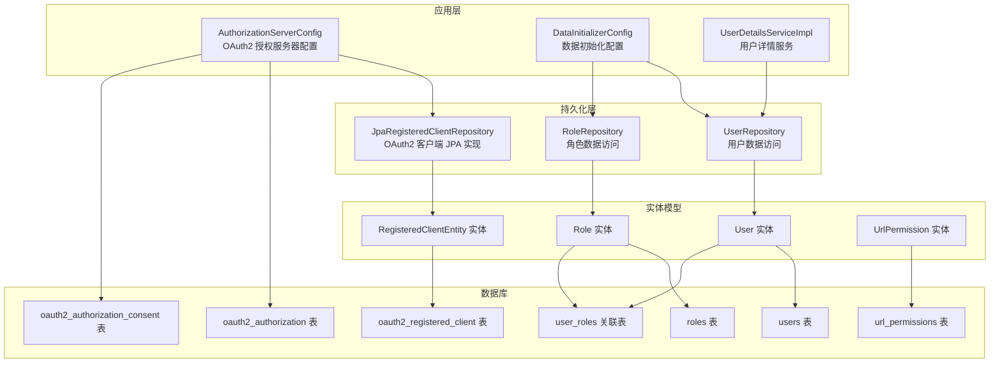
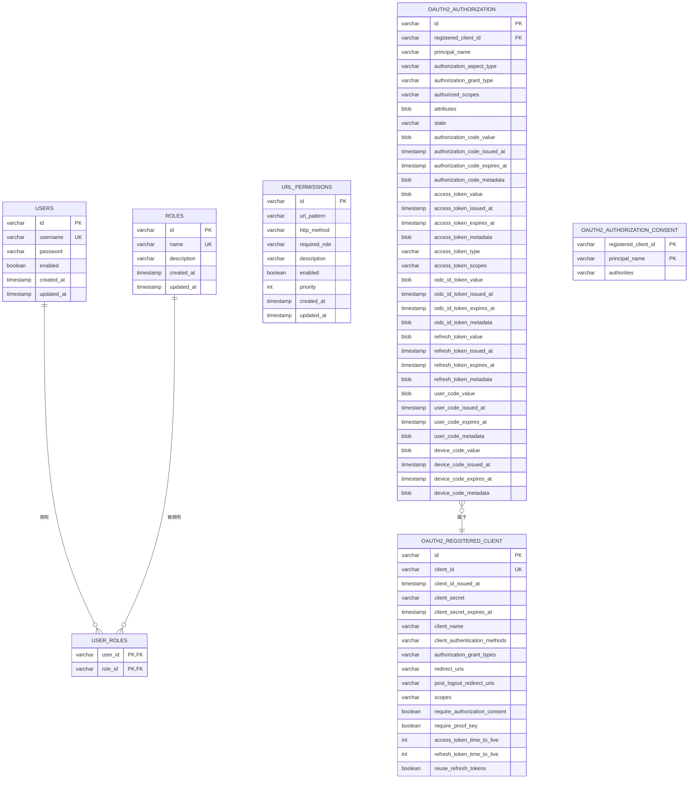
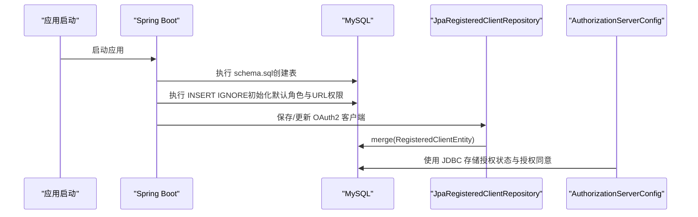

# 数据库设计

<cite>
**本文引用的文件**
- [schema.sql](file://src/main/resources/schema.sql)
- [application.yml](file://src/main/resources/application.yml)
- [User.java](file://src/main/java/com/example/authserver/entity/User.java)
- [Role.java](file://src/main/java/com/example/authserver/entity/Role.java)
- [RegisteredClientEntity.java](file://src/main/java/com/example/authserver/entity/RegisteredClientEntity.java)
- [UrlPermission.java](file://src/main/java/com/example/authserver/entity/UrlPermission.java)
- [UserRepository.java](file://src/main/java/com/example/authserver/repository/UserRepository.java)
- [RoleRepository.java](file://src/main/java/com/example/authserver/repository/RoleRepository.java)
- [JpaRegisteredClientRepository.java](file://src/main/java/com/example/authserver/repository/JpaRegisteredClientRepository.java)
- [DataInitializerConfig.java](file://src/main/java/com/example/authserver/config/DataInitializerConfig.java)
- [AuthorizationServerConfig.java](file://src/main/java/com/example/authserver/config/AuthorizationServerConfig.java)
- [UserDetailsServiceImpl.java](file://src/main/java/com/example/authserver/service/UserDetailsServiceImpl.java)
</cite>

## 目录
1. [简介](#简介)
2. [项目结构](#项目结构)
3. [核心组件](#核心组件)
4. [架构总览](#架构总览)
5. [详细组件分析](#详细组件分析)
6. [依赖关系分析](#依赖关系分析)
7. [性能考虑](#性能考虑)
8. [故障排查指南](#故障排查指南)
9. [结论](#结论)
10. [附录](#附录)

## 简介
本文件面向数据库设计与运维人员，系统性梳理本 OAuth2 授权服务器的数据库结构与初始化流程，覆盖以下主题：
- schema.sql 脚本中各表的完整定义、主键/外键约束与索引设计
- 表之间的关系映射与依赖顺序
- 数据库初始化脚本的执行顺序与依赖关系
- 数据库配置参数说明（连接池、JPA DDL 自动创建、SQL 初始化模式等）
- 数据迁移策略与版本管理方法建议
- 性能优化建议（查询优化、索引策略、分区设计等）
- 备份恢复与监控最佳实践

## 项目结构
本项目采用 Spring Boot + JPA + MySQL 的技术栈，数据库初始化通过 schema.sql 脚本完成，同时利用 Spring SQL 初始化机制在应用启动时执行。JPA 实体映射到数据库表，Repository 层负责数据访问，Authorization Server 配置使用 JDBC 存储 OAuth2 授权状态与客户端信息。

图表来源
- [AuthorizationServerConfig.java](file://src/main/java/com/example/authserver/config/AuthorizationServerConfig.java)
- [DataInitializerConfig.java](file://src/main/java/com/example/authserver/config/DataInitializerConfig.java)
- [UserDetailsServiceImpl.java](file://src/main/java/com/example/authserver/service/UserDetailsServiceImpl.java)
- [UserRepository.java](file://src/main/java/com/example/authserver/repository/UserRepository.java)
- [RoleRepository.java](file://src/main/java/com/example/authserver/repository/RoleRepository.java)
- [JpaRegisteredClientRepository.java](file://src/main/java/com/example/authserver/repository/JpaRegisteredClientRepository.java)
- [User.java](file://src/main/java/com/example/authserver/entity/User.java)
- [Role.java](file://src/main/java/com/example/authserver/entity/Role.java)
- [RegisteredClientEntity.java](file://src/main/java/com/example/authserver/entity/RegisteredClientEntity.java)
- [UrlPermission.java](file://src/main/java/com/example/authserver/entity/UrlPermission.java)
- [schema.sql](file://src/main/resources/schema.sql)

章节来源
- [application.yml](file://src/main/resources/application.yml)
- [schema.sql](file://src/main/resources/schema.sql)

## 核心组件
本节聚焦数据库层面的核心表及其职责：
- users：系统用户表，存储用户名、密码、启用状态与时间戳
- roles：角色表，存储角色名称与描述
- user_roles：用户-角色多对多关联表
- url_permissions：URL 动态权限规则表，支持通配符、HTTP 方法、优先级与启用状态
- oauth2_registered_client：OAuth2 客户端注册表，遵循 Spring Authorization Server 规范
- oauth2_authorization：OAuth2 授权状态存储表，涵盖授权码、访问令牌、刷新令牌、OIDC ID Token、用户码、设备码等
- oauth2_authorization_consent：用户授权同意记录表

章节来源
- [schema.sql](file://src/main/resources/schema.sql)
- [User.java](file://src/main/java/com/example/authserver/entity/User.java)
- [Role.java](file://src/main/java/com/example/authserver/entity/Role.java)
- [RegisteredClientEntity.java](file://src/main/java/com/example/authserver/entity/RegisteredClientEntity.java)
- [UrlPermission.java](file://src/main/java/com/example/authserver/entity/UrlPermission.java)

## 架构总览
下图展示数据库表之间的关系映射与依赖顺序，以及初始化脚本的执行顺序与依赖关系。

图表来源
- [schema.sql](file://src/main/resources/schema.sql)
- [User.java](file://src/main/java/com/example/authserver/entity/User.java)
- [Role.java](file://src/main/java/com/example/authserver/entity/Role.java)
- [RegisteredClientEntity.java](file://src/main/java/com/example/authserver/entity/RegisteredClientEntity.java)
- [UrlPermission.java](file://src/main/java/com/example/authserver/entity/UrlPermission.java)

## 详细组件分析

### 用户表 users
- 字段设计要点
  - id：UUID 类型，作为主键
  - username：唯一索引，限制长度与唯一性
  - password：存储 BCrypt 加密后的密码
  - enabled：布尔值控制账户启用状态
  - created_at / updated_at：时间戳，自动维护
- 索引与约束
  - 主键：id
  - 唯一索引：username
- 实体映射
  - User 实体通过 @Table(name = "users") 映射
  - 使用 UUID 生成策略，PrePersist/PreUpdate 自动填充时间戳

章节来源
- [schema.sql](file://src/main/resources/schema.sql)
- [User.java](file://src/main/java/com/example/authserver/entity/User.java)

### 角色表 roles
- 字段设计要点
  - id：UUID 类型，作为主键
  - name：唯一索引，如 ROLE_USER、ROLE_ADMIN
  - description：角色描述
  - created_at / updated_at：时间戳，自动维护
- 索引与约束
  - 主键：id
  - 唯一索引：name
- 实体映射
  - Role 实体通过 @Table(name = "roles") 映射
  - 使用 UUID 生成策略，PrePersist/PreUpdate 自动填充时间戳

章节来源
- [schema.sql](file://src/main/resources/schema.sql)
- [Role.java](file://src/main/java/com/example/authserver/entity/Role.java)

### 用户-角色关联表 user_roles
- 设计要点
  - 联合主键：(user_id, role_id)
  - 外键约束：分别引用 users.id 与 roles.id，并设置级联删除
- 作用
  - 支持用户与角色的多对多关系
- 实体映射
  - User 实体通过 @JoinTable(name = "user_roles") 建立多对多关系
  - Role 实体通过 mappedBy = "roles" 反向关联

章节来源
- [schema.sql](file://src/main/resources/schema.sql)
- [User.java](file://src/main/java/com/example/authserver/entity/User.java)
- [Role.java](file://src/main/java/com/example/authserver/entity/Role.java)

### URL 权限规则表 url_permissions
- 字段设计要点
  - id：UUID 主键
  - url_pattern：支持通配符的 URL 模式
  - http_method：HTTP 方法，支持 * 匹配所有
  - required_role：所需角色
  - enabled：启用状态
  - priority：优先级，数值越大优先级越高
  - created_at / updated_at：时间戳
- 索引与约束
  - 主键：id
  - 索引：ix_url_pattern、ix_enabled
- 实体映射
  - UrlPermission 实体通过 @Table(name = "url_permissions") 映射

章节来源
- [schema.sql](file://src/main/resources/schema.sql)
- [UrlPermission.java](file://src/main/java/com/example/authserver/entity/UrlPermission.java)

### OAuth2 注册客户端表 oauth2_registered_client
- 字段设计要点
  - 遵循 Spring Authorization Server 规范，字段命名与类型与标准一致
  - client_id：唯一索引，客户端标识
  - client_authentication_methods / authorization_grant_types / redirect_uris / post_logout_redirect_uris / scopes：均以逗号分隔存储
  - require_authorization_consent / require_proof_key：布尔开关
  - access_token_time_to_live / refresh_token_time_to_live：秒级有效期
  - reuse_refresh_tokens：是否复用刷新令牌
- 索引与约束
  - 主键：id
  - 唯一索引：client_id
- 实体映射
  - RegisteredClientEntity 通过 @Table(name = "oauth2_registered_client") 映射
  - JPARegisteredClientRepository 提供保存/查询逻辑，统一使用 merge

章节来源
- [schema.sql](file://src/main/resources/schema.sql)
- [RegisteredClientEntity.java](file://src/main/java/com/example/authserver/entity/RegisteredClientEntity.java)
- [JpaRegisteredClientRepository.java](file://src/main/java/com/example/authserver/repository/JpaRegisteredClientRepository.java)

### OAuth2 授权表 oauth2_authorization
- 字段设计要点
  - 存储授权码、访问令牌、刷新令牌、OIDC ID Token、用户码、设备码等的值、签发时间、过期时间与元数据
  - registered_client_id：外键指向 oauth2_registered_client
  - principal_name：主体名称（用户名）
- 索引与约束
  - 主键：id
  - 外键：registered_client_id 引用 oauth2_registered_client.id
- 用途
  - 由 AuthorizationServerConfig 中的 JdbcOAuth2AuthorizationService 使用

章节来源
- [schema.sql](file://src/main/resources/schema.sql)
- [AuthorizationServerConfig.java](file://src/main/java/com/example/authserver/config/AuthorizationServerConfig.java)

### OAuth2 授权同意表 oauth2_authorization_consent
- 字段设计要点
  - registered_client_id + principal_name：联合主键
  - authorities：逗号分隔的授权权限列表
- 用途
  - 由 AuthorizationServerConfig 中的 JdbcOAuth2AuthorizationConsentService 使用

章节来源
- [schema.sql](file://src/main/resources/schema.sql)
- [AuthorizationServerConfig.java](file://src/main/java/com/example/authserver/config/AuthorizationServerConfig.java)

### 初始化脚本执行顺序与依赖关系
- 执行顺序
  1) users、roles、user_roles、url_permissions、oauth2_registered_client、oauth2_authorization、oauth2_authorization_consent
  2) schema.sql 中的 INSERT IGNORE 初始化默认角色与 URL 权限规则
  3) DataInitializerConfig 在应用启动后初始化默认用户（依赖 roles 表已存在）
- 依赖关系
  - user_roles 依赖 users 与 roles
  - oauth2_authorization 依赖 oauth2_registered_client
  - 初始化数据依赖 roles 表先于用户初始化

章节来源
- [schema.sql](file://src/main/resources/schema.sql)
- [DataInitializerConfig.java](file://src/main/java/com/example/authserver/config/DataInitializerConfig.java)

## 依赖关系分析
- Spring Boot 配置
  - 数据源：MySQL，驱动类名、URL、用户名、密码
  - SQL 初始化：always 模式，使用 classpath:schema.sql，允许继续执行错误
  - JPA：hibernate.ddl-auto: update，方言为 MySQLDialect
- 实体与表映射
  - User ↔ users
  - Role ↔ roles
  - User-Roles ↔ user_roles
  - UrlPermission ↔ url_permissions
  - RegisteredClientEntity ↔ oauth2_registered_client
  - AuthorizationService ↔ oauth2_authorization
  - AuthorizationConsentService ↔ oauth2_authorization_consent
- OAuth2 客户端存储
  - JpaRegisteredClientRepository 使用 EntityManager 持久化 RegisteredClient 到 oauth2_registered_client 表

图表来源
- [application.yml](file://src/main/resources/application.yml)
- [schema.sql](file://src/main/resources/schema.sql)
- [JpaRegisteredClientRepository.java](file://src/main/java/com/example/authserver/repository/JpaRegisteredClientRepository.java)
- [AuthorizationServerConfig.java](file://src/main/java/com/example/authserver/config/AuthorizationServerConfig.java)

章节来源
- [application.yml](file://src/main/resources/application.yml)
- [JpaRegisteredClientRepository.java](file://src/main/java/com/example/authserver/repository/JpaRegisteredClientRepository.java)
- [AuthorizationServerConfig.java](file://src/main/java/com/example/authserver/config/AuthorizationServerConfig.java)

## 性能考虑
- 查询优化
  - users：按 username 查询频繁，唯一索引已满足
  - roles：按 name 查询频繁，唯一索引已满足
  - url_permissions：按 url_pattern 与 enabled 查询，现有索引有效
  - oauth2_registered_client：按 client_id 查询频繁，唯一索引已满足
- 索引策略
  - 建议为 oauth2_authorization 表增加常用查询列的索引（如 registered_client_id、principal_name、authorization_grant_type）
  - 对 url_permissions 的组合查询（url_pattern, enabled）可考虑复合索引
- 分区设计
  - 对于历史数据量大的 oauth2_authorization 表，可按时间分区（如按月或按季度）以提升查询与归档效率
- 连接池与事务
  - 建议在生产环境配置连接池参数（最大连接数、空闲超时、连接生命周期等），避免默认值导致的性能瓶颈
- DDL 自动创建
  - 开发环境可使用 hibernate.ddl-auto: update；生产环境建议关闭自动 DDL，改为显式迁移脚本管理

[本节为通用性能建议，无需特定文件来源]

## 故障排查指南
- 初始化失败
  - 确认 schema.sql 已正确执行且表结构完整
  - 检查 INSERT IGNORE 是否因唯一约束冲突而跳过
- 用户无法登录
  - 检查 users.enabled 是否为 true
  - 确认用户已关联角色（user_roles）
- OAuth2 客户端异常
  - 确认 oauth2_registered_client 中 client_id 唯一且字段值正确
  - 检查 JpaRegisteredClientRepository 的保存/更新逻辑
- 授权状态异常
  - 检查 oauth2_authorization 表中 registered_client_id 是否有效
  - 确认 AuthorizationServerConfig 的 JDBC 授权服务配置正确

章节来源
- [schema.sql](file://src/main/resources/schema.sql)
- [DataInitializerConfig.java](file://src/main/java/com/example/authserver/config/DataInitializerConfig.java)
- [JpaRegisteredClientRepository.java](file://src/main/java/com/example/authserver/repository/JpaRegisteredClientRepository.java)
- [AuthorizationServerConfig.java](file://src/main/java/com/example/authserver/config/AuthorizationServerConfig.java)

## 结论
本数据库设计围绕 Spring Authorization Server 规范，结合业务需求（用户、角色、URL 动态权限）与 OAuth2 授权状态存储，形成了清晰的表结构与实体映射。初始化脚本与 Spring SQL 初始化机制配合，确保了首次部署的自动化与一致性。建议在生产环境中关闭自动 DDL，采用显式迁移脚本管理版本，并根据实际查询模式持续优化索引与分区策略。

[本节为总结性内容，无需特定文件来源]

## 附录

### 数据库配置参数说明
- 数据源配置
  - URL：指向 MySQL 实例，包含字符集、时区、SSL 等参数
  - 驱动类名：MySQL Connector/J
  - 用户名/密码：数据库凭据
- SQL 初始化
  - mode: always：每次启动都执行
  - schema-locations: classpath:schema.sql：指定初始化脚本位置
  - continue-on-error: true：遇到错误继续执行
- JPA 配置
  - hibernate.ddl-auto: update：自动更新 DDL（开发环境）
  - show-sql: true：输出 SQL 日志
  - format_sql: true：格式化 SQL 输出
  - dialect: MySQLDialect：方言适配

章节来源
- [application.yml](file://src/main/resources/application.yml)

### 数据迁移策略与版本管理方法
- 建议采用 Flyway 或 Liquibase 等迁移工具
  - 将 schema.sql 转换为迁移脚本（V1__init.sql、V2__add_indexes.sql 等）
  - 在生产环境通过迁移工具执行，避免直接使用 DDL 自动创建
- 版本控制
  - 迁移脚本纳入版本控制系统，每次变更提交新的迁移版本
  - 执行前进行回滚测试，确保可逆操作

[本节为通用迁移建议，无需特定文件来源]

### 备份恢复与监控最佳实践
- 备份
  - 全量备份：定期执行全库导出
  - 增量备份：针对 oauth2_authorization 等大表进行增量备份
- 恢复
  - 制定恢复演练计划，验证备份可用性
  - 恢复前检查表结构与索引完整性
- 监控
  - 监控慢查询日志，识别热点查询
  - 监控连接池使用率与等待队列
  - 监控表大小与索引碎片，定期维护

[本节为通用运维建议，无需特定文件来源]