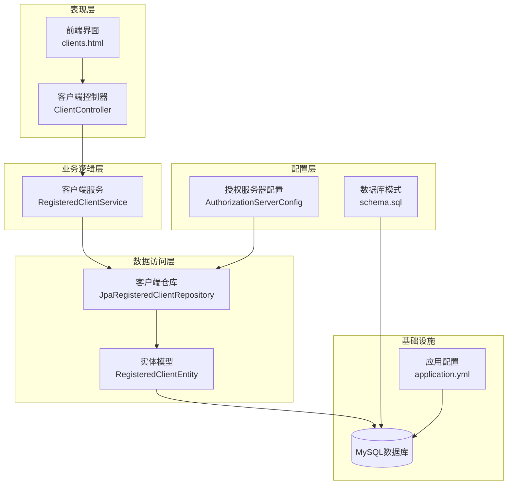
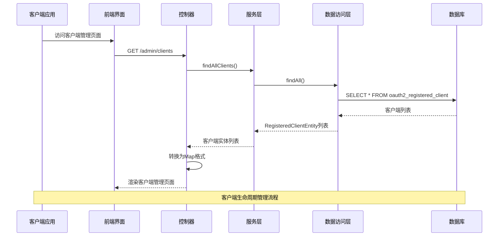
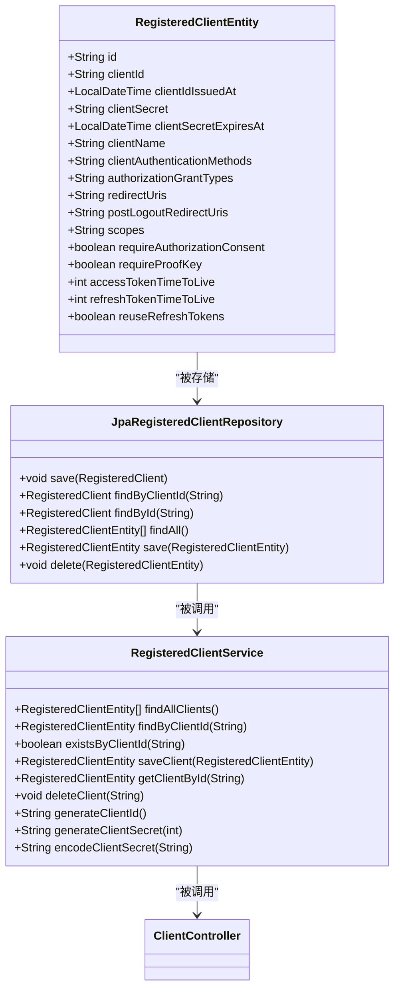
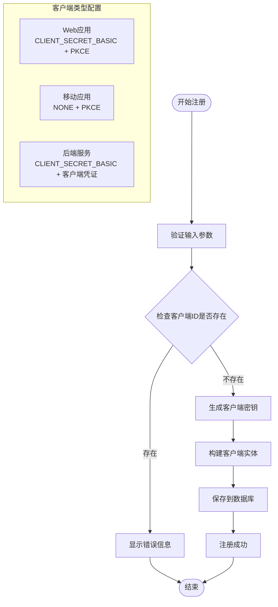
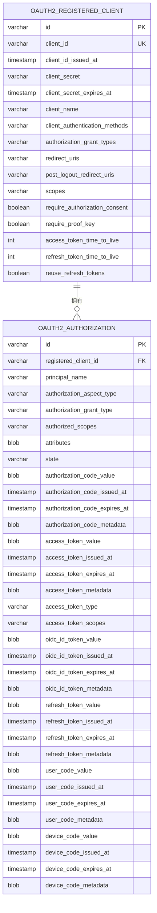
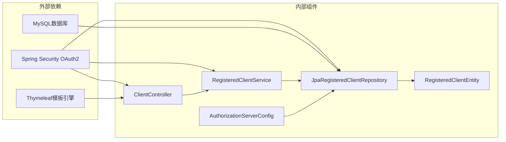

# OAuth2客户端实体设计

<cite>
**本文档引用的文件**
- [RegisteredClientEntity.java](file://src/main/java/com/example/authserver/entity/RegisteredClientEntity.java)
- [JpaRegisteredClientRepository.java](file://src/main/java/com/example/authserver/repository/JpaRegisteredClientRepository.java)
- [RegisteredClientService.java](file://src/main/java/com/example/authserver/service/RegisteredClientService.java)
- [ClientController.java](file://src/main/java/com/example/authserver/controller/ClientController.java)
- [AuthorizationServerConfig.java](file://src/main/java/com/example/authserver/config/AuthorizationServerConfig.java)
- [schema.sql](file://src/main/resources/schema.sql)
- [clients.html](file://src/main/resources/templates/admin/clients.html)
- [application.yml](file://src/main/resources/application.yml)
</cite>

## 目录
1. [简介](#简介)
2. [项目结构](#项目结构)
3. [核心组件](#核心组件)
4. [架构概览](#架构概览)
5. [详细组件分析](#详细组件分析)
6. [依赖关系分析](#依赖关系分析)
7. [性能考虑](#性能考虑)
8. [故障排除指南](#故障排除指南)
9. [结论](#结论)
10. [附录](#附录)

## 简介

本文档详细阐述了OAuth2授权服务器中RegisteredClientEntity实体的设计与实现。该实体是OAuth2客户端管理的核心数据模型，负责存储和管理所有OAuth2客户端的配置信息。本文档涵盖了客户端实体的完整字段定义、不同客户端类型的配置差异、认证方式的选择与配置、客户端生命周期管理以及完整的数据库表结构设计。

## 项目结构

该项目采用标准的Spring Boot分层架构，围绕OAuth2客户端管理构建了完整的功能体系：



**图表来源**
- [ClientController.java:1-360](file://src/main/java/com/example/authserver/controller/ClientController.java#L1-L360)
- [RegisteredClientService.java:1-131](file://src/main/java/com/example/authserver/service/RegisteredClientService.java#L1-L131)
- [JpaRegisteredClientRepository.java:1-289](file://src/main/java/com/example/authserver/repository/JpaRegisteredClientRepository.java#L1-L289)
- [RegisteredClientEntity.java:1-111](file://src/main/java/com/example/authserver/entity/RegisteredClientEntity.java#L1-L111)

**章节来源**
- [AuthServerApplication.java:1-14](file://src/main/java/com/example/authserver/AuthServerApplication.java#L1-L14)
- [application.yml:1-30](file://src/main/resources/application.yml#L1-L30)

## 核心组件

### RegisteredClientEntity实体

RegisteredClientEntity是OAuth2客户端管理的核心数据模型，采用扁平化设计以简化数据库存储和查询操作。该实体直接映射到oauth2_registered_client数据库表，实现了Spring Security OAuth2标准规范。

#### 核心字段定义

| 字段名称 | 数据类型 | 约束条件 | 描述 |
|---------|---------|---------|------|
| id | VARCHAR(100) | 主键, 唯一 | 客户端唯一标识符 |
| client_id | VARCHAR(100) | 非空, 唯一 | OAuth2客户端ID |
| client_id_issued_at | TIMESTAMP | 可空 | 客户端ID签发时间 |
| client_secret | VARCHAR(500) | 可空 | BCrypt加密的客户端密钥 |
| client_secret_expires_at | TIMESTAMP | 可空 | 客户端密钥过期时间 |
| client_name | VARCHAR(200) | 非空 | 客户端显示名称 |
| client_authentication_methods | VARCHAR(1000) | 非空 | 客户端认证方式列表 |
| authorization_grant_types | VARCHAR(1000) | 非空 | 授权类型列表 |
| redirect_uris | VARCHAR(1000) | 可空 | 重定向URI列表 |
| post_logout_redirect_uris | VARCHAR(1000) | 可空 | 登出后重定向URI列表 |
| scopes | VARCHAR(1000) | 非空 | 权限范围列表 |
| require_authorization_consent | BOOLEAN | 非空 | 是否需要用户授权同意 |
| require_proof_key | BOOLEAN | 非空 | 是否需要PKCE支持 |
| access_token_time_to_live | INT | 非空 | Access Token有效期(秒) |
| refresh_token_time_to_live | INT | 非空 | Refresh Token有效期(秒) |
| reuse_refresh_tokens | BOOLEAN | 非空 | 是否重复使用刷新令牌 |

**章节来源**
- [RegisteredClientEntity.java:14-111](file://src/main/java/com/example/authserver/entity/RegisteredClientEntity.java#L14-L111)
- [schema.sql:60-81](file://src/main/resources/schema.sql#L60-L81)

## 架构概览

OAuth2客户端管理系统采用分层架构设计，确保了良好的关注点分离和可维护性：



**图表来源**
- [ClientController.java:33-67](file://src/main/java/com/example/authserver/controller/ClientController.java#L33-L67)
- [RegisteredClientService.java:31-33](file://src/main/java/com/example/authserver/service/RegisteredClientService.java#L31-L33)
- [JpaRegisteredClientRepository.java:103-107](file://src/main/java/com/example/authserver/repository/JpaRegisteredClientRepository.java#L103-L107)

## 详细组件分析

### 数据模型设计

#### RegisteredClientEntity类结构



**图表来源**
- [RegisteredClientEntity.java:14-111](file://src/main/java/com/example/authserver/entity/RegisteredClientEntity.java#L14-L111)
- [JpaRegisteredClientRepository.java:21-289](file://src/main/java/com/example/authserver/repository/JpaRegisteredClientRepository.java#L21-L289)
- [RegisteredClientService.java:23-131](file://src/main/java/com/example/authserver/service/RegisteredClientService.java#L23-L131)

#### 客户端认证方式配置

系统支持多种OAuth2客户端认证方式，每种方式适用于不同的应用场景：

| 认证方式 | 适用场景 | 安全级别 | 配置要点 |
|---------|---------|---------|---------|
| CLIENT_SECRET_BASIC | Web应用 | 高 | HTTP Basic认证，需要客户端密钥 |
| CLIENT_SECRET_POST | Web应用 | 高 | POST请求传递客户端密钥 |
| NONE | 移动应用/公开客户端 | 中等 | 无需客户端密钥，依赖PKCE |
| PRIVATE_KEY_JWT | 服务间通信 | 最高 | 使用JWT令牌进行认证 |

**章节来源**
- [AuthorizationServerConfig.java:94-154](file://src/main/java/com/example/authserver/config/AuthorizationServerConfig.java#L94-L154)
- [ClientController.java:98-105](file://src/main/java/com/example/authserver/controller/ClientController.java#L98-L105)

### 客户端生命周期管理

#### 客户端注册流程



**图表来源**
- [ClientController.java:111-186](file://src/main/java/com/example/authserver/controller/ClientController.java#L111-L186)
- [AuthorizationServerConfig.java:94-154](file://src/main/java/com/example/authserver/config/AuthorizationServerConfig.java#L94-L154)

#### 客户端配置差异

系统预置了三种典型客户端类型的配置模板：

1. **Web应用客户端**
   - 支持授权码模式和刷新令牌模式
   - 使用HTTP Basic认证方式
   - 需要用户授权同意
   - Access Token有效期2小时，Refresh Token有效期7天

2. **移动应用客户端**
   - 使用公开客户端模式(NONE)
   - 强制启用PKCE保护
   - 支持自定义URI Scheme回调
   - Refresh Token有效期30天

3. **后端服务客户端**
   - 使用客户端凭证模式
   - 不需要用户授权同意
   - Access Token有效期30分钟
   - 适用于服务间安全通信

**章节来源**
- [AuthorizationServerConfig.java:94-154](file://src/main/java/com/example/authserver/config/AuthorizationServerConfig.java#L94-L154)

### 数据库表结构设计

#### oauth2_registered_client表结构



**图表来源**
- [schema.sql:60-141](file://src/main/resources/schema.sql#L60-L141)

**章节来源**
- [schema.sql:60-81](file://src/main/resources/schema.sql#L60-L81)

### 前端交互设计

#### 客户端管理界面

系统提供了完整的客户端管理界面，支持以下功能：

1. **客户端列表展示**
   - 显示客户端基本信息
   - 展示认证方式标签
   - 显示授权模式和权限范围
   - 提供操作按钮

2. **客户端创建向导**
   - 基本信息配置
   - 授权模式选择
   - 权限范围管理
   - 高级安全设置

3. **客户端编辑功能**
   - 动态表单验证
   - 实时配置预览
   - 安全设置调整

**章节来源**
- [clients.html:248-334](file://src/main/resources/templates/admin/clients.html#L248-L334)
- [clients.html:336-563](file://src/main/resources/templates/admin/clients.html#L336-L563)

## 依赖关系分析

### 组件耦合度分析



**图表来源**
- [JpaRegisteredClientRepository.java:8-12](file://src/main/java/com/example/authserver/repository/JpaRegisteredClientRepository.java#L8-L12)
- [AuthorizationServerConfig.java:27-34](file://src/main/java/com/example/authserver/config/AuthorizationServerConfig.java#L27-L34)

### 关键依赖关系

1. **Spring Security OAuth2集成**
   - 实现RegisteredClientRepository接口
   - 遵循OAuth2标准协议
   - 支持OpenID Connect扩展

2. **数据库持久化**
   - 使用JPA进行对象关系映射
   - 支持事务管理
   - 提供查询优化

3. **前端模板渲染**
   - 使用Thymeleaf进行服务端渲染
   - 支持响应式设计
   - 提供用户友好的交互体验

**章节来源**
- [JpaRegisteredClientRepository.java:21-289](file://src/main/java/com/example/authserver/repository/JpaRegisteredClientRepository.java#L21-L289)
- [AuthorizationServerConfig.java:44-77](file://src/main/java/com/example/authserver/config/AuthorizationServerConfig.java#L44-L77)

## 性能考虑

### 查询优化策略

1. **索引设计**
   - client_id字段建立唯一索引
   - 支持快速客户端ID查找
   - 减少数据库查询时间

2. **缓存策略**
   - 客户端配置缓存
   - 避免重复数据库查询
   - 提升系统响应速度

3. **批量操作**
   - 支持批量客户端查询
   - 减少网络往返次数
   - 优化用户体验

### 安全性能平衡

1. **密码加密成本**
   - BCrypt加密强度与性能平衡
   - 合理的迭代次数设置
   - 避免影响系统性能

2. **令牌有效期管理**
   - 动态令牌过期检查
   - 定期清理过期令牌
   - 优化数据库存储空间

## 故障排除指南

### 常见问题诊断

#### 客户端ID冲突

**问题症状**: 创建客户端时提示ID已存在
**解决方案**: 
1. 检查客户端ID唯一性
2. 使用自动生成的客户端ID
3. 验证数据库唯一约束

#### 认证方式配置错误

**问题症状**: 客户端无法正常认证
**解决方案**:
1. 确认客户端认证方式设置
2. 验证客户端密钥配置
3. 检查PKCE支持状态

#### 授权模式不支持

**问题症状**: OAuth2授权失败
**解决方案**:
1. 检查授权模式配置
2. 验证重定向URI设置
3. 确认权限范围分配

**章节来源**
- [ClientController.java:116-121](file://src/main/java/com/example/authserver/controller/ClientController.java#L116-L121)
- [ClientController.java:273-296](file://src/main/java/com/example/authserver/controller/ClientController.java#L273-L296)

### 数据库连接问题

**问题症状**: 客户端管理功能异常
**排查步骤**:
1. 检查数据库连接配置
2. 验证schema.sql执行情况
3. 确认表结构完整性

**章节来源**
- [application.yml:4-24](file://src/main/resources/application.yml#L4-L24)
- [schema.sql:1-194](file://src/main/resources/schema.sql#L1-L194)

## 结论

OAuth2客户端实体设计体现了现代微服务架构中身份认证与授权管理的最佳实践。通过扁平化的数据模型设计、完善的生命周期管理和灵活的配置选项，该系统能够满足从简单Web应用到复杂企业级服务的各种OAuth2客户端需求。

### 设计优势

1. **标准化兼容**: 完全符合Spring Security OAuth2标准
2. **灵活性强**: 支持多种客户端类型和认证方式
3. **安全性高**: 内置PKCE支持和密码加密机制
4. **易维护**: 清晰的分层架构和完善的错误处理

### 扩展建议

1. **监控告警**: 添加客户端使用情况监控
2. **审计日志**: 完善客户端变更审计功能
3. **API接口**: 提供RESTful API支持自动化管理
4. **配置中心**: 集成外部配置管理工具

## 附录

### 开发者指南

#### 快速开始

1. **环境准备**
   - Java 17+
   - MySQL 8.0+
   - Maven 3.8+

2. **数据库初始化**
   ```sql
   -- 执行schema.sql初始化数据库
   -- 配置application.yml中的数据库连接
   ```

3. **启动应用**
   ```bash
   mvn spring-boot:run
   ```

#### 常用配置项

| 配置项 | 默认值 | 说明 |
|-------|--------|------|
| server.port | 9000 | 应用监听端口 |
| spring.datasource.url | jdbc:mysql://localhost:6666/auth_server | 数据库连接URL |
| spring.jpa.hibernate.ddl-auto | update | Hibernate DDL自动更新模式 |
| logging.level.org.springframework.security | INFO | 安全框架日志级别 |

**章节来源**
- [application.yml:1-30](file://src/main/resources/application.yml#L1-L30)