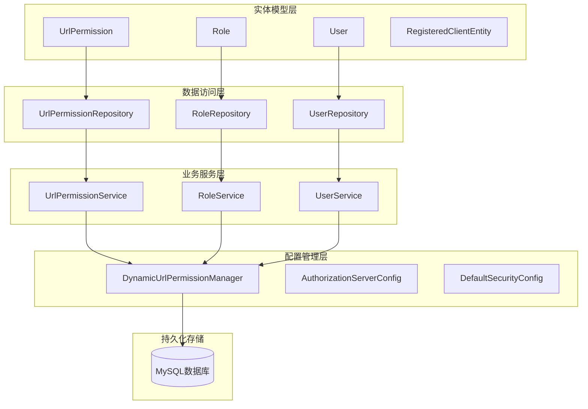
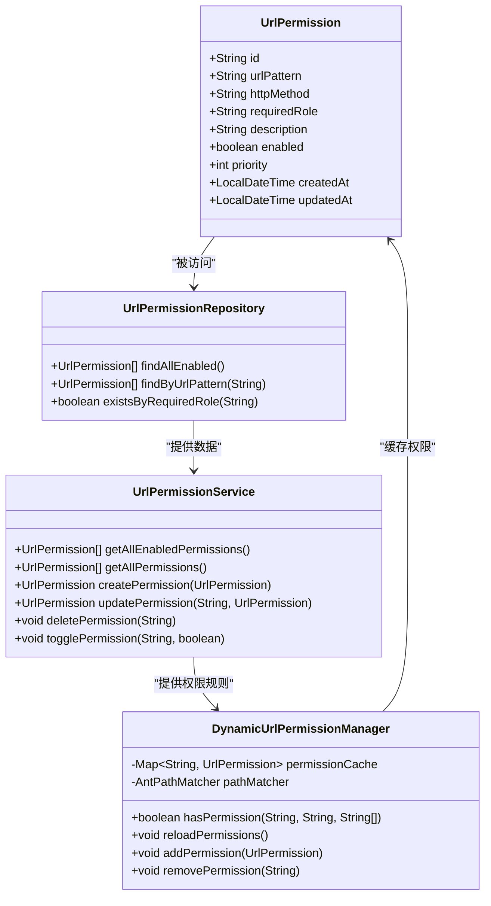
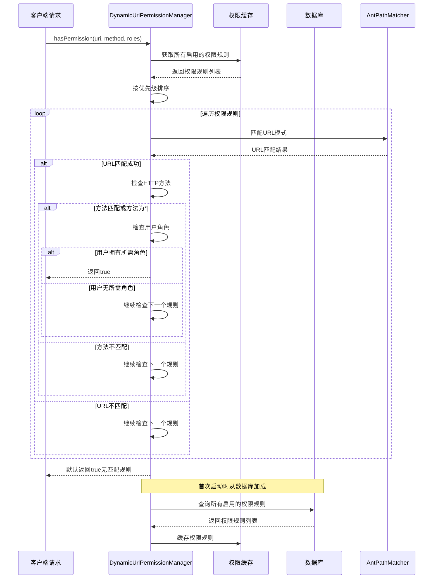
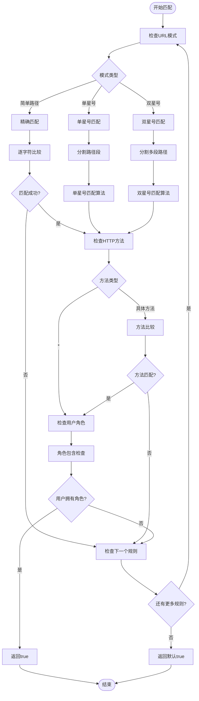
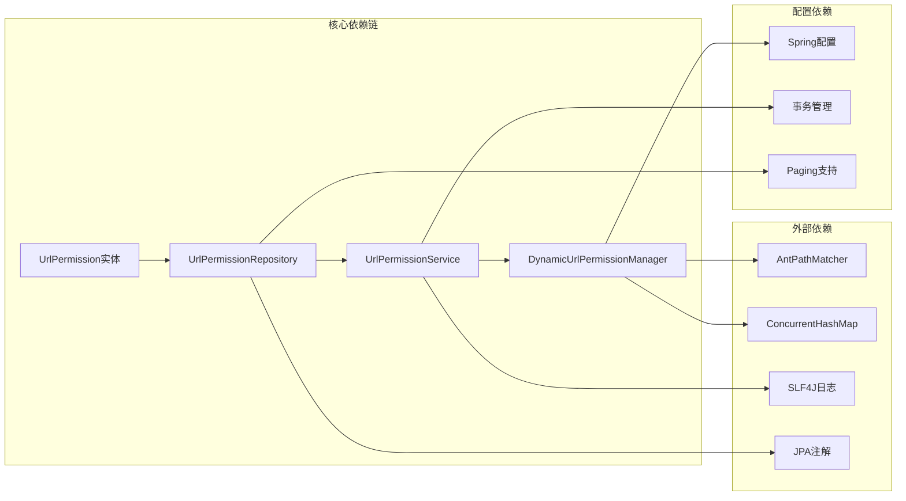

# URL权限实体设计

<cite>
**本文档引用的文件**
- [UrlPermission.java](file://src/main/java/com/example/authserver/entity/UrlPermission.java)
- [UrlPermissionRepository.java](file://src/main/java/com/example/authserver/repository/UrlPermissionRepository.java)
- [UrlPermissionService.java](file://src/main/java/com/example/authserver/service/UrlPermissionService.java)
- [DynamicUrlPermissionManager.java](file://src/main/java/com/example/authserver/config/DynamicUrlPermissionManager.java)
- [schema.sql](file://src/main/resources/schema.sql)
- [application.yml](file://src/main/resources/application.yml)
</cite>

## 目录
1. [简介](#简介)
2. [项目结构](#项目结构)
3. [核心组件](#核心组件)
4. [架构概览](#架构概览)
5. [详细组件分析](#详细组件分析)
6. [依赖关系分析](#依赖关系分析)
7. [性能考虑](#性能考虑)
8. [故障排除指南](#故障排除指南)
9. [结论](#结论)

## 简介

本文档详细阐述了URL权限实体的设计原理和在动态权限管理系统中的关键作用。URL权限实体是Spring Authorization Server中的核心组件，负责动态配置和管理基于URL模式的访问控制规则。该系统通过灵活的通配符匹配机制和优先级处理，实现了细粒度的权限控制，支持实时的权限规则更新和动态加载。

## 项目结构

动态权限管理系统采用分层架构设计，主要包含以下核心模块：

**图表来源**
- [UrlPermission.java:1-73](file://src/main/java/com/example/authserver/entity/UrlPermission.java#L1-L73)
- [UrlPermissionRepository.java:1-32](file://src/main/java/com/example/authserver/repository/UrlPermissionRepository.java#L1-L32)
- [UrlPermissionService.java:1-94](file://src/main/java/com/example/authserver/service/UrlPermissionService.java#L1-L94)
- [DynamicUrlPermissionManager.java:1-120](file://src/main/java/com/example/authserver/config/DynamicUrlPermissionManager.java#L1-L120)

**章节来源**
- [application.yml:1-30](file://src/main/resources/application.yml#L1-L30)

## 核心组件

### URL权限实体设计

URL权限实体是动态权限系统的核心数据模型，采用JPA注解进行持久化映射：

**图表来源**
- [UrlPermission.java:14-71](file://src/main/java/com/example/authserver/entity/UrlPermission.java#L14-L71)
- [UrlPermissionRepository.java:14-31](file://src/main/java/com/example/authserver/repository/UrlPermissionRepository.java#L14-L31)
- [UrlPermissionService.java:18-93](file://src/main/java/com/example/authserver/service/UrlPermissionService.java#L18-L93)
- [DynamicUrlPermissionManager.java:23-119](file://src/main/java/com/example/authserver/config/DynamicUrlPermissionManager.java#L23-L119)

### 数据库表结构

URL权限规则表采用MySQL存储，具备完整的约束和索引设计：

| 字段名 | 数据类型 | 约束条件 | 描述 |
|--------|----------|----------|------|
| id | varchar(100) | NOT NULL, PRIMARY KEY | 权限规则唯一标识 |
| url_pattern | varchar(500) | NOT NULL | URL路径模式（支持通配符） |
| http_method | varchar(20) | NOT NULL, DEFAULT '*' | HTTP方法（GET/POST/PUT/DELETE/*） |
| required_role | varchar(100) | NOT NULL | 所需角色标识 |
| description | varchar(255) | NULL | 规则描述信息 |
| enabled | boolean | NOT NULL, DEFAULT true | 是否启用权限规则 |
| priority | int | NOT NULL, DEFAULT 0 | 优先级数值（越大优先级越高） |
| created_at | timestamp | DEFAULT CURRENT_TIMESTAMP | 创建时间 |
| updated_at | timestamp | DEFAULT CURRENT_TIMESTAMP ON UPDATE CURRENT_TIMESTAMP | 更新时间 |

**章节来源**
- [schema.sql:42-56](file://src/main/resources/schema.sql#L42-L56)

## 架构概览

动态权限管理系统采用"缓存+匹配"的架构模式，实现了高性能的权限验证：

**图表来源**
- [DynamicUrlPermissionManager.java:64-95](file://src/main/java/com/example/authserver/config/DynamicUrlPermissionManager.java#L64-L95)
- [UrlPermissionRepository.java:19-20](file://src/main/java/com/example/authserver/repository/UrlPermissionRepository.java#L19-L20)

## 详细组件分析

### URL权限实体字段详解

#### 核心字段定义

**权限标识 (id)**
- 类型：UUID字符串
- 长度：100字符
- 约束：非空、唯一、主键
- 用途：唯一标识每个权限规则

**URL模式 (urlPattern)**
- 类型：字符串
- 长度：500字符
- 约束：非空
- 支持的通配符：
  - `*`：匹配单个路径段
  - `**`：匹配多个路径段（包括子目录）
  - 示例：`/admin/**`、`/api/users/*`

**HTTP方法 (httpMethod)**
- 类型：字符串
- 长度：20字符
- 默认值：`*`（表示所有方法）
- 可选值：`GET`、`POST`、`PUT`、`DELETE`、`*`
- 用途：限制特定HTTP方法的访问

**所需角色 (requiredRole)**
- 类型：字符串
- 长度：100字符
- 约束：非空
- 示例：`ROLE_ADMIN`、`ROLE_USER`
- 用途：指定访问该URL所需的最小角色级别

**优先级 (priority)**
- 类型：整数
- 默认值：0
- 约束：非空
- 规则：数值越大优先级越高
- 用途：解决URL模式冲突时的决策依据

#### 辅助字段

**启用状态 (enabled)**
- 类型：布尔值
- 默认值：true
- 用途：控制权限规则的激活状态

**描述信息 (description)**
- 类型：字符串
- 长度：255字符
- 用途：权限规则的功能描述

**时间戳字段**
- `createdAt`：创建时间（不可更新）
- `updatedAt`：更新时间（自动维护）

### URL模式匹配机制

系统采用Ant Path风格的通配符匹配算法：

**图表来源**
- [DynamicUrlPermissionManager.java:86-95](file://src/main/java/com/example/authserver/config/DynamicUrlPermissionManager.java#L86-L95)

### 权限验证流程

权限验证采用"优先级排序 + 早期退出"的优化策略：

1. **规则加载**：系统启动时从数据库加载所有启用的权限规则
2. **缓存构建**：将权限规则存储在并发哈希表中，支持高并发访问
3. **排序处理**：按优先级降序排列，确保高优先级规则优先匹配
4. **逐规则匹配**：依次检查每个规则的URL模式和HTTP方法
5. **角色验证**：匹配成功后验证用户是否拥有所需角色
6. **结果返回**：返回最终的权限验证结果

### 权限继承与组合

虽然URL权限实体本身不直接实现继承关系，但通过以下机制实现权限的组合效果：

**角色继承机制**
- 用户可以拥有多个角色
- 权限验证时检查用户是否包含所需角色
- 支持基于角色的权限继承和组合

**优先级继承机制**
- 高优先级规则覆盖低优先级规则
- 解决URL模式冲突时的决策依据
- 支持精细化的权限控制层次

**章节来源**
- [DynamicUrlPermissionManager.java:64-81](file://src/main/java/com/example/authserver/config/DynamicUrlPermissionManager.java#L64-L81)

## 依赖关系分析

### 组件耦合度分析

**图表来源**
- [DynamicUrlPermissionManager.java:25-31](file://src/main/java/com/example/authserver/config/DynamicUrlPermissionManager.java#L25-L31)
- [UrlPermissionService.java:20-21](file://src/main/java/com/example/authserver/service/UrlPermissionService.java#L20-L21)

### 性能特征

**内存使用**
- 权限规则缓存在内存中，避免频繁的数据库查询
- 使用ConcurrentHashMap支持高并发读取
- 内存占用与权限规则数量成正比

**查询性能**
- 数据库查询使用索引优化
- `ix_url_pattern`索引加速URL模式查找
- `ix_enabled`索引优化启用状态过滤
- 缓存命中率高，减少数据库负载

**匹配性能**
- AntPathMatcher提供高效的路径匹配算法
- 优先级排序确保快速匹配到合适的规则
- 早期退出机制避免不必要的匹配操作

**章节来源**
- [schema.sql:54-55](file://src/main/resources/schema.sql#L54-L55)
- [DynamicUrlPermissionManager.java:28-31](file://src/main/java/com/example/authserver/config/DynamicUrlPermissionManager.java#L28-L31)

## 性能考虑

### 缓存策略

系统采用两级缓存机制：
1. **应用级缓存**：内存中的权限规则缓存
2. **数据库索引**：MySQL索引优化查询性能

### 优化建议

**索引优化**
- 确保URL模式和启用状态字段建立适当索引
- 定期分析查询执行计划，优化慢查询

**内存优化**
- 监控权限规则数量，避免过多的规则导致内存压力
- 实现缓存清理机制，定期清理无效的权限规则

**并发优化**
- 使用线程安全的数据结构
- 避免在高并发场景下频繁修改权限规则

## 故障排除指南

### 常见问题诊断

**权限规则不生效**
1. 检查权限规则的启用状态
2. 验证URL模式的正确性
3. 确认HTTP方法的匹配情况
4. 核实用户角色的分配情况

**匹配结果异常**
1. 检查权限规则的优先级设置
2. 验证URL模式的通配符使用
3. 确认AntPathMatcher的匹配逻辑

**性能问题**
1. 监控缓存命中率
2. 分析数据库查询性能
3. 检查并发访问情况

### 调试技巧

**日志分析**
- 启用DEBUG级别的权限匹配日志
- 监控权限验证的执行时间和结果
- 分析权限规则的匹配顺序

**监控指标**
- 权限验证成功率
- 缓存命中率
- 数据库查询响应时间

**章节来源**
- [DynamicUrlPermissionManager.java:72-80](file://src/main/java/com/example/authserver/config/DynamicUrlPermissionManager.java#L72-L80)

## 结论

URL权限实体设计体现了现代动态权限管理系统的核心理念：灵活性、可扩展性和高性能。通过精心设计的数据模型、高效的匹配算法和智能的缓存策略，系统能够满足复杂的企业级权限控制需求。

**设计优势**
- **灵活性**：支持多种通配符模式和HTTP方法组合
- **可扩展性**：基于优先级的规则继承机制
- **高性能**：内存缓存和索引优化的查询机制
- **易维护性**：清晰的职责分离和模块化设计

**应用场景**
- 企业级Web应用的细粒度权限控制
- 微服务架构下的API网关权限管理
- 多租户系统的动态权限配置
- 实时权限规则变更的业务场景

该设计为构建健壮、可维护的动态权限系统提供了坚实的基础，能够适应不断变化的业务需求和技术演进。