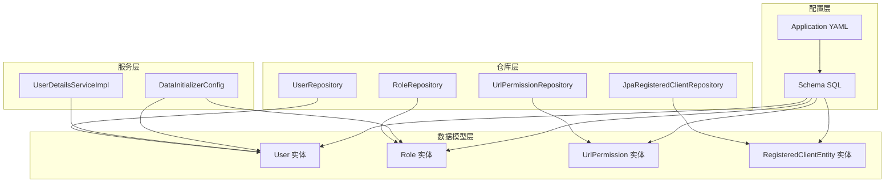
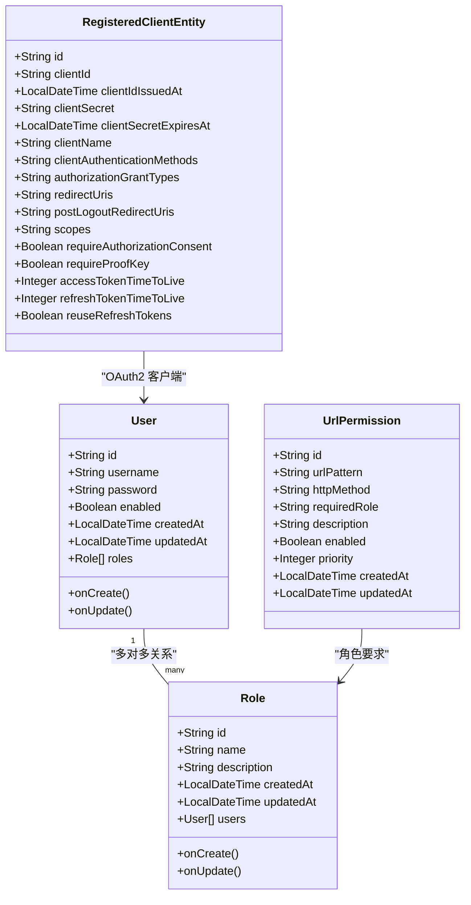
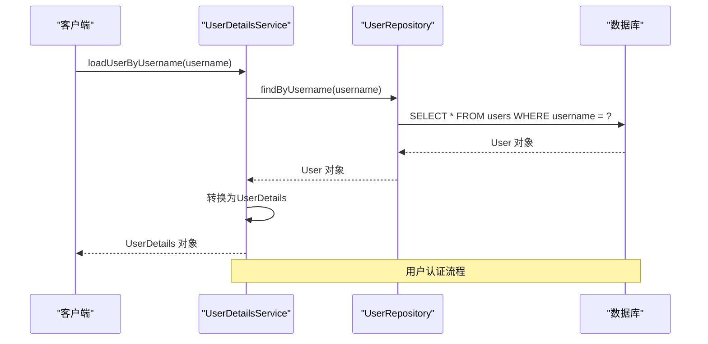
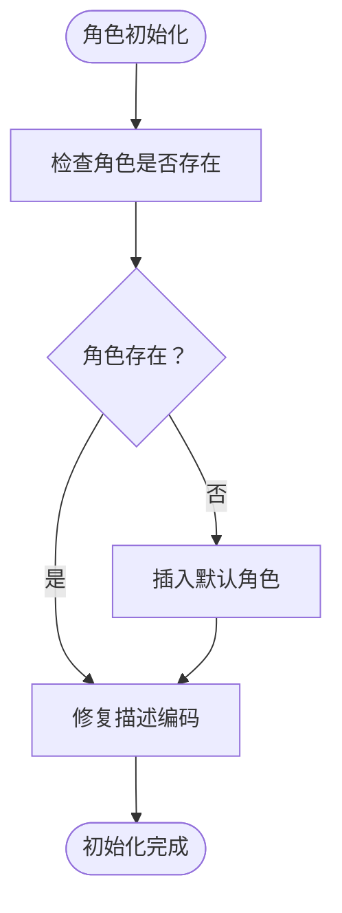
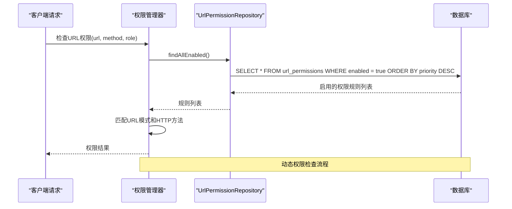
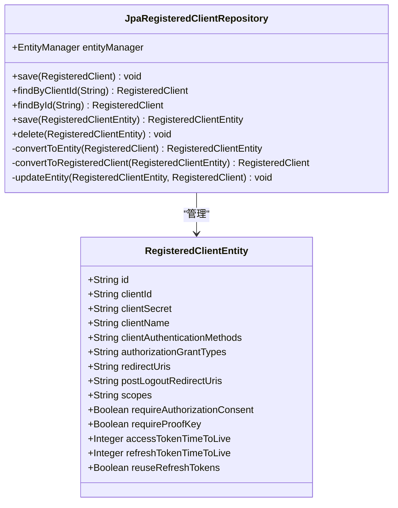
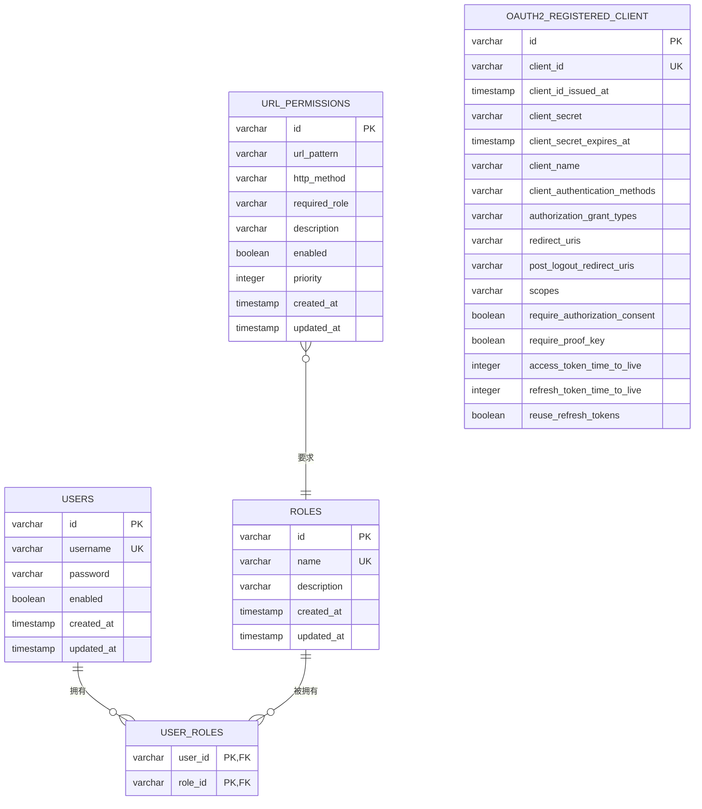
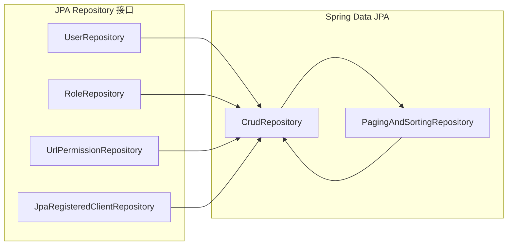

# 数据模型设计

<cite>
**本文档引用的文件**
- [User.java](file://src/main/java/com/example/authserver/entity/User.java)
- [Role.java](file://src/main/java/com/example/authserver/entity/Role.java)
- [UrlPermission.java](file://src/main/java/com/example/authserver/entity/UrlPermission.java)
- [RegisteredClientEntity.java](file://src/main/java/com/example/authserver/entity/RegisteredClientEntity.java)
- [UserRepository.java](file://src/main/java/com/example/authserver/repository/UserRepository.java)
- [RoleRepository.java](file://src/main/java/com/example/authserver/repository/RoleRepository.java)
- [UrlPermissionRepository.java](file://src/main/java/com/example/authserver/repository/UrlPermissionRepository.java)
- [JpaRegisteredClientRepository.java](file://src/main/java/com/example/authserver/repository/JpaRegisteredClientRepository.java)
- [UserDetailsServiceImpl.java](file://src/main/java/com/example/authserver/service/UserDetailsServiceImpl.java)
- [DataInitializerConfig.java](file://src/main/java/com/example/authserver/config/DataInitializerConfig.java)
- [schema.sql](file://src/main/resources/schema.sql)
- [application.yml](file://src/main/resources/application.yml)
</cite>

## 目录
1. [简介](#简介)
2. [项目结构](#项目结构)
3. [核心组件](#核心组件)
4. [架构概览](#架构概览)
5. [详细组件分析](#详细组件分析)
6. [依赖关系分析](#依赖关系分析)
7. [性能考虑](#性能考虑)
8. [故障排除指南](#故障排除指南)
9. [结论](#结论)
10. [附录](#附录)

## 简介
本文件为认证服务器的数据模型设计文档，详细描述了系统中所有实体类的字段定义、数据类型、约束条件和业务含义。重点解释了User、Role、UrlPermission、RegisteredClientEntity之间的关系和关联映射，并提供了完整的数据库表结构说明，包括主键、外键、索引设计。同时说明了JPA注解的使用和实体生命周期管理，包含数据验证规则、业务逻辑约束和数据完整性保证措施。文档最后提供了实体关系图和数据字典，帮助开发者理解数据模型的设计思路。

## 项目结构
认证服务器采用标准的分层架构，数据模型位于entity包中，对应的仓库接口位于repository包，服务层位于service包，配置信息位于config包。

**图表来源**
- [User.java:1-66](file://src/main/java/com/example/authserver/entity/User.java#L1-L66)
- [Role.java:1-62](file://src/main/java/com/example/authserver/entity/Role.java#L1-L62)
- [UrlPermission.java:1-73](file://src/main/java/com/example/authserver/entity/UrlPermission.java#L1-L73)
- [RegisteredClientEntity.java:1-111](file://src/main/java/com/example/authserver/entity/RegisteredClientEntity.java#L1-L111)

**章节来源**
- [User.java:1-66](file://src/main/java/com/example/authserver/entity/User.java#L1-L66)
- [Role.java:1-62](file://src/main/java/com/example/authserver/entity/Role.java#L1-L62)
- [UrlPermission.java:1-73](file://src/main/java/com/example/authserver/entity/UrlPermission.java#L1-L73)
- [RegisteredClientEntity.java:1-111](file://src/main/java/com/example/authserver/entity/RegisteredClientEntity.java#L1-L111)

## 核心组件
本系统包含四个核心实体类，它们构成了认证服务器的基础数据模型：

### User 实体
User实体代表系统中的用户账户，采用UUID作为主键，支持用户名唯一性约束，包含密码加密存储和启用状态管理。

### Role 实体  
Role实体代表系统的角色概念，同样使用UUID主键，角色名称具有唯一性约束，支持角色描述和时间戳管理。

### UrlPermission 实体
UrlPermission实体用于动态配置URL访问权限，支持通配符URL模式、HTTP方法限制、角色要求和优先级排序。

### RegisteredClientEntity 实体
RegisteredClientEntity实体存储OAuth2客户端注册信息，采用扁平化设计，直接映射Spring Authorization Server的标准字段。

**章节来源**
- [User.java:17-66](file://src/main/java/com/example/authserver/entity/User.java#L17-L66)
- [Role.java:17-62](file://src/main/java/com/example/authserver/entity/Role.java#L17-L62)
- [UrlPermission.java:7-73](file://src/main/java/com/example/authserver/entity/UrlPermission.java#L7-L73)
- [RegisteredClientEntity.java:8-111](file://src/main/java/com/example/authserver/entity/RegisteredClientEntity.java#L8-L111)

## 架构概览
系统采用JPA/Hibernate作为ORM框架，结合Spring Data JPA简化数据访问层开发。实体间的关系通过JPA注解进行声明式映射。

**图表来源**
- [User.java:20-66](file://src/main/java/com/example/authserver/entity/User.java#L20-L66)
- [Role.java:20-62](file://src/main/java/com/example/authserver/entity/Role.java#L20-L62)
- [UrlPermission.java:11-73](file://src/main/java/com/example/authserver/entity/UrlPermission.java#L11-L73)
- [RegisteredClientEntity.java:11-111](file://src/main/java/com/example/authserver/entity/RegisteredClientEntity.java#L11-L111)

## 详细组件分析

### User 实体详细分析
User实体是系统的核心身份认证实体，采用以下设计特点：

#### 字段定义与约束
- **id**: UUID类型，主键，长度100字符，不可为空且唯一
- **username**: 文本类型，长度50字符，唯一约束，用于登录凭证
- **password**: 文本类型，长度500字符，存储BCrypt加密后的密码
- **enabled**: 布尔类型，默认true，控制用户账户启用状态
- **createdAt/updatedAt**: 时间戳类型，自动管理创建和更新时间

#### 关系映射
- **多对多关系**: 与Role实体建立EAGER加载的多对多关系
- **关联表**: 通过user_roles中间表实现用户-角色关联
- **联合主键**: (user_id, role_id)，确保关系唯一性

#### 生命周期管理
- **@PrePersist**: 自动设置创建时间和更新时间
- **@PreUpdate**: 更新时仅更新更新时间

**图表来源**
- [UserDetailsServiceImpl.java:29-57](file://src/main/java/com/example/authserver/service/UserDetailsServiceImpl.java#L29-L57)
- [UserRepository.java:16-43](file://src/main/java/com/example/authserver/repository/UserRepository.java#L16-L43)

**章节来源**
- [User.java:20-66](file://src/main/java/com/example/authserver/entity/User.java#L20-L66)
- [UserRepository.java:16-43](file://src/main/java/com/example/authserver/repository/UserRepository.java#L16-L43)
- [UserDetailsServiceImpl.java:29-57](file://src/main/java/com/example/authserver/service/UserDetailsServiceImpl.java#L29-L57)

### Role 实体详细分析
Role实体代表系统的角色概念，支持RBAC权限控制的基础。

#### 字段定义与约束
- **id**: UUID类型，主键，长度100字符，唯一约束
- **name**: 文本类型，长度50字符，唯一约束，如ROLE_USER、ROLE_ADMIN
- **description**: 文本类型，长度255字符，角色功能描述
- **createdAt/updatedAt**: 时间戳类型，自动时间戳管理

#### 关系映射
- **双向多对多**: 通过mappedBy属性实现与User实体的反向映射
- **懒加载**: FetchType.LAZY优化性能，避免不必要的关联加载
- **用户集合**: 反向维护用户列表，便于查询拥有特定角色的用户

#### 业务逻辑
- **角色初始化**: 通过DataInitializerConfig确保ROLE_USER和ROLE_ADMIN存在
- **角色修复**: 自动修复中文描述的编码问题

**图表来源**
- [DataInitializerConfig.java:45-67](file://src/main/java/com/example/authserver/config/DataInitializerConfig.java#L45-L67)

**章节来源**
- [Role.java:20-62](file://src/main/java/com/example/authserver/entity/Role.java#L20-L62)
- [RoleRepository.java:16-44](file://src/main/java/com/example/authserver/repository/RoleRepository.java#L16-L44)
- [DataInitializerConfig.java:45-67](file://src/main/java/com/example/authserver/config/DataInitializerConfig.java#L45-L67)

### UrlPermission 实体详细分析
UrlPermission实体提供动态URL权限控制能力，支持复杂的权限规则配置。

#### 字段定义与约束
- **id**: UUID类型，主键，长度100字符
- **urlPattern**: 文本类型，长度500字符，支持通配符模式
- **httpMethod**: 文本类型，长度20字符，默认*表示所有方法
- **requiredRole**: 文本类型，长度100字符，指定所需角色
- **description**: 文本类型，长度255字符，规则描述
- **enabled**: 布尔类型，默认true，控制规则启用状态
- **priority**: 整数类型，默认0，数字越大优先级越高

#### 查询策略
- **启用规则查询**: 默认查询所有启用的规则，按优先级降序排列
- **模式匹配**: 支持LIKE操作符进行URL模式模糊匹配
- **角色检查**: 提供existsByRequiredRole方法检查角色权限存在性

#### 动态权限管理
- **优先级机制**: 解决URL模式冲突时的优先级选择
- **通配符支持**: 支持/**和/*等通配符模式
- **HTTP方法限制**: 可精确到HTTP方法级别的权限控制

**图表来源**
- [UrlPermissionRepository.java:19-31](file://src/main/java/com/example/authserver/repository/UrlPermissionRepository.java#L19-L31)
- [UrlPermission.java:11-73](file://src/main/java/com/example/authserver/entity/UrlPermission.java#L11-L73)

**章节来源**
- [UrlPermission.java:11-73](file://src/main/java/com/example/authserver/entity/UrlPermission.java#L11-L73)
- [UrlPermissionRepository.java:14-31](file://src/main/java/com/example/authserver/repository/UrlPermissionRepository.java#L14-L31)

### RegisteredClientEntity 实体详细分析
RegisteredClientEntity实体存储OAuth2客户端注册信息，采用扁平化设计以提高查询性能。

#### 字段定义与约束
- **id**: UUID类型，主键，长度100字符
- **clientId**: 文本类型，长度100字符，OAuth2客户端标识符
- **clientSecret**: 文本类型，长度500字符，BCrypt加密的客户端密钥
- **clientName**: 文本类型，长度200字符，客户端显示名称
- **clientAuthenticationMethods**: 文本类型，长度1000字符，逗号分隔的认证方法列表
- **authorizationGrantTypes**: 文本类型，长度1000字符，逗号分隔的授权类型列表
- **redirectUris**: 文本类型，长度1000字符，逗号分隔的重定向URI列表
- **scopes**: 文本类型，长度1000字符，逗号分隔的权限范围列表

#### Token配置
- **accessTokenTimeToLive**: 整数类型，默认7200秒（2小时）
- **refreshTokenTimeToLive**: 整数类型，默认604800秒（7天）
- **reuseRefreshTokens**: 布尔类型，默认false

#### 客户端特性
- **requireAuthorizationConsent**: 布尔类型，默认false
- **requireProofKey**: 布尔类型，默认false

#### JPA实现特点
- **EntityManager**: 直接使用EntityManager进行复杂操作
- **merge策略**: 统一使用merge而非persist，因为ID已在保存前设置
- **类型转换**: 处理Instant与LocalDateTime之间的转换

**图表来源**
- [JpaRegisteredClientRepository.java:21-289](file://src/main/java/com/example/authserver/repository/JpaRegisteredClientRepository.java#L21-L289)
- [RegisteredClientEntity.java:11-111](file://src/main/java/com/example/authserver/entity/RegisteredClientEntity.java#L11-L111)

**章节来源**
- [RegisteredClientEntity.java:11-111](file://src/main/java/com/example/authserver/entity/RegisteredClientEntity.java#L11-L111)
- [JpaRegisteredClientRepository.java:21-289](file://src/main/java/com/example/authserver/repository/JpaRegisteredClientRepository.java#L21-L289)

## 依赖关系分析

### 实体关系图
系统中的实体关系体现了典型的RBAC权限模型和OAuth2客户端管理。

**图表来源**
- [schema.sql:8-81](file://src/main/resources/schema.sql#L8-L81)
- [User.java:48-50](file://src/main/java/com/example/authserver/entity/User.java#L48-L50)
- [Role.java:45-46](file://src/main/java/com/example/authserver/entity/Role.java#L45-L46)
- [UrlPermission.java:39-40](file://src/main/java/com/example/authserver/entity/UrlPermission.java#L39-L40)

### 仓库接口关系
各仓库接口继承自JpaRepository，提供标准的数据访问操作。

**图表来源**
- [UserRepository.java:15-43](file://src/main/java/com/example/authserver/repository/UserRepository.java#L15-L43)
- [RoleRepository.java:15-44](file://src/main/java/com/example/authserver/repository/RoleRepository.java#L15-L44)
- [UrlPermissionRepository.java:14-31](file://src/main/java/com/example/authserver/repository/UrlPermissionRepository.java#L14-L31)

**章节来源**
- [schema.sql:8-81](file://src/main/resources/schema.sql#L8-L81)
- [UserRepository.java:15-43](file://src/main/java/com/example/authserver/repository/UserRepository.java#L15-L43)
- [RoleRepository.java:15-44](file://src/main/java/com/example/authserver/repository/RoleRepository.java#L15-L44)
- [UrlPermissionRepository.java:14-31](file://src/main/java/com/example/authserver/repository/UrlPermissionRepository.java#L14-L31)

## 性能考虑
系统在设计时充分考虑了性能优化：

### 索引设计
- **users表**: username字段唯一索引，提升用户查询性能
- **roles表**: name字段唯一索引，确保角色唯一性
- **user_roles表**: 联合主键，避免重复关系
- **url_permissions表**: url_pattern和enabled字段索引，优化权限查询

### 查询优化
- **EAGER vs LAZY**: User实体使用EAGER加载角色，减少N+1查询问题
- **批量查询**: RoleRepository提供统计查询，减少循环查询
- **时间戳管理**: 自动时间戳减少应用层处理开销

### 缓存策略
- **角色加载**: UserDetailsService使用事务性读取，避免重复查询
- **客户端管理**: JpaRegisteredClientRepository统一使用merge策略

## 故障排除指南

### 常见问题及解决方案

#### 用户认证失败
**问题**: 用户无法登录，提示用户名不存在
**原因**: 用户名大小写敏感或用户未正确初始化
**解决方案**: 
1. 检查DataInitializerConfig是否正确执行
2. 验证用户表中是否存在对应用户记录
3. 确认密码是否正确加密

#### 角色权限异常
**问题**: 用户登录但无相应权限
**原因**: 角色关联关系缺失或角色名称不匹配
**解决方案**:
1. 检查user_roles关联表数据
2. 验证角色名称是否与UrlPermission.requiredRole一致
3. 确认角色描述编码问题

#### OAuth2客户端配置错误
**问题**: OAuth2授权失败
**原因**: 客户端配置不完整或字段格式错误
**解决方案**:
1. 检查RegisteredClientEntity字段完整性
2. 验证逗号分隔的字符串格式
3. 确认时间戳转换正确性

**章节来源**
- [DataInitializerConfig.java:73-95](file://src/main/java/com/example/authserver/config/DataInitializerConfig.java#L73-L95)
- [UserDetailsServiceImpl.java:31-57](file://src/main/java/com/example/authserver/service/UserDetailsServiceImpl.java#L31-L57)

## 结论
本数据模型设计充分体现了现代认证服务器的核心需求：用户身份管理、角色权限控制、动态URL权限配置和OAuth2客户端管理。通过UUID主键设计确保了分布式环境下的唯一性，通过JPA注解实现了清晰的实体关系映射，通过自动时间戳管理简化了数据生命周期维护。

系统的关键优势包括：
- **清晰的职责分离**: 实体、仓库、服务层职责明确
- **灵活的权限控制**: 支持动态URL权限配置和优先级机制
- **完善的生命周期管理**: 自动时间戳和实体状态管理
- **高性能设计**: 合理的索引设计和查询优化策略

建议在生产环境中重点关注：
- 数据库连接池配置和性能监控
- 密码加密强度和轮换策略
- OAuth2客户端密钥的安全存储
- 权限规则的定期审计和清理

## 附录

### 数据字典

#### 用户表 (users)
| 字段名 | 数据类型 | 约束 | 描述 |
|--------|----------|------|------|
| id | varchar(100) | PK, NOT NULL, UNIQUE | 用户唯一标识 |
| username | varchar(50) | NOT NULL, UNIQUE | 用户名（登录名） |
| password | varchar(500) | NOT NULL | 密码（BCrypt加密） |
| enabled | boolean | NOT NULL | 是否启用 |
| created_at | timestamp | DEFAULT CURRENT_TIMESTAMP | 创建时间 |
| updated_at | timestamp | DEFAULT CURRENT_TIMESTAMP ON UPDATE CURRENT_TIMESTAMP | 更新时间 |

#### 角色表 (roles)
| 字段名 | 数据类型 | 约束 | 描述 |
|--------|----------|------|------|
| id | varchar(100) | PK, NOT NULL, UNIQUE | 角色唯一标识 |
| name | varchar(50) | NOT NULL, UNIQUE | 角色名称（如：ROLE_USER） |
| description | varchar(255) | NULL | 角色描述 |
| created_at | timestamp | DEFAULT CURRENT_TIMESTAMP | 创建时间 |
| updated_at | timestamp | DEFAULT CURRENT_TIMESTAMP ON UPDATE CURRENT_TIMESTAMP | 更新时间 |

#### 用户-角色关联表 (user_roles)
| 字段名 | 数据类型 | 约束 | 描述 |
|--------|----------|------|------|
| user_id | varchar(100) | PK, FK | 用户ID |
| role_id | varchar(100) | PK, FK | 角色ID |

#### URL权限规则表 (url_permissions)
| 字段名 | 数据类型 | 约束 | 描述 |
|--------|----------|------|------|
| id | varchar(100) | PK, NOT NULL, UNIQUE | 权限规则唯一标识 |
| url_pattern | varchar(500) | NOT NULL | URL路径模式（支持通配符） |
| http_method | varchar(20) | NOT NULL, DEFAULT '*' | HTTP方法 |
| required_role | varchar(100) | NOT NULL | 所需角色 |
| description | varchar(255) | NULL | 规则描述 |
| enabled | boolean | NOT NULL, DEFAULT true | 是否启用 |
| priority | int | NOT NULL, DEFAULT 0 | 优先级 |
| created_at | timestamp | DEFAULT CURRENT_TIMESTAMP | 创建时间 |
| updated_at | timestamp | DEFAULT CURRENT_TIMESTAMP ON UPDATE CURRENT_TIMESTAMP | 更新时间 |

#### OAuth2注册客户端表 (oauth2_registered_client)
| 字段名 | 数据类型 | 约束 | 描述 |
|--------|----------|------|------|
| id | varchar(100) | PK, NOT NULL, UNIQUE | 客户端唯一标识 |
| client_id | varchar(100) | NOT NULL, UNIQUE | 客户端ID |
| client_id_issued_at | timestamp | DEFAULT CURRENT_TIMESTAMP | 客户端ID创建时间 |
| client_secret | varchar(500) | NULL | 客户端密钥（BCrypt加密） |
| client_secret_expires_at | timestamp | NULL | 密钥过期时间 |
| client_name | varchar(200) | NOT NULL | 客户端名称 |
| client_authentication_methods | varchar(1000) | NOT NULL | 客户端认证方式（逗号分隔） |
| authorization_grant_types | varchar(1000) | NOT NULL | 授权类型（逗号分隔） |
| redirect_uris | varchar(1000) | NULL | 重定向URI列表（逗号分隔） |
| post_logout_redirect_uris | varchar(1000) | NULL | 登出后重定向URI列表（逗号分隔） |
| scopes | varchar(1000) | NOT NULL | 权限范围（逗号分隔） |
| require_authorization_consent | boolean | NOT NULL, DEFAULT false | 是否需要授权同意 |
| require_proof_key | boolean | NOT NULL, DEFAULT false | 是否需要PKCE |
| access_token_time_to_live | int | NOT NULL, DEFAULT 7200 | Access Token有效期（秒） |
| refresh_token_time_to_live | int | NOT NULL, DEFAULT 604800 | Refresh Token有效期（秒） |
| reuse_refresh_tokens | boolean | NOT NULL, DEFAULT false | 是否重复使用Refresh Token |

### JPA注解使用说明

#### 实体映射注解
- **@Entity**: 标识持久化实体
- **@Table**: 指定数据库表名
- **@Id**: 标识主键字段
- **@GeneratedValue**: 指定主键生成策略（UUID）

#### 字段约束注解
- **@Column**: 映射数据库列，支持长度、唯一性、非空等约束
- **@UniqueConstraint**: 定义唯一约束
- **@Index**: 定义索引

#### 关系映射注解
- **@ManyToMany**: 多对多关系映射
- **@JoinTable**: 指定关联表和连接列
- **@JoinColumn**: 指定连接列
- **@mappedBy**: 反向关系映射

#### 生命周期回调注解
- **@PrePersist**: 保存前回调
- **@PreUpdate**: 更新前回调

### 数据验证规则

#### 业务逻辑约束
1. **用户唯一性**: username必须唯一，防止重复注册
2. **角色唯一性**: role name必须唯一，确保权限模型清晰
3. **URL模式有效性**: url_pattern支持通配符，但必须符合URL格式规范
4. **HTTP方法合法性**: http_method必须为预定义值或*
5. **角色要求一致性**: required_role必须存在于系统角色中

#### 数据完整性保证
1. **外键约束**: user_roles表强制参照完整性
2. **唯一约束**: 关键字段的唯一性约束
3. **默认值**: 关键字段的合理默认值设置
4. **时间戳同步**: 自动维护创建和更新时间