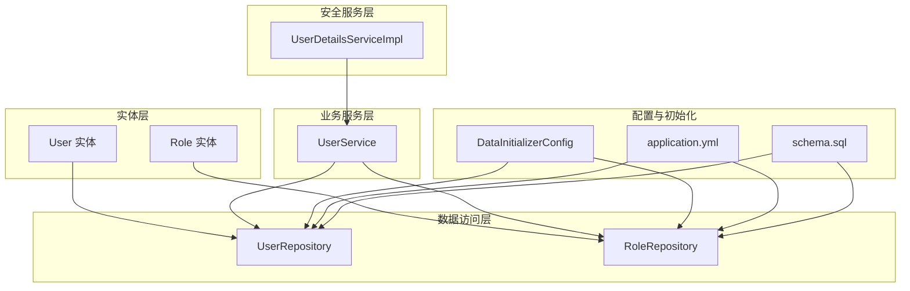
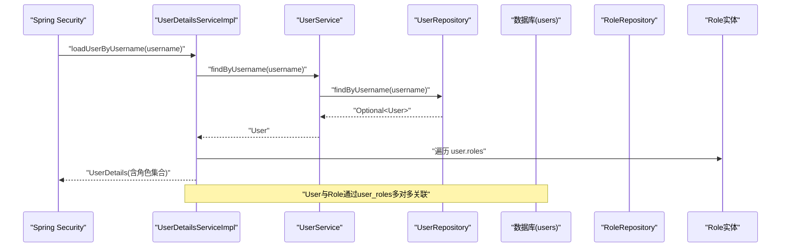
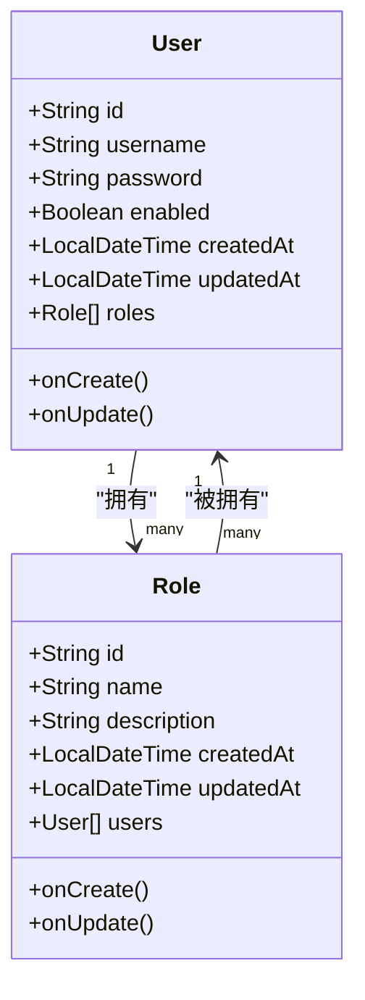
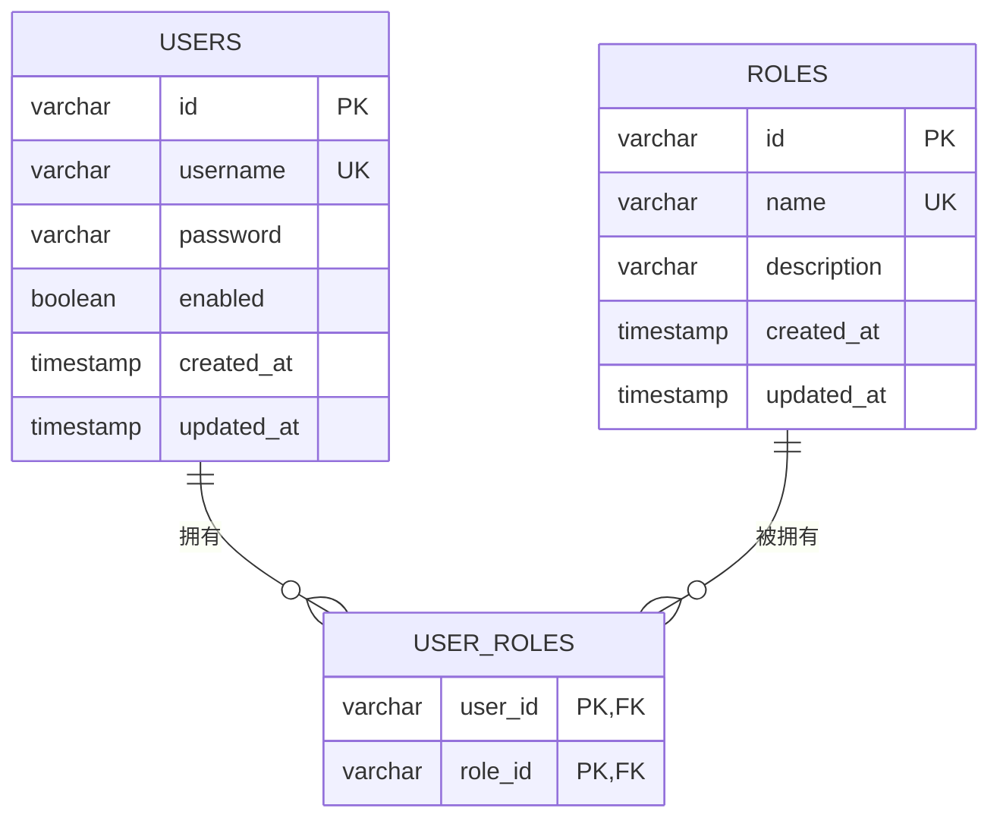
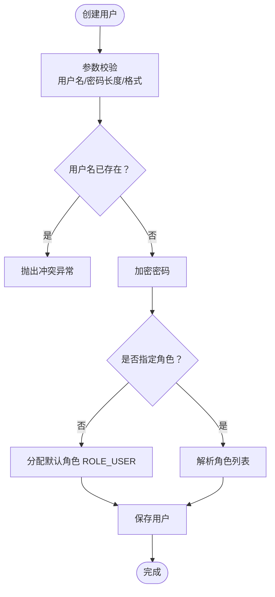
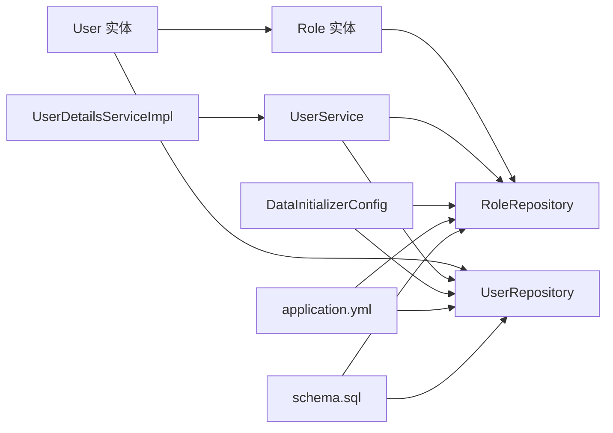

# 用户实体设计

<cite>
**本文引用的文件**
- [User.java](file://src/main/java/com/example/authserver/entity/User.java)
- [Role.java](file://src/main/java/com/example/authserver/entity/Role.java)
- [UserRepository.java](file://src/main/java/com/example/authserver/repository/UserRepository.java)
- [RoleRepository.java](file://src/main/java/com/example/authserver/repository/RoleRepository.java)
- [UserService.java](file://src/main/java/com/example/authserver/service/UserService.java)
- [UserDetailsServiceImpl.java](file://src/main/java/com/example/authserver/service/UserDetailsServiceImpl.java)
- [DataInitializerConfig.java](file://src/main/java/com/example/authserver/config/DataInitializerConfig.java)
- [application.yml](file://src/main/resources/application.yml)
- [schema.sql](file://src/main/resources/schema.sql)
</cite>

## 目录
1. [简介](#简介)
2. [项目结构](#项目结构)
3. [核心组件](#核心组件)
4. [架构总览](#架构总览)
5. [详细组件分析](#详细组件分析)
6. [依赖关系分析](#依赖关系分析)
7. [性能考虑](#性能考虑)
8. [故障排除指南](#故障排除指南)
9. [结论](#结论)
10. [附录](#附录)

## 简介
本文件为用户实体（User）的完整数据模型文档，涵盖字段定义、JPA注解使用、与角色的多对多关系映射、实体生命周期回调、业务逻辑特性以及数据库表结构与约束说明。目标是帮助开发者与运维人员准确理解User实体的设计意图与实现细节。

## 项目结构
本项目采用Spring Boot + JPA的标准分层架构：
- 实体层：User、Role等持久化实体
- 数据访问层：UserRepository、RoleRepository等JPA仓库接口
- 业务服务层：UserService负责用户与角色的业务逻辑
- 安全服务层：UserDetailsServiceImpl实现Spring Security的UserDetailsService
- 配置与初始化：DataInitializerConfig负责默认数据初始化；application.yml配置数据源与JPA行为；schema.sql定义数据库表结构

**图表来源**
- [User.java:20-66](file://src/main/java/com/example/authserver/entity/User.java#L20-L66)
- [Role.java:20-62](file://src/main/java/com/example/authserver/entity/Role.java#L20-L62)
- [UserRepository.java:15-44](file://src/main/java/com/example/authserver/repository/UserRepository.java#L15-L44)
- [RoleRepository.java:15-45](file://src/main/java/com/example/authserver/repository/RoleRepository.java#L15-L45)
- [UserService.java:24-265](file://src/main/java/com/example/authserver/service/UserService.java#L24-L265)
- [UserDetailsServiceImpl.java:22-59](file://src/main/java/com/example/authserver/service/UserDetailsServiceImpl.java#L22-L59)
- [DataInitializerConfig.java:23-109](file://src/main/java/com/example/authserver/config/DataInitializerConfig.java#L23-L109)
- [application.yml:4-25](file://src/main/resources/application.yml#L4-L25)
- [schema.sql:8-41](file://src/main/resources/schema.sql#L8-L41)

**章节来源**
- [application.yml:4-25](file://src/main/resources/application.yml#L4-L25)
- [schema.sql:8-41](file://src/main/resources/schema.sql#L8-L41)

## 核心组件
本节聚焦User实体的核心字段与JPA注解配置，以及与Role实体的多对多关系映射。

- 主键与表映射
  - 实体映射到数据库表“users”，主键为UUID字符串类型，长度限制为100字符。
  - 字段“username”、“password”、“enabled”均设置为非空，其中username与password长度分别为50与500字符。
  - 时间戳字段“created_at”和“updated_at”用于审计跟踪。

- 多对多关系映射
  - User与Role之间为多对多关系，使用中间表“user_roles”进行关联。
  - User端使用@ManyToMany并指定@JoinTable，包含两个外键列“user_id”和“role_id”，联合主键保证唯一性。
  - Role端使用mappedBy="roles"表示该端为关系的被维护方，fetch策略为LAZY以减少不必要的加载。

- 生命周期回调
  - @PrePersist：在持久化前自动设置createdAt与updatedAt为当前时间。
  - @PreUpdate：在更新前仅更新updatedAt为当前时间。

- 默认启用状态
  - enabled字段默认为true，确保新建用户默认处于启用状态。

- 业务逻辑特性
  - UserService在创建用户时默认分配“ROLE_USER”角色，除非显式指定角色列表。
  - DataInitializerConfig在应用启动时初始化默认用户与角色，确保系统具备最小可用数据集。

**章节来源**
- [User.java:20-66](file://src/main/java/com/example/authserver/entity/User.java#L20-L66)
- [Role.java:20-62](file://src/main/java/com/example/authserver/entity/Role.java#L20-L62)
- [UserService.java:58-104](file://src/main/java/com/example/authserver/service/UserService.java#L58-L104)
- [DataInitializerConfig.java:73-95](file://src/main/java/com/example/authserver/config/DataInitializerConfig.java#L73-L95)

## 架构总览
下图展示了用户实体在系统中的关键交互流程：从Spring Security加载用户详情，到UserService处理用户与角色的业务逻辑，再到JPA仓库持久化。

**图表来源**
- [UserDetailsServiceImpl.java:29-51](file://src/main/java/com/example/authserver/service/UserDetailsServiceImpl.java#L29-L51)
- [UserService.java:39-42](file://src/main/java/com/example/authserver/service/UserService.java#L39-L42)
- [UserRepository.java:21-21](file://src/main/java/com/example/authserver/repository/UserRepository.java#L21-L21)
- [User.java:48-50](file://src/main/java/com/example/authserver/entity/User.java#L48-L50)
- [Role.java:45-46](file://src/main/java/com/example/authserver/entity/Role.java#L45-L46)

## 详细组件分析

### User实体类分析
- 类注解与表映射
  - @Entity：声明为JPA实体
  - @Table(name = "users")：映射到数据库表“users”
  - @Data：Lombok生成getter、setter、toString等方法

- 字段与列映射
  - id：UUID主键，长度100字符，不可为空且唯一
  - username：唯一用户名，长度50字符，不可为空
  - password：密码存储，长度500字符，不可为空
  - enabled：布尔启用状态，默认true
  - created_at/updated_at：时间戳字段，用于审计

- 多对多关系
  - @ManyToMany(fetch = FetchType.EAGER)：用户拥有的角色集合，EAGER策略便于Spring Security加载角色
  - @JoinTable：指定中间表“user_roles”，包含user_id与role_id两列

- 生命周期回调
  - @PrePersist：创建时设置createdAt与updatedAt
  - @PreUpdate：更新时仅更新updatedAt

**图表来源**
- [User.java:23-66](file://src/main/java/com/example/authserver/entity/User.java#L23-L66)
- [Role.java:23-62](file://src/main/java/com/example/authserver/entity/Role.java#L23-L62)

**章节来源**
- [User.java:20-66](file://src/main/java/com/example/authserver/entity/User.java#L20-L66)

### Role实体类分析
- 角色实体同样具备完整的审计字段与生命周期回调
- 与User的多对多关系通过mappedBy="roles"反向维护
- fetch策略为LAZY，避免不必要的加载

**章节来源**
- [Role.java:20-62](file://src/main/java/com/example/authserver/entity/Role.java#L20-L62)

### 数据库表结构与约束
- users表
  - id：主键，varchar(100)
  - username：唯一索引，varchar(50)
  - password：varchar(500)
  - enabled：布尔
  - created_at：timestamp，默认当前时间
  - updated_at：timestamp，默认当前时间并自动更新

- roles表
  - id：主键，varchar(100)
  - name：唯一索引，varchar(50)
  - description：varchar(255)
  - created_at/updated_at：同上

- user_roles中间表
  - user_id与role_id：联合主键
  - 外键约束：分别引用users.id与roles.id，删除时级联

- 初始化数据
  - schema.sql中插入默认角色（ROLE_USER、ROLE_ADMIN）
  - DataInitializerConfig在应用启动时创建默认用户并分配角色

**图表来源**
- [schema.sql:8-41](file://src/main/resources/schema.sql#L8-L41)

**章节来源**
- [schema.sql:8-41](file://src/main/resources/schema.sql#L8-L41)
- [DataInitializerConfig.java:73-95](file://src/main/java/com/example/authserver/config/DataInitializerConfig.java#L73-L95)

### 业务逻辑与服务集成
- 用户创建与默认角色分配
  - UserService在创建用户时若未指定角色，则默认分配“ROLE_USER”
  - DataInitializerConfig在应用启动时创建默认用户并分配角色

- 用户详情加载与角色传递
  - UserDetailsServiceImpl根据用户名加载User，转换为Spring Security的UserDetails
  - 将User的roles集合映射为SimpleGrantedAuthority列表供权限判断

- 查询与过滤
  - UserRepository提供按用户名查询、存在性检查、启用/禁用状态过滤、关键字搜索等方法
  - RoleRepository提供按名称查询、存在性检查、排序与统计等方法

**图表来源**
- [UserService.java:58-104](file://src/main/java/com/example/authserver/service/UserService.java#L58-L104)
- [DataInitializerConfig.java:73-95](file://src/main/java/com/example/authserver/config/DataInitializerConfig.java#L73-L95)

**章节来源**
- [UserService.java:58-104](file://src/main/java/com/example/authserver/service/UserService.java#L58-L104)
- [UserDetailsServiceImpl.java:29-51](file://src/main/java/com/example/authserver/service/UserDetailsServiceImpl.java#L29-L51)
- [UserRepository.java:18-42](file://src/main/java/com/example/authserver/repository/UserRepository.java#L18-L42)
- [RoleRepository.java:18-38](file://src/main/java/com/example/authserver/repository/RoleRepository.java#L18-L38)

## 依赖关系分析
- User与Role通过user_roles中间表建立多对多关系，User端为关系发起方，Role端为被维护方
- UserService依赖UserRepository与RoleRepository，负责业务规则与事务控制
- UserDetailsServiceImpl依赖UserService，用于Spring Security认证与授权
- DataInitializerConfig在应用启动阶段初始化默认数据，依赖UserRepository与RoleRepository
- application.yml配置数据源、JPA方言与DDL策略，schema.sql定义初始表结构

**图表来源**
- [User.java:48-50](file://src/main/java/com/example/authserver/entity/User.java#L48-L50)
- [Role.java:45-46](file://src/main/java/com/example/authserver/entity/Role.java#L45-L46)
- [UserRepository.java:15-44](file://src/main/java/com/example/authserver/repository/UserRepository.java#L15-L44)
- [RoleRepository.java:15-45](file://src/main/java/com/example/authserver/repository/RoleRepository.java#L15-L45)
- [UserService.java:24-265](file://src/main/java/com/example/authserver/service/UserService.java#L24-L265)
- [UserDetailsServiceImpl.java:22-59](file://src/main/java/com/example/authserver/service/UserDetailsServiceImpl.java#L22-L59)
- [DataInitializerConfig.java:23-109](file://src/main/java/com/example/authserver/config/DataInitializerConfig.java#L23-L109)
- [application.yml:4-25](file://src/main/resources/application.yml#L4-L25)
- [schema.sql:8-41](file://src/main/resources/schema.sql#L8-L41)

**章节来源**
- [User.java:48-50](file://src/main/java/com/example/authserver/entity/User.java#L48-L50)
- [Role.java:45-46](file://src/main/java/com/example/authserver/entity/Role.java#L45-L46)
- [UserService.java:24-265](file://src/main/java/com/example/authserver/service/UserService.java#L24-L265)
- [UserDetailsServiceImpl.java:22-59](file://src/main/java/com/example/authserver/service/UserDetailsServiceImpl.java#L22-L59)
- [DataInitializerConfig.java:23-109](file://src/main/java/com/example/authserver/config/DataInitializerConfig.java#L23-L109)
- [application.yml:4-25](file://src/main/resources/application.yml#L4-L25)
- [schema.sql:8-41](file://src/main/resources/schema.sql#L8-L41)

## 性能考虑
- EAGER加载策略：User端的@ManyToMany使用FetchType.EAGER，便于Spring Security一次性加载角色，但可能增加单次查询的负载。若用户角色较多或用户量大，可评估改为LAZY并在需要时显式加载。
- 约束与索引：数据库层面为username与name建立了唯一索引，有助于快速去重与查询；user_roles表的联合主键与外键约束确保关系完整性。
- 审计字段：created_at与updated_at由实体回调自动维护，减少业务代码重复，同时便于审计追踪。

[本节为通用性能建议，不直接分析具体文件]

## 故障排除指南
- 用户名冲突
  - 现象：创建用户时报用户名已存在
  - 原因：数据库唯一约束或业务校验触发
  - 处理：检查用户名是否已被占用，或调整用户名

- 密码长度不足
  - 现象：创建或更新用户时报密码长度不足
  - 原因：密码长度小于6位
  - 处理：确保密码长度满足要求

- 角色不存在
  - 现象：更新用户角色时报角色不存在
  - 原因：角色名称拼写错误或未初始化
  - 处理：确认角色名称正确，或先创建角色

- 用户不存在
  - 现象：加载用户详情时报用户不存在
  - 原因：用户名错误或未初始化
  - 处理：确认用户名正确，或检查初始化流程

**章节来源**
- [UserService.java:74-77](file://src/main/java/com/example/authserver/service/UserService.java#L74-L77)
- [UserService.java:117-119](file://src/main/java/com/example/authserver/service/UserService.java#L117-L119)
- [UserService.java:163-167](file://src/main/java/com/example/authserver/service/UserService.java#L163-L167)
- [UserDetailsServiceImpl.java:36-37](file://src/main/java/com/example/authserver/service/UserDetailsServiceImpl.java#L36-L37)

## 结论
User实体通过清晰的字段定义、严谨的JPA注解配置与完善的多对多关系映射，构建了可审计、可扩展的用户模型。结合UserService与UserDetailsServiceImpl，实现了从创建、授权到角色管理的完整闭环。配合schema.sql与DataInitializerConfig，系统能够在启动时快速具备可用的默认数据，满足开发与演示场景需求。

[本节为总结性内容，不直接分析具体文件]

## 附录
- 关键配置项
  - 数据源：MySQL，JDBC连接参数与驱动
  - SQL初始化：通过schema.sql与application.yml配置自动初始化
  - JPA方言：MySQLDialect，DDL策略为update

- 初始化流程
  - schema.sql：创建users、roles、user_roles等表及默认角色与URL权限规则
  - DataInitializerConfig：创建默认用户并分配角色

**章节来源**
- [application.yml:4-25](file://src/main/resources/application.yml#L4-L25)
- [schema.sql:8-41](file://src/main/resources/schema.sql#L8-L41)
- [DataInitializerConfig.java:73-95](file://src/main/java/com/example/authserver/config/DataInitializerConfig.java#L73-L95)