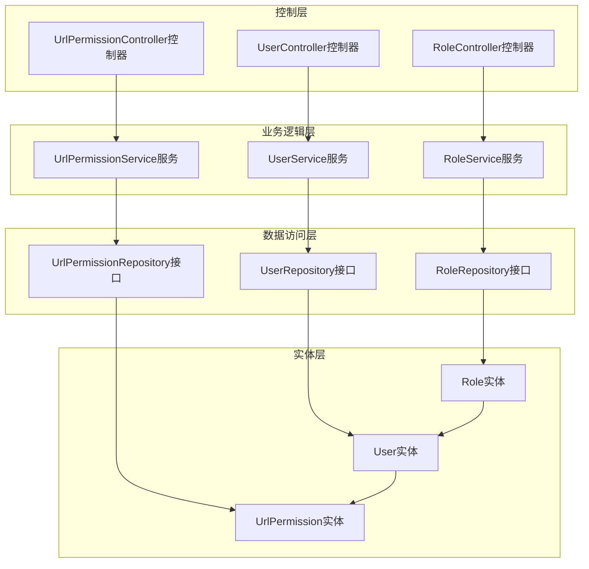
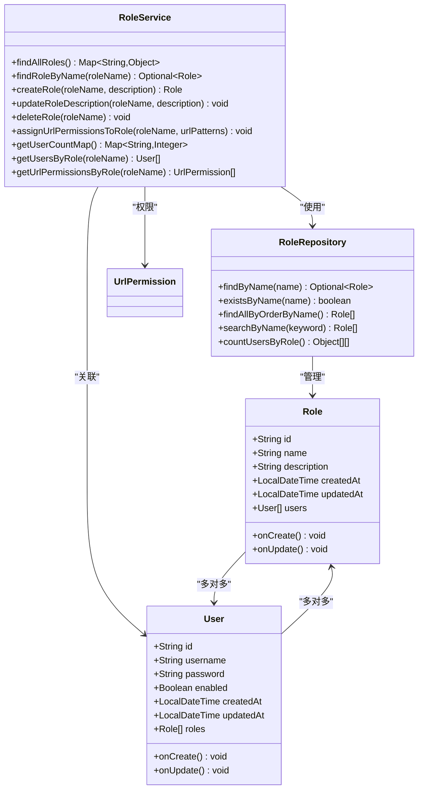
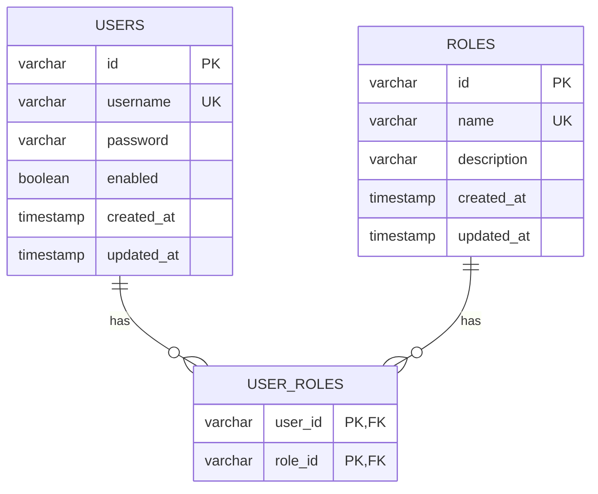
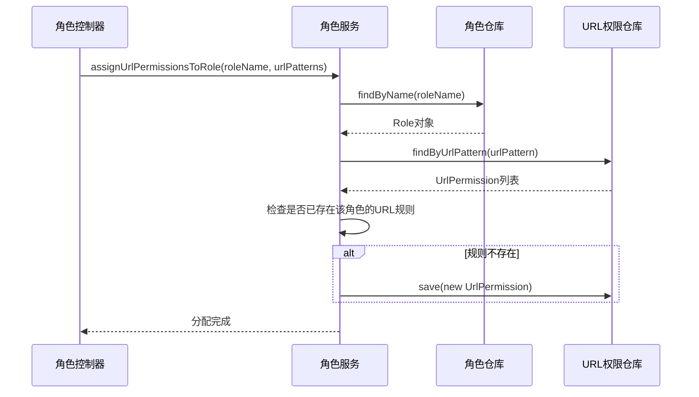
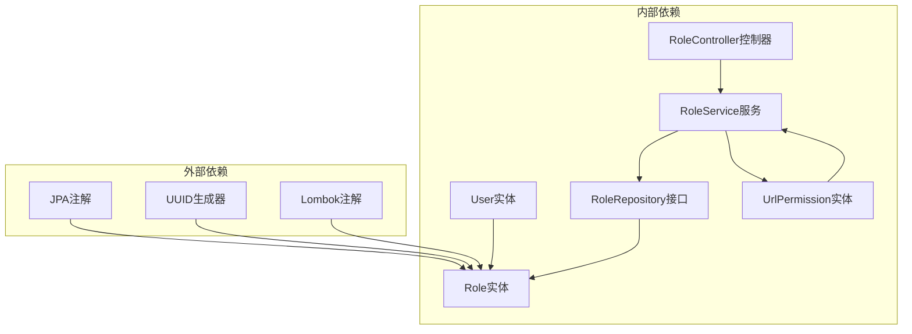
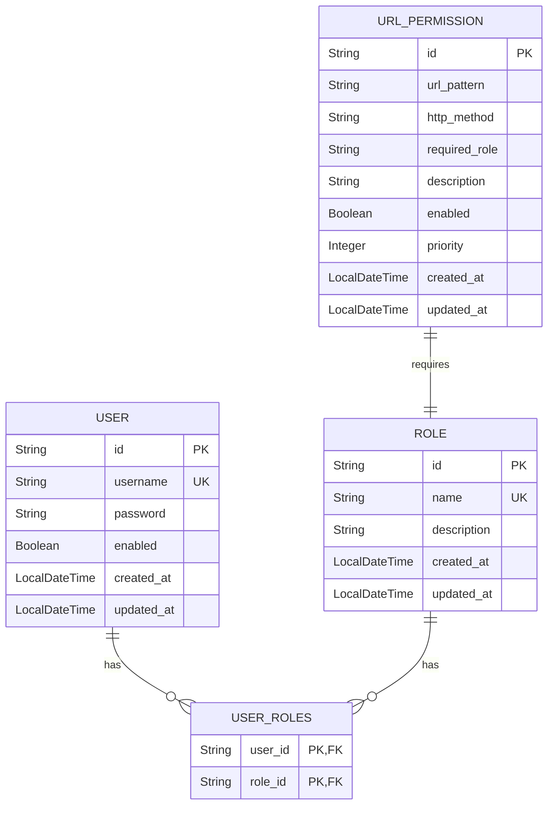

# 角色实体设计

<cite>
**本文档引用的文件**
- [Role.java](file://src/main/java/com/example/authserver/entity/Role.java)
- [User.java](file://src/main/java/com/example/authserver/entity/User.java)
- [RoleRepository.java](file://src/main/java/com/example/authserver/repository/RoleRepository.java)
- [RoleService.java](file://src/main/java/com/example/authserver/service/RoleService.java)
- [RoleController.java](file://src/main/java/com/example/authserver/controller/RoleController.java)
- [schema.sql](file://src/main/resources/schema.sql)
- [UrlPermission.java](file://src/main/java/com/example/authserver/entity/UrlPermission.java)
- [UserRepository.java](file://src/main/java/com/example/authserver/repository/UserRepository.java)
</cite>

## 目录
1. [简介](#简介)
2. [项目结构](#项目结构)
3. [核心组件](#核心组件)
4. [架构概览](#架构概览)
5. [详细组件分析](#详细组件分析)
6. [依赖关系分析](#依赖关系分析)
7. [性能考虑](#性能考虑)
8. [故障排除指南](#故障排除指南)
9. [结论](#结论)
10. [附录](#附录)

## 简介

本文档为角色实体创建全面的数据模型文档，详细描述了Role实体的字段定义和业务含义，解释了角色实体在RBAC权限系统中的作用和重要性。文档涵盖了角色与用户之间的多对多关系映射，中间表user_roles的关联机制，JPA注解配置说明，业务规则和数据验证要求，以及完整的数据库表结构。

## 项目结构

该项目采用Spring Boot标准的分层架构设计，角色实体位于entity包中，配合相应的Repository、Service和Controller层实现完整的CRUD操作。



**图表来源**
- [Role.java:1-62](file://src/main/java/com/example/authserver/entity/Role.java#L1-L62)
- [User.java:1-66](file://src/main/java/com/example/authserver/entity/User.java#L1-L66)
- [RoleRepository.java:1-45](file://src/main/java/com/example/authserver/repository/RoleRepository.java#L1-L45)
- [RoleService.java:1-235](file://src/main/java/com/example/authserver/service/RoleService.java#L1-L235)

**章节来源**
- [Role.java:1-62](file://src/main/java/com/example/authserver/entity/Role.java#L1-L62)
- [User.java:1-66](file://src/main/java/com/example/authserver/entity/User.java#L1-L66)
- [schema.sql:1-169](file://src/main/resources/schema.sql#L1-L169)

## 核心组件

### 角色实体（Role）

Role实体是RBAC权限系统的核心组成部分，代表系统中的角色概念。该实体实现了JPA注解配置，提供了完整的字段定义和业务逻辑。

### 用户实体（User）

User实体代表系统用户，与Role实体建立了多对多关系，通过中间表user_roles实现用户角色关联。

### 角色仓库（RoleRepository）

RoleRepository接口继承JpaRepository，提供了角色数据访问功能，包括基本的CRUD操作和自定义查询方法。

### 角色服务（RoleService）

RoleService类实现了角色管理的完整业务逻辑，包括角色创建、更新、删除、查询等功能，并处理角色与URL权限的关系。

**章节来源**
- [Role.java:17-62](file://src/main/java/com/example/authserver/entity/Role.java#L17-L62)
- [User.java:17-66](file://src/main/java/com/example/authserver/entity/User.java#L17-L66)
- [RoleRepository.java:12-45](file://src/main/java/com/example/authserver/repository/RoleRepository.java#L12-L45)
- [RoleService.java:19-235](file://src/main/java/com/example/authserver/service/RoleService.java#L19-L235)

## 架构概览

角色实体在整个权限系统中扮演着关键角色，它不仅定义了系统的角色概念，还通过多对多关系与用户实体建立联系，形成了完整的RBAC权限模型。



**图表来源**
- [Role.java:20-62](file://src/main/java/com/example/authserver/entity/Role.java#L20-L62)
- [User.java:20-66](file://src/main/java/com/example/authserver/entity/User.java#L20-L66)
- [RoleRepository.java:15-45](file://src/main/java/com/example/authserver/repository/RoleRepository.java#L15-L45)
- [RoleService.java:22-235](file://src/main/java/com/example/authserver/service/RoleService.java#L22-L235)

## 详细组件分析

### 角色实体字段定义

#### 核心标识字段
- **id**: 角色唯一标识符，使用UUID生成策略，长度限制为100字符
- **name**: 角色名称，唯一约束，长度限制为50字符，必须以ROLE_前缀开头
- **description**: 角色描述，长度限制为255字符

#### 时间戳字段
- **created_at**: 创建时间，默认值为当前时间
- **updated_at**: 更新时间，默认值为当前时间

#### 关系字段
- **users**: 拥有该角色的用户列表，使用mappedBy属性实现双向关联

**章节来源**
- [Role.java:25-46](file://src/main/java/com/example/authserver/entity/Role.java#L25-L46)

### 用户实体字段定义

#### 核心标识字段
- **id**: 用户唯一标识符，使用UUID生成策略，长度限制为100字符
- **username**: 用户名，唯一约束，长度限制为50字符
- **password**: 密码，长度限制为500字符

#### 状态字段
- **enabled**: 用户启用状态，默认true

#### 时间戳字段
- **created_at**: 创建时间，默认值为当前时间
- **updated_at**: 更新时间，默认值为当前时间

#### 关系字段
- **roles**: 用户拥有的角色列表，通过user_roles中间表实现多对多关联

**章节来源**
- [User.java:25-50](file://src/main/java/com/example/authserver/entity/User.java#L25-L50)

### JPA注解配置说明

#### 角色实体注解配置
- **@Entity**: 标识Role为JPA实体
- **@Table(name = "roles")**: 指定数据库表名为roles
- **@Id**: 标识主键字段
- **@GeneratedValue(strategy = GenerationType.UUID)**: 使用UUID生成策略
- **@Column**: 定义列属性，包括nullable、unique、length等约束
- **@ManyToMany(mappedBy = "roles")**: 反向映射到User实体的roles属性
- **@PrePersist/@PreUpdate**: 实现时间戳自动设置

#### 用户实体注解配置
- **@JoinTable**: 定义多对多关联表user_roles
- **@JoinColumn**: 指定关联列名
- **fetch = FetchType.EAGER**: 设置加载策略为立即加载

**章节来源**
- [Role.java:20-62](file://src/main/java/com/example/authserver/entity/Role.java#L20-L62)
- [User.java:20-66](file://src/main/java/com/example/authserver/entity/User.java#L20-L66)

### 数据库表结构

#### 角色表（roles）
```sql
CREATE TABLE IF NOT EXISTS roles (
    id varchar(100) NOT NULL,
    name varchar(50) NOT NULL,
    description varchar(255) DEFAULT NULL,
    created_at timestamp DEFAULT CURRENT_TIMESTAMP,
    updated_at timestamp DEFAULT CURRENT_TIMESTAMP ON UPDATE CURRENT_TIMESTAMP,
    PRIMARY KEY (id),
    UNIQUE INDEX ix_roles_name (name)
);
```

#### 用户表（users）
```sql
CREATE TABLE IF NOT EXISTS users (
    id varchar(100) NOT NULL,
    username varchar(50) NOT NULL,
    password varchar(500) NOT NULL,
    enabled boolean NOT NULL,
    created_at timestamp DEFAULT CURRENT_TIMESTAMP,
    updated_at timestamp DEFAULT CURRENT_TIMESTAMP ON UPDATE CURRENT_TIMESTAMP,
    PRIMARY KEY (id),
    UNIQUE INDEX ix_users_username (username)
);
```

#### 用户-角色关联表（user_roles）
```sql
CREATE TABLE IF NOT EXISTS user_roles (
    user_id varchar(100) NOT NULL,
    role_id varchar(100) NOT NULL,
    PRIMARY KEY (user_id, role_id),
    CONSTRAINT fk_user_roles_user FOREIGN KEY (user_id) REFERENCES users (id) ON DELETE CASCADE,
    CONSTRAINT fk_user_roles_role FOREIGN KEY (role_id) REFERENCES roles (id) ON DELETE CASCADE
);
```

**章节来源**
- [schema.sql:22-41](file://src/main/resources/schema.sql#L22-L41)

### 业务规则和数据验证

#### 角色创建规则
1. 角色名称必须非空且唯一
2. 自动将角色名称转换为大写格式
3. 支持自动添加ROLE_前缀
4. 角色描述可选，最大长度255字符

#### 角色删除规则
1. 禁止删除系统内置角色（ROLE_ADMIN、ROLE_USER）
2. 必须确保没有用户使用该角色才能删除
3. 删除操作会级联删除相关的URL权限规则

#### 角色更新规则
1. 角色描述可以为空或更新
2. 角色名称不允许修改（保持唯一性约束）

**章节来源**
- [RoleService.java:57-107](file://src/main/java/com/example/authserver/service/RoleService.java#L57-L107)
- [RoleController.java:131-134](file://src/main/java/com/example/authserver/controller/RoleController.java#L131-L134)

### 角色与用户关系映射

角色与用户之间建立了标准的多对多关系，通过user_roles中间表实现：



**图表来源**
- [schema.sql:33-40](file://src/main/resources/schema.sql#L33-L40)
- [User.java:48-50](file://src/main/java/com/example/authserver/entity/User.java#L48-L50)
- [Role.java:45-46](file://src/main/java/com/example/authserver/entity/Role.java#L45-L46)

### URL权限规则集成

角色实体通过RoleService与URL权限规则建立了动态关联关系：



**图表来源**
- [RoleService.java:113-149](file://src/main/java/com/example/authserver/service/RoleService.java#L113-L149)
- [RoleController.java:230-254](file://src/main/java/com/example/authserver/controller/RoleController.java#L230-L254)

**章节来源**
- [RoleService.java:113-149](file://src/main/java/com/example/authserver/service/RoleService.java#L113-L149)
- [RoleController.java:230-254](file://src/main/java/com/example/authserver/controller/RoleController.java#L230-L254)

## 依赖关系分析

角色实体在整个系统中的依赖关系如下：



**图表来源**
- [Role.java:11-15](file://src/main/java/com/example/authserver/entity/Role.java#L11-L15)
- [User.java:11-15](file://src/main/java/com/example/authserver/entity/User.java#L11-L15)
- [RoleService.java:3-17](file://src/main/java/com/example/authserver/service/RoleService.java#L3-L17)

### 复杂度分析

- **查询复杂度**: 基于名称的查询为O(log n)，用户数量统计为O(n)
- **插入复杂度**: 角色创建为O(1)，用户角色关联为O(1)
- **删除复杂度**: 角色删除为O(n)，其中n为关联的用户数量

**章节来源**
- [RoleRepository.java:18-43](file://src/main/java/com/example/authserver/repository/RoleRepository.java#L18-L43)
- [RoleService.java:164-175](file://src/main/java/com/example/authserver/service/RoleService.java#L164-L175)

## 性能考虑

### 查询优化
1. **索引设计**: 角色名称和用户名都建立了唯一索引，提高查询性能
2. **延迟加载**: 用户角色关系使用LAZY加载策略，避免不必要的数据加载
3. **批量查询**: 提供了按名称排序和用户数量统计的批量查询方法

### 缓存策略
1. **用户角色缓存**: 用户实体设置了EAGER加载策略，确保角色信息的及时获取
2. **角色统计缓存**: 通过getUserCountMap方法提供角色用户数量的统计信息

### 内存管理
1. **集合初始化**: 使用ArrayList初始化，避免空指针异常
2. **时间戳管理**: 自动设置创建和更新时间，减少手动管理开销

## 故障排除指南

### 常见问题及解决方案

#### 角色创建失败
**问题**: 角色名称重复导致创建失败
**解决方案**: 
1. 检查角色名称是否已存在
2. 确保角色名称符合ROLE_前缀规范
3. 验证角色名称长度不超过50字符

#### 角色删除失败
**问题**: 删除内置角色或仍有用户使用
**解决方案**:
1. 检查是否为系统内置角色（ROLE_ADMIN、ROLE_USER）
2. 确认没有用户拥有该角色
3. 清理相关的URL权限规则

#### 关联关系异常
**问题**: 用户角色关联失效
**解决方案**:
1. 检查user_roles表的外键约束
2. 验证用户和角色的ID格式
3. 确认关联表的联合主键设置

**章节来源**
- [RoleService.java:63-66](file://src/main/java/com/example/authserver/service/RoleService.java#L63-L66)
- [RoleService.java:99-102](file://src/main/java/com/example/authserver/service/RoleService.java#L99-L102)
- [RoleController.java:132-134](file://src/main/java/com/example/authserver/controller/RoleController.java#L132-L134)

## 结论

角色实体设计体现了良好的软件工程实践，通过清晰的字段定义、完善的JPA注解配置和严格的业务规则，构建了一个健壮的RBAC权限模型。多对多关系的实现既满足了业务需求，又保证了数据的一致性和完整性。

该设计的主要优势包括：
1. **清晰的职责分离**: 实体、仓库、服务、控制器各司其职
2. **完善的约束机制**: 数据库层面和应用层面的双重约束
3. **灵活的扩展性**: 支持动态URL权限规则的配置
4. **良好的性能表现**: 通过索引和延迟加载优化查询性能

## 附录

### 数据模型完整定义



**图表来源**
- [schema.sql:8-56](file://src/main/resources/schema.sql#L8-L56)
- [Role.java:23-46](file://src/main/java/com/example/authserver/entity/Role.java#L23-L46)
- [User.java:23-50](file://src/main/java/com/example/authserver/entity/User.java#L23-L50)
- [UrlPermission.java:14-72](file://src/main/java/com/example/authserver/entity/UrlPermission.java#L14-L72)

### 最佳实践建议

1. **命名规范**: 始终使用ROLE_前缀的角色名称
2. **数据验证**: 在业务层和数据层双重验证数据完整性
3. **事务管理**: 对涉及多个表的操作使用事务保证一致性
4. **日志记录**: 完善的操作日志便于问题追踪和审计
5. **错误处理**: 统一的异常处理机制提升用户体验