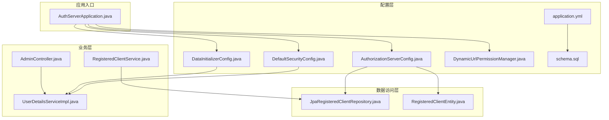
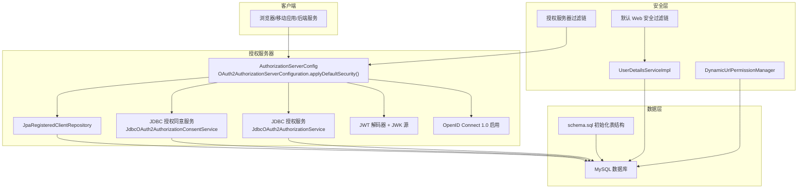
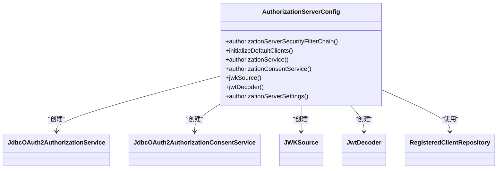
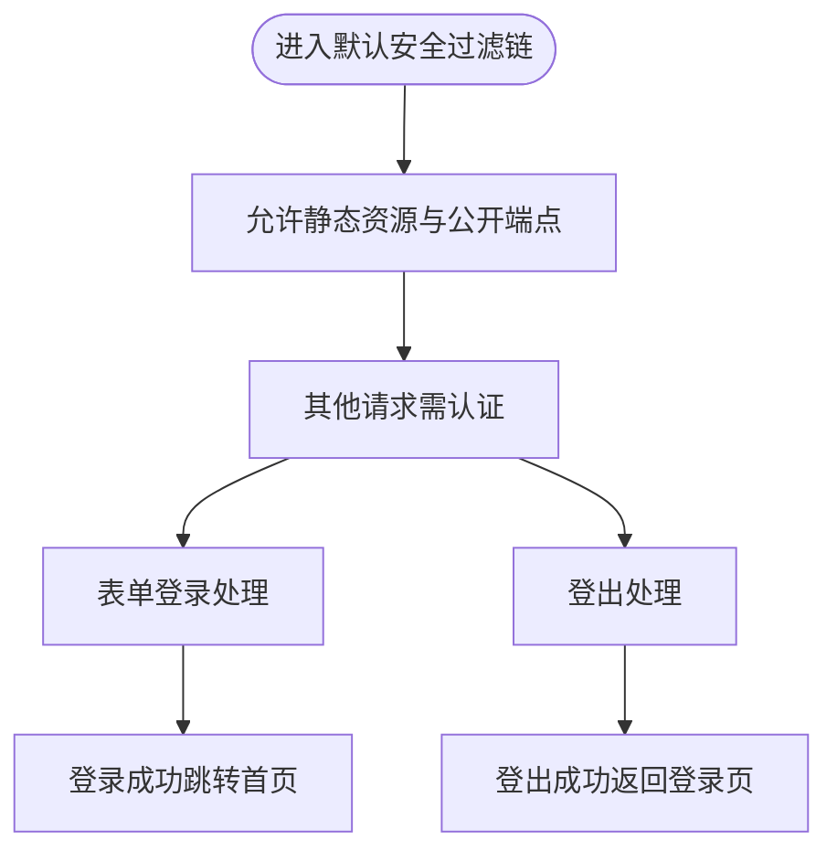
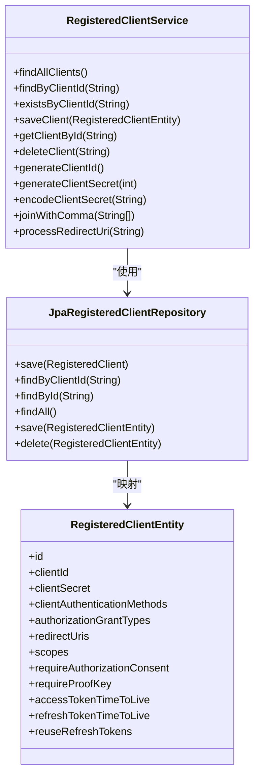
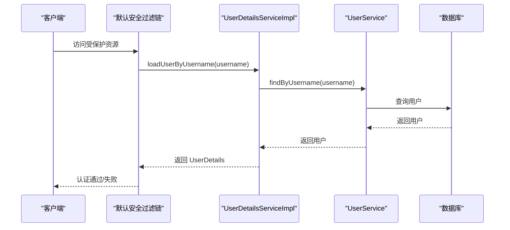
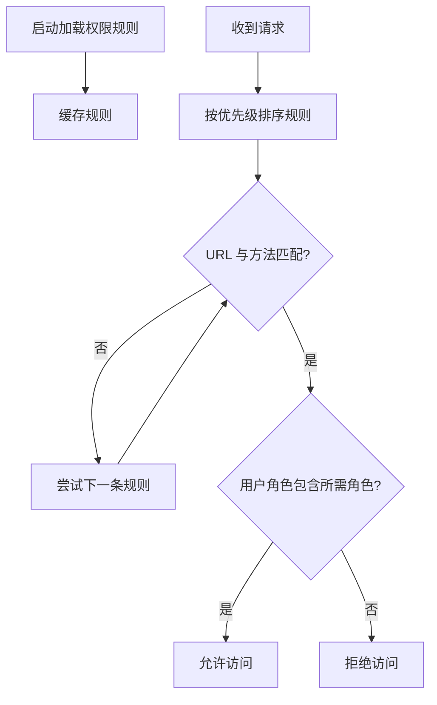
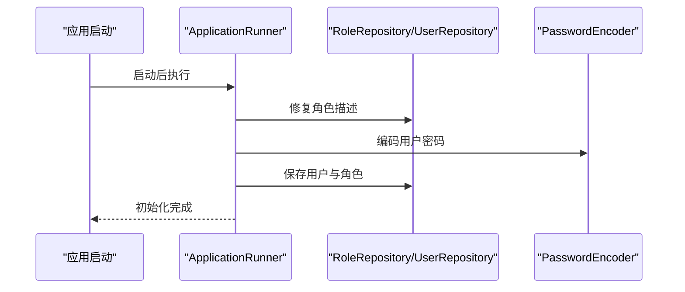
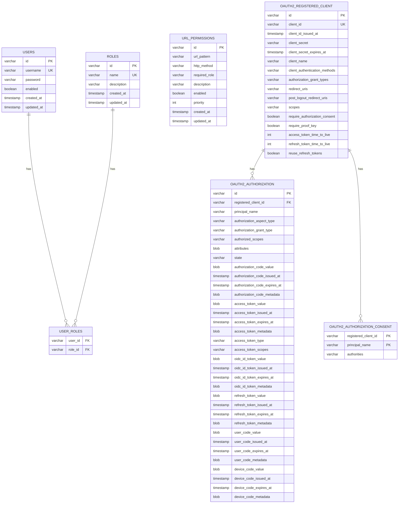
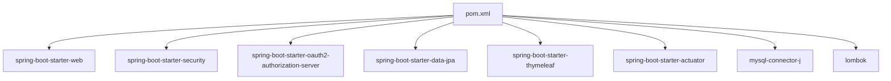

# OAuth2架构

<cite>
**本文引用的文件**
- [AuthServerApplication.java](file://src/main/java/com/example/authserver/AuthServerApplication.java)
- [AuthorizationServerConfig.java](file://src/main/java/com/example/authserver/config/AuthorizationServerConfig.java)
- [DefaultSecurityConfig.java](file://src/main/java/com/example/authserver/config/DefaultSecurityConfig.java)
- [DataInitializerConfig.java](file://src/main/java/com/example/authserver/config/DataInitializerConfig.java)
- [DynamicUrlPermissionManager.java](file://src/main/java/com/example/authserver/config/DynamicUrlPermissionManager.java)
- [application.yml](file://src/main/resources/application.yml)
- [schema.sql](file://src/main/resources/schema.sql)
- [JpaRegisteredClientRepository.java](file://src/main/java/com/example/authserver/repository/JpaRegisteredClientRepository.java)
- [RegisteredClientEntity.java](file://src/main/java/com/example/authserver/entity/RegisteredClientEntity.java)
- [RegisteredClientService.java](file://src/main/java/com/example/authserver/service/RegisteredClientService.java)
- [UserDetailsServiceImpl.java](file://src/main/java/com/example/authserver/service/UserDetailsServiceImpl.java)
- [AdminController.java](file://src/main/java/com/example/authserver/controller/AdminController.java)
- [pom.xml](file://pom.xml)
</cite>

## 目录
1. [简介](#简介)
2. [项目结构](#项目结构)
3. [核心组件](#核心组件)
4. [架构总览](#架构总览)
5. [详细组件分析](#详细组件分析)
6. [依赖分析](#依赖分析)
7. [性能考虑](#性能考虑)
8. [故障排查指南](#故障排查指南)
9. [结论](#结论)
10. [附录](#附录)

## 简介
本项目是一个基于 Spring Security OAuth2 Authorization Server 的授权服务器实现，集成了 OpenID Connect 1.0，提供授权端点、令牌端点、客户端管理、用户信息处理、JWT 令牌生成与验证、授权码与刷新令牌流程、以及与 Spring Security 的深度集成。系统采用 MySQL 作为持久化存储，JPA 实现 OAuth2 客户端与授权状态的持久化，并通过动态 URL 权限管理器实现灵活的访问控制。

## 项目结构
项目采用按功能域划分的层次化结构：
- config：安全配置、数据初始化、动态权限管理
- controller：管理端控制器（用户管理等）
- entity：JPA 实体（OAuth2 客户端、用户、角色、URL 权限等）
- repository：JPA 仓库（OAuth2 客户端仓库）
- service：业务服务（用户、角色、URL 权限、客户端管理等）
- resources：配置文件、数据库初始化脚本、模板页面

图表来源
- [AuthServerApplication.java:1-14](file://src/main/java/com/example/authserver/AuthServerApplication.java#L1-L14)
- [AuthorizationServerConfig.java:1-256](file://src/main/java/com/example/authserver/config/AuthorizationServerConfig.java#L1-L256)
- [DefaultSecurityConfig.java:1-75](file://src/main/java/com/example/authserver/config/DefaultSecurityConfig.java#L1-L75)
- [DataInitializerConfig.java:1-109](file://src/main/java/com/example/authserver/config/DataInitializerConfig.java#L1-L109)
- [DynamicUrlPermissionManager.java:1-120](file://src/main/java/com/example/authserver/config/DynamicUrlPermissionManager.java#L1-L120)
- [application.yml:1-30](file://src/main/resources/application.yml#L1-L30)
- [schema.sql:1-169](file://src/main/resources/schema.sql#L1-L169)
- [RegisteredClientService.java:1-131](file://src/main/java/com/example/authserver/service/RegisteredClientService.java#L1-L131)
- [UserDetailsServiceImpl.java:1-59](file://src/main/java/com/example/authserver/service/UserDetailsServiceImpl.java#L1-L59)
- [AdminController.java:1-282](file://src/main/java/com/example/authserver/controller/AdminController.java#L1-L282)
- [JpaRegisteredClientRepository.java:1-289](file://src/main/java/com/example/authserver/repository/JpaRegisteredClientRepository.java#L1-L289)
- [RegisteredClientEntity.java:1-111](file://src/main/java/com/example/authserver/entity/RegisteredClientEntity.java#L1-L111)

章节来源
- [AuthServerApplication.java:1-14](file://src/main/java/com/example/authserver/AuthServerApplication.java#L1-L14)
- [AuthorizationServerConfig.java:1-256](file://src/main/java/com/example/authserver/config/AuthorizationServerConfig.java#L1-L256)
- [DefaultSecurityConfig.java:1-75](file://src/main/java/com/example/authserver/config/DefaultSecurityConfig.java#L1-L75)
- [DataInitializerConfig.java:1-109](file://src/main/java/com/example/authserver/config/DataInitializerConfig.java#L1-L109)
- [DynamicUrlPermissionManager.java:1-120](file://src/main/java/com/example/authserver/config/DynamicUrlPermissionManager.java#L1-L120)
- [application.yml:1-30](file://src/main/resources/application.yml#L1-L30)
- [schema.sql:1-169](file://src/main/resources/schema.sql#L1-L169)

## 核心组件
- 授权服务器配置：启用 OAuth2 Authorization Server 默认安全策略、OpenID Connect 1.0、JWT 资源服务器、JDBC 授权服务与授权同意服务、JWK 源与 JWT 解码器、授权服务器设置。
- 安全过滤链：授权服务器过滤链与默认 Web 安全过滤链，分别处理 OAuth2 端点与常规登录/登出。
- 客户端管理：JPA 实现的 RegisteredClientRepository，支持客户端的保存、查询、更新；RegisteredClientService 提供业务封装与密钥编码。
- 用户认证与授权：UserDetailsServiceImpl 实现 Spring Security 用户详情加载；动态 URL 权限管理器根据数据库规则进行权限判定。
- 数据初始化：ApplicationRunner 初始化默认用户与角色，schema.sql 初始化数据库表结构。
- 持久化模型：RegisteredClientEntity 映射 oauth2_registered_client 表，包含客户端认证方式、授权类型、重定向 URI、作用域、令牌有效期等。

章节来源
- [AuthorizationServerConfig.java:56-77](file://src/main/java/com/example/authserver/config/AuthorizationServerConfig.java#L56-L77)
- [AuthorizationServerConfig.java:193-206](file://src/main/java/com/example/authserver/config/AuthorizationServerConfig.java#L193-L206)
- [AuthorizationServerConfig.java:211-245](file://src/main/java/com/example/authserver/config/AuthorizationServerConfig.java#L211-L245)
- [DefaultSecurityConfig.java:34-49](file://src/main/java/com/example/authserver/config/DefaultSecurityConfig.java#L34-L49)
- [DefaultSecurityConfig.java:55-73](file://src/main/java/com/example/authserver/config/DefaultSecurityConfig.java#L55-L73)
- [JpaRegisteredClientRepository.java:29-51](file://src/main/java/com/example/authserver/repository/JpaRegisteredClientRepository.java#L29-L51)
- [RegisteredClientService.java:61-82](file://src/main/java/com/example/authserver/service/RegisteredClientService.java#L61-L82)
- [UserDetailsServiceImpl.java:29-57](file://src/main/java/com/example/authserver/service/UserDetailsServiceImpl.java#L29-L57)
- [DynamicUrlPermissionManager.java:64-81](file://src/main/java/com/example/authserver/config/DynamicUrlPermissionManager.java#L64-L81)
- [DataInitializerConfig.java:30-95](file://src/main/java/com/example/authserver/config/DataInitializerConfig.java#L30-L95)
- [RegisteredClientEntity.java:14-110](file://src/main/java/com/example/authserver/entity/RegisteredClientEntity.java#L14-L110)

## 架构总览
系统采用“配置即服务”的设计，授权服务器通过 Spring Security OAuth2 Authorization Server 自动暴露授权端点与令牌端点，并结合 Spring Security 的过滤链实现统一的身份认证与授权。JWT 用于令牌签名与验证，JDBC 存储授权状态与客户端信息，动态 URL 权限管理器提供灵活的访问控制。

图表来源
- [AuthorizationServerConfig.java:56-77](file://src/main/java/com/example/authserver/config/AuthorizationServerConfig.java#L56-L77)
- [AuthorizationServerConfig.java:193-206](file://src/main/java/com/example/authserver/config/AuthorizationServerConfig.java#L193-L206)
- [AuthorizationServerConfig.java:211-245](file://src/main/java/com/example/authserver/config/AuthorizationServerConfig.java#L211-L245)
- [DefaultSecurityConfig.java:55-73](file://src/main/java/com/example/authserver/config/DefaultSecurityConfig.java#L55-L73)
- [UserDetailsServiceImpl.java:29-57](file://src/main/java/com/example/authserver/service/UserDetailsServiceImpl.java#L29-L57)
- [DynamicUrlPermissionManager.java:64-81](file://src/main/java/com/example/authserver/config/DynamicUrlPermissionManager.java#L64-L81)
- [schema.sql:60-141](file://src/main/resources/schema.sql#L60-L141)

## 详细组件分析

### 授权服务器配置（AuthorizationServerConfig）
- 启用 OAuth2 Authorization Server 默认安全策略，自动暴露授权端点与令牌端点。
- 启用 OpenID Connect 1.0，支持 ID Token 与用户信息端点。
- 配置资源服务器使用 JWT，JWT 解码器基于 JWK 源。
- 配置 JDBC 授权服务与授权同意服务，持久化授权状态与用户授权同意。
- 生成 RSA 密钥对构建 JWK，用于 JWT 签名；同时提供 JWT 解码器 Bean。
- 初始化默认客户端（Web 应用、移动端、后端服务），配置授权类型、重定向 URI、作用域、令牌有效期等。
- 授权服务器设置默认构建。

图表来源
- [AuthorizationServerConfig.java:56-77](file://src/main/java/com/example/authserver/config/AuthorizationServerConfig.java#L56-L77)
- [AuthorizationServerConfig.java:193-206](file://src/main/java/com/example/authserver/config/AuthorizationServerConfig.java#L193-L206)
- [AuthorizationServerConfig.java:211-245](file://src/main/java/com/example/authserver/config/AuthorizationServerConfig.java#L211-L245)

章节来源
- [AuthorizationServerConfig.java:56-77](file://src/main/java/com/example/authserver/config/AuthorizationServerConfig.java#L56-L77)
- [AuthorizationServerConfig.java:91-161](file://src/main/java/com/example/authserver/config/AuthorizationServerConfig.java#L91-L161)
- [AuthorizationServerConfig.java:193-206](file://src/main/java/com/example/authserver/config/AuthorizationServerConfig.java#L193-L206)
- [AuthorizationServerConfig.java:211-245](file://src/main/java/com/example/authserver/config/AuthorizationServerConfig.java#L211-L245)
- [AuthorizationServerConfig.java:250-253](file://src/main/java/com/example/authserver/config/AuthorizationServerConfig.java#L250-L253)

### 安全配置（DefaultSecurityConfig）
- 配置认证提供者，使用 DaoAuthenticationProvider 与 UserDetailsServiceImpl。
- 配置密码编码器，采用 DelegatingPasswordEncoder。
- 默认安全过滤链：允许静态资源、登录、OAuth2 端点与错误页面；其余请求需认证；表单登录成功跳转首页，登出成功回到登录页。

图表来源
- [DefaultSecurityConfig.java:55-73](file://src/main/java/com/example/authserver/config/DefaultSecurityConfig.java#L55-L73)

章节来源
- [DefaultSecurityConfig.java:34-49](file://src/main/java/com/example/authserver/config/DefaultSecurityConfig.java#L34-L49)
- [DefaultSecurityConfig.java:55-73](file://src/main/java/com/example/authserver/config/DefaultSecurityConfig.java#L55-L73)

### 客户端管理（JPA 实现）
- JpaRegisteredClientRepository 实现 RegisteredClientRepository，支持保存、查询、更新、删除客户端。
- 转换逻辑：RegisteredClient 与 RegisteredClientEntity 之间的双向转换，处理时间类型（Instant 与 LocalDateTime）与集合字段（逗号分隔）。
- 事务性操作：save、delete 使用 @Transactional，保证一致性。
- RegisteredClientService 提供业务封装：查找、保存、删除、生成 Client ID/Secret、编码密钥、处理重定向 URI 等。

图表来源
- [JpaRegisteredClientRepository.java:29-51](file://src/main/java/com/example/authserver/repository/JpaRegisteredClientRepository.java#L29-L51)
- [JpaRegisteredClientRepository.java:141-287](file://src/main/java/com/example/authserver/repository/JpaRegisteredClientRepository.java#L141-L287)
- [RegisteredClientEntity.java:14-110](file://src/main/java/com/example/authserver/entity/RegisteredClientEntity.java#L14-L110)
- [RegisteredClientService.java:31-82](file://src/main/java/com/example/authserver/service/RegisteredClientService.java#L31-L82)

章节来源
- [JpaRegisteredClientRepository.java:29-51](file://src/main/java/com/example/authserver/repository/JpaRegisteredClientRepository.java#L29-L51)
- [JpaRegisteredClientRepository.java:141-287](file://src/main/java/com/example/authserver/repository/JpaRegisteredClientRepository.java#L141-L287)
- [RegisteredClientEntity.java:14-110](file://src/main/java/com/example/authserver/entity/RegisteredClientEntity.java#L14-L110)
- [RegisteredClientService.java:31-82](file://src/main/java/com/example/authserver/service/RegisteredClientService.java#L31-L82)

### 用户认证与授权（UserDetailsServiceImpl）
- 实现 UserDetailsService，按用户名加载用户详情，转换为 Spring Security 的 UserDetails，包含角色权限。
- 通过 UserService 获取用户信息，事务性读取。

图表来源
- [UserDetailsServiceImpl.java:29-57](file://src/main/java/com/example/authserver/service/UserDetailsServiceImpl.java#L29-L57)

章节来源
- [UserDetailsServiceImpl.java:29-57](file://src/main/java/com/example/authserver/service/UserDetailsServiceImpl.java#L29-L57)

### 动态 URL 权限管理（DynamicUrlPermissionManager）
- 启动时加载所有启用的 URL 权限规则到缓存，支持重新加载。
- 提供 hasPermission(requestUri, httpMethod, userRoles) 判断访问权限，按优先级匹配。
- 使用 AntPathMatcher 支持通配符匹配。

图表来源
- [DynamicUrlPermissionManager.java:36-54](file://src/main/java/com/example/authserver/config/DynamicUrlPermissionManager.java#L36-L54)
- [DynamicUrlPermissionManager.java:64-81](file://src/main/java/com/example/authserver/config/DynamicUrlPermissionManager.java#L64-L81)

章节来源
- [DynamicUrlPermissionManager.java:36-54](file://src/main/java/com/example/authserver/config/DynamicUrlPermissionManager.java#L36-L54)
- [DynamicUrlPermissionManager.java:64-81](file://src/main/java/com/example/authserver/config/DynamicUrlPermissionManager.java#L64-L81)

### 数据初始化（DataInitializerConfig）
- 使用 ApplicationRunner 在启动后初始化默认用户与角色，修复角色描述，避免中文乱码。
- 依赖 PasswordEncoder 对密码进行编码。

图表来源
- [DataInitializerConfig.java:30-95](file://src/main/java/com/example/authserver/config/DataInitializerConfig.java#L30-L95)

章节来源
- [DataInitializerConfig.java:30-95](file://src/main/java/com/example/authserver/config/DataInitializerConfig.java#L30-L95)

### 数据库表结构（schema.sql）
- users、roles、user_roles：用户与角色关系。
- url_permissions：动态 URL 权限规则。
- oauth2_registered_client：OAuth2 客户端注册信息。
- oauth2_authorization：授权状态（授权码、访问令牌、ID Token、刷新令牌等）。
- oauth2_authorization_consent：用户授权同意记录。

图表来源
- [schema.sql:8-169](file://src/main/resources/schema.sql#L8-L169)

章节来源
- [schema.sql:8-169](file://src/main/resources/schema.sql#L8-L169)

### OpenID Connect 1.0 集成与用户信息处理
- 在授权服务器配置中启用 OIDC，自动提供用户信息端点与 ID Token。
- JWT 解码器基于 JWK 源，用于验证令牌签名与解析声明。
- 客户端配置包含 OpenID、Profile、Email 等作用域，满足 OIDC 用户信息需求。

章节来源
- [AuthorizationServerConfig.java:62-64](file://src/main/java/com/example/authserver/config/AuthorizationServerConfig.java#L62-L64)
- [AuthorizationServerConfig.java:242-245](file://src/main/java/com/example/authserver/config/AuthorizationServerConfig.java#L242-L245)

### JWT 令牌生成、验证与存储架构
- 生成：使用 RSA 密钥对构建 JWK，授权服务器在签发令牌时使用该 JWK 进行签名。
- 验证：资源服务器使用相同的 JWK 源构建 JwtDecoder，验证令牌签名与声明。
- 存储：授权状态（授权码、访问令牌、ID Token、刷新令牌）存储于 oauth2_authorization 表；客户端信息存储于 oauth2_registered_client 表。

章节来源
- [AuthorizationServerConfig.java:211-245](file://src/main/java/com/example/authserver/config/AuthorizationServerConfig.java#L211-L245)
- [schema.sql:84-141](file://src/main/resources/schema.sql#L84-L141)

### 客户端凭证管理与授权码流程
- 客户端凭证：RegisteredClientRepository 与 RegisteredClientService 提供客户端的保存、查询、更新与密钥编码。
- 授权码流程：授权服务器过滤链启用默认安全策略，OAuth2AuthorizationServerConfiguration.applyDefaultSecurity() 自动暴露授权端点与令牌端点；JdbcOAuth2AuthorizationService 持久化授权状态；JdbcOAuth2AuthorizationConsentService 持久化用户授权同意。
- 刷新令牌：TokenSettings 配置刷新令牌有效期与复用策略；JdbcOAuth2AuthorizationService 持久化刷新令牌。

章节来源
- [AuthorizationServerConfig.java:56-77](file://src/main/java/com/example/authserver/config/AuthorizationServerConfig.java#L56-L77)
- [AuthorizationServerConfig.java:193-206](file://src/main/java/com/example/authserver/config/AuthorizationServerConfig.java#L193-L206)
- [AuthorizationServerConfig.java:107-154](file://src/main/java/com/example/authserver/config/AuthorizationServerConfig.java#L107-L154)

### 与 Spring Security 的集成技术实现
- 授权服务器过滤链：OAuth2AuthorizationServerConfiguration.applyDefaultSecurity() 应用默认安全策略，启用 OIDC 与资源服务器 JWT。
- 默认 Web 安全过滤链：处理登录、登出与静态资源访问。
- 认证提供者：DaoAuthenticationProvider + UserDetailsServiceImpl。
- 密码编码器：DelegatingPasswordEncoder。
- 动态 URL 权限：DynamicUrlPermissionManager 从数据库加载规则并进行匹配。

章节来源
- [AuthorizationServerConfig.java:56-77](file://src/main/java/com/example/authserver/config/AuthorizationServerConfig.java#L56-L77)
- [DefaultSecurityConfig.java:34-49](file://src/main/java/com/example/authserver/config/DefaultSecurityConfig.java#L34-L49)
- [DefaultSecurityConfig.java:55-73](file://src/main/java/com/example/authserver/config/DefaultSecurityConfig.java#L55-L73)
- [DynamicUrlPermissionManager.java:64-81](file://src/main/java/com/example/authserver/config/DynamicUrlPermissionManager.java#L64-L81)

## 依赖分析
- Spring Boot Starter：Web、Security、OAuth2 Authorization Server、Data JPA、Thymeleaf、Actuator。
- 数据库：MySQL Connector/J。
- 工具：Lombok、DevTools、配置处理器。
- 依赖注入：通过 @Bean 与 @Service/@Repository/@Component 注解实现。

图表来源
- [pom.xml:29-114](file://pom.xml#L29-L114)

章节来源
- [pom.xml:29-114](file://pom.xml#L29-L114)

## 性能考虑
- 数据库连接池与 DDL 自动更新：application.yml 中配置了 Hibernate 方言与 DDL 自动更新，开发环境建议谨慎使用。
- JWK 生成：RSA 密钥对生成在启动时进行，建议在生产环境持久化密钥材料以避免每次启动重新生成。
- 授权状态存储：JDBC 存储授权状态与同意记录，注意数据库索引与查询优化。
- 动态权限缓存：DynamicUrlPermissionManager 使用并发缓存，减少数据库查询压力。
- 日志级别：Spring Security 日志级别设置为 INFO，便于调试但可能影响性能。

章节来源
- [application.yml:17-29](file://src/main/resources/application.yml#L17-L29)
- [AuthorizationServerConfig.java:211-245](file://src/main/java/com/example/authserver/config/AuthorizationServerConfig.java#L211-L245)
- [DynamicUrlPermissionManager.java:27-54](file://src/main/java/com/example/authserver/config/DynamicUrlPermissionManager.java#L27-L54)

## 故障排查指南
- 客户端不存在：RegisteredClientRepository.findByClientId 返回 null，检查客户端是否正确初始化或保存。
- 用户不存在：UserDetailsServiceImpl.loadUserByUsername 抛出 UsernameNotFoundException，检查用户是否存在于数据库。
- 密码编码：使用 DelegatingPasswordEncoder，确保密码以 BCrypt 编码存储。
- 授权端点访问：未认证访问授权端点将被重定向至登录页，检查默认安全过滤链配置。
- 动态权限：URL 权限规则未匹配时默认允许访问，检查规则优先级与通配符匹配。

章节来源
- [JpaRegisteredClientRepository.java:56-73](file://src/main/java/com/example/authserver/repository/JpaRegisteredClientRepository.java#L56-L73)
- [UserDetailsServiceImpl.java:31-37](file://src/main/java/com/example/authserver/service/UserDetailsServiceImpl.java#L31-L37)
- [DefaultSecurityConfig.java:55-73](file://src/main/java/com/example/authserver/config/DefaultSecurityConfig.java#L55-L73)
- [DynamicUrlPermissionManager.java:64-81](file://src/main/java/com/example/authserver/config/DynamicUrlPermissionManager.java#L64-L81)

## 结论
本授权服务器通过 Spring Security OAuth2 Authorization Server 快速实现了标准的 OAuth2/OIDC 协议能力，结合 JDBC 存储与动态权限管理，提供了可扩展的客户端管理与灵活的访问控制。JWT 用于令牌签名与验证，配合 OpenID Connect 1.0 提供用户信息端点。整体架构清晰、模块职责明确，适合在企业级场景中进一步扩展与定制。

## 附录
- 端点与配置参考：授权服务器过滤链启用默认安全策略，自动暴露授权端点与令牌端点；OIDC 与资源服务器 JWT 已启用。
- 客户端初始化：默认 Web 应用、移动端、后端服务三类客户端已初始化，包含授权类型、重定向 URI、作用域与令牌有效期配置。
- 数据库初始化：schema.sql 提供完整的表结构与默认角色、URL 权限规则初始化脚本。

章节来源
- [AuthorizationServerConfig.java:56-77](file://src/main/java/com/example/authserver/config/AuthorizationServerConfig.java#L56-L77)
- [AuthorizationServerConfig.java:91-161](file://src/main/java/com/example/authserver/config/AuthorizationServerConfig.java#L91-L161)
- [schema.sql:60-169](file://src/main/resources/schema.sql#L60-L169)