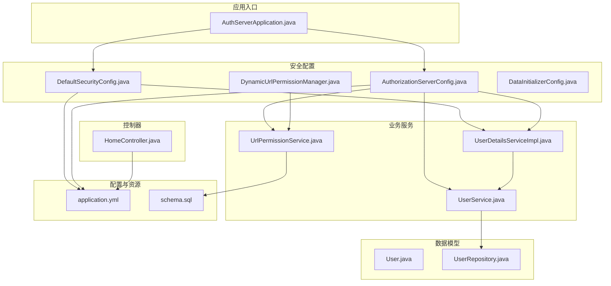
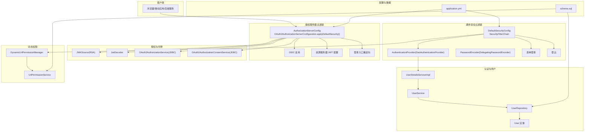
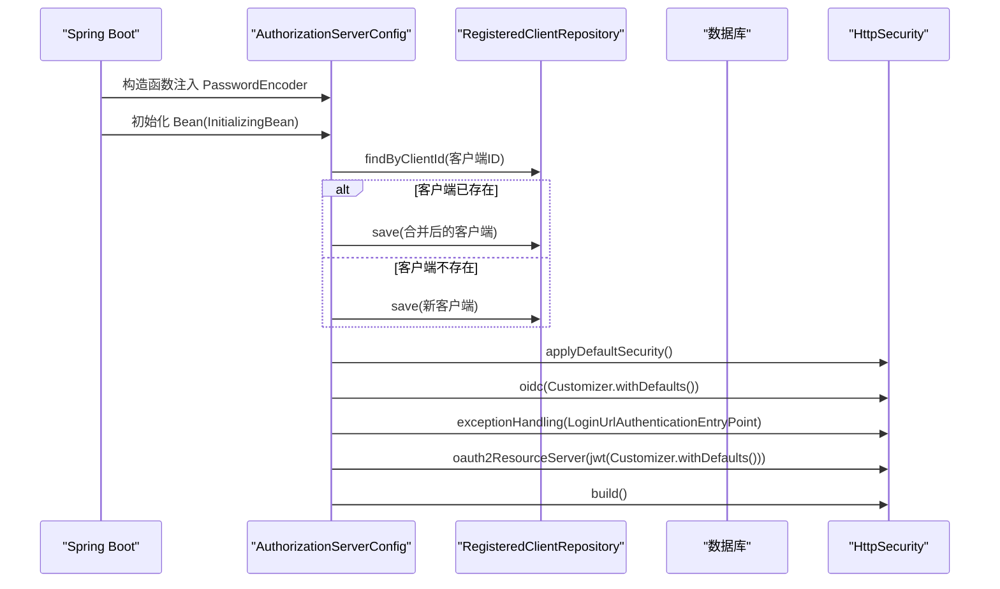
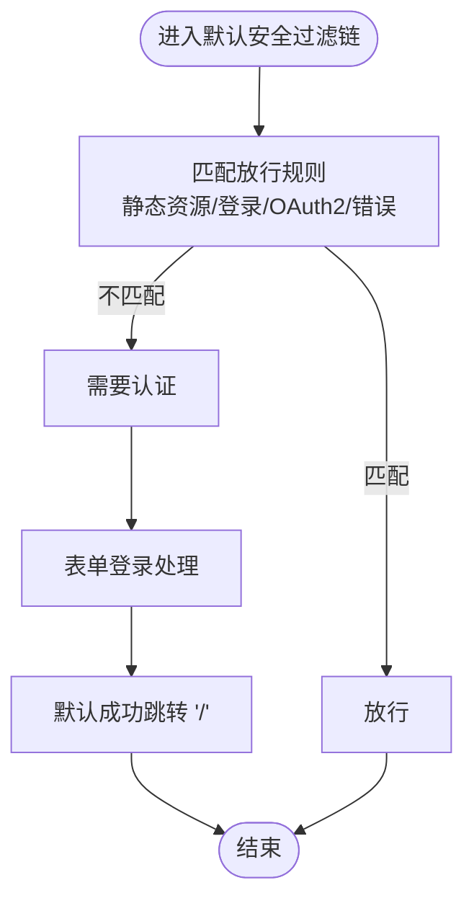
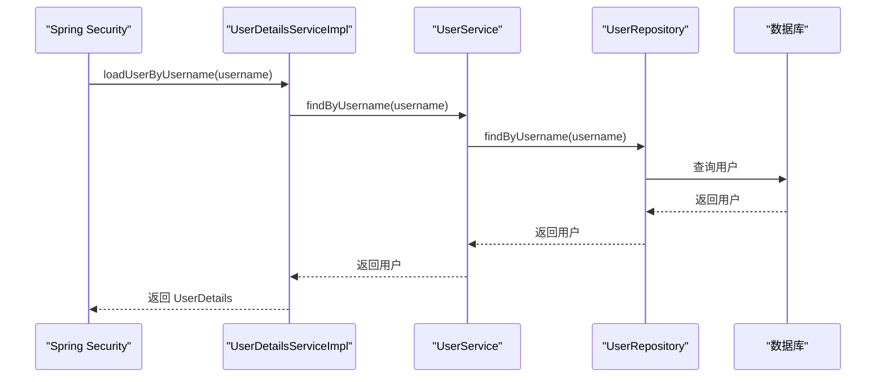
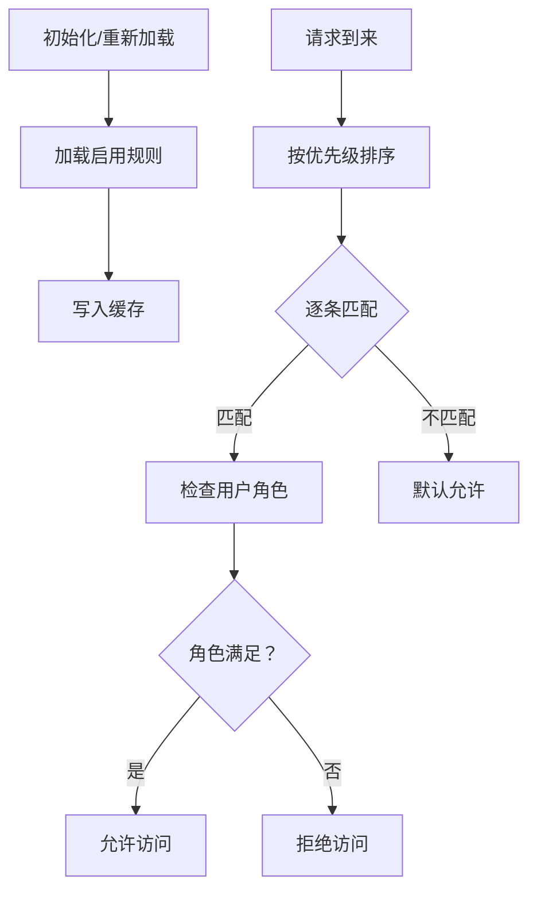
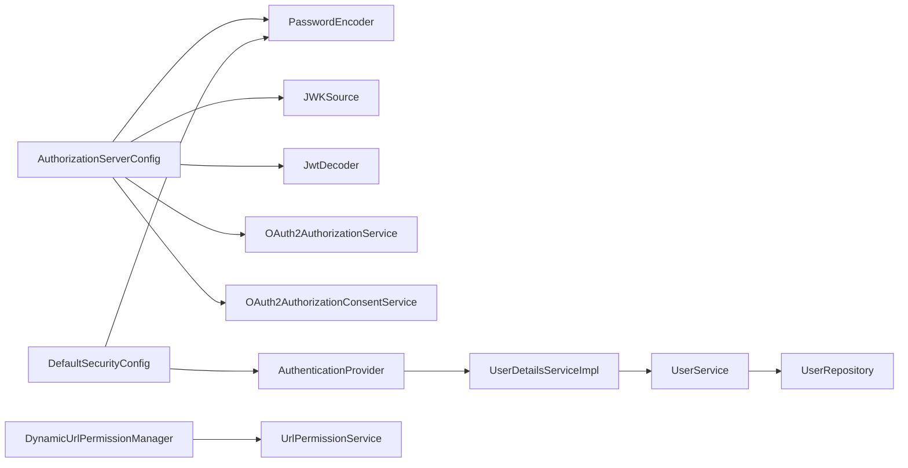

# 安全架构

<cite>
**本文引用的文件**
- [AuthorizationServerConfig.java](file://src/main/java/com/example/authserver/config/AuthorizationServerConfig.java)
- [DefaultSecurityConfig.java](file://src/main/java/com/example/authserver/config/DefaultSecurityConfig.java)
- [DynamicUrlPermissionManager.java](file://src/main/java/com/example/authserver/config/DynamicUrlPermissionManager.java)
- [DataInitializerConfig.java](file://src/main/java/com/example/authserver/config/DataInitializerConfig.java)
- [UserDetailsServiceImpl.java](file://src/main/java/com/example/authserver/service/UserDetailsServiceImpl.java)
- [UserService.java](file://src/main/java/com/example/authserver/service/UserService.java)
- [UrlPermissionService.java](file://src/main/java/com/example/authserver/service/UrlPermissionService.java)
- [User.java](file://src/main/java/com/example/authserver/entity/User.java)
- [UserRepository.java](file://src/main/java/com/example/authserver/repository/UserRepository.java)
- [HomeController.java](file://src/main/java/com/example/authserver/controller/HomeController.java)
- [application.yml](file://src/main/resources/application.yml)
- [schema.sql](file://src/main/resources/schema.sql)
- [AuthServerApplication.java](file://src/main/java/com/example/authserver/AuthServerApplication.java)
- [pom.xml](file://pom.xml)
</cite>

## 目录
1. [简介](#简介)
2. [项目结构](#项目结构)
3. [核心组件](#核心组件)
4. [架构总览](#架构总览)
5. [详细组件分析](#详细组件分析)
6. [依赖分析](#依赖分析)
7. [性能考虑](#性能考虑)
8. [故障排查指南](#故障排查指南)
9. [结论](#结论)
10. [附录](#附录)

## 简介
本项目是一个基于 Spring Security 6 与 Spring Authorization Server 的 OAuth2 授权服务器，提供：
- 授权服务器默认安全过滤链与 OpenID Connect 支持
- 基于 JDBC 的 OAuth2 客户端、授权与授权同意持久化
- 自签名 RSA JWK 用于 JWT 签名与解码
- 动态 URL 权限管理器，结合数据库规则进行细粒度访问控制
- 用户详情服务与密码编码器集成，支持 BCrypt
- 多种 OAuth2 客户端场景：Web 应用（授权码+PKCE）、移动端（公开客户端+PKCE）、后端服务（客户端凭证）

该文档聚焦于安全架构设计、过滤器链配置、认证与授权策略、密码编码器与用户详情服务、JWT 令牌处理、以及授权服务器的安全约束与最佳实践。

## 项目结构
项目采用按功能域划分的层次化结构，核心安全相关模块集中在 config、service、repository、entity 与 controller 包中，配合数据库初始化脚本与 Spring Boot 配置文件。

图表来源
- [AuthServerApplication.java:1-14](file://src/main/java/com/example/authserver/AuthServerApplication.java#L1-L14)
- [DefaultSecurityConfig.java:1-75](file://src/main/java/com/example/authserver/config/DefaultSecurityConfig.java#L1-L75)
- [AuthorizationServerConfig.java:1-256](file://src/main/java/com/example/authserver/config/AuthorizationServerConfig.java#L1-L256)
- [DynamicUrlPermissionManager.java:1-120](file://src/main/java/com/example/authserver/config/DynamicUrlPermissionManager.java#L1-L120)
- [DataInitializerConfig.java:1-109](file://src/main/java/com/example/authserver/config/DataInitializerConfig.java#L1-L109)
- [UserDetailsServiceImpl.java:1-59](file://src/main/java/com/example/authserver/service/UserDetailsServiceImpl.java#L1-L59)
- [UserService.java:1-265](file://src/main/java/com/example/authserver/service/UserService.java#L1-L265)
- [UrlPermissionService.java:1-94](file://src/main/java/com/example/authserver/service/UrlPermissionService.java#L1-L94)
- [User.java:1-66](file://src/main/java/com/example/authserver/entity/User.java#L1-L66)
- [UserRepository.java:1-44](file://src/main/java/com/example/authserver/repository/UserRepository.java#L1-L44)
- [application.yml:1-30](file://src/main/resources/application.yml#L1-L30)
- [schema.sql:1-169](file://src/main/resources/schema.sql#L1-L169)
- [HomeController.java:1-24](file://src/main/java/com/example/authserver/controller/HomeController.java#L1-L24)

章节来源
- [AuthServerApplication.java:1-14](file://src/main/java/com/example/authserver/AuthServerApplication.java#L1-L14)
- [application.yml:1-30](file://src/main/resources/application.yml#L1-L30)
- [schema.sql:1-169](file://src/main/resources/schema.sql#L1-L169)

## 核心组件
- 授权服务器安全配置：负责 OAuth2 授权服务器默认安全、OIDC 支持、异常处理、JWT 资源服务器配置、JWK 源与解码器、授权/授权同意服务、客户端初始化。
- 默认安全配置：配置认证提供者、密码编码器、通用过滤链（登录、登出、静态资源放行、OAuth2 端点放行）。
- 用户详情服务：实现 UserDetailsService，从数据库加载用户并转换为 Spring Security 的 UserDetails。
- 动态 URL 权限管理器：从数据库加载 URL 权限规则，提供匹配逻辑与缓存。
- 数据初始化配置：启动时修复角色描述并初始化默认用户。
- 数据模型与仓库：User 实体与 UserRepository，支撑认证与授权。
- 应用入口与配置：Spring Boot 启动类与 application.yml。

章节来源
- [AuthorizationServerConfig.java:1-256](file://src/main/java/com/example/authserver/config/AuthorizationServerConfig.java#L1-L256)
- [DefaultSecurityConfig.java:1-75](file://src/main/java/com/example/authserver/config/DefaultSecurityConfig.java#L1-L75)
- [UserDetailsServiceImpl.java:1-59](file://src/main/java/com/example/authserver/service/UserDetailsServiceImpl.java#L1-L59)
- [DynamicUrlPermissionManager.java:1-120](file://src/main/java/com/example/authserver/config/DynamicUrlPermissionManager.java#L1-L120)
- [DataInitializerConfig.java:1-109](file://src/main/java/com/example/authserver/config/DataInitializerConfig.java#L1-L109)
- [User.java:1-66](file://src/main/java/com/example/authserver/entity/User.java#L1-L66)
- [UserRepository.java:1-44](file://src/main/java/com/example/authserver/repository/UserRepository.java#L1-L44)
- [application.yml:1-30](file://src/main/resources/application.yml#L1-L30)

## 架构总览
下图展示授权服务器与通用安全过滤链的交互，以及认证提供者、用户详情服务、密码编码器、JWK/JWT、动态 URL 权限管理器之间的关系。

图表来源
- [AuthorizationServerConfig.java:56-77](file://src/main/java/com/example/authserver/config/AuthorizationServerConfig.java#L56-L77)
- [AuthorizationServerConfig.java:211-245](file://src/main/java/com/example/authserver/config/AuthorizationServerConfig.java#L211-L245)
- [AuthorizationServerConfig.java:193-206](file://src/main/java/com/example/authserver/config/AuthorizationServerConfig.java#L193-L206)
- [DefaultSecurityConfig.java:34-73](file://src/main/java/com/example/authserver/config/DefaultSecurityConfig.java#L34-L73)
- [UserDetailsServiceImpl.java:29-57](file://src/main/java/com/example/authserver/service/UserDetailsServiceImpl.java#L29-L57)
- [DynamicUrlPermissionManager.java:45-81](file://src/main/java/com/example/authserver/config/DynamicUrlPermissionManager.java#L45-L81)
- [application.yml:1-30](file://src/main/resources/application.yml#L1-L30)
- [schema.sql:1-169](file://src/main/resources/schema.sql#L1-L169)

## 详细组件分析

### 授权服务器安全配置（AuthorizationServerConfig）
- 过滤器链与默认安全
  - 通过 OAuth2AuthorizationServerConfiguration.applyDefaultSecurity() 应用授权服务器默认安全策略。
  - 启用 OIDC 1.0 支持。
  - 未认证访问授权端点时重定向到登录页。
  - 启用资源服务器 JWT 配置，使用内置解码器。
- 客户端初始化
  - 初始化三种客户端：
    - Web 应用：授权码 + 刷新令牌，要求授权同意，令牌有效期较短。
    - 移动端：公开客户端（无需密钥），强制 PKCE，较长刷新令牌有效期。
    - 后端服务：客户端凭证模式，无需用户授权同意，令牌有效期短。
  - 使用 DelegatingPasswordEncoder 的 BCrypt 前缀对客户端密钥进行编码。
- 授权与授权同意服务
  - 使用 JDBC 实现授权状态与授权同意持久化。
- JWK 与 JWT
  - 生成 RSA 密钥对，构建 JWK 源，提供 JwtDecoder。
  - AuthorizationServerSettings 默认构建。
- 客户端生命周期
  - 通过 InitializingBean 在启动时检查并保存/更新客户端配置。

图表来源
- [AuthorizationServerConfig.java:91-161](file://src/main/java/com/example/authserver/config/AuthorizationServerConfig.java#L91-L161)
- [AuthorizationServerConfig.java:56-77](file://src/main/java/com/example/authserver/config/AuthorizationServerConfig.java#L56-L77)
- [AuthorizationServerConfig.java:242-245](file://src/main/java/com/example/authserver/config/AuthorizationServerConfig.java#L242-L245)

章节来源
- [AuthorizationServerConfig.java:56-77](file://src/main/java/com/example/authserver/config/AuthorizationServerConfig.java#L56-L77)
- [AuthorizationServerConfig.java:91-161](file://src/main/java/com/example/authserver/config/AuthorizationServerConfig.java#L91-L161)
- [AuthorizationServerConfig.java:193-206](file://src/main/java/com/example/authserver/config/AuthorizationServerConfig.java#L193-L206)
- [AuthorizationServerConfig.java:211-245](file://src/main/java/com/example/authserver/config/AuthorizationServerConfig.java#L211-L245)

### 默认安全配置（DefaultSecurityConfig）
- 认证提供者
  - 使用 DaoAuthenticationProvider，绑定 UserDetailsService 与 PasswordEncoder。
- 密码编码器
  - DelegatingPasswordEncoder，支持多种算法，当前用于用户密码与客户端密钥。
- 过滤链
  - 放行静态资源、登录页、OAuth2 端点与错误页面。
  - 其余请求均需认证。
  - 表单登录成功跳转首页，登出后回到登录页。

图表来源
- [DefaultSecurityConfig.java:55-73](file://src/main/java/com/example/authserver/config/DefaultSecurityConfig.java#L55-L73)

章节来源
- [DefaultSecurityConfig.java:34-73](file://src/main/java/com/example/authserver/config/DefaultSecurityConfig.java#L34-L73)

### 用户详情服务与认证流程（UserDetailsServiceImpl）
- 加载用户
  - 通过用户名查询用户，不存在抛出 UsernameNotFoundException。
  - 将用户实体转换为 UserDetails，包含用户名、密码、启用状态与角色集合。
- 事务性读取
  - 使用 @Transactional(readOnly = true) 保证只读事务。

图表来源
- [UserDetailsServiceImpl.java:29-57](file://src/main/java/com/example/authserver/service/UserDetailsServiceImpl.java#L29-L57)
- [UserService.java:39-42](file://src/main/java/com/example/authserver/service/UserService.java#L39-L42)
- [UserRepository.java:21](file://src/main/java/com/example/authserver/repository/UserRepository.java#L21)

章节来源
- [UserDetailsServiceImpl.java:29-57](file://src/main/java/com/example/authserver/service/UserDetailsServiceImpl.java#L29-L57)
- [UserService.java:39-42](file://src/main/java/com/example/authserver/service/UserService.java#L39-L42)
- [UserRepository.java:21](file://src/main/java/com/example/authserver/repository/UserRepository.java#L21)

### 动态 URL 权限管理器（DynamicUrlPermissionManager）
- 规则加载与缓存
  - 启动时加载所有启用的 URL 权限规则，放入并发映射缓存。
  - 提供重新加载、添加、移除规则的方法。
- 权限匹配
  - 按优先级排序，使用 AntPathMatcher 匹配 URL 模式与 HTTP 方法。
  - 若未匹配到规则，默认允许访问。
- 与服务层协作
  - 通过 UrlPermissionService 获取规则列表。

图表来源
- [DynamicUrlPermissionManager.java:36-81](file://src/main/java/com/example/authserver/config/DynamicUrlPermissionManager.java#L36-L81)
- [DynamicUrlPermissionManager.java:86-95](file://src/main/java/com/example/authserver/config/DynamicUrlPermissionManager.java#L86-L95)

章节来源
- [DynamicUrlPermissionManager.java:36-81](file://src/main/java/com/example/authserver/config/DynamicUrlPermissionManager.java#L36-L81)
- [DynamicUrlPermissionManager.java:86-95](file://src/main/java/com/example/authserver/config/DynamicUrlPermissionManager.java#L86-L95)

### 数据初始化配置（DataInitializerConfig）
- 角色描述修复
  - 启动时修复 ROLE_USER 与 ROLE_ADMIN 的描述，避免中文乱码。
- 默认用户初始化
  - 仅在用户表为空时创建默认用户（user/admin），并分配已有角色。
  - 使用 DelegatingPasswordEncoder 对明文密码进行编码。

章节来源
- [DataInitializerConfig.java:45-95](file://src/main/java/com/example/authserver/config/DataInitializerConfig.java#L45-L95)

### 数据模型与仓库（User 实体与 UserRepository）
- User 实体
  - 包含 id、username、password、enabled、时间戳与多对多角色集合。
  - 使用 EAGER 加载角色，便于认证与授权。
- UserRepository
  - 提供按用户名查询、存在性检查、启用/禁用用户列表、模糊搜索等方法。

章节来源
- [User.java:24-65](file://src/main/java/com/example/authserver/entity/User.java#L24-L65)
- [UserRepository.java:16-43](file://src/main/java/com/example/authserver/repository/UserRepository.java#L16-L43)

### 应用入口与配置（AuthServerApplication 与 application.yml）
- AuthServerApplication
  - Spring Boot 启动类，启用自动配置。
- application.yml
  - 数据源配置（MySQL），SQL 初始化（schema.sql），JPA 配置，日志级别。

章节来源
- [AuthServerApplication.java:1-14](file://src/main/java/com/example/authserver/AuthServerApplication.java#L1-L14)
- [application.yml:1-30](file://src/main/resources/application.yml#L1-L30)

### 依赖与技术栈（pom.xml）
- 核心依赖
  - spring-boot-starter-oauth2-authorization-server
  - spring-boot-starter-security
  - spring-boot-starter-data-jpa
  - spring-boot-starter-web
  - spring-boot-starter-thymeleaf 与 thymeleaf-extras-springsecurity6
  - mysql-connector-j
  - lombok
- 构建插件
  - spring-boot-maven-plugin、maven-compiler-plugin

章节来源
- [pom.xml:1-147](file://pom.xml#L1-L147)

## 依赖分析
- 组件耦合
  - AuthorizationServerConfig 依赖 PasswordEncoder、Jdbc 操作、RegisteredClientRepository、JWKSource、JwtDecoder、AuthorizationServerSettings。
  - DefaultSecurityConfig 依赖 AuthenticationProvider、PasswordEncoder、HttpSecurity。
  - UserDetailsServiceImpl 依赖 UserService，UserService 依赖 UserRepository、RoleRepository、PasswordEncoder。
  - DynamicUrlPermissionManager 依赖 UrlPermissionService；UrlPermissionService 依赖 UrlPermissionRepository。
- 外部依赖
  - Spring Authorization Server、Spring Security、JPA/Hibernate、MySQL。
- 可能的循环依赖
  - 未发现直接循环依赖；UserDetailsServiceImpl 与 UserService 之间为单向依赖。

图表来源
- [AuthorizationServerConfig.java:47-51](file://src/main/java/com/example/authserver/config/AuthorizationServerConfig.java#L47-L51)
- [DefaultSecurityConfig.java:34-49](file://src/main/java/com/example/authserver/config/DefaultSecurityConfig.java#L34-L49)
- [UserDetailsServiceImpl.java:24](file://src/main/java/com/example/authserver/service/UserDetailsServiceImpl.java#L24)
- [UserService.java:26-28](file://src/main/java/com/example/authserver/service/UserService.java#L26-L28)
- [DynamicUrlPermissionManager.java:25](file://src/main/java/com/example/authserver/config/DynamicUrlPermissionManager.java#L25)

章节来源
- [AuthorizationServerConfig.java:47-51](file://src/main/java/com/example/authserver/config/AuthorizationServerConfig.java#L47-L51)
- [DefaultSecurityConfig.java:34-49](file://src/main/java/com/example/authserver/config/DefaultSecurityConfig.java#L34-L49)
- [UserDetailsServiceImpl.java:24](file://src/main/java/com/example/authserver/service/UserDetailsServiceImpl.java#L24)
- [UserService.java:26-28](file://src/main/java/com/example/authserver/service/UserService.java#L26-L28)
- [DynamicUrlPermissionManager.java:25](file://src/main/java/com/example/authserver/config/DynamicUrlPermissionManager.java#L25)

## 性能考虑
- 密码编码器
  - 使用 DelegatingPasswordEncoder，建议在生产环境保持默认强度，避免过度降低成本参数。
- 用户加载
  - User 实体使用 EAGER 加载角色，简化认证流程，但可能增加一次查询；若用户角色较多，可评估懒加载与缓存策略。
- 动态权限匹配
  - 使用并发映射缓存规则，AntPathMatcher 为 O(n) 匹配；建议控制规则数量与优先级，避免过多冲突规则导致匹配开销。
- JDBC 存储
  - 授权与授权同意使用 JDBC，适合中小规模场景；高并发下建议评估数据库连接池、索引与查询优化。
- RSA JWK
  - 生成 RSA 密钥对在启动时进行，建议在生产环境使用外部密钥管理与轮换策略。

[本节为通用指导，不直接分析具体文件]

## 故障排查指南
- 登录失败
  - 检查密码是否使用 DelegatingPasswordEncoder 编码；确认用户存在且 enabled 为 true。
- OAuth2 授权失败
  - 检查客户端配置（授权类型、重定向 URI、PKCE 要求）；确认客户端密钥编码格式正确。
- JWT 解码失败
  - 检查 JWK 源是否正确生成；确认 JwtDecoder 已注入到资源服务器配置。
- URL 权限不生效
  - 检查动态权限规则是否启用、优先级是否正确；确认请求方法与 URL 模式匹配。
- 数据库初始化问题
  - 确认 schema.sql 已执行，角色与权限规则已初始化；检查 application.yml 的 SQL 初始化配置。

章节来源
- [DefaultSecurityConfig.java:46-49](file://src/main/java/com/example/authserver/config/DefaultSecurityConfig.java#L46-L49)
- [AuthorizationServerConfig.java:91-161](file://src/main/java/com/example/authserver/config/AuthorizationServerConfig.java#L91-L161)
- [AuthorizationServerConfig.java:242-245](file://src/main/java/com/example/authserver/config/AuthorizationServerConfig.java#L242-L245)
- [DynamicUrlPermissionManager.java:45-81](file://src/main/java/com/example/authserver/config/DynamicUrlPermissionManager.java#L45-L81)
- [application.yml:12-16](file://src/main/resources/application.yml#L12-L16)

## 结论
本项目以 Spring Security 与 Spring Authorization Server 为核心，构建了具备 OIDC 支持、JDBC 存储、动态 URL 权限控制与自签名 JWT 的 OAuth2 授权服务器。通过明确的过滤器链配置、认证提供者与用户详情服务集成、密码编码器与客户端初始化策略，实现了多场景客户端适配与安全约束。建议在生产环境中进一步强化密钥管理、数据库性能与访问控制策略，并持续监控与审计授权与令牌发放行为。

[本节为总结性内容，不直接分析具体文件]

## 附录

### 安全配置类设计要点
- 授权服务器过滤链
  - 使用 applyDefaultSecurity() 作为基础，再叠加 OIDC 与资源服务器 JWT 配置。
  - 异常处理重定向至登录页，确保用户引导。
- 默认安全过滤链
  - 明确放行静态资源、登录、OAuth2 端点与错误页面，其余请求统一认证。
- 密码编码器
  - DelegatingPasswordEncoder，支持 BCrypt，适用于用户与客户端密钥。
- 动态权限
  - 基于数据库规则的 URL 匹配，支持优先级与缓存，便于运行时调整。

章节来源
- [AuthorizationServerConfig.java:56-77](file://src/main/java/com/example/authserver/config/AuthorizationServerConfig.java#L56-L77)
- [DefaultSecurityConfig.java:55-73](file://src/main/java/com/example/authserver/config/DefaultSecurityConfig.java#L55-L73)
- [DynamicUrlPermissionManager.java:45-81](file://src/main/java/com/example/authserver/config/DynamicUrlPermissionManager.java#L45-L81)

### OAuth2 授权服务器安全约束与防护
- 客户端类型与授权模式
  - Web 应用：授权码 + 刷新令牌 + 授权同意 + 令牌有效期较短。
  - 移动端：公开客户端 + PKCE + 较长刷新令牌有效期。
  - 后端服务：客户端凭证 + 无需用户授权同意 + 短令牌有效期。
- 令牌策略
  - 不重复使用刷新令牌，严格控制访问令牌与刷新令牌有效期。
- 资源保护
  - 资源服务器启用 JWT，使用 JWK 源进行解码，确保令牌有效性与签名验证。
- 用户与权限
  - 用户详情服务从数据库加载角色，动态权限管理器按规则匹配，支持运行时调整。

章节来源
- [AuthorizationServerConfig.java:94-154](file://src/main/java/com/example/authserver/config/AuthorizationServerConfig.java#L94-L154)
- [AuthorizationServerConfig.java:211-245](file://src/main/java/com/example/authserver/config/AuthorizationServerConfig.java#L211-L245)
- [UserDetailsServiceImpl.java:29-57](file://src/main/java/com/example/authserver/service/UserDetailsServiceImpl.java#L29-L57)
- [DynamicUrlPermissionManager.java:64-81](file://src/main/java/com/example/authserver/config/DynamicUrlPermissionManager.java#L64-L81)

### 最佳实践
- 密码与密钥
  - 使用 DelegatingPasswordEncoder 的 BCrypt 前缀；客户端密钥与用户密码均应加密存储。
- 客户端管理
  - 为不同客户端选择合适的授权模式与 PKCE；严格限制重定向 URI。
- 令牌管理
  - 控制令牌有效期，避免长期有效令牌；禁用刷新令牌复用。
- 动态权限
  - 合理设置规则优先级，避免冲突；定期审计 URL 权限规则。
- 生产部署
  - 使用外部密钥管理与轮换；优化数据库索引与连接池；启用 HTTPS 与安全头。

[本节为通用指导，不直接分析具体文件]