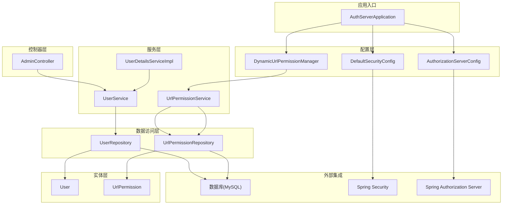
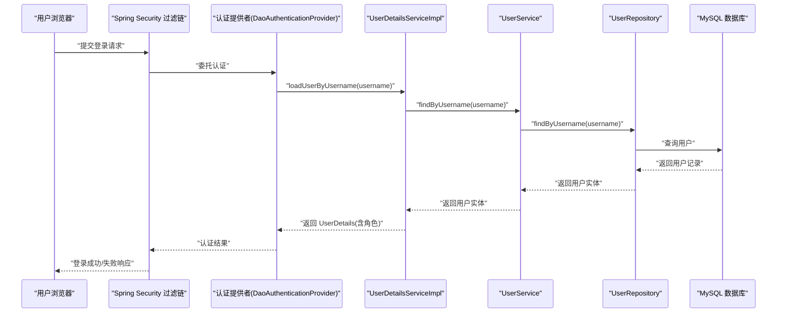
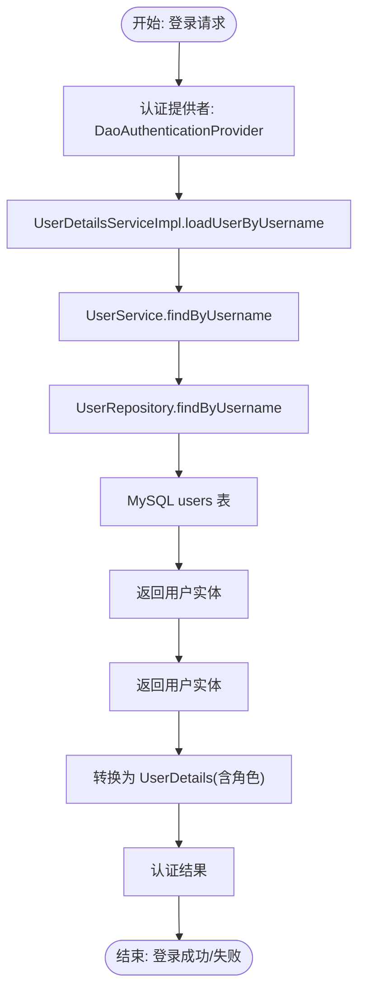
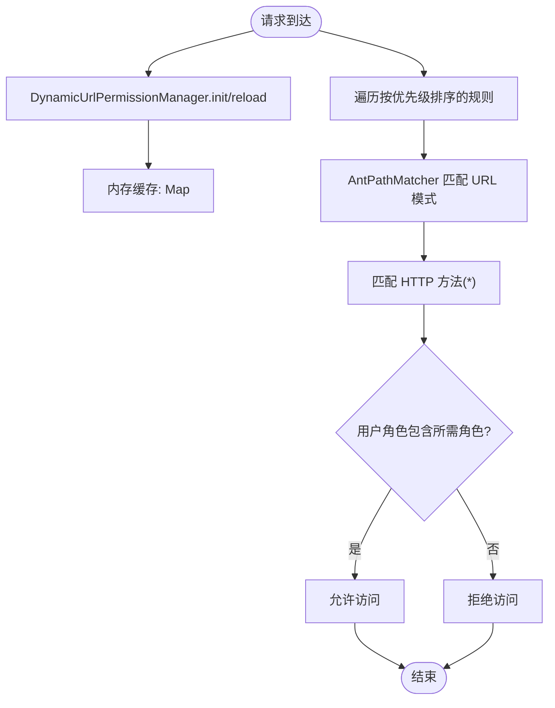
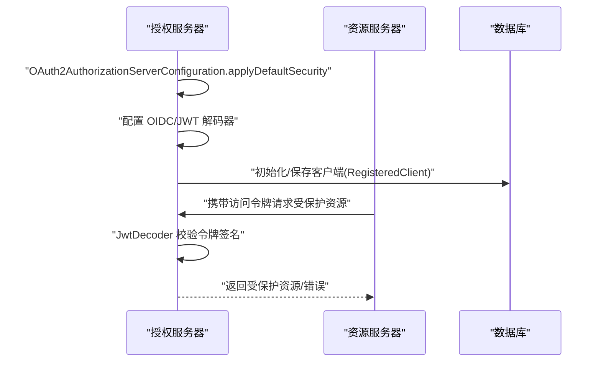
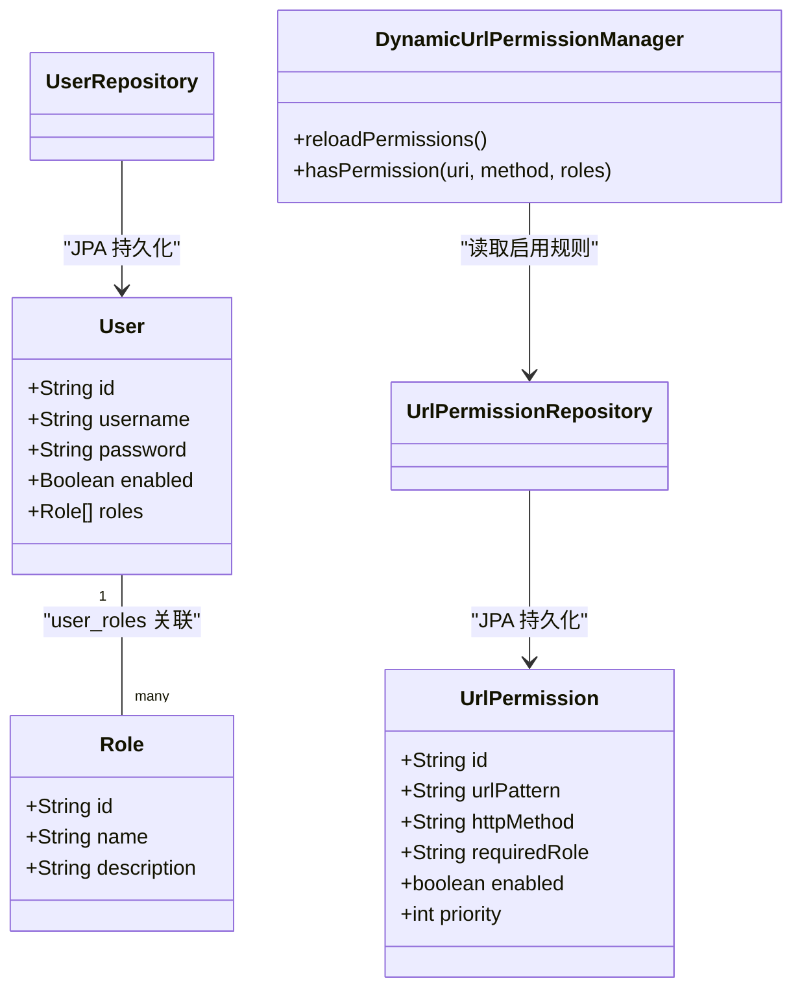
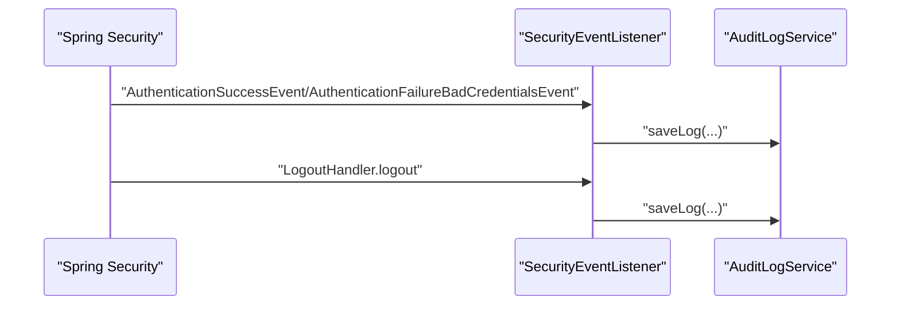
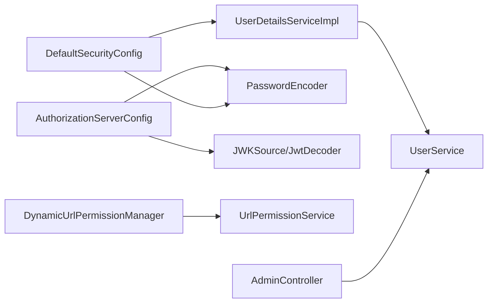

# 数据流架构

<cite>
**本文引用的文件**
- [AuthServerApplication.java](file://src/main/java/com/example/authserver/AuthServerApplication.java)
- [DefaultSecurityConfig.java](file://src/main/java/com/example/authserver/config/DefaultSecurityConfig.java)
- [AuthorizationServerConfig.java](file://src/main/java/com/example/authserver/config/AuthorizationServerConfig.java)
- [DynamicUrlPermissionManager.java](file://src/main/java/com/example/authserver/config/DynamicUrlPermissionManager.java)
- [application.yml](file://src/main/resources/application.yml)
- [UserDetailsServiceImpl.java](file://src/main/java/com/example/authserver/service/UserDetailsServiceImpl.java)
- [UrlPermissionService.java](file://src/main/java/com/example/authserver/service/UrlPermissionService.java)
- [UrlPermissionRepository.java](file://src/main/java/com/example/authserver/repository/UrlPermissionRepository.java)
- [UrlPermission.java](file://src/main/java/com/example/authserver/entity/UrlPermission.java)
- [UserService.java](file://src/main/java/com/example/authserver/service/UserService.java)
- [UserRepository.java](file://src/main/java/com/example/authserver/repository/UserRepository.java)
- [User.java](file://src/main/java/com/example/authserver/entity/User.java)
- [AdminController.java](file://src/main/java/com/example/authserver/controller/AdminController.java)
- [SecurityEventListener.java](file://src/main/java/com/example/authserver/listener/SecurityEventListener.java)
- [AuditLog.java](file://src/main/java/com/example/authserver/annotation/AuditLog.java)
- [ModuleType.java](file://src/main/java/com/example/authserver/enums/ModuleType.java)
- [OperationType.java](file://src/main/java/com/example/authserver/enums/OperationType.java)
- [schema.sql](file://src/main/resources/schema.sql)
</cite>

## 目录
1. [简介](#简介)
2. [项目结构](#项目结构)
3. [核心组件](#核心组件)
4. [架构总览](#架构总览)
5. [详细组件分析](#详细组件分析)
6. [依赖分析](#依赖分析)
7. [性能考虑](#性能考虑)
8. [故障排查指南](#故障排查指南)
9. [结论](#结论)
10. [附录](#附录)

## 简介
本文件系统性梳理认证服务器的数据流架构，覆盖从用户请求到数据库访问的完整路径；重点阐述三类数据流：
- 用户认证数据流：从登录请求到用户详情加载与认证提供者的调用链
- 权限验证数据流：从请求进入安全过滤链到动态 URL 权限匹配与角色校验
- OAuth2 令牌数据流：授权服务器配置、客户端注册、令牌签发与校验流程
同时，深入解析动态权限管理的数据流机制与 URL 权限匹配算法，分析 JPA 数据访问层的数据流处理与缓存策略，并给出数据流优化建议与性能监控方案。

## 项目结构
项目采用典型的 Spring Boot 分层结构，按功能域划分包：
- config：安全与授权服务器配置、动态权限管理
- controller：HTTP 控制器（如管理员模块）
- service：业务服务（用户、角色、URL 权限、客户端等）
- repository：JPA 数据访问层
- entity：JPA 实体
- listener：安全事件监听与审计日志
- enums：审计日志模块与操作类型枚举
- resources：配置文件与数据库初始化脚本

图表来源
- [AuthServerApplication.java:1-14](file://src/main/java/com/example/authserver/AuthServerApplication.java#L1-L14)
- [DefaultSecurityConfig.java:1-78](file://src/main/java/com/example/authserver/config/DefaultSecurityConfig.java#L1-L78)
- [AuthorizationServerConfig.java:1-256](file://src/main/java/com/example/authserver/config/AuthorizationServerConfig.java#L1-L256)
- [DynamicUrlPermissionManager.java:1-120](file://src/main/java/com/example/authserver/config/DynamicUrlPermissionManager.java#L1-L120)
- [AdminController.java:1-288](file://src/main/java/com/example/authserver/controller/AdminController.java#L1-L288)
- [UserDetailsServiceImpl.java:1-59](file://src/main/java/com/example/authserver/service/UserDetailsServiceImpl.java#L1-L59)
- [UserService.java:1-265](file://src/main/java/com/example/authserver/service/UserService.java#L1-L265)
- [UrlPermissionService.java:1-94](file://src/main/java/com/example/authserver/service/UrlPermissionService.java#L1-L94)
- [UserRepository.java:1-44](file://src/main/java/com/example/authserver/repository/UserRepository.java#L1-L44)
- [UrlPermissionRepository.java:1-32](file://src/main/java/com/example/authserver/repository/UrlPermissionRepository.java#L1-L32)
- [User.java:1-66](file://src/main/java/com/example/authserver/entity/User.java#L1-L66)
- [UrlPermission.java:1-73](file://src/main/java/com/example/authserver/entity/UrlPermission.java#L1-L73)

章节来源
- [AuthServerApplication.java:1-14](file://src/main/java/com/example/authserver/AuthServerApplication.java#L1-L14)
- [application.yml:1-30](file://src/main/resources/application.yml#L1-L30)

## 核心组件
- 应用入口与容器：应用启动类负责引导 Spring Boot 容器
- 安全配置：
  - 默认安全配置：定义认证提供者、密码编码器、默认安全过滤链（登录、退出、静态资源放行）
  - 授权服务器配置：启用 OAuth2 Authorization Server 默认安全、OIDC、JWT 解码器、JDBC 存储授权与授权同意
- 动态 URL 权限管理：从数据库加载权限规则，提供匹配与缓存能力
- 用户认证与详情：基于数据库的用户详情加载与角色转换
- 业务服务：用户与角色管理、URL 权限规则 CRUD、审计日志
- 数据访问层：JPA Repository 提供用户与 URL 权限规则的持久化
- 控制器：管理员模块的用户管理与权限变更
- 审计与事件：安全事件监听器记录登录/登出审计日志

章节来源
- [DefaultSecurityConfig.java:24-78](file://src/main/java/com/example/authserver/config/DefaultSecurityConfig.java#L24-L78)
- [AuthorizationServerConfig.java:44-256](file://src/main/java/com/example/authserver/config/AuthorizationServerConfig.java#L44-L256)
- [DynamicUrlPermissionManager.java:16-120](file://src/main/java/com/example/authserver/config/DynamicUrlPermissionManager.java#L16-L120)
- [UserDetailsServiceImpl.java:15-59](file://src/main/java/com/example/authserver/service/UserDetailsServiceImpl.java#L15-L59)
- [UserService.java:18-265](file://src/main/java/com/example/authserver/service/UserService.java#L18-L265)
- [UrlPermissionService.java:12-94](file://src/main/java/com/example/authserver/service/UrlPermissionService.java#L12-L94)
- [UserRepository.java:12-44](file://src/main/java/com/example/authserver/repository/UserRepository.java#L12-L44)
- [UrlPermissionRepository.java:10-32](file://src/main/java/com/example/authserver/repository/UrlPermissionRepository.java#L10-L32)
- [AdminController.java:22-288](file://src/main/java/com/example/authserver/controller/AdminController.java#L22-L288)
- [SecurityEventListener.java:19-135](file://src/main/java/com/example/authserver/listener/SecurityEventListener.java#L19-L135)

## 架构总览
下图展示从用户请求到数据库访问的总体数据流，包括认证、权限验证与 OAuth2 令牌处理的关键节点。

图表来源
- [DefaultSecurityConfig.java:35-42](file://src/main/java/com/example/authserver/config/DefaultSecurityConfig.java#L35-L42)
- [UserDetailsServiceImpl.java:29-57](file://src/main/java/com/example/authserver/service/UserDetailsServiceImpl.java#L29-L57)
- [UserService.java:39-42](file://src/main/java/com/example/authserver/service/UserService.java#L39-L42)
- [UserRepository.java:18-21](file://src/main/java/com/example/authserver/repository/UserRepository.java#L18-L21)

## 详细组件分析

### 用户认证数据流
- 认证提供者装配：配置 DaoAuthenticationProvider，绑定 UserDetailsService 与 PasswordEncoder
- 用户详情加载：UserDetailsServiceImpl 通过 UserService 查询用户，转换为 Spring Security 的 UserDetails 并注入角色集合
- 数据访问：UserRepository 提供按用户名查询与存在性检查
- 错误处理：用户名不存在或加载失败抛出 UsernameNotFoundException

图表来源
- [DefaultSecurityConfig.java:35-42](file://src/main/java/com/example/authserver/config/DefaultSecurityConfig.java#L35-L42)
- [UserDetailsServiceImpl.java:29-57](file://src/main/java/com/example/authserver/service/UserDetailsServiceImpl.java#L29-L57)
- [UserService.java:39-42](file://src/main/java/com/example/authserver/service/UserService.java#L39-L42)
- [UserRepository.java:18-21](file://src/main/java/com/example/authserver/repository/UserRepository.java#L18-L21)

章节来源
- [DefaultSecurityConfig.java:35-50](file://src/main/java/com/example/authserver/config/DefaultSecurityConfig.java#L35-L50)
- [UserDetailsServiceImpl.java:29-57](file://src/main/java/com/example/authserver/service/UserDetailsServiceImpl.java#L29-L57)
- [UserService.java:39-42](file://src/main/java/com/example/authserver/service/UserService.java#L39-L42)
- [UserRepository.java:18-21](file://src/main/java/com/example/authserver/repository/UserRepository.java#L18-L21)

### 权限验证数据流与动态权限管理
- 动态权限管理器：启动时加载所有启用的 URL 权限规则，维护并发安全的内存缓存；提供匹配与增删改能力
- URL 权限匹配算法：
  - 按优先级降序排序，优先匹配高优先级规则
  - 使用 AntPathMatcher 匹配 URL 模式，HTTP 方法支持“*”表示所有方法
  - 匹配成功后检查用户角色是否包含所需角色
- 数据访问：UrlPermissionRepository 提供按启用状态查询与索引优化
- 控制器：AdminController 作为管理员后台入口，触发用户与权限变更

图表来源
- [DynamicUrlPermissionManager.java:36-81](file://src/main/java/com/example/authserver/config/DynamicUrlPermissionManager.java#L36-L81)
- [DynamicUrlPermissionManager.java:86-95](file://src/main/java/com/example/authserver/config/DynamicUrlPermissionManager.java#L86-L95)
- [UrlPermissionRepository.java:16-20](file://src/main/java/com/example/authserver/repository/UrlPermissionRepository.java#L16-L20)
- [UrlPermission.java:24-40](file://src/main/java/com/example/authserver/entity/UrlPermission.java#L24-L40)

章节来源
- [DynamicUrlPermissionManager.java:23-120](file://src/main/java/com/example/authserver/config/DynamicUrlPermissionManager.java#L23-L120)
- [UrlPermissionService.java:24-27](file://src/main/java/com/example/authserver/service/UrlPermissionService.java#L24-L27)
- [UrlPermissionRepository.java:16-20](file://src/main/java/com/example/authserver/repository/UrlPermissionRepository.java#L16-L20)
- [UrlPermission.java:14-73](file://src/main/java/com/example/authserver/entity/UrlPermission.java#L14-L73)
- [AdminController.java:36-120](file://src/main/java/com/example/authserver/controller/AdminController.java#L36-L120)

### OAuth2 令牌数据流
- 授权服务器配置：启用 OAuth2 Authorization Server 默认安全、OIDC、JWT 解码器；配置 JDBC 存储授权与授权同意
- 客户端初始化：通过 InitializingBean 在启动时保存默认客户端（Web 应用、移动端、后端服务），设置授权类型、作用域、PKCE、令牌有效期等
- 令牌签发与校验：使用 JWK（RSA）生成与签名，JWT 解码器用于资源服务器校验令牌

图表来源
- [AuthorizationServerConfig.java:56-77](file://src/main/java/com/example/authserver/config/AuthorizationServerConfig.java#L56-L77)
- [AuthorizationServerConfig.java:91-161](file://src/main/java/com/example/authserver/config/AuthorizationServerConfig.java#L91-L161)
- [AuthorizationServerConfig.java:193-245](file://src/main/java/com/example/authserver/config/AuthorizationServerConfig.java#L193-L245)

章节来源
- [AuthorizationServerConfig.java:44-256](file://src/main/java/com/example/authserver/config/AuthorizationServerConfig.java#L44-L256)
- [application.yml:4-24](file://src/main/resources/application.yml#L4-L24)

### JPA 数据访问层的数据流与缓存策略
- 用户与角色：User 实体通过 user_roles 关联表实现多对多；UserRepository 提供按用户名、启用状态与模糊搜索
- URL 权限规则：UrlPermissionRepository 提供按启用状态查询与索引；DynamicUrlPermissionManager 内存缓存提升匹配性能
- 缓存策略：
  - 内存缓存：ConcurrentHashMap 存储已加载的权限规则，避免每次请求都访问数据库
  - 数据库索引：url_permissions 表对 url_pattern 与 enabled 建立索引，加速查询
- 事务与一致性：服务层使用 @Transactional 确保用户创建/更新/删除与角色分配的一致性

图表来源
- [User.java:20-66](file://src/main/java/com/example/authserver/entity/User.java#L20-L66)
- [UrlPermission.java:14-73](file://src/main/java/com/example/authserver/entity/UrlPermission.java#L14-L73)
- [UserRepository.java:15-44](file://src/main/java/com/example/authserver/repository/UserRepository.java#L15-L44)
- [UrlPermissionRepository.java:13-32](file://src/main/java/com/example/authserver/repository/UrlPermissionRepository.java#L13-L32)
- [DynamicUrlPermissionManager.java:25-54](file://src/main/java/com/example/authserver/config/DynamicUrlPermissionManager.java#L25-L54)

章节来源
- [User.java:20-66](file://src/main/java/com/example/authserver/entity/User.java#L20-L66)
- [UrlPermission.java:14-73](file://src/main/java/com/example/authserver/entity/UrlPermission.java#L14-L73)
- [UserRepository.java:15-44](file://src/main/java/com/example/authserver/repository/UserRepository.java#L15-L44)
- [UrlPermissionRepository.java:13-32](file://src/main/java/com/example/authserver/repository/UrlPermissionRepository.java#L13-L32)
- [DynamicUrlPermissionManager.java:25-54](file://src/main/java/com/example/authserver/config/DynamicUrlPermissionManager.java#L25-L54)

### 审计与安全事件
- 安全事件监听：监听登录成功/失败事件与登出事件，结合 AuditLogService 记录审计日志
- 审计注解：通过 @AuditLog 标注控制器方法，配合 AOP 自动记录操作日志
- 日志内容：包含操作模块、操作类型、描述、请求 URI、方法、IP、结果与错误信息等

图表来源
- [SecurityEventListener.java:33-95](file://src/main/java/com/example/authserver/listener/SecurityEventListener.java#L33-L95)
- [AuditLog.java:12-32](file://src/main/java/com/example/authserver/annotation/AuditLog.java#L12-L32)
- [ModuleType.java:6-22](file://src/main/java/com/example/authserver/enums/ModuleType.java#L6-L22)
- [OperationType.java:6-25](file://src/main/java/com/example/authserver/enums/OperationType.java#L6-L25)

章节来源
- [SecurityEventListener.java:19-135](file://src/main/java/com/example/authserver/listener/SecurityEventListener.java#L19-L135)
- [AuditLog.java:12-32](file://src/main/java/com/example/authserver/annotation/AuditLog.java#L12-L32)
- [ModuleType.java:6-22](file://src/main/java/com/example/authserver/enums/ModuleType.java#L6-L22)
- [OperationType.java:6-25](file://src/main/java/com/example/authserver/enums/OperationType.java#L6-L25)

## 依赖分析
- 组件耦合：
  - DefaultSecurityConfig 依赖 UserDetailsServiceImpl 与 PasswordEncoder
  - AuthorizationServerConfig 依赖 PasswordEncoder、JdbcTemplates、RegisteredClientRepository、JWKSource、JwtDecoder
  - DynamicUrlPermissionManager 依赖 UrlPermissionService
  - AdminController 依赖 UserService
  - UserDetailsServiceImpl 依赖 UserService
- 外部依赖：
  - Spring Security 与 Spring Authorization Server
  - MySQL 数据库与 JPA/Hibernate
  - Thymeleaf 模板引擎（开发环境）

图表来源
- [DefaultSecurityConfig.java:35-50](file://src/main/java/com/example/authserver/config/DefaultSecurityConfig.java#L35-L50)
- [AuthorizationServerConfig.java:47-51](file://src/main/java/com/example/authserver/config/AuthorizationServerConfig.java#L47-L51)
- [DynamicUrlPermissionManager.java:25](file://src/main/java/com/example/authserver/config/DynamicUrlPermissionManager.java#L25)
- [AdminController.java:31](file://src/main/java/com/example/authserver/controller/AdminController.java#L31)
- [UserDetailsServiceImpl.java:24](file://src/main/java/com/example/authserver/service/UserDetailsServiceImpl.java#L24)

章节来源
- [DefaultSecurityConfig.java:35-50](file://src/main/java/com/example/authserver/config/DefaultSecurityConfig.java#L35-L50)
- [AuthorizationServerConfig.java:47-51](file://src/main/java/com/example/authserver/config/AuthorizationServerConfig.java#L47-L51)
- [DynamicUrlPermissionManager.java:25](file://src/main/java/com/example/authserver/config/DynamicUrlPermissionManager.java#L25)
- [AdminController.java:31](file://src/main/java/com/example/authserver/controller/AdminController.java#L31)
- [UserDetailsServiceImpl.java:24](file://src/main/java/com/example/authserver/service/UserDetailsServiceImpl.java#L24)

## 性能考虑
- 动态权限匹配性能：
  - 使用内存缓存（ConcurrentHashMap）存储启用的 URL 权限规则，避免频繁数据库访问
  - 优先级排序与 AntPathMatcher 匹配，建议在规则数量较多时定期清理冗余规则，保持缓存命中率
- 数据库访问优化：
  - UrlPermissionRepository 查询启用规则时按优先级降序，建议确保 url_permissions 表的索引有效
  - 用户查询与模糊搜索使用现有索引与查询方法，避免 N+1 查询
- 认证与授权：
  - 使用 DelegatingPasswordEncoder 与 BCrypt 密码编码器，兼顾安全性与性能
  - 授权服务器使用 JDBC 存储授权状态，建议对授权表建立必要索引以降低查询延迟
- 监控与可观测性：
  - 建议开启 SQL 日志与慢查询日志，结合 APM 工具追踪认证与权限匹配耗时
  - 审计日志表可用于追踪登录/登出与关键操作，便于问题定位

[本节为通用性能建议，不直接分析具体文件]

## 故障排查指南
- 登录失败：
  - 检查用户名是否存在与密码是否正确；查看 SecurityEventListener 记录的登录失败审计日志
  - 确认 UserDetailsServiceImpl 的用户查询与角色映射是否正常
- 权限拒绝：
  - 检查 DynamicUrlPermissionManager 缓存是否正确加载；确认 URL 模式与 HTTP 方法配置
  - 核对用户角色是否包含所需角色；必要时重新加载权限缓存
- OAuth2 客户端问题：
  - 确认客户端初始化是否成功；检查 RegisteredClient 的授权类型、作用域与 PKCE 设置
  - 校验 JWT 解码器与 JWK 源配置是否正确
- 数据库初始化：
  - 确认 schema.sql 初始化脚本执行情况；检查表结构与索引是否创建成功

章节来源
- [SecurityEventListener.java:54-71](file://src/main/java/com/example/authserver/listener/SecurityEventListener.java#L54-L71)
- [UserDetailsServiceImpl.java:34-56](file://src/main/java/com/example/authserver/service/UserDetailsServiceImpl.java#L34-L56)
- [DynamicUrlPermissionManager.java:45-54](file://src/main/java/com/example/authserver/config/DynamicUrlPermissionManager.java#L45-L54)
- [AuthorizationServerConfig.java:91-161](file://src/main/java/com/example/authserver/config/AuthorizationServerConfig.java#L91-L161)
- [schema.sql:42-81](file://src/main/resources/schema.sql#L42-L81)

## 结论
本认证服务器通过清晰的分层与职责分离，构建了稳定的数据流架构：
- 用户认证：从安全过滤链到认证提供者与数据库的完整闭环
- 权限验证：基于动态 URL 权限管理的高效匹配与缓存策略
- OAuth2 令牌：授权服务器配置与 JDBC 存储保障令牌签发与校验
- 数据访问：JPA 与内存缓存协同，满足高并发下的性能需求
建议持续优化权限规则与数据库索引，完善监控与审计体系，以支撑生产环境的稳定性与可运维性。

[本节为总结性内容，不直接分析具体文件]

## 附录
- 数据库初始化脚本要点：包含 users、roles、user_roles、url_permissions、oauth2_* 等表，以及审计日志表
- 配置要点：数据源、JPA、SQL 初始化、Thymeleaf 开发调试配置

章节来源
- [schema.sql:8-194](file://src/main/resources/schema.sql#L8-L194)
- [application.yml:4-24](file://src/main/resources/application.yml#L4-L24)