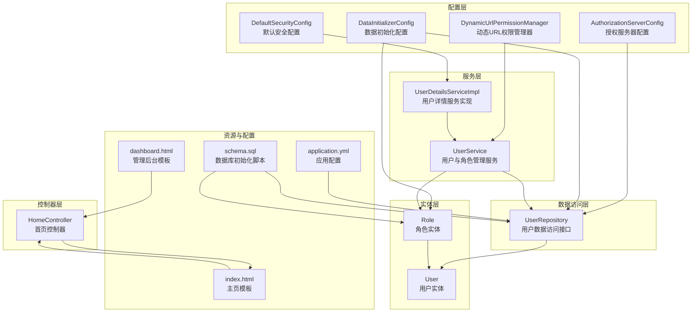
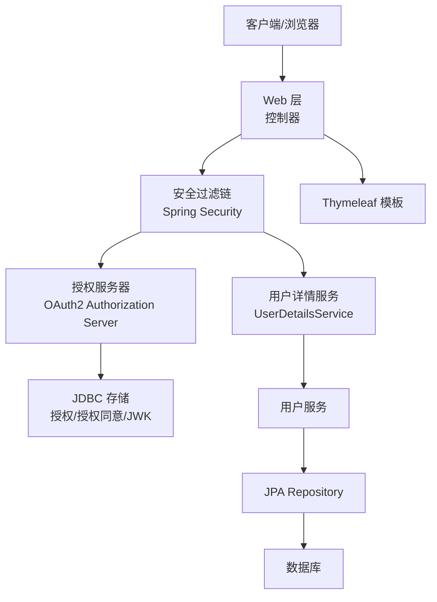
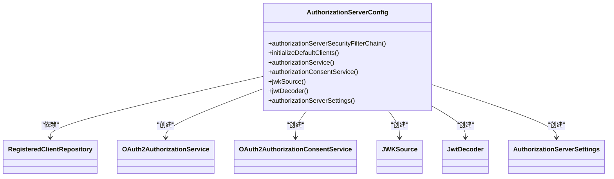
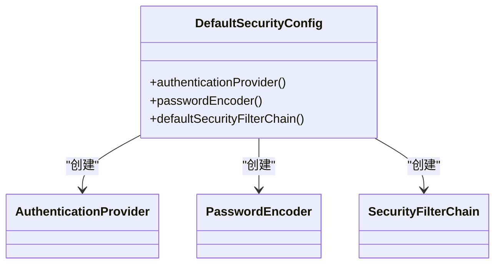
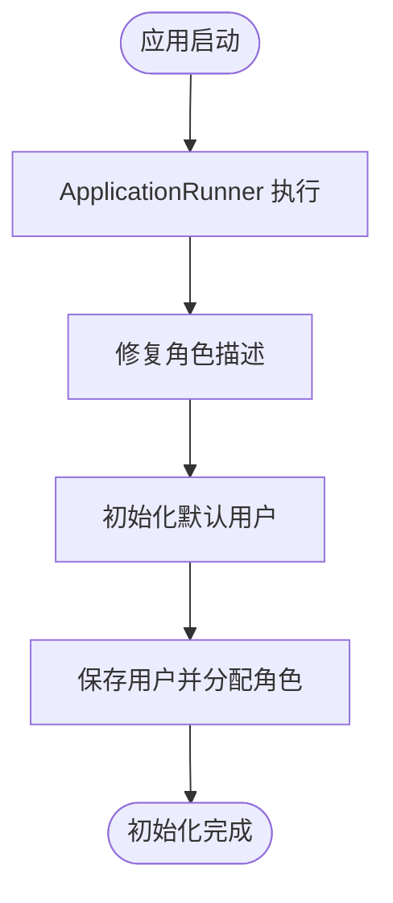
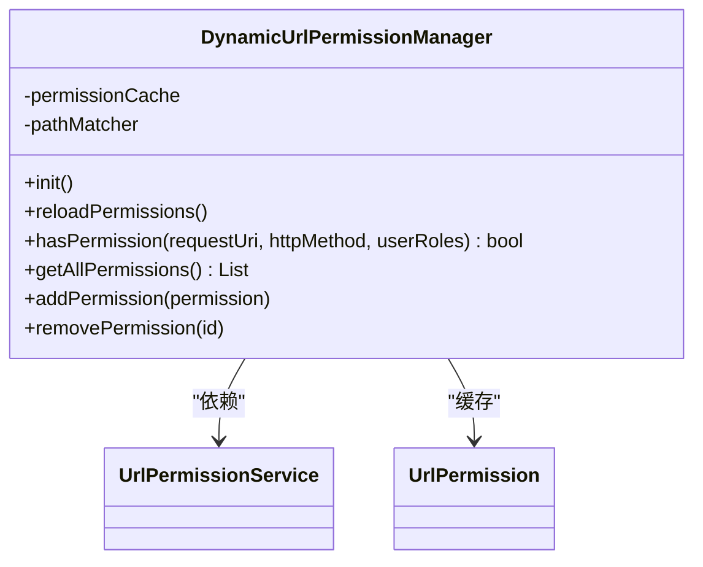
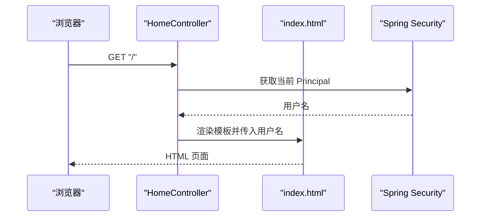
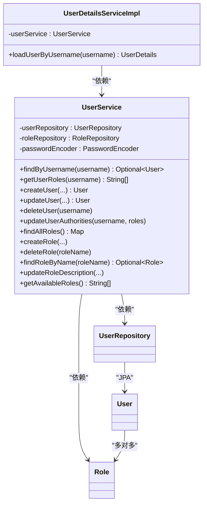
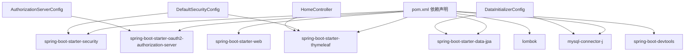

# 整体架构

<cite>
**本文引用的文件**
- [AuthServerApplication.java](file://src/main/java/com/example/authserver/AuthServerApplication.java)
- [AuthorizationServerConfig.java](file://src/main/java/com/example/authserver/config/AuthorizationServerConfig.java)
- [DefaultSecurityConfig.java](file://src/main/java/com/example/authserver/config/DefaultSecurityConfig.java)
- [DataInitializerConfig.java](file://src/main/java/com/example/authserver/config/DataInitializerConfig.java)
- [DynamicUrlPermissionManager.java](file://src/main/java/com/example/authserver/config/DynamicUrlPermissionManager.java)
- [HomeController.java](file://src/main/java/com/example/authserver/controller/HomeController.java)
- [UserDetailsServiceImpl.java](file://src/main/java/com/example/authserver/service/UserDetailsServiceImpl.java)
- [UserService.java](file://src/main/java/com/example/authserver/service/UserService.java)
- [UserRepository.java](file://src/main/java/com/example/authserver/repository/UserRepository.java)
- [User.java](file://src/main/java/com/example/authserver/entity/User.java)
- [Role.java](file://src/main/java/com/example/authserver/entity/Role.java)
- [application.yml](file://src/main/resources/application.yml)
- [schema.sql](file://src/main/resources/schema.sql)
- [index.html](file://src/main/resources/templates/index.html)
- [dashboard.html](file://src/main/resources/templates/admin/dashboard.html)
- [pom.xml](file://pom.xml)
</cite>

## 目录
1. [简介](#简介)
2. [项目结构](#项目结构)
3. [核心组件](#核心组件)
4. [架构总览](#架构总览)
5. [详细组件分析](#详细组件分析)
6. [依赖分析](#依赖分析)
7. [性能考虑](#性能考虑)
8. [故障排查指南](#故障排查指南)
9. [结论](#结论)
10. [附录](#附录)

## 简介
本项目是一个基于 Spring Security OAuth2 Authorization Server 的认证服务器，采用 MVC 模式变体进行分层设计，包含配置层、控制器层、服务层与数据访问层。系统通过 Spring Boot 自动配置机制启动，结合 Spring Security 的过滤链与 OAuth2 授权服务器能力，提供 OIDC 1.0 支持、JWT 签名与解码、JDBC 存储授权状态与授权同意、以及基于角色的动态 URL 权限控制。前端采用 Thymeleaf 模板渲染，提供登录、主页与管理后台界面。

## 项目结构
项目采用标准的 Spring Boot 目录结构，按功能域划分包：
- config：安全与初始化配置（授权服务器、默认安全、数据初始化、动态 URL 权限）
- controller：Web 控制器（首页、管理端控制器预留）
- service：业务服务（用户、角色、客户端、URL 权限）
- repository：数据访问层（JPA 接口）
- entity：JPA 实体（用户、角色、URL 权限、注册客户端）
- resources：模板与配置（Thymeleaf 模板、application.yml、schema.sql）

图表来源
- [AuthorizationServerConfig.java:44-256](file://src/main/java/com/example/authserver/config/AuthorizationServerConfig.java#L44-L256)
- [DefaultSecurityConfig.java:27-75](file://src/main/java/com/example/authserver/config/DefaultSecurityConfig.java#L27-L75)
- [DataInitializerConfig.java:20-109](file://src/main/java/com/example/authserver/config/DataInitializerConfig.java#L20-L109)
- [DynamicUrlPermissionManager.java:20-120](file://src/main/java/com/example/authserver/config/DynamicUrlPermissionManager.java#L20-L120)
- [HomeController.java:12-24](file://src/main/java/com/example/authserver/controller/HomeController.java#L12-L24)
- [UserDetailsServiceImpl.java:19-59](file://src/main/java/com/example/authserver/service/UserDetailsServiceImpl.java#L19-L59)
- [UserService.java:21-265](file://src/main/java/com/example/authserver/service/UserService.java#L21-L265)
- [UserRepository.java:15-44](file://src/main/java/com/example/authserver/repository/UserRepository.java#L15-L44)
- [User.java:20-66](file://src/main/java/com/example/authserver/entity/User.java#L20-L66)
- [Role.java:17-62](file://src/main/java/com/example/authserver/entity/Role.java#L17-L62)
- [application.yml:1-30](file://src/main/resources/application.yml#L1-L30)
- [schema.sql:1-169](file://src/main/resources/schema.sql#L1-L169)
- [index.html:1-243](file://src/main/resources/templates/index.html#L1-L243)
- [dashboard.html:1-339](file://src/main/resources/templates/admin/dashboard.html#L1-L339)

章节来源
- [AuthServerApplication.java:6-11](file://src/main/java/com/example/authserver/AuthServerApplication.java#L6-L11)
- [pom.xml:28-114](file://pom.xml#L28-L114)

## 核心组件
- 应用入口与自动配置
  - 应用入口类标注 @SpringBootApplication，启用组件扫描与自动配置，启动内嵌 Web 容器。
  - 依赖中包含 spring-boot-starter-oauth2-authorization-server、spring-boot-starter-security、spring-boot-starter-data-jpa、spring-boot-starter-thymeleaf 等，支撑 OAuth2 授权服务器、安全、数据访问与模板渲染。
- 授权服务器配置
  - 配置授权服务器安全过滤链，启用 OIDC 1.0，设置登录重定向、JWT 资源服务器等。
  - 初始化默认客户端（Web 应用、移动端、后端服务），配置授权类型、作用域、PKCE、令牌有效期等。
  - 配置 JDBC 授权服务与授权同意服务，使用 JWK Set 生成 RSA 密钥对并提供 JWT 解码器。
- 默认安全配置
  - 配置认证提供者（DaoAuthenticationProvider）、密码编码器（DelegatingPasswordEncoder）。
  - 定义默认安全过滤链，开放静态资源、登录、OAuth2 端点与错误页面，其余请求需认证；表单登录成功跳转首页，登出返回登录页。
- 数据初始化配置
  - 使用 ApplicationRunner 在启动后修复角色描述并初始化默认用户（admin、user），密码经编码器加密。
- 动态 URL 权限管理器
  - 启动时从服务加载启用的 URL 权限规则，使用 AntPathMatcher 进行路径匹配，按优先级判定用户角色是否满足访问要求。
- 控制器层
  - 首页控制器根据登录主体向模板传递用户名，Thymeleaf 模板展示欢迎信息与导航链接。
- 服务层
  - 用户详情服务实现 UserDetailsService，按用户名查询用户并转换为 UserDetails，包含角色集合。
  - 用户服务提供用户 CRUD、角色分配、角色管理等业务逻辑，含参数校验与异常处理。
- 数据访问层
  - UserRepository 提供按用户名查询、存在性检查、启用/禁用用户查询与模糊搜索等方法。
- 实体层
  - User 与 Role 通过多对多关联，使用 UUID 作为主键，实体保存/更新时自动维护时间戳。
- 资源与配置
  - application.yml 配置数据源、SQL 初始化、JPA、日志级别等。
  - schema.sql 定义用户、角色、URL 权限、OAuth2 注册客户端、授权与授权同意表，并初始化默认角色与 URL 权限规则。

章节来源
- [AuthServerApplication.java:6-11](file://src/main/java/com/example/authserver/AuthServerApplication.java#L6-L11)
- [AuthorizationServerConfig.java:44-256](file://src/main/java/com/example/authserver/config/AuthorizationServerConfig.java#L44-L256)
- [DefaultSecurityConfig.java:27-75](file://src/main/java/com/example/authserver/config/DefaultSecurityConfig.java#L27-L75)
- [DataInitializerConfig.java:20-109](file://src/main/java/com/example/authserver/config/DataInitializerConfig.java#L20-L109)
- [DynamicUrlPermissionManager.java:20-120](file://src/main/java/com/example/authserver/config/DynamicUrlPermissionManager.java#L20-L120)
- [HomeController.java:12-24](file://src/main/java/com/example/authserver/controller/HomeController.java#L12-L24)
- [UserDetailsServiceImpl.java:19-59](file://src/main/java/com/example/authserver/service/UserDetailsServiceImpl.java#L19-L59)
- [UserService.java:21-265](file://src/main/java/com/example/authserver/service/UserService.java#L21-L265)
- [UserRepository.java:15-44](file://src/main/java/com/example/authserver/repository/UserRepository.java#L15-L44)
- [User.java:20-66](file://src/main/java/com/example/authserver/entity/User.java#L20-L66)
- [Role.java:17-62](file://src/main/java/com/example/authserver/entity/Role.java#L17-L62)
- [application.yml:1-30](file://src/main/resources/application.yml#L1-L30)
- [schema.sql:1-169](file://src/main/resources/schema.sql#L1-L169)

## 架构总览
系统采用分层架构（MVC 模式变体）：
- 配置层：集中管理安全、授权服务器、数据初始化与动态权限策略。
- 控制器层：处理 Web 请求，渲染模板，返回视图。
- 服务层：封装业务逻辑，协调数据访问与外部依赖。
- 数据访问层：通过 JPA Repository 访问数据库。
- 实体层：映射数据库表结构，维护生命周期事件。
- 资源与配置：模板、数据库脚本与应用配置。

图表来源
- [AuthorizationServerConfig.java:56-77](file://src/main/java/com/example/authserver/config/AuthorizationServerConfig.java#L56-L77)
- [DefaultSecurityConfig.java:55-73](file://src/main/java/com/example/authserver/config/DefaultSecurityConfig.java#L55-L73)
- [UserDetailsServiceImpl.java:29-57](file://src/main/java/com/example/authserver/service/UserDetailsServiceImpl.java#L29-L57)
- [UserService.java:25-265](file://src/main/java/com/example/authserver/service/UserService.java#L25-L265)
- [UserRepository.java:15-44](file://src/main/java/com/example/authserver/repository/UserRepository.java#L15-L44)
- [index.html:197-204](file://src/main/resources/templates/index.html#L197-L204)

## 详细组件分析

### 授权服务器配置组件
- 安全过滤链
  - 应用默认安全配置，启用 OIDC 1.0，未认证访问授权端点重定向至登录页，资源服务器使用 JWT。
- 客户端初始化
  - 初始化 Web 应用（授权码+刷新令牌，需要授权同意，支持 PKCE）、移动端（公开客户端，PKCE 必须）、后端服务（客户端凭证模式，无需用户授权）。
- 授权与令牌配置
  - 授权服务与授权同意服务使用 JDBC 实现持久化。
  - JWK 源使用 RSA 密钥对生成 JWK Set，提供 JWT 解码器。
- 设置项
  - 授权服务器设置默认构建，便于后续扩展。

图表来源
- [AuthorizationServerConfig.java:44-256](file://src/main/java/com/example/authserver/config/AuthorizationServerConfig.java#L44-L256)

章节来源
- [AuthorizationServerConfig.java:44-256](file://src/main/java/com/example/authserver/config/AuthorizationServerConfig.java#L44-L256)

### 默认安全配置组件
- 认证提供者
  - 使用 DaoAuthenticationProvider，基于 UserDetailsService 与 PasswordEncoder 进行认证。
- 密码编码器
  - DelegatingPasswordEncoder，兼容多种编码算法。
- 安全过滤链
  - 开放静态资源、登录、OAuth2 端点与错误页面；其余请求需认证；表单登录成功跳转首页，登出返回登录页。

图表来源
- [DefaultSecurityConfig.java:27-75](file://src/main/java/com/example/authserver/config/DefaultSecurityConfig.java#L27-L75)

章节来源
- [DefaultSecurityConfig.java:27-75](file://src/main/java/com/example/authserver/config/DefaultSecurityConfig.java#L27-L75)

### 数据初始化配置组件
- ApplicationRunner
  - 启动后修复角色描述（中文乱码问题），初始化默认用户（admin、user），密码经编码器加密。
- 依赖
  - 注入 UserRepository 与 RoleRepository，确保角色数据由 schema.sql 初始化，用户由配置初始化。

图表来源
- [DataInitializerConfig.java:30-109](file://src/main/java/com/example/authserver/config/DataInitializerConfig.java#L30-L109)

章节来源
- [DataInitializerConfig.java:20-109](file://src/main/java/com/example/authserver/config/DataInitializerConfig.java#L20-L109)

### 动态 URL 权限管理器组件
- 初始化与缓存
  - @PostConstruct 加载启用的 URL 权限规则，使用并发 Map 缓存。
- 匹配逻辑
  - 按优先级排序，使用 AntPathMatcher 匹配 URL 与 HTTP 方法，判断用户角色是否满足所需角色。
- 运维能力
  - 支持重新加载、添加、移除权限规则，便于在线运维。

图表来源
- [DynamicUrlPermissionManager.java:20-120](file://src/main/java/com/example/authserver/config/DynamicUrlPermissionManager.java#L20-L120)

章节来源
- [DynamicUrlPermissionManager.java:20-120](file://src/main/java/com/example/authserver/config/DynamicUrlPermissionManager.java#L20-L120)

### 控制器与模板组件
- 首页控制器
  - 返回 index 模板，向模板传递用户名。
- 模板
  - index.html 展示登录成功后的欢迎信息与导航链接；dashboard.html 提供管理后台布局与导航。

图表来源
- [HomeController.java:15-21](file://src/main/java/com/example/authserver/controller/HomeController.java#L15-L21)
- [index.html:197-204](file://src/main/resources/templates/index.html#L197-L204)

章节来源
- [HomeController.java:12-24](file://src/main/java/com/example/authserver/controller/HomeController.java#L12-L24)
- [index.html:1-243](file://src/main/resources/templates/index.html#L1-L243)

### 用户详情与用户服务组件
- 用户详情服务
  - 实现 UserDetailsService，按用户名查询用户并转换为 UserDetails，包含角色集合。
- 用户服务
  - 提供用户 CRUD、角色分配、角色管理等业务逻辑，含参数校验与异常处理。
- 数据访问
  - UserRepository 提供常用查询方法。

图表来源
- [UserDetailsServiceImpl.java:22-59](file://src/main/java/com/example/authserver/service/UserDetailsServiceImpl.java#L22-L59)
- [UserService.java:24-265](file://src/main/java/com/example/authserver/service/UserService.java#L24-L265)
- [UserRepository.java:15-44](file://src/main/java/com/example/authserver/repository/UserRepository.java#L15-L44)
- [User.java:20-66](file://src/main/java/com/example/authserver/entity/User.java#L20-L66)
- [Role.java:17-62](file://src/main/java/com/example/authserver/entity/Role.java#L17-L62)

章节来源
- [UserDetailsServiceImpl.java:19-59](file://src/main/java/com/example/authserver/service/UserDetailsServiceImpl.java#L19-L59)
- [UserService.java:21-265](file://src/main/java/com/example/authserver/service/UserService.java#L21-L265)
- [UserRepository.java:15-44](file://src/main/java/com/example/authserver/repository/UserRepository.java#L15-L44)
- [User.java:20-66](file://src/main/java/com/example/authserver/entity/User.java#L20-L66)
- [Role.java:17-62](file://src/main/java/com/example/authserver/entity/Role.java#L17-L62)

## 依赖分析
- 外部依赖
  - Spring Boot Starter Web、Security、OAuth2 Authorization Server、Data JPA、Thymeleaf、MySQL Connector、Lombok、DevTools。
- 内部组件耦合
  - 配置层组件之间低耦合，通过 Bean 依赖装配。
  - 服务层依赖数据访问层，控制器依赖服务层与模板。
  - 实体层通过 JPA 映射数据库表，维护时间戳。
- 循环依赖
  - 未见循环依赖迹象，依赖方向清晰。

图表来源
- [pom.xml:28-114](file://pom.xml#L28-L114)
- [AuthorizationServerConfig.java:29-36](file://src/main/java/com/example/authserver/config/AuthorizationServerConfig.java#L29-L36)
- [DefaultSecurityConfig.java:18-21](file://src/main/java/com/example/authserver/config/DefaultSecurityConfig.java#L18-L21)
- [DataInitializerConfig.java:12-12](file://src/main/java/com/example/authserver/config/DataInitializerConfig.java#L12-L12)
- [HomeController.java:3-5](file://src/main/java/com/example/authserver/controller/HomeController.java#L3-L5)

章节来源
- [pom.xml:28-114](file://pom.xml#L28-L114)

## 性能考虑
- 数据库层
  - 使用 UUID 作为主键，避免热点；schema.sql 为关键列建立索引（如用户名唯一索引、URL 模式索引、OAuth2 客户端 ID 唯一索引）。
  - JPA 配置启用 SQL 输出与格式化，便于开发调试。
- 缓存与匹配
  - 动态 URL 权限管理器使用并发 Map 缓存规则，减少数据库查询；AntPathMatcher 支持高效路径匹配。
- 密钥与令牌
  - 授权服务器使用 RSA 密钥对生成 JWK Set，JWT 解码器按需创建，令牌有效期按场景配置（Web 应用较长、移动端较短、后端服务最短）。
- 模板与静态资源
  - Thymeleaf 关闭缓存以提升开发体验；静态资源路径公开，减少鉴权开销。
- 日志与可观测性
  - application.yml 设置安全相关日志级别，便于问题定位。

章节来源
- [schema.sql:17-56](file://src/main/resources/schema.sql#L17-L56)
- [DynamicUrlPermissionManager.java:27-31](file://src/main/java/com/example/authserver/config/DynamicUrlPermissionManager.java#L27-L31)
- [AuthorizationServerConfig.java:211-245](file://src/main/java/com/example/authserver/config/AuthorizationServerConfig.java#L211-L245)
- [application.yml:17-30](file://src/main/resources/application.yml#L17-L30)

## 故障排查指南
- 启动阶段
  - 若数据库连接失败，检查 application.yml 中的 datasource.url、username、password 与驱动类名。
  - SQL 初始化失败时，确认 schema.sql 路径与初始化模式配置正确。
- 认证与授权
  - 登录失败：确认用户名存在且密码正确，检查 DefaultSecurityConfig 中的认证提供者与密码编码器配置。
  - OAuth2 授权失败：检查 AuthorizationServerConfig 中的客户端配置、授权类型与作用域，确认 JWK 源与 JWT 解码器可用。
- 动态权限
  - URL 无法访问：检查 DynamicUrlPermissionManager 缓存是否加载成功，确认 URL 权限规则的 URL 模式、HTTP 方法与优先级配置。
- 用户与角色
  - 用户不存在：检查 DataInitializerConfig 是否执行，确认 schema.sql 初始化的角色与用户数据。
  - 角色缺失：确认 RoleRepository 查询逻辑与 Role 实体映射。

章节来源
- [application.yml:4-24](file://src/main/resources/application.yml#L4-L24)
- [schema.sql:144-169](file://src/main/resources/schema.sql#L144-L169)
- [DefaultSecurityConfig.java:34-49](file://src/main/java/com/example/authserver/config/DefaultSecurityConfig.java#L34-L49)
- [AuthorizationServerConfig.java:91-161](file://src/main/java/com/example/authserver/config/AuthorizationServerConfig.java#L91-L161)
- [DynamicUrlPermissionManager.java:36-54](file://src/main/java/com/example/authserver/config/DynamicUrlPermissionManager.java#L36-L54)
- [DataInitializerConfig.java:73-95](file://src/main/java/com/example/authserver/config/DataInitializerConfig.java#L73-L95)

## 结论
本项目通过清晰的分层架构与 Spring Boot 自动配置机制，实现了基于 Spring Security OAuth2 Authorization Server 的认证中心。配置层统一管理安全与授权策略，服务层封装业务逻辑，数据访问层基于 JPA，实体层映射数据库表，前端模板提供直观的用户界面。系统具备良好的可扩展性与可维护性，支持 OIDC 1.0、动态 URL 权限与多种 OAuth2 授权模式。

## 附录
- 系统边界
  - 外部边界：客户端应用（Web、移动端、后端服务）、浏览器。
  - 内部边界：授权服务器、用户管理、客户端管理、URL 权限管理。
- 设计模式
  - 依赖注入：广泛使用 @Configuration、@Service、@Repository、@Component 等注解装配 Bean。
  - 面向切面编程：通过 Spring Security 过滤链实现横切关注点（认证、授权、审计）。
  - 工厂与配置类：AuthorizationServerConfig、DefaultSecurityConfig、DataInitializerConfig 作为工厂与装配中心。
- 可扩展性设计原则
  - 配置分离：将安全、授权、数据初始化拆分为独立配置类，便于扩展与替换。
  - 接口优先：Repository 接口抽象数据访问，易于替换实现。
  - 模块化：控制器、服务、实体按功能域组织，降低耦合度。
  - 运维友好：动态 URL 权限支持在线变更，日志与 SQL 输出便于诊断。