# 架构设计

<cite>
**本文引用的文件**
- [AuthServerApplication.java](file://src/main/java/com/example/authserver/AuthServerApplication.java)
- [AuthorizationServerConfig.java](file://src/main/java/com/example/authserver/config/AuthorizationServerConfig.java)
- [DefaultSecurityConfig.java](file://src/main/java/com/example/authserver/config/DefaultSecurityConfig.java)
- [DataInitializerConfig.java](file://src/main/java/com/example/authserver/config/DataInitializerConfig.java)
- [DynamicUrlPermissionManager.java](file://src/main/java/com/example/authserver/config/DynamicUrlPermissionManager.java)
- [UserDetailsServiceImpl.java](file://src/main/java/com/example/authserver/service/UserDetailsServiceImpl.java)
- [JpaRegisteredClientRepository.java](file://src/main/java/com/example/authserver/repository/JpaRegisteredClientRepository.java)
- [AdminController.java](file://src/main/java/com/example/authserver/controller/AdminController.java)
- [HomeController.java](file://src/main/java/com/example/authserver/controller/HomeController.java)
- [UrlPermissionService.java](file://src/main/java/com/example/authserver/service/UrlPermissionService.java)
- [RegisteredClientEntity.java](file://src/main/java/com/example/authserver/entity/RegisteredClientEntity.java)
- [UrlPermission.java](file://src/main/java/com/example/authserver/entity/UrlPermission.java)
- [application.yml](file://src/main/resources/application.yml)
- [schema.sql](file://src/main/resources/schema.sql)
- [pom.xml](file://pom.xml)
</cite>

## 目录
1. [简介](#简介)
2. [项目结构](#项目结构)
3. [核心组件](#核心组件)
4. [架构总览](#架构总览)
5. [详细组件分析](#详细组件分析)
6. [依赖关系分析](#依赖关系分析)
7. [性能考量](#性能考量)
8. [故障排查指南](#故障排查指南)
9. [结论](#结论)
10. [附录](#附录)

## 简介
本项目是一个基于 Spring Security OAuth2 授权服务器的认证中心，采用分层架构与 MVC 变体，结合 Spring Security 的安全过滤链与 OAuth2 授权服务器能力，提供标准的授权码、刷新令牌、客户端凭证等授权流程，并内置基于数据库的动态 URL 权限控制与用户角色体系。系统边界清晰：前端模板与控制器负责用户交互；服务层封装业务逻辑；数据访问层对接数据库；配置层统一装配安全与 OAuth2 设置。

## 项目结构
项目采用按层次与功能域混合的组织方式：
- 配置层：安全与 OAuth2 配置、数据初始化、动态 URL 权限管理
- 控制器层：面向用户界面的管理与首页控制器
- 服务层：用户、角色、URL 权限、OAuth2 客户端等业务逻辑
- 数据访问层：JPA Repository 与自定义 RegisteredClientRepository
- 实体层：用户、角色、URL 权限、OAuth2 客户端等持久化模型
- 资源：应用配置、数据库初始化脚本、模板页面

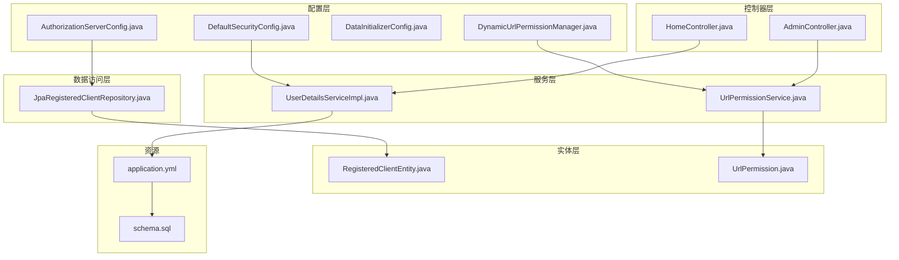

图表来源
- [AuthorizationServerConfig.java:1-256](file://src/main/java/com/example/authserver/config/AuthorizationServerConfig.java#L1-L256)
- [DefaultSecurityConfig.java:1-75](file://src/main/java/com/example/authserver/config/DefaultSecurityConfig.java#L1-L75)
- [DataInitializerConfig.java:1-109](file://src/main/java/com/example/authserver/config/DataInitializerConfig.java#L1-L109)
- [DynamicUrlPermissionManager.java:1-120](file://src/main/java/com/example/authserver/config/DynamicUrlPermissionManager.java#L1-L120)
- [UserDetailsServiceImpl.java:1-59](file://src/main/java/com/example/authserver/service/UserDetailsServiceImpl.java#L1-L59)
- [JpaRegisteredClientRepository.java:1-289](file://src/main/java/com/example/authserver/repository/JpaRegisteredClientRepository.java#L1-L289)
- [AdminController.java:1-282](file://src/main/java/com/example/authserver/controller/AdminController.java#L1-L282)
- [HomeController.java:1-24](file://src/main/java/com/example/authserver/controller/HomeController.java#L1-L24)
- [UrlPermissionService.java:1-94](file://src/main/java/com/example/authserver/service/UrlPermissionService.java#L1-L94)
- [RegisteredClientEntity.java:1-111](file://src/main/java/com/example/authserver/entity/RegisteredClientEntity.java#L1-L111)
- [UrlPermission.java:1-73](file://src/main/java/com/example/authserver/entity/UrlPermission.java#L1-L73)
- [application.yml:1-29](file://src/main/resources/application.yml#L1-L29)
- [schema.sql:1-169](file://src/main/resources/schema.sql#L1-L169)

章节来源
- [AuthServerApplication.java:1-14](file://src/main/java/com/example/authserver/AuthServerApplication.java#L1-L14)
- [pom.xml:1-147](file://pom.xml#L1-L147)

## 核心组件
- 应用入口：Spring Boot 启动类，负责引导整个应用生命周期
- 授权服务器配置：装配 OAuth2 授权服务器默认安全策略、OIDC 支持、JWT 解码器、JWK 源、授权与授权同意服务、客户端仓库（含初始化默认客户端）
- 默认安全配置：表单登录、密码编码器、认证提供者、通用安全过滤链
- 数据初始化：启动时修复角色描述并创建默认用户
- 动态 URL 权限管理：从数据库加载权限规则，提供匹配与缓存能力
- 用户详情服务：实现 UserDetailsService，加载用户并映射角色
- OAuth2 客户端仓库：JPA 实现 RegisteredClientRepository，负责客户端配置的持久化与读取
- 控制器：管理员用户管理与首页展示
- 实体：OAuth2 客户端与 URL 权限规则的持久化模型

章节来源
- [AuthorizationServerConfig.java:1-256](file://src/main/java/com/example/authserver/config/AuthorizationServerConfig.java#L1-L256)
- [DefaultSecurityConfig.java:1-75](file://src/main/java/com/example/authserver/config/DefaultSecurityConfig.java#L1-L75)
- [DataInitializerConfig.java:1-109](file://src/main/java/com/example/authserver/config/DataInitializerConfig.java#L1-L109)
- [DynamicUrlPermissionManager.java:1-120](file://src/main/java/com/example/authserver/config/DynamicUrlPermissionManager.java#L1-L120)
- [UserDetailsServiceImpl.java:1-59](file://src/main/java/com/example/authserver/service/UserDetailsServiceImpl.java#L1-L59)
- [JpaRegisteredClientRepository.java:1-289](file://src/main/java/com/example/authserver/repository/JpaRegisteredClientRepository.java#L1-L289)
- [AdminController.java:1-282](file://src/main/java/com/example/authserver/controller/AdminController.java#L1-L282)
- [HomeController.java:1-24](file://src/main/java/com/example/authserver/controller/HomeController.java#L1-L24)
- [UrlPermissionService.java:1-94](file://src/main/java/com/example/authserver/service/UrlPermissionService.java#L1-L94)
- [RegisteredClientEntity.java:1-111](file://src/main/java/com/example/authserver/entity/RegisteredClientEntity.java#L1-L111)
- [UrlPermission.java:1-73](file://src/main/java/com/example/authserver/entity/UrlPermission.java#L1-L73)

## 架构总览
系统采用分层架构与 MVC 变体：
- 表现层：Thymeleaf 模板 + 控制器，提供管理员界面与首页
- 业务层：服务类封装领域逻辑（用户、权限、OAuth2 客户端）
- 基础设施层：JPA、Spring Security、OAuth2 Authorization Server
- 配置层：集中装配安全过滤链、OAuth2 设置、JWK、JWT 解码器、数据初始化与动态权限

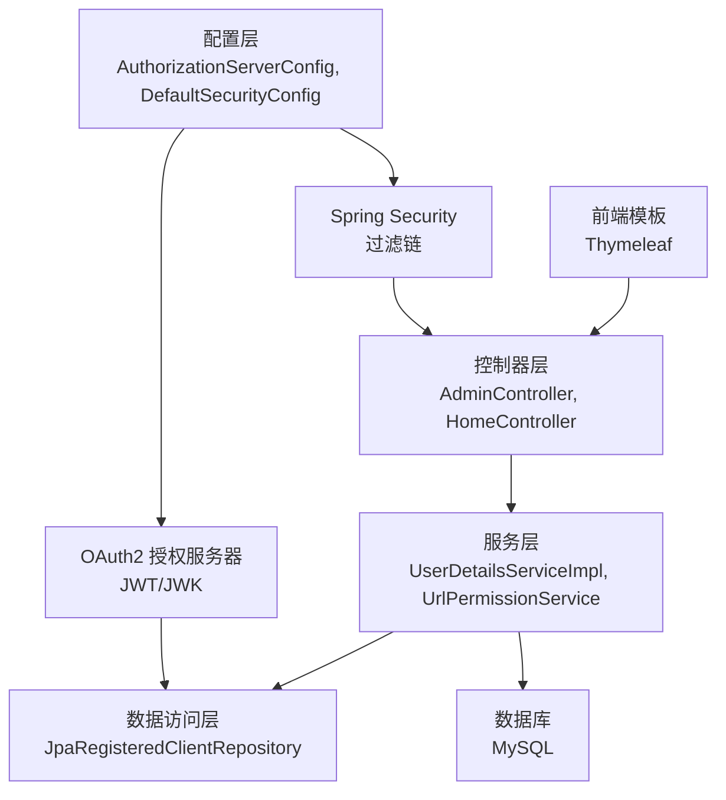

图表来源
- [AuthorizationServerConfig.java:1-256](file://src/main/java/com/example/authserver/config/AuthorizationServerConfig.java#L1-L256)
- [DefaultSecurityConfig.java:1-75](file://src/main/java/com/example/authserver/config/DefaultSecurityConfig.java#L1-L75)
- [JpaRegisteredClientRepository.java:1-289](file://src/main/java/com/example/authserver/repository/JpaRegisteredClientRepository.java#L1-L289)
- [application.yml:1-29](file://src/main/resources/application.yml#L1-L29)

## 详细组件分析

### 授权服务器配置（AuthorizationServerConfig）
职责与设计要点：
- 应用授权服务器默认安全策略，启用 OIDC 1.0，配置异常处理与资源服务器 JWT 解码
- 提供三个默认客户端：Web 应用（授权码+刷新令牌）、移动端（PKCE）、后端服务（客户端凭证）
- 使用 JDBC 实现授权与授权同意服务，持久化授权状态与用户同意
- 生成 RSA JWK 源并构建 JwtDecoder，用于签发与验证 JWT
- 通过 InitializingBean 在启动时保存或更新默认客户端

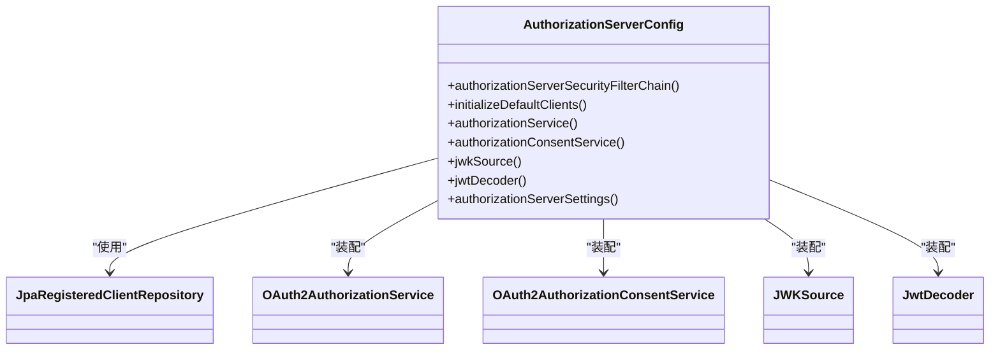

图表来源
- [AuthorizationServerConfig.java:1-256](file://src/main/java/com/example/authserver/config/AuthorizationServerConfig.java#L1-L256)
- [JpaRegisteredClientRepository.java:1-289](file://src/main/java/com/example/authserver/repository/JpaRegisteredClientRepository.java#L1-L289)

章节来源
- [AuthorizationServerConfig.java:56-77](file://src/main/java/com/example/authserver/config/AuthorizationServerConfig.java#L56-L77)
- [AuthorizationServerConfig.java:91-161](file://src/main/java/com/example/authserver/config/AuthorizationServerConfig.java#L91-L161)
- [AuthorizationServerConfig.java:193-206](file://src/main/java/com/example/authserver/config/AuthorizationServerConfig.java#L193-L206)
- [AuthorizationServerConfig.java:211-245](file://src/main/java/com/example/authserver/config/AuthorizationServerConfig.java#L211-L245)
- [AuthorizationServerConfig.java:250-253](file://src/main/java/com/example/authserver/config/AuthorizationServerConfig.java#L250-L253)

### 默认安全配置（DefaultSecurityConfig）
职责与设计要点：
- 配置认证提供者与密码编码器
- 定义通用安全过滤链：静态资源与公开端点放行，其余请求需认证；表单登录与登出
- 与授权服务器过滤链共同构成双过滤链策略，分别处理 OAuth2 端点与常规页面

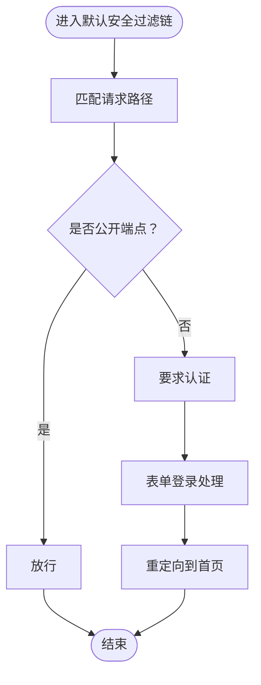

图表来源
- [DefaultSecurityConfig.java:55-73](file://src/main/java/com/example/authserver/config/DefaultSecurityConfig.java#L55-L73)

章节来源
- [DefaultSecurityConfig.java:34-49](file://src/main/java/com/example/authserver/config/DefaultSecurityConfig.java#L34-L49)
- [DefaultSecurityConfig.java:55-73](file://src/main/java/com/example/authserver/config/DefaultSecurityConfig.java#L55-L73)

### 数据初始化配置（DataInitializerConfig）
职责与设计要点：
- 启动时修复角色描述（中文乱码问题）
- 初始化默认用户（admin 与 user），并分配角色
- 依赖 PasswordEncoder 对密码进行编码

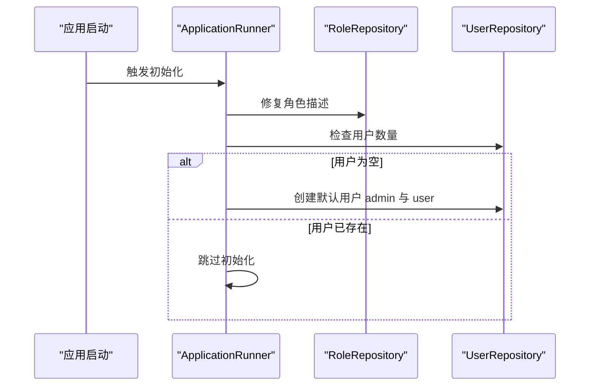

图表来源
- [DataInitializerConfig.java:30-95](file://src/main/java/com/example/authserver/config/DataInitializerConfig.java#L30-L95)

章节来源
- [DataInitializerConfig.java:30-95](file://src/main/java/com/example/authserver/config/DataInitializerConfig.java#L30-L95)

### 动态 URL 权限管理（DynamicUrlPermissionManager）
职责与设计要点：
- 启动时加载所有启用的 URL 权限规则并缓存
- 提供 hasPermission 方法，按优先级匹配 URL 与 HTTP 方法，校验所需角色
- 支持运行时重载与增删改缓存项

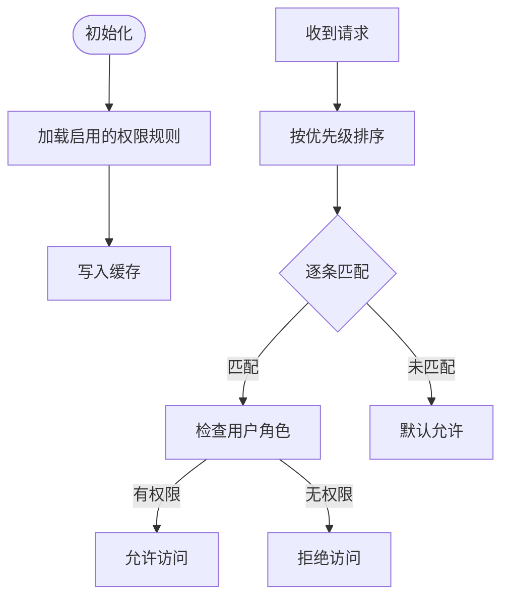

图表来源
- [DynamicUrlPermissionManager.java:36-81](file://src/main/java/com/example/authserver/config/DynamicUrlPermissionManager.java#L36-L81)

章节来源
- [DynamicUrlPermissionManager.java:23-81](file://src/main/java/com/example/authserver/config/DynamicUrlPermissionManager.java#L23-L81)

### 用户详情服务（UserDetailsServiceImpl）
职责与设计要点：
- 实现 UserDetailsService，按用户名加载用户并映射为 Spring Security 的 UserDetails
- 将用户的角色集合转换为 GrantedAuthority 列表

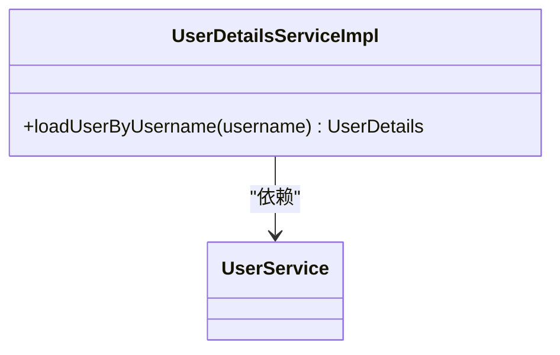

图表来源
- [UserDetailsServiceImpl.java:22-58](file://src/main/java/com/example/authserver/service/UserDetailsServiceImpl.java#L22-L58)

章节来源
- [UserDetailsServiceImpl.java:29-57](file://src/main/java/com/example/authserver/service/UserDetailsServiceImpl.java#L29-L57)

### OAuth2 客户端仓库（JpaRegisteredClientRepository）
职责与设计要点：
- 实现 RegisteredClientRepository，使用 JPA 持久化 OAuth2 客户端配置
- 支持保存、查找、删除与批量转换（RegisteredClient 与实体之间的双向映射）
- 使用 merge 统一新增与更新逻辑，ID 为 UUID

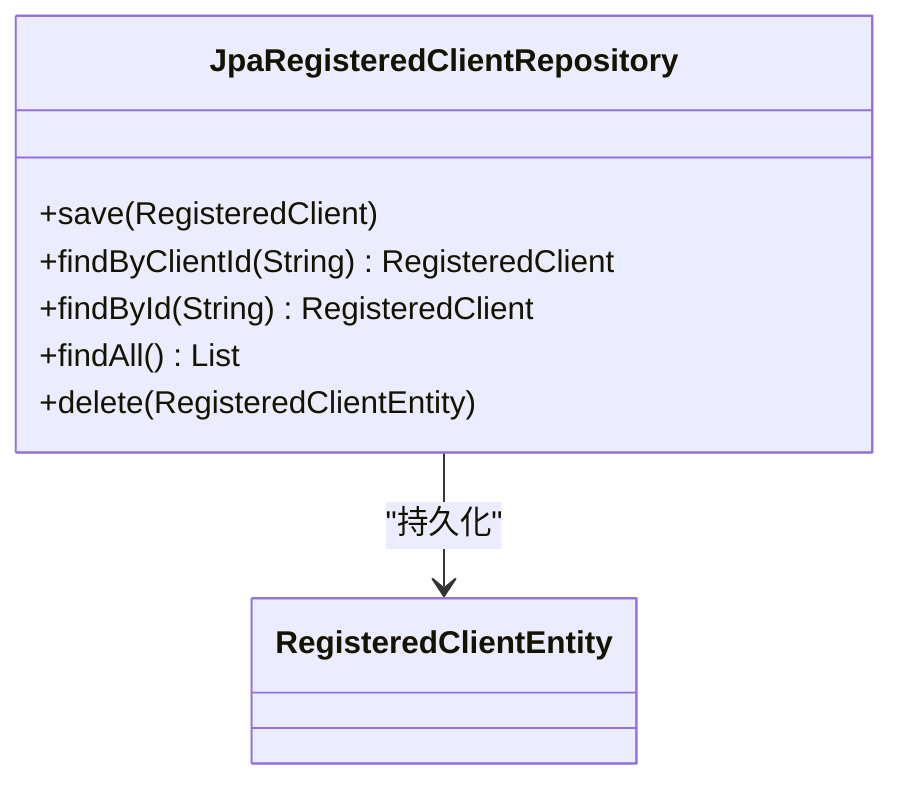

图表来源
- [JpaRegisteredClientRepository.java:21-122](file://src/main/java/com/example/authserver/repository/JpaRegisteredClientRepository.java#L21-L122)
- [RegisteredClientEntity.java:14-111](file://src/main/java/com/example/authserver/entity/RegisteredClientEntity.java#L14-L111)

章节来源
- [JpaRegisteredClientRepository.java:29-51](file://src/main/java/com/example/authserver/repository/JpaRegisteredClientRepository.java#L29-L51)
- [JpaRegisteredClientRepository.java:141-180](file://src/main/java/com/example/authserver/repository/JpaRegisteredClientRepository.java#L141-L180)

### 控制器层（AdminController、HomeController）
职责与设计要点：
- AdminController：管理员仪表盘、用户列表、搜索、分页、新增/更新/删除用户、修改用户权限
- HomeController：首页展示，注入当前登录用户名

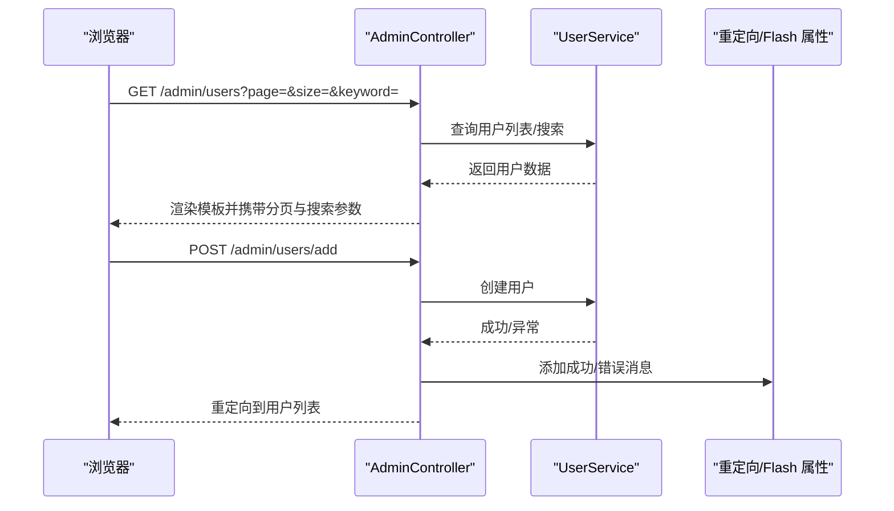

图表来源
- [AdminController.java:44-117](file://src/main/java/com/example/authserver/controller/AdminController.java#L44-L117)
- [AdminController.java:134-167](file://src/main/java/com/example/authserver/controller/AdminController.java#L134-L167)

章节来源
- [AdminController.java:33-117](file://src/main/java/com/example/authserver/controller/AdminController.java#L33-L117)
- [HomeController.java:15-21](file://src/main/java/com/example/authserver/controller/HomeController.java#L15-L21)

### 数据模型（实体与表结构）
职责与设计要点：
- RegisteredClientEntity：扁平化存储 OAuth2 客户端配置，字段与 Spring Authorization Server 规范一致
- UrlPermission：动态 URL 权限规则，支持通配符、HTTP 方法、优先级与启用状态

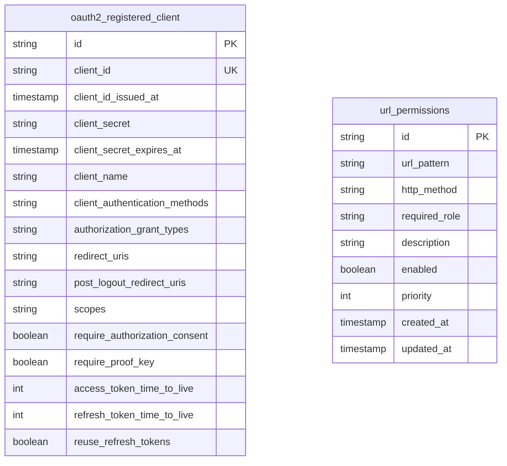

图表来源
- [RegisteredClientEntity.java:14-111](file://src/main/java/com/example/authserver/entity/RegisteredClientEntity.java#L14-L111)
- [UrlPermission.java:14-73](file://src/main/java/com/example/authserver/entity/UrlPermission.java#L14-L73)
- [schema.sql:62-81](file://src/main/resources/schema.sql#L62-L81)
- [schema.sql:43-56](file://src/main/resources/schema.sql#L43-L56)

章节来源
- [schema.sql:62-81](file://src/main/resources/schema.sql#L62-L81)
- [schema.sql:43-56](file://src/main/resources/schema.sql#L43-L56)

## 依赖关系分析
- Spring Boot Starter：Web、Security、OAuth2 Authorization Server、JPA、Thymeleaf、Actuator
- 数据库：MySQL，JPA/Hibernate 管理实体与 SQL 初始化
- 安全与 OAuth2：Spring Security + Spring Security OAuth2 Authorization Server
- JWT/JWK：Nimbus JOSE + JWT，RSA 密钥对生成与 JWK 源

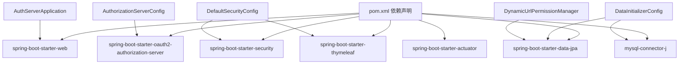

图表来源
- [pom.xml:29-114](file://pom.xml#L29-L114)
- [AuthServerApplication.java:6-11](file://src/main/java/com/example/authserver/AuthServerApplication.java#L6-L11)

章节来源
- [pom.xml:29-114](file://pom.xml#L29-L114)

## 性能考量
- 过滤链顺序：授权服务器过滤链优先级更高，避免与默认过滤链冲突
- JWT/JWK：RSA 2048 位密钥生成成本较高，建议在生产环境持久化密钥并在部署阶段替换
- 动态权限缓存：使用并发 Map 缓存权限规则，减少数据库查询；提供重载接口
- 分页与搜索：控制器对用户列表进行内存分页，建议在数据量大时迁移到数据库分页查询
- 数据库初始化：DDL 自动更新与 SQL 初始化脚本配合，注意生产环境禁用自动 DDL

## 故障排查指南
- 登录失败：检查密码编码器与用户详情服务是否正确加载用户与角色
- OAuth2 授权失败：确认授权服务器过滤链已启用 OIDC、JWT 解码器与 JWK 源配置
- 客户端未生效：确认默认客户端初始化是否执行，或手动检查 oauth2_registered_client 表
- 权限不生效：检查 url_permissions 表与 DynamicUrlPermissionManager 缓存是否正确加载
- 数据库连接问题：核对 application.yml 中的数据库连接参数与 schema.sql 初始化

章节来源
- [DefaultSecurityConfig.java:34-49](file://src/main/java/com/example/authserver/config/DefaultSecurityConfig.java#L34-L49)
- [AuthorizationServerConfig.java:56-77](file://src/main/java/com/example/authserver/config/AuthorizationServerConfig.java#L56-L77)
- [DataInitializerConfig.java:73-95](file://src/main/java/com/example/authserver/config/DataInitializerConfig.java#L73-L95)
- [DynamicUrlPermissionManager.java:36-54](file://src/main/java/com/example/authserver/config/DynamicUrlPermissionManager.java#L36-L54)
- [application.yml:4-28](file://src/main/resources/application.yml#L4-L28)

## 结论
该系统以 Spring Security OAuth2 授权服务器为核心，结合自定义的动态 URL 权限与用户角色体系，形成可扩展、可维护的认证中心。通过分层架构与明确的职责划分，既满足了 OAuth2 标准流程，又提供了灵活的权限控制与良好的开发体验。建议在生产环境中强化密钥管理、引入数据库分页与缓存优化，并完善监控与日志策略。

## 附录
- 系统边界：前端模板与控制器对外暴露管理界面；服务层与数据访问层对内提供业务能力；配置层统一装配安全与 OAuth2 能力
- 扩展性设计：动态 URL 权限规则可在线调整；OAuth2 客户端可通过数据库或管理界面维护；支持多种授权模式与令牌策略
- 性能优化：缓存权限规则、延迟初始化客户端仓库、合理设置令牌有效期与刷新策略