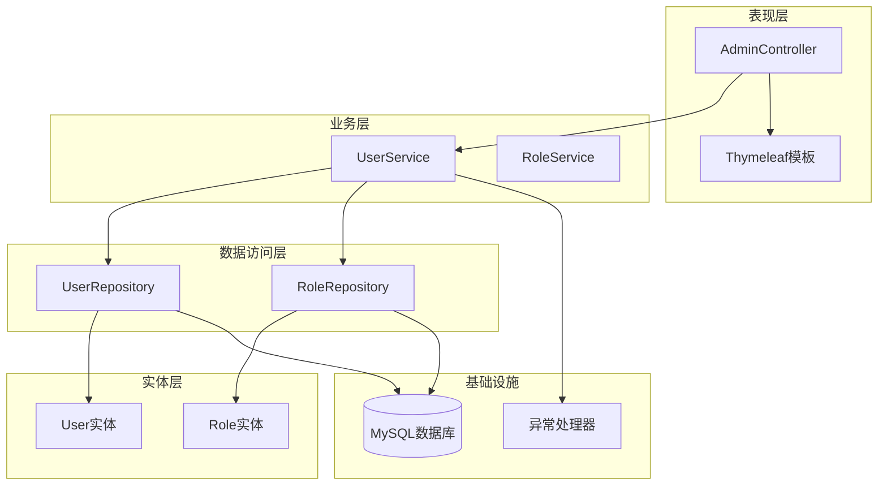
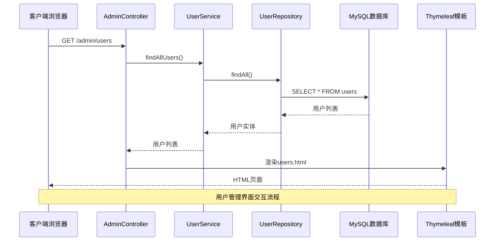
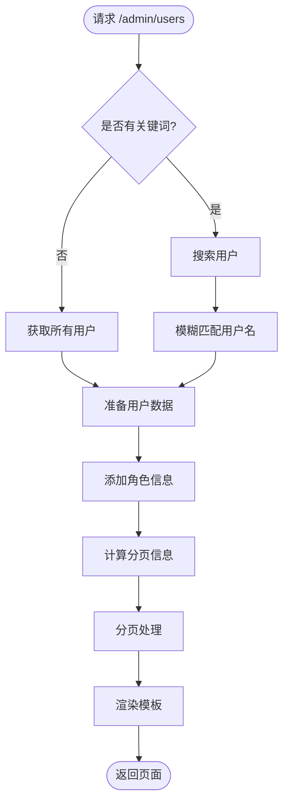
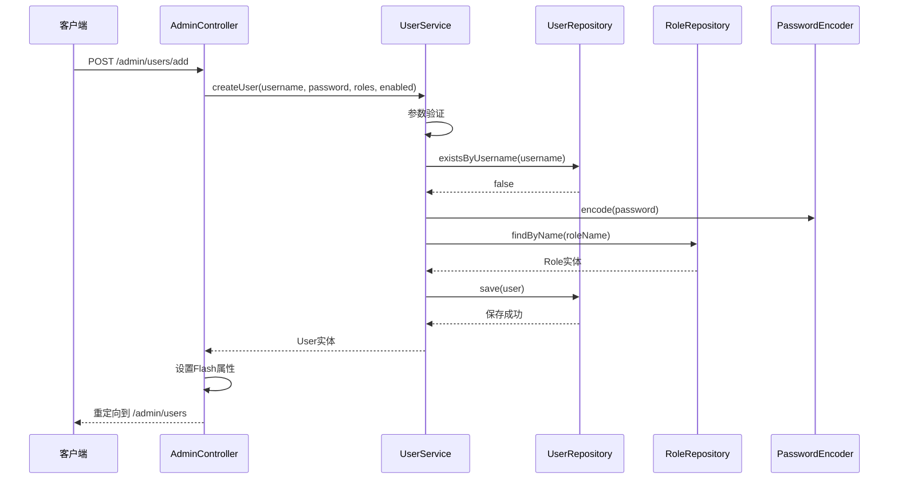
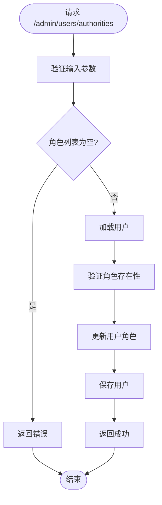
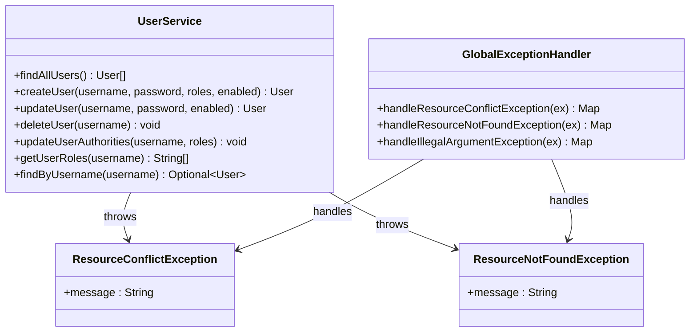
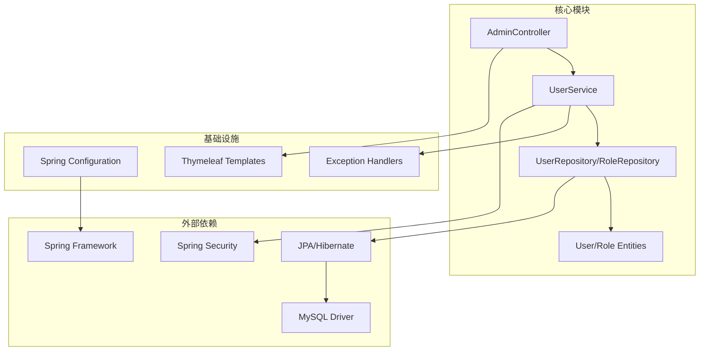
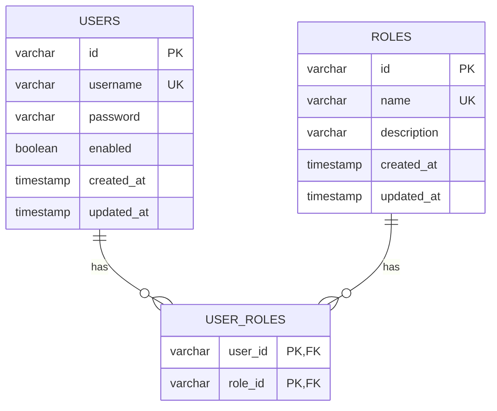
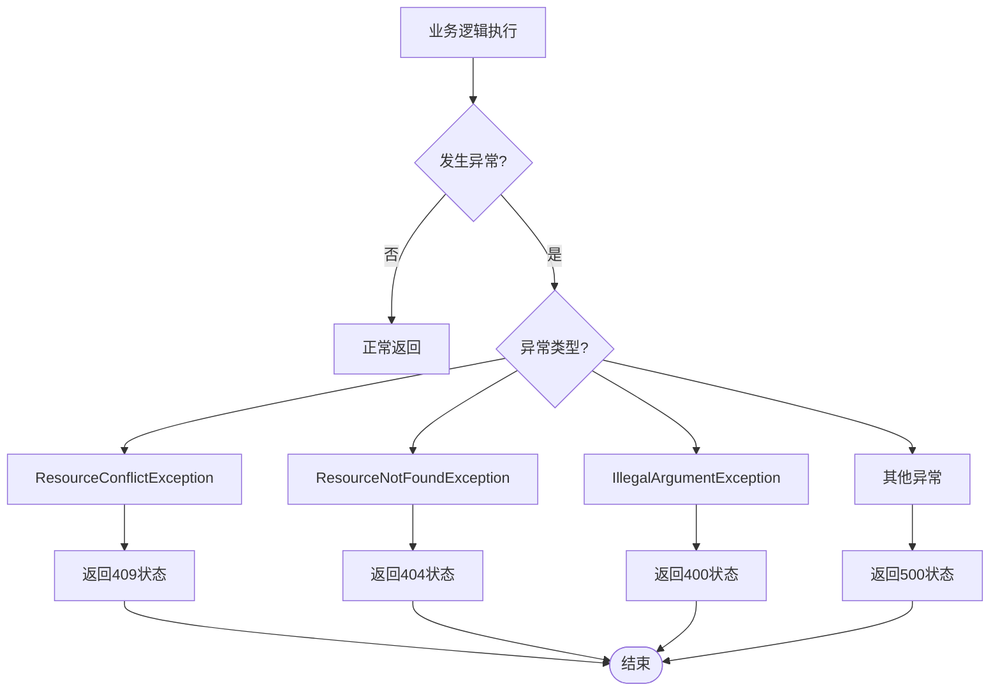

# 用户CRUD操作

<cite>
**本文档引用的文件**
- [AdminController.java](file://src/main/java/com/example/authserver/controller/AdminController.java)
- [UserService.java](file://src/main/java/com/example/authserver/service/UserService.java)
- [UserRepository.java](file://src/main/java/com/example/authserver/repository/UserRepository.java)
- [User.java](file://src/main/java/com/example/authserver/entity/User.java)
- [Role.java](file://src/main/java/com/example/authserver/entity/Role.java)
- [RoleRepository.java](file://src/main/java/com/example/authserver/repository/RoleRepository.java)
- [GlobalExceptionHandler.java](file://src/main/java/com/example/authserver/exception/GlobalExceptionHandler.java)
- [ResourceConflictException.java](file://src/main/java/com/example/authserver/exception/ResourceConflictException.java)
- [ResourceNotFoundException.java](file://src/main/java/com/example/authserver/exception/ResourceNotFoundException.java)
- [users.html](file://src/main/resources/templates/admin/users.html)
- [application.yml](file://src/main/resources/application.yml)
- [schema.sql](file://src/main/resources/schema.sql)
</cite>

## 目录
1. [简介](#简介)
2. [项目结构](#项目结构)
3. [核心组件](#核心组件)
4. [架构概览](#架构概览)
5. [详细组件分析](#详细组件分析)
6. [依赖关系分析](#依赖关系分析)
7. [性能考虑](#性能考虑)
8. [故障排除指南](#故障排除指南)
9. [结论](#结论)
10. [附录](#附录)

## 简介

本文件详细阐述了Spring Security认证服务器中的用户CRUD操作实现。系统采用经典的三层架构设计，从AdminController的REST端点到UserService的服务逻辑，再到UserRepository的数据访问实现，形成了完整的用户管理解决方案。文档涵盖了用户创建、读取、更新、删除的完整流程，包括数据验证规则、唯一性约束检查、异常处理机制，以及用户搜索和分页功能的实现细节。

## 项目结构

该项目采用标准的Spring Boot项目结构，主要分为以下层次：

**图表来源**
- [AdminController.java:1-282](file://src/main/java/com/example/authserver/controller/AdminController.java#L1-L282)
- [UserService.java:1-265](file://src/main/java/com/example/authserver/service/UserService.java#L1-L265)
- [UserRepository.java:1-44](file://src/main/java/com/example/authserver/repository/UserRepository.java#L1-L44)
- [RoleRepository.java:1-45](file://src/main/java/com/example/authserver/repository/RoleRepository.java#L1-L45)

**章节来源**
- [application.yml:1-30](file://src/main/resources/application.yml#L1-L30)
- [schema.sql:1-169](file://src/main/resources/schema.sql#L1-L169)

## 核心组件

### 用户实体模型

系统采用JPA注解定义用户实体，具有以下关键特性：

- **唯一标识**：UUID类型的主键，确保全局唯一性
- **用户名约束**：非空且唯一，长度限制为50字符
- **密码安全**：存储加密后的密码，长度可达500字符
- **状态管理**：布尔值控制用户启用状态，默认启用
- **时间戳**：自动维护创建和更新时间
- **角色关联**：多对多关系映射用户与角色

### 角色实体模型

角色实体与用户实体形成完整的权限管理体系：

- **角色名称**：非空且唯一，支持ROLE_USER和ROLE_ADMIN等标准角色
- **描述信息**：可选的文本描述
- **用户关联**：反向映射用户实体，建立双向关系
- **时间戳管理**：自动维护角色的生命周期

### 数据访问层

UserRepository和RoleRepository继承JpaRepository，提供基础的CRUD操作和自定义查询方法：

- **用户查询**：支持按用户名查找、存在性检查、启用状态过滤
- **角色查询**：支持按名称查找、存在性检查、排序查询
- **自定义查询**：实现模糊匹配的搜索功能

**章节来源**
- [User.java:1-66](file://src/main/java/com/example/authserver/entity/User.java#L1-L66)
- [Role.java:1-62](file://src/main/java/com/example/authserver/entity/Role.java#L1-L62)
- [UserRepository.java:1-44](file://src/main/java/com/example/authserver/repository/UserRepository.java#L1-L44)
- [RoleRepository.java:1-45](file://src/main/java/com/example/authserver/repository/RoleRepository.java#L1-L45)

## 架构概览

系统采用MVC架构模式，结合Spring Security实现完整的用户管理功能：

**图表来源**
- [AdminController.java:44-117](file://src/main/java/com/example/authserver/controller/AdminController.java#L44-L117)
- [UserService.java:33-35](file://src/main/java/com/example/authserver/service/UserService.java#L33-L35)
- [UserRepository.java:16-42](file://src/main/java/com/example/authserver/repository/UserRepository.java#L16-L42)

## 详细组件分析

### AdminController - 管理端控制器

AdminController作为用户管理的入口点，提供了完整的REST API和Web界面支持：

#### 用户管理页面

用户管理页面实现了完整的分页和搜索功能：

**图表来源**
- [AdminController.java:44-117](file://src/main/java/com/example/authserver/controller/AdminController.java#L44-L117)

#### 用户创建流程

用户创建采用异步验证和同步保存的双重保障机制：

**图表来源**
- [AdminController.java:134-167](file://src/main/java/com/example/authserver/controller/AdminController.java#L134-L167)
- [UserService.java:58-104](file://src/main/java/com/example/authserver/service/UserService.java#L58-L104)

#### 用户权限更新

权限更新功能支持批量角色分配和实时验证：

**图表来源**
- [AdminController.java:230-269](file://src/main/java/com/example/authserver/controller/AdminController.java#L230-L269)
- [UserService.java:149-176](file://src/main/java/com/example/authserver/service/UserService.java#L149-L176)

**章节来源**
- [AdminController.java:1-282](file://src/main/java/com/example/authserver/controller/AdminController.java#L1-L282)

### UserService - 用户服务层

UserService作为业务逻辑的核心，实现了完整的用户管理业务规则：

#### 数据验证规则

系统实施了严格的参数验证机制：

- **用户名验证**：非空检查，长度限制为3-50字符
- **密码验证**：非空检查，最小长度6字符，最大长度100字符
- **角色验证**：角色列表不能为空，所有角色必须存在
- **状态验证**：启用状态为布尔值，null时默认true

#### 唯一性约束检查

系统通过多种方式确保数据完整性：

- **用户名唯一性**：数据库层面的唯一约束，应用层面的重复检查
- **角色唯一性**：角色名称的唯一约束
- **级联删除**：用户删除时自动清理关联的角色关系

#### 异常处理机制

系统采用统一的异常处理策略：

**图表来源**
- [UserService.java:1-265](file://src/main/java/com/example/authserver/service/UserService.java#L1-L265)
- [GlobalExceptionHandler.java:1-130](file://src/main/java/com/example/authserver/exception/GlobalExceptionHandler.java#L1-L130)

**章节来源**
- [UserService.java:1-265](file://src/main/java/com/example/authserver/service/UserService.java#L1-L265)
- [GlobalExceptionHandler.java:1-130](file://src/main/java/com/example/authserver/exception/GlobalExceptionHandler.java#L1-L130)

### 数据访问层

#### 用户Repository实现

UserRepository继承JpaRepository，提供了丰富的查询方法：

- **基础查询**：继承JpaRepository的所有CRUD方法
- **条件查询**：按用户名查找、存在性检查、状态过滤
- **自定义查询**：实现模糊匹配的搜索功能

#### 角色Repository实现

RoleRepository专门处理角色相关的数据访问：

- **角色查询**：按名称查找、存在性检查、排序查询
- **统计查询**：统计每个角色的用户数量
- **搜索功能**：支持角色名称的模糊匹配

**章节来源**
- [UserRepository.java:1-44](file://src/main/java/com/example/authserver/repository/UserRepository.java#L1-L44)
- [RoleRepository.java:1-45](file://src/main/java/com/example/authserver/repository/RoleRepository.java#L1-L45)

## 依赖关系分析

系统采用清晰的依赖层次结构，确保关注点分离和代码可维护性：

**图表来源**
- [AuthServerApplication.java:1-14](file://src/main/java/com/example/authserver/AuthServerApplication.java#L1-L14)
- [application.yml:1-30](file://src/main/resources/application.yml#L1-L30)

### 数据库设计

系统采用关系型数据库设计，支持完整的用户权限管理：

**图表来源**
- [schema.sql:8-40](file://src/main/resources/schema.sql#L8-L40)

**章节来源**
- [schema.sql:1-169](file://src/main/resources/schema.sql#L1-L169)

## 性能考虑

### 查询优化

系统在多个层面实现了性能优化：

- **懒加载策略**：角色关联使用LAZY加载，避免不必要的数据加载
- **批量操作**：支持批量角色分配，减少数据库往返次数
- **缓存策略**：开发环境关闭Thymeleaf缓存，生产环境建议开启缓存

### 分页实现

用户管理页面实现了高效的分页机制：

- **内存分页**：对于小规模数据集，在内存中进行分页处理
- **数据库分页**：对于大规模数据集，应考虑使用JPA分页接口
- **搜索优化**：支持关键词搜索，但当前实现为内存过滤，建议优化为数据库层面的LIKE查询

### 并发控制

系统通过以下机制保证并发安全性：

- **事务管理**：所有用户操作都在事务边界内执行
- **乐观锁**：实体类支持版本控制，防止并发更新冲突
- **级联删除**：确保删除用户时的一致性

## 故障排除指南

### 常见问题及解决方案

#### 用户名重复错误

**问题现象**：创建用户时报错"用户名已存在"

**原因分析**：
- 数据库唯一约束触发
- 应用层重复检查失败

**解决步骤**：
1. 检查用户名是否已被使用
2. 验证数据库唯一索引是否存在
3. 确认应用层的existsByUsername方法正常工作

#### 密码验证失败

**问题现象**：密码长度不足或格式不正确

**解决步骤**：
1. 确认密码长度至少6位
2. 检查密码是否包含特殊字符
3. 验证PasswordEncoder配置正确

#### 角色不存在

**问题现象**：更新用户权限时报错"角色不存在"

**解决步骤**：
1. 检查角色表中是否存在对应角色
2. 确认角色名称拼写正确
3. 验证角色初始化数据是否正确

### 异常处理机制

系统采用统一的异常处理策略：

**图表来源**
- [GlobalExceptionHandler.java:25-117](file://src/main/java/com/example/authserver/exception/GlobalExceptionHandler.java#L25-L117)

**章节来源**
- [GlobalExceptionHandler.java:1-130](file://src/main/java/com/example/authserver/exception/GlobalExceptionHandler.java#L1-L130)

## 结论

本用户CRUD操作实现展现了现代Spring Boot应用的最佳实践：

### 技术优势

- **架构清晰**：三层架构设计，职责分离明确
- **安全可靠**：完善的参数验证和异常处理机制
- **用户体验**：支持异步用户名检查和Flash属性消息传递
- **扩展性强**：基于接口的设计便于功能扩展

### 改进建议

1. **搜索优化**：将用户搜索从内存过滤迁移到数据库层面
2. **分页优化**：对于大数据集采用数据库分页
3. **缓存策略**：引入Redis缓存提高查询性能
4. **监控告警**：添加应用性能监控和异常告警

### 最佳实践

- 始终使用事务管理确保数据一致性
- 实施多层次的参数验证
- 采用统一的异常处理策略
- 保持日志记录的完整性和准确性

## 附录

### API参考

#### 用户管理端点

| 方法 | 路径 | 功能 | 请求参数 | 响应 |
|------|------|------|----------|------|
| GET | /admin/users | 获取用户列表 | page, size, keyword | HTML页面 |
| GET | /admin/users/check-username | 检查用户名是否存在 | username | JSON布尔值 |
| POST | /admin/users/add | 创建用户 | username, password, roles, enabled | 重定向 |
| POST | /admin/users/update | 更新用户 | username, password, enabled | 重定向 |
| POST | /admin/users/delete | 删除用户 | username | 重定向 |
| POST | /admin/users/authorities | 更新用户权限 | username, authorities | 重定向 |

#### 数据模型

**User实体字段**：
- id: UUID主键
- username: 非空唯一用户名
- password: 加密密码
- enabled: 启用状态
- roles: 角色列表
- created_at: 创建时间
- updated_at: 更新时间

**Role实体字段**：
- id: UUID主键
- name: 非空唯一角色名
- description: 角色描述
- users: 用户列表
- created_at: 创建时间
- updated_at: 更新时间

### 配置说明

系统配置位于application.yml中，主要包括：

- **数据库连接**：MySQL 8.0配置，使用6666端口
- **JPA设置**：自动DDL更新，SQL显示和格式化
- **Thymeleaf**：开发环境禁用缓存
- **日志级别**：Spring Security相关日志级别设置

**章节来源**
- [application.yml:1-30](file://src/main/resources/application.yml#L1-L30)
- [users.html:1-753](file://src/main/resources/templates/admin/users.html#L1-L753)