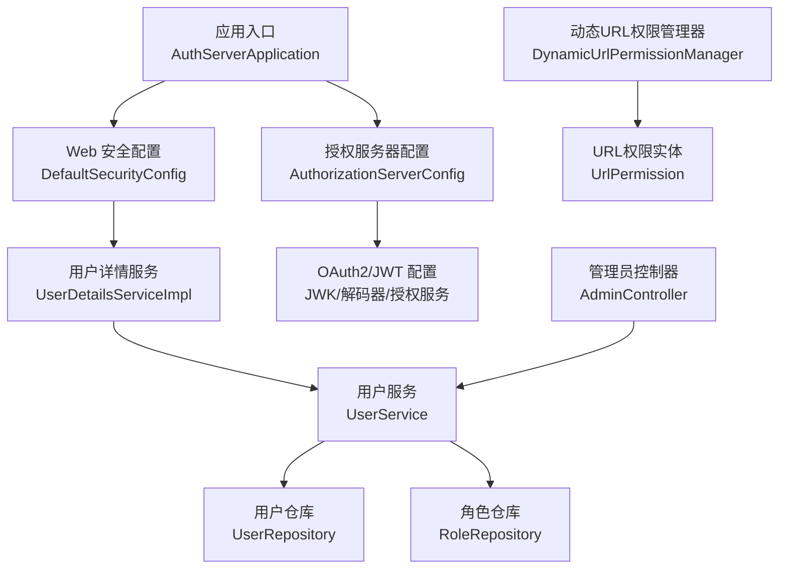
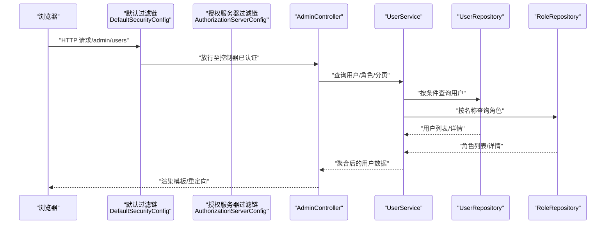
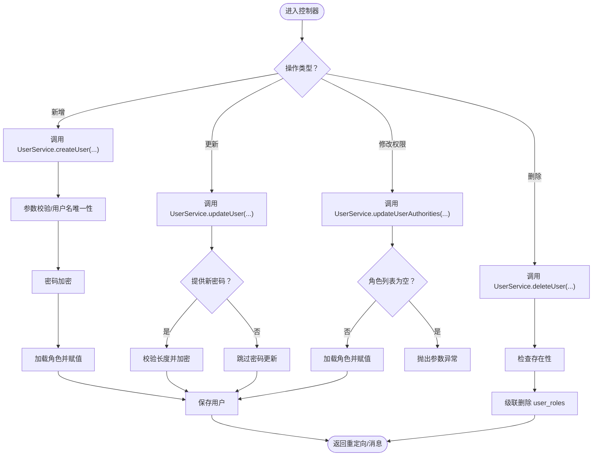
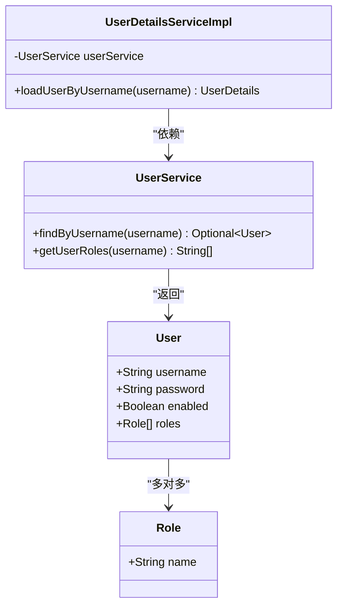
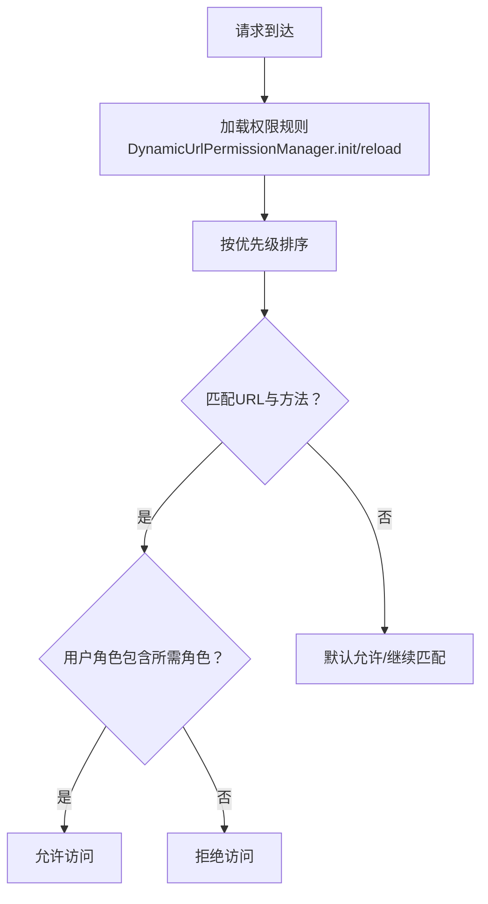
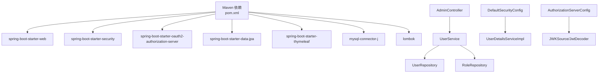

# 用户管理功能

<cite>
**本文引用的文件**
- [AuthServerApplication.java](file://src/main/java/com/example/authserver/AuthServerApplication.java)
- [DefaultSecurityConfig.java](file://src/main/java/com/example/authserver/config/DefaultSecurityConfig.java)
- [AuthorizationServerConfig.java](file://src/main/java/com/example/authserver/config/AuthorizationServerConfig.java)
- [DataInitializerConfig.java](file://src/main/java/com/example/authserver/config/DataInitializerConfig.java)
- [DynamicUrlPermissionManager.java](file://src/main/java/com/example/authserver/config/DynamicUrlPermissionManager.java)
- [UserDetailsServiceImpl.java](file://src/main/java/com/example/authserver/service/UserDetailsServiceImpl.java)
- [UserService.java](file://src/main/java/com/example/authserver/service/UserService.java)
- [RoleService.java](file://src/main/java/com/example/authserver/service/RoleService.java)
- [AdminController.java](file://src/main/java/com/example/authserver/controller/AdminController.java)
- [User.java](file://src/main/java/com/example/authserver/entity/User.java)
- [Role.java](file://src/main/java/com/example/authserver/entity/Role.java)
- [UrlPermission.java](file://src/main/java/com/example/authserver/entity/UrlPermission.java)
- [UserRepository.java](file://src/main/java/com/example/authserver/repository/UserRepository.java)
- [RoleRepository.java](file://src/main/java/com/example/authserver/repository/RoleRepository.java)
- [application.yml](file://src/main/resources/application.yml)
- [schema.sql](file://src/main/resources/schema.sql)
- [pom.xml](file://pom.xml)
</cite>

## 目录
1. [简介](#简介)
2. [项目结构](#项目结构)
3. [核心组件](#核心组件)
4. [架构总览](#架构总览)
5. [详细组件分析](#详细组件分析)
6. [依赖分析](#依赖分析)
7. [性能考虑](#性能考虑)
8. [故障排查指南](#故障排查指南)
9. [结论](#结论)
10. [附录](#附录)

## 简介
本文件面向“用户管理功能”的实现与使用，围绕用户CRUD、RBAC权限控制、用户认证与授权、密码加密策略、会话管理以及与Spring Security的集成进行系统化说明。文档以代码为依据，结合调用链路图与类图，帮助开发者快速理解从控制器到服务层再到数据访问层的完整流程，并提供注册、登录、权限验证的参考路径。

## 项目结构
项目采用基于包的分层组织：配置层、控制器层、服务层、数据访问层、实体层与资源文件。核心入口为应用启动类，安全配置位于config包，业务逻辑集中在service与controller，数据持久化通过JPA仓库接口实现，数据库初始化脚本与配置文件分别位于resources目录。

图表来源
- [AuthServerApplication.java:1-14](file://src/main/java/com/example/authserver/AuthServerApplication.java#L1-L14)
- [DefaultSecurityConfig.java:27-75](file://src/main/java/com/example/authserver/config/DefaultSecurityConfig.java#L27-L75)
- [AuthorizationServerConfig.java:44-256](file://src/main/java/com/example/authserver/config/AuthorizationServerConfig.java#L44-L256)
- [UserDetailsServiceImpl.java:19-59](file://src/main/java/com/example/authserver/service/UserDetailsServiceImpl.java#L19-L59)
- [UserService.java:21-265](file://src/main/java/com/example/authserver/service/UserService.java#L21-L265)
- [UserRepository.java:12-44](file://src/main/java/com/example/authserver/repository/UserRepository.java#L12-L44)
- [RoleRepository.java:12-45](file://src/main/java/com/example/authserver/repository/RoleRepository.java#L12-L45)
- [DynamicUrlPermissionManager.java:20-120](file://src/main/java/com/example/authserver/config/DynamicUrlPermissionManager.java#L20-L120)
- [UrlPermission.java:11-73](file://src/main/java/com/example/authserver/entity/UrlPermission.java#L11-L73)

章节来源
- [AuthServerApplication.java:1-14](file://src/main/java/com/example/authserver/AuthServerApplication.java#L1-L14)
- [application.yml:1-29](file://src/main/resources/application.yml#L1-L29)
- [pom.xml:1-147](file://pom.xml#L1-L147)

## 核心组件
- 用户实体与多对多角色关联：用户与角色通过中间表user_roles建立EAGER加载的角色集合，便于认证时直接获取权限。
- 用户仓库：提供按用户名查询、存在性检查、启用/禁用用户查询与模糊搜索。
- 角色仓库：提供按名称查询、存在性检查、排序查询、模糊搜索与角色用户数统计。
- 用户服务：封装用户CRUD、角色分配、密码加密、状态更新；提供角色统计与可用角色列表。
- 用户详情服务：实现UserDetailsService，加载用户、转换为Spring Security的UserDetails、注入角色权限。
- 管理员控制器：提供用户管理页面、新增/更新/删除用户、修改用户权限、AJAX用户名校验与分页展示。
- 安全配置：配置DaoAuthenticationProvider、PasswordEncoder、表单登录与登出、默认过滤链。
- 授权服务器配置：启用OIDC、配置异常入口、JWT解码器、JDBC授权服务与客户端初始化。
- 动态URL权限管理器：从数据库加载URL权限规则，支持Ant风格匹配与优先级决策。
- 数据初始化：修复角色描述、初始化默认用户并关联角色。

章节来源
- [User.java:17-66](file://src/main/java/com/example/authserver/entity/User.java#L17-L66)
- [Role.java:17-62](file://src/main/java/com/example/authserver/entity/Role.java#L17-L62)
- [UserRepository.java:12-44](file://src/main/java/com/example/authserver/repository/UserRepository.java#L12-L44)
- [RoleRepository.java:12-45](file://src/main/java/com/example/authserver/repository/RoleRepository.java#L12-L45)
- [UserService.java:21-265](file://src/main/java/com/example/authserver/service/UserService.java#L21-L265)
- [UserDetailsServiceImpl.java:19-59](file://src/main/java/com/example/authserver/service/UserDetailsServiceImpl.java#L19-L59)
- [AdminController.java:22-282](file://src/main/java/com/example/authserver/controller/AdminController.java#L22-L282)
- [DefaultSecurityConfig.java:27-75](file://src/main/java/com/example/authserver/config/DefaultSecurityConfig.java#L27-L75)
- [AuthorizationServerConfig.java:44-256](file://src/main/java/com/example/authserver/config/AuthorizationServerConfig.java#L44-L256)
- [DynamicUrlPermissionManager.java:20-120](file://src/main/java/com/example/authserver/config/DynamicUrlPermissionManager.java#L20-L120)
- [DataInitializerConfig.java:20-109](file://src/main/java/com/example/authserver/config/DataInitializerConfig.java#L20-L109)

## 架构总览
下图展示了用户管理的端到端调用链：浏览器发起请求，经Spring Security过滤链与授权服务器过滤链，进入控制器，控制器调用服务层，服务层通过仓库访问数据库，最终返回视图或JSON响应。

图表来源
- [DefaultSecurityConfig.java:55-73](file://src/main/java/com/example/authserver/config/DefaultSecurityConfig.java#L55-L73)
- [AuthorizationServerConfig.java:56-77](file://src/main/java/com/example/authserver/config/AuthorizationServerConfig.java#L56-L77)
- [AdminController.java:44-117](file://src/main/java/com/example/authserver/controller/AdminController.java#L44-L117)
- [UserService.java:33-104](file://src/main/java/com/example/authserver/service/UserService.java#L33-L104)
- [UserRepository.java:16-43](file://src/main/java/com/example/authserver/repository/UserRepository.java#L16-L43)
- [RoleRepository.java:15-44](file://src/main/java/com/example/authserver/repository/RoleRepository.java#L15-L44)

## 详细组件分析

### 用户CRUD与控制器流程
- 控制器提供用户管理页面与REST风格的增删改接口，使用RedirectAttributes传递Flash消息，支持分页与关键词搜索。
- 新增用户：接收用户名、密码、角色列表与启用状态，调用服务层创建用户并进行密码加密与角色分配。
- 更新用户：可选更新密码与启用状态，服务层进行参数校验与保存。
- 删除用户：检查存在性后删除，级联删除user_roles关联。
- 修改用户权限：接收角色列表，校验非空后更新用户角色集合。

图表来源
- [AdminController.java:134-269](file://src/main/java/com/example/authserver/controller/AdminController.java#L134-L269)
- [UserService.java:58-144](file://src/main/java/com/example/authserver/service/UserService.java#L58-L144)

章节来源
- [AdminController.java:22-282](file://src/main/java/com/example/authserver/controller/AdminController.java#L22-L282)
- [UserService.java:21-265](file://src/main/java/com/example/authserver/service/UserService.java#L21-L265)

### UserDetailsServiceImpl 实现机制
- 认证入口：实现UserDetailsService，根据用户名加载用户详情。
- 加载流程：通过UserService按用户名查询用户，若不存在抛出UsernameNotFoundException。
- 权限转换：将用户的角色集合映射为SimpleGrantedAuthority列表，作为Spring Security的权限集。
- 状态与有效期：传入enabled作为账户启用状态，其余固定为未过期。
- 事务性：使用只读事务保证加载过程的一致性。

图表来源
- [UserDetailsServiceImpl.java:22-58](file://src/main/java/com/example/authserver/service/UserDetailsServiceImpl.java#L22-L58)
- [UserService.java:40-53](file://src/main/java/com/example/authserver/service/UserService.java#L40-L53)
- [User.java:23-50](file://src/main/java/com/example/authserver/entity/User.java#L23-L50)
- [Role.java:23-46](file://src/main/java/com/example/authserver/entity/Role.java#L23-L46)

章节来源
- [UserDetailsServiceImpl.java:19-59](file://src/main/java/com/example/authserver/service/UserDetailsServiceImpl.java#L19-L59)
- [DefaultSecurityConfig.java:34-41](file://src/main/java/com/example/authserver/config/DefaultSecurityConfig.java#L34-L41)

### RBAC权限控制与动态URL权限
- 角色模型：用户与角色多对多，角色与用户双向关联。
- 动态URL权限：从数据库加载url_permissions，支持Ant风格路径匹配与HTTP方法匹配，按优先级决策。
- 权限判定：hasPermission根据请求URI、HTTP方法与用户角色判断是否允许访问。
- 角色服务：提供角色的URL权限规则分配与移除、统计与查询。

图表来源
- [DynamicUrlPermissionManager.java:45-81](file://src/main/java/com/example/authserver/config/DynamicUrlPermissionManager.java#L45-L81)
- [UrlPermission.java:14-72](file://src/main/java/com/example/authserver/entity/UrlPermission.java#L14-L72)
- [schema.sql:42-56](file://src/main/resources/schema.sql#L42-L56)

章节来源
- [RoleService.java:113-149](file://src/main/java/com/example/authserver/service/RoleService.java#L113-L149)
- [DynamicUrlPermissionManager.java:20-120](file://src/main/java/com/example/authserver/config/DynamicUrlPermissionManager.java#L20-L120)
- [schema.sql:148-168](file://src/main/resources/schema.sql#L148-L168)

### 用户注册、登录与权限验证（参考路径）
- 注册：通过控制器POST /admin/users/add，服务层进行参数校验、密码加密与角色分配，保存后重定向列表页并携带Flash消息。
- 登录：默认过滤链启用表单登录，认证提供者使用UserDetailsServiceImpl与PasswordEncoder进行校验，成功后跳转首页。
- 权限验证：动态URL权限管理器在请求到达时进行角色匹配，未匹配规则默认允许访问。

章节来源
- [AdminController.java:134-167](file://src/main/java/com/example/authserver/controller/AdminController.java#L134-L167)
- [DefaultSecurityConfig.java:55-73](file://src/main/java/com/example/authserver/config/DefaultSecurityConfig.java#L55-L73)
- [DynamicUrlPermissionManager.java:64-81](file://src/main/java/com/example/authserver/config/DynamicUrlPermissionManager.java#L64-L81)

### 密码加密策略与会话管理
- 密码加密：使用DelegatingPasswordEncoder，服务层在创建/更新用户时对明文密码进行编码存储。
- 会话与认证：默认过滤链配置表单登录与登出，授权服务器过滤链配置OIDC与JWT，控制器通过重定向与Flash属性实现交互式反馈。

章节来源
- [DefaultSecurityConfig.java:46-49](file://src/main/java/com/example/authserver/config/DefaultSecurityConfig.java#L46-L49)
- [UserService.java:81](file://src/main/java/com/example/authserver/service/UserService.java#L81)
- [AuthorizationServerConfig.java:56-77](file://src/main/java/com/example/authserver/config/AuthorizationServerConfig.java#L56-L77)

### 与Spring Security的集成与扩展
- 自定义UserDetailsService：通过UserDetailsServiceImpl实现loadUserByUsername，注入UserService完成用户加载与权限映射。
- 认证提供者：DaoAuthenticationProvider绑定UserDetailsService与PasswordEncoder，统一认证入口。
- 授权服务器：启用OIDC、配置异常入口重定向登录、JWT解码器与JDBC授权服务，满足OAuth2场景下的用户认证与令牌签发。

章节来源
- [UserDetailsServiceImpl.java:22-58](file://src/main/java/com/example/authserver/service/UserDetailsServiceImpl.java#L22-L58)
- [DefaultSecurityConfig.java:34-41](file://src/main/java/com/example/authserver/config/DefaultSecurityConfig.java#L34-L41)
- [AuthorizationServerConfig.java:56-77](file://src/main/java/com/example/authserver/config/AuthorizationServerConfig.java#L56-L77)

## 依赖分析
- 外部依赖：Spring Boot Starter Web、Security、OAuth2 Authorization Server、JPA、Thymeleaf、MySQL Connector、Lombok。
- 内部依赖：控制器依赖服务层；服务层依赖仓库接口与PasswordEncoder；实体间通过JPA注解建立多对多关系；配置类装配Bean并注入到安全过滤链。

图表来源
- [pom.xml:29-114](file://pom.xml#L29-L114)
- [AdminController.java:28](file://src/main/java/com/example/authserver/controller/AdminController.java#L28)
- [UserService.java:26-28](file://src/main/java/com/example/authserver/service/UserService.java#L26-L28)
- [UserRepository.java:15](file://src/main/java/com/example/authserver/repository/UserRepository.java#L15)
- [RoleRepository.java:15](file://src/main/java/com/example/authserver/repository/RoleRepository.java#L15)
- [DefaultSecurityConfig.java:34-41](file://src/main/java/com/example/authserver/config/DefaultSecurityConfig.java#L34-L41)
- [AuthorizationServerConfig.java:209-245](file://src/main/java/com/example/authserver/config/AuthorizationServerConfig.java#L209-L245)

章节来源
- [pom.xml:1-147](file://pom.xml#L1-L147)

## 性能考虑
- 角色加载策略：用户实体使用EAGER加载角色，避免N+1查询；在高并发场景建议评估懒加载与二级缓存。
- 分页与搜索：控制器对用户列表进行内存分页与关键词过滤，建议在仓库层增加分页查询与索引优化。
- 密码编码：DelegatingPasswordEncoder具备升级能力，注意批量导入用户时的编码一致性。
- URL权限匹配：动态权限管理器缓存规则并按优先级排序，建议定期reload以同步数据库变更。

## 故障排查指南
- 用户不存在：UserDetailsServiceImpl在找不到用户时抛出UsernameNotFoundException，检查用户名拼写与大小写。
- 用户名冲突：创建用户时若用户名已存在抛出ResourceConflictException，检查唯一约束与输入合法性。
- 角色缺失：更新用户权限时若角色不存在抛出ResourceNotFoundException，确认角色已在数据库中初始化。
- 权限不足：动态URL权限匹配失败导致访问被拒绝，核对url_permissions表中的规则与优先级。
- 登录失败：确认表单登录配置、用户名密码正确性与enabled状态。

章节来源
- [UserDetailsServiceImpl.java:34-56](file://src/main/java/com/example/authserver/service/UserDetailsServiceImpl.java#L34-L56)
- [UserService.java:74-77](file://src/main/java/com/example/authserver/service/UserService.java#L74-L77)
- [DynamicUrlPermissionManager.java:64-81](file://src/main/java/com/example/authserver/config/DynamicUrlPermissionManager.java#L64-L81)
- [DefaultSecurityConfig.java:55-73](file://src/main/java/com/example/authserver/config/DefaultSecurityConfig.java#L55-L73)

## 结论
本项目以清晰的分层架构实现了完整的用户管理功能：控制器负责交互与业务编排，服务层承担校验、加密与RBAC逻辑，仓库层抽象数据访问，实体层定义模型与关系。通过UserDetailsServiceImpl与DaoAuthenticationProvider实现Spring Security集成，配合动态URL权限管理器与授权服务器配置，既满足传统Web应用的用户管理需求，也为OAuth2场景提供基础支撑。

## 附录
- 数据库初始化：schema.sql定义users、roles、user_roles、url_permissions等表结构与默认数据。
- 应用配置：application.yml配置数据源、JPA、SQL初始化与日志级别。
- 启动与依赖：AuthServerApplication作为入口，pom.xml声明核心依赖。

章节来源
- [schema.sql:8-168](file://src/main/resources/schema.sql#L8-L168)
- [application.yml:4-28](file://src/main/resources/application.yml#L4-L28)
- [AuthServerApplication.java:6-12](file://src/main/java/com/example/authserver/AuthServerApplication.java#L6-L12)