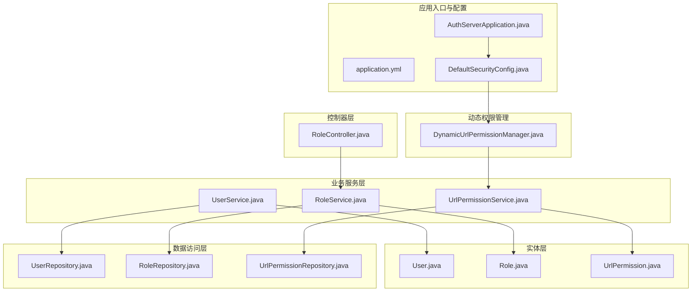
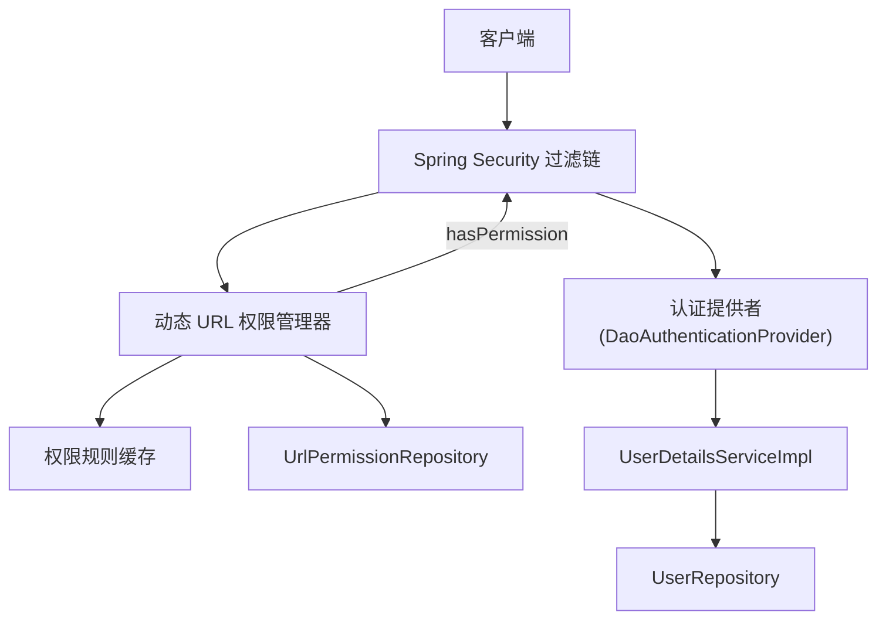
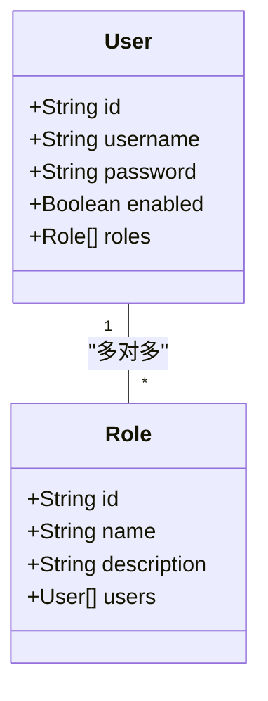
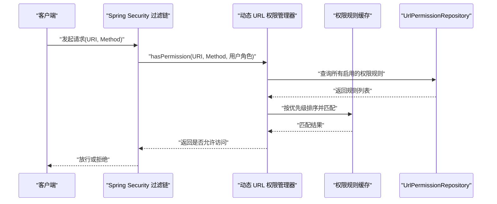
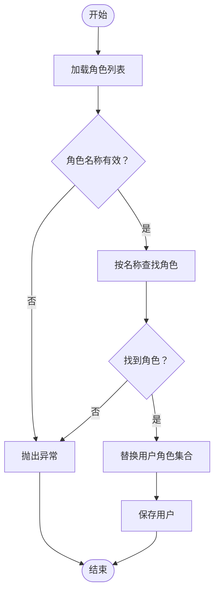
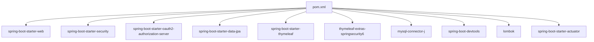

# 用户角色权限管理

<cite>
**本文引用的文件**
- [AuthServerApplication.java](file://src/main/java/com/example/authserver/AuthServerApplication.java)
- [application.yml](file://src/main/resources/application.yml)
- [User.java](file://src/main/java/com/example/authserver/entity/User.java)
- [Role.java](file://src/main/java/com/example/authserver/entity/Role.java)
- [UrlPermission.java](file://src/main/java/com/example/authserver/entity/UrlPermission.java)
- [UserRepository.java](file://src/main/java/com/example/authserver/repository/UserRepository.java)
- [RoleRepository.java](file://src/main/java/com/example/authserver/repository/RoleRepository.java)
- [UrlPermissionRepository.java](file://src/main/java/com/example/authserver/repository/UrlPermissionRepository.java)
- [UserService.java](file://src/main/java/com/example/authserver/service/UserService.java)
- [RoleService.java](file://src/main/java/com/example/authserver/service/RoleService.java)
- [UrlPermissionService.java](file://src/main/java/com/example/authserver/service/UrlPermissionService.java)
- [DynamicUrlPermissionManager.java](file://src/main/java/com/example/authserver/config/DynamicUrlPermissionManager.java)
- [DefaultSecurityConfig.java](file://src/main/java/com/example/authserver/config/DefaultSecurityConfig.java)
- [RoleController.java](file://src/main/java/com/example/authserver/controller/RoleController.java)
- [pom.xml](file://pom.xml)
</cite>

## 目录
1. [简介](#简介)
2. [项目结构](#项目结构)
3. [核心组件](#核心组件)
4. [架构总览](#架构总览)
5. [详细组件分析](#详细组件分析)
6. [依赖分析](#依赖分析)
7. [性能考虑](#性能考虑)
8. [故障排查指南](#故障排查指南)
9. [结论](#结论)
10. [附录](#附录)

## 简介
本项目是一个基于 Spring Security 的授权服务器，实现了 RBAC（基于角色的访问控制）权限模型，支持用户与角色的多对多关系管理、角色分配与撤销、批量更新、动态 URL 权限规则、权限缓存与失效、以及与 Spring Security 注解的集成能力。系统通过动态 URL 权限管理器在运行时加载并匹配权限规则，结合数据库中的角色与 URL 权限配置，实现灵活且可扩展的权限控制。

## 项目结构
项目采用分层架构，主要分为以下层次：
- 应用入口与配置：应用启动类、安全配置、数据库连接与 JPA 配置
- 实体层：用户、角色、URL 权限规则
- 数据访问层：JPA Repository 接口
- 业务服务层：用户服务、角色服务、URL 权限服务
- 控制器层：角色管理控制器（Web 页面）
- 动态权限管理：动态 URL 权限管理器

图表来源
- [AuthServerApplication.java:1-14](file://src/main/java/com/example/authserver/AuthServerApplication.java#L1-L14)
- [application.yml:1-30](file://src/main/resources/application.yml#L1-L30)
- [DefaultSecurityConfig.java:1-75](file://src/main/java/com/example/authserver/config/DefaultSecurityConfig.java#L1-L75)
- [DynamicUrlPermissionManager.java:1-120](file://src/main/java/com/example/authserver/config/DynamicUrlPermissionManager.java#L1-L120)
- [User.java:1-66](file://src/main/java/com/example/authserver/entity/User.java#L1-L66)
- [Role.java:1-62](file://src/main/java/com/example/authserver/entity/Role.java#L1-L62)
- [UrlPermission.java:1-73](file://src/main/java/com/example/authserver/entity/UrlPermission.java#L1-L73)
- [UserRepository.java:1-44](file://src/main/java/com/example/authserver/repository/UserRepository.java#L1-L44)
- [RoleRepository.java:1-45](file://src/main/java/com/example/authserver/repository/RoleRepository.java#L1-L45)
- [UrlPermissionRepository.java:1-32](file://src/main/java/com/example/authserver/repository/UrlPermissionRepository.java#L1-L32)
- [UserService.java:1-265](file://src/main/java/com/example/authserver/service/UserService.java#L1-L265)
- [RoleService.java:1-235](file://src/main/java/com/example/authserver/service/RoleService.java#L1-L235)
- [UrlPermissionService.java:1-94](file://src/main/java/com/example/authserver/service/UrlPermissionService.java#L1-L94)
- [RoleController.java:1-339](file://src/main/java/com/example/authserver/controller/RoleController.java#L1-L339)

章节来源
- [AuthServerApplication.java:1-14](file://src/main/java/com/example/authserver/AuthServerApplication.java#L1-L14)
- [application.yml:1-30](file://src/main/resources/application.yml#L1-L30)
- [DefaultSecurityConfig.java:1-75](file://src/main/java/com/example/authserver/config/DefaultSecurityConfig.java#L1-L75)

## 核心组件
- 用户实体与仓库：用户与角色多对多关系映射，提供按用户名查询、启用状态筛选、搜索等能力
- 角色实体与仓库：角色与用户多对多关系映射，提供按名称查询、统计用户数、搜索等能力
- URL 权限规则实体与仓库：动态权限规则实体，支持 URL 模式、HTTP 方法、所需角色、优先级、启用状态等字段
- 用户服务：用户 CRUD、角色分配与批量更新、角色统计、角色创建与删除（委托给角色服务）
- 角色服务：角色 CRUD、角色用户统计、为角色分配/移除 URL 权限规则、按角色查询 URL 权限规则
- URL 权限服务：权限规则 CRUD、启用/禁用切换
- 动态 URL 权限管理器：从数据库加载启用的权限规则，提供缓存、路径匹配、优先级排序、权限校验
- 安全配置：认证提供者、密码编码器、默认安全过滤链（静态资源放行、登录/登出、其余请求认证）
- 角色控制器：角色管理页面、角色 CRUD、角色详情与 URL 权限规则管理

章节来源
- [User.java:1-66](file://src/main/java/com/example/authserver/entity/User.java#L1-L66)
- [Role.java:1-62](file://src/main/java/com/example/authserver/entity/Role.java#L1-L62)
- [UrlPermission.java:1-73](file://src/main/java/com/example/authserver/entity/UrlPermission.java#L1-L73)
- [UserRepository.java:1-44](file://src/main/java/com/example/authserver/repository/UserRepository.java#L1-L44)
- [RoleRepository.java:1-45](file://src/main/java/com/example/authserver/repository/RoleRepository.java#L1-L45)
- [UrlPermissionRepository.java:1-32](file://src/main/java/com/example/authserver/repository/UrlPermissionRepository.java#L1-L32)
- [UserService.java:1-265](file://src/main/java/com/example/authserver/service/UserService.java#L1-L265)
- [RoleService.java:1-235](file://src/main/java/com/example/authserver/service/RoleService.java#L1-L235)
- [UrlPermissionService.java:1-94](file://src/main/java/com/example/authserver/service/UrlPermissionService.java#L1-L94)
- [DynamicUrlPermissionManager.java:1-120](file://src/main/java/com/example/authserver/config/DynamicUrlPermissionManager.java#L1-L120)
- [DefaultSecurityConfig.java:1-75](file://src/main/java/com/example/authserver/config/DefaultSecurityConfig.java#L1-L75)
- [RoleController.java:1-339](file://src/main/java/com/example/authserver/controller/RoleController.java#L1-L339)

## 架构总览
系统通过 Spring Security 的认证提供者加载用户详情，动态 URL 权限管理器在应用启动后加载数据库中的启用权限规则并缓存，后续每次请求根据 URL 模式、HTTP 方法与用户角色进行匹配，优先级高的规则优先生效。角色控制器提供角色与 URL 权限规则的管理界面与接口。

图表来源
- [DefaultSecurityConfig.java:55-73](file://src/main/java/com/example/authserver/config/DefaultSecurityConfig.java#L55-L73)
- [DynamicUrlPermissionManager.java:36-81](file://src/main/java/com/example/authserver/config/DynamicUrlPermissionManager.java#L36-L81)
- [UrlPermissionRepository.java:19-20](file://src/main/java/com/example/authserver/repository/UrlPermissionRepository.java#L19-L20)
- [UserRepository.java:18-26](file://src/main/java/com/example/authserver/repository/UserRepository.java#L18-L26)

## 详细组件分析

### 用户与角色多对多关系管理
- 实体关系：用户与角色通过中间表 user_roles 建立多对多关系；用户实体使用 EAGER 加载角色，便于权限校验；角色实体通过 mappedBy 反向维护用户集合
- 用户服务：
  - 新增用户：校验参数与唯一性，编码密码，分配角色（默认 ROLE_USER），保存用户
  - 更新用户：可更新密码与启用状态
  - 删除用户：存在性检查后删除，级联删除 user_roles 关联
  - 批量更新用户角色：接收角色名称列表，逐个查找并校验，替换用户角色集合
- 角色服务：
  - 新增角色：校验唯一性，保存角色
  - 删除角色：校验无用户使用后删除
  - 更新角色描述：更新描述并保存
  - 统计角色用户数：通过 Repository 查询聚合结果

图表来源
- [User.java:48-50](file://src/main/java/com/example/authserver/entity/User.java#L48-L50)
- [Role.java:45-46](file://src/main/java/com/example/authserver/entity/Role.java#L45-L46)

章节来源
- [User.java:1-66](file://src/main/java/com/example/authserver/entity/User.java#L1-L66)
- [Role.java:1-62](file://src/main/java/com/example/authserver/entity/Role.java#L1-L62)
- [UserService.java:58-176](file://src/main/java/com/example/authserver/service/UserService.java#L58-L176)
- [RoleService.java:57-107](file://src/main/java/com/example/authserver/service/RoleService.java#L57-L107)

### RBAC 权限模型与动态 URL 权限
- 权限模型：用户通过角色获得权限，角色与 URL 权限规则通过独立的 UrlPermission 实体关联，支持通配符 URL 模式、HTTP 方法、优先级与启用状态
- 动态权限管理器：
  - 初始化与重载：加载所有启用的权限规则，放入并发 Map 缓存
  - 权限校验：按优先级排序，使用 AntPathMatcher 匹配 URL 与 HTTP 方法，判断用户角色是否包含所需角色
  - 缓存操作：支持添加与移除单条规则到缓存
- URL 权限服务：提供权限规则的创建、更新、删除、启用/禁用切换与查询

图表来源
- [DynamicUrlPermissionManager.java:64-81](file://src/main/java/com/example/authserver/config/DynamicUrlPermissionManager.java#L64-L81)
- [UrlPermissionRepository.java:19-20](file://src/main/java/com/example/authserver/repository/UrlPermissionRepository.java#L19-L20)

章节来源
- [UrlPermission.java:1-73](file://src/main/java/com/example/authserver/entity/UrlPermission.java#L1-L73)
- [UrlPermissionRepository.java:1-32](file://src/main/java/com/example/authserver/repository/UrlPermissionRepository.java#L1-L32)
- [UrlPermissionService.java:1-94](file://src/main/java/com/example/authserver/service/UrlPermissionService.java#L1-L94)
- [DynamicUrlPermissionManager.java:1-120](file://src/main/java/com/example/authserver/config/DynamicUrlPermissionManager.java#L1-L120)

### 角色权限配置与批量更新流程
- 角色权限配置：
  - 为角色分配 URL 权限规则：遍历 URL 模式，若不存在对应规则则创建，设置所需角色、HTTP 方法、优先级与启用状态
  - 从角色移除 URL 权限规则：查找匹配规则并删除
  - 按角色查询 URL 权限规则：查询启用规则并过滤所需角色
- 批量更新用户角色：
  - 接收角色名称列表，逐个查找并校验，替换用户角色集合，事务内保存

图表来源
- [UserService.java:149-176](file://src/main/java/com/example/authserver/service/UserService.java#L149-L176)
- [RoleService.java:114-149](file://src/main/java/com/example/authserver/service/RoleService.java#L114-L149)

章节来源
- [RoleService.java:113-149](file://src/main/java/com/example/authserver/service/RoleService.java#L113-L149)
- [UserService.java:149-176](file://src/main/java/com/example/authserver/service/UserService.java#L149-L176)

### 权限继承、组合与验证机制
- 权限继承：系统未实现显式的角色继承（如 ROLE_ADMIN 包含 ROLE_USER）。当前权限验证仅基于用户直接拥有的角色集合
- 权限组合：通过多个角色组合授予用户多种权限；URL 权限规则按优先级排序，优先级高的规则优先匹配
- 权限验证：动态 URL 权限管理器在每次请求时执行匹配，未匹配到规则默认放行

章节来源
- [DynamicUrlPermissionManager.java:64-81](file://src/main/java/com/example/authserver/config/DynamicUrlPermissionManager.java#L64-L81)
- [RoleService.java:223-233](file://src/main/java/com/example/authserver/service/RoleService.java#L223-L233)

### 动态更新策略：缓存、失效与实时生效
- 缓存策略：动态 URL 权限管理器在初始化与重载时将启用的权限规则放入并发 Map 缓存，提升匹配性能
- 失效机制：提供手动重载方法，可在权限规则变更后触发重新加载；同时支持添加/移除单条规则到缓存
- 实时生效：权限规则变更后调用重载或缓存更新方法，确保后续请求使用最新规则

章节来源
- [DynamicUrlPermissionManager.java:45-54](file://src/main/java/com/example/authserver/config/DynamicUrlPermissionManager.java#L45-L54)
- [DynamicUrlPermissionManager.java:107-118](file://src/main/java/com/example/authserver/config/DynamicUrlPermissionManager.java#L107-L118)

### 最佳实践：角色层级设计、权限粒度与最小权限原则
- 角色层级设计：建议采用“基础角色 + 业务角色”的分层设计，避免直接赋予高权限角色
- 权限粒度控制：使用通配符与精确路径相结合，配合 HTTP 方法限制，细化权限粒度
- 最小权限原则：为用户分配满足其职责所需的最少角色，定期审查角色与权限规则

（本节为通用最佳实践说明，不直接分析具体文件）

### 与 Spring Security 注解的集成
- 当前系统通过动态 URL 权限管理器与安全过滤链实现统一的权限控制，未在控制器或服务层使用 @PreAuthorize、@PostAuthorize 等注解
- 若需在服务层使用注解，可在相应方法上添加 @PreAuthorize("hasRole('ROLE_ADMIN')") 等注解，并确保 @EnableMethodSecurity 已启用

章节来源
- [DefaultSecurityConfig.java:55-73](file://src/main/java/com/example/authserver/config/DefaultSecurityConfig.java#L55-L73)

### 权限审计、日志记录与冲突检测
- 日志记录：各服务与管理器均包含详细的日志记录，覆盖创建、更新、删除、权限校验等关键操作
- 冲突检测：动态 URL 权限管理器按优先级排序，优先级高的规则优先匹配，减少规则冲突影响范围

章节来源
- [RoleController.java:98-118](file://src/main/java/com/example/authserver/controller/RoleController.java#L98-L118)
- [RoleService.java:125-146](file://src/main/java/com/example/authserver/service/RoleService.java#L125-L146)
- [DynamicUrlPermissionManager.java:64-81](file://src/main/java/com/example/authserver/config/DynamicUrlPermissionManager.java#L64-L81)

## 依赖分析
- Spring Boot Starter：Web、Security、OAuth2 Authorization Server、Data JPA、Thymeleaf
- 数据库：MySQL，JPA 自动建模，DDL 自动更新
- 密码编码：DelegatingPasswordEncoder
- 开发工具：DevTools、Lombok、Actuator

图表来源
- [pom.xml:29-114](file://pom.xml#L29-L114)

章节来源
- [pom.xml:1-147](file://pom.xml#L1-L147)
- [application.yml:4-24](file://src/main/resources/application.yml#L4-L24)

## 性能考虑
- 缓存命中：动态 URL 权限管理器使用并发 Map 缓存启用的权限规则，避免每次请求重复查询数据库
- 匹配效率：AntPathMatcher 支持通配符匹配，结合优先级排序减少无效匹配次数
- 数据库查询：角色用户统计通过聚合查询一次性返回，降低多次查询开销
- 建议：在高并发场景下，可考虑引入 Redis 缓存权限规则，并增加缓存失效策略与监控

（本节提供一般性性能建议，不直接分析具体文件）

## 故障排查指南
- 用户/角色不存在：相关服务抛出资源未找到异常，检查名称大小写与前缀（如 ROLE_）
- 角色被占用：删除角色时报错提示有用户正在使用，需先调整用户角色再删除
- URL 权限规则冲突：优先级高的规则优先匹配，可通过调整优先级解决冲突
- 登录失败：检查密码编码器配置与用户启用状态

章节来源
- [UserService.java:135-143](file://src/main/java/com/example/authserver/service/UserService.java#L135-L143)
- [RoleService.java:99-102](file://src/main/java/com/example/authserver/service/RoleService.java#L99-L102)
- [DynamicUrlPermissionManager.java:78-80](file://src/main/java/com/example/authserver/config/DynamicUrlPermissionManager.java#L78-L80)

## 结论
本项目实现了完整的 RBAC 权限模型，支持用户与角色的多对多关系、角色批量更新、动态 URL 权限规则管理与缓存机制。通过动态 URL 权限管理器与 Spring Security 的结合，系统具备良好的扩展性与灵活性。建议在生产环境中进一步完善角色层级设计、权限粒度控制与审计日志，并根据业务需求考虑引入注解级权限控制与更完善的缓存策略。

## 附录
- 应用配置：数据库连接、JPA 属性、日志级别等
- 依赖清单：Spring 生态、数据库驱动、开发工具等

章节来源
- [application.yml:1-30](file://src/main/resources/application.yml#L1-L30)
- [pom.xml:29-114](file://pom.xml#L29-L114)