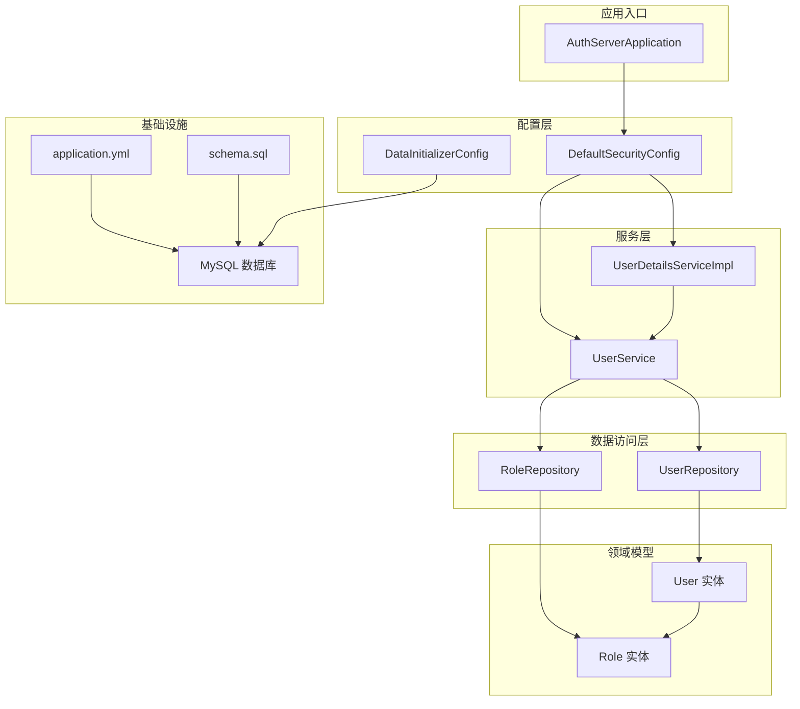
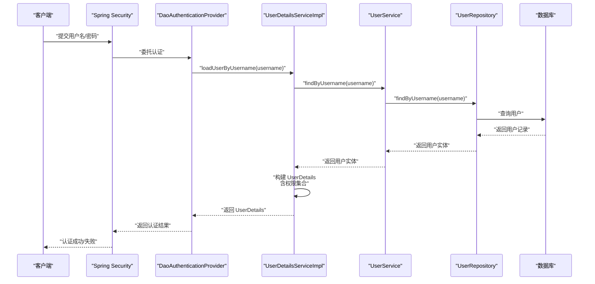
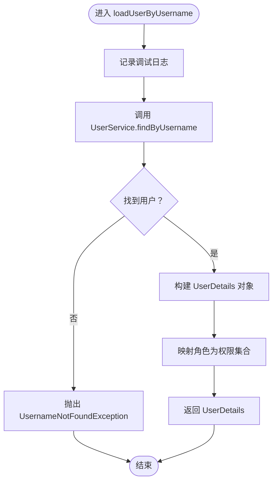
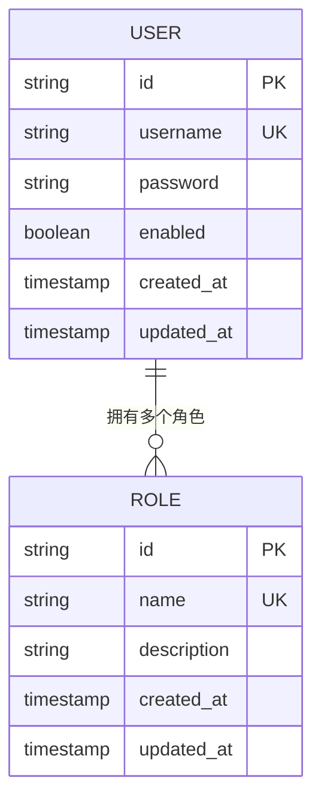
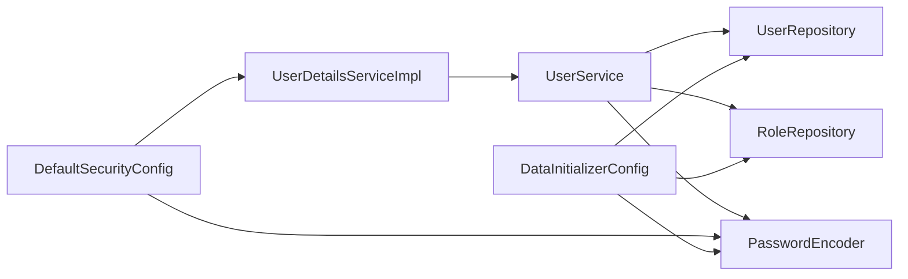

# 用户详情服务实现

<cite>
**本文引用的文件**
- [UserDetailsServiceImpl.java](file://src/main/java/com/example/authserver/service/UserDetailsServiceImpl.java)
- [User.java](file://src/main/java/com/example/authserver/entity/User.java)
- [Role.java](file://src/main/java/com/example/authserver/entity/Role.java)
- [UserRepository.java](file://src/main/java/com/example/authserver/repository/UserRepository.java)
- [RoleRepository.java](file://src/main/java/com/example/authserver/repository/RoleRepository.java)
- [UserService.java](file://src/main/java/com/example/authserver/service/UserService.java)
- [DefaultSecurityConfig.java](file://src/main/java/com/example/authserver/config/DefaultSecurityConfig.java)
- [DataInitializerConfig.java](file://src/main/java/com/example/authserver/config/DataInitializerConfig.java)
- [application.yml](file://src/main/resources/application.yml)
- [schema.sql](file://src/main/resources/schema.sql)
- [AuthServerApplication.java](file://src/main/java/com/example/authserver/AuthServerApplication.java)
</cite>

## 目录
1. [简介](#简介)
2. [项目结构](#项目结构)
3. [核心组件](#核心组件)
4. [架构总览](#架构总览)
5. [详细组件分析](#详细组件分析)
6. [依赖关系分析](#依赖关系分析)
7. [性能考虑](#性能考虑)
8. [故障排查指南](#故障排查指南)
9. [结论](#结论)
10. [附录](#附录)

## 简介
本文件围绕用户详情服务实现进行深入技术文档化，重点阐述 UserDetailsServiceImpl 的完整工作机制，包括：
- 如何从数据库加载用户信息
- 如何构建 Spring Security 的 UserDetails 对象
- 如何解析用户权限集合
- 密码验证流程与账户状态检查（启用/禁用）
- 与 Spring Security 的集成方式（UserDetailsService 实现、自定义用户详情对象设计）
- 密码编码器配置与使用（DelegatingPasswordEncoder 与 BCrypt）
- 用户权限的动态加载与缓存策略
- 异常处理、日志记录与性能优化最佳实践

## 项目结构
该项目采用基于模块的分层组织，用户详情服务位于 service 层，配合实体、仓库、配置与初始化逻辑共同构成认证与授权子系统。

图表来源
- [AuthServerApplication.java:1-14](file://src/main/java/com/example/authserver/AuthServerApplication.java#L1-L14)
- [DefaultSecurityConfig.java:27-75](file://src/main/java/com/example/authserver/config/DefaultSecurityConfig.java#L27-L75)
- [DataInitializerConfig.java:20-109](file://src/main/java/com/example/authserver/config/DataInitializerConfig.java#L20-L109)
- [UserDetailsServiceImpl.java:19-59](file://src/main/java/com/example/authserver/service/UserDetailsServiceImpl.java#L19-L59)
- [UserService.java:21-265](file://src/main/java/com/example/authserver/service/UserService.java#L21-L265)
- [UserRepository.java:15-44](file://src/main/java/com/example/authserver/repository/UserRepository.java#L15-L44)
- [RoleRepository.java:15-45](file://src/main/java/com/example/authserver/repository/RoleRepository.java#L15-L45)
- [User.java:20-66](file://src/main/java/com/example/authserver/entity/User.java#L20-L66)
- [Role.java:20-62](file://src/main/java/com/example/authserver/entity/Role.java#L20-L62)
- [application.yml:1-30](file://src/main/resources/application.yml#L1-L30)
- [schema.sql:1-169](file://src/main/resources/schema.sql#L1-L169)

章节来源
- [AuthServerApplication.java:1-14](file://src/main/java/com/example/authserver/AuthServerApplication.java#L1-L14)
- [DefaultSecurityConfig.java:27-75](file://src/main/java/com/example/authserver/config/DefaultSecurityConfig.java#L27-L75)
- [DataInitializerConfig.java:20-109](file://src/main/java/com/example/authserver/config/DataInitializerConfig.java#L20-L109)

## 核心组件
- 用户详情服务实现：UserDetailsServiceImpl 实现 UserDetailsService，负责根据用户名加载用户详情并转换为 Spring Security 的 UserDetails。
- 用户服务：UserService 提供用户查询、角色分配、密码编码等业务能力，被 UserDetailsServiceImpl 间接调用。
- 数据访问层：UserRepository、RoleRepository 提供用户与角色的持久化操作。
- 领域模型：User、Role 实体定义用户与角色的数据结构及多对多关系。
- 安全配置：DefaultSecurityConfig 配置认证提供者与密码编码器；DataInitializerConfig 负责默认数据初始化。
- 应用配置：application.yml 提供数据库连接与 JPA/Hibernate 设置；schema.sql 初始化数据库结构与默认角色/URL 权限规则。

章节来源
- [UserDetailsServiceImpl.java:19-59](file://src/main/java/com/example/authserver/service/UserDetailsServiceImpl.java#L19-L59)
- [UserService.java:21-265](file://src/main/java/com/example/authserver/service/UserService.java#L21-L265)
- [UserRepository.java:15-44](file://src/main/java/com/example/authserver/repository/UserRepository.java#L15-L44)
- [RoleRepository.java:15-45](file://src/main/java/com/example/authserver/repository/RoleRepository.java#L15-L45)
- [User.java:20-66](file://src/main/java/com/example/authserver/entity/User.java#L20-L66)
- [Role.java:20-62](file://src/main/java/com/example/authserver/entity/Role.java#L20-L62)
- [DefaultSecurityConfig.java:27-75](file://src/main/java/com/example/authserver/config/DefaultSecurityConfig.java#L27-L75)
- [DataInitializerConfig.java:20-109](file://src/main/java/com/example/authserver/config/DataInitializerConfig.java#L20-L109)
- [application.yml:1-30](file://src/main/resources/application.yml#L1-L30)
- [schema.sql:1-169](file://src/main/resources/schema.sql#L1-L169)

## 架构总览
下图展示用户认证流程中，从请求到数据库查询再到返回 UserDetails 的关键交互。

图表来源
- [DefaultSecurityConfig.java:34-41](file://src/main/java/com/example/authserver/config/DefaultSecurityConfig.java#L34-L41)
- [UserDetailsServiceImpl.java:29-57](file://src/main/java/com/example/authserver/service/UserDetailsServiceImpl.java#L29-L57)
- [UserService.java:40-42](file://src/main/java/com/example/authserver/service/UserService.java#L40-L42)
- [UserRepository.java:18-21](file://src/main/java/com/example/authserver/repository/UserRepository.java#L18-L21)

## 详细组件分析

### 用户详情服务实现（UserDetailsServiceImpl）
- 职责与入口
  - 实现 UserDetailsService 接口，提供 loadUserByUsername 方法，供 Spring Security 在认证阶段调用。
  - 使用事务只读模式加载用户，避免并发写入风险。
- 数据加载与转换
  - 通过 UserService.findByUsername(username) 获取用户实体。
  - 若未找到用户，抛出 UsernameNotFoundException。
  - 将用户实体转换为 Spring Security 的 UserDetails，包含：
    - 用户名、密码、启用状态
    - 账户未过期、凭证未过期、未锁定标志均为 true
    - 权限集合：从用户的角色列表映射为 SimpleGrantedAuthority
- 日志与异常
  - 成功加载时记录 info 日志；异常时记录 error 并包装为 UsernameNotFoundException 抛出。

图表来源
- [UserDetailsServiceImpl.java:29-57](file://src/main/java/com/example/authserver/service/UserDetailsServiceImpl.java#L29-L57)

章节来源
- [UserDetailsServiceImpl.java:19-59](file://src/main/java/com/example/authserver/service/UserDetailsServiceImpl.java#L19-L59)

### 用户实体与角色实体（User、Role）
- User 实体
  - 主键：UUID
  - 字段：username、password、enabled、时间戳
  - 关系：与 Role 为多对多，FetchStrategy 为 EAGER（加载用户时直接加载角色）
- Role 实体
  - 主键：UUID
  - 字段：name、description、时间戳
  - 关系：与 User 为多对多，mappedBy 指向 User.roles
- 时间戳：PrePersist/PreUpdate 自动维护创建与更新时间

图表来源
- [User.java:20-66](file://src/main/java/com/example/authserver/entity/User.java#L20-L66)
- [Role.java:20-62](file://src/main/java/com/example/authserver/entity/Role.java#L20-L62)

章节来源
- [User.java:20-66](file://src/main/java/com/example/authserver/entity/User.java#L20-L66)
- [Role.java:20-62](file://src/main/java/com/example/authserver/entity/Role.java#L20-L62)

### 数据访问层（UserRepository、RoleRepository）
- UserRepository
  - findByUsername：按用户名查询用户
  - existsByUsername：检查用户名是否存在
  - findByEnabledTrue/False：查询启用/禁用用户
  - searchByUsername：模糊匹配用户名
- RoleRepository
  - findByName：按名称查询角色
  - existsByName：检查角色名是否存在
  - findAllByOrderByName：按名称排序查询
  - searchByName：模糊匹配角色名
  - countUsersByRole：统计每个角色的用户数量

章节来源
- [UserRepository.java:15-44](file://src/main/java/com/example/authserver/repository/UserRepository.java#L15-L44)
- [RoleRepository.java:15-45](file://src/main/java/com/example/authserver/repository/RoleRepository.java#L15-L45)

### 用户服务（UserService）
- 职责
  - 提供用户查询、角色分配、密码编码、用户更新与删除等业务方法
  - 依赖 PasswordEncoder 进行密码编码
- 关键方法
  - findByUsername：对外暴露用户查询
  - getUserRoles：返回用户的角色名称列表
  - createUser：创建用户并分配角色（默认 ROLE_USER）
  - updateUser：更新密码与启用状态
  - updateUserAuthorities：批量更新用户角色
  - findAllRoles：返回角色列表与用户数量统计
  - createRole/deleteRole/findRoleByName/updateRoleDescription：角色管理

章节来源
- [UserService.java:21-265](file://src/main/java/com/example/authserver/service/UserService.java#L21-L265)

### 安全配置与密码编码器
- DefaultSecurityConfig
  - authenticationProvider：配置 DaoAuthenticationProvider，注入 UserDetailsService 与 PasswordEncoder
  - passwordEncoder：使用 DelegatingPasswordEncoder，内部可支持多种编码器（含 BCrypt）
  - defaultSecurityFilterChain：配置 Web 安全过滤链，允许静态资源与登录端点访问
- DataInitializerConfig
  - 初始化默认角色（ROLE_USER、ROLE_ADMIN）与默认用户（user/admin）
  - 使用 PasswordEncoder 对明文密码进行编码

章节来源
- [DefaultSecurityConfig.java:27-75](file://src/main/java/com/example/authserver/config/DefaultSecurityConfig.java#L27-L75)
- [DataInitializerConfig.java:20-109](file://src/main/java/com/example/authserver/config/DataInitializerConfig.java#L20-L109)

### 应用配置与数据库初始化
- application.yml
  - 数据源配置（MySQL）
  - JPA/Hibernate 配置（方言、DDL、SQL 输出）
  - 日志级别（Spring Security）
- schema.sql
  - 初始化 users、roles、user_roles、url_permissions、oauth2_* 等表
  - 插入默认角色与 URL 权限规则

章节来源
- [application.yml:1-30](file://src/main/resources/application.yml#L1-L30)
- [schema.sql:1-169](file://src/main/resources/schema.sql#L1-L169)

## 依赖关系分析
- 组件耦合
  - UserDetailsServiceImpl 依赖 UserService；UserService 依赖 UserRepository、RoleRepository 与 PasswordEncoder
  - DefaultSecurityConfig 依赖 UserDetailsServiceImpl 与 PasswordEncoder
  - DataInitializerConfig 依赖 PasswordEncoder、UserRepository、RoleRepository
- 外部依赖
  - Spring Security（UserDetailsService、DaoAuthenticationProvider、PasswordEncoder）
  - Spring Data JPA（JpaRepository、@Query）
  - MySQL（JDBC 驱动）

图表来源
- [UserDetailsServiceImpl.java:24](file://src/main/java/com/example/authserver/service/UserDetailsServiceImpl.java#L24)
- [UserService.java:26-28](file://src/main/java/com/example/authserver/service/UserService.java#L26-L28)
- [DefaultSecurityConfig.java:34-49](file://src/main/java/com/example/authserver/config/DefaultSecurityConfig.java#L34-L49)
- [DataInitializerConfig.java:25](file://src/main/java/com/example/authserver/config/DataInitializerConfig.java#L25)

## 性能考虑
- 查询策略
  - User.roles 使用 EAGER 加载，可在一次查询中获取用户及其角色，减少 N+1 查询风险
  - UserRepository 提供按启用状态与模糊匹配的查询方法，便于前端筛选与搜索
- 编码器选择
  - DelegatingPasswordEncoder 支持多种编码器，推荐使用 BCrypt（默认策略之一），具备抗彩虹表与自适应成本因子特性
- 缓存策略
  - 当前实现未引入缓存层；建议在高频认证场景下对用户详情与角色集合进行本地缓存（如 Caffeine/ConcurrentHashMap），并结合数据库变更事件或 TTL 清理策略
- 事务与只读
  - loadUserByUsername 使用只读事务，避免不必要的写锁竞争
- 日志与监控
  - 建议对认证失败与慢查询进行埋点与告警，结合 AOP 或拦截器记录耗时与异常

[本节为通用性能指导，不直接分析具体文件]

## 故障排查指南
- 用户不存在
  - 现象：抛出 UsernameNotFoundException
  - 排查：确认用户名拼写、数据库中是否存在对应记录、UserRepository.findByUsername 是否正确
- 密码不匹配
  - 现象：认证失败
  - 排查：确认密码是否经过 PasswordEncoder 编码；DelegatingPasswordEncoder 是否正确识别编码器类型
- 账户被禁用
  - 现象：认证失败（enabled=false）
  - 排查：User.enabled 字段是否为 true；UserDetails 构建时是否正确传递 enabled
- 角色缺失
  - 现象：权限不足导致访问受限
  - 排查：确认 user_roles 关联是否存在；RoleRepository.findByName 是否返回角色；UserService.updateUserAuthorities 是否正确更新
- 数据初始化异常
  - 现象：默认角色/用户未创建
  - 排查：schema.sql 是否执行；DataInitializerConfig 是否运行；角色名称是否与 schema.sql 一致

章节来源
- [UserDetailsServiceImpl.java:34-56](file://src/main/java/com/example/authserver/service/UserDetailsServiceImpl.java#L34-L56)
- [UserService.java:150-176](file://src/main/java/com/example/authserver/service/UserService.java#L150-L176)
- [DataInitializerConfig.java:73-95](file://src/main/java/com/example/authserver/config/DataInitializerConfig.java#L73-L95)

## 结论
UserDetailsServiceImpl 通过与 UserService、UserRepository、RoleRepository 的协作，实现了从数据库加载用户详情、构建 Spring Security 的 UserDetails 对象、解析用户权限集合的完整流程。配合 DefaultSecurityConfig 中的 DaoAuthenticationProvider 与 DelegatingPasswordEncoder，系统完成了密码编码与认证集成。当前实现具备清晰的职责划分与良好的扩展性，建议在高并发场景下引入缓存与监控以进一步提升性能与可观测性。

[本节为总结性内容，不直接分析具体文件]

## 附录

### 密码编码器配置与使用要点
- 配置方式
  - DefaultSecurityConfig 中通过 Bean 定义 DelegatingPasswordEncoder，默认支持多种编码器（含 BCrypt）
- 使用方式
  - UserService 在创建/更新用户时使用 PasswordEncoder.encode 对明文密码进行编码
  - DataInitializerConfig 在初始化用户时同样使用 PasswordEncoder.encode

章节来源
- [DefaultSecurityConfig.java:46-49](file://src/main/java/com/example/authserver/config/DefaultSecurityConfig.java#L46-L49)
- [UserService.java:81](file://src/main/java/com/example/authserver/service/UserService.java#L81)
- [DataInitializerConfig.java:103](file://src/main/java/com/example/authserver/config/DataInitializerConfig.java#L103)

### 用户权限动态加载与缓存策略建议
- 动态加载
  - 通过 UserService.getUserRoles 或 UserDetailsServiceImpl 中的角色映射，实时从数据库加载用户权限
- 缓存策略
  - 建议对用户详情与角色集合进行本地缓存，设置合理 TTL 与失效策略
  - 结合数据库变更事件或定时任务刷新缓存，保证权限一致性
  - 对热点用户（频繁登录）可采用更短 TTL 与预热策略

[本节为通用建议，不直接分析具体文件]