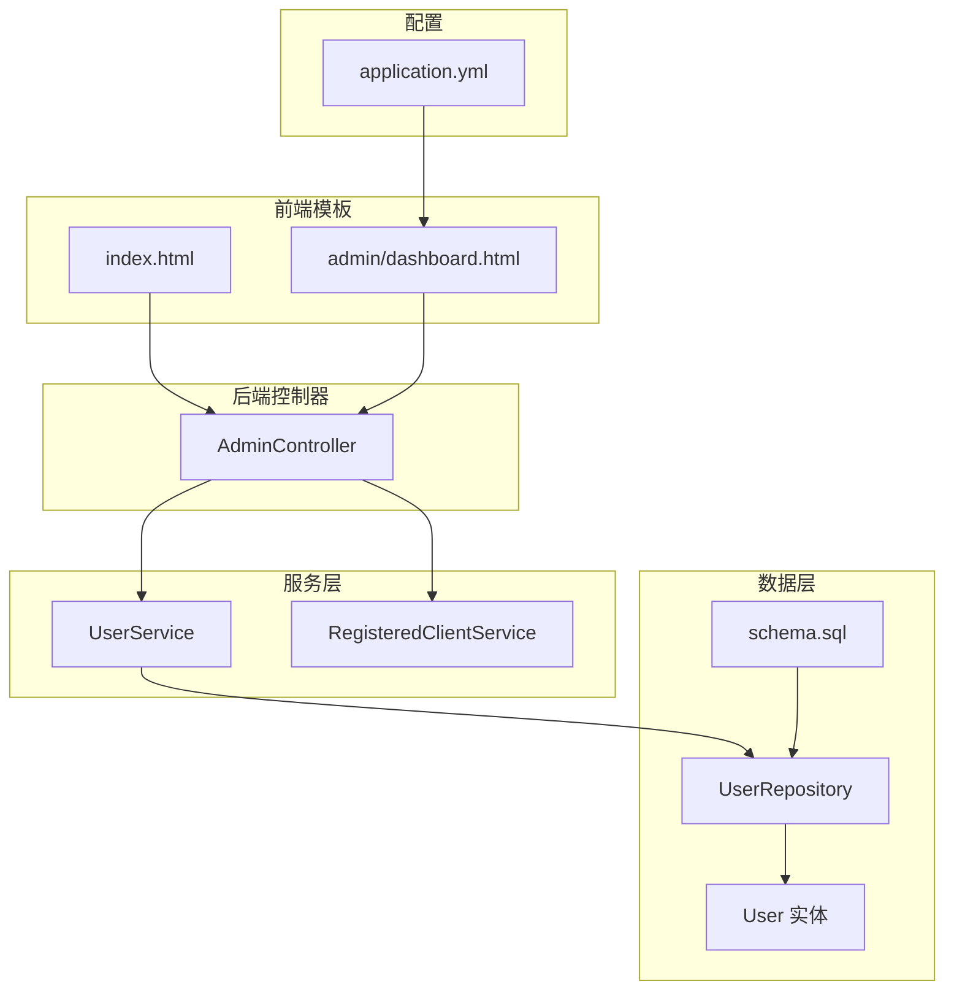
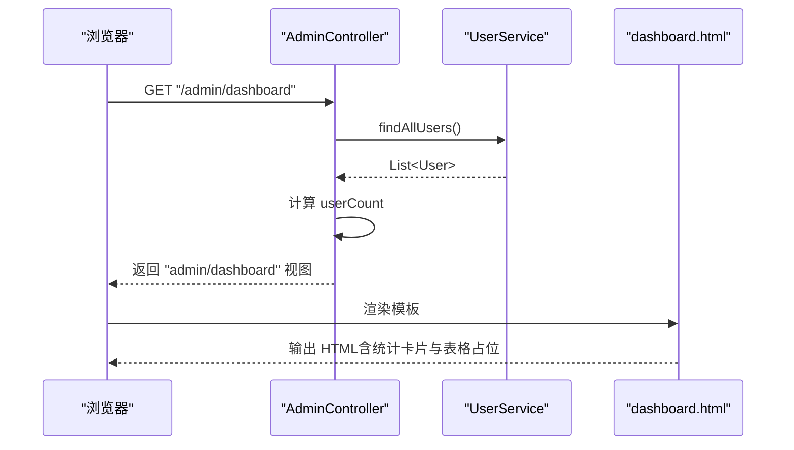
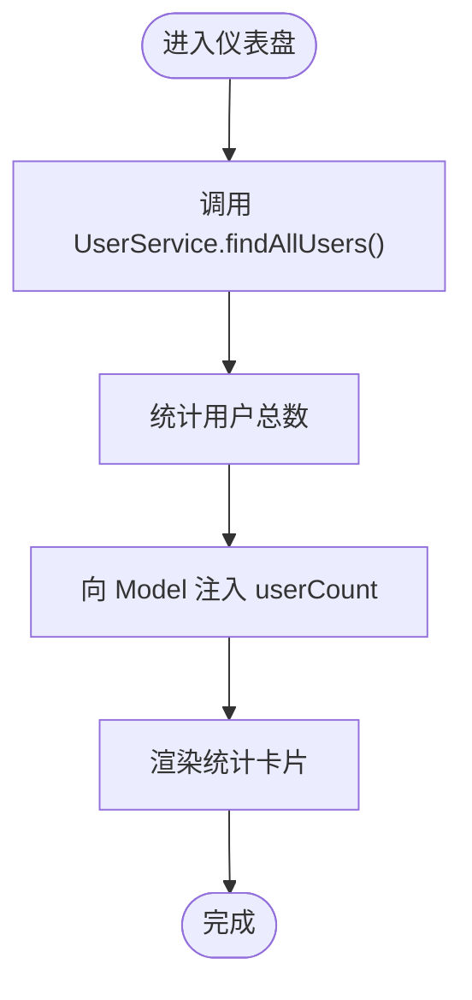
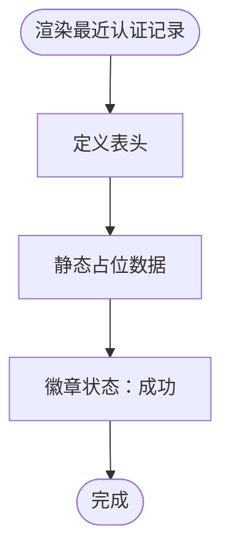
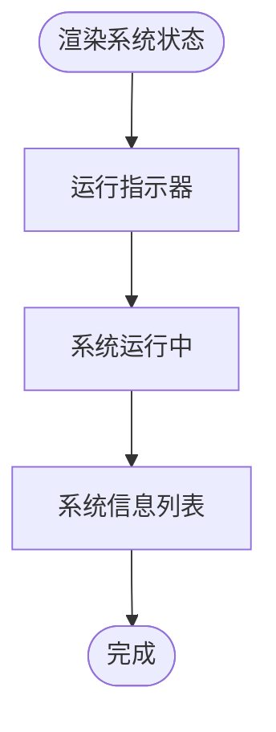
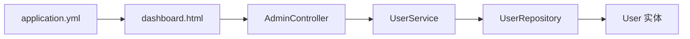

# 仪表盘页面

<cite>
**本文引用的文件**
- [dashboard.html](file://src/main/resources/templates/admin/dashboard.html)
- [AdminController.java](file://src/main/java/com/example/authserver/controller/AdminController.java)
- [UserService.java](file://src/main/java/com/example/authserver/service/UserService.java)
- [RegisteredClientService.java](file://src/main/java/com/example/authserver/service/RegisteredClientService.java)
- [application.yml](file://src/main/resources/application.yml)
- [User.java](file://src/main/java/com/example/authserver/entity/User.java)
- [UserRepository.java](file://src/main/java/com/example/authserver/repository/UserRepository.java)
- [index.html](file://src/main/resources/templates/index.html)
- [schema.sql](file://src/main/resources/schema.sql)
</cite>

## 目录
1. [简介](#简介)
2. [项目结构](#项目结构)
3. [核心组件](#核心组件)
4. [架构总览](#架构总览)
5. [详细组件分析](#详细组件分析)
6. [依赖关系分析](#依赖关系分析)
7. [性能考虑](#性能考虑)
8. [故障排查指南](#故障排查指南)
9. [结论](#结论)
10. [附录](#附录)

## 简介
本文件面向仪表盘页面的实现与使用，围绕以下目标展开：
- 整体布局设计：左侧固定侧边栏、顶部工具栏、主要内容区域的结构与交互。
- 统计卡片组件：用户总数、应用连接数、认证次数等关键指标的展示方式与数据来源。
- 最近认证记录表格：数据绑定与渲染机制，以及系统状态信息的展示逻辑。
- Thymeleaf 模板语法：变量绑定、条件判断与循环渲染的实际应用。
- 页面样式定制：CSS 变量、响应式设计与主题切换方案。

## 项目结构
仪表盘页面位于模板目录下，采用 Thymeleaf 渲染，配合 Spring MVC 控制器与服务层提供数据支撑。整体结构如下图所示：

图表来源
- [dashboard.html:1-339](file://src/main/resources/templates/admin/dashboard.html#L1-L339)
- [AdminController.java:1-282](file://src/main/java/com/example/authserver/controller/AdminController.java#L1-L282)
- [UserService.java:1-265](file://src/main/java/com/example/authserver/service/UserService.java#L1-L265)
- [RegisteredClientService.java:1-131](file://src/main/java/com/example/authserver/service/RegisteredClientService.java#L1-L131)
- [UserRepository.java:1-44](file://src/main/java/com/example/authserver/repository/UserRepository.java#L1-L44)
- [User.java:1-66](file://src/main/java/com/example/authserver/entity/User.java#L1-L66)
- [application.yml:1-30](file://src/main/resources/application.yml#L1-L30)
- [schema.sql:1-169](file://src/main/resources/schema.sql#L1-L169)

章节来源
- [dashboard.html:1-339](file://src/main/resources/templates/admin/dashboard.html#L1-L339)
- [application.yml:1-30](file://src/main/resources/application.yml#L1-L30)

## 核心组件
- 仪表盘模板：负责页面布局、统计卡片、最近认证记录表格与系统状态展示。
- 管理员控制器：处理仪表盘请求，向模板注入基础统计信息（如用户总数）。
- 用户服务：提供用户查询能力，支撑统计卡片中的用户总数。
- 注册客户端服务：提供客户端查询能力，支撑应用连接数统计。
- 应用配置：开启 Thymeleaf 缓存关闭，便于开发调试。

章节来源
- [dashboard.html:1-339](file://src/main/resources/templates/admin/dashboard.html#L1-L339)
- [AdminController.java:33-39](file://src/main/java/com/example/authserver/controller/AdminController.java#L33-L39)
- [UserService.java:33-35](file://src/main/java/com/example/authserver/service/UserService.java#L33-L35)
- [RegisteredClientService.java:31-33](file://src/main/java/com/example/authserver/service/RegisteredClientService.java#L31-L33)
- [application.yml:10-11](file://src/main/resources/application.yml#L10-L11)

## 架构总览
仪表盘页面的请求-渲染流程如下：

图表来源
- [AdminController.java:33-39](file://src/main/java/com/example/authserver/controller/AdminController.java#L33-L39)
- [UserService.java:33-35](file://src/main/java/com/example/authserver/service/UserService.java#L33-L35)
- [dashboard.html:1-339](file://src/main/resources/templates/admin/dashboard.html#L1-L339)

## 详细组件分析

### 布局与导航
- 左侧固定侧边栏：包含品牌标题与导航菜单项，采用固定定位与 CSS 变量控制宽度。
- 顶部工具栏：包含面包屑导航、用户信息与退出按钮，使用 Spring Security 的安全标签进行权限控制。
- 主内容区：包含页面标题、日期、统计卡片网格与最近认证记录表格及系统状态面板。

章节来源
- [dashboard.html:148-196](file://src/main/resources/templates/admin/dashboard.html#L148-L196)
- [index.html:202-204](file://src/main/resources/templates/index.html#L202-L204)

### 统计卡片组件
- 用户总数：控制器从服务层获取用户列表，计算总数并注入到模板。
- 应用连接数：服务层提供客户端查询能力，但模板中该卡片仍为静态占位，建议后续接入服务层数据。
- 认证次数：模板中为静态占位，建议结合授权表中的认证记录统计。
- 异常认证告警：模板中为静态占位，建议接入异常检测与告警统计。

图表来源
- [AdminController.java:33-39](file://src/main/java/com/example/authserver/controller/AdminController.java#L33-L39)
- [UserService.java:33-35](file://src/main/java/com/example/authserver/service/UserService.java#L33-L35)

章节来源
- [dashboard.html:210-248](file://src/main/resources/templates/admin/dashboard.html#L210-L248)
- [AdminController.java:33-39](file://src/main/java/com/example/authserver/controller/AdminController.java#L33-L39)
- [UserService.java:33-35](file://src/main/java/com/example/authserver/service/UserService.java#L33-L35)

### 最近认证记录表格
- 数据绑定与渲染：表格头部定义列头，表格主体为静态占位，未绑定实际认证记录数据。
- 状态展示：使用 Bootstrap 徽章展示“成功”状态。
- 建议：接入授权表中的认证记录，按时间倒序展示用户、应用系统、时间与状态。

图表来源
- [dashboard.html:250-301](file://src/main/resources/templates/admin/dashboard.html#L250-L301)

章节来源
- [dashboard.html:250-301](file://src/main/resources/templates/admin/dashboard.html#L250-L301)

### 系统状态信息
- 状态图标：使用绿色旋转指示器表示“系统运行中”。
- 系统信息：展示 Spring Boot 版本、JVM 内存使用与数据库连接状态。
- 建议：将内存使用与数据库连接状态改为动态查询，以实时反映系统运行状况。

图表来源
- [dashboard.html:304-331](file://src/main/resources/templates/admin/dashboard.html#L304-L331)

章节来源
- [dashboard.html:304-331](file://src/main/resources/templates/admin/dashboard.html#L304-L331)

### Thymeleaf 模板语法应用
- 变量绑定：在顶部工具栏中使用安全标签显示当前登录用户名与角色。
- 条件判断：在首页模板中使用安全标签根据角色显示管理员入口链接。
- 循环渲染：在客户端管理页面中使用循环渲染客户端认证方式与授权类型。
- 表达式与格式化：在客户端管理页面中使用时间格式化表达式渲染客户端创建时间。

章节来源
- [dashboard.html:185-194](file://src/main/resources/templates/admin/dashboard.html#L185-L194)
- [index.html:202-204](file://src/main/resources/templates/index.html#L202-L204)
- [clients.html:272-287](file://src/main/resources/templates/admin/clients.html#L272-L287)

### 页面样式定制指南
- CSS 变量：通过根元素定义主题变量，如侧边栏宽度、顶部栏高度、主色与背景色，便于统一风格与主题切换。
- 响应式设计：使用 Bootstrap 栅格系统与断点，确保在不同设备上的布局一致性。
- 主题切换：建议在根元素上切换不同的 CSS 变量集合，实现浅色/深色主题切换；同时为组件（如卡片阴影、边框圆角）提供一致的过渡动画。

章节来源
- [dashboard.html:14-143](file://src/main/resources/templates/admin/dashboard.html#L14-L143)

## 依赖关系分析
- 控制器依赖服务层：仪表盘控制器依赖用户服务获取用户总数。
- 服务层依赖数据层：用户服务通过用户仓库查询用户列表。
- 模板依赖控制器：仪表盘模板接收控制器注入的统计信息。
- 配置依赖：Thymeleaf 缓存配置影响模板渲染性能与开发体验。

图表来源
- [AdminController.java:28-39](file://src/main/java/com/example/authserver/controller/AdminController.java#L28-L39)
- [UserService.java:26-35](file://src/main/java/com/example/authserver/service/UserService.java#L26-L35)
- [UserRepository.java:16-43](file://src/main/java/com/example/authserver/repository/UserRepository.java#L16-L43)
- [User.java:23-66](file://src/main/java/com/example/authserver/entity/User.java#L23-L66)
- [dashboard.html:1-339](file://src/main/resources/templates/admin/dashboard.html#L1-L339)
- [application.yml:10-11](file://src/main/resources/application.yml#L10-L11)

章节来源
- [AdminController.java:28-39](file://src/main/java/com/example/authserver/controller/AdminController.java#L28-L39)
- [UserService.java:26-35](file://src/main/java/com/example/authserver/service/UserService.java#L26-L35)
- [UserRepository.java:16-43](file://src/main/java/com/example/authserver/repository/UserRepository.java#L16-L43)
- [User.java:23-66](file://src/main/java/com/example/authserver/entity/User.java#L23-L66)
- [dashboard.html:1-339](file://src/main/resources/templates/admin/dashboard.html#L1-L339)
- [application.yml:10-11](file://src/main/resources/application.yml#L10-L11)

## 性能考虑
- 模板缓存：开发阶段建议关闭 Thymeleaf 缓存以便快速迭代；生产环境建议开启缓存以提升渲染性能。
- 数据查询：用户总数可通过一次查询获取，避免多次重复查询；若后续接入认证次数统计，建议使用数据库聚合查询减少往返。
- 样式与脚本：CDN 资源可加速加载，但需注意网络稳定性与隐私合规。

章节来源
- [application.yml:10-11](file://src/main/resources/application.yml#L10-L11)

## 故障排查指南
- 仪表盘空白或无数据：检查控制器是否正确注入 userCount，确认用户服务查询是否返回数据。
- 退出按钮无效：确认表单提交与安全配置是否正确，检查 Spring Security 配置。
- 模板未生效：确认 Thymeleaf 缓存配置与视图解析器设置，确保模板路径正确。

章节来源
- [AdminController.java:33-39](file://src/main/java/com/example/authserver/controller/AdminController.java#L33-L39)
- [dashboard.html:190-196](file://src/main/resources/templates/admin/dashboard.html#L190-L196)
- [application.yml:10-11](file://src/main/resources/application.yml#L10-L11)

## 结论
仪表盘页面采用清晰的三段式布局，结合 Thymeleaf 的变量绑定与安全标签，实现了基础的统计展示与导航功能。当前统计卡片与表格仍以静态占位为主，建议后续接入服务层数据与授权表统计，以实现更完整的运营监控能力。通过 CSS 变量与响应式设计，页面具备良好的可定制性与跨设备兼容性。

## 附录
- 数据库初始化脚本：包含用户、角色、URL 权限与 OAuth2 相关表结构，为仪表盘数据提供基础支撑。
- 客户端管理页面：展示了 Thymeleaf 的循环渲染与时间格式化用法，可作为仪表盘表格渲染的参考。

章节来源
- [schema.sql:8-169](file://src/main/resources/schema.sql#L8-L169)
- [clients.html:272-287](file://src/main/resources/templates/admin/clients.html#L272-L287)