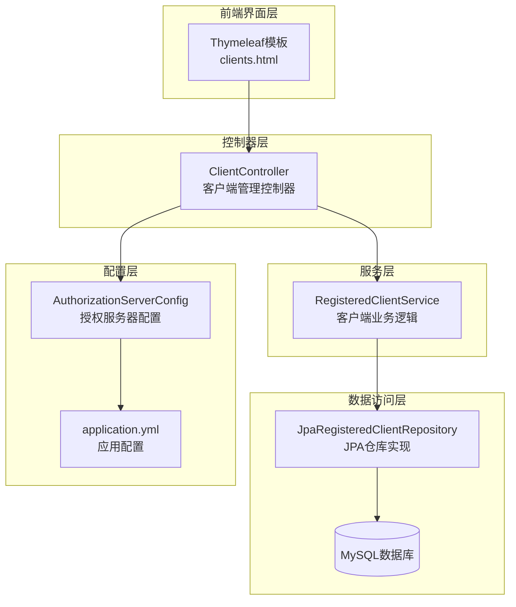
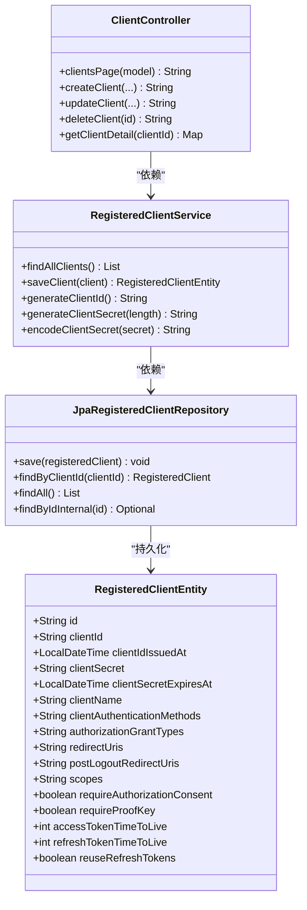
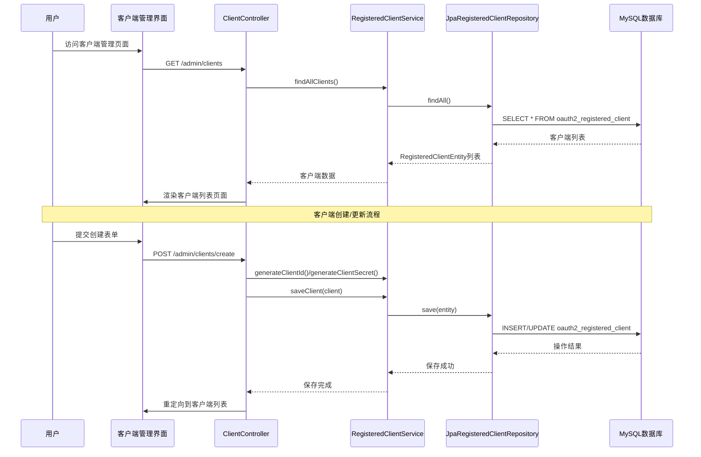
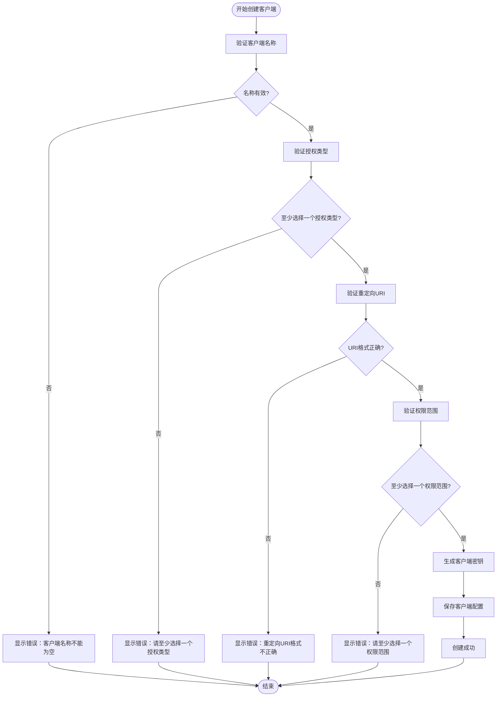
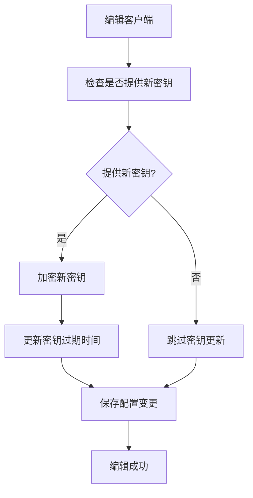
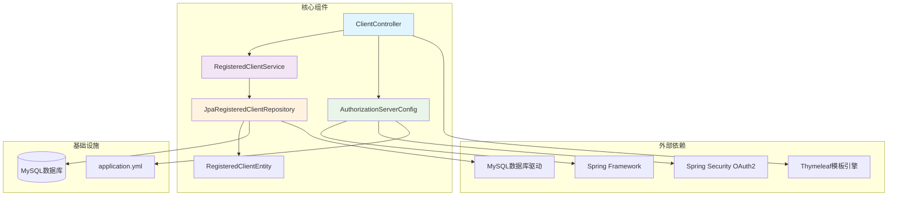

# 客户端管理页面

<cite>
**本文档引用的文件**
- [ClientController.java](file://src/main/java/com/example/authserver/controller/ClientController.java)
- [RegisteredClientService.java](file://src/main/java/com/example/authserver/service/RegisteredClientService.java)
- [RegisteredClientEntity.java](file://src/main/java/com/example/authserver/entity/RegisteredClientEntity.java)
- [JpaRegisteredClientRepository.java](file://src/main/java/com/example/authserver/repository/JpaRegisteredClientRepository.java)
- [clients.html](file://src/main/resources/templates/admin/clients.html)
- [AuthorizationServerConfig.java](file://src/main/java/com/example/authserver/config/AuthorizationServerConfig.java)
- [application.yml](file://src/main/resources/application.yml)
- [schema.sql](file://src/main/resources/schema.sql)
</cite>

## 目录
1. [简介](#简介)
2. [项目结构](#项目结构)
3. [核心组件](#核心组件)
4. [架构概览](#架构概览)
5. [详细组件分析](#详细组件分析)
6. [依赖关系分析](#依赖关系分析)
7. [性能考虑](#性能考虑)
8. [故障排除指南](#故障排除指南)
9. [结论](#结论)

## 简介

客户端管理页面是OAuth2授权服务器的核心功能模块，负责管理所有注册的OAuth2客户端。该系统提供了完整的客户端生命周期管理，包括客户端创建、编辑、删除和状态监控等功能。系统支持多种客户端类型，包括Web应用、移动应用和后端服务等不同场景。

## 项目结构

该OAuth2客户端管理系统采用典型的三层架构设计，包含控制器层、服务层和数据访问层：

**图表来源**
- [ClientController.java:1-366](file://src/main/java/com/example/authserver/controller/ClientController.java#L1-L366)
- [RegisteredClientService.java:1-131](file://src/main/java/com/example/authserver/service/RegisteredClientService.java#L1-L131)
- [JpaRegisteredClientRepository.java:1-289](file://src/main/java/com/example/authserver/repository/JpaRegisteredClientRepository.java#L1-L289)

**章节来源**
- [ClientController.java:1-366](file://src/main/java/com/example/authserver/controller/ClientController.java#L1-L366)
- [clients.html:1-800](file://src/main/resources/templates/admin/clients.html#L1-L800)

## 核心组件

### 客户端实体模型

系统使用扁平化的实体设计来存储OAuth2客户端配置信息：

**图表来源**
- [RegisteredClientEntity.java:1-111](file://src/main/java/com/example/authserver/entity/RegisteredClientEntity.java#L1-L111)
- [ClientController.java:25-366](file://src/main/java/com/example/authserver/controller/ClientController.java#L25-L366)
- [RegisteredClientService.java:17-131](file://src/main/java/com/example/authserver/service/RegisteredClientService.java#L17-L131)
- [JpaRegisteredClientRepository.java:14-289](file://src/main/java/com/example/authserver/repository/JpaRegisteredClientRepository.java#L14-L289)

### 数据库表结构

系统使用标准的OAuth2客户端表结构，支持完整的客户端配置管理：

| 字段名 | 类型 | 约束 | 描述 |
|--------|------|------|------|
| id | varchar(100) | PK | 客户端唯一标识 |
| client_id | varchar(100) | NOT NULL, UNIQUE | 客户端ID |
| client_id_issued_at | timestamp | DEFAULT CURRENT_TIMESTAMP | 客户端ID创建时间 |
| client_secret | varchar(500) | DEFAULT NULL | 客户端密钥（BCrypt加密） |
| client_secret_expires_at | timestamp | DEFAULT NULL | 密钥过期时间 |
| client_name | varchar(200) | NOT NULL | 客户端名称 |
| client_authentication_methods | varchar(1000) | NOT NULL | 认证方式（逗号分隔） |
| authorization_grant_types | varchar(1000) | NOT NULL | 授权类型（逗号分隔） |
| redirect_uris | varchar(1000) | DEFAULT NULL | 重定向URI列表 |
| post_logout_redirect_uris | varchar(1000) | DEFAULT NULL | 登出后重定向URI |
| scopes | varchar(1000) | NOT NULL | 权限范围（逗号分隔） |
| require_authorization_consent | boolean | NOT NULL DEFAULT false | 是否需要授权同意 |
| require_proof_key | boolean | NOT NULL DEFAULT false | 是否需要PKCE |
| access_token_time_to_live | int | NOT NULL DEFAULT 7200 | 访问令牌有效期（秒） |
| refresh_token_time_to_live | int | NOT NULL DEFAULT 604800 | 刷新令牌有效期（秒） |
| reuse_refresh_tokens | boolean | NOT NULL DEFAULT false | 是否重复使用刷新令牌 |

**章节来源**
- [schema.sql:60-81](file://src/main/resources/schema.sql#L60-L81)

## 架构概览

系统采用Spring Security OAuth2授权服务器框架，实现了完整的OAuth2协议支持：

**图表来源**
- [ClientController.java:36-70](file://src/main/java/com/example/authserver/controller/ClientController.java#L36-L70)
- [RegisteredClientService.java:31-64](file://src/main/java/com/example/authserver/service/RegisteredClientService.java#L31-L64)
- [JpaRegisteredClientRepository.java:103-122](file://src/main/java/com/example/authserver/repository/JpaRegisteredClientRepository.java#L103-L122)

**章节来源**
- [AuthorizationServerConfig.java:44-77](file://src/main/java/com/example/authserver/config/AuthorizationServerConfig.java#L44-L77)
- [application.yml:1-30](file://src/main/resources/application.yml#L1-L30)

## 详细组件分析

### 客户端列表页面功能

客户端管理页面提供了完整的客户端信息展示和基本操作功能：

#### 页面布局和功能特性

页面采用Bootstrap框架构建，具有以下特点：
- 响应式设计，支持桌面和移动设备
- 实时客户端状态显示
- 操作按钮下拉菜单
- 成功/错误消息提示
- 无数据时的友好提示

#### 客户端信息展示

页面展示了以下关键信息：
- **客户端基本信息**：客户端名称、ID签发时间
- **认证方式**：以标签形式显示，不同方式有不同的颜色标识
- **授权模式**：显示支持的OAuth2授权类型
- **重定向URI**：显示回调地址，支持截断显示
- **权限范围**：以标签形式展示，包含常用范围如openid、profile等

#### 操作功能

页面提供以下操作：
- **新建客户端**：弹出模态框进行客户端创建
- **编辑配置**：查看和修改客户端详细信息
- **删除客户端**：永久删除客户端配置

**章节来源**
- [clients.html:240-333](file://src/main/resources/templates/admin/clients.html#L240-L333)
- [ClientController.java:36-70](file://src/main/java/com/example/authserver/controller/ClientController.java#L36-L70)

### 客户端创建流程

客户端创建流程支持多种客户端类型和配置选项：

#### 创建表单字段说明

| 字段名 | 类型 | 必填 | 默认值 | 描述 |
|--------|------|------|--------|------|
| clientName | 文本框 | 是 | 空 | 客户端友好名称 |
| clientAuthenticationMethod | 下拉框 | 是 | CLIENT_SECRET_BASIC | 客户端认证方式 |
| authorizationGrantTypes | 复选框组 | 是 | 至少一个 | OAuth2授权类型 |
| redirectUri | 文本框 | 是 | 空 | OAuth2回调地址 |
| scopes | 复选框组 | 是 | 至少一个 | 权限范围 |
| generateClientSecret | 复选框 | 否 | true | 自动生成密钥 |
| accessTokenTTL | 数字输入 | 否 | 2 | 访问令牌有效期（小时） |
| refreshTokenTTL | 数字输入 | 否 | 7 | 刷新令牌有效期（天） |
| requireConsent | 开关 | 否 | false | 需要用户授权确认 |
| requireProofKey | 开关 | 否 | false | 强制使用PKCE |

#### 创建流程验证

创建过程包含多层次的验证：

**图表来源**
- [ClientController.java:96-190](file://src/main/java/com/example/authserver/controller/ClientController.java#L96-L190)

#### 客户端类型支持

系统支持以下客户端类型：

1. **Web应用客户端**
   - 认证方式：CLIENT_SECRET_BASIC或CLIENT_SECRET_POST
   - 推荐授权模式：authorization_code, refresh_token
   - 典型用途：传统Web应用

2. **移动应用客户端**
   - 认证方式：NONE（公开客户端）
   - 推荐授权模式：authorization_code, refresh_token
   - 特殊要求：强制PKCE保护
   - 典型用途：iOS/Android应用

3. **后端服务客户端**
   - 认证方式：CLIENT_SECRET_BASIC
   - 推荐授权模式：client_credentials
   - 特殊要求：不需要用户授权
   - 典型用途：微服务间通信

**章节来源**
- [AuthorizationServerConfig.java:94-154](file://src/main/java/com/example/authserver/config/AuthorizationServerConfig.java#L94-L154)

### 客户端编辑流程

客户端编辑功能提供了完整的配置修改能力：

#### 编辑表单特性

编辑表单与创建表单类似，但有一些重要区别：
- **客户端ID**：只读显示，不可修改
- **客户端密钥**：显示为密码输入框，支持可见性切换
- **密钥管理**：密钥创建后不可直接修改，需要重新创建
- **高级设置**：提供更详细的配置选项

#### 编辑验证规则

编辑过程包含与创建相同的验证规则，额外还包括：
- **客户端存在性验证**：确保目标客户端存在
- **密钥更新逻辑**：只有在提供新密钥时才更新
- **配置一致性检查**：确保授权类型与认证方式匹配

#### 密钥管理机制

系统实现了灵活的密钥管理策略：

**图表来源**
- [ClientController.java:258-363](file://src/main/java/com/example/authserver/controller/ClientController.java#L258-L363)

**章节来源**
- [clients.html:565-800](file://src/main/resources/templates/admin/clients.html#L565-L800)
- [RegisteredClientService.java:107-109](file://src/main/java/com/example/authserver/service/RegisteredClientService.java#L107-L109)

### 客户端密钥管理

系统实现了完整的客户端密钥管理机制：

#### 密钥生成策略

系统支持多种密钥生成方式：

1. **自动密钥生成**
   - 长度：12字符
   - 字符集：字母数字组合
   - 生成时机：创建时自动分配

2. **手动密钥设置**
   - 支持自定义长度和内容
   - 适用于特定安全需求场景

#### 密钥存储和加密

密钥存储采用BCrypt加密算法：
- **加密强度**：BCrypt默认成本因子
- **存储格式**：哈希值存储
- **安全性**：不可逆加密，即使数据库泄露也无法恢复原始密钥

#### 密钥轮换机制

系统支持密钥轮换功能：
- **触发条件**：定期轮换或安全事件触发
- **迁移策略**：支持新旧密钥并存过渡期
- **兼容性**：确保现有令牌不受影响

**章节来源**
- [RegisteredClientService.java:94-102](file://src/main/java/com/example/authserver/service/RegisteredClientService.java#L94-L102)
- [RegisteredClientEntity.java:33-43](file://src/main/java/com/example/authserver/entity/RegisteredClientEntity.java#L33-L43)

### 权限配置管理

系统提供了灵活的权限配置管理功能：

#### 授权类型配置

支持的OAuth2授权类型：
- **authorization_code**：授权码模式，最常用的安全模式
- **refresh_token**：刷新令牌，延长会话有效期
- **client_credentials**：客户端凭证，服务间通信

#### 作用域设置

系统内置常用作用域：
- **openid**：OpenID Connect基础
- **profile**：用户基本信息
- **email**：邮箱信息
- **address**：地址信息
- **phone**：电话信息

支持自定义作用域扩展，满足特定业务需求。

#### 回调地址管理

回调地址管理具有以下特性：
- **格式验证**：支持HTTP和HTTPS协议
- **多地址支持**：可配置多个回调地址
- **安全检查**：防止恶意回调地址注入

**章节来源**
- [AuthorizationServerConfig.java:117-154](file://src/main/java/com/example/authserver/config/AuthorizationServerConfig.java#L117-L154)
- [clients.html:424-480](file://src/main/resources/templates/admin/clients.html#L424-L480)

## 依赖关系分析

系统各组件之间的依赖关系清晰明确：

**图表来源**
- [ClientController.java:1-366](file://src/main/java/com/example/authserver/controller/ClientController.java#L1-L366)
- [RegisteredClientService.java:1-131](file://src/main/java/com/example/authserver/service/RegisteredClientService.java#L1-L131)
- [JpaRegisteredClientRepository.java:1-289](file://src/main/java/com/example/authserver/repository/JpaRegisteredClientRepository.java#L1-L289)

**章节来源**
- [AuthorizationServerConfig.java:1-256](file://src/main/java/com/example/authserver/config/AuthorizationServerConfig.java#L1-L256)
- [application.yml:1-30](file://src/main/resources/application.yml#L1-L30)

## 性能考虑

系统在设计时充分考虑了性能优化：

### 数据库性能优化

1. **索引设计**
   - 客户端ID唯一索引，确保快速查找
   - 多列索引优化常见查询模式

2. **连接池配置**
   - 合理的连接池大小设置
   - 连接超时和空闲连接管理

### 缓存策略

1. **客户端配置缓存**
   - 频繁访问的客户端配置缓存
   - 缓存失效策略和更新机制

2. **模板渲染优化**
   - Thymeleaf模板缓存
   - 静态资源压缩和CDN支持

### 并发处理

1. **事务管理**
   - 合理的事务边界设计
   - 避免长事务阻塞

2. **线程安全**
   - 无状态控制器设计
   - 线程安全的服务层实现

## 故障排除指南

### 常见问题及解决方案

#### 客户端创建失败

**问题症状**：创建客户端时报错，无法保存

**可能原因**：
1. 客户端ID重复
2. 验证规则不满足
3. 数据库连接异常

**解决步骤**：
1. 检查客户端ID是否已存在
2. 验证所有必填字段
3. 查看数据库连接状态

#### 密钥显示问题

**问题症状**：编辑客户端时密钥显示异常

**可能原因**：
1. 密钥加密存储导致显示问题
2. 前端JavaScript错误

**解决步骤**：
1. 确认密钥字段的可见性切换功能
2. 检查浏览器控制台错误
3. 验证BCrypt加密存储机制

#### 权限范围配置错误

**问题症状**：客户端无法获取预期的权限

**可能原因**：
1. 作用域配置不正确
2. 授权同意页面未配置

**解决步骤**：
1. 检查scopes字段配置
2. 验证requireAuthorizationConsent设置
3. 确认授权同意流程配置

**章节来源**
- [ClientController.java:184-213](file://src/main/java/com/example/authserver/controller/ClientController.java#L184-L213)
- [RegisteredClientService.java:76-82](file://src/main/java/com/example/authserver/service/RegisteredClientService.java#L76-L82)

## 结论

OAuth2客户端管理页面是一个功能完整、设计合理的客户端配置管理解决方案。系统采用了现代化的Spring Boot技术栈，结合Spring Security OAuth2框架，提供了企业级的OAuth2客户端管理能力。

### 主要优势

1. **功能完整性**：涵盖了OAuth2客户端管理的所有核心功能
2. **安全性设计**：实现了密钥加密存储、PKCE保护等安全措施
3. **用户体验**：提供了直观易用的图形界面和实时反馈
4. **扩展性**：支持自定义作用域和回调地址配置
5. **性能优化**：采用了合理的数据库设计和缓存策略

### 最佳实践建议

1. **客户端生命周期管理**
   - 建立客户端创建、审核、上线、维护、下线的完整流程
   - 定期审查和清理不再使用的客户端

2. **安全配置检查**
   - 定期检查客户端密钥的有效性和安全性
   - 确保授权类型与客户端类型匹配
   - 定期轮换客户端密钥

3. **性能监控指标**
   - 监控客户端数量增长趋势
   - 跟踪客户端活跃度和使用情况
   - 监控数据库查询性能和连接池使用情况

该系统为企业级OAuth2授权服务器的客户端管理提供了坚实的技术基础，能够满足大多数应用场景的需求。