# 用户管理页面

<cite>
**本文档引用的文件**
- [AdminController.java](file://src/main/java/com/example/authserver/controller/AdminController.java)
- [UserService.java](file://src/main/java/com/example/authserver/service/UserService.java)
- [User.java](file://src/main/java/com/example/authserver/entity/User.java)
- [users.html](file://src/main/resources/templates/admin/users.html)
- [UserRepository.java](file://src/main/java/com/example/authserver/repository/UserRepository.java)
- [Role.java](file://src/main/java/com/example/authserver/entity/Role.java)
- [RoleRepository.java](file://src/main/java/com/example/authserver/repository/RoleRepository.java)
- [GlobalExceptionHandler.java](file://src/main/java/com/example/authserver/exception/GlobalExceptionHandler.java)
- [application.yml](file://src/main/resources/application.yml)
- [schema.sql](file://src/main/resources/schema.sql)
- [DefaultSecurityConfig.java](file://src/main/java/com/example/authserver/config/DefaultSecurityConfig.java)
</cite>

## 目录
1. [简介](#简介)
2. [项目结构](#项目结构)
3. [核心组件](#核心组件)
4. [架构概览](#架构概览)
5. [详细组件分析](#详细组件分析)
6. [依赖关系分析](#依赖关系分析)
7. [性能考虑](#性能考虑)
8. [故障排除指南](#故障排除指南)
9. [最佳实践](#最佳实践)
10. [结论](#结论)

## 简介

用户管理页面是基于Spring Boot和Spring Security构建的认证服务器中的核心功能模块。该页面提供了完整的用户生命周期管理能力，包括用户列表展示、分页导航、搜索过滤、用户操作（新增、编辑、删除、权限分配）等功能。系统采用前后端分离的设计模式，使用Thymeleaf模板引擎进行服务端渲染，结合Bootstrap框架提供现代化的用户界面。

## 项目结构

用户管理功能涉及多个层次的架构设计，从表现层到数据持久层形成了清晰的分层结构：

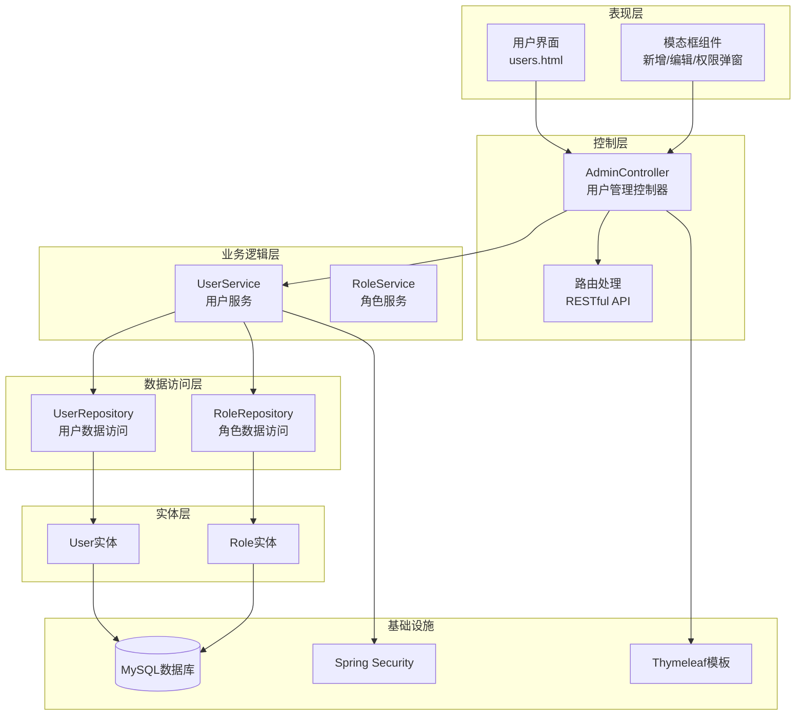

**图表来源**
- [users.html:1-753](file://src/main/resources/templates/admin/users.html#L1-L753)
- [AdminController.java:1-282](file://src/main/java/com/example/authserver/controller/AdminController.java#L1-L282)
- [UserService.java:1-265](file://src/main/java/com/example/authserver/service/UserService.java#L1-L265)

**章节来源**
- [users.html:1-753](file://src/main/resources/templates/admin/users.html#L1-L753)
- [application.yml:1-30](file://src/main/resources/application.yml#L1-L30)

## 核心组件

### 用户实体模型

系统采用JPA注解定义用户实体，支持完整的用户信息管理：

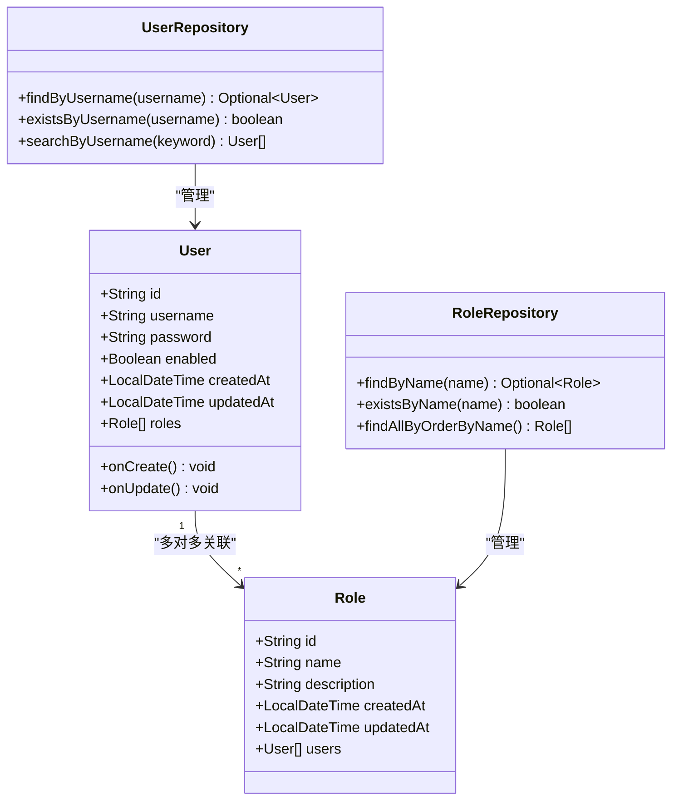

**图表来源**
- [User.java:1-66](file://src/main/java/com/example/authserver/entity/User.java#L1-L66)
- [Role.java:1-62](file://src/main/java/com/example/authserver/entity/Role.java#L1-L62)
- [UserRepository.java:1-44](file://src/main/java/com/example/authserver/repository/UserRepository.java#L1-L44)
- [RoleRepository.java:1-45](file://src/main/java/com/example/authserver/repository/RoleRepository.java#L1-L45)

### 控制器架构

AdminController作为用户管理的核心控制器，提供了完整的CRUD操作和权限管理功能：

| 功能类别 | 控制器方法 | HTTP方法 | 描述 |
|---------|-----------|---------|------|
| 用户列表 | `/admin/users` | GET | 主要用户管理页面，支持分页和搜索 |
| 用户搜索 | `/admin/users/search` | GET | 按用户名搜索用户 |
| 用户创建 | `/admin/users/add` | POST | 新增用户，支持角色分配 |
| 用户更新 | `/admin/users/update` | POST | 更新用户信息和状态 |
| 用户删除 | `/admin/users/delete` | POST | 删除用户账户 |
| 权限更新 | `/admin/users/authorities` | POST | 更新用户角色权限 |
| 用户检查 | `/admin/users/check-username` | GET | AJAX用户名存在性检查 |

**章节来源**
- [AdminController.java:44-117](file://src/main/java/com/example/authserver/controller/AdminController.java#L44-L117)
- [AdminController.java:134-225](file://src/main/java/com/example/authserver/controller/AdminController.java#L134-L225)
- [AdminController.java:230-269](file://src/main/java/com/example/authserver/controller/AdminController.java#L230-L269)

## 架构概览

用户管理系统的整体架构采用了经典的MVC模式，结合Spring Security实现了完整的身份认证和授权机制：

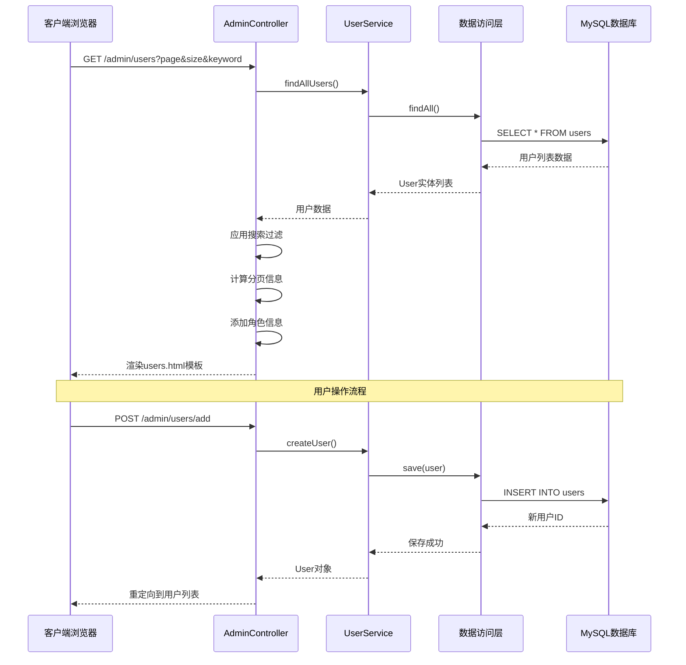

**图表来源**
- [AdminController.java:44-117](file://src/main/java/com/example/authserver/controller/AdminController.java#L44-L117)
- [UserService.java:58-104](file://src/main/java/com/example/authserver/service/UserService.java#L58-L104)
- [UserRepository.java:16-44](file://src/main/java/com/example/authserver/repository/UserRepository.java#L16-L44)

## 详细组件分析

### 用户列表页面实现

用户列表页面是整个用户管理系统的核心界面，提供了丰富的交互功能和数据展示能力。

#### 表格展示功能

页面使用Bootstrap表格组件展示用户信息，包含以下列内容：

| 列名 | 内容 | 功能 |
|------|------|------|
| 用户信息 | 用户头像、用户名、用户ID | 基本用户识别信息 |
| 角色权限 | 角色标签（ROLE_USER/ROLE_ADMIN） | 权限状态可视化 |
| 账户状态 | 正常/禁用状态图标 | 账户启用状态 |
| 创建时间 | 格式化的日期时间 | 账户创建时间追踪 |
| 操作 | 编辑、权限修改、删除下拉菜单 | 用户管理操作入口 |

#### 分页机制实现

系统实现了完整的分页功能，支持动态分页参数：

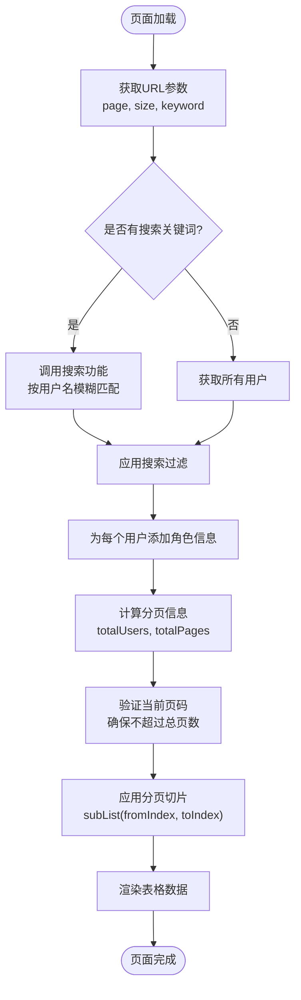

**图表来源**
- [AdminController.java:48-116](file://src/main/java/com/example/authserver/controller/AdminController.java#L48-L116)

#### 搜索过滤功能

搜索功能支持按用户名进行模糊匹配，提供实时的用户体验：

| 搜索条件 | 处理逻辑 | 性能影响 |
|----------|----------|----------|
| 空关键词 | 返回所有用户 | 全表扫描 |
| 非空关键词 | 应用用户名包含过滤 | 内存过滤 |
| 大小写处理 | 转换为小写进行比较 | O(n)遍历 |
| 特殊字符处理 | 使用trim()去除空白 | 字符串预处理 |

**章节来源**
- [AdminController.java:54-65](file://src/main/java/com/example/authserver/controller/AdminController.java#L54-L65)
- [UserController.java:39-42](file://src/main/java/com/example/authserver/controller/UserController.java#L39-L42)

### 用户操作功能实现

#### 新增用户功能

新增用户功能提供了完整的表单验证和错误处理机制：

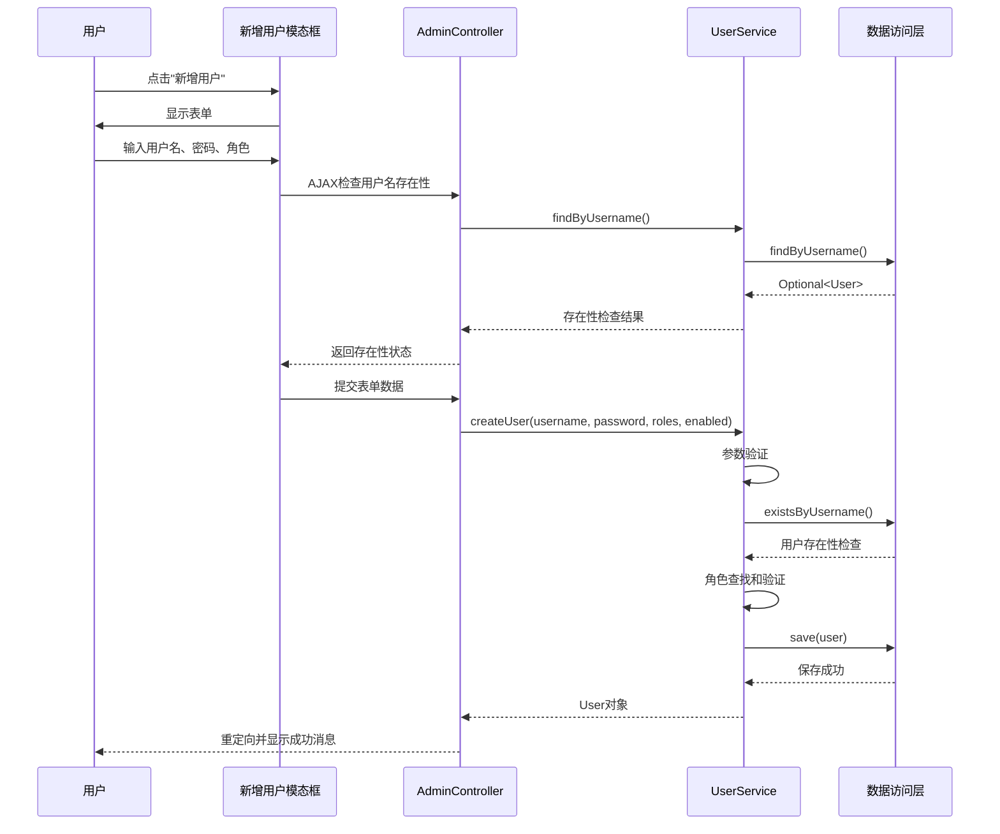

**图表来源**
- [AdminController.java:134-167](file://src/main/java/com/example/authserver/controller/AdminController.java#L134-L167)
- [UserService.java:58-104](file://src/main/java/com/example/authserver/service/UserService.java#L58-L104)

#### 编辑用户信息功能

编辑用户功能支持密码更新和账户状态切换：

| 字段 | 验证规则 | 处理逻辑 |
|------|----------|----------|
| 用户名 | 只读不可修改 | 直接使用原值 |
| 新密码 | 长度≥6字符 | 进行密码加密 |
| 启用状态 | 布尔值 | 更新enabled字段 |
| 角色权限 | 多选框 | 重新分配角色集合 |

#### 删除用户功能

删除用户功能包含了安全检查和级联删除机制：

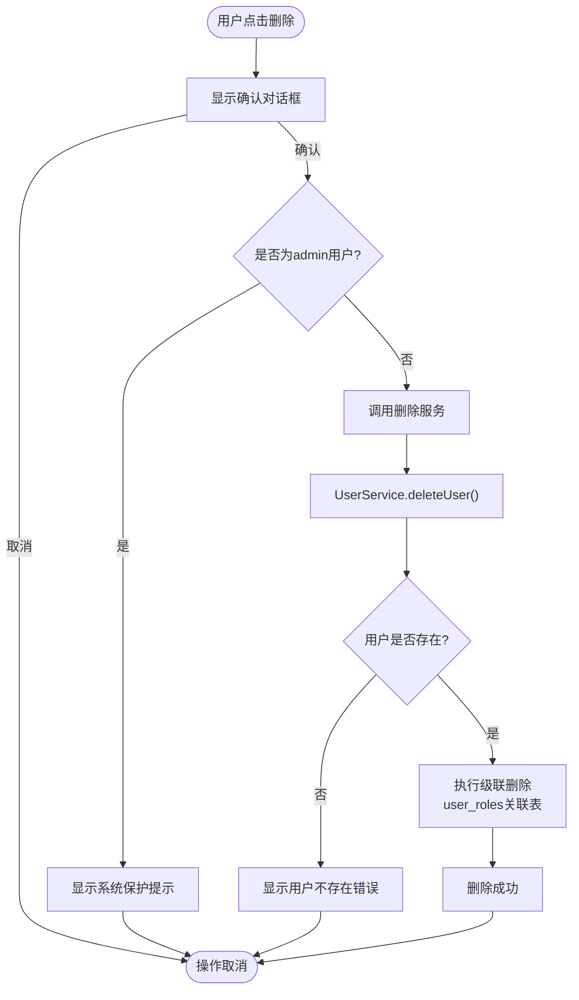

**图表来源**
- [AdminController.java:202-225](file://src/main/java/com/example/authserver/controller/AdminController.java#L202-L225)
- [UserService.java:134-144](file://src/main/java/com/example/authserver/service/UserService.java#L134-L144)

### 权限分配机制

系统实现了基于角色的权限管理（RBAC），支持动态角色分配和权限验证。

#### 角色实体设计

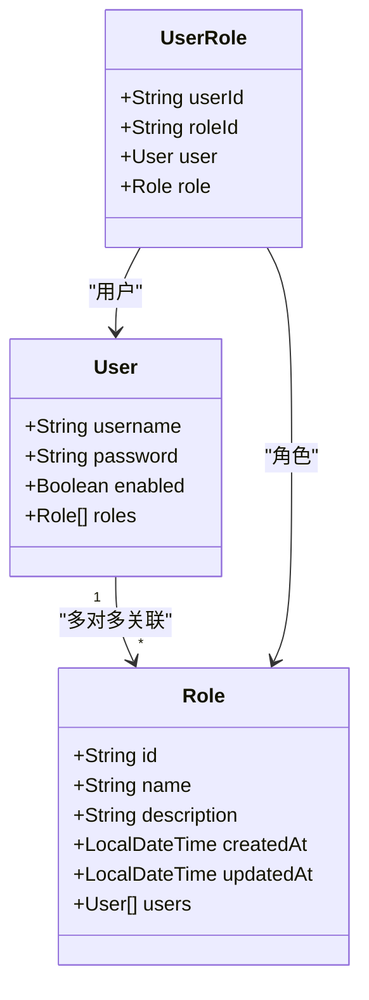

**图表来源**
- [Role.java:1-62](file://src/main/java/com/example/authserver/entity/Role.java#L1-L62)
- [User.java:48-50](file://src/main/java/com/example/authserver/entity/User.java#L48-L50)

#### 权限更新流程

权限更新功能提供了灵活的角色分配机制：

1. **参数验证**：确保至少选择一个角色
2. **角色查找**：从数据库中检索对应角色
3. **权限检查**：验证角色存在性和有效性
4. **角色更新**：重新设置用户的角色集合
5. **持久化保存**：通过JPA级联删除和重新建立关联

**章节来源**
- [AdminController.java:230-269](file://src/main/java/com/example/authserver/controller/AdminController.java#L230-L269)
- [UserService.java:149-176](file://src/main/java/com/example/authserver/service/UserService.java#L149-L176)

### 表单验证和错误处理

系统实现了多层次的验证机制，确保数据的完整性和安全性。

#### 前端验证机制

前端使用JavaScript实现了实时表单验证：

| 验证类型 | 规则 | 用户体验 |
|----------|------|----------|
| 用户名验证 | 长度3-50字符，非空 | 实时反馈 |
| 密码验证 | 长度≥6字符，非空 | 即时错误提示 |
| 角色验证 | 至少选择一个角色 | 防止空权限 |
| AJAX检查 | 异步用户名存在性检查 | 避免重复提交 |

#### 后端验证机制

后端使用Spring Validation进行严格的数据校验：

| 验证规则 | 处理逻辑 | 错误类型 |
|----------|----------|----------|
| 用户名非空 | StringUtils.hasText() | IllegalArgumentException |
| 密码长度 | ≥6字符 | IllegalArgumentException |
| 用户存在性 | existsByUsername() | ResourceConflictException |
| 角色存在性 | findByName() | ResourceNotFoundException |

#### 错误处理策略

系统使用全局异常处理器统一处理各种异常情况：

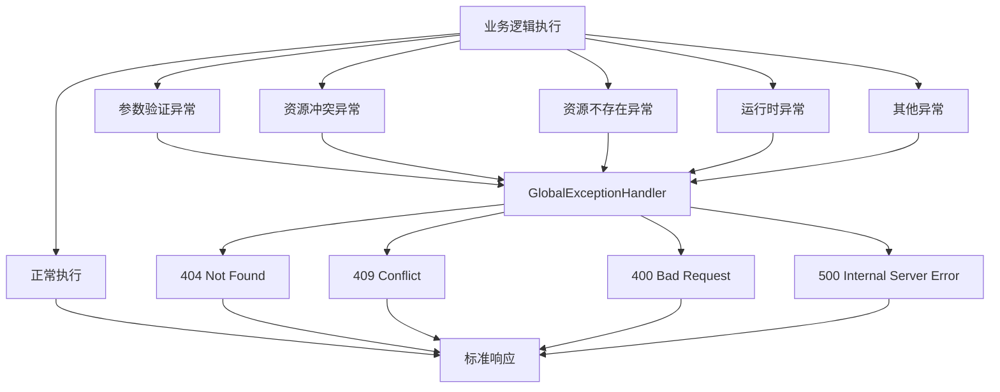

**图表来源**
- [GlobalExceptionHandler.java:28-117](file://src/main/java/com/example/authserver/exception/GlobalExceptionHandler.java#L28-L117)

**章节来源**
- [users.html:613-676](file://src/main/resources/templates/admin/users.html#L613-L676)
- [GlobalExceptionHandler.java:1-130](file://src/main/java/com/example/authserver/exception/GlobalExceptionHandler.java#L1-L130)

## 依赖关系分析

用户管理模块的依赖关系体现了清晰的分层架构设计：

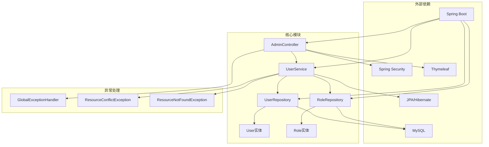

**图表来源**
- [AdminController.java:1-282](file://src/main/java/com/example/authserver/controller/AdminController.java#L1-L282)
- [UserService.java:1-265](file://src/main/java/com/example/authserver/service/UserService.java#L1-L265)
- [UserRepository.java:1-44](file://src/main/java/com/example/authserver/repository/UserRepository.java#L1-L44)
- [RoleRepository.java:1-45](file://src/main/java/com/example/authserver/repository/RoleRepository.java#L1-L45)

### 数据模型关系

用户和角色之间的多对多关系通过中间表实现：

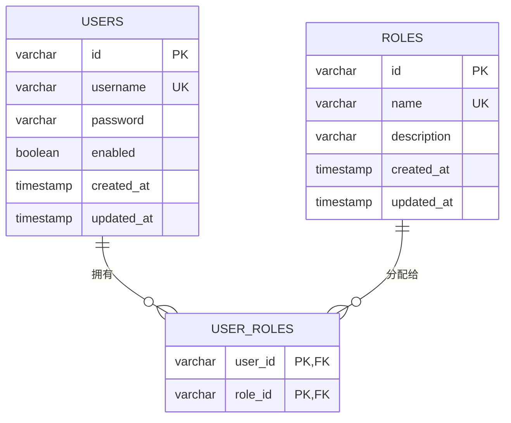

**图表来源**
- [schema.sql:8-40](file://src/main/resources/schema.sql#L8-L40)

**章节来源**
- [schema.sql:148-152](file://src/main/resources/schema.sql#L148-L152)
- [User.java:48-50](file://src/main/java/com/example/authserver/entity/User.java#L48-L50)
- [Role.java:45-46](file://src/main/java/com/example/authserver/entity/Role.java#L45-L46)

## 性能考虑

### 查询优化策略

系统在用户管理场景中采用了多种性能优化策略：

1. **懒加载配置**：角色关联使用FetchType.LAZY，避免不必要的N+1查询问题
2. **索引优化**：用户名和角色名建立唯一索引，提高查询效率
3. **分页查询**：使用JPA分页接口，避免一次性加载大量数据
4. **缓存策略**：开发环境关闭Thymeleaf缓存，生产环境开启缓存

### 内存使用优化

- **流式处理**：搜索功能使用Stream API进行内存友好的过滤
- **分页切片**：只加载当前页的数据，避免全量数据加载
- **对象池化**：合理使用StringBuilder减少字符串拼接开销

### 数据库性能

- **外键约束**：使用CASCADE删除确保数据一致性
- **事务管理**：使用@Transactional注解确保操作原子性
- **批量操作**：支持批量角色分配和更新

## 故障排除指南

### 常见问题及解决方案

| 问题类型 | 症状 | 可能原因 | 解决方案 |
|----------|------|----------|----------|
| 用户名重复 | 创建失败，显示用户名已存在 | 数据库唯一约束冲突 | 检查用户名唯一性，使用AJAX预检查 |
| 密码长度不足 | 参数验证失败 | 密码长度小于6位 | 调整密码长度要求 |
| 角色不存在 | 更新权限失败 | 角色名称拼写错误 | 检查角色表数据完整性 |
| 用户不存在 | 删除或更新失败 | 用户名拼写错误 | 验证用户存在性 |
| 权限不足 | 访问被拒绝 | 角色权限不够 | 检查用户角色配置 |

### 日志监控

系统提供了详细的日志记录机制：

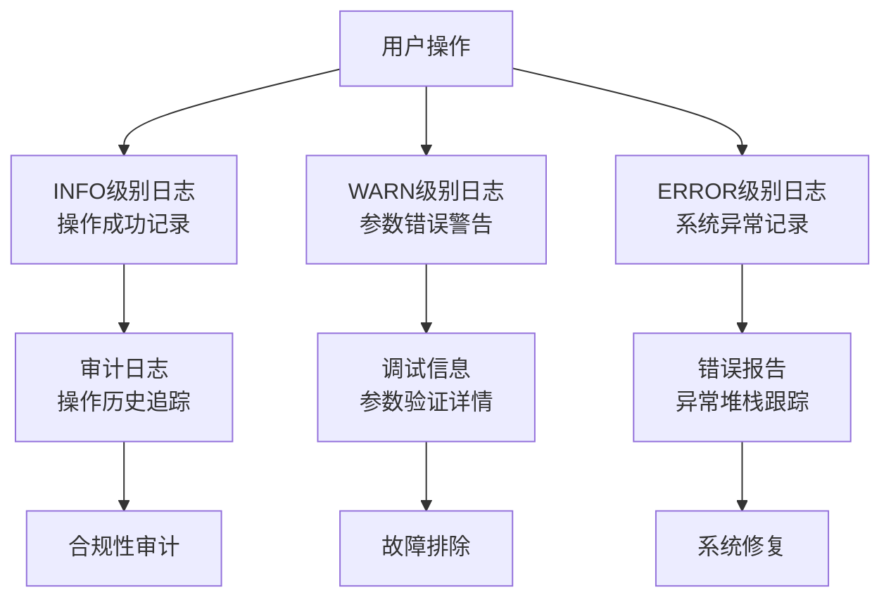

**图表来源**
- [AdminController.java:142-166](file://src/main/java/com/example/authserver/controller/AdminController.java#L142-L166)
- [UserService.java:74-77](file://src/main/java/com/example/authserver/service/UserService.java#L74-L77)

**章节来源**
- [GlobalExceptionHandler.java:28-117](file://src/main/java/com/example/authserver/exception/GlobalExceptionHandler.java#L28-L117)

## 最佳实践

### 用户管理最佳实践

#### 数据导入导出

虽然当前版本未实现批量导入导出功能，但建议的实现方案：

1. **CSV导入**：
   - 支持批量用户创建，自动分配默认角色
   - 提供数据格式验证和错误报告
   - 支持增量导入和覆盖导入模式

2. **Excel导出**：
   - 导出用户列表、角色分配、状态信息
   - 支持筛选和排序导出
   - 提供模板下载和导入示例

#### 审计日志记录

建议实现完整的审计日志功能：

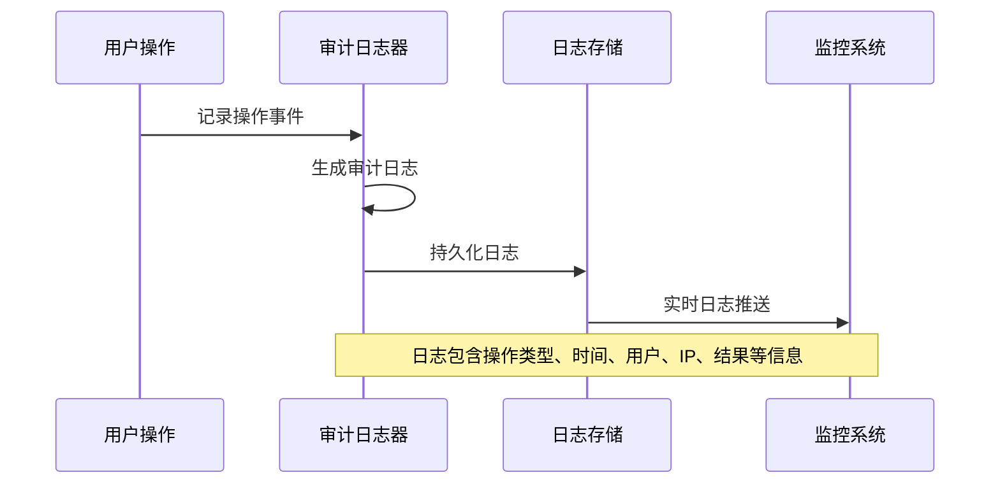

#### 批量操作功能

建议实现的批量操作功能：

1. **批量删除**：支持多选用户批量删除
2. **批量状态变更**：支持批量启用/禁用用户
3. **批量角色分配**：支持批量角色权限更新
4. **操作确认**：提供批量操作确认对话框

#### 安全加固措施

1. **CSRF防护**：已在表单中集成CSRF Token
2. **XSS防护**：使用Thymeleaf模板引擎自动转义
3. **SQL注入防护**：使用JPA查询和参数绑定
4. **权限控制**：基于角色的细粒度权限控制

#### 性能优化建议

1. **数据库索引**：为常用查询字段建立索引
2. **查询优化**：使用JOIN查询减少查询次数
3. **缓存策略**：缓存常用配置和角色信息
4. **分页优化**：使用游标分页处理大数据集

## 结论

用户管理页面是一个功能完整、架构清晰的用户管理系统。系统采用了现代的Spring Boot技术栈，实现了完整的用户生命周期管理功能。通过合理的分层设计、严格的验证机制和完善的异常处理，确保了系统的稳定性和可靠性。

主要优势包括：
- **完整的功能覆盖**：从基础的CRUD操作到高级的权限管理
- **良好的用户体验**：响应式的界面设计和流畅的操作流程
- **强大的扩展性**：清晰的架构设计便于功能扩展和维护
- **严格的安全保障**：多层次的安全机制确保系统安全

未来可以考虑的功能增强包括：批量操作、数据导入导出、审计日志、报表统计等高级功能，以进一步提升系统的实用性和管理效率。