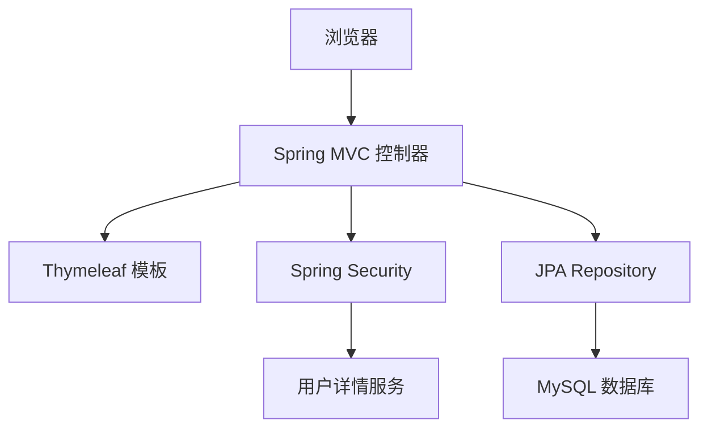
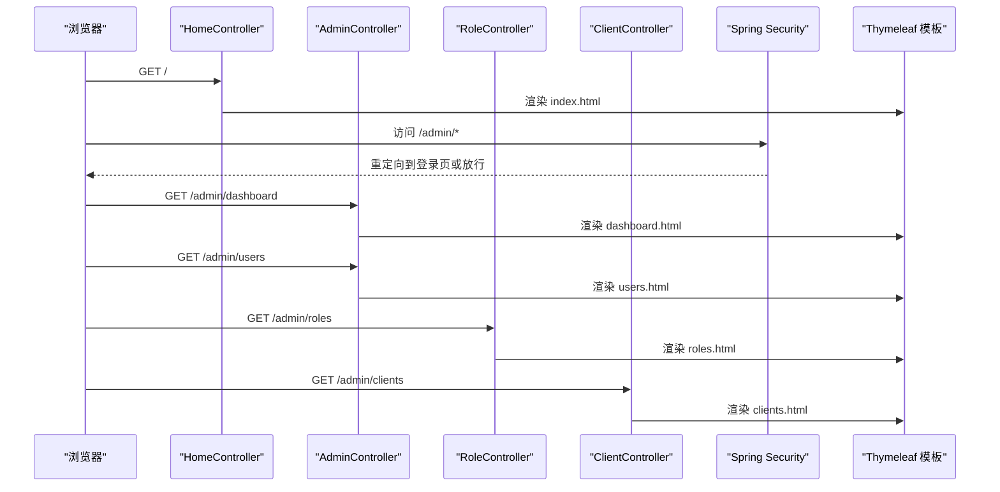
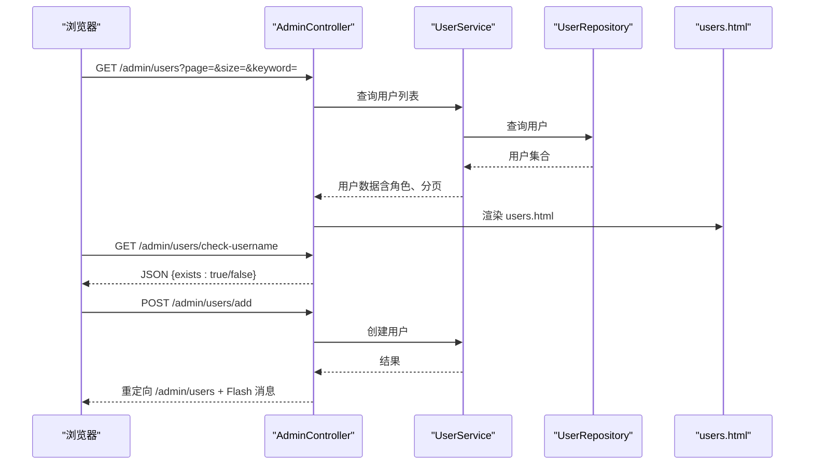
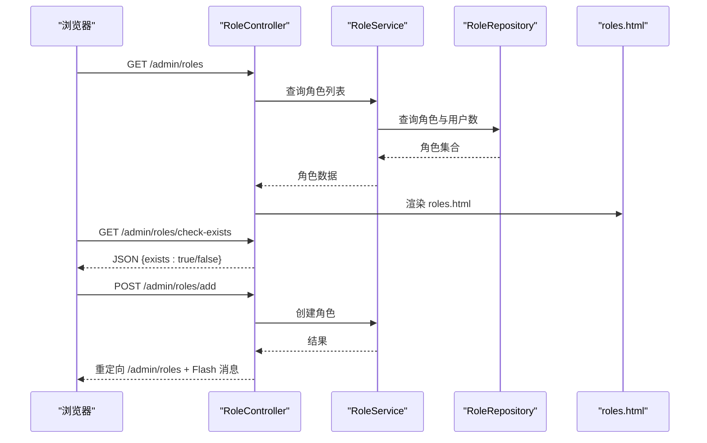
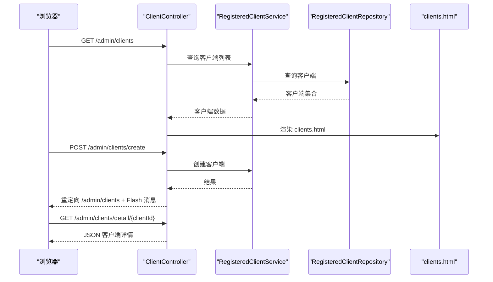
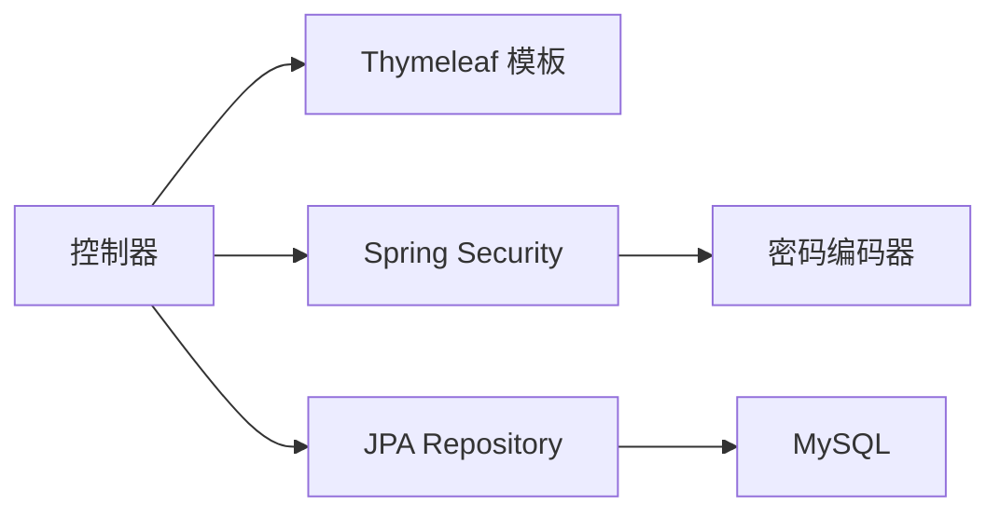

# 管理界面设计

<cite>
**本文引用的文件**
- [AuthServerApplication.java](file://src/main/java/com/example/authserver/AuthServerApplication.java)
- [HomeController.java](file://src/main/java/com/example/authserver/controller/HomeController.java)
- [AdminController.java](file://src/main/java/com/example/authserver/controller/AdminController.java)
- [RoleController.java](file://src/main/java/com/example/authserver/controller/RoleController.java)
- [ClientController.java](file://src/main/java/com/example/authserver/controller/ClientController.java)
- [DefaultSecurityConfig.java](file://src/main/java/com/example/authserver/config/DefaultSecurityConfig.java)
- [application.yml](file://src/main/resources/application.yml)
- [index.html](file://src/main/resources/templates/index.html)
- [dashboard.html](file://src/main/resources/templates/admin/dashboard.html)
- [users.html](file://src/main/resources/templates/admin/users.html)
- [roles.html](file://src/main/resources/templates/admin/roles.html)
- [clients.html](file://src/main/resources/templates/admin/clients.html)
- [role-detail.html](file://src/main/resources/templates/admin/role-detail.html)
</cite>

## 目录
1. [简介](#简介)
2. [项目结构](#项目结构)
3. [核心组件](#核心组件)
4. [架构总览](#架构总览)
5. [详细组件分析](#详细组件分析)
6. [依赖分析](#依赖分析)
7. [性能考虑](#性能考虑)
8. [故障排查指南](#故障排查指南)
9. [结论](#结论)
10. [附录](#附录)

## 简介
本项目是一个基于 Spring Boot 的认证服务器管理界面，采用 Thymeleaf 模板引擎渲染管理后台页面，结合 Spring Security 实现权限控制与登录流程。管理界面包含仪表盘、用户管理、角色管理、客户端管理等页面，提供完整的后台管理能力。本文档将深入解析模板结构、页面渲染机制、前后端数据交互、权限控制与布局设计，并给出扩展与定制的最佳实践。

## 项目结构
项目采用典型的分层架构：
- 控制器层：负责处理 HTTP 请求与转发至模板
- 服务层：封装业务逻辑与数据访问
- 数据层：基于 JPA 与 MySQL
- 视图层：Thymeleaf 模板，统一布局与样式
- 安全配置：基于 Spring Security 的认证与授权

图表来源
- [DefaultSecurityConfig.java:55-73](file://src/main/java/com/example/authserver/config/DefaultSecurityConfig.java#L55-L73)
- [application.yml:1-29](file://src/main/resources/application.yml#L1-L29)

章节来源
- [AuthServerApplication.java:1-14](file://src/main/java/com/example/authserver/AuthServerApplication.java#L1-L14)
- [application.yml:1-29](file://src/main/resources/application.yml#L1-L29)

## 核心组件
- 控制器
  - HomeController：首页跳转与登录后欢迎页渲染
  - AdminController：用户管理相关路由（列表、新增、更新、删除、权限变更、AJAX 校验）
  - RoleController：角色管理与角色详情（含 URL 权限规则）
  - ClientController：OAuth2 客户端管理（创建、更新、删除、详情）
- 安全配置：默认安全过滤链、认证提供者、密码编码器
- 模板：统一侧边栏与顶部导航，Bootstrap + Font Awesome 样式

章节来源
- [HomeController.java:1-24](file://src/main/java/com/example/authserver/controller/HomeController.java#L1-L24)
- [AdminController.java:1-282](file://src/main/java/com/example/authserver/controller/AdminController.java#L1-L282)
- [RoleController.java:1-339](file://src/main/java/com/example/authserver/controller/RoleController.java#L1-L339)
- [ClientController.java:1-360](file://src/main/java/com/example/authserver/controller/ClientController.java#L1-L360)
- [DefaultSecurityConfig.java:1-75](file://src/main/java/com/example/authserver/config/DefaultSecurityConfig.java#L1-L75)

## 架构总览
管理界面的整体交互流程如下：
- 用户访问登录页，完成认证后进入首页
- 首页根据权限显示“进入控制台”入口
- 管理员点击进入后台，各控制器处理请求并渲染对应模板
- 模板通过 Thymeleaf 绑定模型数据，实现页面渲染
- Spring Security 在过滤链层面控制访问权限

图表来源
- [HomeController.java:15-21](file://src/main/java/com/example/authserver/controller/HomeController.java#L15-L21)
- [AdminController.java:33-39](file://src/main/java/com/example/authserver/controller/AdminController.java#L33-L39)
- [RoleController.java:34-62](file://src/main/java/com/example/authserver/controller/RoleController.java#L34-L62)
- [ClientController.java:33-67](file://src/main/java/com/example/authserver/controller/ClientController.java#L33-L67)
- [DefaultSecurityConfig.java:55-73](file://src/main/java/com/example/authserver/config/DefaultSecurityConfig.java#L55-L73)

## 详细组件分析

### 仪表盘页面（dashboard.html）
- 功能概述
  - 展示系统概览统计卡片（用户总数、已连接应用、今日认证次数、异常告警）
  - 最近认证记录表格
  - 服务状态信息（Spring Boot 版本、JVM 内存、数据库连接）
- 模板结构
  - 统一侧边栏与顶部导航，面包屑导航
  - Bootstrap 卡片与表格组件
  - Thymeleaf 变量绑定与条件渲染
- 权限控制
  - 顶部导航包含 Spring Security 权限表达式，仅 ADMIN 可见管理入口
- 响应式设计
  - 使用 Bootstrap 响应式网格与断点适配移动端

章节来源
- [dashboard.html:1-339](file://src/main/resources/templates/admin/dashboard.html#L1-L339)

### 用户管理页面（users.html）
- 功能概述
  - 用户列表展示（用户名、角色、状态、创建时间）
  - 支持关键词搜索与分页
  - 新增用户（AJAX 校验用户名是否存在）
  - 编辑用户（修改密码、启用状态）
  - 修改权限（勾选角色）
  - 删除用户（系统保护用户不可删除）
- 模板与数据绑定
  - Thymeleaf 循环渲染用户列表
  - 分页信息与页码渲染
  - Flash 消息提示（成功/错误）
- 前后端交互
  - 新增用户：表单提交 + AJAX 校验用户名
  - 更新/删除/权限变更：表单提交 + RedirectAttributes 传递消息
- 安全与权限
  - 顶部导航使用 Spring Security 权限表达式控制可见性
  - CSRF Token 注入到表单隐藏字段

图表来源
- [AdminController.java:44-117](file://src/main/java/com/example/authserver/controller/AdminController.java#L44-L117)
- [AdminController.java:122-129](file://src/main/java/com/example/authserver/controller/AdminController.java#L122-L129)
- [AdminController.java:134-167](file://src/main/java/com/example/authserver/controller/AdminController.java#L134-L167)

章节来源
- [users.html:1-753](file://src/main/resources/templates/admin/users.html#L1-L753)
- [AdminController.java:1-282](file://src/main/java/com/example/authserver/controller/AdminController.java#L1-L282)

### 角色管理页面（roles.html 与 role-detail.html）
- 功能概述
  - 角色列表展示（角色名、关联用户数、描述、创建时间）
  - 新建角色（AJAX 校验角色名是否存在）
  - 删除角色（内置角色保护）
  - 角色详情页：权限分配（含 URL 权限规则）、拥有该角色的用户列表
- 模板与数据绑定
  - Thymeleaf 循环渲染角色与用户
  - 权限分配使用复选框组
  - Flash 消息提示
- 前后端交互
  - 新建角色：表单提交 + AJAX 校验
  - 删除角色：表单提交 + 权限保护
  - 角色详情：分配/移除 URL 权限规则

图表来源
- [RoleController.java:34-62](file://src/main/java/com/example/authserver/controller/RoleController.java#L34-L62)
- [RoleController.java:67-77](file://src/main/java/com/example/authserver/controller/RoleController.java#L67-L77)
- [RoleController.java:82-118](file://src/main/java/com/example/authserver/controller/RoleController.java#L82-L118)

章节来源
- [roles.html:1-452](file://src/main/resources/templates/admin/roles.html#L1-L452)
- [role-detail.html:1-276](file://src/main/resources/templates/admin/role-detail.html#L1-L276)
- [RoleController.java:1-339](file://src/main/java/com/example/authserver/controller/RoleController.java#L1-L339)

### 客户端管理页面（clients.html）
- 功能概述
  - OAuth2 客户端列表展示（客户端名称、认证方式、授权模式、重定向 URI、权限范围）
  - 新建客户端（表单校验、生成客户端密钥、Token 有效期、PKCE、同意确认等高级设置）
  - 编辑客户端（展示密钥、更新配置）
  - 删除客户端
- 模板与数据绑定
  - Thymeleaf 渲染客户端信息与多选授权模式、权限范围
  - 高级设置卡片与开关联动
- 前后端交互
  - 创建/更新客户端：表单提交 + 后端验证（名称、授权模式、URI、权限范围）
  - 详情接口：返回 JSON 数据供前端编辑弹窗使用

图表来源
- [ClientController.java:33-67](file://src/main/java/com/example/authserver/controller/ClientController.java#L33-L67)
- [ClientController.java:93-186](file://src/main/java/com/example/authserver/controller/ClientController.java#L93-L186)
- [ClientController.java:217-250](file://src/main/java/com/example/authserver/controller/ClientController.java#L217-L250)

章节来源
- [clients.html:1-800](file://src/main/resources/templates/admin/clients.html#L1-L800)
- [ClientController.java:1-360](file://src/main/java/com/example/authserver/controller/ClientController.java#L1-L360)

### 首页与登录后引导（index.html）
- 功能概述
  - 登录成功后显示欢迎信息与管理员入口
  - 提供开发者文档与开发者中心链接
  - 顶部显示当前登录用户与退出按钮
- 模板与数据绑定
  - Thymeleaf 绑定 Principal 用户名
  - Spring Security 权限表达式控制管理员入口可见性

章节来源
- [index.html:1-243](file://src/main/resources/templates/index.html#L1-L243)
- [HomeController.java:15-21](file://src/main/java/com/example/authserver/controller/HomeController.java#L15-L21)

## 依赖分析
- 模板引擎与视图
  - Thymeleaf：模板解析、变量绑定、条件渲染、片段与布局
  - Bootstrap + Font Awesome：UI 组件与图标
- 安全框架
  - Spring Security：认证提供者、密码编码器、默认过滤链
- 数据持久化
  - JPA/Hibernate：实体映射与查询
  - MySQL：数据存储

图表来源
- [DefaultSecurityConfig.java:34-49](file://src/main/java/com/example/authserver/config/DefaultSecurityConfig.java#L34-L49)
- [application.yml:17-24](file://src/main/resources/application.yml#L17-L24)

章节来源
- [DefaultSecurityConfig.java:1-75](file://src/main/java/com/example/authserver/config/DefaultSecurityConfig.java#L1-L75)
- [application.yml:1-29](file://src/main/resources/application.yml#L1-L29)

## 性能考虑
- 模板缓存
  - 开发环境建议关闭缓存以提升迭代效率；生产环境建议开启缓存以减少模板解析开销
- 分页与查询
  - 用户列表与客户端列表均实现分页，避免一次性加载大量数据
- 前端交互
  - 新增用户与新建角色支持 AJAX 校验，减少无效提交与页面刷新
- 静态资源
  - 使用 CDN 加速加载 Bootstrap 与 Font Awesome，提升首屏渲染速度

## 故障排查指南
- 登录后无法访问管理页面
  - 检查 Spring Security 默认过滤链是否放行 /admin/* 或是否被重定向到登录页
  - 确认用户角色是否包含 ADMIN
- 用户名重复或角色重复
  - 新增用户与新建角色均提供 AJAX 校验，若校验失败请检查后端异常日志
- 客户端创建失败
  - 检查客户端名称、授权模式、重定向 URI、权限范围是否满足后端验证规则
- CSRF 问题
  - 确认模板中已注入 CSRF Token 并在表单中提交

章节来源
- [DefaultSecurityConfig.java:55-73](file://src/main/java/com/example/authserver/config/DefaultSecurityConfig.java#L55-L73)
- [AdminController.java:122-129](file://src/main/java/com/example/authserver/controller/AdminController.java#L122-L129)
- [RoleController.java:67-77](file://src/main/java/com/example/authserver/controller/RoleController.java#L67-L77)
- [ClientController.java:273-296](file://src/main/java/com/example/authserver/controller/ClientController.java#L273-L296)

## 结论
本项目通过 Thymeleaf 模板引擎实现了统一的管理界面，配合 Spring Security 提供了完善的权限控制与登录流程。用户管理、角色管理、客户端管理三大模块覆盖了认证服务器的核心管理需求，模板结构清晰、数据绑定直观、前后端交互高效。建议在生产环境中开启模板缓存、优化数据库索引，并持续完善权限模型与审计日志。

## 附录

### 界面布局与样式定制
- 布局结构
  - 侧边栏固定宽度，顶部导航包含面包屑与用户信息
  - 内容区域采用卡片式布局，Bootstrap 网格系统适配不同屏幕尺寸
- 样式定制
  - 使用 CSS 变量统一主题色与间距
  - 响应式断点适配移动端显示
- 图标与组件
  - Font Awesome 图标增强可读性
  - Bootstrap 卡片、表格、分页、模态框等组件提升交互体验

章节来源
- [dashboard.html:14-143](file://src/main/resources/templates/admin/dashboard.html#L14-L143)
- [users.html:14-152](file://src/main/resources/templates/admin/users.html#L14-L152)
- [roles.html:18-124](file://src/main/resources/templates/admin/roles.html#L18-L124)
- [clients.html:12-179](file://src/main/resources/templates/admin/clients.html#L12-L179)

### 与 Spring Security 的集成
- 认证与授权
  - 默认过滤链放行静态资源与公开端点，其余请求需认证
  - 使用权限表达式控制导航入口可见性
- 密码编码
  - DelegatingPasswordEncoder 提供灵活的密码编码策略
- CSRF 保护
  - 模板中注入 CSRF Token，确保表单提交安全

章节来源
- [DefaultSecurityConfig.java:55-73](file://src/main/java/com/example/authserver/config/DefaultSecurityConfig.java#L55-L73)
- [DefaultSecurityConfig.java:34-49](file://src/main/java/com/example/authserver/config/DefaultSecurityConfig.java#L34-L49)
- [users.html:382-383](file://src/main/resources/templates/admin/users.html#L382-L383)
- [roles.html:7-9](file://src/main/resources/templates/admin/roles.html#L7-L9)

### 扩展与定制最佳实践
- 新增管理功能页面
  - 新建控制器与模板，遵循统一布局与命名规范
  - 在侧边栏与顶部导航中添加入口链接
  - 使用 RedirectAttributes 传递 Flash 消息，提升用户体验
- 数据模型扩展
  - 在实体类中增加字段，并在 Service 层处理业务逻辑
  - 在模板中使用 Thymeleaf 表达式渲染新增字段
- 权限控制
  - 在控制器中使用权限表达式或自定义拦截器
  - 对敏感操作（删除、修改）增加二次确认与日志记录