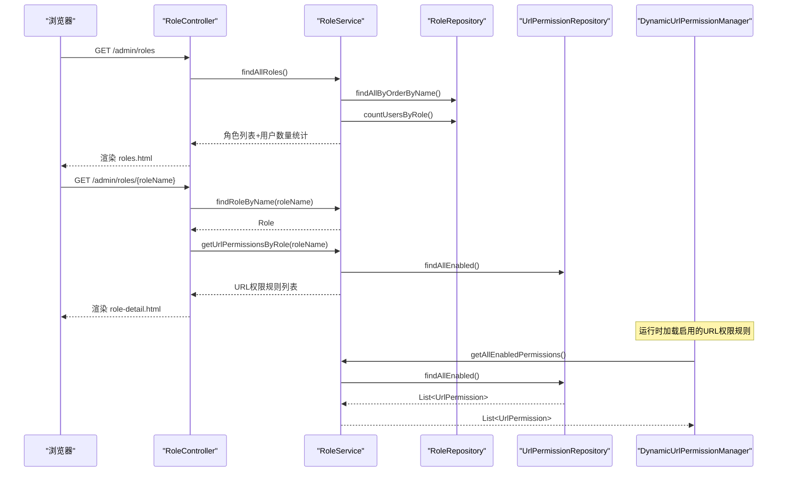
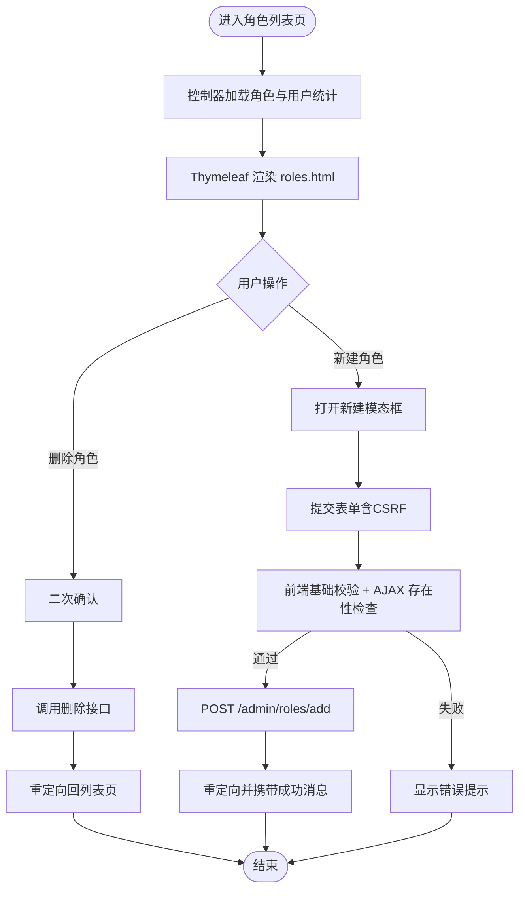
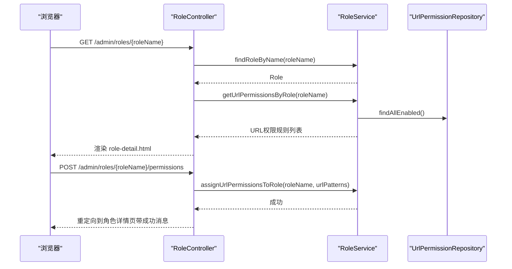
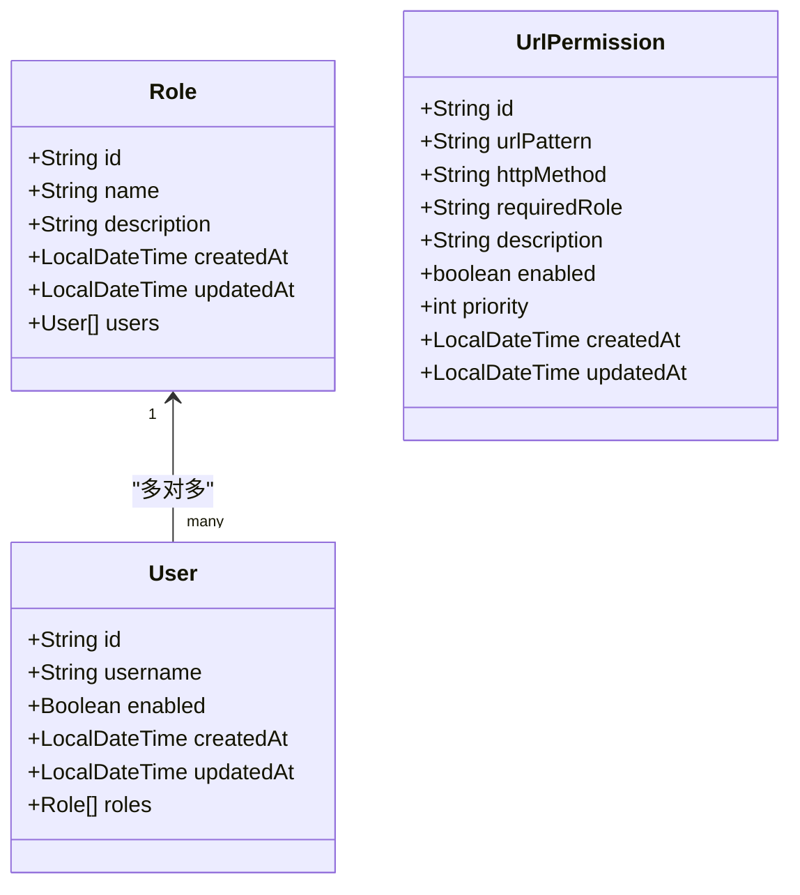
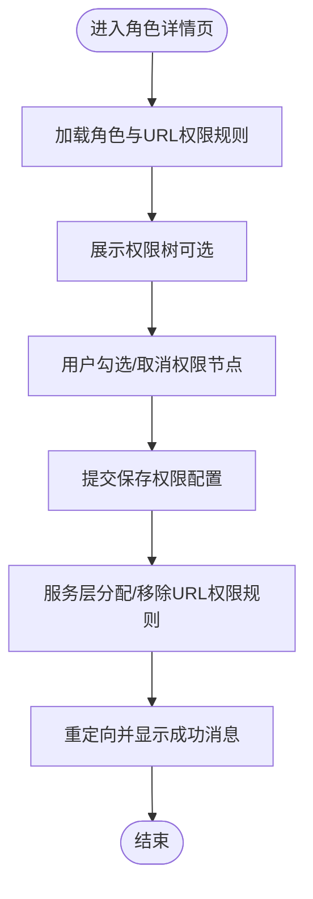

# 角色管理页面

<cite>
**本文引用的文件**
- [RoleController.java](file://src/main/java/com/example/authserver/controller/RoleController.java)
- [RoleService.java](file://src/main/java/com/example/authserver/service/RoleService.java)
- [RoleRepository.java](file://src/main/java/com/example/authserver/repository/RoleRepository.java)
- [Role.java](file://src/main/java/com/example/authserver/entity/Role.java)
- [User.java](file://src/main/java/com/example/authserver/entity/User.java)
- [UrlPermission.java](file://src/main/java/com/example/authserver/entity/UrlPermission.java)
- [DynamicUrlPermissionManager.java](file://src/main/java/com/example/authserver/config/DynamicUrlPermissionManager.java)
- [UrlPermissionService.java](file://src/main/java/com/example/authserver/service/UrlPermissionService.java)
- [UrlPermissionRepository.java](file://src/main/java/com/example/authserver/repository/UrlPermissionRepository.java)
- [roles.html](file://src/main/resources/templates/admin/roles.html)
- [role-detail.html](file://src/main/resources/templates/admin/role-detail.html)
- [schema.sql](file://src/main/resources/schema.sql)
</cite>

## 目录
1. [简介](#简介)
2. [项目结构](#项目结构)
3. [核心组件](#核心组件)
4. [架构总览](#架构总览)
5. [详细组件分析](#详细组件分析)
6. [依赖分析](#依赖分析)
7. [性能考量](#性能考量)
8. [故障排查指南](#故障排查指南)
9. [结论](#结论)
10. [附录](#附录)

## 简介
本文件面向“角色管理页面”的完整实现与使用说明，覆盖以下主题：
- 角色列表页面：角色数据展示、权限分配入口、角色层级管理（基于 RBAC）。
- 角色详情页面：角色权限配置、用户关联管理、权限继承关系体现。
- RBAC 权限模型在前端的落地：权限按钮显示控制、操作权限的动态调整。
- 角色创建与编辑流程：权限选择界面与权限树形结构的实现思路。
- 安全考虑：权限最小化原则与权限审计机制建议。

## 项目结构
角色管理功能由三层组成：
- 控制层：负责路由、参数校验、响应渲染与重定向。
- 业务层：封装角色与 URL 权限规则的业务逻辑。
- 数据层：JPA Repository 提供持久化能力；模板引擎 Thymeleaf 渲染前端页面。

```mermaid
graph TB
subgraph "控制层"
RC["RoleController<br/>角色控制器"]
end
subgraph "业务层"
RS["RoleService<br/>角色服务"]
UPS["UrlPermissionService<br/>URL权限服务"]
end
subgraph "数据层"
RR["RoleRepository<br/>角色仓库"]
UPR["UrlPermissionRepository<br/>URL权限仓库"]
end
subgraph "实体层"
RoleE["Role<br/>角色实体"]
UserE["User<br/>用户实体"]
UrlPermE["UrlPermission<br/>URL权限规则实体"]
end
subgraph "前端模板"
RolesT["roles.html<br/>角色列表页"]
DetailT["role-detail.html<br/>角色详情页"]
end
subgraph "运行时"
DPM["DynamicUrlPermissionManager<br/>动态URL权限管理器"]
end
RC --> RS
RC --> RR
RC --> UPR
RS --> RR
RS --> UPR
UPS --> UPR
RR --> RoleE
UPR --> UrlPermE
RoleE < --> UserE
DPM --> UPS
RolesT --> RC
DetailT --> RC
```

图表来源
- [RoleController.java:24-339](file://src/main/java/com/example/authserver/controller/RoleController.java#L24-L339)
- [RoleService.java:25-235](file://src/main/java/com/example/authserver/service/RoleService.java#L25-L235)
- [RoleRepository.java:16-44](file://src/main/java/com/example/authserver/repository/RoleRepository.java#L16-L44)
- [UrlPermissionRepository.java:14-31](file://src/main/java/com/example/authserver/repository/UrlPermissionRepository.java#L14-L31)
- [Role.java:23-61](file://src/main/java/com/example/authserver/entity/Role.java#L23-L61)
- [User.java:23-65](file://src/main/java/com/example/authserver/entity/User.java#L23-L65)
- [UrlPermission.java:14-72](file://src/main/java/com/example/authserver/entity/UrlPermission.java#L14-L72)
- [DynamicUrlPermissionManager.java:23-119](file://src/main/java/com/example/authserver/config/DynamicUrlPermissionManager.java#L23-L119)
- [roles.html:1-452](file://src/main/resources/templates/admin/roles.html#L1-L452)
- [role-detail.html:1-276](file://src/main/resources/templates/admin/role-detail.html#L1-L276)

章节来源
- [RoleController.java:24-339](file://src/main/java/com/example/authserver/controller/RoleController.java#L24-L339)
- [RoleService.java:25-235](file://src/main/java/com/example/authserver/service/RoleService.java#L25-L235)
- [RoleRepository.java:16-44](file://src/main/java/com/example/authserver/repository/RoleRepository.java#L16-L44)
- [UrlPermissionRepository.java:14-31](file://src/main/java/com/example/authserver/repository/UrlPermissionRepository.java#L14-L31)
- [Role.java:23-61](file://src/main/java/com/example/authserver/entity/Role.java#L23-L61)
- [User.java:23-65](file://src/main/java/com/example/authserver/entity/User.java#L23-L65)
- [UrlPermission.java:14-72](file://src/main/java/com/example/authserver/entity/UrlPermission.java#L14-L72)
- [DynamicUrlPermissionManager.java:23-119](file://src/main/java/com/example/authserver/config/DynamicUrlPermissionManager.java#L23-L119)
- [roles.html:1-452](file://src/main/resources/templates/admin/roles.html#L1-L452)
- [role-detail.html:1-276](file://src/main/resources/templates/admin/role-detail.html#L1-L276)

## 核心组件
- 角色控制器 RoleController：提供角色列表、新增、删除、更新描述、查看详情、分配/移除 URL 权限规则等接口。
- 角色服务 RoleService：封装角色 CRUD、用户统计、URL 权限规则分配与移除、角色-用户查询等。
- 角色仓库 RoleRepository：提供角色查询、去重、按名称排序、用户数量统计等。
- URL 权限实体与仓库：UrlPermission 实体与 UrlPermissionRepository 提供 URL 权限规则的持久化与查询。
- 动态 URL 权限管理器 DynamicUrlPermissionManager：从数据库加载启用的 URL 权限规则，提供匹配逻辑与缓存。
- 前端模板 roles.html 与 role-detail.html：Thymeleaf 模板，承载角色列表与详情展示、权限配置与用户关联展示。

章节来源
- [RoleController.java:24-339](file://src/main/java/com/example/authserver/controller/RoleController.java#L24-L339)
- [RoleService.java:25-235](file://src/main/java/com/example/authserver/service/RoleService.java#L25-L235)
- [RoleRepository.java:16-44](file://src/main/java/com/example/authserver/repository/RoleRepository.java#L16-L44)
- [UrlPermissionRepository.java:14-31](file://src/main/java/com/example/authserver/repository/UrlPermissionRepository.java#L14-L31)
- [DynamicUrlPermissionManager.java:23-119](file://src/main/java/com/example/authserver/config/DynamicUrlPermissionManager.java#L23-L119)
- [roles.html:1-452](file://src/main/resources/templates/admin/roles.html#L1-L452)
- [role-detail.html:1-276](file://src/main/resources/templates/admin/role-detail.html#L1-L276)

## 架构总览
角色管理页面采用经典的 MVC 架构：
- 控制器接收请求，调用服务层进行业务处理。
- 服务层协调仓库与实体，完成数据持久化与计算。
- 前端模板通过 Thymeleaf 渲染页面，结合 CSRF 令牌与面包屑导航，提供良好的用户体验。
- 动态 URL 权限管理器在运行时加载并缓存 URL 权限规则，供权限判断使用。



图表来源
- [RoleController.java:34-225](file://src/main/java/com/example/authserver/controller/RoleController.java#L34-L225)
- [RoleService.java:34-233](file://src/main/java/com/example/authserver/service/RoleService.java#L34-L233)
- [UrlPermissionRepository.java:19-25](file://src/main/java/com/example/authserver/repository/UrlPermissionRepository.java#L19-L25)
- [DynamicUrlPermissionManager.java:45-54](file://src/main/java/com/example/authserver/config/DynamicUrlPermissionManager.java#L45-L54)

## 详细组件分析

### 角色列表页面（roles.html）
- 展示字段：角色标识（Authority）、关联用户数、描述、创建时间。
- 操作：新建角色、删除角色（内置角色不可删除）、跳转到角色详情。
- 安全：内置角色（ROLE_ADMIN、ROLE_USER）不可删除；删除前有二次确认。
- 前端交互：新建角色模态框、AJAX 检查角色是否存在、CSRF 令牌注入、成功/错误消息提示。
- 数据来源：控制器构建角色列表并传入模板，模板通过 Thymeleaf 渲染。



图表来源
- [RoleController.java:34-118](file://src/main/java/com/example/authserver/controller/RoleController.java#L34-L118)
- [roles.html:171-449](file://src/main/resources/templates/admin/roles.html#L171-L449)

章节来源
- [RoleController.java:34-118](file://src/main/java/com/example/authserver/controller/RoleController.java#L34-L118)
- [roles.html:171-449](file://src/main/resources/templates/admin/roles.html#L171-L449)

### 角色详情页面（role-detail.html）
- 角色基本信息：角色标识、描述、角色 ID、关联用户数量。
- 权限分配：展示系统权限集合，勾选后提交保存权限配置（对应控制器中的权限保存接口）。
- 用户关联：展示拥有该角色的用户列表，支持跳转到用户详情。
- 前端交互：面包屑导航、返回按钮、成功/错误消息提示。



图表来源
- [RoleController.java:183-254](file://src/main/java/com/example/authserver/controller/RoleController.java#L183-L254)
- [RoleService.java:223-233](file://src/main/java/com/example/authserver/service/RoleService.java#L223-L233)
- [UrlPermissionRepository.java:19-25](file://src/main/java/com/example/authserver/repository/UrlPermissionRepository.java#L19-L25)

章节来源
- [RoleController.java:183-254](file://src/main/java/com/example/authserver/controller/RoleController.java#L183-L254)
- [RoleService.java:223-233](file://src/main/java/com/example/authserver/service/RoleService.java#L223-L233)
- [role-detail.html:167-269](file://src/main/resources/templates/admin/role-detail.html#L167-L269)

### RBAC 权限模型在前端的体现
- 角色与权限映射：角色实体与用户实体之间通过多对多关联（user_roles 表）建立联系。
- URL 动态权限：通过 UrlPermission 实体与 DynamicUrlPermissionManager 实现运行时权限判断，支持通配符与优先级。
- 前端按钮控制：虽然当前模板未直接展示按钮级权限控制，但可通过后端在模板中根据用户角色与 URL 权限规则动态渲染按钮可见性（例如基于角色标识与 URL 模式）。



图表来源
- [Role.java:23-61](file://src/main/java/com/example/authserver/entity/Role.java#L23-L61)
- [User.java:23-65](file://src/main/java/com/example/authserver/entity/User.java#L23-L65)
- [UrlPermission.java:14-72](file://src/main/java/com/example/authserver/entity/UrlPermission.java#L14-L72)

章节来源
- [Role.java:23-61](file://src/main/java/com/example/authserver/entity/Role.java#L23-L61)
- [User.java:23-65](file://src/main/java/com/example/authserver/entity/User.java#L23-L65)
- [UrlPermission.java:14-72](file://src/main/java/com/example/authserver/entity/UrlPermission.java#L14-L72)

### 角色创建与编辑流程
- 创建流程：前端表单收集角色名与描述，控制器统一补全 ROLE_ 前缀并校验唯一性，服务层创建角色，控制器重定向并携带成功消息。
- 编辑流程：更新角色描述、分配/移除 URL 权限规则、删除角色（内置角色保护）。
- 权限树形结构：当前模板未直接展示权限树，但可通过扩展在角色详情页增加权限树选择器，服务层提供 URL 权限规则的批量分配/移除。



图表来源
- [RoleController.java:229-283](file://src/main/java/com/example/authserver/controller/RoleController.java#L229-L283)
- [RoleService.java:113-149](file://src/main/java/com/example/authserver/service/RoleService.java#L113-L149)

章节来源
- [RoleController.java:82-178](file://src/main/java/com/example/authserver/controller/RoleController.java#L82-L178)
- [RoleService.java:57-107](file://src/main/java/com/example/authserver/service/RoleService.java#L57-L107)

### 角色层级管理与权限继承
- 当前实现：角色与用户为多对多关系，URL 权限规则通过 requiredRole 字段绑定到具体角色，不直接体现“层级”。
- 建议：若需实现“角色层级”，可在服务层引入角色继承策略（如角色链路查询），并在权限判断时递归检查所需角色链上的权限。

章节来源
- [Role.java:45-46](file://src/main/java/com/example/authserver/entity/Role.java#L45-L46)
- [User.java:48-50](file://src/main/java/com/example/authserver/entity/User.java#L48-L50)

## 依赖分析
- 控制器依赖服务层与仓库层，服务层依赖仓库层与实体层。
- URL 权限规则通过仓库与实体持久化，运行时由管理器加载并缓存。
- 前端模板依赖控制器提供的数据模型。

```mermaid
graph LR
RC["RoleController"] --> RS["RoleService"]
RC --> RR["RoleRepository"]
RC --> UPR["UrlPermissionRepository"]
RS --> RR
RS --> UPR
RR --> RoleE["Role"]
UPR --> UrlPermE["UrlPermission"]
RoleE < --> UserE["User"]
DPM["DynamicUrlPermissionManager"] --> UPS["UrlPermissionService"]
UPS --> UPR
```

图表来源
- [RoleController.java:28-29](file://src/main/java/com/example/authserver/controller/RoleController.java#L28-L29)
- [RoleService.java:27-29](file://src/main/java/com/example/authserver/service/RoleService.java#L27-L29)
- [RoleRepository.java:16-44](file://src/main/java/com/example/authserver/repository/RoleRepository.java#L16-L44)
- [UrlPermissionRepository.java:14-31](file://src/main/java/com/example/authserver/repository/UrlPermissionRepository.java#L14-L31)
- [DynamicUrlPermissionManager.java:25-26](file://src/main/java/com/example/authserver/config/DynamicUrlPermissionManager.java#L25-L26)

章节来源
- [RoleController.java:28-29](file://src/main/java/com/example/authserver/controller/RoleController.java#L28-L29)
- [RoleService.java:27-29](file://src/main/java/com/example/authserver/service/RoleService.java#L27-L29)
- [RoleRepository.java:16-44](file://src/main/java/com/example/authserver/repository/RoleRepository.java#L16-L44)
- [UrlPermissionRepository.java:14-31](file://src/main/java/com/example/authserver/repository/UrlPermissionRepository.java#L14-L31)
- [DynamicUrlPermissionManager.java:25-26](file://src/main/java/com/example/authserver/config/DynamicUrlPermissionManager.java#L25-L26)

## 性能考量
- 查询优化：角色列表查询包含用户数量统计，建议在数据库层面使用聚合查询并建立索引（如角色名、用户关联表）。
- 缓存策略：动态 URL 权限管理器已内置缓存，避免频繁查询数据库；可在应用启动时预热缓存。
- 前端渲染：Thymeleaf 渲染角色列表与详情，建议对大数据量场景进行分页或懒加载。

## 故障排查指南
- 角色创建失败：检查角色名唯一性、前端基础校验与后端异常处理。
- 删除角色失败：确认角色未被用户使用、内置角色保护逻辑。
- URL 权限规则分配失败：检查角色是否存在、URL 模式合法性与优先级设置。
- 权限不生效：确认 URL 权限规则已启用且优先级正确，管理器缓存是否已刷新。

章节来源
- [RoleController.java:106-147](file://src/main/java/com/example/authserver/controller/RoleController.java#L106-L147)
- [RoleService.java:95-107](file://src/main/java/com/example/authserver/service/RoleService.java#L95-L107)
- [DynamicUrlPermissionManager.java:45-54](file://src/main/java/com/example/authserver/config/DynamicUrlPermissionManager.java#L45-L54)

## 结论
角色管理页面以 RBAC 为核心，结合动态 URL 权限规则实现了灵活的访问控制。通过控制器、服务层与模板的协同，提供了角色列表、详情、权限配置与用户关联管理等功能。建议后续增强权限树形结构与角色层级继承能力，并完善权限审计与最小权限原则的落地实践。

## 附录
- 数据库初始化脚本包含角色与 URL 权限规则的默认数据，确保系统初始可用性。

章节来源
- [schema.sql:148-167](file://src/main/resources/schema.sql#L148-L167)