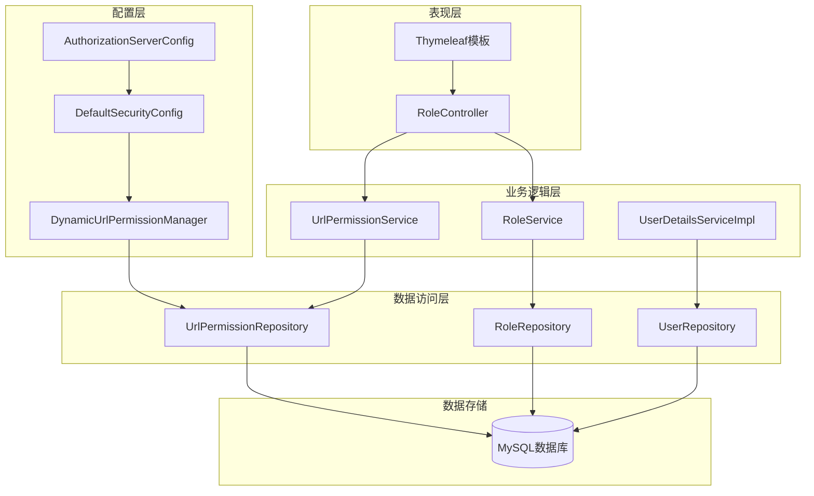
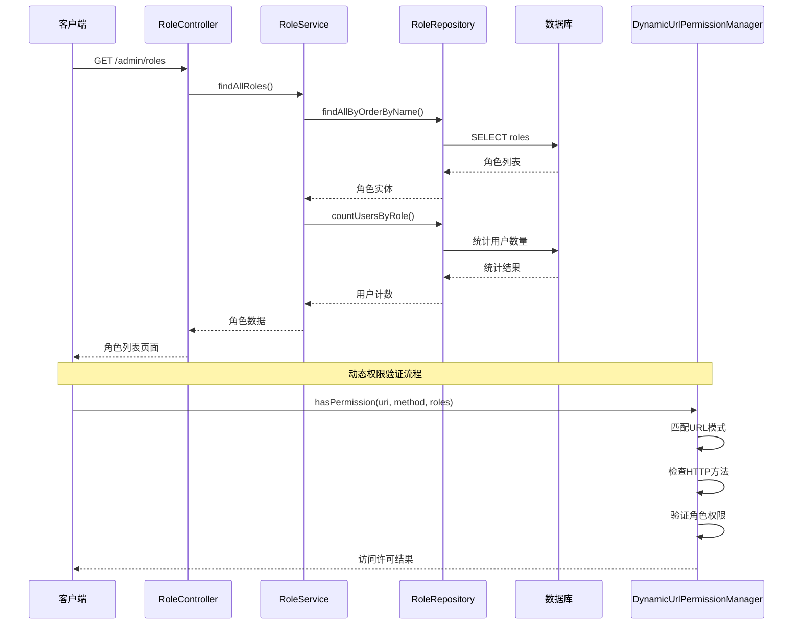
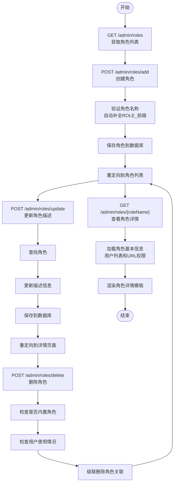
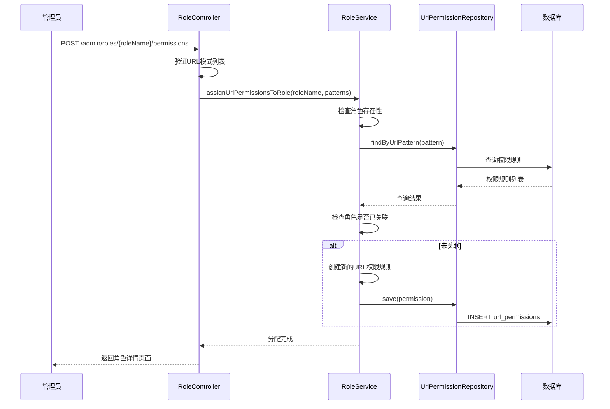
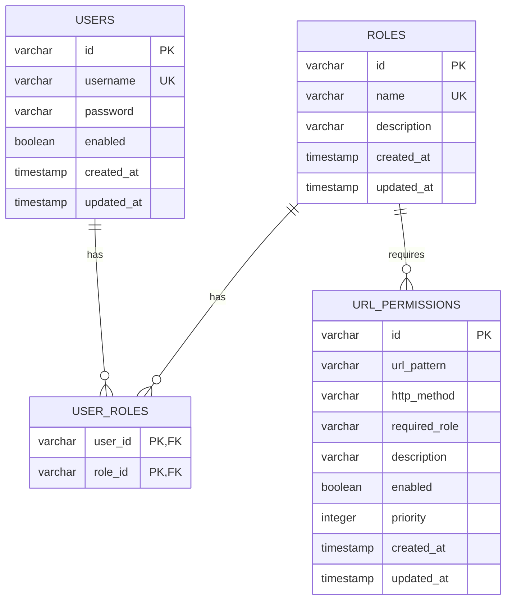
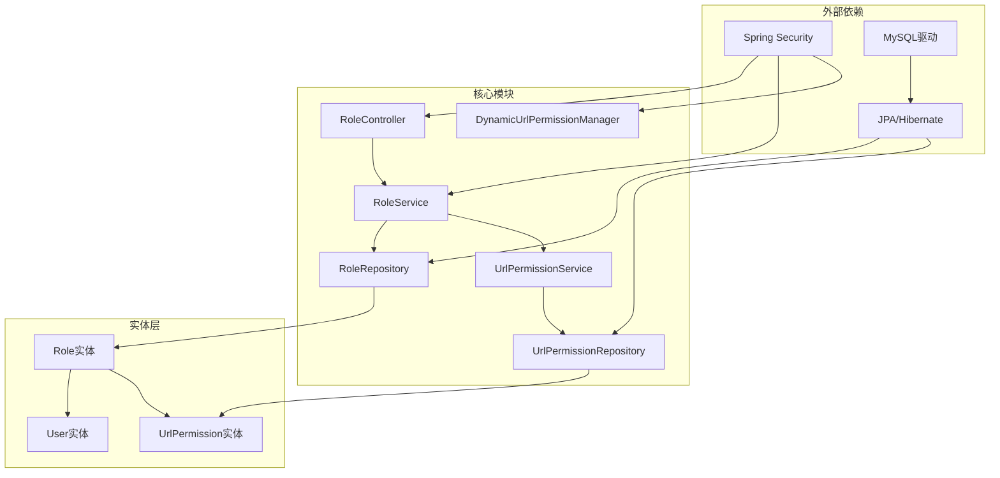

# 角色管理功能

<cite>
**本文档引用的文件**
- [RoleController.java](file://src/main/java/com/example/authserver/controller/RoleController.java)
- [RoleService.java](file://src/main/java/com/example/authserver/service/RoleService.java)
- [Role.java](file://src/main/java/com/example/authserver/entity/Role.java)
- [RoleRepository.java](file://src/main/java/com/example/authserver/repository/RoleRepository.java)
- [DynamicUrlPermissionManager.java](file://src/main/java/com/example/authserver/config/DynamicUrlPermissionManager.java)
- [UrlPermission.java](file://src/main/java/com/example/authserver/entity/UrlPermission.java)
- [UrlPermissionRepository.java](file://src/main/java/com/example/authserver/repository/UrlPermissionRepository.java)
- [UrlPermissionService.java](file://src/main/java/com/example/authserver/service/UrlPermissionService.java)
- [User.java](file://src/main/java/com/example/authserver/entity/User.java)
- [application.yml](file://src/main/resources/application.yml)
- [schema.sql](file://src/main/resources/schema.sql)
- [DefaultSecurityConfig.java](file://src/main/java/com/example/authserver/config/DefaultSecurityConfig.java)
- [AuthorizationServerConfig.java](file://src/main/java/com/example/authserver/config/AuthorizationServerConfig.java)
- [roles.html](file://src/main/resources/templates/admin/roles.html)
- [role-detail.html](file://src/main/resources/templates/admin/role-detail.html)
- [UserDetailsServiceImpl.java](file://src/main/java/com/example/authserver/service/UserDetailsServiceImpl.java)
</cite>

## 目录
1. [简介](#简介)
2. [项目结构](#项目结构)
3. [核心组件](#核心组件)
4. [架构概览](#架构概览)
5. [详细组件分析](#详细组件分析)
6. [依赖关系分析](#依赖关系分析)
7. [性能考虑](#性能考虑)
8. [故障排除指南](#故障排除指南)
9. [结论](#结论)
10. [附录](#附录)

## 简介
本项目实现了基于Spring Security的RBAC（基于角色的访问控制）认证与授权体系，围绕角色管理功能构建了完整的CRUD操作流程。系统采用动态URL权限管理机制，通过角色与URL权限规则的关联实现细粒度的访问控制。本文档详细阐述角色管理的实现细节、RBAC模型、权限继承机制、动态权限分配策略以及REST API接口规范。

## 项目结构
项目采用典型的三层架构设计，包含控制器层、服务层和数据访问层，配合Spring Security实现统一的身份认证与授权管理。



**图表来源**
- [RoleController.java:22-26](file://src/main/java/com/example/authserver/controller/RoleController.java#L22-L26)
- [RoleService.java:22-25](file://src/main/java/com/example/authserver/service/RoleService.java#L22-L25)
- [DynamicUrlPermissionManager.java:21-23](file://src/main/java/com/example/authserver/config/DynamicUrlPermissionManager.java#L21-L23)

**章节来源**
- [application.yml:1-29](file://src/main/resources/application.yml#L1-L29)
- [schema.sql:1-169](file://src/main/resources/schema.sql#L1-L169)

## 核心组件
系统的核心组件围绕角色管理展开，包括角色实体、角色服务、角色仓库以及相关的权限管理组件。

### 角色实体模型
角色实体采用JPA注解映射，支持UUID主键、唯一约束和时间戳自动管理。

```mermaid
classDiagram
class Role {
+String id
+String name
+String description
+LocalDateTime createdAt
+LocalDateTime updatedAt
+User[] users
+onCreate() void
+onUpdate() void
}
class User {
+String id
+String username
+String password
+Boolean enabled
+LocalDateTime createdAt
+LocalDateTime updatedAt
+Role[] roles
}
class UrlPermission {
+String id
+String urlPattern
+String httpMethod
+String requiredRole
+String description
+Boolean enabled
+Integer priority
+LocalDateTime createdAt
+LocalDateTime updatedAt
}
Role "1" -- "*" User : 多对多关联
Role ||--o{ UrlPermission : 角色权限规则
```

**图表来源**
- [Role.java:20-61](file://src/main/java/com/example/authserver/entity/Role.java#L20-L61)
- [User.java:20-65](file://src/main/java/com/example/authserver/entity/User.java#L20-L65)
- [UrlPermission.java:11-72](file://src/main/java/com/example/authserver/entity/UrlPermission.java#L11-L72)

### RBAC权限模型
系统实现了标准的RBAC模型，通过角色-权限映射实现用户访问控制：

- **用户角色关联**：用户与角色建立多对多关系，支持用户拥有多个角色
- **角色权限规则**：通过URL权限规则实现细粒度的访问控制
- **权限继承**：用户通过角色继承获得相应的权限集合
- **动态权限管理**：支持运行时动态添加、修改和删除权限规则

**章节来源**
- [Role.java:42-46](file://src/main/java/com/example/authserver/entity/Role.java#L42-L46)
- [User.java:45-50](file://src/main/java/com/example/authserver/entity/User.java#L45-L50)
- [schema.sql:22-56](file://src/main/resources/schema.sql#L22-L56)

## 架构概览
系统采用分层架构设计，结合Spring Security实现统一的认证授权机制。



**图表来源**
- [RoleController.java:34-62](file://src/main/java/com/example/authserver/controller/RoleController.java#L34-L62)
- [RoleService.java:34-45](file://src/main/java/com/example/authserver/service/RoleService.java#L34-L45)
- [DynamicUrlPermissionManager.java:64-81](file://src/main/java/com/example/authserver/config/DynamicUrlPermissionManager.java#L64-L81)

## 详细组件分析

### 角色管理控制器
RoleController提供了完整的角色管理REST API接口，支持角色的CRUD操作和权限分配。

#### 角色CRUD操作流程


**图表来源**
- [RoleController.java:82-178](file://src/main/java/com/example/authserver/controller/RoleController.java#L82-L178)
- [RoleService.java:57-107](file://src/main/java/com/example/authserver/service/RoleService.java#L57-L107)

#### URL权限管理流程


**图表来源**
- [RoleController.java:230-254](file://src/main/java/com/example/authserver/controller/RoleController.java#L230-L254)
- [RoleService.java:113-149](file://src/main/java/com/example/authserver/service/RoleService.java#L113-L149)

**章节来源**
- [RoleController.java:34-283](file://src/main/java/com/example/authserver/controller/RoleController.java#L34-L283)
- [RoleService.java:57-234](file://src/main/java/com/example/authserver/service/RoleService.java#L57-L234)

### 角色服务层实现
RoleService封装了角色管理的核心业务逻辑，提供了事务性和一致性的操作保证。

#### 角色权限验证机制
系统通过DynamicUrlPermissionManager实现动态权限验证，支持以下特性：

- **Ant路径匹配**：支持通配符模式匹配（如`/admin/**`）
- **HTTP方法过滤**：支持特定HTTP方法的权限控制
- **优先级排序**：根据优先级高低决定规则匹配顺序
- **缓存机制**：内存缓存已加载的权限规则，提高匹配性能

**章节来源**
- [DynamicUrlPermissionManager.java:64-95](file://src/main/java/com/example/authserver/config/DynamicUrlPermissionManager.java#L64-L95)
- [UrlPermissionService.java:25-27](file://src/main/java/com/example/authserver/service/UrlPermissionService.java#L25-L27)

### 数据模型设计
系统采用关系型数据库设计，通过外键约束确保数据一致性。



**图表来源**
- [schema.sql:8-56](file://src/main/resources/schema.sql#L8-L56)

**章节来源**
- [schema.sql:22-56](file://src/main/resources/schema.sql#L22-L56)

## 依赖关系分析
系统各组件之间存在清晰的依赖关系，遵循依赖倒置原则。



**图表来源**
- [DefaultSecurityConfig.java:27-74](file://src/main/java/com/example/authserver/config/DefaultSecurityConfig.java#L27-L74)
- [AuthorizationServerConfig.java:44-77](file://src/main/java/com/example/authserver/config/AuthorizationServerConfig.java#L44-L77)

**章节来源**
- [DefaultSecurityConfig.java:27-74](file://src/main/java/com/example/authserver/config/DefaultSecurityConfig.java#L27-L74)
- [AuthorizationServerConfig.java:44-77](file://src/main/java/com/example/authserver/config/AuthorizationServerConfig.java#L44-L77)

## 性能考虑
系统在设计时充分考虑了性能优化，主要体现在以下几个方面：

### 缓存策略
- **权限规则缓存**：DynamicUrlPermissionManager使用ConcurrentHashMap缓存已加载的URL权限规则
- **批量查询优化**：RoleService提供批量用户统计查询，减少数据库交互次数
- **懒加载机制**：角色与用户的关联使用FetchType.LAZY，避免不必要的数据加载

### 数据库优化
- **索引设计**：URL权限表对url_pattern和enabled字段建立索引，提高查询性能
- **连接池配置**：通过application.yml配置数据源连接池参数
- **DDL自动管理**：使用hibernate.ddl-auto=update简化数据库结构变更

### 并发控制
- **事务边界**：所有写操作都在@Transactional注解的事务边界内执行
- **乐观锁**：实体类包含版本字段，支持并发更新控制
- **线程安全**：权限管理器使用线程安全的数据结构

## 故障排除指南
系统提供了完善的异常处理机制和错误恢复策略。

### 常见问题及解决方案

#### 角色创建失败
**问题现象**：创建角色时报"角色已存在"错误
**可能原因**：
- 角色名称重复
- 数据库约束冲突
- 输入格式不正确

**解决步骤**：
1. 检查角色名称是否以ROLE_开头
2. 验证角色名称唯一性
3. 确认数据库连接状态

#### 角色删除失败
**问题现象**：删除角色时报"有用户正在使用该角色"错误
**解决步骤**：
1. 检查角色关联的用户数量
2. 将用户从该角色中移除
3. 重新尝试删除操作

#### 权限分配异常
**问题现象**：为角色分配URL权限时出现异常
**解决步骤**：
1. 验证URL模式格式正确性
2. 检查角色是否存在
3. 确认权限规则未重复创建

**章节来源**
- [RoleService.java:63-66](file://src/main/java/com/example/authserver/service/RoleService.java#L63-L66)
- [RoleService.java:99-102](file://src/main/java/com/example/authserver/service/RoleService.java#L99-L102)

## 结论
本角色管理系统实现了完整的RBAC模型，通过角色管理、权限分配和动态权限验证，为企业级应用提供了灵活而强大的访问控制解决方案。系统具有以下特点：

- **模块化设计**：清晰的分层架构便于维护和扩展
- **动态权限**：支持运行时权限规则的动态配置
- **性能优化**：缓存机制和数据库优化确保高并发场景下的稳定性
- **安全性**：基于Spring Security的认证授权框架提供可靠的安全保障

## 附录

### REST API接口规范

#### 角色管理接口
| 接口 | 方法 | 参数 | 响应 | 描述 |
|------|------|------|------|------|
| `/admin/roles` | GET | 无 | HTML页面 | 获取角色列表页面 |
| `/admin/roles/check-exists` | GET | roleName | JSON | 检查角色是否存在 |
| `/admin/roles/add` | POST | roleName, description | 重定向 | 创建新角色 |
| `/admin/roles/update` | POST | roleName, description | 重定向 | 更新角色描述 |
| `/admin/roles/delete` | POST | roleName | 重定向 | 删除角色 |
| `/admin/roles/{roleName}` | GET | roleName | HTML页面 | 查看角色详情 |
| `/admin/roles/{roleName}/permissions` | POST | urlPatterns | 重定向 | 为角色分配URL权限 |
| `/admin/roles/{roleName}/permissions/remove` | POST | urlPatterns | 重定向 | 删除角色的URL权限 |

#### 请求参数说明
- **roleName**：角色名称，必须以ROLE_开头
- **description**：角色描述信息
- **urlPatterns**：URL权限模式列表，支持通配符
- **success**：成功状态参数，用于页面跳转

#### 响应格式
- **HTML页面**：Thymeleaf模板渲染的页面
- **JSON**：AJAX请求返回的JSON数据
- **重定向**：成功操作后的页面跳转

### 最佳实践建议
1. **角色命名规范**：统一使用ROLE_前缀，采用大写字母和下划线组合
2. **权限最小化**：遵循最小权限原则，只授予必要的访问权限
3. **定期审计**：定期审查角色权限配置，清理不再使用的权限
4. **备份策略**：定期备份角色和权限配置，确保系统可恢复性
5. **监控告警**：建立权限变更监控机制，及时发现异常操作