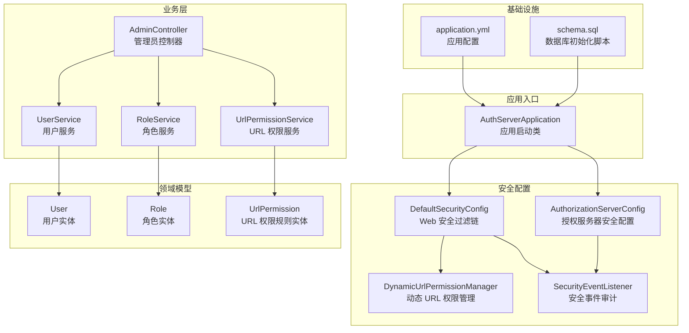
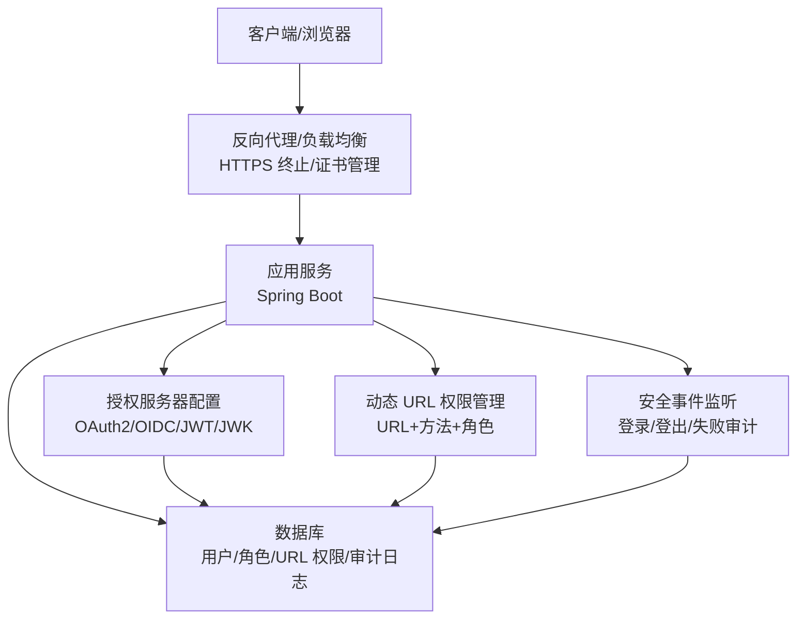
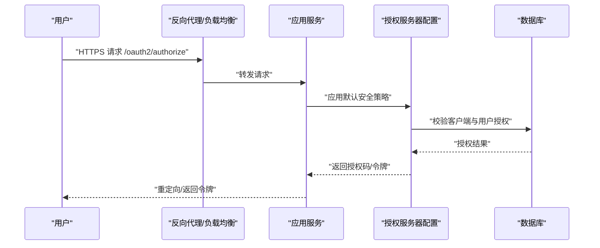
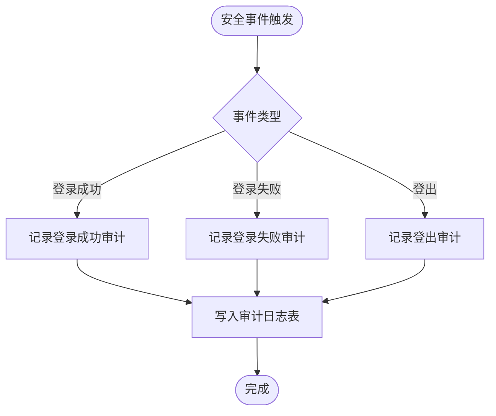
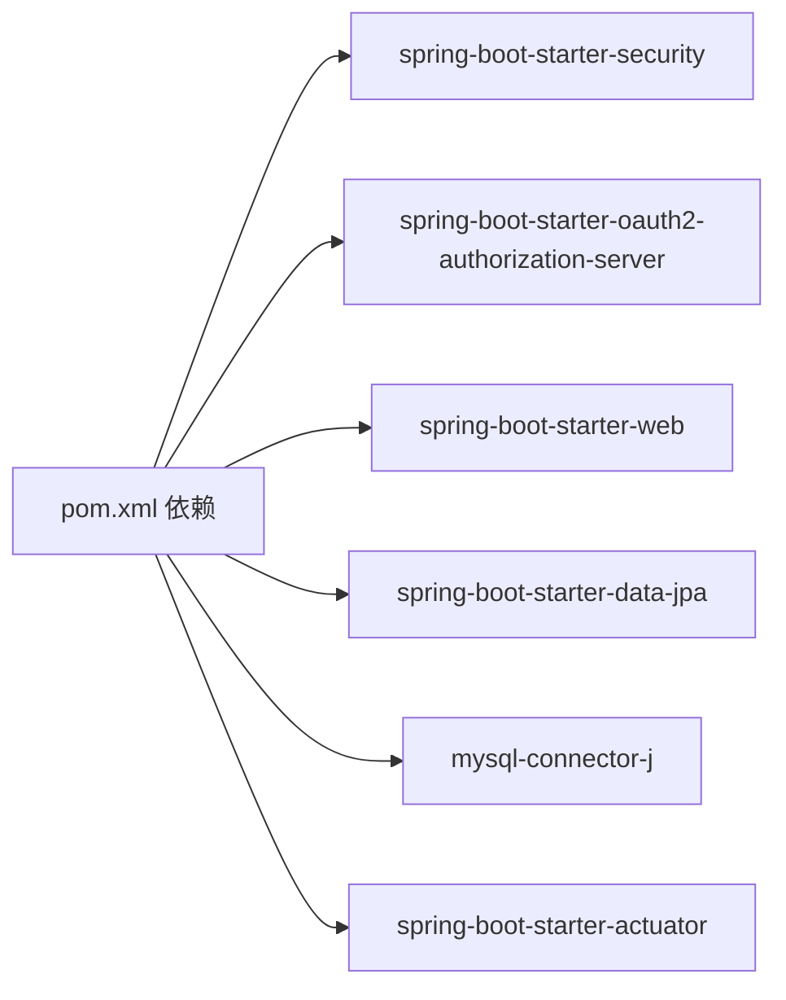

# 安全加固

<cite>
**本文引用的文件**
- [AuthServerApplication.java](file://src/main/java/com/example/authserver/AuthServerApplication.java)
- [DefaultSecurityConfig.java](file://src/main/java/com/example/authserver/config/DefaultSecurityConfig.java)
- [AuthorizationServerConfig.java](file://src/main/java/com/example/authserver/config/AuthorizationServerConfig.java)
- [DynamicUrlPermissionManager.java](file://src/main/java/com/example/authserver/config/DynamicUrlPermissionManager.java)
- [SecurityEventListener.java](file://src/main/java/com/example/authserver/listener/SecurityEventListener.java)
- [UserDetailsServiceImpl.java](file://src/main/java/com/example/authserver/service/UserDetailsServiceImpl.java)
- [application.yml](file://src/main/resources/application.yml)
- [schema.sql](file://src/main/resources/schema.sql)
- [AdminController.java](file://src/main/java/com/example/authserver/controller/AdminController.java)
- [User.java](file://src/main/java/com/example/authserver/entity/User.java)
- [Role.java](file://src/main/java/com/example/authserver/entity/Role.java)
- [UrlPermission.java](file://src/main/java/com/example/authserver/entity/UrlPermission.java)
- [UserService.java](file://src/main/java/com/example/authserver/service/UserService.java)
- [RoleService.java](file://src/main/java/com/example/authserver/service/RoleService.java)
- [UrlPermissionService.java](file://src/main/java/com/example/authserver/service/UrlPermissionService.java)
- [pom.xml](file://pom.xml)
</cite>

## 目录
1. [简介](#简介)
2. [项目结构](#项目结构)
3. [核心组件](#核心组件)
4. [架构总览](#架构总览)
5. [详细组件分析](#详细组件分析)
6. [依赖分析](#依赖分析)
7. [性能考虑](#性能考虑)
8. [故障排查指南](#故障排查指南)
9. [结论](#结论)
10. [附录](#附录)

## 简介
本指南面向生产环境的安全加固，结合项目现有代码与配置，系统性地给出 HTTPS/SSL 证书、密码策略、防火墙与网络策略、应用安全（CORS/CSRF/XSS/SQL 注入）、身份认证与授权（JWT/会话/权限）、以及安全审计与合规落地建议。文档以“可操作”和“可落地”为核心，既覆盖高层策略，也提供与代码映射的实施要点。

## 项目结构
项目采用 Spring Boot + Spring Security OAuth2 Authorization Server 的标准分层结构，核心安全配置集中在 config 包，业务控制器位于 controller 包，实体与服务位于 entity、service、repository 包，数据库初始化脚本位于 resources。

图表来源
- [AuthServerApplication.java:1-14](file://src/main/java/com/example/authserver/AuthServerApplication.java#L1-L14)
- [DefaultSecurityConfig.java:1-78](file://src/main/java/com/example/authserver/config/DefaultSecurityConfig.java#L1-L78)
- [AuthorizationServerConfig.java:1-256](file://src/main/java/com/example/authserver/config/AuthorizationServerConfig.java#L1-L256)
- [DynamicUrlPermissionManager.java:1-120](file://src/main/java/com/example/authserver/config/DynamicUrlPermissionManager.java#L1-L120)
- [SecurityEventListener.java:1-135](file://src/main/java/com/example/authserver/listener/SecurityEventListener.java#L1-L135)
- [application.yml:1-30](file://src/main/resources/application.yml#L1-L30)
- [schema.sql:1-194](file://src/main/resources/schema.sql#L1-L194)

章节来源
- [AuthServerApplication.java:1-14](file://src/main/java/com/example/authserver/AuthServerApplication.java#L1-L14)
- [application.yml:1-30](file://src/main/resources/application.yml#L1-L30)

## 核心组件
- 默认安全过滤链：集中处理登录、登出、静态资源放行与全局认证需求。
- 授权服务器安全配置：应用默认安全策略、OIDC 支持、JWT 解码器与 JWK 源。
- 动态 URL 权限管理：基于数据库的 URL+HTTP 方法+角色的细粒度权限匹配。
- 安全事件监听：统一记录登录/登出/失败审计，便于合规与追踪。
- 用户详情服务：对接数据库用户与角色，供认证与授权使用。
- 数据模型：用户、角色、URL 权限规则三者构成 RBAC 基础。

章节来源
- [DefaultSecurityConfig.java:56-76](file://src/main/java/com/example/authserver/config/DefaultSecurityConfig.java#L56-L76)
- [AuthorizationServerConfig.java:56-77](file://src/main/java/com/example/authserver/config/AuthorizationServerConfig.java#L56-L77)
- [DynamicUrlPermissionManager.java:64-81](file://src/main/java/com/example/authserver/config/DynamicUrlPermissionManager.java#L64-L81)
- [SecurityEventListener.java:33-95](file://src/main/java/com/example/authserver/listener/SecurityEventListener.java#L33-L95)
- [UserDetailsServiceImpl.java:29-57](file://src/main/java/com/example/authserver/service/UserDetailsServiceImpl.java#L29-L57)
- [User.java:20-66](file://src/main/java/com/example/authserver/entity/User.java#L20-L66)
- [Role.java:17-62](file://src/main/java/com/example/authserver/entity/Role.java#L17-L62)
- [UrlPermission.java:11-73](file://src/main/java/com/example/authserver/entity/UrlPermission.java#L11-L73)

## 架构总览
下图展示生产环境安全加固的关键交互：浏览器/客户端经反向代理（含 HTTPS 终止与证书管理）到达应用；应用通过授权服务器配置进行 OAuth2/OIDC 认证与令牌签发；动态权限管理器在业务层做细粒度校验；安全事件监听器统一采集审计日志。

图表来源
- [AuthorizationServerConfig.java:56-77](file://src/main/java/com/example/authserver/config/AuthorizationServerConfig.java#L56-L77)
- [DynamicUrlPermissionManager.java:64-81](file://src/main/java/com/example/authserver/config/DynamicUrlPermissionManager.java#L64-L81)
- [SecurityEventListener.java:33-95](file://src/main/java/com/example/authserver/listener/SecurityEventListener.java#L33-L95)
- [schema.sql:172-193](file://src/main/resources/schema.sql#L172-L193)

## 详细组件分析

### HTTPS 与 SSL/TLS 证书管理
- 反向代理层：在生产环境必须启用 HTTPS，终止 TLS 并卸载证书。推荐使用 ACME 自动签发（Let’s Encrypt）与定期续期策略，确保证书链完整与过期预警。
- 应用层：当前应用配置未显式启用 HTTPS，生产环境应通过反向代理暴露 HTTPS 端口，应用内部走 HTTP（或通过代理头透传协议）。
- 证书校验：启用证书固定（Pinning）与严格证书链验证；禁用弱密码套件与过时协议版本（TLS 1.2+）。

章节来源
- [application.yml:1-30](file://src/main/resources/application.yml#L1-L30)

### 密码策略与凭据管理
- 密码编码：项目使用委托式密码编码器，满足 BCrypt 等现代算法要求。生产环境应强制最小长度、复杂度与历史不可复用策略。
- 凭据存储：客户端密钥与应用数据库凭据均需密钥管理服务（KMS）保护；定期轮换密钥与数据库凭据。
- 传输安全：禁止明文传输密码与密钥，使用受信 CA 与安全通道。

章节来源
- [DefaultSecurityConfig.java:47-50](file://src/main/java/com/example/authserver/config/DefaultSecurityConfig.java#L47-L50)
- [AuthorizationServerConfig.java:98-99](file://src/main/java/com/example/authserver/config/AuthorizationServerConfig.java#L98-L99)
- [AuthorizationServerConfig.java:140-141](file://src/main/java/com/example/authserver/config/AuthorizationServerConfig.java#L140-L141)

### 防火墙与网络安全策略
- 端口管理：仅开放反向代理/负载均衡端口（如 443），应用内网仅开放数据库端口（如 6666），其余端口默认拒绝。
- IP 白名单：对管理端点（如 /admin/**）与授权服务器端点增加来源 IP 限制。
- DDoS 防护：在反向代理层启用速率限制、连接数限制与 WAF；对 OAuth2 端点（/oauth2/token、/oauth2/authorize）单独限流。
- 内网隔离：数据库与应用服务置于不同子网，通过安全组/ACL 控制访问。

章节来源
- [application.yml:6-8](file://src/main/resources/application.yml#L6-L8)

### 应用安全配置（CORS/CSRF/XSS/SQL 注入）
- CORS：仅允许受信域名，限定方法与头，避免通配符暴露。
- CSRF：授权服务器默认具备 CSRF 保护（state 参数与授权码 metadata），建议在前端框架中配合同源策略与安全响应头。
- XSS：模板渲染使用转义输出，避免内联脚本与危险标签；安全响应头（X-Content-Type-Options、X-Frame-Options、Content-Security-Policy）。
- SQL 注入：项目使用 JPA/Hibernate，ORM 默认参数化查询；避免原生 SQL 拼接，若必须使用需严格参数化与白名单校验。

章节来源
- [AuthorizationServerConfig.java:94-136](file://src/main/java/com/example/authserver/config/AuthorizationServerConfig.java#L94-L136)
- [schema.sql:62-141](file://src/main/resources/schema.sql#L62-L141)

### 身份认证与授权安全（JWT/会话/权限）
- JWT 令牌安全：使用强 RSA 密钥对（2048+），定期轮换 JWK；缩短访问令牌有效期，禁用刷新令牌复用；启用 JTI、kid 等声明增强追踪与吊销能力。
- 会话管理：应用层使用表单登录与 Spring Session（Redis）持久化，设置安全 Cookie 标志（Secure、HttpOnly、SameSite）。
- 权限控制：RBAC 通过角色与 URL 权限规则实现；动态权限管理器按优先级匹配，支持热更新与缓存。

图表来源
- [AuthorizationServerConfig.java:56-77](file://src/main/java/com/example/authserver/config/AuthorizationServerConfig.java#L56-L77)
- [DefaultSecurityConfig.java:60-73](file://src/main/java/com/example/authserver/config/DefaultSecurityConfig.java#L60-L73)

章节来源
- [AuthorizationServerConfig.java:211-245](file://src/main/java/com/example/authserver/config/AuthorizationServerConfig.java#L211-L245)
- [DynamicUrlPermissionManager.java:64-81](file://src/main/java/com/example/authserver/config/DynamicUrlPermissionManager.java#L64-L81)

### 安全审计与合规
- 审计日志：统一记录登录/登出/失败事件，包含用户、IP、请求 URI、方法、结果与错误信息。
- 合规要求：日志脱敏、保留周期、备份与只读归档；支持监管检查与取证。

图表来源
- [SecurityEventListener.java:33-95](file://src/main/java/com/example/authserver/listener/SecurityEventListener.java#L33-L95)
- [schema.sql:172-193](file://src/main/resources/schema.sql#L172-L193)

章节来源
- [SecurityEventListener.java:33-95](file://src/main/java/com/example/authserver/listener/SecurityEventListener.java#L33-L95)
- [schema.sql:172-193](file://src/main/resources/schema.sql#L172-L193)

## 依赖分析
- Spring Security 与 OAuth2 Authorization Server 提供认证与授权基础能力。
- JPA/Hibernate 与 MySQL 提供持久化；初始化脚本定义用户、角色、URL 权限与审计日志表。
- Actuator 用于健康检查与运维监控，需限制访问来源。

图表来源
- [pom.xml:29-114](file://pom.xml#L29-L114)

章节来源
- [pom.xml:29-114](file://pom.xml#L29-L114)

## 性能考虑
- 密钥轮换与 JWK 刷新：避免频繁轮换导致的解码性能下降，建议灰度与预热。
- 权限匹配缓存：动态权限管理器已内置缓存，建议结合缓存失效策略与批量刷新。
- 数据库连接池与慢查询：生产环境开启慢查询日志与连接池监控，优化索引（如 URL 模式、启用状态）。

章节来源
- [DynamicUrlPermissionManager.java:27-54](file://src/main/java/com/example/authserver/config/DynamicUrlPermissionManager.java#L27-L54)
- [schema.sql:54-56](file://src/main/resources/schema.sql#L54-L56)

## 故障排查指南
- 登录失败：检查凭证错误事件监听器是否正确记录 IP 与请求 URI，定位攻击源。
- 权限不足：核对 URL 权限规则优先级与匹配逻辑，确认用户角色是否正确。
- 令牌无效：检查 JWK 源与 JWT 解码器配置，确认密钥轮换流程与缓存同步。
- 数据库连接：核对 application.yml 中的数据库连接参数与 SSL 设置，确保字符集与时区一致。

章节来源
- [SecurityEventListener.java:54-71](file://src/main/java/com/example/authserver/listener/SecurityEventListener.java#L54-L71)
- [DynamicUrlPermissionManager.java:64-95](file://src/main/java/com/example/authserver/config/DynamicUrlPermissionManager.java#L64-L95)
- [AuthorizationServerConfig.java:242-245](file://src/main/java/com/example/authserver/config/AuthorizationServerConfig.java#L242-L245)
- [application.yml:6-8](file://src/main/resources/application.yml#L6-L8)

## 结论
本项目已具备 OAuth2/OIDC 认证、动态权限与统一审计的基础能力。生产加固应围绕“传输加密、凭据安全、网络隔离、应用防护、权限最小化、审计留痕”六大维度推进，结合反向代理与数据库安全策略，形成闭环的安全体系。

## 附录
- 生产部署清单
  - 反向代理启用 HTTPS，证书自动续期与告警
  - 应用仅暴露必要端口，内网访问数据库
  - 密码策略与密钥轮换机制
  - CORS/CSRF/XSS/SQL 注入防护基线
  - 审计日志保留与合规归档
  - 供应链与依赖漏洞扫描