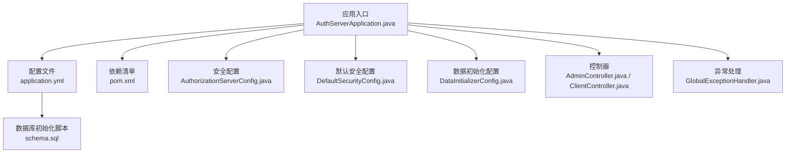
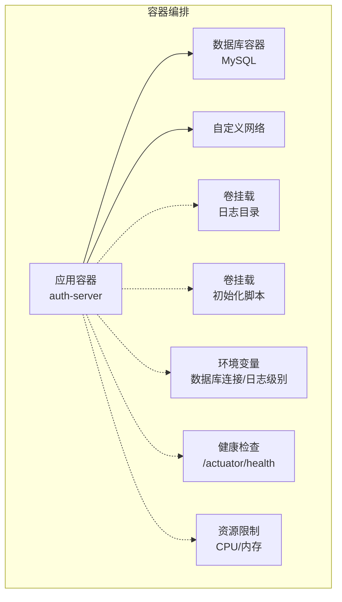
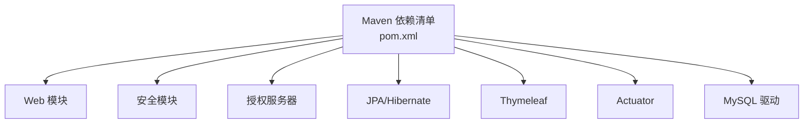

# 容器化部署

<cite>
**本文引用的文件**
- [AuthServerApplication.java](file://src/main/java/com/example/authserver/AuthServerApplication.java)
- [application.yml](file://src/main/resources/application.yml)
- [schema.sql](file://src/main/resources/schema.sql)
- [pom.xml](file://pom.xml)
- [AuthorizationServerConfig.java](file://src/main/java/com/example/authserver/config/AuthorizationServerConfig.java)
- [DefaultSecurityConfig.java](file://src/main/java/com/example/authserver/config/DefaultSecurityConfig.java)
- [DataInitializerConfig.java](file://src/main/java/com/example/authserver/config/DataInitializerConfig.java)
- [GlobalExceptionHandler.java](file://src/main/java/com/example/authserver/exception/GlobalExceptionHandler.java)
- [AdminController.java](file://src/main/java/com/example/authserver/controller/AdminController.java)
- [ClientController.java](file://src/main/java/com/example/authserver/controller/ClientController.java)
</cite>

## 目录
1. [简介](#简介)
2. [项目结构](#项目结构)
3. [核心组件](#核心组件)
4. [架构总览](#架构总览)
5. [详细组件分析](#详细组件分析)
6. [依赖分析](#依赖分析)
7. [性能考虑](#性能考虑)
8. [故障排查指南](#故障排查指南)
9. [结论](#结论)
10. [附录](#附录)

## 简介
本指南面向将 Spring Boot OAuth2 授权服务器项目进行容器化部署的工程实践，覆盖 Dockerfile 编写规范、Docker Compose 编排、容器编排最佳实践、Kubernetes 资源定义以及容器安全配置建议。文档以仓库中现有配置与代码为依据，结合实际运行需求，给出可落地的部署策略与注意事项。

## 项目结构
该 Spring Boot 项目采用标准 Maven 结构，包含以下与容器化密切相关的要素：
- 应用入口类：负责启动 Spring Boot 应用
- 配置文件：定义服务端口、数据库连接、SQL 初始化、JPA 设置、日志级别等
- 数据库初始化脚本：定义 OAuth2 与业务表结构及初始数据
- 依赖清单：声明 Actuator、Web、OAuth2 授权服务器、JPA、Thymeleaf、MySQL 驱动等
- 安全与授权配置：授权服务器、默认安全过滤链、密码编码器、JWK 签名等
- 控制器与异常处理：提供管理界面与全局异常响应

**图表来源**
- [AuthServerApplication.java:1-14](file://src/main/java/com/example/authserver/AuthServerApplication.java#L1-L14)
- [application.yml:1-30](file://src/main/resources/application.yml#L1-L30)
- [schema.sql:1-194](file://src/main/resources/schema.sql#L1-L194)
- [pom.xml:1-147](file://pom.xml#L1-L147)
- [AuthorizationServerConfig.java:1-255](file://src/main/java/com/example/authserver/config/AuthorizationServerConfig.java#L1-L255)
- [DefaultSecurityConfig.java:1-76](file://src/main/java/com/example/authserver/config/DefaultSecurityConfig.java#L1-L76)
- [DataInitializerConfig.java:1-109](file://src/main/java/com/example/authserver/config/DataInitializerConfig.java#L1-L109)
- [AdminController.java:1-47](file://src/main/java/com/example/authserver/controller/AdminController.java#L1-L47)
- [ClientController.java:1-43](file://src/main/java/com/example/authserver/controller/ClientController.java#L1-L43)
- [GlobalExceptionHandler.java:1-104](file://src/main/java/com/example/authserver/exception/GlobalExceptionHandler.java#L1-L104)

**章节来源**
- [AuthServerApplication.java:1-14](file://src/main/java/com/example/authserver/AuthServerApplication.java#L1-L14)
- [application.yml:1-30](file://src/main/resources/application.yml#L1-L30)
- [schema.sql:1-194](file://src/main/resources/schema.sql#L1-L194)
- [pom.xml:1-147](file://pom.xml#L1-L147)

## 核心组件
- 应用入口与启动：应用通过入口类启动，监听配置文件中定义的端口对外提供服务
- 配置与数据源：配置文件定义了数据库连接、SQL 初始化策略、JPA 行为与方言、日志级别等
- 数据库初始化：脚本定义 OAuth2 客户端、授权记录、URL 权限、审计日志等表结构，并插入默认角色与权限规则
- 安全与授权：授权服务器配置启用 OIDC、JWK 签名、JWT 解码器；默认安全过滤链处理登录与登出
- 数据初始化：启动后初始化默认用户与角色，保证首次可用性
- 控制器与异常处理：提供管理界面与 API，统一异常响应便于容器日志与监控

**章节来源**
- [AuthServerApplication.java:1-14](file://src/main/java/com/example/authserver/AuthServerApplication.java#L1-L14)
- [application.yml:1-30](file://src/main/resources/application.yml#L1-L30)
- [schema.sql:1-194](file://src/main/resources/schema.sql#L1-L194)
- [AuthorizationServerConfig.java:1-255](file://src/main/java/com/example/authserver/config/AuthorizationServerConfig.java#L1-L255)
- [DefaultSecurityConfig.java:1-76](file://src/main/java/com/example/authserver/config/DefaultSecurityConfig.java#L1-L76)
- [DataInitializerConfig.java:1-109](file://src/main/java/com/example/authserver/config/DataInitializerConfig.java#L1-L109)
- [GlobalExceptionHandler.java:1-104](file://src/main/java/com/example/authserver/exception/GlobalExceptionHandler.java#L1-L104)

## 架构总览
下图展示容器化部署的典型拓扑：应用容器、数据库容器、网络与卷挂载、健康检查与资源限制、日志与环境变量传递。

[此图为概念性架构示意，不直接映射具体源文件，故无“图表来源”]

## 详细组件分析

### Dockerfile 编写规范
- 基础镜像选择
  - 使用官方 JDK 基础镜像，确保运行时一致性与安全性
  - 选择与项目 Java 版本一致的基础镜像，避免运行时兼容问题
- 应用打包
  - 使用 Maven 构建可执行 JAR，确保排除开发工具与可选依赖
  - 构建产物放置于镜像内固定路径，便于启动命令指定
- 多阶段构建优化
  - 第一阶段：使用完整 JDK 构建 JAR
  - 第二阶段：使用精简运行时镜像复制 JAR，减少镜像体积与攻击面
- 非 root 用户运行
  - 创建专用用户与组，分配最小必要权限，避免特权容器
- 健康检查与资源限制
  - 在容器编排层配置健康检查与资源限制，确保稳定性与可观测性

[本节为通用规范说明，不直接分析具体源文件，故无“章节来源”]

### Docker Compose 配置要点
- 应用容器
  - 映射应用端口到宿主机，暴露管理端点（如 Actuator）
  - 挂载日志目录与初始化脚本，便于调试与数据持久化
- 数据库容器
  - 使用官方 MySQL 镜像，设置时区、字符集与 root 密码
  - 挂载数据卷，确保数据库数据持久化
- 网络配置
  - 使用自定义网络，实现服务间 DNS 解析与隔离
- 卷挂载
  - 日志卷：将应用日志输出到宿主机目录
  - 初始化脚本卷：将 schema.sql 挂载至容器，供应用初始化使用
- 环境变量传递
  - 通过环境变量传递数据库连接字符串、用户名、密码、日志级别等

[本节为通用规范说明，不直接分析具体源文件，故无“章节来源”]

### 容器编排最佳实践
- 健康检查
  - 对外 HTTP 健康端点：/actuator/health
  - 数据库连通性探测：在启动阶段等待数据库就绪
- 资源限制
  - 为应用容器设置 CPU 与内存上限，避免资源争抢
- 日志收集
  - 将日志输出到 stdout/stderr，配合容器日志驱动集中收集
  - 挂载日志卷作为补充，便于离线分析
- 环境变量传递
  - 使用配置文件与环境变量分离，敏感信息通过密钥管理服务注入

[本节为通用规范说明，不直接分析具体源文件，故无“章节来源”]

### Kubernetes 部署配置示例
- Deployment
  - 定义副本数、滚动更新策略、容器探针（liveness/readiness）
  - 挂载 ConfigMap 与 Secret，注入配置与敏感信息
- Service
  - 暴露应用服务，支持 ClusterIP 或 LoadBalancer
- ConfigMap
  - 存放非敏感配置（如日志级别、数据库连接参数占位）
- Secret
  - 存放敏感信息（如数据库密码、密钥材料）

[本节为通用规范说明，不直接分析具体源文件，故无“章节来源”]

### 容器安全配置
- 非 root 用户运行
  - 在镜像构建阶段创建专用用户，应用以非 root 身份运行
- 最小权限原则
  - 仅授予容器运行所需的最小权限，避免特权模式
- 镜像扫描
  - 在 CI 中集成镜像漏洞扫描，阻断高危风险镜像上线
- 凭据与密钥管理
  - 使用 Secret 管理数据库密码、密钥材料，避免硬编码

[本节为通用规范说明，不直接分析具体源文件，故无“章节来源”]

## 依赖分析
应用运行依赖如下关键组件：
- Web 与安全：Spring MVC、Spring Security、OAuth2 授权服务器
- 数据访问：Spring Data JPA、Hibernate、MySQL 驱动
- 模板引擎：Thymeleaf
- 监控与可观测性：Spring Boot Actuator
- 开发辅助：DevTools（开发环境）

**图表来源**
- [pom.xml:29-114](file://pom.xml#L29-L114)

**章节来源**
- [pom.xml:29-114](file://pom.xml#L29-L114)

## 性能考虑
- JVM 参数与容器资源
  - 在容器中合理设置堆大小与 GC 参数，避免频繁 Full GC
  - 与容器资源限制协同，防止 OOM
- 数据库连接池
  - 合理配置连接池大小，避免连接风暴
- 缓存与模板
  - 生产环境关闭模板缓存，避免页面缓存导致的调试困难
- 日志级别
  - 生产环境降低日志级别，减少 IO 压力

[本节为通用指导，不直接分析具体源文件，故无“章节来源”]

## 故障排查指南
- 健康检查失败
  - 检查 Actuator 健康端点是否可达，确认数据库连接与初始化脚本执行情况
- 数据库连接异常
  - 核对环境变量中的数据库连接字符串、用户名与密码
  - 确认数据库容器已就绪且网络连通
- OAuth2 授权异常
  - 检查授权服务器配置与 JWK 签名密钥生成
  - 确认客户端注册与授权范围配置正确
- 管理界面无法访问
  - 检查默认安全过滤链与静态资源访问策略
  - 确认初始化用户是否存在，登录凭据是否正确

**章节来源**
- [application.yml:1-30](file://src/main/resources/application.yml#L1-L30)
- [AuthorizationServerConfig.java:1-255](file://src/main/java/com/example/authserver/config/AuthorizationServerConfig.java#L1-L255)
- [DefaultSecurityConfig.java:1-76](file://src/main/java/com/example/authserver/config/DefaultSecurityConfig.java#L1-L76)
- [DataInitializerConfig.java:1-109](file://src/main/java/com/example/authserver/config/DataInitializerConfig.java#L1-L109)
- [GlobalExceptionHandler.java:1-104](file://src/main/java/com/example/authserver/exception/GlobalExceptionHandler.java#L1-L104)

## 结论
通过遵循本文档的容器化部署规范，可在本地与生产环境中稳定地运行该 OAuth2 授权服务器。建议在 CI/CD 中集成镜像构建、扫描与发布流程，结合 Kubernetes 或编排平台实现弹性扩缩容与高可用部署。

## 附录
- 关键配置参考路径
  - 应用端口与数据库连接：[application.yml:1-30](file://src/main/resources/application.yml#L1-L30)
  - 数据库初始化脚本：[schema.sql:1-194](file://src/main/resources/schema.sql#L1-L194)
  - 依赖清单：[pom.xml:29-114](file://pom.xml#L29-L114)
  - 授权服务器配置：[AuthorizationServerConfig.java:1-255](file://src/main/java/com/example/authserver/config/AuthorizationServerConfig.java#L1-L255)
  - 默认安全配置：[DefaultSecurityConfig.java:1-76](file://src/main/java/com/example/authserver/config/DefaultSecurityConfig.java#L1-L76)
  - 数据初始化配置：[DataInitializerConfig.java:1-109](file://src/main/java/com/example/authserver/config/DataInitializerConfig.java#L1-L109)
  - 控制器与异常处理：[AdminController.java:1-47](file://src/main/java/com/example/authserver/controller/AdminController.java#L1-L47)、[ClientController.java:1-43](file://src/main/java/com/example/authserver/controller/ClientController.java#L1-L43)、[GlobalExceptionHandler.java:1-104](file://src/main/java/com/example/authserver/exception/GlobalExceptionHandler.java#L1-L104)