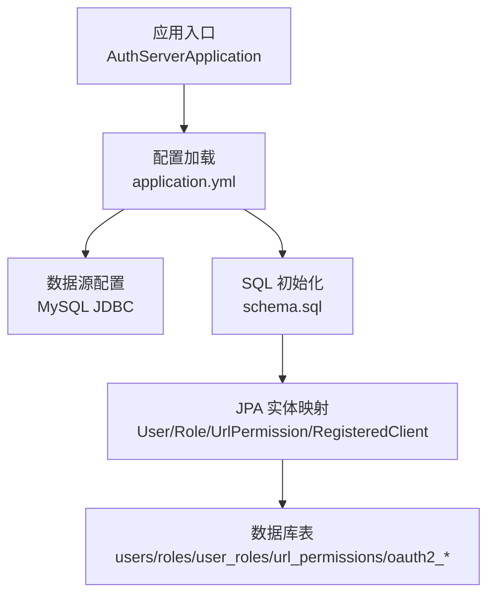
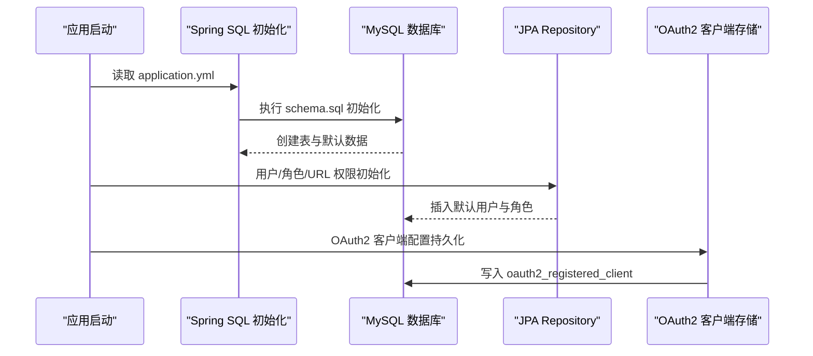
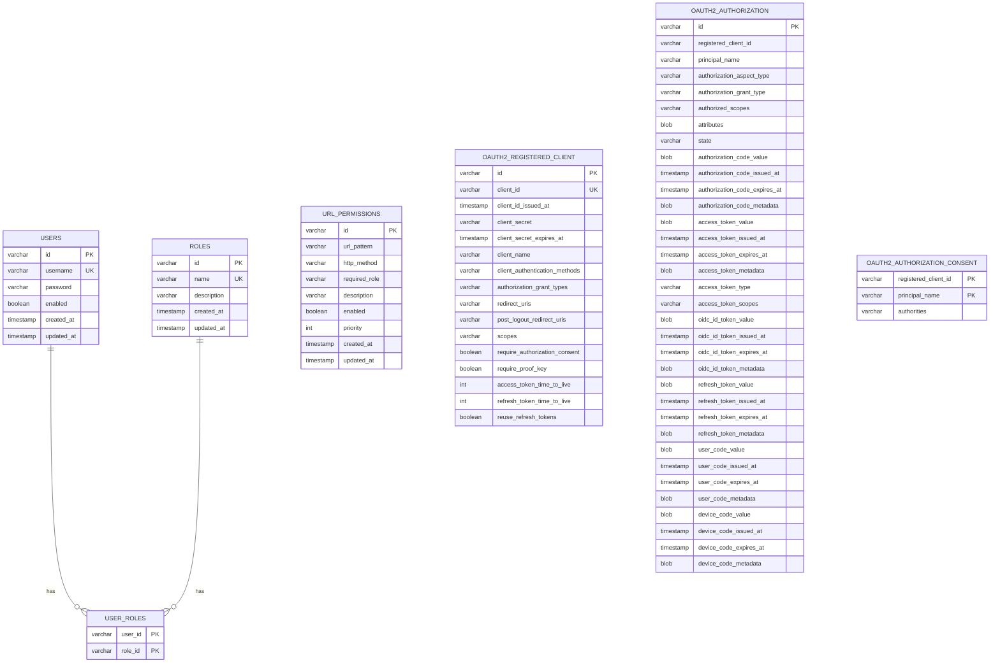
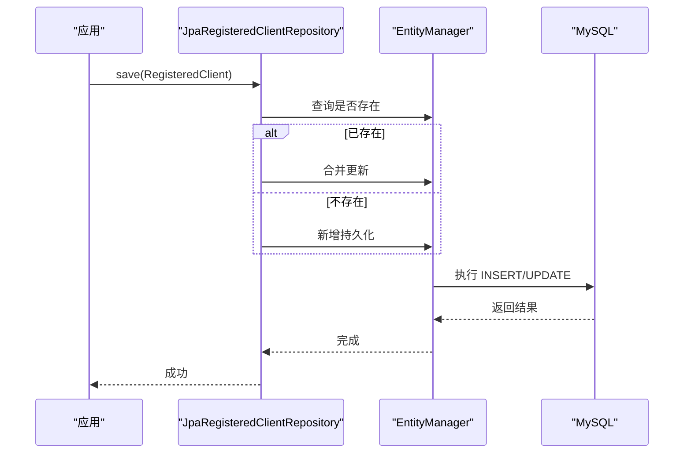
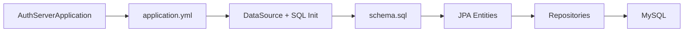

# 数据库部署

<cite>
**本文引用的文件**
- [schema.sql](file://src/main/resources/schema.sql)
- [application.yml](file://src/main/resources/application.yml)
- [AuthServerApplication.java](file://src/main/java/com/example/authserver/AuthServerApplication.java)
- [DataInitializerConfig.java](file://src/main/java/com/example/authserver/config/DataInitializerConfig.java)
- [DefaultSecurityConfig.java](file://src/main/java/com/example/authserver/config/DefaultSecurityConfig.java)
- [AuthorizationServerConfig.java](file://src/main/java/com/example/authserver/config/AuthorizationServerConfig.java)
- [User.java](file://src/main/java/com/example/authserver/entity/User.java)
- [Role.java](file://src/main/java/com/example/authserver/entity/Role.java)
- [UrlPermission.java](file://src/main/java/com/example/authserver/entity/UrlPermission.java)
- [RegisteredClientEntity.java](file://src/main/java/com/example/authserver/entity/RegisteredClientEntity.java)
- [JpaRegisteredClientRepository.java](file://src/main/java/com/example/authserver/repository/JpaRegisteredClientRepository.java)
- [pom.xml](file://pom.xml)
</cite>

## 目录
1. [简介](#简介)
2. [项目结构](#项目结构)
3. [核心组件](#核心组件)
4. [架构总览](#架构总览)
5. [详细组件分析](#详细组件分析)
6. [依赖关系分析](#依赖关系分析)
7. [性能考虑](#性能考虑)
8. [故障排查指南](#故障排查指南)
9. [结论](#结论)
10. [附录](#附录)

## 简介
本文件面向数据库管理员与运维工程师，提供基于 Spring Boot 的 OAuth2 授权服务器的数据库部署与运维指南。内容涵盖：
- MySQL 安装与基础配置（版本、字符集、时区、存储引擎）
- schema.sql 初始化脚本详解（OAuth2 客户端表、用户表、角色表、URL 权限表结构）
- 数据库用户权限规划（只读、写入、备份）
- 性能优化建议（索引策略、查询优化、连接池）
- 备份与恢复策略，以及主从复制与高可用部署思路

## 项目结构
该项目采用 Spring Boot + Spring Data JPA + MySQL 的技术栈，数据库初始化通过 schema.sql 与 Spring SQL 初始化机制完成；应用启动时自动执行初始化脚本并创建所需表结构。

图表来源
- [AuthServerApplication.java:1-14](file://src/main/java/com/example/authserver/AuthServerApplication.java#L1-L14)
- [application.yml:4-24](file://src/main/resources/application.yml#L4-L24)
- [schema.sql:1-169](file://src/main/resources/schema.sql#L1-L169)

章节来源
- [AuthServerApplication.java:1-14](file://src/main/java/com/example/authserver/AuthServerApplication.java#L1-L14)
- [application.yml:4-24](file://src/main/resources/application.yml#L4-L24)
- [schema.sql:1-169](file://src/main/resources/schema.sql#L1-L169)

## 核心组件
- 数据源与初始化
  - 数据源通过 JDBC 连接 MySQL，使用 UTF-8 字符集与 UTC 时区，开启自动创建数据库。
  - Spring SQL 初始化以 always 模式执行 schema.sql，初始化完成后插入默认角色与 URL 权限规则。
- 实体与表映射
  - 用户、角色、URL 权限、OAuth2 客户端等实体映射到对应数据库表，JPA 自动根据 DDL 设置进行同步。
- OAuth2 客户端持久化
  - JPA 实现的 RegisteredClientRepository 将 OAuth2 客户端配置持久化至 oauth2_registered_client 表。

章节来源
- [application.yml:4-24](file://src/main/resources/application.yml#L4-L24)
- [schema.sql:60-141](file://src/main/resources/schema.sql#L60-L141)
- [JpaRegisteredClientRepository.java:19-36](file://src/main/java/com/example/authserver/repository/JpaRegisteredClientRepository.java#L19-L36)

## 架构总览
下图展示应用与数据库之间的交互流程，包括初始化、认证授权与客户端配置的数据库操作。

图表来源
- [application.yml:12-16](file://src/main/resources/application.yml#L12-L16)
- [schema.sql:148-167](file://src/main/resources/schema.sql#L148-L167)
- [JpaRegisteredClientRepository.java:29-36](file://src/main/java/com/example/authserver/repository/JpaRegisteredClientRepository.java#L29-L36)

## 详细组件分析

### MySQL 安装与基础配置
- 版本要求
  - 项目使用 MySQL Connector/J 驱动，Spring Boot 版本为 3.2.3，Java 17。建议使用 MySQL 8.0+ 以获得更好的性能与兼容性。
- 字符集与排序规则
  - JDBC URL 显式设置字符集与 Unicode 支持，推荐数据库层面也使用 utf8mb4 字符集与合适的排序规则（如 utf8mb4_unicode_ci）。
- 时区与时钟
  - JDBC URL 指定 serverTimezone=UTC，确保应用与数据库时区一致，避免时间相关逻辑异常。
- 存储引擎
  - 建议使用 InnoDB 引擎，支持事务、外键与行级锁，适合本项目多表关联与并发场景。

章节来源
- [application.yml:6](file://src/main/resources/application.yml#L6)
- [pom.xml:24](file://pom.xml#L24)
- [pom.xml:74-77](file://pom.xml#L74-L77)

### schema.sql 初始化脚本详解
- 用户表 users
  - 主键为 UUID 字符串，用户名唯一，包含启用状态与时间戳字段。
- 角色表 roles
  - 主键为 UUID，角色名唯一，包含描述与时间戳。
- 用户-角色关联表 user_roles
  - 联合主键，外键分别指向 users 与 roles，删除级联保证数据一致性。
- URL 权限表 url_permissions
  - 包含 URL 模式、HTTP 方法、所需角色、启用状态、优先级与时间戳；对 URL 模式与启用状态建立索引。
- OAuth2 注册客户端表 oauth2_registered_client
  - 字段遵循 Spring Authorization Server 规范，包含客户端 ID、密钥、认证方式、授权类型、重定向 URI、作用域、令牌有效期等；客户端 ID 唯一。
- OAuth2 授权表 oauth2_authorization
  - 存储授权码、访问令牌、刷新令牌、OIDC ID Token、用户码、设备码等，字段丰富，便于完整追踪授权生命周期。
- OAuth2 授权同意表 oauth2_authorization_consent
  - 记录用户对客户端的授权同意，联合主键保证唯一性。
- 初始化数据
  - 插入默认角色与 URL 权限规则，便于快速体验。

章节来源
- [schema.sql:8-18](file://src/main/resources/schema.sql#L8-L18)
- [schema.sql:22-31](file://src/main/resources/schema.sql#L22-L31)
- [schema.sql:33-40](file://src/main/resources/schema.sql#L33-L40)
- [schema.sql:42-56](file://src/main/resources/schema.sql#L42-L56)
- [schema.sql:60-81](file://src/main/resources/schema.sql#L60-L81)
- [schema.sql:83-133](file://src/main/resources/schema.sql#L83-L133)
- [schema.sql:135-141](file://src/main/resources/schema.sql#L135-L141)
- [schema.sql:148-167](file://src/main/resources/schema.sql#L148-L167)

### 数据库用户权限规划
- 只读用户
  - 适用于报表、审计、只读查询场景。授予 SELECT 权限于业务相关表，限制写入与 DDL。
- 写入用户
  - 应用主账号，授予 INSERT、UPDATE、DELETE、SELECT 权限于所有业务表，必要时允许 DDL（开发/测试环境）。
- 备份用户
  - 授予 RELOAD、LOCK TABLES、BINLOG MONITOR（或 REPLICATION CLIENT）等权限，确保备份工具可执行一致性备份。
- 最小权限原则
  - 生产环境严格遵循最小权限，定期审计权限变更，避免过度授权。

[本节为通用实践建议，不直接分析具体文件]

### 实体模型与表结构映射

图表来源
- [User.java:20-49](file://src/main/java/com/example/authserver/entity/User.java#L20-L49)
- [Role.java:20-46](file://src/main/java/com/example/authserver/entity/Role.java#L20-L46)
- [UrlPermission.java:11-71](file://src/main/java/com/example/authserver/entity/UrlPermission.java#L11-L71)
- [RegisteredClientEntity.java:11-109](file://src/main/java/com/example/authserver/entity/RegisteredClientEntity.java#L11-L109)
- [schema.sql:8-18](file://src/main/resources/schema.sql#L8-L18)
- [schema.sql:22-31](file://src/main/resources/schema.sql#L22-L31)
- [schema.sql:42-56](file://src/main/resources/schema.sql#L42-L56)
- [schema.sql:60-81](file://src/main/resources/schema.sql#L60-L81)
- [schema.sql:83-133](file://src/main/resources/schema.sql#L83-L133)
- [schema.sql:135-141](file://src/main/resources/schema.sql#L135-L141)

### OAuth2 客户端持久化流程

图表来源
- [JpaRegisteredClientRepository.java:29-36](file://src/main/java/com/example/authserver/repository/JpaRegisteredClientRepository.java#L29-L36)
- [RegisteredClientEntity.java:11-109](file://src/main/java/com/example/authserver/entity/RegisteredClientEntity.java#L11-L109)

## 依赖关系分析
- 应用启动与数据库初始化
  - AuthServerApplication 启动 Spring Boot 应用，application.yml 提供数据源与 SQL 初始化配置，schema.sql 完成表结构与初始数据创建。
- 实体与仓库
  - User、Role、UrlPermission、RegisteredClientEntity 对应数据库表，JPA 通过 Hibernate 方言与方言设置进行映射。
- OAuth2 客户端配置
  - AuthorizationServerConfig 中定义了客户端凭证模式等配置，JpaRegisteredClientRepository 负责持久化。

图表来源
- [AuthServerApplication.java:1-14](file://src/main/java/com/example/authserver/AuthServerApplication.java#L1-L14)
- [application.yml:4-24](file://src/main/resources/application.yml#L4-L24)
- [schema.sql:1-169](file://src/main/resources/schema.sql#L1-L169)

章节来源
- [AuthServerApplication.java:1-14](file://src/main/java/com/example/authserver/AuthServerApplication.java#L1-L14)
- [application.yml:4-24](file://src/main/resources/application.yml#L4-L24)
- [schema.sql:1-169](file://src/main/resources/schema.sql#L1-L169)

## 性能考虑
- 索引策略
  - users.username、roles.name、url_permissions.url_pattern、url_permissions.enabled、oauth2_registered_client.client_id 等字段已建立唯一或普通索引，有助于高频查询与去重。
- 查询优化
  - 使用 UUID 主键提升分布式场景下的写入性能；对常用过滤条件（如 enabled、url_pattern）建立索引，避免全表扫描。
- 连接池配置
  - 建议在生产环境显式配置连接池参数（如最大连接数、空闲超时、连接生命周期），结合应用监控与慢查询日志进行调优。
- 存储引擎与字符集
  - 使用 InnoDB 引擎与 utf8mb4 字符集，确保事务一致性与多语言支持。
- 事务与锁
  - OAuth2 授权表字段较多，涉及多种令牌类型，建议合理拆分读写路径，避免长事务与热点行锁。

[本节提供通用性能建议，未直接分析具体文件]

## 故障排查指南
- 初始化失败
  - 检查 application.yml 中的 JDBC URL、用户名、密码是否正确；确认 MySQL 服务端口与网络连通性。
  - 若初始化报错，检查 schema.sql 语法与数据库版本兼容性。
- 用户/角色初始化异常
  - DataInitializerConfig 在应用启动后执行用户初始化，若角色缺失会导致初始化失败。请先确认 schema.sql 已成功执行。
- OAuth2 客户端无法持久化
  - 检查 JpaRegisteredClientRepository 的保存逻辑与实体映射，确认 oauth2_registered_client 表存在且字段与实体一致。
- 字符集与时区问题
  - 确认 JDBC URL 中字符集与时区设置与数据库一致，避免中文乱码与时间偏差。

章节来源
- [application.yml:4-24](file://src/main/resources/application.yml#L4-L24)
- [DataInitializerConfig.java:73-95](file://src/main/java/com/example/authserver/config/DataInitializerConfig.java#L73-L95)
- [JpaRegisteredClientRepository.java:29-36](file://src/main/java/com/example/authserver/repository/JpaRegisteredClientRepository.java#L29-L36)

## 结论
本项目通过 schema.sql 与 Spring SQL 初始化机制完成数据库表结构与初始数据的自动化部署，配合 JPA 实体映射与 OAuth2 客户端持久化实现完整的认证授权能力。建议在生产环境中完善数据库用户权限、连接池与索引策略，并制定标准化的备份与高可用方案。

[本节为总结性内容，不直接分析具体文件]

## 附录

### 数据库备份与恢复策略
- 备份策略
  - 全量备份：周期性执行物理/逻辑备份，保留多个历史版本。
  - 增量备份：结合二进制日志（binlog）进行增量备份，缩短 RPO。
- 恢复策略
  - 快速恢复：优先使用最近一次全量备份 + binlog 恢复到目标时间点。
  - 验证恢复：在隔离环境验证备份数据完整性与业务可用性。
- 备份用户权限
  - 授予 RELOAD、LOCK TABLES、BINLOG MONITOR（或 REPLICATION CLIENT）等权限，确保备份工具可执行一致性备份。

[本节为通用实践建议，不直接分析具体文件]

### 主从复制与高可用部署
- 主从复制
  - 配置主库 binlog 与从库 relay log，使用 GTID 或基于位置的复制，定期校验主从延迟。
- 高可用方案
  - 使用 VIP/负载均衡 + 健康检查，实现故障自动切换；结合只读副本提升读扩展能力。
- 监控与告警
  - 监控主从延迟、连接数、慢查询、锁等待与错误日志，建立完善的告警机制。

[本节为通用实践建议，不直接分析具体文件]