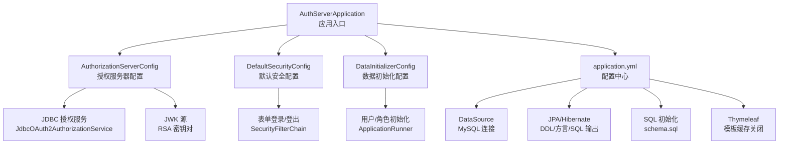
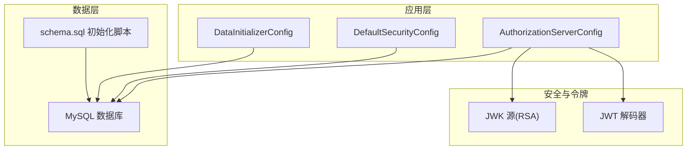
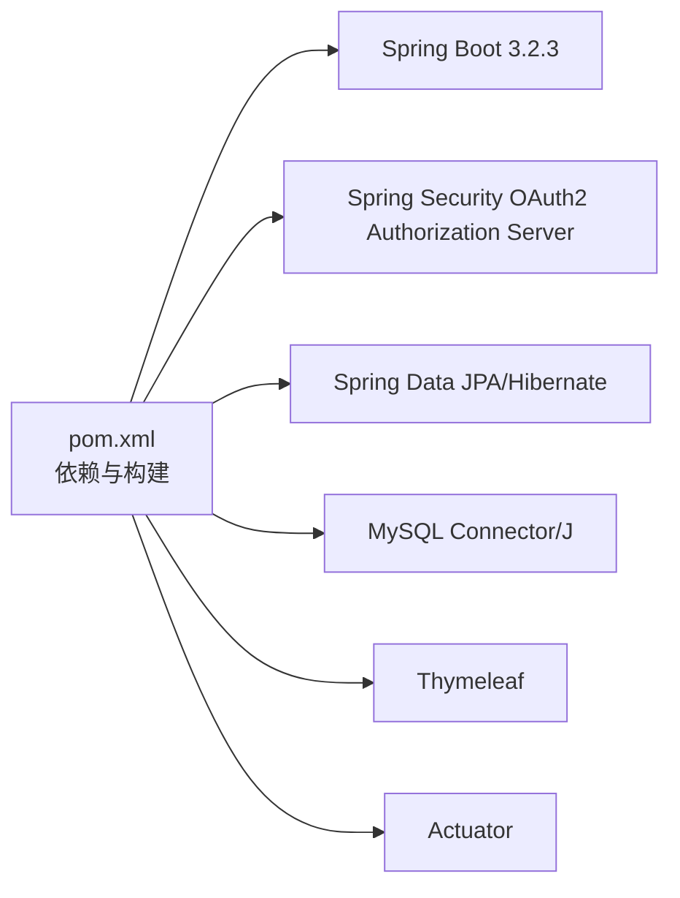

# 环境配置

<cite>
**本文引用的文件**
- [application.yml](file://src/main/resources/application.yml)
- [pom.xml](file://pom.xml)
- [AuthServerApplication.java](file://src/main/java/com/example/authserver/AuthServerApplication.java)
- [AuthorizationServerConfig.java](file://src/main/java/com/example/authserver/config/AuthorizationServerConfig.java)
- [DefaultSecurityConfig.java](file://src/main/java/com/example/authserver/config/DefaultSecurityConfig.java)
- [DataInitializerConfig.java](file://src/main/java/com/example/authserver/config/DataInitializerConfig.java)
- [DynamicUrlPermissionManager.java](file://src/main/java/com/example/authserver/config/DynamicUrlPermissionManager.java)
- [schema.sql](file://src/main/resources/schema.sql)
</cite>

## 目录
1. [简介](#简介)
2. [项目结构](#项目结构)
3. [核心组件](#核心组件)
4. [架构总览](#架构总览)
5. [详细组件分析](#详细组件分析)
6. [依赖分析](#依赖分析)
7. [性能考虑](#性能考虑)
8. [故障排查指南](#故障排查指南)
9. [结论](#结论)
10. [附录](#附录)

## 简介
本文件面向运维与开发团队，提供本项目的生产环境配置指南。内容涵盖：
- 生产环境系统要求（Java 17、MySQL、操作系统兼容性）
- application.yml 关键参数详解（数据库、JPA、日志、SQL 初始化等）
- Spring Security 与 OAuth2 授权服务器配置要点
- 不同环境（开发/测试/生产）的配置示例与最佳实践
- JVM 参数调优建议（堆大小、GC、监控）
- 环境变量与敏感信息管理的安全建议

## 项目结构
项目采用 Spring Boot 3.2.3 与 Spring Security OAuth2 Authorization Server，使用 Maven 构建，数据库为 MySQL，JPA/Hibernate 作为 ORM 层，Thymeleaf 提供模板渲染。

图表来源
- [AuthServerApplication.java:1-14](file://src/main/java/com/example/authserver/AuthServerApplication.java#L1-L14)
- [AuthorizationServerConfig.java:1-256](file://src/main/java/com/example/authserver/config/AuthorizationServerConfig.java#L1-L256)
- [DefaultSecurityConfig.java:1-75](file://src/main/java/com/example/authserver/config/DefaultSecurityConfig.java#L1-L75)
- [DataInitializerConfig.java:1-109](file://src/main/java/com/example/authserver/config/DataInitializerConfig.java#L1-L109)
- [application.yml:1-30](file://src/main/resources/application.yml#L1-L30)
- [schema.sql:1-169](file://src/main/resources/schema.sql#L1-L169)

章节来源
- [AuthServerApplication.java:1-14](file://src/main/java/com/example/authserver/AuthServerApplication.java#L1-L14)
- [pom.xml:1-147](file://pom.xml#L1-L147)
- [application.yml:1-30](file://src/main/resources/application.yml#L1-L30)
- [schema.sql:1-169](file://src/main/resources/schema.sql#L1-L169)

## 核心组件
- 授权服务器配置：启用 OAuth2 Authorization Server 默认安全、OIDC 支持、JWT 解码器、JWK 源、授权与授权同意服务。
- 默认安全配置：表单登录、登出、认证提供者、密码编码器；所有 URL 权限由动态 URL 权限管理器统一判定。
- 数据初始化配置：启动后修复角色描述、初始化默认用户（管理员与普通用户）。
- 应用入口：Spring Boot 启动类，无额外定制。

章节来源
- [AuthorizationServerConfig.java:1-256](file://src/main/java/com/example/authserver/config/AuthorizationServerConfig.java#L1-L256)
- [DefaultSecurityConfig.java:1-75](file://src/main/java/com/example/authserver/config/DefaultSecurityConfig.java#L1-L75)
- [DataInitializerConfig.java:1-109](file://src/main/java/com/example/authserver/config/DataInitializerConfig.java#L1-L109)
- [AuthServerApplication.java:1-14](file://src/main/java/com/example/authserver/AuthServerApplication.java#L1-L14)

## 架构总览
下图展示授权服务器与数据库、JWK、模板与 SQL 初始化的关系。

图表来源
- [AuthorizationServerConfig.java:1-256](file://src/main/java/com/example/authserver/config/AuthorizationServerConfig.java#L1-L256)
- [DefaultSecurityConfig.java:1-75](file://src/main/java/com/example/authserver/config/DefaultSecurityConfig.java#L1-L75)
- [DataInitializerConfig.java:1-109](file://src/main/java/com/example/authserver/config/DataInitializerConfig.java#L1-L109)
- [schema.sql:1-169](file://src/main/resources/schema.sql#L1-L169)

## 详细组件分析

### 系统要求与运行环境
- Java 运行时
  - 项目使用 Java 17（构建与运行均需 Java 17+）。
- 数据库
  - 使用 MySQL Connector/J（mysql-connector-j），数据库方言为 MySQL 对应方言。
- 操作系统
  - Spring Boot 与 Java 17 在主流 Linux/Windows/macOS 上均可稳定运行，建议使用长期支持版本。
- 依赖与版本
  - Spring Boot 3.2.3、Spring Security OAuth2 Authorization Server、JPA/Hibernate、Thymeleaf、Actuator。

章节来源
- [pom.xml:24-26](file://pom.xml#L24-L26)
- [pom.xml:31-77](file://pom.xml#L31-L77)
- [application.yml:17-24](file://src/main/resources/application.yml#L17-L24)

### application.yml 参数详解
- server.port
  - 应用监听端口，默认 9000。
- spring.datasource.*
  - url：数据库连接串（含时区、字符集、SSL、公钥检索等参数）。
  - username/password：数据库凭据。
  - driver-class-name：MySQL 驱动类。
- spring.thymeleaf.cache
  - 开发环境建议关闭（false），生产环境建议开启以提升性能。
- spring.sql.init.mode
  - 初始化模式（开发环境常用 always，生产环境谨慎使用）。
- spring.sql.init.schema-locations
  - 初始化脚本位置（classpath 下 schema.sql）。
- spring.jpa.hibernate.ddl-auto
  - DDL 自动策略（开发环境常用 update，生产环境建议手动迁移）。
- spring.jpa.show-sql
  - 是否输出 SQL 日志（开发环境开启，生产关闭）。
- spring.jpa.properties.hibernate.format_sql
  - SQL 格式化输出（开发调试友好）。
- spring.jpa.properties.hibernate.dialect
  - Hibernate 方言（与 MySQL 对应）。
- logging.level.org.springframework.security
  - 安全相关日志级别（生产环境可调整为 INFO/WARN）。

章节来源
- [application.yml:1-30](file://src/main/resources/application.yml#L1-L30)

### Spring Security 与 OAuth2 授权服务器配置
- 授权服务器安全过滤链
  - 启用 OAuth2 Authorization Server 默认安全，开启 OIDC 支持。
  - 未认证访问授权端点时重定向至登录页。
  - 资源服务器使用 JWT。
- 注册客户端与令牌设置
  - 默认初始化多个客户端（Web 应用、移动应用、后端服务），包含授权类型、作用域、回调地址、PKCE、令牌有效期等。
- 授权与授权同意服务
  - 使用 JDBC 存储授权状态与授权同意结果。
- JWK 与 JWT 解码器
  - 自动生成 RSA 密钥对，用于签名 JWT。
- 默认安全过滤链
  - 表单登录、登出、静态资源放行、其余请求需认证。
- 密码编码器
  - 使用 DelegatingPasswordEncoder，支持多种算法。

章节来源
- [AuthorizationServerConfig.java:56-77](file://src/main/java/com/example/authserver/config/AuthorizationServerConfig.java#L56-L77)
- [AuthorizationServerConfig.java:91-161](file://src/main/java/com/example/authserver/config/AuthorizationServerConfig.java#L91-L161)
- [AuthorizationServerConfig.java:193-206](file://src/main/java/com/example/authserver/config/AuthorizationServerConfig.java#L193-L206)
- [AuthorizationServerConfig.java:211-245](file://src/main/java/com/example/authserver/config/AuthorizationServerConfig.java#L211-L245)
- [DefaultSecurityConfig.java:55-73](file://src/main/java/com/example/authserver/config/DefaultSecurityConfig.java#L55-L73)
- [DefaultSecurityConfig.java:46-49](file://src/main/java/com/example/authserver/config/DefaultSecurityConfig.java#L46-L49)

### 数据初始化与数据库脚本
- schema.sql
  - 定义用户、角色、用户-角色关联、URL 权限规则、OAuth2 注册客户端、授权、授权同意等表。
  - 初始化默认角色与 URL 权限规则。
- DataInitializerConfig
  - 启动后修复角色描述、初始化默认用户（admin/user）。

章节来源
- [schema.sql:1-169](file://src/main/resources/schema.sql#L1-L169)
- [DataInitializerConfig.java:30-95](file://src/main/java/com/example/authserver/config/DataInitializerConfig.java#L30-L95)

### 动态 URL 权限管理器
- 从数据库加载启用的 URL 权限规则，按优先级匹配请求路径与方法，判断用户角色是否满足。
- 支持运行时重载与缓存。

章节来源
- [DynamicUrlPermissionManager.java:1-120](file://src/main/java/com/example/authserver/config/DynamicUrlPermissionManager.java#L1-L120)

## 依赖分析
- 构建与运行
  - Java 17（编译与运行）、Spring Boot 3.2.3、Spring Security OAuth2 Authorization Server、JPA/Hibernate、MySQL Connector/J、Thymeleaf、Actuator。
- 运行时依赖
  - 授权服务器、安全过滤链、JDBC 存储、JWK、模板与 SQL 初始化。

图表来源
- [pom.xml:24-26](file://pom.xml#L24-L26)
- [pom.xml:31-77](file://pom.xml#L31-L77)

章节来源
- [pom.xml:1-147](file://pom.xml#L1-L147)

## 性能考虑
- 数据库连接与 SQL 输出
  - 生产环境建议关闭 show-sql，避免 SQL 日志开销。
  - 使用连接池参数优化（最大连接数、空闲超时、连接生命周期等），具体参数可在数据源配置中补充。
- JPA/Hibernate
  - DDL 自动策略建议改为手动迁移，避免运行时 DDL 变更带来的风险与开销。
  - 合理设置方言与 SQL 格式化仅用于开发阶段。
- 模板与缓存
  - 生产环境开启 Thymeleaf 缓存，减少模板解析开销。
- 日志级别
  - 将 org.springframework.security 日志级别调整为 INFO 或更高，降低调试日志量。
- Actuator
  - 生产环境限制暴露端点，仅开放必要指标，注意鉴权与网络隔离。

章节来源
- [application.yml:10-29](file://src/main/resources/application.yml#L10-L29)
- [application.yml:17-24](file://src/main/resources/application.yml#L17-L24)

## 故障排查指南
- 数据库初始化失败
  - 检查 spring.sql.init.* 配置与 schema.sql 路径；生产环境谨慎使用初始化脚本，优先使用迁移工具。
- OAuth2 客户端异常
  - 确认客户端配置（授权类型、回调地址、PKCE、作用域、令牌有效期）与实际调用一致。
- JWT 解码失败
  - 检查 JWK 源与密钥对生成流程，确认密钥长度与格式正确。
- 权限控制异常
  - 检查动态 URL 权限规则的 URL 模式、HTTP 方法、优先级与用户角色映射。
- 登录与认证问题
  - 确认表单登录配置、密码编码器与用户数据初始化是否生效。

章节来源
- [AuthorizationServerConfig.java:91-161](file://src/main/java/com/example/authserver/config/AuthorizationServerConfig.java#L91-L161)
- [AuthorizationServerConfig.java:211-245](file://src/main/java/com/example/authserver/config/AuthorizationServerConfig.java#L211-L245)
- [DynamicUrlPermissionManager.java:64-81](file://src/main/java/com/example/authserver/config/DynamicUrlPermissionManager.java#L64-L81)
- [DataInitializerConfig.java:73-95](file://src/main/java/com/example/authserver/config/DataInitializerConfig.java#L73-L95)

## 结论
本项目以 Spring Security OAuth2 Authorization Server 为核心，结合 JPA/Hibernate、MySQL、Thymeleaf 与 Actuator 构建授权服务器。生产环境应重点关注数据库初始化策略、JPA 策略、日志与模板缓存、JVM 参数与 GC 选择、以及敏感信息与环境变量的安全管理。通过合理的配置与调优，可获得稳定、可观测且安全的运行体验。

## 附录

### 不同环境配置示例与最佳实践
- 开发环境
  - server.port：9000
  - spring.sql.init.mode：always
  - spring.jpa.hibernate.ddl-auto：update
  - spring.jpa.show-sql：true
  - spring.thymeleaf.cache：false
  - logging.level.org.springframework.security：DEBUG/INFO
  - 开启 DevTools（可选）
- 测试环境
  - spring.sql.init.mode：always（或使用迁移工具）
  - spring.jpa.hibernate.ddl-auto：validate（或 update）
  - spring.jpa.show-sql：false
  - spring.thymeleaf.cache：true
  - logging.level.org.springframework.security：INFO
- 生产环境
  - spring.sql.init.mode：never
  - spring.jpa.hibernate.ddl-auto：none（配合迁移工具）
  - spring.jpa.show-sql：false
  - spring.thymeleaf.cache：true
  - logging.level.org.springframework.security：WARN/INFO
  - 严格限制 Actuator 暴露端点与访问控制

章节来源
- [application.yml:1-30](file://src/main/resources/application.yml#L1-L30)
- [pom.xml:86-92](file://pom.xml#L86-L92)

### JVM 参数调优建议
- 堆内存
  - 新生代/老年代比例根据 GC 行为与停顿目标调整；初始堆与最大堆按可用内存与业务峰值设定。
- 垃圾回收器
  - 生产推荐 G1GC 或 ZGC（取决于延迟目标与堆大小）；禁用 CMS/ParallelGC 等已弃用收集器。
- 性能监控
  - 启用 JFR、Micrometer 指标、GC 日志与堆转储；结合 APM 工具进行追踪。
- 其他
  - 启用偏向锁、压缩指针（64 位 JDK 在满足条件下）、JVM 内存对齐等。

[本节为通用建议，不直接分析具体文件]

### 环境变量与敏感信息管理
- 使用环境变量覆盖敏感配置（如数据库密码、客户端密钥），避免硬编码于配置文件。
- 在 CI/CD 中使用密文管理与密钥轮换机制。
- 生产环境禁止将敏感信息纳入镜像或制品仓库。
- 对外暴露的配置文件（如 application.yml）不应包含明文密码与密钥。

[本节为通用建议，不直接分析具体文件]