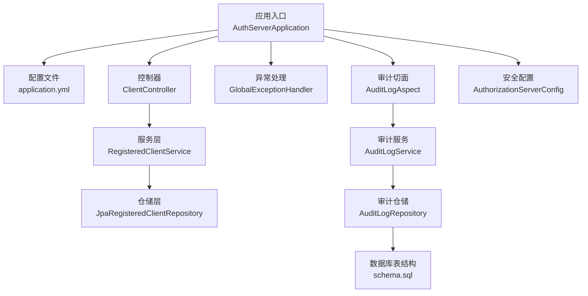
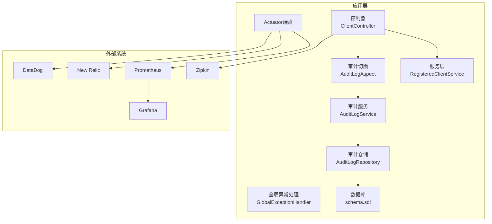
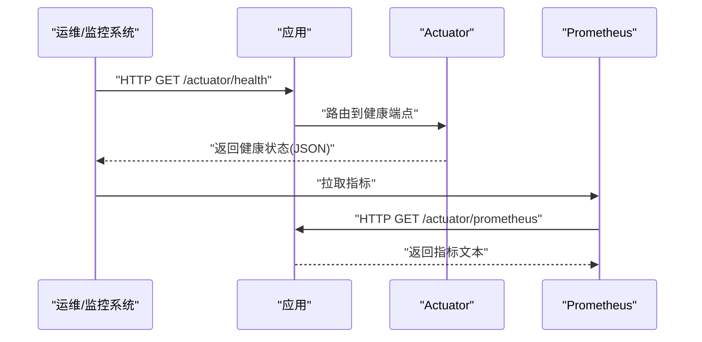
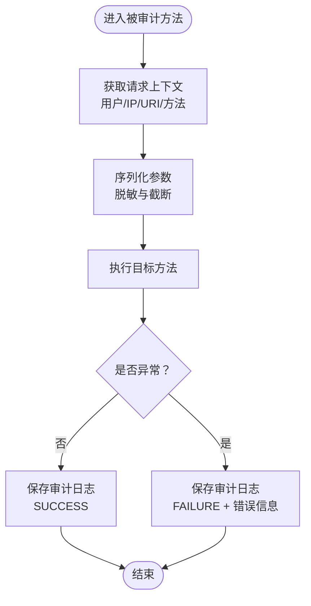
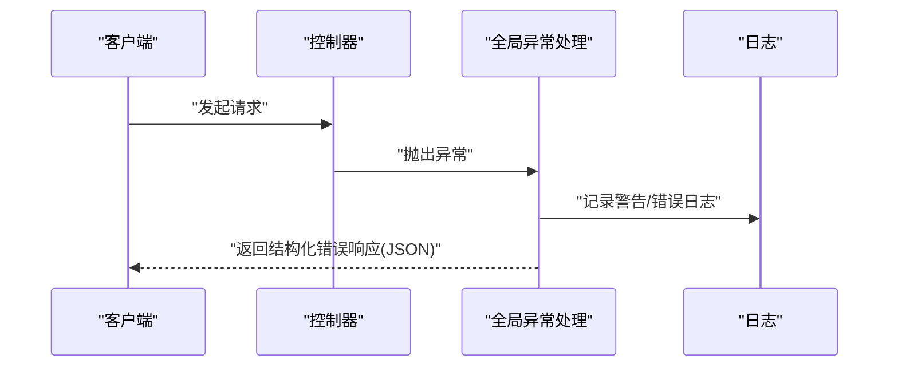
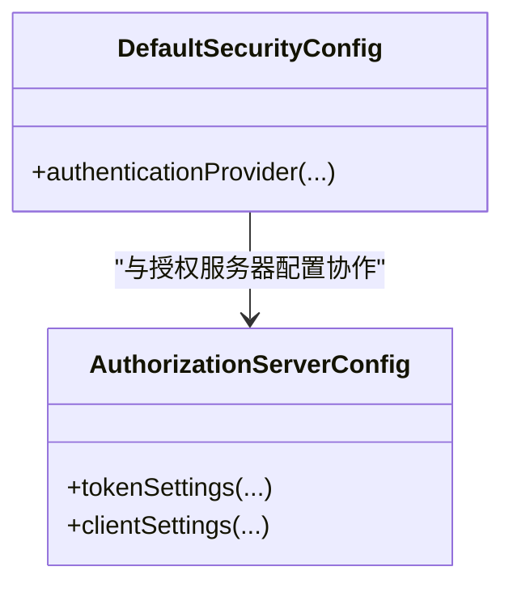
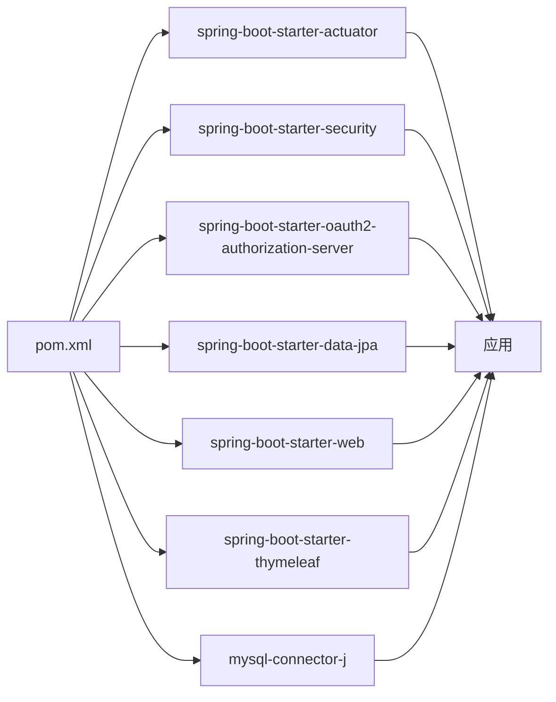

# 监控与日志

<cite>
**本文引用的文件**
- [pom.xml](file://pom.xml)
- [application.yml](file://src/main/resources/application.yml)
- [AuthServerApplication.java](file://src/main/java/com/example/authserver/AuthServerApplication.java)
- [GlobalExceptionHandler.java](file://src/main/java/com/example/authserver/exception/GlobalExceptionHandler.java)
- [AuditLogAspect.java](file://src/main/java/com/example/authserver/aspect/AuditLogAspect.java)
- [AuditLogService.java](file://src/main/java/com/example/authserver/service/AuditLogService.java)
- [AuditLogRepository.java](file://src/main/java/com/example/authserver/repository/AuditLogRepository.java)
- [schema.sql](file://src/main/resources/schema.sql)
- [AuthorizationServerConfig.java](file://src/main/java/com/example/authserver/config/AuthorizationServerConfig.java)
- [ClientController.java](file://src/main/java/com/example/authserver/controller/ClientController.java)
</cite>

## 目录
1. [简介](#简介)
2. [项目结构](#项目结构)
3. [核心组件](#核心组件)
4. [架构总览](#架构总览)
5. [详细组件分析](#详细组件分析)
6. [依赖关系分析](#依赖关系分析)
7. [性能考量](#性能考量)
8. [故障排查指南](#故障排查指南)
9. [结论](#结论)
10. [附录](#附录)

## 简介
本文件面向Spring Boot应用的监控与日志管理，结合当前仓库现状，系统性说明以下内容：
- Spring Boot Actuator的配置与使用：健康检查端点、指标收集、应用状态监控
- Prometheus与Grafana集成方案：指标导出配置、仪表板设计、告警规则设置
- 日志管理策略：Logback配置、日志级别、日志轮转、结构化日志
- 分布式追踪：Sleuth与Zipkin集成、链路追踪、性能分析
- APM工具集成：New Relic、DataDog等第三方监控平台的配置方法

当前项目已引入Actuator依赖，具备基础监控能力；同时内置审计日志机制，可用于运行态行为追踪与问题定位。

## 项目结构
项目采用标准Spring Boot目录组织，核心关注点如下：
- 应用入口与配置：应用启动类、全局配置文件
- 控制层与服务层：控制器、服务、异常处理
- 审计日志：切面、服务、仓储、数据库表结构
- 安全与授权：安全配置、授权服务器配置
- 依赖管理：Actuator、JPA、MySQL、Thymeleaf等

**图表来源**
- [AuthServerApplication.java:1-14](file://src/main/java/com/example/authserver/AuthServerApplication.java#L1-L14)
- [application.yml:1-30](file://src/main/resources/application.yml#L1-L30)
- [ClientController.java:1-43](file://src/main/java/com/example/authserver/controller/ClientController.java#L1-L43)
- [RegisteredClientService.java:1-43](file://src/main/java/com/example/authserver/service/RegisteredClientService.java#L1-L43)
- [GlobalExceptionHandler.java:1-70](file://src/main/java/com/example/authserver/exception/GlobalExceptionHandler.java#L1-L70)
- [AuditLogAspect.java:26-179](file://src/main/java/com/example/authserver/aspect/AuditLogAspect.java#L26-L179)
- [AuditLogService.java:1-42](file://src/main/java/com/example/authserver/service/AuditLogService.java#L1-L42)
- [AuditLogRepository.java:29-40](file://src/main/java/com/example/authserver/repository/AuditLogRepository.java#L29-L40)
- [schema.sql:170-194](file://src/main/resources/schema.sql#L170-L194)
- [AuthorizationServerConfig.java:106-161](file://src/main/java/com/example/authserver/config/AuthorizationServerConfig.java#L106-L161)

**章节来源**
- [AuthServerApplication.java:1-14](file://src/main/java/com/example/authserver/AuthServerApplication.java#L1-L14)
- [application.yml:1-30](file://src/main/resources/application.yml#L1-L30)

## 核心组件
- Actuator监控：项目已引入Actuator依赖，可直接启用健康检查、指标暴露等能力
- 审计日志：通过AOP切面拦截控制器方法，记录操作人、IP、请求URI、方法参数、执行耗时、结果与错误信息，并持久化到数据库
- 全局异常处理：统一捕获常见异常，记录日志并返回结构化错误响应
- 安全与授权：基于Spring Security与Authorization Server配置，提供OAuth2/OIDC能力

**章节来源**
- [pom.xml:31-34](file://pom.xml#L31-L34)
- [AuditLogAspect.java:26-179](file://src/main/java/com/example/authserver/aspect/AuditLogAspect.java#L26-L179)
- [AuditLogService.java:1-42](file://src/main/java/com/example/authserver/service/AuditLogService.java#L1-L42)
- [AuditLogRepository.java:29-40](file://src/main/java/com/example/authserver/repository/AuditLogRepository.java#L29-L40)
- [GlobalExceptionHandler.java:1-70](file://src/main/java/com/example/authserver/exception/GlobalExceptionHandler.java#L1-L70)
- [AuthorizationServerConfig.java:106-161](file://src/main/java/com/example/authserver/config/AuthorizationServerConfig.java#L106-L161)

## 架构总览
下图展示监控与日志相关的关键交互：Actuator端点、审计切面、异常处理、数据库持久化与外部APM/监控系统的关系。

**图表来源**
- [pom.xml:31-34](file://pom.xml#L31-L34)
- [ClientController.java:1-43](file://src/main/java/com/example/authserver/controller/ClientController.java#L1-L43)
- [RegisteredClientService.java:1-43](file://src/main/java/com/example/authserver/service/RegisteredClientService.java#L1-L43)
- [GlobalExceptionHandler.java:1-70](file://src/main/java/com/example/authserver/exception/GlobalExceptionHandler.java#L1-L70)
- [AuditLogAspect.java:26-179](file://src/main/java/com/example/authserver/aspect/AuditLogAspect.java#L26-L179)
- [AuditLogService.java:1-42](file://src/main/java/com/example/authserver/service/AuditLogService.java#L1-L42)
- [AuditLogRepository.java:29-40](file://src/main/java/com/example/authserver/repository/AuditLogRepository.java#L29-L40)
- [schema.sql:170-194](file://src/main/resources/schema.sql#L170-L194)

## 详细组件分析

### Actuator配置与使用
- 依赖引入：已在POM中声明Actuator Starter
- 健康检查端点：默认暴露健康、条件化自动配置、进程状态等
- 指标收集：暴露JVM、进程、HTTP、Tomcat、数据源等指标
- 安全建议：生产环境建议限制Actuator端点访问、启用认证与HTTPS

**图表来源**
- [pom.xml:31-34](file://pom.xml#L31-L34)
- [application.yml:1-30](file://src/main/resources/application.yml#L1-L30)

**章节来源**
- [pom.xml:31-34](file://pom.xml#L31-L34)
- [application.yml:1-30](file://src/main/resources/application.yml#L1-L30)

### 审计日志（AOP切面）
- 切面职责：环绕拦截标注了审计注解的方法，采集用户、IP、URI、方法签名、参数、执行耗时、结果与异常
- 参数脱敏：对敏感字段进行掩码处理，避免泄露
- 结果持久化：通过审计服务将日志实体写入数据库，失败不影响主流程
- 查询统计：仓储提供按模块、结果、时间段等聚合查询能力

**图表来源**
- [AuditLogAspect.java:26-179](file://src/main/java/com/example/authserver/aspect/AuditLogAspect.java#L26-L179)
- [AuditLogService.java:1-42](file://src/main/java/com/example/authserver/service/AuditLogService.java#L1-L42)
- [AuditLogRepository.java:29-40](file://src/main/java/com/example/authserver/repository/AuditLogRepository.java#L29-L40)
- [schema.sql:170-194](file://src/main/resources/schema.sql#L170-L194)

**章节来源**
- [AuditLogAspect.java:26-179](file://src/main/java/com/example/authserver/aspect/AuditLogAspect.java#L26-L179)
- [AuditLogService.java:1-42](file://src/main/java/com/example/authserver/service/AuditLogService.java#L1-L42)
- [AuditLogRepository.java:29-40](file://src/main/java/com/example/authserver/repository/AuditLogRepository.java#L29-L40)
- [schema.sql:170-194](file://src/main/resources/schema.sql#L170-L194)

### 全局异常处理
- 统一处理资源不存在、冲突、参数校验失败、非法参数等异常
- 记录警告级别日志，返回包含错误码与消息的结构化响应
- 便于前端与监控系统识别与告警

**图表来源**
- [GlobalExceptionHandler.java:1-70](file://src/main/java/com/example/authserver/exception/GlobalExceptionHandler.java#L1-L70)

**章节来源**
- [GlobalExceptionHandler.java:1-70](file://src/main/java/com/example/authserver/exception/GlobalExceptionHandler.java#L1-L70)

### 安全与授权配置
- 认证提供者：基于数据库用户信息与密码编码器
- 授权服务器：配置令牌有效期、授权同意、客户端设置等
- 与审计日志配合：可记录登录、登出、授权等关键事件

**图表来源**
- [DefaultSecurityConfig.java:11-42](file://src/main/java/com/example/authserver/config/DefaultSecurityConfig.java#L11-L42)
- [AuthorizationServerConfig.java:106-161](file://src/main/java/com/example/authserver/config/AuthorizationServerConfig.java#L106-L161)

**章节来源**
- [DefaultSecurityConfig.java:11-42](file://src/main/java/com/example/authserver/config/DefaultSecurityConfig.java#L11-L42)
- [AuthorizationServerConfig.java:106-161](file://src/main/java/com/example/authserver/config/AuthorizationServerConfig.java#L106-L161)

## 依赖关系分析
- Actuator依赖：提供监控与指标端点
- JPA与MySQL：支撑审计日志持久化
- Spring Security与Authorization Server：提供安全与授权能力
- Thymeleaf：模板渲染，辅助审计日志页面展示

**图表来源**
- [pom.xml:29-77](file://pom.xml#L29-L77)

**章节来源**
- [pom.xml:29-77](file://pom.xml#L29-L77)

## 性能考量
- 审计日志写入：采用异步或降级策略，避免阻塞主业务线程
- 指标导出：合理设置采样频率与指标粒度，降低Prometheus抓取压力
- 数据库负载：审计日志表建立必要索引，定期归档与清理历史数据
- 日志级别：生产环境避免过细粒度的日志输出，减少I/O与CPU消耗

## 故障排查指南
- 健康检查异常：检查数据库连接、授权服务器配置、Actuator端点暴露情况
- 审计日志缺失：确认切面是否生效、仓储保存是否抛出异常、数据库表是否存在
- 异常响应不一致：核对全局异常处理器映射与日志记录
- 性能瓶颈：结合Prometheus/Grafana查看JVM、HTTP、数据源指标，定位慢查询与热点接口

**章节来源**
- [GlobalExceptionHandler.java:1-70](file://src/main/java/com/example/authserver/exception/GlobalExceptionHandler.java#L1-L70)
- [AuditLogAspect.java:26-179](file://src/main/java/com/example/authserver/aspect/AuditLogAspect.java#L26-L179)
- [AuditLogRepository.java:29-40](file://src/main/java/com/example/authserver/repository/AuditLogRepository.java#L29-L40)

## 结论
当前项目已具备Actuator监控与审计日志的基础能力。建议在生产环境完善以下事项：
- 明确Actuator端点访问策略与认证
- 配置Prometheus抓取与Grafana仪表板
- 设计合理的日志级别与轮转策略
- 引入Sleuth/Zipkin实现分布式追踪
- 评估接入New Relic/DataDog等APM平台

## 附录

### Prometheus与Grafana集成方案
- 指标导出配置
  - 在配置文件中启用Actuator指标端点暴露，确保Prometheus可抓取
  - 设置抓取间隔与超时，避免频繁拉取造成压力
- 仪表板设计
  - 关键面板：JVM内存、GC、线程、HTTP请求速率、错误率、数据库连接池
  - 可视化趋势与阈值告警，便于快速定位异常
- 告警规则设置
  - 基于错误率、响应时间、线程池饱和度、数据库连接池可用率等指标设定阈值
  - 与告警通知渠道（邮件、IM、电话）对接

[本节为通用实践说明，不直接分析具体文件，故无“章节来源”]

### 日志管理策略
- Logback配置
  - 使用配置文件定义日志级别、输出格式、滚动策略
  - 生产环境建议分离info/warn/error至不同文件
- 日志级别设置
  - 对安全、异常、审计等模块提升日志级别，便于问题定位
- 日志轮转
  - 基于大小与时间的滚动策略，保留必要天数的历史日志
- 结构化日志
  - 输出JSON格式日志，便于集中采集与检索

[本节为通用实践说明，不直接分析具体文件，故无“章节来源”]

### 分布式追踪：Sleuth与Zipkin
- 集成步骤
  - 引入Sleuth与Zipkin依赖，配置采集地址
  - 保持跨服务链路ID一致，确保端到端追踪
- 链路追踪
  - 以HTTP请求为主线，串联控制器、服务、数据访问层
- 性能分析
  - 依据Span耗时识别慢调用与瓶颈环节

[本节为通用实践说明，不直接分析具体文件，故无“章节来源”]

### APM工具集成：New Relic、DataDog
- New Relic
  - 下载并安装Agent，配置应用名称与许可证
  - 采集JVM指标、事务跟踪、错误与日志
- DataDog
  - 安装Datadog Agent，启用JMX与Spring Boot集成
  - 自定义指标与仪表板，配置告警规则
- 与Actuator协同
  - 通过指标端点将Prometheus兼容指标导入APM平台

[本节为通用实践说明，不直接分析具体文件，故无“章节来源”]