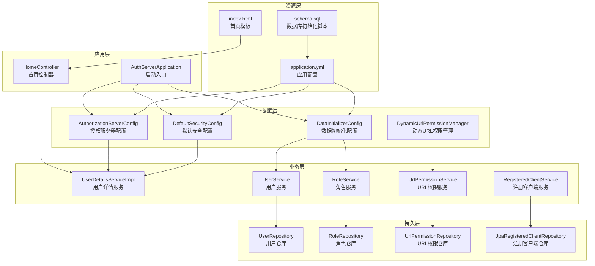
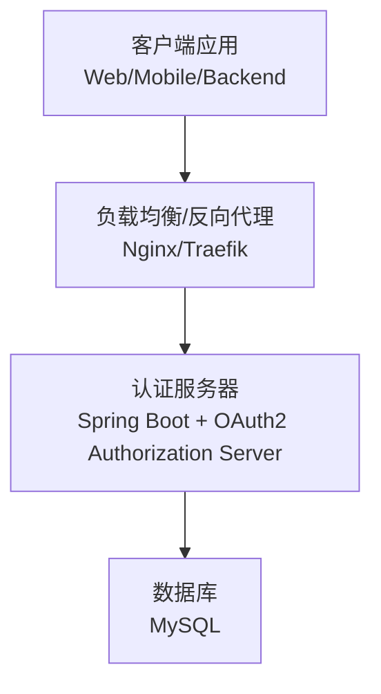
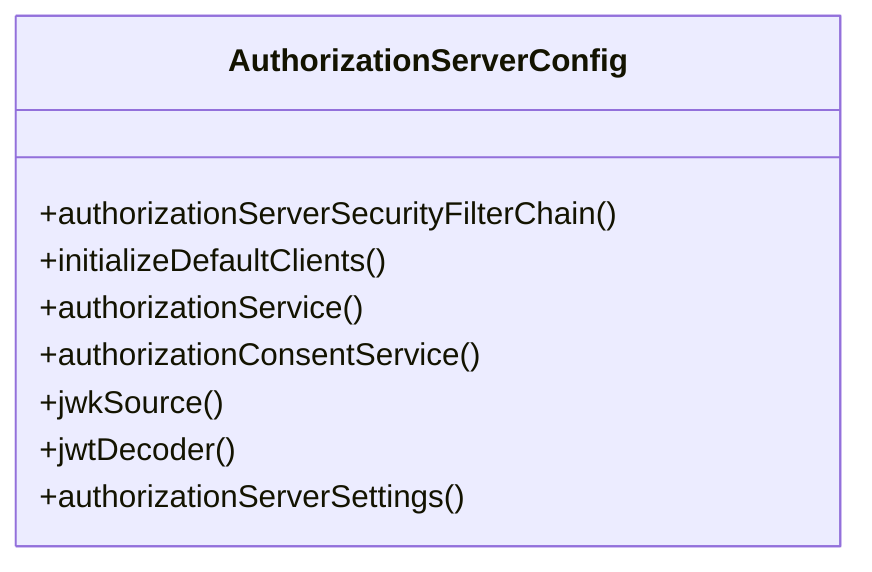
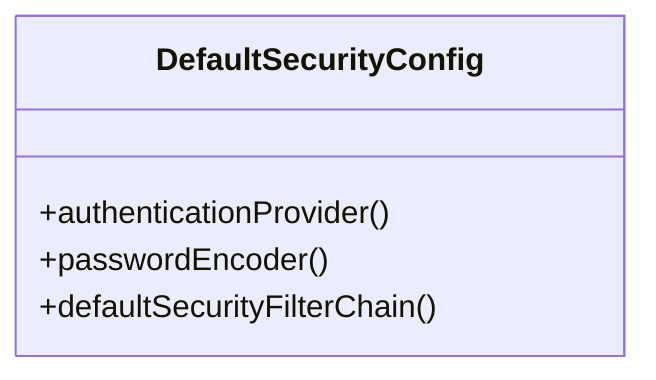
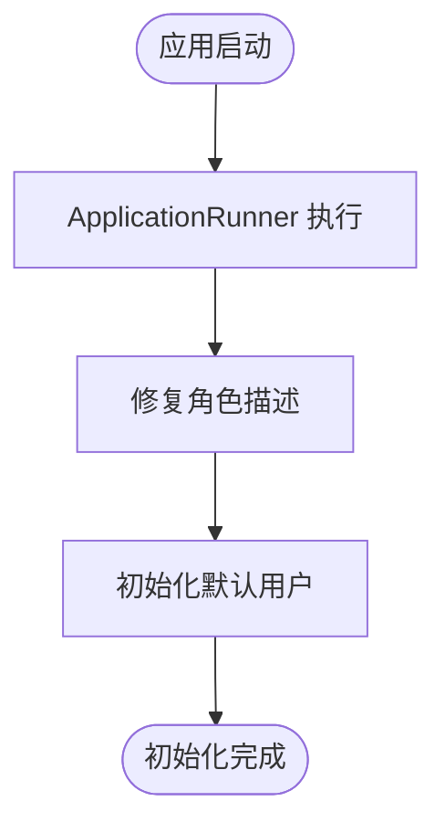
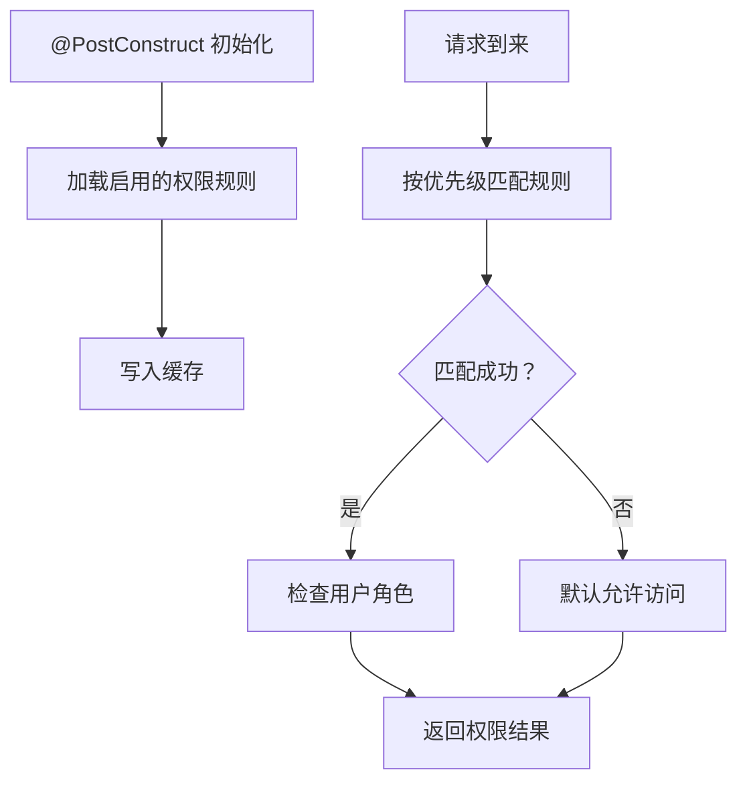
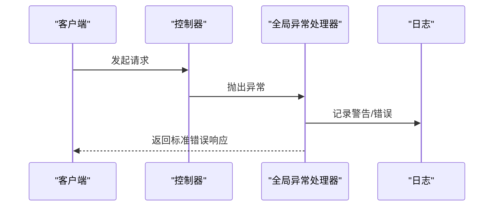
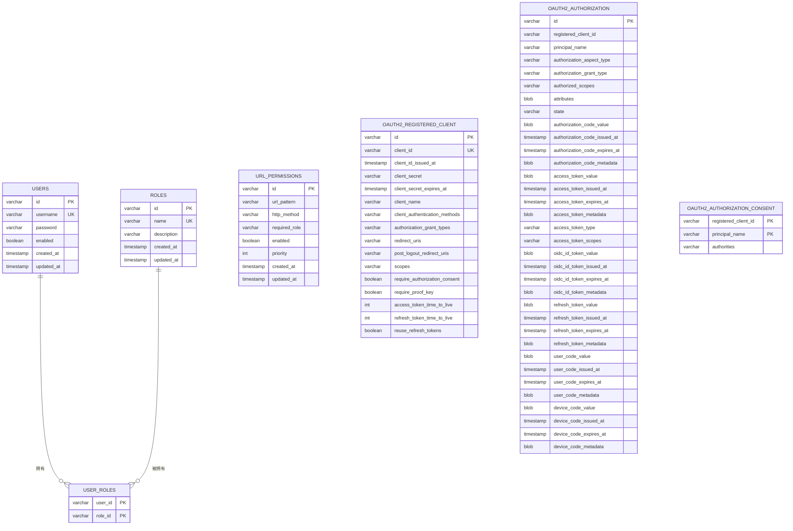
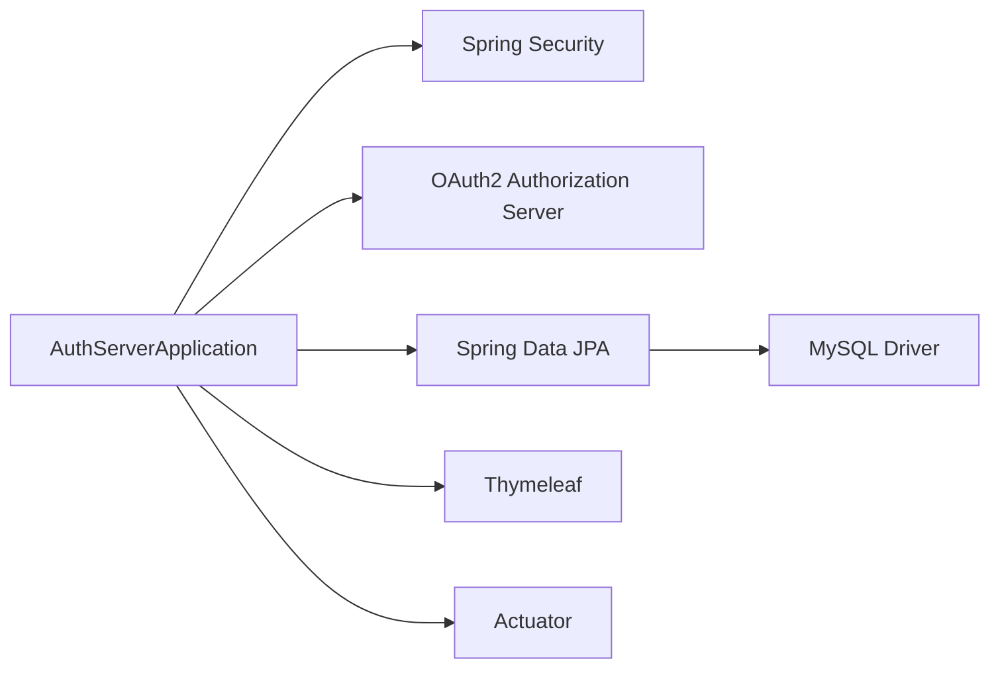

# 部署指南

<cite>
**本文引用的文件**
- [application.yml](file://src/main/resources/application.yml)
- [pom.xml](file://pom.xml)
- [AuthServerApplication.java](file://src/main/java/com/example/authserver/AuthServerApplication.java)
- [AuthorizationServerConfig.java](file://src/main/java/com/example/authserver/config/AuthorizationServerConfig.java)
- [DefaultSecurityConfig.java](file://src/main/java/com/example/authserver/config/DefaultSecurityConfig.java)
- [DataInitializerConfig.java](file://src/main/java/com/example/authserver/config/DataInitializerConfig.java)
- [DynamicUrlPermissionManager.java](file://src/main/java/com/example/authserver/config/DynamicUrlPermissionManager.java)
- [GlobalExceptionHandler.java](file://src/main/java/com/example/authserver/exception/GlobalExceptionHandler.java)
- [schema.sql](file://src/main/resources/schema.sql)
- [index.html](file://src/main/resources/templates/index.html)
- [User.java](file://src/main/java/com/example/authserver/entity/User.java)
- [Role.java](file://src/main/java/com/example/authserver/entity/Role.java)
- [HomeController.java](file://src/main/java/com/example/authserver/controller/HomeController.java)
</cite>

## 目录
1. [简介](#简介)
2. [项目结构](#项目结构)
3. [核心组件](#核心组件)
4. [架构总览](#架构总览)
5. [详细组件分析](#详细组件分析)
6. [依赖分析](#依赖分析)
7. [性能考虑](#性能考虑)
8. [故障排除指南](#故障排除指南)
9. [结论](#结论)
10. [附录](#附录)

## 简介
本指南面向生产环境部署，涵盖以下内容：
- 生产环境配置要求与部署步骤（JVM 参数、系统资源、网络配置）
- Docker 容器化部署方案（Dockerfile 与容器编排建议）
- 数据库部署与配置（MySQL 集群、主从复制、备份策略）
- 负载均衡、SSL 证书与反向代理配置
- 性能监控与日志管理最佳实践（APM 集成与告警）
- 安全加固（防火墙、入侵检测、安全审计）
- 故障排除与应急响应流程

## 项目结构
该项目为基于 Spring Boot 3 的 OAuth2 授权服务器，采用模块化组织：
- 配置层：安全配置、授权服务器配置、数据初始化、动态 URL 权限管理
- 控制器层：首页控制器
- 实体层：用户、角色、URL 权限、注册客户端等
- 仓储层：JPA 仓库接口
- 服务层：用户、角色、URL 权限、注册客户端等服务
- 资源层：模板、数据库初始化脚本、应用配置

图表来源
- [AuthServerApplication.java:1-14](file://src/main/java/com/example/authserver/AuthServerApplication.java#L1-L14)
- [AuthorizationServerConfig.java:1-256](file://src/main/java/com/example/authserver/config/AuthorizationServerConfig.java#L1-L256)
- [DefaultSecurityConfig.java:1-75](file://src/main/java/com/example/authserver/config/DefaultSecurityConfig.java#L1-L75)
- [DataInitializerConfig.java:1-109](file://src/main/java/com/example/authserver/config/DataInitializerConfig.java#L1-L109)
- [DynamicUrlPermissionManager.java:1-120](file://src/main/java/com/example/authserver/config/DynamicUrlPermissionManager.java#L1-L120)
- [HomeController.java:1-24](file://src/main/java/com/example/authserver/controller/HomeController.java#L1-L24)
- [application.yml:1-30](file://src/main/resources/application.yml#L1-L30)
- [schema.sql:1-169](file://src/main/resources/schema.sql#L1-L169)
- [index.html:1-243](file://src/main/resources/templates/index.html#L1-L243)

章节来源
- [AuthServerApplication.java:1-14](file://src/main/java/com/example/authserver/AuthServerApplication.java#L1-L14)
- [application.yml:1-30](file://src/main/resources/application.yml#L1-L30)
- [pom.xml:1-147](file://pom.xml#L1-L147)

## 核心组件
- 启动类：应用入口，负责引导 Spring Boot 应用启动
- 授权服务器配置：启用 OAuth2 授权服务器默认安全策略，配置 OIDC、JWT 解码器、JWK 源、授权服务与授权同意服务
- 默认安全配置：配置认证提供者、密码编码器、表单登录、登出、以及默认过滤链
- 数据初始化配置：启动后初始化默认角色与用户数据
- 动态 URL 权限管理：从数据库加载 URL 权限规则，提供匹配逻辑与缓存
- 全局异常处理：统一处理各类异常，返回标准错误响应
- 应用配置：端口、数据库连接、JPA/Hibernate、SQL 初始化、日志级别等
- 数据库脚本：初始化用户、角色、URL 权限、OAuth2 注册客户端、授权表等

章节来源
- [AuthorizationServerConfig.java:1-256](file://src/main/java/com/example/authserver/config/AuthorizationServerConfig.java#L1-L256)
- [DefaultSecurityConfig.java:1-75](file://src/main/java/com/example/authserver/config/DefaultSecurityConfig.java#L1-L75)
- [DataInitializerConfig.java:1-109](file://src/main/java/com/example/authserver/config/DataInitializerConfig.java#L1-L109)
- [DynamicUrlPermissionManager.java:1-120](file://src/main/java/com/example/authserver/config/DynamicUrlPermissionManager.java#L1-L120)
- [GlobalExceptionHandler.java:1-130](file://src/main/java/com/example/authserver/exception/GlobalExceptionHandler.java#L1-L130)
- [application.yml:1-30](file://src/main/resources/application.yml#L1-L30)
- [schema.sql:1-169](file://src/main/resources/schema.sql#L1-L169)

## 架构总览
应用采用 Spring Security OAuth2 Authorization Server，结合 Spring MVC、Thymeleaf、JPA/Hibernate 与 MySQL 数据库存储。授权服务器负责：
- OAuth2 授权码、刷新令牌、客户端凭证等授权流程
- OIDC 1.0 支持与 JWT 签名/验证
- JDBC 存储授权状态与授权同意
- 动态 URL 权限控制与用户认证

图表来源
- [AuthorizationServerConfig.java:56-77](file://src/main/java/com/example/authserver/config/AuthorizationServerConfig.java#L56-L77)
- [application.yml:4-25](file://src/main/resources/application.yml#L4-L25)

## 详细组件分析

### 授权服务器配置
- 启用 OAuth2 授权服务器默认安全策略
- 启用 OIDC 1.0
- 未认证访问授权端点重定向至登录页
- 配置 JWT 资源服务器与解码器
- 初始化默认客户端（Web 应用、移动端、后端服务），并保存至数据库
- 配置 JDBC 授权服务与授权同意服务
- 生成 RSA JWK 用于 JWT 签名

图表来源
- [AuthorizationServerConfig.java:44-256](file://src/main/java/com/example/authserver/config/AuthorizationServerConfig.java#L44-L256)

章节来源
- [AuthorizationServerConfig.java:56-77](file://src/main/java/com/example/authserver/config/AuthorizationServerConfig.java#L56-L77)
- [AuthorizationServerConfig.java:91-161](file://src/main/java/com/example/authserver/config/AuthorizationServerConfig.java#L91-L161)
- [AuthorizationServerConfig.java:193-206](file://src/main/java/com/example/authserver/config/AuthorizationServerConfig.java#L193-L206)
- [AuthorizationServerConfig.java:211-245](file://src/main/java/com/example/authserver/config/AuthorizationServerConfig.java#L211-L245)

### 默认安全配置
- 认证提供者：基于数据库用户详情服务与密码编码器
- 密码编码器：委托编码器工厂
- 默认过滤链：静态资源与公开端点放行，其余请求需认证；表单登录与登出配置

图表来源
- [DefaultSecurityConfig.java:27-75](file://src/main/java/com/example/authserver/config/DefaultSecurityConfig.java#L27-L75)

章节来源
- [DefaultSecurityConfig.java:34-49](file://src/main/java/com/example/authserver/config/DefaultSecurityConfig.java#L34-L49)
- [DefaultSecurityConfig.java:55-73](file://src/main/java/com/example/authserver/config/DefaultSecurityConfig.java#L55-L73)

### 数据初始化配置
- 使用 ApplicationRunner 在启动后修复角色描述并初始化默认用户
- 密码使用编码器加密后保存
- 角色数据由 SQL 初始化脚本提供

图表来源
- [DataInitializerConfig.java:30-40](file://src/main/java/com/example/authserver/config/DataInitializerConfig.java#L30-L40)
- [DataInitializerConfig.java:45-67](file://src/main/java/com/example/authserver/config/DataInitializerConfig.java#L45-L67)
- [DataInitializerConfig.java:73-95](file://src/main/java/com/example/authserver/config/DataInitializerConfig.java#L73-L95)

章节来源
- [DataInitializerConfig.java:30-40](file://src/main/java/com/example/authserver/config/DataInitializerConfig.java#L30-L40)
- [DataInitializerConfig.java:73-95](file://src/main/java/com/example/authserver/config/DataInitializerConfig.java#L73-L95)

### 动态 URL 权限管理
- 启动时加载所有启用的 URL 权限规则并缓存
- 提供匹配逻辑：按优先级排序，Ant 路径匹配，HTTP 方法匹配
- 支持运行时添加/移除权限规则并记录日志

图表来源
- [DynamicUrlPermissionManager.java:36-54](file://src/main/java/com/example/authserver/config/DynamicUrlPermissionManager.java#L36-L54)
- [DynamicUrlPermissionManager.java:64-81](file://src/main/java/com/example/authserver/config/DynamicUrlPermissionManager.java#L64-L81)
- [DynamicUrlPermissionManager.java:86-95](file://src/main/java/com/example/authserver/config/DynamicUrlPermissionManager.java#L86-L95)

章节来源
- [DynamicUrlPermissionManager.java:27-54](file://src/main/java/com/example/authserver/config/DynamicUrlPermissionManager.java#L27-L54)
- [DynamicUrlPermissionManager.java:64-81](file://src/main/java/com/example/authserver/config/DynamicUrlPermissionManager.java#L64-L81)

### 全局异常处理
- 统一处理资源不存在、冲突、参数验证失败、凭证错误、访问拒绝等异常
- 返回包含时间戳、状态码、消息的标准错误响应

图表来源
- [GlobalExceptionHandler.java:28-34](file://src/main/java/com/example/authserver/exception/GlobalExceptionHandler.java#L28-L34)
- [GlobalExceptionHandler.java:50-62](file://src/main/java/com/example/authserver/exception/GlobalExceptionHandler.java#L50-L62)
- [GlobalExceptionHandler.java:89-95](file://src/main/java/com/example/authserver/exception/GlobalExceptionHandler.java#L89-L95)
- [GlobalExceptionHandler.java:111-118](file://src/main/java/com/example/authserver/exception/GlobalExceptionHandler.java#L111-L118)

章节来源
- [GlobalExceptionHandler.java:28-34](file://src/main/java/com/example/authserver/exception/GlobalExceptionHandler.java#L28-L34)
- [GlobalExceptionHandler.java:50-62](file://src/main/java/com/example/authserver/exception/GlobalExceptionHandler.java#L50-L62)
- [GlobalExceptionHandler.java:89-95](file://src/main/java/com/example/authserver/exception/GlobalExceptionHandler.java#L89-L95)
- [GlobalExceptionHandler.java:111-118](file://src/main/java/com/example/authserver/exception/GlobalExceptionHandler.java#L111-L118)

### 应用配置与数据库脚本
- 应用配置：端口、数据库连接、JPA/Hibernate、SQL 初始化、日志级别
- 数据库脚本：初始化用户、角色、URL 权限、OAuth2 注册客户端、授权表与授权同意表

图表来源
- [schema.sql:8-19](file://src/main/resources/schema.sql#L8-L19)
- [schema.sql:22-41](file://src/main/resources/schema.sql#L22-L41)
- [schema.sql:60-81](file://src/main/resources/schema.sql#L60-L81)
- [schema.sql:83-141](file://src/main/resources/schema.sql#L83-L141)

章节来源
- [application.yml:1-30](file://src/main/resources/application.yml#L1-L30)
- [schema.sql:8-19](file://src/main/resources/schema.sql#L8-L19)
- [schema.sql:22-41](file://src/main/resources/schema.sql#L22-L41)
- [schema.sql:60-81](file://src/main/resources/schema.sql#L60-L81)
- [schema.sql:83-141](file://src/main/resources/schema.sql#L83-L141)

## 依赖分析
- Spring Boot 3.2.3（Java 17）
- Spring Security OAuth2 Authorization Server
- Spring Data JPA + Hibernate
- MySQL Connector/J
- Thymeleaf + Spring Security 集成
- Actuator（生产监控）

图表来源
- [pom.xml:29-114](file://pom.xml#L29-L114)
- [AuthServerApplication.java:1-14](file://src/main/java/com/example/authserver/AuthServerApplication.java#L1-L14)

章节来源
- [pom.xml:29-114](file://pom.xml#L29-L114)

## 性能考虑
- JVM 参数建议
  - 堆大小：根据实例内存与 GC 行为调整，建议初始堆与最大堆一致以减少扩容抖动
  - GC：G1GC 或 ZGC（取决于 JDK 版本），开启并行 GC 日志
  - JIT：保留默认
  - 其他：线程栈大小、元空间、直接内存等按实际场景微调
- 线程池与连接池
  - Tomcat/NIO 线程池：根据 CPU 核数与并发请求量配置
  - 数据库连接池：HikariCP 默认参数通常足够，可根据连接超时、空闲回收策略微调
- 数据库优化
  - 为 URL 权限表的 url_pattern、enabled 建立索引（脚本已提供）
  - 合理设置事务隔离级别与批量写入策略
- 缓存
  - 动态 URL 权限管理器已内置缓存，建议配合失效策略与热更新机制
- 监控
  - Actuator 暴露健康检查、指标端点
  - 结合 APM（如 SkyWalking、Pinpoint、New Relic）进行分布式追踪与性能分析
- 日志
  - 生产环境降低日志级别，避免高频 I/O
  - 使用异步日志框架（如 Logback Async），并配置滚动策略

[本节为通用指导，不直接分析具体文件]

## 故障排除指南
- 启动失败（数据库连接）
  - 检查数据库地址、端口、凭据与字符集设置
  - 确认数据库已创建且具备初始化脚本权限
- OAuth2 授权失败
  - 检查客户端配置（授权类型、重定向 URI、作用域）
  - 确认 JWK 生成与 JWT 解码器配置正确
- 权限控制异常
  - 检查动态 URL 权限规则是否正确加载与缓存
  - 确认用户角色与所需角色匹配
- 登录/登出异常
  - 检查默认安全配置与表单登录、登出路径
- 全局异常处理
  - 关注统一错误响应格式，定位具体异常类型与堆栈

章节来源
- [application.yml:4-9](file://src/main/resources/application.yml#L4-L9)
- [AuthorizationServerConfig.java:211-245](file://src/main/java/com/example/authserver/config/AuthorizationServerConfig.java#L211-L245)
- [DynamicUrlPermissionManager.java:36-54](file://src/main/java/com/example/authserver/config/DynamicUrlPermissionManager.java#L36-L54)
- [DefaultSecurityConfig.java:55-73](file://src/main/java/com/example/authserver/config/DefaultSecurityConfig.java#L55-L73)
- [GlobalExceptionHandler.java:28-34](file://src/main/java/com/example/authserver/exception/GlobalExceptionHandler.java#L28-L34)

## 结论
本指南提供了从应用配置、数据库脚本到生产部署与运维的完整路径。建议在生产环境中：
- 使用独立数据库实例或集群，配置主从复制与备份
- 通过反向代理与负载均衡实现高可用
- 配置 SSL/TLS 与安全头部
- 集成 APM 与日志平台，建立完善的监控与告警体系
- 制定安全加固与应急响应流程

[本节为总结性内容，不直接分析具体文件]

## 附录

### 生产环境配置清单
- 系统资源
  - CPU：至少 2 核，推荐 4 核以上
  - 内存：至少 2GB，推荐 4GB+（含数据库与应用）
  - 磁盘：SSD，预留 20% 空闲
- 网络
  - 开放端口：应用端口（默认 9000）、数据库端口（默认 6666）、反向代理端口
  - 防火墙：仅开放必要端口，限制来源 IP
- JVM 参数（示例）
  - -Xms2g -Xmx2g -XX:+UseG1GC -XX:MaxGCPauseMillis=200
  - -Djava.security.egd=file:/dev/./urandom
- 应用配置
  - server.port、datasource.url、username、password
  - JPA/Hibernate、SQL 初始化、日志级别
- 数据库
  - MySQL 8+，字符集 utf8mb4，排序规则 utf8mb4_unicode_ci
  - 为 URL 权限表建立索引，合理设置 innodb_buffer_pool_size

章节来源
- [application.yml:1-30](file://src/main/resources/application.yml#L1-L30)
- [schema.sql:42-56](file://src/main/resources/schema.sql#L42-L56)

### Docker 容器化部署方案
- Dockerfile（示例思路）
  - 基于官方 OpenJDK 17 镜像
  - 复制构建产物（jar）并设置工作目录
  - 暴露应用端口
  - 设置 JVM 参数与启动命令
  - 健康检查端点（Actuator）
- 容器编排（Compose 示例思路）
  - 服务：认证服务器、MySQL
  - 网络：自定义桥接网络
  - 环境变量：数据库连接、JVM 参数
  - 卷：日志、配置挂载
  - 健康检查与重启策略
- 反向代理（Nginx/Traefik）
  - 负载均衡多个认证服务器实例
  - SSL 终止与证书管理
  - 超时、缓冲区、压缩等优化

[本节为概念性方案，不直接分析具体文件]

### 数据库部署与配置
- MySQL 集群/主从复制
  - 主库写入，从库读取，配置半同步复制
  - GTID 一致性与 binlog 配置
- 备份策略
  - 全量备份 + 增量备份 + binlog 归档
  - 定期校验与异地容灾
- 权限与安全
  - 为应用单独账号，最小权限原则
  - 禁用远程 root 登录，启用强密码策略

[本节为通用指导，不直接分析具体文件]

### 负载均衡、SSL 与反向代理
- 负载均衡
  - Nginx/Traefik/HAProxy，会话保持或无状态设计
- SSL 证书
  - Let’s Encrypt 自动续期，强制 HTTPS
- 反向代理
  - 超时、缓冲区、压缩、安全头设置

[本节为通用指导，不直接分析具体文件]

### 性能监控与日志管理
- APM 集成
  - 分布式追踪、指标采集、告警规则
- 日志管理
  - 结构化日志、异步写入、滚动策略、集中化收集
- 告警
  - 基于阈值与异常模式的告警，分级处理

[本节为通用指导，不直接分析具体文件]

### 安全加固
- 防火墙
  - 仅开放必要端口，限制来源 IP
- 入侵检测
  - WAF/IDS 部署，异常流量阻断
- 安全审计
  - 登录、权限变更、敏感操作审计日志
- 证书与密钥
  - 证书轮换、密钥隔离、定期轮换

[本节为通用指导，不直接分析具体文件]